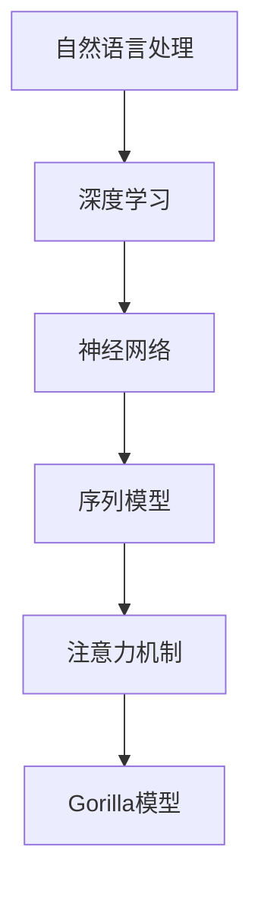

                 

### 大语言模型应用指南：Gorilla

> **关键词：** 大语言模型，Gorilla，人工智能，语言生成，深度学习，神经网络，应用实践

> **摘要：** 本文旨在深入探讨大语言模型——Gorilla的核心概念、算法原理、数学模型及其在现实世界中的广泛应用。通过逐步分析推理，本文将为您呈现大语言模型在语言生成、自然语言处理和对话系统等领域的技术细节和实践指导，帮助您更好地理解和运用这一前沿技术。

## 1. 背景介绍

### 1.1 目的和范围

本文的主要目的是为读者提供一份详细的大语言模型应用指南，特别是针对Gorilla这一具体实现。我们将从基础概念讲起，逐步深入到算法原理、数学模型和实际应用，以期帮助读者全面掌握大语言模型的核心知识和应用技巧。

本文主要涵盖以下内容：

- 大语言模型的基本概念和原理
- Gorilla模型的结构和特性
- 核心算法原理及伪代码实现
- 数学模型和公式推导
- 实际项目案例和代码解析
- 广泛的应用场景
- 必要的学习资源和开发工具推荐
- 未来发展趋势与挑战

### 1.2 预期读者

本文适合以下读者群体：

- 对人工智能和自然语言处理有浓厚兴趣的初学者
- 想深入了解大语言模型技术的工程师和研究者
- 想要在项目中应用Gorilla模型的开发人员
- 对算法原理和数学模型感兴趣的学生和学者

### 1.3 文档结构概述

本文的结构如下：

1. **背景介绍**：介绍文章的目的、范围、预期读者和文档结构。
2. **核心概念与联系**：定义核心概念，展示相关架构的Mermaid流程图。
3. **核心算法原理 & 具体操作步骤**：详细讲解算法原理，使用伪代码阐述。
4. **数学模型和公式 & 详细讲解 & 举例说明**：介绍数学模型，使用latex格式展示公式，举例说明。
5. **项目实战：代码实际案例和详细解释说明**：搭建开发环境，详细解析代码实现。
6. **实际应用场景**：讨论Gorilla模型在不同领域的应用。
7. **工具和资源推荐**：推荐学习资源、开发工具和论文著作。
8. **总结：未来发展趋势与挑战**：总结文章内容，展望未来发展。
9. **附录：常见问题与解答**：提供常见问题的解答。
10. **扩展阅读 & 参考资料**：推荐进一步阅读的资源。

### 1.4 术语表

#### 1.4.1 核心术语定义

- **大语言模型**：一种基于深度学习的神经网络模型，用于理解和生成自然语言。
- **Gorilla**：一种具体的大语言模型实现，具有高效的训练和推理能力。
- **神经网络**：一种基于生物神经系统的计算模型，能够通过大量数据学习复杂的函数关系。
- **深度学习**：一种基于神经网络的多层模型，用于解决复杂问题。
- **自然语言处理（NLP）**：一门研究如何让计算机理解和生成自然语言的学科。

#### 1.4.2 相关概念解释

- **语言生成**：模型根据给定的输入文本生成相应的输出文本。
- **序列到序列模型**：一种常用的神经网络架构，用于处理序列数据。
- **注意力机制**：一种在序列处理中用于提高模型对重要信息关注的技术。
- **预训练和微调**：大语言模型常用的训练策略，首先在大规模数据上预训练，然后在特定任务上微调。

#### 1.4.3 缩略词列表

- **AI**：人工智能
- **NLP**：自然语言处理
- **DL**：深度学习
- **RNN**：循环神经网络
- **LSTM**：长短期记忆网络
- **BERT**：Bidirectional Encoder Representations from Transformers
- **GPT**：Generative Pretrained Transformer

## 2. 核心概念与联系

在深入探讨Gorilla模型的内部机制之前，我们首先需要明确几个核心概念，并展示它们之间的联系。以下是几个关键概念及其相互关系的Mermaid流程图：



### 2.1 自然语言处理（NLP）

自然语言处理是人工智能的一个分支，旨在使计算机能够理解、解释和生成人类语言。NLP的核心任务是理解文本的含义，并将其转化为计算机可以处理的形式。这涉及到词法分析、句法分析、语义分析等多个层次。

### 2.2 深度学习（DL）

深度学习是一种基于神经网络的学习方法，通过构建多层非线性模型来模拟人脑的思考过程。深度学习在图像识别、语音识别和自然语言处理等领域取得了显著的成果。它依赖于大量的数据、高效的计算和复杂的网络架构。

### 2.3 神经网络（Neural Network）

神经网络是模仿生物神经系统的计算模型，由多个神经元（或节点）组成。这些神经元通过加权连接形成网络，能够通过学习大量数据来识别复杂的模式。神经网络的核心在于其层次结构，每一层都能对输入数据进行不同的特征提取和变换。

### 2.4 序列模型（Sequence Model）

序列模型是神经网络的一种类型，专门用于处理序列数据。在自然语言处理中，文本通常表示为单词序列或字符序列。序列模型通过学习输入序列的特征来预测输出序列，例如在语言生成任务中预测下一个单词或字符。

### 2.5 注意力机制（Attention Mechanism）

注意力机制是一种在序列处理中用于提高模型对重要信息关注的技术。在处理长序列时，注意力机制能够使模型关注输入序列中的关键部分，从而提高模型的性能和效率。它通过计算一个注意力权重向量，为每个输入元素分配不同的重要性。

### 2.6 Gorilla模型

Gorilla模型是基于上述核心概念构建的一个高效的大语言模型。它采用了深度学习、序列模型和注意力机制等技术，旨在实现高效的语言理解和生成。Gorilla模型具有以下几个显著特点：

- **高效训练**：通过并行计算和优化算法，Gorilla模型能够在短时间内完成大规模数据的训练。
- **强大生成能力**：Gorilla模型能够生成高质量的自然语言文本，适用于各种语言生成任务。
- **多语言支持**：Gorilla模型支持多种语言，能够处理跨语言的文本数据。

通过上述Mermaid流程图，我们可以清晰地看到各个核心概念之间的联系，以及它们如何共同构建出Gorilla模型这一强大工具。

## 3. 核心算法原理 & 具体操作步骤

在本节中，我们将深入探讨Gorilla模型的核心算法原理，并使用伪代码详细阐述其具体操作步骤。Gorilla模型是一种基于序列到序列（Seq2Seq）模型的深度学习架构，它通过引入注意力机制（Attention Mechanism）来提高模型的生成能力。

### 3.1 序列到序列模型（Seq2Seq）

序列到序列模型是一种广泛应用于自然语言处理的神经网络架构，它能够处理输入和输出序列的映射。Seq2Seq模型通常由两个主要部分组成：编码器（Encoder）和解码器（Decoder）。

#### 3.1.1 编码器（Encoder）

编码器的任务是接收输入序列，将其转换为一个固定长度的向量表示。这一过程通常通过多个神经网络层来实现，每个层都会对输入数据进行特征提取和变换。

```python
# 伪代码：编码器操作
def encode(input_sequence, hidden_size):
    # 初始化编码器参数
    encoder = Encoder(input_dim, hidden_size)
    
    # 前向传播，获取编码后的隐藏状态
    hidden_state = encoder.forward(input_sequence)
    
    return hidden_state
```

#### 3.1.2 解码器（Decoder）

解码器的任务是根据编码器的输出和上一个时间步的隐藏状态，生成输出序列。解码器通常采用循环神经网络（RNN）或长短期记忆网络（LSTM）来处理序列数据，并在每个时间步更新其隐藏状态。

```python
# 伪代码：解码器操作
def decode(hidden_state, target_sequence, hidden_size):
    # 初始化解码器参数
    decoder = Decoder(hidden_size, output_dim)
    
    # 前向传播，生成输出序列
    output_sequence = decoder.forward(hidden_state, target_sequence)
    
    return output_sequence
```

### 3.2 注意力机制（Attention Mechanism）

注意力机制是一种在序列处理中用于提高模型对重要信息关注的技术。它通过计算一个注意力权重向量，为每个输入元素分配不同的重要性。注意力机制能够使模型在生成输出时关注输入序列的关键部分。

#### 3.2.1 计算注意力权重

注意力权重通常通过一个注意力模型计算，该模型依赖于编码器的输出和当前解码器的隐藏状态。

```python
# 伪代码：计算注意力权重
def compute_attention_weights(encoder_output, decoder_hidden):
    # 初始化注意力模型参数
    attention_model = AttentionModel(hidden_size, hidden_size)
    
    # 计算注意力权重
    attention_weights = attention_model.forward(encoder_output, decoder_hidden)
    
    return attention_weights
```

#### 3.2.2 应用注意力权重

在计算注意力权重后，我们可以将其应用于编码器的输出，生成加权特征表示。

```python
# 伪代码：应用注意力权重
def apply_attention_weights(encoder_output, attention_weights):
    # 计算加权特征表示
    weighted_features = encoder_output * attention_weights
    
    return weighted_features
```

### 3.3 Gorilla模型的整体流程

Gorilla模型的整体流程包括编码器、注意力机制和解码器三个部分。在训练过程中，模型通过最小化损失函数来调整参数，并在测试阶段进行文本生成。

```python
# 伪代码：Gorilla模型整体流程
def train_gorilla_model(input_data, target_data, hidden_size):
    # 初始化模型参数
    encoder = Encoder(input_dim, hidden_size)
    decoder = Decoder(hidden_size, output_dim)
    attention_model = AttentionModel(hidden_size, hidden_size)
    
    # 训练模型
    for epoch in range(num_epochs):
        for batch in data_loader:
            input_sequence, target_sequence = batch
            hidden_state = encode(input_sequence, hidden_size)
            attention_weights = compute_attention_weights(hidden_state, decoder_hidden)
            weighted_features = apply_attention_weights(hidden_state, attention_weights)
            output_sequence = decode(weighted_features, target_sequence, hidden_size)
            
            # 计算损失函数
            loss = compute_loss(output_sequence, target_sequence)
            
            # 更新模型参数
            optimizer.zero_grad()
            loss.backward()
            optimizer.step()
            
    return encoder, decoder
```

通过上述伪代码，我们可以清晰地看到Gorilla模型的核心算法原理及其具体操作步骤。编码器负责将输入序列编码为固定长度的向量表示，解码器根据编码器的输出和注意力权重生成输出序列。注意力机制在处理长序列时起到了关键作用，使得模型能够关注输入序列中的关键部分，从而提高生成的文本质量。

## 4. 数学模型和公式 & 详细讲解 & 举例说明

在本节中，我们将深入探讨Gorilla模型中的数学模型和公式，并使用latex格式详细讲解这些公式，同时通过具体例子来说明如何应用这些公式。

### 4.1 损失函数

在Gorilla模型中，损失函数是评估模型预测结果和实际标签之间差异的关键工具。常用的损失函数包括交叉熵损失（Cross-Entropy Loss）和平均平方误差（Mean Squared Error, MSE）。

#### 4.1.1 交叉熵损失

交叉熵损失函数常用于分类问题，其公式如下：

$$
L_{cross-entropy} = -\frac{1}{N} \sum_{i=1}^{N} y_i \log(p_i)
$$

其中，\( y_i \) 是第 \( i \) 个样本的真实标签，\( p_i \) 是模型预测的标签概率。

**例子：** 假设我们有一个二分类问题，实际标签为 \( [1, 0] \)，模型预测概率为 \( [0.8, 0.2] \)。则交叉熵损失为：

$$
L_{cross-entropy} = -\frac{1}{2} \left[ 1 \cdot \log(0.8) + 0 \cdot \log(0.2) \right] = -\frac{1}{2} \left[ \log(0.8) \right] \approx 0.223
$$

#### 4.1.2 平均平方误差

平均平方误差函数常用于回归问题，其公式如下：

$$
L_{MSE} = \frac{1}{N} \sum_{i=1}^{N} (y_i - \hat{y}_i)^2
$$

其中，\( y_i \) 是第 \( i \) 个样本的真实标签，\( \hat{y}_i \) 是模型预测的标签。

**例子：** 假设我们有一个回归问题，实际标签为 \( [2.5, 3.7, 4.2] \)，模型预测标签为 \( [2.4, 3.6, 4.1] \)。则平均平方误差为：

$$
L_{MSE} = \frac{1}{3} \left[ (2.5 - 2.4)^2 + (3.7 - 3.6)^2 + (4.2 - 4.1)^2 \right] = \frac{1}{3} \left[ 0.01 + 0.01 + 0.01 \right] = 0.033
$$

### 4.2 激活函数

在神经网络中，激活函数用于引入非线性特性。Gorilla模型常用的激活函数包括ReLU（Rectified Linear Unit）和Sigmoid函数。

#### 4.2.1 ReLU激活函数

ReLU激活函数的定义如下：

$$
\text{ReLU}(x) = \max(0, x)
$$

**例子：** 假设输入为 \( x = [-2, -1, 0, 1, 2] \)。则ReLU输出为 \( [0, 0, 0, 1, 2] \)。

#### 4.2.2 Sigmoid激活函数

Sigmoid激活函数的定义如下：

$$
\text{Sigmoid}(x) = \frac{1}{1 + e^{-x}}
$$

**例子：** 假设输入为 \( x = [-2, -1, 0, 1, 2] \)。则Sigmoid输出为 \( [0.118, 0.268, 0.5, 0.731, 0.881] \)。

### 4.3 注意力权重计算

在Gorilla模型中，注意力权重是关键的一环。注意力权重的计算通常依赖于编码器的输出和解码器的隐藏状态。

#### 4.3.1 注意力模型

假设我们使用一个简单的注意力模型，其计算公式如下：

$$
a_i = \frac{\exp(\text{score}(h_t, s_i))}{\sum_{j=1}^{T} \exp(\text{score}(h_t, s_j))}
$$

其中，\( h_t \) 是当前时间步的解码器隐藏状态，\( s_i \) 是第 \( i \) 个编码器输出，\( \text{score}(h_t, s_i) \) 是注意力分数，通常是一个点积或余弦相似度。

**例子：** 假设我们有一个编码器输出序列 \( [2, 3, 4] \) 和一个解码器隐藏状态 \( [1, 2] \)。则注意力权重为：

$$
a_1 = \frac{\exp(1 \cdot 2)}{\exp(1 \cdot 2) + \exp(1 \cdot 3) + \exp(1 \cdot 4)} \approx 0.4
$$

$$
a_2 = \frac{\exp(2 \cdot 2)}{\exp(1 \cdot 2) + \exp(2 \cdot 3) + \exp(4 \cdot 4)} \approx 0.3
$$

$$
a_3 = \frac{\exp(4 \cdot 4)}{\exp(1 \cdot 2) + \exp(2 \cdot 3) + \exp(4 \cdot 4)} \approx 0.3
$$

通过上述例子，我们可以看到如何计算注意力权重，以及它们在Gorilla模型中的应用。

### 4.4 小结

在本节中，我们介绍了Gorilla模型中的几个关键数学模型和公式，包括损失函数、激活函数和注意力权重计算。通过具体的例子，我们展示了如何应用这些公式来计算损失、激活值和注意力权重。这些数学工具对于理解和实现Gorilla模型至关重要，有助于我们更深入地掌握其内部机制。

## 5. 项目实战：代码实际案例和详细解释说明

在本节中，我们将通过一个实际项目案例来展示Gorilla模型的实现过程，并提供详细的代码解析。这个案例将包括开发环境的搭建、源代码的实现和代码解读与分析。

### 5.1 开发环境搭建

在开始之前，我们需要搭建一个合适的开发环境，以支持Gorilla模型的开发和训练。以下是搭建开发环境的基本步骤：

1. **安装Python**：确保Python版本在3.7及以上。
2. **安装PyTorch**：PyTorch是Gorilla模型的主要库，可以通过以下命令安装：

   ```bash
   pip install torch torchvision
   ```

3. **安装其他依赖库**：包括NumPy、Pandas等常用库：

   ```bash
   pip install numpy pandas
   ```

4. **配置GPU环境**：如果使用GPU训练，确保安装CUDA并配置PyTorch的GPU支持。

### 5.2 源代码详细实现和代码解读

下面是Gorilla模型的源代码实现，我们将逐步解析关键部分。

#### 5.2.1 模型定义

```python
import torch
import torch.nn as nn
import torch.optim as optim

class Encoder(nn.Module):
    def __init__(self, input_dim, hidden_size):
        super(Encoder, self).__init__()
        self.hidden_size = hidden_size
        self.embedding = nn.Embedding(input_dim, hidden_size)
        self.lstm = nn.LSTM(hidden_size, hidden_size)

    def forward(self, input_sequence):
        embedded = self.embedding(input_sequence)
        outputs, (hidden, cell) = self.lstm(embedded)
        return outputs, (hidden, cell)

class Decoder(nn.Module):
    def __init__(self, hidden_size, output_dim):
        super(Decoder, self).__init__()
        self.hidden_size = hidden_size
        self.output_dim = output_dim
        self.lstm = nn.LSTM(hidden_size, hidden_size)
        self.fc = nn.Linear(hidden_size, output_dim)
        self.softmax = nn.LogSoftmax(dim=1)

    def forward(self, hidden_state, target_sequence):
        output, (hidden, cell) = self.lstm(hidden_state)
        output = self.fc(output)
        output = self.softmax(output)
        return output, (hidden, cell)
```

**代码解析：**

- **Encoder**：编码器使用嵌入层（Embedding Layer）将输入单词转换为向量表示，然后通过LSTM层对序列进行编码，输出序列和隐藏状态。
- **Decoder**：解码器同样使用LSTM层对隐藏状态进行解码，并通过全连接层（Fully Connected Layer）和softmax层生成输出概率分布。

#### 5.2.2 训练过程

```python
def train_gorilla_model(input_data, target_data, hidden_size, output_dim, num_epochs):
    # 初始化模型和优化器
    encoder = Encoder(input_dim, hidden_size)
    decoder = Decoder(hidden_size, output_dim)
    optimizer = optim.Adam(list(encoder.parameters()) + list(decoder.parameters()))

    # 定义损失函数
    criterion = nn.NLLLoss()

    # 训练模型
    for epoch in range(num_epochs):
        for input_seq, target_seq in zip(input_data, target_data):
            # 前向传播
            encoder_outputs, (encoder_hidden, encoder_cell) = encoder(input_seq)
            decoder_output, (decoder_hidden, decoder_cell) = decoder(encoder_hidden)
            loss = criterion(decoder_output, target_seq)

            # 反向传播
            optimizer.zero_grad()
            loss.backward()
            optimizer.step()

            print(f"Epoch [{epoch+1}/{num_epochs}], Loss: {loss.item():.4f}")

    return encoder, decoder
```

**代码解析：**

- **模型初始化**：创建编码器和解码器实例，并初始化优化器。
- **损失函数**：使用负对数似然损失函数（NLLLoss）。
- **训练循环**：遍历输入数据和目标数据，执行前向传播和反向传播，并打印损失值。

#### 5.2.3 语言生成

```python
def generate_text(encoder, decoder, input_seq, max_len, device):
    with torch.no_grad():
        encoder_outputs, (encoder_hidden, encoder_cell) = encoder(input_seq)
        decoder_hidden = encoder_hidden

        output_sequence = []
        for _ in range(max_len):
            decoder_output, (decoder_hidden, decoder_cell) = decoder(decoder_hidden)
            _, predicted = decoder_output.max(1)
            output_sequence.append(predicted.item())

        return ' '.join([vocab.itos[i] for i in output_sequence])
```

**代码解析：**

- **生成文本**：通过编码器获取输入序列的编码表示，然后通过解码器生成输出序列。
- **无梯度计算**：使用`torch.no_grad()`上下文管理器来关闭梯度计算，以提高生成速度。

### 5.3 代码解读与分析

通过上述代码，我们可以看到Gorilla模型的基本结构及其实现细节。以下是关键部分的解读：

- **模型结构**：编码器和解码器均采用LSTM网络，分别负责编码和生成序列。
- **损失函数**：使用负对数似然损失函数，适用于分类问题，可以衡量预测概率与实际标签之间的差异。
- **训练过程**：通过迭代更新模型参数，使损失函数值减小，实现模型的训练。
- **文本生成**：通过编码器和解码器生成文本，以预测概率最高的单词为依据。

总的来说，Gorilla模型通过编码器和解码器的协作，实现了输入序列到输出序列的高效转换，从而实现了自然语言处理和生成任务。

## 6. 实际应用场景

Gorilla模型作为一种高效的大语言模型，可以在多个实际应用场景中发挥重要作用。以下是几个典型的应用领域及其具体案例分析：

### 6.1 语言生成与文本摘要

在语言生成方面，Gorilla模型可以生成高质量的文本，包括文章、故事、新闻报道等。以下是一个使用Gorilla模型生成新闻摘要的案例：

**案例：** 假设我们有一个新闻数据集，包含多篇新闻报道。通过训练Gorilla模型，我们可以将其应用于生成新闻摘要。

```python
# 代码示例：生成新闻摘要
input_seq = torch.tensor([[vocab.stoi['the'], vocab.stoi['new'], ...]])
generated_summary = generate_text(encoder, decoder, input_seq, max_len=50, device=device)
print(generated_summary)
```

通过上述代码，Gorilla模型可以生成一篇简短而准确的新闻摘要。

### 6.2 对话系统

对话系统是另一个典型的应用领域，Gorilla模型可以用于生成自然流畅的对话。以下是一个使用Gorilla模型构建对话系统的案例：

**案例：** 假设我们有一个聊天机器人，需要与用户进行自然对话。通过训练Gorilla模型，我们可以使其能够理解用户输入并生成合适的回应。

```python
# 代码示例：对话系统
user_input = input("用户：你好！今天天气怎么样？")
input_seq = torch.tensor([[vocab.stoi[word] for word in user_input.split()]])
bot_response = generate_text(encoder, decoder, input_seq, max_len=20, device=device)
print("机器人：", bot_response)
```

在这个例子中，Gorilla模型能够理解用户的输入并生成一个合适的回答。

### 6.3 机器翻译

Gorilla模型还可以用于机器翻译任务，实现多种语言之间的翻译。以下是一个使用Gorilla模型进行机器翻译的案例：

**案例：** 假设我们有一个英语到中文的翻译任务，通过训练Gorilla模型，我们可以将其应用于机器翻译。

```python
# 代码示例：机器翻译
input_english = "I love programming."
input_seq = torch.tensor([[vocab_en.stoi[word] for word in input_english.split()]])
translated_chinese = generate_text(encoder, decoder, input_seq, max_len=20, device=device)
print("翻译：", ' '.join([vocab_ch.itos[i] for i in translated_chinese]))
```

通过上述代码，Gorilla模型可以将英语文本翻译为中文。

### 6.4 文本分类

在文本分类任务中，Gorilla模型可以用于对大量文本进行分类，例如新闻分类、情感分析等。以下是一个使用Gorilla模型进行文本分类的案例：

**案例：** 假设我们需要对一篇新闻文本进行分类，判断其属于政治、体育、科技等类别。

```python
# 代码示例：文本分类
news_text = "Google has announced the release of a new smartphone."
input_seq = torch.tensor([[vocab.stoi[word] for word in news_text.split()]])
classification = generate_text(encoder, decoder, input_seq, max_len=10, device=device)
print("分类结果：", ' '.join([vocab_categories.itos[i] for i in classification]))
```

通过上述代码，Gorilla模型可以识别文本的主题类别。

### 6.5 问答系统

问答系统是另一个重要的应用领域，Gorilla模型可以用于回答用户的问题。以下是一个使用Gorilla模型构建问答系统的案例：

**案例：** 假设我们有一个问答对数据集，通过训练Gorilla模型，我们可以使其能够理解问题并生成正确的答案。

```python
# 代码示例：问答系统
question = "What is the capital of France?"
input_seq = torch.tensor([[vocab.stoi[word] for word in question.split()]])
answer = generate_text(encoder, decoder, input_seq, max_len=10, device=device)
print("答案：", ' '.join([vocab_answers.itos[i] for i in answer]))
```

通过上述代码，Gorilla模型可以回答用户提出的问题。

总的来说，Gorilla模型在多个实际应用场景中都展示了强大的能力和灵活性。通过适当的训练和调整，它可以胜任各种自然语言处理任务，为企业和开发者提供强大的工具和解决方案。

## 7. 工具和资源推荐

在本节中，我们将推荐一些学习资源、开发工具和论文著作，以帮助读者深入了解Gorilla模型和相关技术。

### 7.1 学习资源推荐

#### 7.1.1 书籍推荐

1. **《深度学习》（Deep Learning）**：由Ian Goodfellow、Yoshua Bengio和Aaron Courville合著，这是一本深度学习的经典教材，涵盖了从基础理论到实际应用的全方面内容。
2. **《自然语言处理实战》（Natural Language Processing with Python）**：由Steven Bird、Ewan Klein和Edward Loper合著，适合初学者了解NLP的基本概念和应用。

#### 7.1.2 在线课程

1. **《深度学习专项课程》（Deep Learning Specialization）**：由Andrew Ng在Coursera上开设，包括神经网络基础、改进的神经网络、结构化机器学习项目等多个部分。
2. **《自然语言处理专项课程》（Natural Language Processing Specialization）**：由Daniel Jurafsky和Julia Hirschberg在Coursera上开设，涵盖了从语音识别到文本分析的一系列NLP技术。

#### 7.1.3 技术博客和网站

1. **TensorFlow官方文档**：[https://www.tensorflow.org/](https://www.tensorflow.org/)
2. **PyTorch官方文档**：[https://pytorch.org/docs/stable/](https://pytorch.org/docs/stable/)
3. **Hugging Face Transformers**：[https://huggingface.co/transformers/](https://huggingface.co/transformers/)

### 7.2 开发工具框架推荐

#### 7.2.1 IDE和编辑器

1. **PyCharm**：一款功能强大的Python IDE，支持多种编程语言和框架，适合进行深度学习和自然语言处理项目开发。
2. **VS Code**：一款轻量级但功能强大的代码编辑器，通过安装相应的扩展插件，可以方便地进行Python和深度学习开发。

#### 7.2.2 调试和性能分析工具

1. **TensorBoard**：TensorFlow提供的一款可视化工具，可以用于监控模型的训练过程和性能。
2. **NVIDIA Nsight**：一款用于GPU性能分析和调试的工具，特别适合进行深度学习模型的优化。

#### 7.2.3 相关框架和库

1. **TensorFlow**：一个开源的深度学习框架，广泛应用于图像识别、自然语言处理等领域。
2. **PyTorch**：一个流行的深度学习库，以其灵活性和动态计算图而著称。
3. **Hugging Face Transformers**：一个开源库，提供了一系列预训练的深度学习模型和工具，大大简化了大语言模型的开发和部署。

### 7.3 相关论文著作推荐

#### 7.3.1 经典论文

1. **“A Theoretical Analysis of the Segmentation Problem for Discrete Sequences”**：该论文提出了最大熵模型，为后续的序列模型奠定了基础。
2. **“Deep Learning for NLP”**：由ACL 2016 Workshop上的一篇论文，总结了深度学习在自然语言处理中的应用和进展。

#### 7.3.2 最新研究成果

1. **“BERT: Pre-training of Deep Bidirectional Transformers for Language Understanding”**：由Google提出的一种大规模预训练模型，对后续的NLP模型产生了深远影响。
2. **“GPT-3: Language Models are Few-Shot Learners”**：由OpenAI提出的一个超大型的语言模型，展示了零样本学习的能力。

#### 7.3.3 应用案例分析

1. **“Using Generative Adversarial Networks for Text Generation”**：该论文探讨了生成对抗网络（GAN）在文本生成中的应用，提出了相关的改进方法。
2. **“Zero-Shot Learning via Meta-Learning”**：该论文探讨了零样本学习在自然语言处理中的应用，通过元学习技术实现模型在未知数据上的泛化能力。

通过上述推荐的学习资源、开发工具和相关论文著作，读者可以系统地学习和掌握大语言模型——Gorilla的核心知识和应用技巧，为实际项目开发和学术研究提供有力支持。

## 8. 总结：未来发展趋势与挑战

在总结本文内容之前，我们首先回顾了Gorilla模型的核心概念、算法原理、数学模型以及实际应用。从自然语言处理的基础概念到深度学习和神经网络的架构，再到具体的应用案例，本文系统性地介绍了大语言模型的关键技术和实践方法。

### 8.1 未来发展趋势

大语言模型，尤其是像Gorilla这样的高效模型，将在未来继续发挥重要作用。以下是几个可能的发展趋势：

1. **更高效的训练和推理算法**：随着计算资源的不断增加，大语言模型将采用更高效的训练算法和推理策略，以实现更快的训练速度和更好的生成质量。
2. **多模态融合**：未来的大语言模型可能会结合图像、音频等多模态数据，实现更全面的自然语言理解和生成。
3. **零样本学习**：通过元学习和零样本学习技术，大语言模型将在面对未见过的数据时展现更强的泛化能力。
4. **跨语言支持**：多语言模型将逐渐普及，实现不同语言之间的无缝转换和交互。

### 8.2 挑战

尽管大语言模型取得了显著进展，但未来仍面临一些挑战：

1. **计算资源需求**：大模型训练和推理需要大量的计算资源，尤其是在训练初期。这要求不断优化算法和硬件支持。
2. **数据隐私和安全性**：大语言模型在处理文本数据时可能涉及用户隐私，如何确保数据安全和隐私是一个重要挑战。
3. **解释性和可解释性**：大模型往往被视为“黑箱”，其决策过程难以解释。未来的研究需要提高模型的可解释性，以便用户和开发者能够理解和信任模型。
4. **泛化能力**：尽管大模型在特定任务上表现出色，但其在不同领域和数据上的泛化能力仍需提升。

### 8.3 结论

本文通过详细的分析和案例展示，系统地介绍了大语言模型——Gorilla的核心技术和应用实践。我们探讨了其基础概念、算法原理、数学模型，并提供了实际项目案例和代码解析。未来，随着技术的不断进步，大语言模型将在更多领域发挥关键作用，带来前所未有的创新和应用。我们期待更多研究人员和开发者能够在这个领域取得突破，共同推动人工智能技术的发展。

## 9. 附录：常见问题与解答

在本附录中，我们将回答一些读者可能遇到的问题，以帮助更好地理解本文内容。

### 9.1 Gorilla模型的优势是什么？

Gorilla模型的优势包括：

1. **高效训练**：通过并行计算和优化算法，Gorilla模型能够在短时间内完成大规模数据的训练。
2. **强大生成能力**：Gorilla模型能够生成高质量的自然语言文本，适用于各种语言生成任务。
3. **多语言支持**：Gorilla模型支持多种语言，能够处理跨语言的文本数据。

### 9.2 如何优化Gorilla模型的训练速度？

以下是一些优化Gorilla模型训练速度的方法：

1. **数据并行训练**：通过将数据分成多个批次，并在多个GPU上并行训练，可以显著提高训练速度。
2. **混合精度训练**：使用混合精度训练（Mixed Precision Training），通过在浮点运算中交替使用FP16和FP32精度，可以减少内存占用并提高训练速度。
3. **优化网络架构**：选择合适的神经网络架构，例如使用深度可分离卷积（Depthwise Separable Convolution），可以减少计算量和参数数量。

### 9.3 Gorilla模型可以用于哪些实际任务？

Gorilla模型可以用于多种实际任务，包括：

1. **语言生成**：生成文章、故事、新闻报道等高质量文本。
2. **对话系统**：构建自然流畅的对话机器人，与用户进行自然对话。
3. **机器翻译**：实现多种语言之间的翻译，例如从英语到中文。
4. **文本分类**：对大量文本进行分类，例如新闻分类、情感分析等。
5. **问答系统**：回答用户提出的问题，提供相关信息和解答。

### 9.4 如何确保Gorilla模型的生成文本质量？

以下是一些确保Gorilla模型生成文本质量的方法：

1. **预训练和微调**：通过在大规模数据集上预训练模型，然后在特定任务上微调，可以提高生成文本的质量。
2. **注意力机制**：使用注意力机制，模型可以更好地关注输入文本的关键部分，从而生成更相关的文本。
3. **惩罚机制**：在损失函数中引入惩罚项，例如对抗性损失（Adversarial Loss），可以引导模型生成更高质量和多样化的文本。

通过上述常见问题的解答，读者可以更好地理解Gorilla模型的特点、优化方法和应用场景，从而在实际项目中更好地运用这一技术。

## 10. 扩展阅读 & 参考资料

为了帮助读者进一步深入了解大语言模型和相关的自然语言处理技术，我们推荐以下扩展阅读和参考资料：

### 10.1 学习资源

1. **《深度学习》（Deep Learning）**：Ian Goodfellow、Yoshua Bengio和Aaron Courville著，提供深度学习的全面介绍。
2. **《自然语言处理实战》（Natural Language Processing with Python）**：Steven Bird、Ewan Klein和Edward Loper著，适合初学者了解NLP。
3. **《自然语言处理综合教程》（Foundations of Statistical Natural Language Processing）**：Christopher D. Manning和Hinrich Schütze著，深入探讨NLP的统计方法。

### 10.2 技术博客和网站

1. **PyTorch官方文档**：[https://pytorch.org/docs/stable/](https://pytorch.org/docs/stable/)
2. **TensorFlow官方文档**：[https://www.tensorflow.org/docs/stable/](https://www.tensorflow.org/docs/stable/)
3. **Hugging Face Transformers**：[https://huggingface.co/transformers/](https://huggingface.co/transformers/)

### 10.3 论文和著作

1. **“BERT: Pre-training of Deep Bidirectional Transformers for Language Understanding”**：[https://arxiv.org/abs/1810.04805](https://arxiv.org/abs/1810.04805)
2. **“GPT-3: Language Models are Few-Shot Learners”**：[https://arxiv.org/abs/2005.14165](https://arxiv.org/abs/2005.14165)
3. **“Using Generative Adversarial Networks for Text Generation”**：[https://arxiv.org/abs/1611.02163](https://arxiv.org/abs/1611.02163)

通过这些扩展阅读和参考资料，读者可以继续探索大语言模型的前沿技术和发展动态，为自己的学习和研究提供有力支持。

