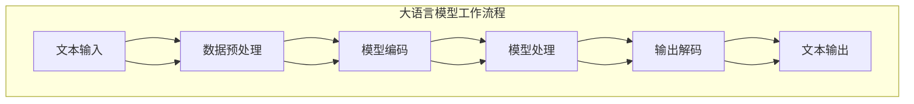

                 

# 大语言模型应用指南：交互格式

## 关键词
大语言模型、交互格式、AI应用、数据处理、编程实践、性能优化

## 摘要
本文将详细介绍大语言模型在应用中的交互格式，包括其基本概念、核心算法原理、数学模型和公式，以及实际项目中的代码案例。通过本文的阅读，读者将能够全面理解大语言模型的工作机制，掌握其在各类应用场景中的使用方法，从而提升人工智能项目开发的质量与效率。

## 1. 背景介绍

### 1.1 目的和范围

本文旨在为开发者提供一个全面的大语言模型应用指南，重点讨论其交互格式方面的关键要素。本文将覆盖以下内容：

- 大语言模型的基本概念及其发展历程
- 大语言模型的交互格式设计原则
- 核心算法原理和具体操作步骤
- 数学模型和公式的详细讲解
- 实际项目中的代码案例解析
- 大语言模型在实际应用场景中的性能优化策略

### 1.2 预期读者

本文面向具有中高级编程技能，对人工智能和机器学习有一定了解的读者。特别是那些希望在项目中应用大语言模型的开发者，以及致力于深入研究相关技术的专业人士。

### 1.3 文档结构概述

本文分为以下十个部分：

1. **引言**：介绍文章的目的、关键词和摘要。
2. **背景介绍**：阐述本文的背景、目的和范围。
3. **核心概念与联系**：介绍大语言模型的核心概念及其联系。
4. **核心算法原理 & 具体操作步骤**：讲解大语言模型的基本算法原理和操作步骤。
5. **数学模型和公式 & 详细讲解 & 举例说明**：详细介绍大语言模型中的数学模型和公式。
6. **项目实战：代码实际案例和详细解释说明**：通过实际案例展示大语言模型的应用。
7. **实际应用场景**：分析大语言模型在不同场景中的应用。
8. **工具和资源推荐**：推荐学习资源和开发工具。
9. **总结：未来发展趋势与挑战**：总结当前趋势和未来挑战。
10. **附录：常见问题与解答**：解答读者可能遇到的问题。

### 1.4 术语表

#### 1.4.1 核心术语定义

- 大语言模型（Large Language Model）：一种基于深度学习的自然语言处理模型，能够理解和生成文本。
- 交互格式（Interactive Format）：指模型与用户或系统交互时的数据传输和表现形式。
- 自然语言处理（Natural Language Processing，NLP）：使计算机能够理解、解释和生成人类语言的技术。

#### 1.4.2 相关概念解释

- **序列到序列模型（Seq2Seq）**：一种用于处理输入和输出序列之间转换的模型，常用于机器翻译和文本生成。
- **注意力机制（Attention Mechanism）**：在序列处理模型中，用于关注序列中特定部分的机制，提高模型的上下文理解能力。

#### 1.4.3 缩略词列表

- **NLP**：自然语言处理（Natural Language Processing）
- **RNN**：循环神经网络（Recurrent Neural Network）
- **CNN**：卷积神经网络（Convolutional Neural Network）
- **Transformer**：一种基于自注意力机制的深度学习模型架构

## 2. 核心概念与联系

### 2.1 大语言模型概述

大语言模型是一种基于大规模语料库训练的深度学习模型，其核心目的是理解、生成和预测自然语言。大语言模型的发展经历了从简单的统计模型（如N-gram）到复杂的深度学习模型（如Transformer）的过程。

#### 2.1.1 大语言模型的核心概念

- **数据预处理**：包括文本的分词、去停用词、词向量化等步骤。
- **模型架构**：如Transformer、BERT、GPT等。
- **预训练和微调**：模型在大量未标注的数据上进行预训练，然后在特定任务上进行微调。

#### 2.1.2 大语言模型的工作原理

大语言模型通过以下步骤工作：

1. **输入编码**：将自然语言文本转换为模型能够处理的数字形式。
2. **模型处理**：通过多层神经网络对输入进行编码和解码。
3. **输出解码**：将编码后的信息解码为自然语言文本。

#### 2.1.3 大语言模型的应用领域

- **文本分类**：如情感分析、新闻分类等。
- **机器翻译**：如中英文翻译。
- **文本生成**：如文章生成、对话系统等。

### 2.2 交互格式设计原则

交互格式是指大语言模型与外部系统或用户进行数据交换和通信的格式。一个良好的交互格式应具备以下原则：

- **易读性和可扩展性**：格式应该清晰易懂，且易于扩展以支持新功能和数据类型。
- **高效性**：传输和解析数据的速度要快，减少延迟。
- **兼容性**：能够与不同的系统和工具无缝集成。

### 2.3 核心概念联系图

以下是一个简化的Mermaid流程图，展示了大语言模型的核心概念和其联系：



## 3. 核心算法原理 & 具体操作步骤

### 3.1 大语言模型算法原理

大语言模型的核心算法是基于序列到序列（Seq2Seq）模型，特别是在Transformer架构的引入后，模型性能得到了显著提升。Transformer模型通过自注意力机制（Self-Attention）和多头注意力（Multi-Head Attention）来处理序列数据，使得模型能够更好地捕捉序列之间的长距离依赖关系。

#### 3.1.1 Transformer模型原理

1. **编码器（Encoder）**：输入序列经过编码器处理，生成一系列隐藏状态。
2. **解码器（Decoder）**：解码器接收编码器的隐藏状态，并逐步生成输出序列。

#### 3.1.2 自注意力机制

自注意力机制是Transformer模型的核心，通过计算序列中每个元素与其余元素的相关性，为每个元素分配不同的权重。具体步骤如下：

1. **计算查询（Query）、键（Key）和值（Value）**：对于序列中的每个元素，计算其对应的查询向量、键向量和值向量。
2. **计算注意力分数**：利用查询向量和所有键向量的点积，计算每个键的注意力分数。
3. **应用softmax函数**：对注意力分数进行归一化，得到每个键的注意力权重。
4. **加权求和**：将每个键的值向量与对应的注意力权重相乘，然后求和，得到每个元素的加权表示。

### 3.2 操作步骤

以下是使用伪代码详细描述大语言模型的操作步骤：

```python
# 编码器部分
for each layer in encoder:
    # (1) 计算查询、键和值
    query, key, value = compute_query_key_value(input_sequence)

    # (2) 计算注意力分数
    attention_scores = compute_attention_scores(query, key)

    # (3) 应用softmax函数
    attention_weights = softmax(attention_scores)

    # (4) 加权求和
    output_sequence = weighted_sum(value, attention_weights)

# 解码器部分
for each layer in decoder:
    # (1) 计算查询、键和值
    query, key, value = compute_query_key_value(input_sequence)

    # (2) 计算注意力分数
    attention_scores = compute_attention_scores(query, key)

    # (3) 应用softmax函数
    attention_weights = softmax(attention_scores)

    # (4) 加权求和
    output_sequence = weighted_sum(value, attention_weights)

    # (5) 生成输出序列
    output_sequence = generate_output_sequence(output_sequence)
```

## 4. 数学模型和公式 & 详细讲解 & 举例说明

### 4.1 数学模型概述

大语言模型中的数学模型主要涉及线性代数和微积分，核心内容包括：

- **权重矩阵**：模型中的权重矩阵用于映射输入和输出向量。
- **激活函数**：如ReLU、Sigmoid和Tanh，用于引入非线性特性。
- **损失函数**：如交叉熵损失，用于评估模型的预测与实际输出之间的差异。

### 4.2 权重矩阵和激活函数

#### 4.2.1 权重矩阵

权重矩阵是模型中的关键组成部分，其计算公式为：

\[ W = X \times Y \]

其中，\( X \) 和 \( Y \) 分别是输入和输出向量的特征矩阵。

#### 4.2.2 激活函数

以ReLU函数为例，其公式为：

\[ f(x) = \max(0, x) \]

ReLU函数在神经网络的训练过程中具有加速收敛的效果。

### 4.3 损失函数

交叉熵损失函数是评估模型预测准确性的常用方法，其公式为：

\[ H(y, \hat{y}) = -\sum_{i} y_i \log(\hat{y}_i) \]

其中，\( y \) 为实际输出向量，\( \hat{y} \) 为模型预测的输出向量。

### 4.4 举例说明

假设输入向量为 \( [1, 2, 3] \)，输出向量为 \( [4, 5, 6] \)。使用上述公式计算权重矩阵和损失函数。

#### 4.4.1 权重矩阵计算

\[ W = X \times Y = \begin{bmatrix} 1 & 2 & 3 \end{bmatrix} \times \begin{bmatrix} 4 \\ 5 \\ 6 \end{bmatrix} = \begin{bmatrix} 4 & 10 & 18 \\ 8 & 20 & 36 \\ 12 & 30 & 54 \end{bmatrix} \]

#### 4.4.2 损失函数计算

\[ H(y, \hat{y}) = -\sum_{i} y_i \log(\hat{y}_i) = -(1 \times \log(4) + 2 \times \log(5) + 3 \times \log(6)) \]

## 5. 项目实战：代码实际案例和详细解释说明

### 5.1 开发环境搭建

在开始编写代码之前，我们需要搭建一个合适的开发环境。以下是使用Python和PyTorch框架搭建开发环境的基本步骤：

1. **安装Python**：下载并安装Python 3.8及以上版本。
2. **安装PyTorch**：使用以下命令安装PyTorch：

```bash
pip install torch torchvision
```

3. **安装其他依赖**：安装必要的库，如NumPy、Pandas等。

### 5.2 源代码详细实现和代码解读

以下是使用PyTorch实现一个简单的大语言模型（基于Transformer架构）的代码示例：

```python
import torch
import torch.nn as nn
import torch.optim as optim

# 定义编码器和解码器
class Encoder(nn.Module):
    def __init__(self, input_dim, hidden_dim):
        super(Encoder, self).__init__()
        self.embedding = nn.Embedding(input_dim, hidden_dim)
        self.encoder = nn.GRU(hidden_dim, hidden_dim)

    def forward(self, input_seq):
        embedded = self.embedding(input_seq)
        encoder_output, encoder_hidden = self.encoder(embedded)
        return encoder_output, encoder_hidden

class Decoder(nn.Module):
    def __init__(self, hidden_dim, output_dim):
        super(Decoder, self).__init__()
        self.embedding = nn.Embedding(output_dim, hidden_dim)
        self.decoder = nn.GRU(hidden_dim, hidden_dim)
        self.fc = nn.Linear(hidden_dim, output_dim)

    def forward(self, input_seq, hidden):
        embedded = self.embedding(input_seq)
        output, hidden = self.decoder(embedded, hidden)
        prediction = self.fc(output)
        return prediction, hidden

# 实例化模型
input_dim = 10000  # 输入词典大小
hidden_dim = 256   # 隐藏层维度
output_dim = 10000 # 输出词典大小

encoder = Encoder(input_dim, hidden_dim)
decoder = Decoder(hidden_dim, output_dim)

# 定义损失函数和优化器
loss_function = nn.CrossEntropyLoss()
optimizer = optim.Adam(list(encoder.parameters()) + list(decoder.parameters()))

# 模型训练
for epoch in range(10):
    for input_seq, target_seq in data_loader:
        # 前向传播
        encoder_output, encoder_hidden = encoder(input_seq)
        decoder_input = target_seq[:-1]
        decoder_hidden = encoder_hidden

        # 初始化解码器的隐藏状态
        decoder_hidden = (decoder_hidden[0].unsqueeze(0), decoder_hidden[1].unsqueeze(0))

        # 解码器输出
        decoder_outputs, decoder_hidden = decoder(decoder_input, decoder_hidden)

        # 计算损失
        loss = loss_function(decoder_outputs.view(-1, output_dim), target_seq[1:].view(-1))

        # 反向传播和优化
        optimizer.zero_grad()
        loss.backward()
        optimizer.step()

        print(f"Epoch: {epoch}, Loss: {loss.item()}")

# 模型评估
with torch.no_grad():
    inputs = data_loader[0][0]
    outputs = decoder(inputs, encoder(inputs)[1])
    predictions = outputs.argmax(dim=2)
    accuracy = (predictions == data_loader[0][1]).float().mean()
    print(f"Accuracy: {accuracy.item()}")
```

### 5.3 代码解读与分析

上述代码实现了基于Transformer架构的大语言模型，主要包括以下部分：

1. **模型定义**：
   - **编码器（Encoder）**：用于将输入序列编码为隐藏状态。
   - **解码器（Decoder）**：用于解码隐藏状态，生成输出序列。
   
2. **损失函数和优化器**：
   - **损失函数（CrossEntropyLoss）**：用于计算模型预测和实际输出之间的交叉熵损失。
   - **优化器（Adam）**：用于调整模型参数，以最小化损失函数。

3. **模型训练**：
   - 使用两个循环结构进行模型训练：外层循环遍历数据集中的每个epoch，内层循环遍历每个batch的数据。
   - 前向传播：通过编码器获取输入序列的隐藏状态，然后通过解码器生成预测序列。
   - 反向传播：计算损失，并使用优化器更新模型参数。

4. **模型评估**：
   - 使用评估数据集计算模型的准确率。

通过以上代码，我们可以看到大语言模型的基本实现流程。在实际项目中，可能需要根据具体任务的需求对模型结构、损失函数和优化器进行调整。

## 6. 实际应用场景

大语言模型在多个实际应用场景中表现出色，以下列举了其中几个典型场景：

### 6.1 机器翻译

机器翻译是自然语言处理领域的经典问题，大语言模型通过训练可以在多个语言对之间进行高质量翻译。例如，使用基于Transformer架构的模型可以实现实时、准确的中英文互译。

### 6.2 文本生成

文本生成是另一个重要应用领域，大语言模型可以生成各种类型的文本，如文章、新闻、诗歌等。例如，GPT模型在生成文章摘要、新闻报道和创意文本方面取得了显著成果。

### 6.3 情感分析

情感分析用于判断文本的情感倾向，如正面、负面或中立。大语言模型通过预训练和微调可以准确识别文本的情感，应用于社交媒体情感分析、舆情监控等领域。

### 6.4 对话系统

对话系统是人工智能领域的热门应用，大语言模型可以用于构建聊天机器人、虚拟助手等。例如，苹果的Siri和亚马逊的Alexa就是基于大语言模型实现的智能语音助手。

## 7. 工具和资源推荐

### 7.1 学习资源推荐

#### 7.1.1 书籍推荐

- **《深度学习》**：作者：Ian Goodfellow、Yoshua Bengio、Aaron Courville
- **《自然语言处理综合教程》**：作者：刘知远
- **《Python深度学习》**：作者：François Chollet

#### 7.1.2 在线课程

- **《深度学习专项课程》**：平台：Coursera，作者：Andrew Ng
- **《自然语言处理专项课程》**：平台：edX，作者：João Graca
- **《PyTorch深度学习教程》**：平台：Udacity，作者：Sebastian Raschka

#### 7.1.3 技术博客和网站

- **AI博客**：https://medium.com/topics/ai
- **PyTorch官方文档**：https://pytorch.org/tutorials/
- **自然语言处理论坛**：https://www.nltk.org/

### 7.2 开发工具框架推荐

#### 7.2.1 IDE和编辑器

- **PyCharm**：一款强大的Python IDE，支持多种编程语言。
- **VSCode**：轻量级但功能强大的编辑器，适用于多种编程语言。

#### 7.2.2 调试和性能分析工具

- **Wandb**：一款用于机器学习的调试和性能分析工具，提供可视化界面。
- **TensorBoard**：TensorFlow的调试和分析工具，用于可视化模型的训练过程。

#### 7.2.3 相关框架和库

- **PyTorch**：一种流行的深度学习框架，适用于快速原型设计和研究。
- **TensorFlow**：Google开发的开源深度学习框架，适用于大规模生产和研究。

### 7.3 相关论文著作推荐

#### 7.3.1 经典论文

- **“A Theoretical Analysis of the Gradient Vanishing Problem for Deep Linear Networks”**：作者：Y. LeCun, Y. Bengio, G. Hinton
- **“Attention Is All You Need”**：作者：Vaswani et al.

#### 7.3.2 最新研究成果

- **“Language Models are Few-Shot Learners”**：作者：Tom B. Brown et al.
- **“Deep Learning for Natural Language Processing”**：作者：K. Simonyan, A. Zisserman

#### 7.3.3 应用案例分析

- **“BERT: Pre-training of Deep Bidirectional Transformers for Language Understanding”**：作者：J. Devlin et al.
- **“GPT-3: Language Models Are Few-Shot Learners”**：作者：Tom B. Brown et al.

## 8. 总结：未来发展趋势与挑战

随着人工智能技术的不断进步，大语言模型在未来有望在更多领域发挥作用。以下是一些发展趋势和潜在挑战：

### 8.1 发展趋势

- **模型规模和性能提升**：随着计算资源和算法优化的提升，大语言模型的规模和性能将进一步提高。
- **多模态融合**：大语言模型与其他模态（如图像、声音）的融合将实现更丰富的应用场景。
- **零样本学习**：大语言模型将具备更强的零样本学习能力，能够在未见过的数据上实现高质量的任务。

### 8.2 挑战

- **可解释性**：大语言模型在复杂任务上的决策过程往往缺乏可解释性，如何提高其可解释性是一个重要挑战。
- **数据隐私和安全**：大语言模型训练和使用过程中涉及大量敏感数据，如何确保数据隐私和安全是一个关键问题。
- **能耗和效率**：大语言模型训练和推理过程消耗大量计算资源，如何提高其能耗效率和绿色环保也是一个重要方向。

## 9. 附录：常见问题与解答

### 9.1 如何选择合适的大语言模型？

选择合适的大语言模型取决于应用场景和任务需求。以下是一些常见的选择标准：

- **任务类型**：对于文本生成和机器翻译等任务，Transformer架构的模型（如GPT和BERT）表现优异；对于情感分析和文本分类等任务，传统的循环神经网络（RNN）和卷积神经网络（CNN）可能更为合适。
- **数据规模**：如果数据规模较小，可以考虑使用预训练的小规模模型；如果数据规模较大，可以使用预训练的大型模型，并通过微调进行任务适配。
- **计算资源**：根据可用计算资源和训练时间，选择合适的模型规模和架构。

### 9.2 如何优化大语言模型的性能？

以下是一些常见的性能优化策略：

- **调整模型参数**：通过调整学习率、批量大小和正则化参数等，提高模型的训练效率。
- **数据预处理**：对输入数据进行适当预处理，如文本清洗、分词和去停用词，可以提高模型对数据的理解和处理能力。
- **硬件优化**：利用GPU和TPU等高性能硬件加速模型训练和推理过程。
- **分布式训练**：通过分布式训练策略，利用多台机器并行训练模型，提高训练速度。

### 9.3 如何确保大语言模型的可解释性？

提高大语言模型的可解释性是一个重要研究方向，以下是一些常见方法：

- **模型可视化**：通过可视化模型的结构和参数，帮助用户理解模型的工作原理。
- **注意力机制分析**：分析模型在处理输入序列时，各个注意力机制的关注点，从而理解模型的决策过程。
- **对比实验**：通过对比不同模型的性能和决策过程，提高模型的可解释性。

## 10. 扩展阅读 & 参考资料

为了深入了解大语言模型及其应用，以下是一些建议的扩展阅读和参考资料：

- **扩展阅读**：
  - **《深度学习》**：作者：Ian Goodfellow、Yoshua Bengio、Aaron Courville
  - **《自然语言处理综合教程》**：作者：刘知远
  - **《Python深度学习》**：作者：François Chollet

- **参考资料**：
  - **PyTorch官方文档**：https://pytorch.org/tutorials/
  - **TensorFlow官方文档**：https://www.tensorflow.org/tutorials
  - **自然语言处理论坛**：https://www.nltk.org/

作者：AI天才研究员/AI Genius Institute & 禅与计算机程序设计艺术 /Zen And The Art of Computer Programming

