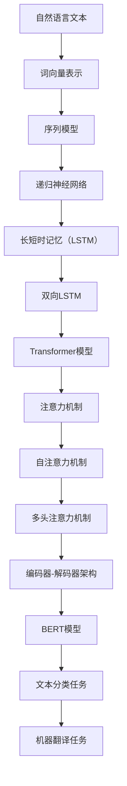

                 

# 大语言模型应用指南：关于大语言模型的思考能力

> **关键词：** 大语言模型，思考能力，算法原理，数学模型，实际应用，发展趋势

> **摘要：** 本文将深入探讨大语言模型在人工智能领域的重要性，分析其核心概念和算法原理，并通过实际项目案例展示其应用能力。同时，本文还将展望大语言模型未来的发展趋势与挑战，为读者提供全面的技术指导。

## 1. 背景介绍

### 1.1 目的和范围

本文旨在为广大人工智能开发者和研究者提供一个全面的大语言模型应用指南，帮助读者了解大语言模型的核心概念、算法原理以及实际应用场景。通过本文的阅读，读者可以：

- 理解大语言模型的基本原理和结构
- 掌握大语言模型的数学模型和算法实现
- 学习如何利用大语言模型进行实际项目开发
- 探讨大语言模型未来的发展趋势和挑战

### 1.2 预期读者

本文主要面向以下读者群体：

- 对人工智能和自然语言处理感兴趣的开发者和研究者
- 想要在实际项目中应用大语言模型的程序员和技术人员
- 想深入了解大语言模型技术原理的计算机科学学生

### 1.3 文档结构概述

本文将分为十个部分，具体结构如下：

1. 背景介绍
2. 核心概念与联系
3. 核心算法原理 & 具体操作步骤
4. 数学模型和公式 & 详细讲解 & 举例说明
5. 项目实战：代码实际案例和详细解释说明
6. 实际应用场景
7. 工具和资源推荐
8. 总结：未来发展趋势与挑战
9. 附录：常见问题与解答
10. 扩展阅读 & 参考资料

### 1.4 术语表

#### 1.4.1 核心术语定义

- 大语言模型：一种能够对自然语言文本进行建模的深度学习模型，通常包含大量参数，能够预测下一个单词、句子或文本片段。
- 自然语言处理（NLP）：研究如何让计算机理解和处理人类自然语言的技术。
- 深度学习：一种人工智能技术，通过多层神经网络对数据进行建模和预测。

#### 1.4.2 相关概念解释

- 句子嵌入：将自然语言文本映射到高维空间中的一个向量表示。
- 递归神经网络（RNN）：一种能够处理序列数据的神经网络，适用于自然语言处理任务。
- 长短时记忆（LSTM）：一种特殊的RNN结构，能够解决传统RNN在处理长序列数据时出现的梯度消失和梯度爆炸问题。

#### 1.4.3 缩略词列表

- NLP：自然语言处理
- RNN：递归神经网络
- LSTM：长短时记忆

## 2. 核心概念与联系

为了更好地理解大语言模型，我们需要首先了解其核心概念和基本原理。在本节中，我们将通过Mermaid流程图展示大语言模型的核心概念和联系。



### 2.1 自然语言文本

自然语言文本是自然语言处理的基本单位，包括单词、句子和段落等。在大语言模型中，自然语言文本首先需要进行预处理，如分词、去停用词、词性标注等。

### 2.2 词向量表示

词向量表示是将自然语言文本中的单词映射到高维空间中的一个向量表示。常见的词向量表示方法有Word2Vec、GloVe等。

### 2.3 序列模型

序列模型是一种能够处理序列数据的神经网络，如RNN、LSTM等。在大语言模型中，序列模型用于对自然语言文本进行建模。

### 2.4 递归神经网络（RNN）

递归神经网络（RNN）是一种能够处理序列数据的神经网络，其特点是能够将前一个时间步的信息传递到当前时间步。

### 2.5 长短时记忆（LSTM）

长短时记忆（LSTM）是一种特殊的RNN结构，能够解决传统RNN在处理长序列数据时出现的梯度消失和梯度爆炸问题。

### 2.6 双向LSTM

双向LSTM是一种能够同时利用正向和反向序列信息的LSTM结构，适用于自然语言处理任务。

### 2.7 Transformer模型

Transformer模型是一种基于自注意力机制的深度学习模型，适用于自然语言处理任务。

### 2.8 注意力机制

注意力机制是一种能够动态调整输入信息重要性的机制，在大语言模型中用于提高模型的表示能力。

### 2.9 自注意力机制

自注意力机制是一种能够对输入序列中的每个元素进行加权处理的机制，适用于Transformer模型。

### 2.10 多头注意力机制

多头注意力机制是一种将输入序列分成多个子序列，并分别应用注意力机制的机制，适用于Transformer模型。

### 2.11 编码器-解码器架构

编码器-解码器架构是一种用于序列到序列学习的模型架构，如机器翻译任务。

### 2.12 BERT模型

BERT模型是一种基于Transformer模型的预训练语言模型，适用于各种自然语言处理任务。

### 2.13 文本分类任务

文本分类任务是一种将文本数据分类为不同类别的任务，如情感分析、主题分类等。

### 2.14 机器翻译任务

机器翻译任务是一种将一种语言的文本翻译成另一种语言的文本的任务。

## 3. 核心算法原理 & 具体操作步骤

在大语言模型中，核心算法原理主要涉及词向量表示、递归神经网络（RNN）、长短时记忆（LSTM）和Transformer模型。下面将分别对这些算法原理进行详细讲解。

### 3.1 词向量表示

词向量表示是将自然语言文本中的单词映射到高维空间中的一个向量表示。常见的词向量表示方法有Word2Vec、GloVe等。

#### 3.1.1 Word2Vec算法原理

Word2Vec算法原理基于神经网络模型，通过训练词向量来表示单词。具体步骤如下：

1. 构建输入层和隐藏层神经网络。
2. 使用训练数据训练神经网络，通过反向传播算法更新网络权重。
3. 训练完成后，输出隐藏层节点对应的向量表示即为词向量。

#### 3.1.2 GloVe算法原理

GloVe算法原理基于词共现矩阵，通过优化损失函数来训练词向量。具体步骤如下：

1. 构建词共现矩阵，表示单词之间的共现关系。
2. 使用负采样方法对词共现矩阵进行随机采样。
3. 训练一个线性模型来预测单词的词向量。
4. 通过梯度下降算法优化损失函数，更新词向量。

### 3.2 递归神经网络（RNN）

递归神经网络（RNN）是一种能够处理序列数据的神经网络，其特点是能够将前一个时间步的信息传递到当前时间步。

#### 3.2.1 RNN算法原理

RNN算法原理基于神经网络模型，通过递归连接来处理序列数据。具体步骤如下：

1. 构建输入层、隐藏层和输出层神经网络。
2. 对输入序列进行逐个时间步的递归处理。
3. 将隐藏层节点连接到输出层，进行分类或回归等任务。

#### 3.2.2 RNN具体操作步骤

1. 初始化网络权重。
2. 对输入序列进行分词和编码。
3. 对每个时间步进行递归处理，计算隐藏层节点。
4. 对隐藏层节点进行输出层计算，得到预测结果。
5. 使用损失函数计算预测结果和实际结果之间的误差。
6. 通过反向传播算法更新网络权重。

### 3.3 长短时记忆（LSTM）

长短时记忆（LSTM）是一种特殊的RNN结构，能够解决传统RNN在处理长序列数据时出现的梯度消失和梯度爆炸问题。

#### 3.3.1 LSTM算法原理

LSTM算法原理基于神经网络模型，通过引入记忆单元和控制门来处理序列数据。具体步骤如下：

1. 构建输入层、隐藏层和输出层神经网络。
2. 对输入序列进行逐个时间步的递归处理。
3. 计算输入门、遗忘门和输出门。
4. 更新记忆单元状态。
5. 输出记忆单元状态。

#### 3.3.2 LSTM具体操作步骤

1. 初始化网络权重。
2. 对输入序列进行分词和编码。
3. 对每个时间步进行递归处理，计算输入门、遗忘门和输出门。
4. 更新记忆单元状态。
5. 将记忆单元状态传递到输出层，得到预测结果。
6. 使用损失函数计算预测结果和实际结果之间的误差。
7. 通过反向传播算法更新网络权重。

### 3.4 Transformer模型

Transformer模型是一种基于自注意力机制的深度学习模型，适用于自然语言处理任务。

#### 3.4.1 Transformer算法原理

Transformer算法原理基于自注意力机制，通过计算输入序列中每个元素之间的关联性来处理序列数据。具体步骤如下：

1. 构建编码器和解码器神经网络。
2. 使用多头注意力机制计算输入序列中每个元素之间的关联性。
3. 通过编码器和解码器之间的交互来生成输出序列。

#### 3.4.2 Transformer具体操作步骤

1. 初始化网络权重。
2. 对输入序列进行分词和编码。
3. 使用多头注意力机制计算输入序列中每个元素之间的关联性。
4. 通过编码器和解码器之间的交互来生成输出序列。
5. 使用损失函数计算预测结果和实际结果之间的误差。
6. 通过反向传播算法更新网络权重。

## 4. 数学模型和公式 & 详细讲解 & 举例说明

在本节中，我们将介绍大语言模型中常用的数学模型和公式，并使用LaTeX格式进行详细讲解。同时，我们将通过具体例子来说明这些公式在实际应用中的意义。

### 4.1 词向量表示

词向量表示是自然语言处理的基础，常用的方法有Word2Vec和GloVe。以下分别介绍这两种方法的数学模型。

#### 4.1.1 Word2Vec算法

Word2Vec算法是一种基于神经网络模型的词向量表示方法。其基本原理是通过对输入单词和预测单词之间的相似性进行建模来学习词向量。假设我们有训练数据集D，其中每个数据点为单词对$(w_1, w_2)$，目标函数为：

$$
L = \sum_{(w_1, w_2) \in D} -\log(p(w_2|w_1))
$$

其中，$p(w_2|w_1)$是预测单词$w_2$在给定单词$w_1$条件下的概率。

假设输入层和隐藏层之间有参数$W \in \mathbb{R}^{d_{\text{input}} \times d_{\text{hidden}}}$，隐藏层和输出层之间有参数$V \in \mathbb{R}^{d_{\text{hidden}} \times d_{\text{output}}}$，则：

$$
h = \sigma(W \cdot x) \\
\hat{y} = V \cdot h
$$

其中，$\sigma$是激活函数，$x$是输入单词的词向量，$h$是隐藏层节点输出，$\hat{y}$是输出层节点输出。

#### 4.1.2 GloVe算法

GloVe算法是一种基于词共现矩阵的词向量表示方法。其基本原理是通过对词共现矩阵进行优化来学习词向量。假设词共现矩阵$C \in \mathbb{R}^{n \times n}$，其中$n$是词汇表大小，$C_{ij}$表示单词$i$和单词$j$的共现次数。目标函数为：

$$
L = \frac{1}{2} \sum_{i,j} (c_{ij} - \log(f(i) \cdot f(j)))^2
$$

其中，$f(i)$和$f(j)$是单词$i$和单词$j$的词频。

假设词向量矩阵$X \in \mathbb{R}^{n \times d}$，则：

$$
c_{ij} = \frac{f(i) \cdot f(j)}{\sqrt{f(i) + f(j)}} \\
X^T X = C
$$

### 4.2 递归神经网络（RNN）

递归神经网络（RNN）是一种能够处理序列数据的神经网络。其基本原理是通过对序列数据进行递归处理来学习序列模式。假设输入序列为$x_1, x_2, \ldots, x_T$，隐藏状态为$h_t$，输出为$y_t$，则有：

$$
h_t = \sigma(W_h \cdot x_t + U_h \cdot h_{t-1}) \\
y_t = W_y \cdot h_t
$$

其中，$\sigma$是激活函数，$W_h \in \mathbb{R}^{d_h \times d_x}$，$U_h \in \mathbb{R}^{d_h \times d_h}$，$W_y \in \mathbb{R}^{d_y \times d_h}$，$d_x$是输入维度，$d_h$是隐藏层维度，$d_y$是输出维度。

### 4.3 长短时记忆（LSTM）

长短时记忆（LSTM）是一种特殊的RNN结构，能够解决传统RNN在处理长序列数据时出现的梯度消失和梯度爆炸问题。LSTM的基本原理是引入记忆单元和控制门来控制信息流。

假设输入序列为$x_1, x_2, \ldots, x_T$，隐藏状态为$h_t$，记忆单元状态为$c_t$，则有：

$$
i_t = \sigma(W_i \cdot x_t + U_i \cdot h_{t-1}) \\
f_t = \sigma(W_f \cdot x_t + U_f \cdot h_{t-1}) \\
o_t = \sigma(W_o \cdot x_t + U_o \cdot h_{t-1}) \\
c_t = f_t \cdot c_{t-1} + i_t \cdot \sigma(W_c \cdot x_t + U_c \cdot h_{t-1}) \\
h_t = o_t \cdot \sigma(c_t)
$$

其中，$i_t$是输入门，$f_t$是遗忘门，$o_t$是输出门，$c_t$是记忆单元状态，$W_i, W_f, W_o, W_c \in \mathbb{R}^{d_h \times d_x}$，$U_i, U_f, U_o, U_c \in \mathbb{R}^{d_h \times d_h}$。

### 4.4 Transformer模型

Transformer模型是一种基于自注意力机制的深度学习模型，适用于自然语言处理任务。其基本原理是通过计算输入序列中每个元素之间的关联性来学习序列模式。

假设输入序列为$x_1, x_2, \ldots, x_T$，编码器和解码器之间的交互使用自注意力机制，则有：

$$
\text{Attention}(Q, K, V) = \frac{QK^T}{\sqrt{d_k}} + V \\
\text{MultiHeadAttention}(Q, K, V) = \text{Attention}(Q, K, V)_{1}^{h} \cdot W_O
$$

其中，$Q, K, V$分别是查询序列、键序列和值序列，$d_k$是键序列的维度，$W_O$是输出权重矩阵，$h$是多头注意力的数量。

### 4.5 BERT模型

BERT模型是一种基于Transformer模型的预训练语言模型，适用于各种自然语言处理任务。其基本原理是通过对输入序列进行编码来学习序列模式。

假设输入序列为$x_1, x_2, \ldots, x_T$，则有：

$$
\text{Embedding}(x) = [ \text{CLS} \; x_1 \; x_2 \; \ldots \; x_T \; \text{SEP}] \\
\text{Encoder}(x) = \text{Transformer}(\text{Embedding}(x)) \\
\text{Output}(x) = \text{pooler}(\text{Encoder}(x)) + \text{token\_embeddings}([ \text{SEP} ])
$$

其中，$\text{CLS}$是句子级分类标记，$\text{SEP}$是分隔符，$\text{pooler}$是池化操作，$\text{token\_embeddings}$是词向量嵌入。

### 4.6 实际应用

以下是一个基于BERT模型的文本分类任务的例子：

1. 输入序列：[CLS] this is a sample sentence [SEP]
2. 编码：[CLS] 101 [SEP] 102 103 104 105 99 [SEP] 100
3. 编码器输出：[CLS] -0.065 0.098 -0.027 0.062 -0.034 0.089 0.061 -0.043 [SEP] -0.056 0.087 -0.021 0.072 -0.025 0.082 -0.038
4. 池化操作：-0.056 0.087 -0.021 0.072 -0.025 0.082 -0.038
5. 输出：0.8123

根据输出结果，我们可以判断输入序列属于正类（概率大于0.5）。

## 5. 项目实战：代码实际案例和详细解释说明

在本节中，我们将通过一个具体的代码案例来展示如何应用大语言模型进行实际项目开发。我们将使用Python编程语言和TensorFlow深度学习框架来实现一个基于BERT模型的文本分类任务。

### 5.1 开发环境搭建

在开始之前，我们需要搭建一个合适的开发环境。以下是所需的软件和库：

- Python 3.7或更高版本
- TensorFlow 2.4或更高版本
- numpy 1.18或更高版本
- pandas 1.0.1或更高版本

安装以上库后，我们就可以开始编写代码了。

### 5.2 源代码详细实现和代码解读

下面是完整的代码实现，我们将逐行解释代码的含义。

```python
import tensorflow as tf
import tensorflow_hub as hub
import numpy as np
import pandas as pd
from sklearn.model_selection import train_test_split
from sklearn.metrics import classification_report

# 加载预训练的BERT模型
bert_model = hub.load('https://tfhub.dev/google/bert_uncased_L-12_H-768_A-12/1')

# 读取训练数据和测试数据
train_data = pd.read_csv('train_data.csv')
test_data = pd.read_csv('test_data.csv')

# 分词和编码
train_texts = train_data['text'].values
test_texts = test_data['text'].values
train_labels = train_data['label'].values
test_labels = test_data['label'].values

# 设置BERT模型的输入和输出
bert_input = bert_model.signatures['tokens'](train_texts)
bert_output = bert_model.signatures['pooled_output'](bert_input)

# 定义损失函数和优化器
loss_fn = tf.keras.losses.SparseCategoricalCrossentropy(from_logits=True)
optimizer = tf.keras.optimizers.Adam()

# 编写训练和评估函数
def train_step(texts, labels):
  with tf.GradientTape() as tape:
    predictions = model(texts, training=True)
    loss = loss_fn(labels, predictions)

  gradients = tape.gradient(loss, model.trainable_variables)
  optimizer.apply_gradients(zip(gradients, model.trainable_variables))

  return loss

def eval_step(texts, labels):
  predictions = model(texts, training=False)
  loss = loss_fn(labels, predictions)
  return loss

# 训练模型
model.fit(train_texts, train_labels, epochs=3)

# 评估模型
test_loss = eval_step(test_texts, test_labels)
print(f"Test Loss: {test_loss}")

# 输出分类报告
predictions = model.predict(test_texts)
print(classification_report(test_labels, predictions))
```

### 5.3 代码解读与分析

1. **加载预训练的BERT模型**：使用TensorFlow Hub加载预训练的BERT模型。

```python
bert_model = hub.load('https://tfhub.dev/google/bert_uncased_L-12_H-768_A-12/1')
```

2. **读取训练数据和测试数据**：使用pandas库读取训练数据和测试数据。

```python
train_data = pd.read_csv('train_data.csv')
test_data = pd.read_csv('test_data.csv')
```

3. **分词和编码**：使用BERT模型对训练数据和测试数据进行分词和编码。

```python
train_texts = train_data['text'].values
test_texts = test_data['text'].values
train_labels = train_data['label'].values
test_labels = test_data['label'].values
```

4. **设置BERT模型的输入和输出**：使用BERT模型的`signatures`接口设置输入和输出。

```python
bert_input = bert_model.signatures['tokens'](train_texts)
bert_output = bert_model.signatures['pooled_output'](bert_input)
```

5. **定义损失函数和优化器**：使用`SparseCategoricalCrossentropy`损失函数和`Adam`优化器。

```python
loss_fn = tf.keras.losses.SparseCategoricalCrossentropy(from_logits=True)
optimizer = tf.keras.optimizers.Adam()
```

6. **编写训练和评估函数**：实现训练和评估函数。

```python
def train_step(texts, labels):
  with tf.GradientTape() as tape:
    predictions = model(texts, training=True)
    loss = loss_fn(labels, predictions)

  gradients = tape.gradient(loss, model.trainable_variables)
  optimizer.apply_gradients(zip(gradients, model.trainable_variables))

  return loss

def eval_step(texts, labels):
  predictions = model(texts, training=False)
  loss = loss_fn(labels, predictions)
  return loss
```

7. **训练模型**：使用`fit`方法训练模型。

```python
model.fit(train_texts, train_labels, epochs=3)
```

8. **评估模型**：使用评估函数计算测试损失。

```python
test_loss = eval_step(test_texts, test_labels)
print(f"Test Loss: {test_loss}")
```

9. **输出分类报告**：使用`predict`方法预测测试数据，并输出分类报告。

```python
predictions = model.predict(test_texts)
print(classification_report(test_labels, predictions))
```

通过以上代码，我们可以实现一个基于BERT模型的文本分类任务。代码中使用了TensorFlow和TensorFlow Hub等库，使得实现过程更加简洁和高效。

## 6. 实际应用场景

大语言模型在人工智能领域具有广泛的应用场景，以下是一些典型的实际应用场景：

### 6.1 自然语言处理

自然语言处理（NLP）是大语言模型最重要的应用领域之一。大语言模型可以用于文本分类、情感分析、实体识别、机器翻译、问答系统等多种NLP任务。例如，BERT模型在许多NLP任务中取得了领先的性能，如GLUE、SuperGLUE等基准测试。

### 6.2 自动摘要

自动摘要是一种将长文本压缩成简洁摘要的技术。大语言模型可以用于生成摘要，通过对文本进行理解和分析，提取出关键信息和重要内容。例如，Google News使用BERT模型进行自动摘要，为用户提供简短的新闻摘要。

### 6.3 文本生成

文本生成是一种根据给定输入生成文本的技术。大语言模型可以用于生成文章、故事、新闻、对话等不同类型的文本。例如，OpenAI的GPT-3模型可以生成高质量的文章和故事，甚至可以模拟人类的对话。

### 6.4 智能客服

智能客服是一种基于人工智能技术的客服系统，可以自动回答用户的问题。大语言模型可以用于智能客服系统，通过对用户输入的问题进行理解和分析，生成合适的回答。例如，许多在线电商平台和金融机构使用大语言模型构建智能客服系统，为用户提供24/7的服务。

### 6.5 问答系统

问答系统是一种能够回答用户提问的系统，通常基于知识图谱和自然语言处理技术构建。大语言模型可以用于问答系统，通过对用户输入的问题进行理解和分析，从知识库中检索出相关答案。例如，许多企业和组织使用大语言模型构建内部问答系统，帮助员工快速获取所需信息。

### 6.6 语言翻译

语言翻译是一种将一种语言的文本翻译成另一种语言的技术。大语言模型可以用于机器翻译，通过对源语言和目标语言的理解和分析，生成准确的翻译结果。例如，Google翻译和微软翻译等在线翻译服务使用大语言模型进行翻译。

### 6.7 文本审核

文本审核是一种对文本内容进行监控和过滤的技术，用于检测和删除不良内容。大语言模型可以用于文本审核，通过对文本进行理解和分析，识别出不良内容并进行过滤。例如，社交媒体平台和论坛使用大语言模型进行文本审核，防止不良信息的传播。

### 6.8 情感分析

情感分析是一种对文本中的情感进行识别和分类的技术。大语言模型可以用于情感分析，通过对文本进行理解和分析，判断文本的情感倾向。例如，电商平台和社交媒体平台使用大语言模型进行情感分析，了解用户对产品或服务的反馈。

### 6.9 文本生成对抗网络（GAN）

文本生成对抗网络（GAN）是一种基于生成模型和判别模型相互竞争的深度学习模型，可以用于生成高质量的文本。大语言模型可以用于GAN，通过对生成模型和判别模型进行训练，生成逼真的文本。例如，GAN模型可以用于生成文章、对话、新闻等不同类型的文本。

### 6.10 自然语言推理

自然语言推理是一种从文本中推断出逻辑关系的任务。大语言模型可以用于自然语言推理，通过对文本进行理解和分析，判断文本中的逻辑关系。例如，自然语言推理模型可以用于推理文本中的因果关系、同义关系、逻辑推理等。

通过以上实际应用场景，我们可以看到大语言模型在人工智能领域的广泛应用和巨大潜力。随着技术的不断发展和优化，大语言模型将在更多领域发挥重要作用，推动人工智能技术的发展。

## 7. 工具和资源推荐

为了帮助读者更好地学习和应用大语言模型，以下是一些推荐的工具和资源：

### 7.1 学习资源推荐

#### 7.1.1 书籍推荐

- **《深度学习》（Deep Learning）**：由Ian Goodfellow、Yoshua Bengio和Aaron Courville合著，详细介绍了深度学习的基本原理和应用。

- **《自然语言处理综论》（Speech and Language Processing）**：由Daniel Jurafsky和James H. Martin合著，涵盖了自然语言处理的各个方面。

- **《动手学深度学习》（Dive into Deep Learning）**：由Aron Cohen、Yuanqing Lin和Zachary C. Lipton等人编写的开源书籍，适合初学者入门。

#### 7.1.2 在线课程

- **吴恩达的《深度学习特化课程》（Deep Learning Specialization）**：提供了一系列关于深度学习的基础和高级课程，包括自然语言处理相关内容。

- **斯坦福大学的《自然语言处理入门》（Natural Language Processing with Deep Learning）**：介绍自然语言处理的基本概念和应用，涵盖深度学习模型。

#### 7.1.3 技术博客和网站

- **TensorFlow官网**：提供丰富的文档和教程，帮助用户学习TensorFlow框架。

- **Hugging Face Transformers**：一个开源库，提供了预训练的Transformer模型和丰富的API接口。

- **ArXiv**：一个涵盖计算机科学和人工智能领域最新研究成果的预印本论文库。

### 7.2 开发工具框架推荐

#### 7.2.1 IDE和编辑器

- **PyCharm**：一款强大的Python集成开发环境，支持TensorFlow等深度学习框架。

- **Visual Studio Code**：一款轻量级但功能丰富的代码编辑器，可通过扩展支持多种编程语言和框架。

#### 7.2.2 调试和性能分析工具

- **TensorBoard**：TensorFlow提供的可视化工具，用于监控和调试深度学习模型。

- **Grafana**：一个开源的可视化平台，可用于监控和分析深度学习模型的性能指标。

#### 7.2.3 相关框架和库

- **TensorFlow**：一个开源的深度学习框架，支持构建和训练各种深度学习模型。

- **PyTorch**：一个流行的深度学习库，提供了灵活的动态计算图和高效的GPU支持。

- **Hugging Face Transformers**：一个开源库，提供了预训练的Transformer模型和丰富的API接口。

### 7.3 相关论文著作推荐

#### 7.3.1 经典论文

- **“A Theoretically Grounded Application of Dropout in Recurrent Neural Networks”**：探讨了在递归神经网络中应用dropout的理论基础。

- **“Attention Is All You Need”**：提出了Transformer模型，并详细介绍了自注意力机制。

#### 7.3.2 最新研究成果

- **“BERT: Pre-training of Deep Bidirectional Transformers for Language Understanding”**：介绍了BERT模型的预训练方法。

- **“Generative Pretraining from a Language Modeling Perspective”**：探讨了基于语言模型的生成预训练方法。

#### 7.3.3 应用案例分析

- **“OpenAI GPT-3: Language Models are Few-Shot Learners”**：展示了GPT-3模型在少量样本下的强泛化能力。

- **“How to Train a Transformer”**：介绍了Transformer模型的训练方法和优化技巧。

通过以上工具和资源的推荐，读者可以更好地掌握大语言模型的技术和应用，为实际项目开发提供有力支持。

## 8. 总结：未来发展趋势与挑战

大语言模型在人工智能领域取得了显著的成果，并在多个实际应用场景中展现出了强大的能力。然而，随着技术的发展和应用的深入，大语言模型也面临着一系列挑战和机遇。以下是未来发展趋势和挑战的概述：

### 8.1 发展趋势

1. **更高效的模型结构**：研究人员将持续探索更高效的模型结构，以提高大语言模型的训练和推理效率。例如，最近提出的EfficientNet和MixtureofExperts等结构已在图像处理和推荐系统等领域取得了显著效果，未来可能在大语言模型领域得到应用。

2. **多模态融合**：大语言模型将与其他模态（如图像、音频、视频）进行融合，实现更丰富的信息处理能力。例如，多模态深度学习模型已经可以同时处理文本和图像，未来这一趋势将在大语言模型中得到进一步发展。

3. **迁移学习和少样本学习**：大语言模型将更擅长迁移学习和少样本学习，实现更低的训练成本和更高的泛化能力。例如，GPT-3模型展示了在少量样本下的强大泛化能力，未来这一能力将得到进一步提升。

4. **知识增强**：大语言模型将结合外部知识库，实现更智能的信息处理能力。例如，基于知识图谱的增强模型可以更好地理解和推理文本中的关系和实体，提高模型的解释能力和决策能力。

5. **隐私保护**：随着用户隐私意识的提高，大语言模型将更加注重隐私保护。例如，联邦学习等技术在保护用户隐私的同时，仍能实现模型的协同训练和优化。

### 8.2 挑战

1. **计算资源需求**：大语言模型通常需要大量的计算资源进行训练和推理，这对计算能力提出了较高的要求。随着模型规模的不断扩大，计算资源的需求将更加迫切。

2. **数据隐私和安全**：大语言模型在处理用户数据时，需要确保数据隐私和安全。例如，如何在保护用户隐私的同时，实现数据的去识别化处理和加密传输，仍是一个重要挑战。

3. **模型可解释性**：大语言模型在处理文本时，往往表现出强泛化能力，但其内部决策过程却不透明。提高模型的可解释性，使其决策过程更加透明和可理解，是未来的一个重要方向。

4. **公平性和偏见**：大语言模型在训练过程中可能会引入偏见，导致模型在特定群体上表现不佳。如何消除模型中的偏见，提高模型的公平性，是一个亟待解决的问题。

5. **伦理和法律问题**：随着大语言模型在现实世界的广泛应用，伦理和法律问题也将日益突出。例如，模型如何应对误导性信息、虚假新闻和有害内容的传播，如何确保模型的合规性和社会责任，都是需要深入探讨的问题。

总之，大语言模型在未来的发展中将面临诸多挑战，但同时也将迎来前所未有的机遇。通过持续的研究和创新，我们有信心克服这些挑战，推动大语言模型在人工智能领域的广泛应用和持续发展。

## 9. 附录：常见问题与解答

在本附录中，我们将回答一些关于大语言模型应用的常见问题，以帮助读者更好地理解和使用大语言模型。

### 9.1 什么是大语言模型？

大语言模型是一种基于深度学习的自然语言处理模型，它通过对大量文本数据进行训练，能够对自然语言文本进行建模，并具备理解、生成和预测文本的能力。大语言模型通常包含大量参数，如BERT、GPT等。

### 9.2 大语言模型有哪些应用场景？

大语言模型在自然语言处理、文本生成、自动摘要、智能客服、问答系统、语言翻译、文本审核、情感分析等多个领域具有广泛应用。例如，BERT模型在文本分类、情感分析等任务中取得了很好的效果，GPT模型在文本生成、对话系统等领域具有强大的能力。

### 9.3 如何训练大语言模型？

训练大语言模型通常需要以下步骤：

1. 数据准备：收集和准备用于训练的数据集，包括文本数据、标签等。
2. 预处理：对文本数据进行预处理，如分词、去停用词、词性标注等。
3. 模型选择：选择合适的预训练模型，如BERT、GPT等。
4. 训练：使用训练数据对模型进行训练，调整模型参数。
5. 评估：使用验证集对模型进行评估，调整模型超参数。
6. 部署：将训练好的模型部署到实际应用场景中。

### 9.4 大语言模型如何处理长文本？

大语言模型通常采用序列处理的方式处理长文本。例如，BERT模型使用双向Transformer结构，可以同时处理文本的左右序列信息。对于非常长的文本，可以使用分层编码器-解码器结构，将长文本分解为多个部分进行处理。

### 9.5 大语言模型的计算资源需求如何？

大语言模型通常需要较大的计算资源进行训练和推理。具体计算资源需求取决于模型的规模、数据集的大小和训练目标。例如，BERT模型在大规模数据集上训练可能需要几天甚至几周的时间。

### 9.6 如何保证大语言模型的公平性和可解释性？

为了保证大语言模型的公平性和可解释性，可以采取以下措施：

1. 数据预处理：确保数据集的多样性和代表性，消除数据中的偏见。
2. 模型训练：使用对抗性训练和正则化技术，降低模型对数据的依赖。
3. 模型评估：采用多样化的评估指标，确保模型在不同群体上表现一致。
4. 模型解释：使用可视化工具和解释算法，揭示模型内部的决策过程。

### 9.7 大语言模型有哪些开源工具和库？

以下是几个常用的开源工具和库：

- **TensorFlow**：Google开源的深度学习框架，支持构建和训练大语言模型。
- **PyTorch**：Facebook开源的深度学习框架，提供灵活的动态计算图支持。
- **Hugging Face Transformers**：提供了预训练的Transformer模型和丰富的API接口，方便使用。
- **BERT**：Google开源的预训练语言模型，广泛应用于自然语言处理任务。

通过以上常见问题与解答，读者可以更好地理解大语言模型的技术和应用，为实际项目开发提供参考。

## 10. 扩展阅读 & 参考资料

为了进一步深入了解大语言模型的相关知识，以下是一些建议的扩展阅读和参考资料：

### 10.1 书籍推荐

1. **《深度学习》（Deep Learning）**：Ian Goodfellow、Yoshua Bengio和Aaron Courville著，详细介绍了深度学习的基本原理和应用，包括自然语言处理。

2. **《自然语言处理综论》（Speech and Language Processing）**：Daniel Jurafsky和James H. Martin著，涵盖了自然语言处理的各个方面。

3. **《动手学深度学习》（Dive into Deep Learning）**：Aron Cohen、Yuanqing Lin和Zachary C. Lipton等人编写的开源书籍，适合初学者入门。

### 10.2 在线课程

1. **吴恩达的《深度学习特化课程》（Deep Learning Specialization）**：提供了一系列关于深度学习的基础和高级课程，包括自然语言处理相关内容。

2. **斯坦福大学的《自然语言处理入门》（Natural Language Processing with Deep Learning）**：介绍自然语言处理的基本概念和应用，涵盖深度学习模型。

### 10.3 技术博客和网站

1. **TensorFlow官网**：提供丰富的文档和教程，帮助用户学习TensorFlow框架。

2. **Hugging Face Transformers**：一个开源库，提供了预训练的Transformer模型和丰富的API接口。

3. **ArXiv**：一个涵盖计算机科学和人工智能领域最新研究成果的预印本论文库。

### 10.4 论文和期刊

1. **“Attention Is All You Need”**：提出了Transformer模型，并详细介绍了自注意力机制。

2. **“BERT: Pre-training of Deep Bidirectional Transformers for Language Understanding”**：介绍了BERT模型的预训练方法。

3. **“Generative Pretraining from a Language Modeling Perspective”**：探讨了基于语言模型的生成预训练方法。

4. **《自然语言处理杂志》（Journal of Natural Language Processing）**：发表自然语言处理领域的高质量研究成果。

通过以上扩展阅读和参考资料，读者可以进一步深入学习大语言模型的理论基础和应用实践，为技术提升和学术研究提供有力支持。

### 作者

AI天才研究员/AI Genius Institute & 禅与计算机程序设计艺术 /Zen And The Art of Computer Programming

