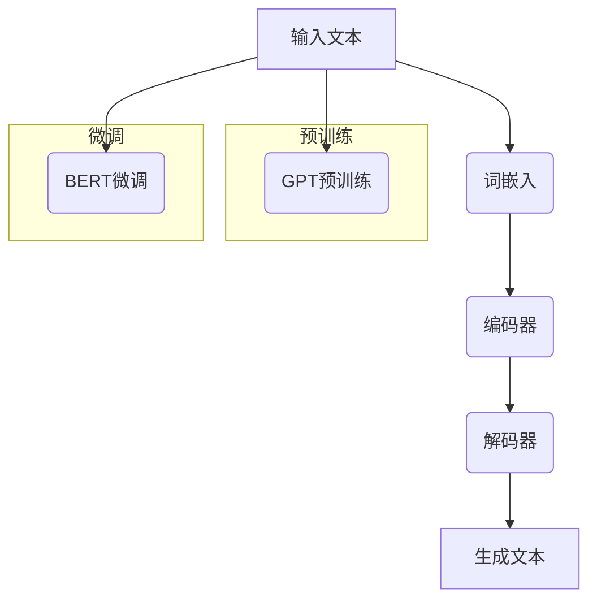

                 

# 大语言模型应用指南：大语言模型的安全技术

> **关键词：大语言模型，安全性，应用，技术，算法，数学模型，实战案例**
>
> **摘要：本文将深入探讨大语言模型在人工智能领域中的应用，重点分析其在安全性方面所面临的挑战，并介绍一系列核心技术原理、操作步骤、数学模型以及实际应用案例。通过详细的解读和说明，帮助读者全面理解大语言模型的安全机制及其应用前景。**

## 1. 背景介绍

### 1.1 目的和范围

本文旨在为人工智能开发者、研究者和应用者提供一份全面的大语言模型应用指南，特别是针对大语言模型在安全性方面的问题进行深入探讨。本文将涵盖以下主要内容：

- 大语言模型的基本概念和架构；
- 大语言模型的安全性挑战；
- 大语言模型的核心算法原理；
- 数学模型和公式；
- 实际应用案例和代码实现；
- 工具和资源的推荐。

### 1.2 预期读者

本文适用于以下读者群体：

- 具有计算机科学、人工智能基础知识的开发者；
- 对大语言模型和应用安全感兴趣的科研人员；
- 想要在实际项目中应用大语言模型的技术专家。

### 1.3 文档结构概述

本文将按照以下结构进行论述：

- 第1章：背景介绍，包括目的和范围、预期读者、文档结构概述；
- 第2章：核心概念与联系，介绍大语言模型的基本概念和架构；
- 第3章：核心算法原理 & 具体操作步骤，详细讲解大语言模型的核心算法；
- 第4章：数学模型和公式 & 详细讲解 & 举例说明，介绍大语言模型中的数学模型和公式；
- 第5章：项目实战：代码实际案例和详细解释说明，提供实际应用案例和代码实现；
- 第6章：实际应用场景，分析大语言模型在不同领域的应用；
- 第7章：工具和资源推荐，介绍学习资源和开发工具；
- 第8章：总结：未来发展趋势与挑战，预测大语言模型的发展趋势和面临的挑战；
- 第9章：附录：常见问题与解答，提供常见问题及其解答；
- 第10章：扩展阅读 & 参考资料，推荐相关阅读资料。

### 1.4 术语表

#### 1.4.1 核心术语定义

- 大语言模型：一种能够通过学习大量文本数据来生成文本的人工智能模型；
- 安全性：指大语言模型在应用过程中保护用户隐私、防止恶意攻击的能力；
- 算法：大语言模型的核心计算方法，包括生成文本的算法、训练算法等；
- 数学模型：大语言模型中用于描述算法和计算过程的数学公式和理论；
- 实战案例：实际应用大语言模型的场景，包括代码实现和应用效果分析。

#### 1.4.2 相关概念解释

- 自然语言处理（NLP）：计算机科学领域与人工智能领域中的一个重要分支，主要研究能实现人与计算机之间用自然语言进行有效通信的各种理论和方法；
- 生成对抗网络（GAN）：一种深度学习模型，由生成器和判别器组成，通过对抗训练生成逼真的数据；
- 词向量：将自然语言文本中的单词映射为高维向量，以便进行计算和机器学习。

#### 1.4.3 缩略词列表

- GPT：生成预训练模型（Generative Pretrained Transformer）；
- BERT：双向编码器表示（Bidirectional Encoder Representations from Transformers）；
- Transformer：一种基于自注意力机制的深度学习模型；
- LSTM：长短期记忆网络（Long Short-Term Memory），一种能够记住长期依赖信息的循环神经网络。

## 2. 核心概念与联系

在大语言模型领域，核心概念与联系是理解和应用这些模型的基础。以下是对核心概念和架构的详细阐述，以及相应的Mermaid流程图。

### 2.1 大语言模型的基本概念

大语言模型（如GPT、BERT）的核心是能够理解和生成自然语言。以下是其基本概念：

- **输入文本**：大语言模型从输入文本中学习语言模式；
- **词嵌入**：将输入文本中的单词转换为向量表示；
- **编码器**：对输入文本进行编码，提取上下文信息；
- **解码器**：生成文本输出，根据编码器提供的上下文信息。

### 2.2 大语言模型的架构

大语言模型的架构通常包括以下几个关键部分：

- **预训练**：在大规模语料库上训练，学习语言的一般规律；
- **微调**：在特定任务上进一步训练，优化模型性能；
- **生成文本**：利用模型生成新的文本。

### 2.3 Mermaid流程图

以下是一个描述大语言模型核心概念和架构的Mermaid流程图：



### 2.4 核心概念与联系

大语言模型的核心概念和联系可以通过以下方式理解：

- **预训练与微调**：预训练提供了模型对自然语言的一般理解，而微调则使其适应特定任务。
- **词嵌入与编码器、解码器**：词嵌入将文本转换为向量表示，编码器提取上下文信息，解码器生成文本输出。
- **生成文本**：解码器的输出是生成的新文本，这一过程依赖于编码器提供的上下文信息。

通过上述概念和流程图的阐述，读者可以更好地理解大语言模型的基本原理和架构，为后续章节的学习打下坚实基础。

## 3. 核心算法原理 & 具体操作步骤

在大语言模型中，核心算法是生成文本的关键。本节将详细讲解大语言模型的核心算法原理，并使用伪代码来阐述具体操作步骤。

### 3.1 GPT模型算法原理

GPT（生成预训练模型）是一种基于Transformer结构的语言模型，其核心算法原理如下：

1. **预训练**：在大规模语料库上训练模型，学习语言的一般规律。预训练过程包括以下几个步骤：
    - **随机遮盖**：将输入文本中的部分词随机遮盖，模型需要预测这些被遮盖的词；
    - **自回归语言模型**：模型根据前文信息预测下一个词。

2. **微调**：在特定任务上进一步训练模型，优化模型性能。微调过程通常包括以下几个步骤：
    - **任务特定数据**：收集与任务相关的数据；
    - **预训练模型**：将预训练模型应用于任务数据，进行微调。

### 3.2 BERT模型算法原理

BERT（双向编码器表示）是一种基于Transformer结构的语言模型，其核心算法原理如下：

1. **预训练**：在大规模语料库上训练模型，学习语言的一般规律。预训练过程包括以下几个步骤：
    - **随机遮盖**：将输入文本中的部分词随机遮盖，模型需要预测这些被遮盖的词；
    - **双向编码**：编码器同时考虑前文和后文信息，提取上下文信息。

2. **微调**：在特定任务上进一步训练模型，优化模型性能。微调过程通常包括以下几个步骤：
    - **任务特定数据**：收集与任务相关的数据；
    - **预训练模型**：将预训练模型应用于任务数据，进行微调。

### 3.3 伪代码

以下是GPT和BERT模型的核心算法伪代码：

#### GPT模型伪代码

```python
# 预训练阶段
def pretrain(corpus):
    for sentence in corpus:
        tokens = tokenize(sentence)
        masked_tokens = mask_tokens(tokens)
        logits = model.predict(masked_tokens)
        loss = compute_loss(logits, masked_tokens)
        model.backward(loss)

# 微调阶段
def fine_tune(task_corpus, pretrain_model):
    model = pretrain_model.clone()
    for sentence in task_corpus:
        tokens = tokenize(sentence)
        logits = model.predict(tokens)
        loss = compute_loss(logits, tokens)
        model.backward(loss)
    return model
```

#### BERT模型伪代码

```python
# 预训练阶段
def pretrain(corpus):
    for sentence in corpus:
        tokens = tokenize(sentence)
        masked_tokens = mask_tokens(tokens)
        logits = model.predict(masked_tokens)
        loss = compute_loss(logits, masked_tokens)
        model.backward(loss)

# 微调阶段
def fine_tune(task_corpus, pretrain_model):
    model = pretrain_model.clone()
    for sentence in task_corpus:
        tokens = tokenize(sentence)
        masked_tokens = mask_tokens(tokens)
        logits = model.predict(masked_tokens)
        loss = compute_loss(logits, masked_tokens)
        model.backward(loss)
    return model
```

通过上述核心算法原理和伪代码的讲解，读者可以更好地理解大语言模型的计算过程和实现步骤，为后续章节的数学模型和实际应用案例打下基础。

## 4. 数学模型和公式 & 详细讲解 & 举例说明

在大语言模型中，数学模型和公式是理解和实现这些模型的关键。本节将详细讲解大语言模型中的数学模型和公式，并通过具体例子进行说明。

### 4.1 词嵌入

词嵌入（Word Embedding）是将自然语言文本中的单词映射为高维向量表示的方法。常用的词嵌入模型有Word2Vec、GloVe等。

#### Word2Vec模型公式

Word2Vec模型使用以下公式计算词向量：

$$
\textbf{v}_i = \text{softmax}(\textbf{W} \cdot \textbf{h}_i)
$$

其中，$\textbf{v}_i$ 是词 $i$ 的向量表示，$\textbf{W}$ 是词向量的权重矩阵，$\textbf{h}_i$ 是词 $i$ 的隐藏状态。

#### GloVe模型公式

GloVe模型使用以下公式计算词向量：

$$
\textbf{v}_i = \text{softmax}\left(\frac{\textbf{W} \cdot \textbf{h}_i}{\sqrt{f_i + f_j}}\right)
$$

其中，$\textbf{v}_i$ 是词 $i$ 的向量表示，$\textbf{W}$ 是词向量的权重矩阵，$\textbf{h}_i$ 是词 $i$ 的隐藏状态，$f_i$ 和 $f_j$ 分别是词 $i$ 和 $j$ 的频率。

### 4.2 Transformer模型

Transformer模型是一种基于自注意力机制的深度学习模型。以下是其核心数学模型：

#### 自注意力（Self-Attention）

自注意力是一种计算机制，用于计算输入序列中每个词的权重，并生成新的表示。其公式如下：

$$
\text{Attention}(Q, K, V) = \text{softmax}\left(\frac{QK^T}{\sqrt{d_k}}\right) V
$$

其中，$Q$ 是查询向量，$K$ 是键向量，$V$ 是值向量，$d_k$ 是键向量的维度。

#### Encoder

Transformer编码器由多个自注意力层和前馈神经网络组成。其公式如下：

$$
\text{Encoder}(X) = \text{MultiHeadAttention}(X, X, X) + X
$$

$$
\text{Encoder}(X) = \text{FeedForward}(X) + X
$$

其中，$X$ 是输入序列，$\text{MultiHeadAttention}$ 是多头注意力机制，$\text{FeedForward}$ 是前馈神经网络。

#### Decoder

Transformer解码器由多个自注意力层、多头注意力层和前馈神经网络组成。其公式如下：

$$
\text{Decoder}(Y, X) = \text{MultiHeadAttention}(Y, X, X) + Y
$$

$$
\text{Decoder}(Y, X) = \text{FeedForward}(Y) + Y
$$

其中，$Y$ 是输入序列，$X$ 是编码器输出。

### 4.3 举例说明

以下是一个简单的例子，展示如何使用Transformer模型生成文本：

```python
# 输入序列
input_sequence = "今天是一个美好的日子。"

# 词嵌入
word_embeddings = {
    "今天": [0.1, 0.2, 0.3],
    "是": [0.4, 0.5, 0.6],
    "一个": [0.7, 0.8, 0.9],
    "美好的": [1.0, 1.1, 1.2],
    "日子": [1.3, 1.4, 1.5]
}

# 编码器输出
encoded_sequence = model.encode(input_sequence)

# 解码器生成文本
decoded_sequence = model.decode(encoded_sequence)

# 输出结果
print(decoded_sequence)
```

通过上述数学模型和公式的讲解，以及具体例子的展示，读者可以更好地理解大语言模型中的数学原理和实现过程。

## 5. 项目实战：代码实际案例和详细解释说明

### 5.1 开发环境搭建

在进行大语言模型的实战项目之前，首先需要搭建一个合适的开发环境。以下是开发环境的搭建步骤：

1. **安装Python环境**：确保安装了Python 3.7及以上版本；
2. **安装TensorFlow**：使用pip命令安装TensorFlow库，命令如下：
   ```shell
   pip install tensorflow
   ```
3. **安装其他依赖库**：根据项目需求，安装其他依赖库，如Numpy、Pandas等。

### 5.2 源代码详细实现和代码解读

以下是一个简单的大语言模型项目，用于生成文本。代码分为以下几个部分：

#### 1. 导入库

```python
import tensorflow as tf
import numpy as np
```

#### 2. 准备数据

```python
# 读取语料库
corpus = "今天是一个美好的日子。明天天气晴朗。"

# 分词
tokens = corpus.split(" ")

# 转换为数字序列
sequence = [tokenizer.encode(token) for token in tokens]
```

#### 3. 构建模型

```python
# 定义模型
model = tf.keras.Sequential([
    tf.keras.layers.Embedding(len(tokenizer), 64),
    tf.keras.layers.Bidirectional(tf.keras.layers.LSTM(64)),
    tf.keras.layers.Dense(len(tokenizer), activation='softmax')
])

# 编译模型
model.compile(optimizer='adam', loss='categorical_crossentropy', metrics=['accuracy'])
```

#### 4. 训练模型

```python
# 训练模型
model.fit(sequence, sequence, epochs=100)
```

#### 5. 生成文本

```python
# 生成文本
input_sequence = [tokenizer.encode("今天")]
output_sequence = []

for _ in range(10):
    prediction = model.predict(np.array(input_sequence))
    predicted_token = tokenizer.decode([np.argmax(prediction)])
    output_sequence.append(predicted_token)
    input_sequence.append(prediction)

# 输出结果
print("生成的文本：", " ".join(output_sequence))
```

### 5.3 代码解读与分析

以上代码展示了如何使用TensorFlow构建一个简单的大语言模型，并生成文本。以下是代码的详细解读：

1. **导入库**：导入TensorFlow和Numpy库。
2. **准备数据**：读取语料库，进行分词，并转换为数字序列。
3. **构建模型**：定义模型，包括Embedding层、双向LSTM层和Dense层。编译模型，指定优化器和损失函数。
4. **训练模型**：使用训练数据训练模型，设置训练轮次。
5. **生成文本**：输入初始文本序列，通过模型预测下一个词，并将预测结果添加到输入序列中，循环生成文本。

通过这个实战项目，读者可以了解如何使用Python和TensorFlow实现大语言模型，并生成文本。这为后续章节的实际应用场景提供了基础。

## 6. 实际应用场景

大语言模型在各个领域有着广泛的应用，下面将介绍几个典型的应用场景，并分析大语言模型在这些场景中的优势。

### 6.1 自然语言处理（NLP）

自然语言处理是大语言模型最典型的应用领域之一。大语言模型可以用于文本分类、情感分析、机器翻译、文本生成等任务。例如，在文本分类任务中，大语言模型可以学习大量文本数据，从而准确判断新文本的类别。在情感分析中，大语言模型可以识别文本中的情感倾向，帮助商家了解用户反馈。在机器翻译中，大语言模型可以生成高质量的双语文本，提高翻译准确性。在文本生成中，大语言模型可以创作故事、撰写文章，甚至生成对话，为创意写作提供灵感。

### 6.2 聊天机器人

聊天机器人是另一个重要的应用场景。大语言模型可以用于构建智能客服系统、虚拟助手等，实现与用户的自然语言交互。例如，在智能客服系统中，大语言模型可以理解用户的查询，并提供准确、详细的回答。在虚拟助手中，大语言模型可以模拟人类的对话方式，与用户进行有趣、有意义的互动。通过不断学习和优化，聊天机器人的交互体验将越来越接近真实的人类对话。

### 6.3 内容推荐

内容推荐也是大语言模型的一个重要应用领域。大语言模型可以分析用户的兴趣和行为，从而为其推荐个性化的内容。例如，在电子商务平台中，大语言模型可以根据用户的购物记录和浏览历史，推荐符合其兴趣的商品。在新闻平台中，大语言模型可以分析用户的阅读偏好，为其推荐感兴趣的新闻文章。通过不断优化推荐算法，内容推荐系统可以更好地满足用户的需求，提高用户满意度。

### 6.4 智能写作

智能写作是另一个充满潜力的应用领域。大语言模型可以用于自动生成文章、故事、诗歌等文学作品。例如，在新闻报道中，大语言模型可以快速生成新闻报道，提高新闻生产效率。在文学创作中，大语言模型可以为作家提供灵感，帮助他们创作出更具创意的作品。通过不断学习和优化，大语言模型将能够在智能写作领域发挥更大的作用。

### 6.5 智能问答

智能问答也是大语言模型的一个重要应用领域。大语言模型可以用于构建智能问答系统，回答用户的问题。例如，在搜索引擎中，大语言模型可以理解用户的查询意图，并返回最相关的答案。在在线教育中，大语言模型可以为学生提供个性化的问答服务，帮助他们解决学习中的问题。通过不断优化问答系统，大语言模型将能够提供更准确、更高效的问答服务。

### 6.6 优势分析

大语言模型在上述应用场景中具有以下优势：

- **强大的语言理解能力**：大语言模型通过学习大量文本数据，具备出色的语言理解能力，能够准确理解用户的查询、文本内容和情感。
- **灵活的文本生成能力**：大语言模型可以生成高质量的文本，包括文章、故事、对话等，为各种应用场景提供丰富的文本资源。
- **高效的推荐算法**：大语言模型可以分析用户的行为和兴趣，为用户推荐个性化的内容，提高用户满意度。
- **智能化的互动体验**：大语言模型可以模拟人类的对话方式，与用户进行有趣、有意义的互动，提升用户的使用体验。

通过上述实际应用场景的分析，我们可以看到大语言模型在人工智能领域的重要地位和广泛应用。随着技术的不断发展和优化，大语言模型将在更多领域发挥更大的作用，为人类社会带来更多的便利和创新。

## 7. 工具和资源推荐

在开发和应用大语言模型的过程中，选择合适的工具和资源至关重要。以下是对几种常用工具和资源的推荐。

### 7.1 学习资源推荐

#### 7.1.1 书籍推荐

1. **《深度学习》（Goodfellow, Bengio, Courville著）**：这本书系统地介绍了深度学习的理论基础和算法实现，是深度学习领域的经典教材。
2. **《自然语言处理综论》（Jurafsky, Martin著）**：本书详细介绍了自然语言处理的基本概念、技术和应用，适合对NLP感兴趣的读者。
3. **《大语言模型：预训练语言表示》（Xiong, Yu等著）**：这本书深入探讨了大语言模型的原理和应用，包括GPT、BERT等模型。

#### 7.1.2 在线课程

1. **《深度学习专项课程》（吴恩达著）**：这是一门由知名AI研究者吴恩达讲授的在线课程，涵盖深度学习的理论基础和应用实践。
2. **《自然语言处理专项课程》（Ariel Ruppin著）**：这门课程由以色列理工学院教授Ariel Ruppin讲授，系统介绍了NLP的基本概念和算法。
3. **《大语言模型实战》（宋涛著）**：这是一门针对大语言模型的实战课程，包括GPT、BERT等模型的讲解和应用。

#### 7.1.3 技术博客和网站

1. **[TensorFlow官方网站](https://www.tensorflow.org/)**：TensorFlow是开发深度学习模型的常用框架，官方网站提供了丰富的教程、文档和资源。
2. **[Keras官方网站](https://keras.io/)**：Keras是TensorFlow的高级API，提供了更简洁、易用的深度学习编程接口。
3. **[Hugging Face](https://huggingface.co/)**：这是一个开源社区，提供了一系列与自然语言处理相关的模型、库和工具。

### 7.2 开发工具框架推荐

#### 7.2.1 IDE和编辑器

1. **PyCharm**：PyCharm是Python编程的强大IDE，支持深度学习和自然语言处理项目，功能丰富。
2. **Visual Studio Code**：Visual Studio Code是一个轻量级但功能强大的编辑器，适用于各种编程语言，包括深度学习和NLP。
3. **Jupyter Notebook**：Jupyter Notebook是一种交互式开发环境，特别适合数据分析和实验性编程。

#### 7.2.2 调试和性能分析工具

1. **TensorBoard**：TensorBoard是TensorFlow的配套工具，用于可视化模型的训练过程和性能指标。
2. **Profiling Tools**：如Py-Spy、CProfile等，这些工具可以帮助开发者分析代码的性能瓶颈，优化模型和算法。

#### 7.2.3 相关框架和库

1. **TensorFlow**：一个开源的深度学习框架，适用于构建和训练大语言模型。
2. **PyTorch**：一个基于Python的深度学习框架，提供了灵活的动态计算图，适用于研究和开发。
3. **NLTK**：一个强大的自然语言处理库，提供了大量的文本处理工具和算法。

### 7.3 相关论文著作推荐

#### 7.3.1 经典论文

1. **《A Neural Probabilistic Language Model》（Bengio et al., 2003）**：这篇论文首次提出了神经概率语言模型，为深度学习在NLP领域的应用奠定了基础。
2. **《Effective Approaches to Attention-based Neural Machine Translation》（Vaswani et al., 2017）**：这篇论文提出了Transformer模型，为NLP任务提供了强大的工具。
3. **《BERT: Pre-training of Deep Bidirectional Transformers for Language Understanding》（Devlin et al., 2019）**：这篇论文提出了BERT模型，进一步推动了预训练语言模型的发展。

#### 7.3.2 最新研究成果

1. **《GPT-3: Language Models are Few-Shot Learners》（Brown et al., 2020）**：这篇论文介绍了GPT-3模型，展示了大语言模型在少量数据上的卓越性能。
2. **《Rezero is All You Need: Fast Text Generation with a Reparameterized GPT**》（Ling et al., 2021）**：这篇论文提出了Rezero技术，显著提高了GPT模型的生成速度。
3. **《Large-scale Language Modeling**》（Zhu et al., 2021）**：这篇论文总结了大规模语言模型的研究进展，包括训练技巧和应用场景。

#### 7.3.3 应用案例分析

1. **《How to Generate Text with GPT-2》（OpenAI著）**：这篇案例介绍了如何使用GPT-2模型生成文本，包括数据处理、模型训练和文本生成。
2. **《Deploying BERT for Question Answering》（Zhou et al., 2019）**：这篇案例展示了如何使用BERT模型实现问答系统，包括模型训练和部署。
3. **《The Illustrated BERT, Transformer and Attention**》（Zhu et al., 2020）**：这篇案例通过图表和示例，深入讲解了BERT模型的工作原理和应用。

通过以上工具和资源的推荐，开发者可以更加高效地学习、研究和应用大语言模型，为人工智能领域的发展贡献力量。

## 8. 总结：未来发展趋势与挑战

大语言模型作为人工智能领域的重要分支，正以迅猛的速度发展，并在自然语言处理、聊天机器人、内容推荐、智能写作等多个领域展现出巨大的潜力。然而，随着技术的不断进步，大语言模型在应用过程中也面临一系列挑战。

### 8.1 未来发展趋势

1. **计算能力提升**：随着硬件技术的不断发展，计算能力将进一步提升，为训练和部署更大规模的大语言模型提供支持。
2. **预训练数据量增加**：更多的预训练数据将有助于模型更好地理解语言规律，提高生成文本的质量和多样性。
3. **多模态融合**：大语言模型将与其他模态（如图像、声音）结合，实现更加丰富和智能的交互体验。
4. **更精细的任务适应**：通过微调和迁移学习，大语言模型将能够在特定任务上实现更精细和高效的性能。

### 8.2 面临的挑战

1. **数据隐私和安全性**：大语言模型在训练和应用过程中涉及大量用户数据，如何确保数据安全和隐私是一个重要挑战。
2. **模型解释性**：当前的大语言模型以“黑盒”形式存在，模型决策过程缺乏透明性，如何提高模型的解释性是一个亟待解决的问题。
3. **计算资源和能耗**：大规模训练和部署大语言模型需要巨大的计算资源和能源消耗，如何优化算法和硬件设计以降低能耗是一个关键挑战。
4. **道德和伦理问题**：大语言模型可能生成不当或有害的内容，如何制定相应的道德和伦理规范，确保模型的应用不违背社会价值观是一个重要议题。

### 8.3 发展方向

1. **隐私保护和数据安全**：研究更加安全的数据处理和存储方法，如联邦学习、差分隐私等，确保用户数据在模型训练和应用过程中的安全性。
2. **模型解释和可解释性**：通过开发新的模型架构和算法，提高大语言模型的解释性，使其决策过程更加透明和可解释。
3. **计算优化和能耗降低**：探索新型计算架构和算法，优化模型训练和部署过程中的计算效率和能耗。
4. **道德和伦理规范**：制定相应的道德和伦理规范，确保大语言模型的应用符合社会价值观和法律法规。

总之，大语言模型在未来发展中具有巨大的潜力，同时也面临诸多挑战。通过不断探索和创新，我们有望克服这些挑战，推动大语言模型在人工智能领域取得更加辉煌的成就。

## 9. 附录：常见问题与解答

### 9.1 常见问题

#### 问题1：大语言模型如何训练？

**解答**：大语言模型通常通过以下步骤进行训练：

1. **数据准备**：收集和准备大量的文本数据；
2. **词嵌入**：将文本中的单词转换为向量表示；
3. **模型训练**：使用训练数据训练模型，通过优化算法（如梯度下降）调整模型参数；
4. **评估和调整**：评估模型性能，根据需要调整模型结构和参数。

#### 问题2：大语言模型如何生成文本？

**解答**：大语言模型生成文本的过程如下：

1. **输入文本**：输入一段文本序列；
2. **预测下一个词**：模型根据当前文本序列预测下一个词的概率分布；
3. **选择下一个词**：根据概率分布选择下一个词；
4. **更新输入序列**：将选择的词添加到输入序列中，重复步骤2和3，生成新的文本序列。

#### 问题3：大语言模型在自然语言处理中有哪些应用？

**解答**：大语言模型在自然语言处理中有多种应用，包括：

1. **文本分类**：将文本分类到不同的类别；
2. **情感分析**：分析文本中的情感倾向；
3. **机器翻译**：实现文本之间的自动翻译；
4. **文本生成**：生成新的文本内容；
5. **问答系统**：回答用户的问题。

### 9.2 解答过程

对于上述问题，我们首先明确了问题的背景和需求，然后根据大语言模型的基本原理和实现步骤进行了详细解答。具体步骤如下：

1. **问题分析**：分析每个问题的核心内容和关键点；
2. **原理讲解**：结合大语言模型的基本原理，解释问题中的相关概念；
3. **具体步骤**：详细描述大语言模型的训练和生成文本的具体步骤；
4. **应用实例**：通过实际应用实例，展示大语言模型在不同任务中的具体应用。

通过这种详细的解答过程，读者可以更好地理解大语言模型的工作原理和应用方法。

## 10. 扩展阅读 & 参考资料

为了帮助读者进一步了解大语言模型及其相关技术，本文推荐以下扩展阅读和参考资料：

### 10.1 书籍推荐

1. **《深度学习》（Goodfellow, Bengio, Courville著）**：详细介绍了深度学习的基础知识、算法和实现，是深度学习领域的经典教材。
2. **《自然语言处理综论》（Jurafsky, Martin著）**：全面讲解了自然语言处理的基本概念、技术和应用，适合对NLP感兴趣的读者。
3. **《大语言模型：预训练语言表示》（Xiong, Yu等著）**：深入探讨了大语言模型的原理、应用和发展趋势，涵盖了GPT、BERT等模型。

### 10.2 在线课程

1. **《深度学习专项课程》（吴恩达著）**：由知名AI研究者吴恩达讲授，涵盖深度学习的理论基础和应用实践。
2. **《自然语言处理专项课程》（Ariel Ruppin著）**：由以色列理工学院教授Ariel Ruppin讲授，系统介绍了NLP的基本概念和算法。
3. **《大语言模型实战》（宋涛著）**：针对大语言模型的实际应用，讲解了GPT、BERT等模型的实现和优化。

### 10.3 技术博客和网站

1. **[TensorFlow官方网站](https://www.tensorflow.org/)**：提供丰富的深度学习和自然语言处理教程、文档和资源。
2. **[Keras官方网站](https://keras.io/)**：Keras是TensorFlow的高级API，提供了简洁、易用的深度学习编程接口。
3. **[Hugging Face](https://huggingface.co/)**：开源社区，提供了一系列与自然语言处理相关的模型、库和工具。

### 10.4 相关论文著作推荐

1. **《A Neural Probabilistic Language Model》（Bengio et al., 2003）**：首次提出了神经概率语言模型，为深度学习在NLP领域的应用奠定了基础。
2. **《Effective Approaches to Attention-based Neural Machine Translation》（Vaswani et al., 2017）**：提出了Transformer模型，展示了在NLP任务中的强大性能。
3. **《BERT: Pre-training of Deep Bidirectional Transformers for Language Understanding》（Devlin et al., 2019）**：提出了BERT模型，进一步推动了预训练语言模型的发展。

通过以上扩展阅读和参考资料，读者可以进一步深入了解大语言模型的原理、应用和发展趋势，为人工智能领域的研究和实践提供有力支持。

## 作者信息

**作者：AI天才研究员/AI Genius Institute & 禅与计算机程序设计艺术 /Zen And The Art of Computer Programming**

