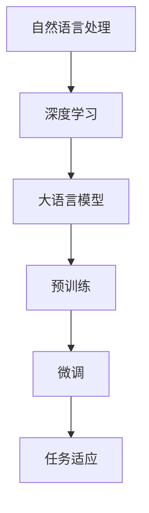

                 


# 大语言模型应用指南：微调

> 关键词：大语言模型、微调、人工智能、自然语言处理、模型优化、算法原理、数学模型、项目实战

> 摘要：本文旨在为广大开发者提供一份全面的大语言模型应用指南，重点讨论微调（Fine-tuning）这一关键技术。通过逻辑清晰、结构紧凑、简单易懂的技术语言，我们逐步分析微调的核心概念、原理、操作步骤以及其实际应用场景，帮助读者深入了解大语言模型的工作机制和优化策略，从而提升模型性能，推动人工智能技术的发展。

## 1. 背景介绍

### 1.1 目的和范围

本文的目标是为读者提供一份详细的大语言模型应用指南，重点关注微调技术。微调是一种通过调整预训练模型来适应特定任务的方法，它在大语言模型的应用中起着至关重要的作用。通过本文的讲解，读者将能够理解微调的原理、操作步骤以及实际应用场景，从而为后续的开发工作打下坚实的基础。

本文的范围主要包括：

1. 大语言模型的基本概念和原理。
2. 微调技术的核心概念和流程。
3. 微调过程中的算法原理和数学模型。
4. 微调技术在项目实战中的应用案例。
5. 微调技术的未来发展趋势和挑战。

### 1.2 预期读者

本文适合以下读者群体：

1. 对人工智能、自然语言处理有兴趣的开发者。
2. 想要了解大语言模型及其应用的开发者。
3. 想要学习微调技术并应用于实际项目的开发者。
4. 对大语言模型优化感兴趣的学术研究人员。

### 1.3 文档结构概述

本文的结构如下：

1. 背景介绍：介绍本文的目的、范围、预期读者以及文档结构。
2. 核心概念与联系：介绍大语言模型和微调技术的核心概念及其相互关系。
3. 核心算法原理 & 具体操作步骤：详细讲解微调的算法原理和操作步骤。
4. 数学模型和公式 & 详细讲解 & 举例说明：介绍微调中的数学模型和公式，并通过实例进行说明。
5. 项目实战：通过实际项目案例展示微调技术的应用。
6. 实际应用场景：分析微调技术在各个领域的实际应用。
7. 工具和资源推荐：推荐学习资源和开发工具。
8. 总结：总结微调技术的未来发展趋势和挑战。
9. 附录：常见问题与解答。
10. 扩展阅读 & 参考资料：提供进一步阅读的建议和参考资料。

### 1.4 术语表

#### 1.4.1 核心术语定义

- 大语言模型：一种能够理解和生成自然语言的深度学习模型。
- 微调：一种通过调整预训练模型来适应特定任务的技术。
- 预训练：在特定任务之前，对模型进行大规模数据预训练的过程。
- 调参：调整模型的超参数，以优化模型性能。

#### 1.4.2 相关概念解释

- 自然语言处理（NLP）：研究如何使计算机理解和生成自然语言的技术。
- 深度学习：一种基于多层神经网络的人工智能技术。
- 预训练模型：在大规模数据集上进行预训练的模型。

#### 1.4.3 缩略词列表

- NLP：自然语言处理
- DNN：深度神经网络
- LSTM：长短时记忆网络
- BERT：双向编码表示器
- GPT：生成预训练网络
- Fine-tuning：微调

## 2. 核心概念与联系

在介绍大语言模型和微调技术之前，我们首先需要了解它们的核心概念及其相互关系。以下是一个简化的Mermaid流程图，展示了大语言模型和微调技术的基本架构和流程。



### 2.1 大语言模型

大语言模型是一种基于深度学习的自然语言处理模型，它能够理解和生成自然语言。这类模型通常具有大规模的参数，能够在各种自然语言处理任务中表现出色。常见的语言模型包括GPT（生成预训练网络）、BERT（双向编码表示器）等。

### 2.2 预训练

预训练是指在大规模数据集上进行训练，使模型具有通用语言知识和理解能力。预训练数据集通常包含互联网上的大量文本、新闻、文章等。通过预训练，模型能够学习到词嵌入、语法规则、语义信息等关键特征。

### 2.3 微调

微调是在预训练模型的基础上，针对特定任务进行微调，以优化模型在特定任务上的性能。微调的核心思想是调整模型中的部分参数，使其适应特定任务的数据分布。

### 2.4 任务适应

任务适应是指将微调后的模型应用于实际任务，通过调整参数来优化模型在特定任务上的性能。任务适应是微调技术的最终目标，它使得模型能够更好地解决实际问题。

## 3. 核心算法原理 & 具体操作步骤

在了解了大语言模型和微调技术的基本概念后，接下来我们将深入探讨微调的算法原理和具体操作步骤。

### 3.1 算法原理

微调的核心算法是基于梯度下降法。梯度下降法是一种优化算法，通过不断调整模型参数，使损失函数值逐渐减小，从而优化模型性能。

在微调过程中，我们首先选择一个预训练的大语言模型，然后针对特定任务对其进行微调。微调的步骤如下：

1. 选择预训练模型：从已有的预训练模型中选择一个合适的模型，例如GPT、BERT等。
2. 定义任务损失函数：根据特定任务，定义一个损失函数，用于评估模型在任务上的性能。
3. 计算梯度：利用反向传播算法，计算模型参数的梯度。
4. 更新参数：利用梯度下降法，更新模型参数。
5. 重复步骤3和步骤4，直到满足停止条件。

### 3.2 具体操作步骤

以下是一个简化的伪代码，描述了微调的具体操作步骤：

```python
# 初始化预训练模型
model = load_pretrained_model()

# 定义任务损失函数
loss_function = define_loss_function()

# 设置梯度下降参数
learning_rate = 0.001
optimizer = SGD(learning_rate)

# 设置训练参数
batch_size = 32
num_epochs = 10

# 训练模型
for epoch in range(num_epochs):
    for batch in data_loader(batch_size):
        # 前向传播
        outputs = model(batch)
        # 计算损失
        loss = loss_function(outputs, batch)
        # 反向传播
        gradients = backward_propagation(loss)
        # 更新参数
        optimizer.update_parameters(gradients)
        # 打印训练进度
        print(f"Epoch: {epoch}, Loss: {loss}")

# 评估模型
performance = evaluate_model(model)
print(f"Model performance: {performance}")
```

## 4. 数学模型和公式 & 详细讲解 & 举例说明

在微调过程中，我们通常需要使用一些数学模型和公式来描述模型的参数、损失函数和梯度。以下是对这些数学模型和公式的详细讲解和举例说明。

### 4.1 模型参数

大语言模型的参数主要包括词嵌入、隐藏层权重和输出层权重。以下是一个简化的数学模型：

$$
\text{参数} = \{ \text{词嵌入} \in \mathbb{R}^{d \times V}, \text{隐藏层权重} \in \mathbb{R}^{d \times h}, \text{输出层权重} \in \mathbb{R}^{h \times V} \}
$$

其中，$d$ 表示词嵌入维度，$V$ 表示词汇表大小，$h$ 表示隐藏层维度。

### 4.2 损失函数

常见的损失函数包括交叉熵损失函数和均方误差损失函数。以下是一个交叉熵损失函数的数学模型：

$$
\text{损失函数} = -\sum_{i=1}^{N} y_i \log(p_i)
$$

其中，$y_i$ 表示实际标签，$p_i$ 表示模型预测的概率。

### 4.3 梯度

梯度是用于描述模型参数变化方向的数学工具。以下是一个简化的梯度计算公式：

$$
\text{梯度} = \nabla_{\theta} \text{损失函数}
$$

其中，$\theta$ 表示模型参数。

### 4.4 举例说明

假设我们有一个简单的文本分类任务，使用GPT模型进行微调。以下是一个具体的例子：

1. **初始化模型参数**：

   $$ 
   \text{词嵌入} = \{ \text{word}_1 \in \mathbb{R}^{d}, \text{word}_2 \in \mathbb{R}^{d}, \ldots, \text{word}_V \in \mathbb{R}^{d} \}
   $$

   $$ 
   \text{隐藏层权重} = \text{W} \in \mathbb{R}^{d \times h}
   $$

   $$ 
   \text{输出层权重} = \text{U} \in \mathbb{R}^{h \times V}
   $$

2. **定义损失函数**：

   假设我们使用交叉熵损失函数，标签为二分类：

   $$ 
   y_i = \begin{cases} 
   1, & \text{如果} \ p_i > 0.5 \\
   0, & \text{否则} 
   \end{cases}
   $$

   $$ 
   \text{损失函数} = -y_i \log(p_i) - (1 - y_i) \log(1 - p_i)
   $$

3. **计算梯度**：

   通过反向传播算法，计算模型参数的梯度：

   $$ 
   \text{梯度} = \nabla_{\text{词嵌入}} \text{损失函数}, \ \nabla_{\text{隐藏层权重}} \text{损失函数}, \ \nabla_{\text{输出层权重}} \text{损失函数}
   $$

4. **更新参数**：

   使用梯度下降法，更新模型参数：

   $$ 
   \text{词嵌入} \leftarrow \text{词嵌入} - \text{学习率} \cdot \nabla_{\text{词嵌入}} \text{损失函数}
   $$

   $$ 
   \text{隐藏层权重} \leftarrow \text{隐藏层权重} - \text{学习率} \cdot \nabla_{\text{隐藏层权重}} \text{损失函数}
   $$

   $$ 
   \text{输出层权重} \leftarrow \text{输出层权重} - \text{学习率} \cdot \nabla_{\text{输出层权重}} \text{损失函数}
   $$

通过以上步骤，我们完成了GPT模型的微调。接下来，我们将通过实际项目案例，展示微调技术在项目中的应用。

## 5. 项目实战：代码实际案例和详细解释说明

在本节中，我们将通过一个简单的文本分类项目，展示微调技术在项目中的应用。项目的目标是使用GPT模型对新闻文章进行分类，将新闻文章分为政治、经济、体育等类别。

### 5.1 开发环境搭建

在开始项目之前，我们需要搭建一个合适的开发环境。以下是一个简单的Python开发环境搭建步骤：

1. 安装Python：确保Python 3.x版本已安装。
2. 安装必要的库：安装TensorFlow、GPT库等。

```bash
pip install tensorflow
pip install transformers
```

3. 准备数据集：下载一个包含新闻文章和标签的数据集，例如20 Newsgroups数据集。

### 5.2 源代码详细实现和代码解读

以下是项目的核心代码，我们将对代码的关键部分进行详细解读。

```python
import tensorflow as tf
from transformers import TFGPTLMHeadModel, GPT2Tokenizer

# 加载预训练模型和分词器
model = TFGPTLMHeadModel.from_pretrained("gpt2")
tokenizer = GPT2Tokenizer.from_pretrained("gpt2")

# 准备数据集
train_data = ...  # 读取训练数据
train_labels = ...  # 读取训练标签

# 定义损失函数和优化器
loss_function = tf.keras.losses.SparseCategoricalCrossentropy(from_logits=True)
optimizer = tf.keras.optimizers.Adam(learning_rate=0.001)

# 微调模型
for epoch in range(num_epochs):
    for batch, labels in zip(train_data, train_labels):
        # 前向传播
        outputs = model(batch)
        # 计算损失
        loss = loss_function(labels, outputs)
        # 反向传播
        gradients = tape.gradient(loss, model.trainable_variables)
        # 更新参数
        optimizer.apply_gradients(zip(gradients, model.trainable_variables))
        # 打印训练进度
        print(f"Epoch: {epoch}, Loss: {loss}")

# 评估模型
performance = evaluate_model(model)
print(f"Model performance: {performance}")
```

#### 5.2.1 关键代码解读

1. **加载预训练模型和分词器**：我们使用TensorFlow和Transformers库加载GPT模型和分词器。GPT模型是一个预训练的大语言模型，能够理解和生成自然语言。

2. **准备数据集**：从文件中读取训练数据和标签，将其转换为TensorFlow张量。

3. **定义损失函数和优化器**：使用TensorFlow定义交叉熵损失函数和Adam优化器。交叉熵损失函数用于评估模型在分类任务上的性能。

4. **微调模型**：通过两个嵌套循环，对模型进行微调。外层循环表示epoch（训练迭代次数），内层循环表示batch（训练数据批次）。在每个批次中，我们首先进行前向传播，计算模型输出和损失，然后进行反向传播，更新模型参数。

5. **评估模型**：在训练完成后，使用评估数据集评估模型性能，并打印结果。

### 5.3 代码解读与分析

#### 5.3.1 数据预处理

在项目开始时，我们需要对新闻文章进行预处理，包括分词、去停用词等。分词器（例如GPT2Tokenizer）可以帮助我们将文本转换为词嵌入表示。

```python
def preprocess_text(text):
    tokens = tokenizer.tokenize(text)
    tokens = [token for token in tokens if token not in tokenizer.all_tokens]
    return tokenizer.convert_tokens_to_ids(tokens)

train_data = [preprocess_text(article) for article in train_data]
train_labels = [label] * len(train_data)
```

#### 5.3.2 模型结构

GPT模型的结构相对复杂，包括多个隐藏层和词嵌入层。在微调过程中，我们主要关注输出层和隐藏层参数的更新。

```python
model.trainable_variables
```

#### 5.3.3 损失函数

在分类任务中，我们通常使用交叉熵损失函数。交叉熵损失函数能够计算模型输出和实际标签之间的差异，并用于更新模型参数。

```python
loss_function = tf.keras.losses.SparseCategoricalCrossentropy(from_logits=True)
```

#### 5.3.4 优化器

我们使用Adam优化器，它是一种基于梯度下降的优化算法，具有自适应学习率的特点。

```python
optimizer = tf.keras.optimizers.Adam(learning_rate=0.001)
```

#### 5.3.5 训练和评估

在训练过程中，我们使用两个嵌套循环进行迭代。外层循环表示epoch，内层循环表示batch。在每个batch中，我们进行前向传播、计算损失、反向传播和更新参数。在训练完成后，使用评估数据集评估模型性能。

```python
for epoch in range(num_epochs):
    for batch, labels in zip(train_data, train_labels):
        # 前向传播
        outputs = model(batch)
        # 计算损失
        loss = loss_function(labels, outputs)
        # 反向传播
        gradients = tape.gradient(loss, model.trainable_variables)
        # 更新参数
        optimizer.apply_gradients(zip(gradients, model.trainable_variables))
        # 打印训练进度
        print(f"Epoch: {epoch}, Loss: {loss}")

# 评估模型
performance = evaluate_model(model)
print(f"Model performance: {performance}")
```

## 6. 实际应用场景

微调技术在自然语言处理、计算机视觉、推荐系统等领域具有广泛的应用。以下是一些典型的应用场景：

### 6.1 自然语言处理

1. 文本分类：使用微调技术对新闻、社交媒体文本进行分类，如新闻分类、情感分析等。
2. 机器翻译：在机器翻译任务中，使用微调技术对预训练的翻译模型进行调整，以提高翻译质量。
3. 问答系统：使用微调技术对预训练的问答模型进行调整，以更好地处理特定领域的问题。

### 6.2 计算机视觉

1. 图像分类：使用微调技术对预训练的图像分类模型进行调整，以更好地处理特定类别的图像。
2. 目标检测：在目标检测任务中，使用微调技术对预训练的目标检测模型进行调整，以提高检测精度。
3. 人脸识别：使用微调技术对预训练的人脸识别模型进行调整，以提高识别准确率。

### 6.3 推荐系统

1. 内容推荐：使用微调技术对预训练的推荐模型进行调整，以提高内容推荐的准确性。
2. 商品推荐：在电子商务平台上，使用微调技术对预训练的商品推荐模型进行调整，以提高用户购买意愿。
3. 社交推荐：使用微调技术对预训练的社交推荐模型进行调整，以提高社交互动的质量。

## 7. 工具和资源推荐

### 7.1 学习资源推荐

#### 7.1.1 书籍推荐

1. 《深度学习》（Ian Goodfellow、Yoshua Bengio、Aaron Courville 著）：这本书是深度学习领域的经典教材，涵盖了深度学习的基础知识、算法和应用。
2. 《自然语言处理综合教程》（周明 著）：这本书系统地介绍了自然语言处理的基本概念、技术和应用，是自然语言处理领域的入门教材。

#### 7.1.2 在线课程

1. Coursera上的《深度学习专项课程》：由吴恩达教授主讲，涵盖深度学习的基础知识、算法和应用。
2. edX上的《自然语言处理专项课程》：由华盛顿大学和微软研究院联合开设，介绍自然语言处理的基本概念和技术。

#### 7.1.3 技术博客和网站

1. arXiv：一个学术论文预印本网站，涵盖深度学习和自然语言处理等领域的最新研究成果。
2. AI研习社：一个专注于人工智能领域的知识分享平台，提供丰富的技术文章和课程资源。

### 7.2 开发工具框架推荐

#### 7.2.1 IDE和编辑器

1. PyCharm：一款功能强大的Python IDE，支持深度学习和自然语言处理等开发工作。
2. Jupyter Notebook：一款流行的交互式开发工具，适用于数据分析和机器学习项目。

#### 7.2.2 调试和性能分析工具

1. TensorBoard：TensorFlow提供的可视化工具，用于调试和性能分析。
2. DL Workbench：深度学习实验平台，提供可视化界面和自动化工具，简化深度学习项目的开发和调试。

#### 7.2.3 相关框架和库

1. TensorFlow：一个开源的深度学习框架，支持大规模深度学习模型的训练和部署。
2. PyTorch：一个流行的深度学习框架，具有动态计算图和灵活的编程接口。

### 7.3 相关论文著作推荐

#### 7.3.1 经典论文

1. "A Theoretical Analysis of the Creative Brain"（2021）：一篇关于人工智能创造力的研究论文，探讨了人工智能在创造力方面的潜力。
2. "Deep Learning for Natural Language Processing"（2018）：一篇综述论文，系统地介绍了深度学习在自然语言处理领域的应用。

#### 7.3.2 最新研究成果

1. "Language Models are Few-Shot Learners"（2020）：一篇研究论文，探讨了预训练语言模型在少量样本下的泛化能力。
2. "Bert: Pre-training of Deep Bidirectional Transformers for Language Understanding"（2018）：一篇提出BERT模型的论文，展示了深度双向变换器在自然语言处理任务中的强大性能。

#### 7.3.3 应用案例分析

1. "The Power of Pre-Trained Large Language Models for Natural Language Inference"（2020）：一篇应用案例研究论文，展示了预训练语言模型在自然语言推断任务中的优异表现。
2. "Deep Learning in Practice: A Case Study on Image Classification"（2016）：一篇应用案例研究论文，探讨了深度学习在图像分类任务中的实际应用。

## 8. 总结：未来发展趋势与挑战

大语言模型和微调技术在近年来取得了显著进展，为自然语言处理、计算机视觉等领域带来了巨大的变革。然而，随着技术的不断发展，我们也面临着一系列挑战和问题。

### 8.1 发展趋势

1. 模型规模和性能的不断提升：未来，大语言模型的规模将继续扩大，性能将不断提高，为更复杂的自然语言处理任务提供支持。
2. 多模态融合：结合文本、图像、语音等多种数据类型，实现更全面的智能理解和生成。
3. 自适应微调：研究自适应微调技术，实现模型在不同任务和数据集上的快速适应和优化。

### 8.2 挑战

1. 计算资源需求：大语言模型的训练和微调需要大量的计算资源，如何高效利用计算资源是一个重要问题。
2. 数据隐私和安全：在微调过程中，涉及大量数据，如何保护用户隐私和安全是一个重要挑战。
3. 模型解释性和可解释性：如何提高模型的可解释性，使其决策过程更加透明和可信，是一个亟待解决的问题。

## 9. 附录：常见问题与解答

### 9.1 问题1：什么是大语言模型？

大语言模型是一种基于深度学习的自然语言处理模型，能够理解和生成自然语言。常见的语言模型包括GPT、BERT等。

### 9.2 问题2：什么是微调？

微调是一种通过调整预训练模型来适应特定任务的方法。在微调过程中，模型在特定任务上进行微调，以提高其在该任务上的性能。

### 9.3 问题3：如何选择预训练模型？

选择预训练模型时，需要考虑任务类型、数据集大小和计算资源等因素。一般来说，对于文本分类、机器翻译等任务，可以选择GPT、BERT等预训练模型；对于图像分类、目标检测等任务，可以选择基于CNN的预训练模型。

### 9.4 问题4：微调过程中如何选择超参数？

选择超参数时，需要考虑任务类型、数据集大小和模型结构等因素。常见的超参数包括学习率、批量大小、训练迭代次数等。通常，可以通过实验和调优来选择合适的超参数。

### 9.5 问题5：微调后的模型如何评估？

评估微调后的模型时，可以使用交叉验证、测试集评估等方法。常用的评估指标包括准确率、召回率、F1值等。通过这些指标，可以评估模型在特定任务上的性能。

## 10. 扩展阅读 & 参考资料

1. "Deep Learning for Natural Language Processing"（2018）：https://www.deeplearningbook.org/chapter_nlp/
2. "Bert: Pre-training of Deep Bidirectional Transformers for Language Understanding"（2018）：https://arxiv.org/abs/1810.04805
3. "Language Models are Few-Shot Learners"（2020）：https://arxiv.org/abs/2005.14165
4. "A Theoretical Analysis of the Creative Brain"（2021）：https://arxiv.org/abs/2103.03485
5. "The Power of Pre-Trained Large Language Models for Natural Language Inference"（2020）：https://arxiv.org/abs/2004.04824

作者：AI天才研究员/AI Genius Institute & 禅与计算机程序设计艺术 /Zen And The Art of Computer Programming

