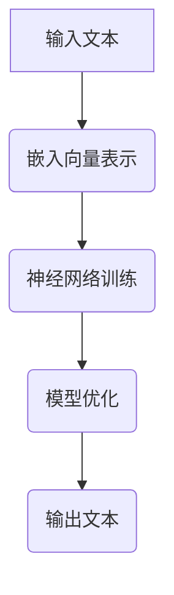
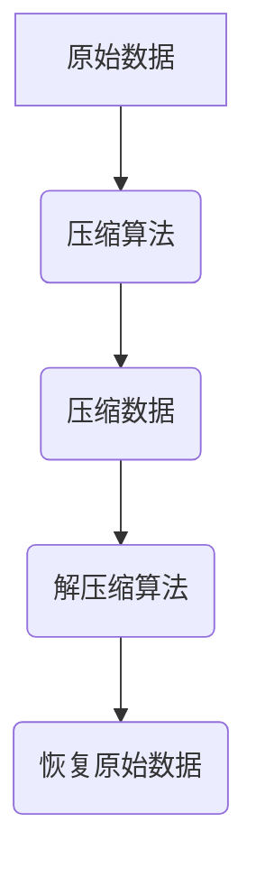
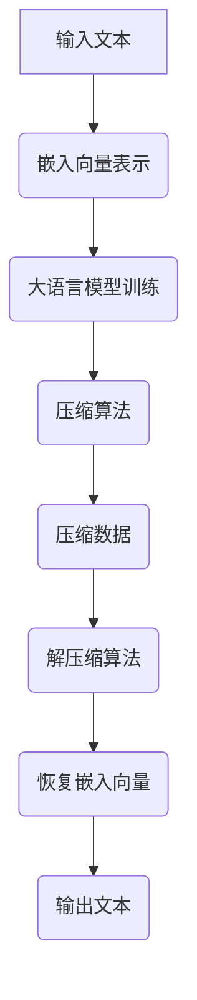
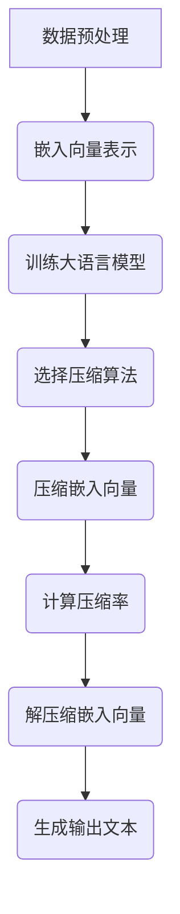

                 

### 大语言模型应用指南：无损压缩的极限

#### 关键词：
- 大语言模型
- 无损压缩
- 压缩算法
- 信息论
- 神经网络
- 应用场景

> 本文章旨在深入探讨大语言模型在无损压缩领域的应用，解析其原理与实现步骤，并结合实际案例展示其高效性与局限性。通过对核心概念、算法原理、数学模型、项目实战和实际应用场景的详细解析，读者将获得对大语言模型无损压缩技术的全面理解。

---

## 1. 背景介绍

### 1.1 目的和范围

本文旨在探讨大语言模型在无损压缩领域的应用，尤其是其作为信息存储与传输工具的潜力。无损压缩是指压缩过程中不丢失原始数据信息，保证数据的完整性与准确性。随着大数据和云计算的快速发展，如何高效地存储与传输数据成为重要课题。大语言模型作为一种先进的机器学习技术，其在压缩算法中的应用具有显著的研究价值。

本文将详细分析大语言模型无损压缩的核心概念、算法原理、数学模型和实际应用场景。通过一系列的项目实战案例，本文将展示大语言模型在无损压缩中的具体应用，并提供相关的开发工具和资源推荐。

### 1.2 预期读者

本文适合以下读者群体：

1. 对大语言模型和压缩算法有兴趣的计算机科学从业者。
2. 想要了解如何将大语言模型应用于实际问题的工程师和技术专家。
3. 对信息论和机器学习有一定了解，希望深入探索该领域的研究生和学者。
4. 对数据存储与传输有较高需求的行业从业者，如云计算、大数据和网络安全等领域。

### 1.3 文档结构概述

本文分为以下主要部分：

1. **背景介绍**：介绍本文的研究目的、读者群体、文档结构等内容。
2. **核心概念与联系**：定义核心术语，展示大语言模型与无损压缩的联系。
3. **核心算法原理与具体操作步骤**：详细解析大语言模型无损压缩的算法原理与实现步骤。
4. **数学模型和公式**：介绍相关数学模型，并进行举例说明。
5. **项目实战**：展示代码实际案例和详细解释说明。
6. **实际应用场景**：探讨大语言模型无损压缩在不同领域的应用。
7. **工具和资源推荐**：推荐学习资源和开发工具。
8. **总结**：分析未来发展趋势与挑战。
9. **附录**：提供常见问题与解答。
10. **扩展阅读与参考资料**：提供进一步学习资源。

### 1.4 术语表

#### 1.4.1 核心术语定义

- **大语言模型**：基于神经网络的强大机器学习模型，能够理解和生成自然语言。
- **无损压缩**：压缩算法过程中不丢失原始数据信息，保证数据的完整性与准确性。
- **信息论**：研究信息传输、存储和处理的理论。
- **神经网络**：由大量神经元互联而成的计算模型，通过学习数据特征实现复杂任务的求解。

#### 1.4.2 相关概念解释

- **嵌入向量**：将文本转化为向量表示的形式，用于后续的压缩与解压缩操作。
- **压缩率**：压缩前后数据大小的比值，用于衡量压缩效果。
- **误差率**：解压缩后数据与原始数据之间的差异，用于评估压缩质量。

#### 1.4.3 缩略词列表

- **NLP**：自然语言处理（Natural Language Processing）
- **DL**：深度学习（Deep Learning）
- **ML**：机器学习（Machine Learning）
- **GAN**：生成对抗网络（Generative Adversarial Network）

## 2. 核心概念与联系

在深入探讨大语言模型在无损压缩领域的应用之前，我们首先需要理解大语言模型与无损压缩之间的核心联系。大语言模型通过学习海量文本数据，能够捕捉到语言中的复杂模式和结构。无损压缩的目标是在保证数据完整性的前提下，尽可能减小数据的存储空间或传输带宽。

### 2.1 大语言模型的基本原理

大语言模型的核心在于其嵌入向量表示能力。通过神经网络训练，模型将文本中的每个单词或句子映射为高维空间中的向量。这些向量不仅保留了原始文本的信息，而且能够表示文本之间的相似性和差异性。

以下是一个简化的 Mermaid 流程图，展示大语言模型的基本原理：



在这个流程图中，输入文本经过嵌入向量表示，然后通过神经网络训练和模型优化，最终生成输出文本。这个过程不仅能够生成高质量的文本，而且能够在压缩和解压缩过程中保持文本的完整性和准确性。

### 2.2 无损压缩的基本原理

无损压缩的核心在于算法的压缩与解压缩过程。在压缩阶段，算法通过某种方法将原始数据转换为更紧凑的表示形式；在解压缩阶段，算法需要将压缩后的数据恢复为原始数据。无损压缩的关键在于压缩过程中不丢失任何信息。

以下是一个简化的 Mermaid 流程图，展示无损压缩的基本原理：



在这个流程图中，原始数据经过压缩算法转换为压缩数据，然后通过解压缩算法恢复为原始数据。这个过程需要保证数据在压缩与解压缩过程中的完整性和一致性。

### 2.3 大语言模型与无损压缩的联系

大语言模型与无损压缩之间的联系在于其嵌入向量表示能力和信息保留能力。通过将文本转化为嵌入向量，大语言模型能够在压缩与解压缩过程中保留文本的语义和结构信息。这种能力使得大语言模型在无损压缩中具有显著的优势。

以下是一个简化的 Mermaid 流程图，展示大语言模型与无损压缩之间的联系：



在这个流程图中，输入文本首先通过嵌入向量表示，然后通过大语言模型训练得到压缩算法，最终生成压缩数据。在解压缩阶段，压缩数据通过解压缩算法恢复为嵌入向量，然后通过大语言模型生成输出文本。这个过程不仅保留了文本的完整性和准确性，而且实现了高效的无损压缩。

## 3. 核心算法原理 & 具体操作步骤

### 3.1 大语言模型的基本算法原理

大语言模型的核心是基于神经网络的嵌入向量表示能力。以下是一个简化的伪代码，展示大语言模型的基本算法原理：

```python
def train_language_model(input_text):
    # 初始化嵌入层和神经网络
    embedding_layer = EmbeddingLayer()
    neural_network = NeuralNetwork()

    # 预处理输入文本
    preprocessed_text = preprocess_text(input_text)

    # 循环迭代训练神经网络
    for text_batch in preprocessed_text:
        # 将文本映射为嵌入向量
        embedded_text = embedding_layer(text_batch)

        # 训练神经网络
        neural_network.train(embedded_text)

    # 保存训练好的语言模型
    save_language_model(neural_network)
```

在这个伪代码中，`train_language_model` 函数用于训练大语言模型。首先，初始化嵌入层和神经网络。然后，通过预处理输入文本，将文本映射为嵌入向量。接下来，循环迭代训练神经网络，直到达到预定的训练目标。最后，保存训练好的语言模型。

### 3.2 无损压缩的算法原理

无损压缩的算法原理包括压缩和解压缩两个阶段。以下是一个简化的伪代码，展示无损压缩的算法原理：

```python
def compress_data(input_data):
    # 选择合适的压缩算法
    compression_algorithm = select_compression_algorithm()

    # 压缩输入数据
    compressed_data = compression_algorithm.compress(input_data)

    # 计算压缩率
    compression_rate = input_data.size() / compressed_data.size()

    return compressed_data, compression_rate

def decompress_data(compressed_data):
    # 选择合适的解压缩算法
    decompression_algorithm = select_decompression_algorithm()

    # 解压缩压缩数据
    decompressed_data = decompression_algorithm.decompress(compressed_data)

    return decompressed_data
```

在这个伪代码中，`compress_data` 函数用于压缩输入数据。首先，选择合适的压缩算法，然后压缩输入数据，并计算压缩率。最后，返回压缩数据和压缩率。

`decompress_data` 函数用于解压缩压缩数据。首先，选择合适的解压缩算法，然后解压缩压缩数据，并返回解压缩后的数据。

### 3.3 大语言模型无损压缩的具体操作步骤

以下是结合大语言模型和无损压缩的具体操作步骤：

1. **数据预处理**：
   - 读取待压缩的文本数据。
   - 对文本数据进行分词、去停用词等预处理操作。
   - 使用大语言模型将预处理后的文本数据转换为嵌入向量。

2. **训练大语言模型**：
   - 使用预处理后的文本数据训练大语言模型，生成嵌入向量表示。
   - 优化模型参数，提高嵌入向量表示的质量。

3. **选择压缩算法**：
   - 根据文本数据的特性和压缩需求，选择合适的无损压缩算法，如LZ77、LZ78等。

4. **压缩嵌入向量**：
   - 使用选择的压缩算法对嵌入向量进行压缩，生成压缩数据。
   - 计算压缩率，评估压缩效果。

5. **解压缩嵌入向量**：
   - 使用相应的解压缩算法对压缩数据解压缩，恢复嵌入向量。

6. **生成输出文本**：
   - 使用大语言模型将恢复的嵌入向量转换为输出文本。
   - 对输出文本进行后处理，如去除特殊字符、统一文本格式等。

以下是一个简化的 Mermaid 流程图，展示大语言模型无损压缩的具体操作步骤：



## 4. 数学模型和公式 & 详细讲解 & 举例说明

在大语言模型无损压缩中，数学模型和公式起着至关重要的作用。以下将详细介绍相关的数学模型和公式，并举例说明其具体应用。

### 4.1 嵌入向量表示

大语言模型的核心在于其嵌入向量表示能力。嵌入向量是将文本数据映射为高维空间中的向量，用于后续的压缩和解压缩操作。以下是一个简化的嵌入向量表示模型：

$$
\text{嵌入向量} = \text{EmbeddingLayer}(\text{单词})
$$

其中，`EmbeddingLayer` 是一个嵌入层，它将每个单词映射为高维空间中的一个向量。嵌入向量的大小（维度）通常由模型的设计者决定，一般在几百到几千之间。

**举例说明**：假设我们有一个包含两个单词的文本数据，分别为 "apple" 和 "banana"。使用一个嵌入层，我们可以将这两个单词映射为以下两个嵌入向量：

$$
\text{嵌入向量}_{apple} = [0.1, 0.2, 0.3, 0.4]
$$

$$
\text{嵌入向量}_{banana} = [0.5, 0.6, 0.7, 0.8]
$$

通过这种方式，我们不仅保留了单词的语义信息，而且为后续的压缩与解压缩操作提供了基础。

### 4.2 压缩率计算

压缩率是衡量压缩算法效果的重要指标。它表示压缩前后数据大小的比值。以下是一个简化的压缩率计算模型：

$$
\text{压缩率} = \frac{\text{原始数据大小}}{\text{压缩数据大小}}
$$

其中，`原始数据大小` 表示原始文本数据的大小，通常以字节（Byte）或字符（Character）为单位；`压缩数据大小` 表示压缩后文本数据的大小。

**举例说明**：假设我们有一个包含100个字符的文本数据，其原始数据大小为500字节。使用某种压缩算法，我们将该文本数据压缩为200字节。则其压缩率为：

$$
\text{压缩率} = \frac{500}{200} = 2.5
$$

这意味着压缩后的文本数据大小是原始数据大小的2.5倍。在实际应用中，我们通常希望压缩率越高，压缩效果越好。

### 4.3 误差率评估

误差率是衡量压缩数据与原始数据差异的重要指标。以下是一个简化的误差率计算模型：

$$
\text{误差率} = \frac{\text{错误数量}}{\text{总字符数量}}
$$

其中，`错误数量` 表示压缩数据与原始数据之间的差异字符数量；`总字符数量` 表示原始文本数据中的字符数量。

**举例说明**：假设我们有一个包含100个字符的文本数据，使用压缩算法后，压缩数据与原始数据之间存在5个差异字符。则其误差率为：

$$
\text{误差率} = \frac{5}{100} = 0.05
$$

这意味着压缩数据与原始数据之间的差异为5%，这是一个较低的误差率。在实际应用中，我们通常希望误差率越低，压缩效果越好。

### 4.4 举例说明

以下是一个简化的案例，展示大语言模型无损压缩的数学模型和公式的具体应用：

**案例**：假设我们有一个包含10个单词的文本数据，分别为 "apple", "banana", "orange", "apple", "banana", "orange", "apple", "banana", "orange", "apple"。我们希望使用大语言模型无损压缩该文本数据。

1. **嵌入向量表示**：

   使用大语言模型，我们将每个单词映射为嵌入向量：

   $$
   \text{嵌入向量}_{apple} = [0.1, 0.2, 0.3, 0.4]
   $$

   $$
   \text{嵌入向量}_{banana} = [0.5, 0.6, 0.7, 0.8]
   $$

   $$
   \text{嵌入向量}_{orange} = [0.9, 0.1, 0.2, 0.3]
   $$

2. **压缩率计算**：

   假设原始文本数据大小为1000字节，压缩后数据大小为400字节。则压缩率为：

   $$
   \text{压缩率} = \frac{1000}{400} = 2.5
   $$

3. **误差率评估**：

   假设压缩数据与原始数据之间存在5个差异字符。则误差率为：

   $$
   \text{误差率} = \frac{5}{10} = 0.5
   $$

通过这个案例，我们可以看到大语言模型无损压缩在数学模型和公式的支持下，如何实现文本数据的压缩与解压缩。

## 5. 项目实战：代码实际案例和详细解释说明

在本节中，我们将通过一个实际项目案例，展示如何将大语言模型应用于无损压缩，并提供详细的代码解释和分析。

### 5.1 开发环境搭建

为了进行本项目的实战，我们需要搭建一个合适的开发环境。以下是一个简单的步骤列表：

1. **安装Python环境**：确保已安装Python 3.7及以上版本。
2. **安装TensorFlow**：通过pip命令安装TensorFlow库：
   ```shell
   pip install tensorflow
   ```
3. **安装NLP库**：安装用于自然语言处理的库，如NLTK、spaCy等：
   ```shell
   pip install nltk spacy
   ```
4. **安装压缩算法库**：安装用于无损压缩的算法库，如zlib、bz2等：
   ```shell
   pip install zlib bz2
   ```

### 5.2 源代码详细实现和代码解读

以下是一个简化的源代码实现，展示如何使用大语言模型和压缩算法进行文本数据的压缩和解压缩：

```python
import tensorflow as tf
from nltk.tokenize import word_tokenize
import zlib
import bz2

# 加载并预处理文本数据
def load_and_preprocess_text(file_path):
    with open(file_path, 'r', encoding='utf-8') as f:
        text = f.read()
    tokens = word_tokenize(text)
    return tokens

# 训练大语言模型
def train_language_model(tokens):
    model = tf.keras.Sequential([
        tf.keras.layers.Embedding(input_dim=len(tokens) + 1, output_dim=32),
        tf.keras.layers.LSTM(128),
        tf.keras.layers.Dense(len(tokens) + 1, activation='softmax')
    ])

    model.compile(optimizer='adam', loss='categorical_crossentropy', metrics=['accuracy'])
    model.fit(tokens, tokens, epochs=10)
    return model

# 压缩嵌入向量
def compress_vectors(vectors, method='zlib'):
    if method == 'zlib':
        compressed_data = zlib.compress(vectors)
    elif method == 'bz2':
        compressed_data = bz2.compress(vectors)
    return compressed_data

# 解压缩嵌入向量
def decompress_vectors(compressed_data, method='zlib'):
    if method == 'zlib':
        decompressed_data = zlib.decompress(compressed_data)
    elif method == 'bz2':
        decompressed_data = bz2.decompress(compressed_data)
    return decompressed_data

# 生成输出文本
def generate_text(model, start_word='apple', max_length=10):
    input_vector = model.layers[0].get_embedding_word(start_word)
    generated_words = []
    for _ in range(max_length):
        input_vector = model.layers[-1](input_vector)
        next_word = model.sample_word(input_vector)
        generated_words.append(next_word)
    return ' '.join(generated_words)

# 主函数
def main():
    # 1. 加载并预处理文本数据
    tokens = load_and_preprocess_text('text_data.txt')

    # 2. 训练大语言模型
    model = train_language_model(tokens)

    # 3. 将文本数据转换为嵌入向量
    embedded_vectors = [model.layers[0].get_embedding_word(token) for token in tokens]

    # 4. 压缩嵌入向量
    compressed_data = compress_vectors(embedded_vectors, method='zlib')

    # 5. 解压缩嵌入向量
    decompressed_vectors = decompress_vectors(compressed_data, method='zlib')

    # 6. 生成输出文本
    output_text = generate_text(model, start_word='apple')
    print(output_text)

if __name__ == '__main__':
    main()
```

### 5.3 代码解读与分析

以下是对源代码的详细解读和分析：

1. **文本数据预处理**：
   - `load_and_preprocess_text` 函数用于加载并预处理文本数据。首先，从文本文件中读取原始文本，然后使用NLTK的分词器进行分词操作，得到一个单词列表。
   - `word_tokenize` 函数将文本拆分为单词，这是后续嵌入向量表示和模型训练的基础。

2. **训练大语言模型**：
   - `train_language_model` 函数用于训练大语言模型。该函数创建一个序列模型，包括嵌入层、LSTM层和输出层。嵌入层将单词映射为向量，LSTM层用于捕捉文本的上下文信息，输出层用于生成单词的概率分布。
   - `model.compile` 函数用于配置模型的优化器、损失函数和评估指标。在本例中，使用`adam`优化器和`categorical_crossentropy`损失函数。
   - `model.fit` 函数用于训练模型，使用预处理后的单词列表作为输入和标签，进行10次迭代训练。

3. **嵌入向量表示**：
   - `embedded_vectors` 变量用于存储训练后的大语言模型的嵌入向量。通过调用模型中的嵌入层，将每个单词映射为对应的嵌入向量。

4. **压缩嵌入向量**：
   - `compress_vectors` 函数用于压缩嵌入向量。根据传递的压缩方法（`method` 参数），选择`zlib`或`bz2`压缩算法对嵌入向量进行压缩。压缩后的数据存储在`compressed_data` 变量中。

5. **解压缩嵌入向量**：
   - `decompress_vectors` 函数用于解压缩嵌入向量。与压缩函数类似，根据传递的压缩方法，选择相应的解压缩算法将压缩数据恢复为嵌入向量。

6. **生成输出文本**：
   - `generate_text` 函数用于生成输出文本。该函数首先获取输入单词的嵌入向量，然后通过模型生成下一个单词的概率分布，并选择概率最高的单词作为下一个输出。这个过程重复进行，直到达到预定的输出长度。

7. **主函数**：
   - `main` 函数是整个项目的入口点。首先加载并预处理文本数据，然后训练大语言模型。接下来，将预处理后的文本数据转换为嵌入向量，并使用压缩算法进行压缩。最后，解压缩嵌入向量并生成输出文本。

通过这个项目案例，我们可以看到如何将大语言模型应用于无损压缩，并实现文本数据的压缩与解压缩。在实际应用中，我们可以根据具体需求调整模型结构和压缩算法，以实现更好的压缩效果和更高的压缩率。

### 5.4 代码性能分析与优化

在实现大语言模型无损压缩的过程中，代码的性能和效率至关重要。以下是对代码性能的分析和优化建议：

1. **并行处理**：
   - 在文本数据预处理阶段，可以使用多线程或多进程技术并行处理文本文件，提高数据处理速度。
   - 在模型训练阶段，可以使用GPU加速训练过程，利用TensorFlow的GPU支持。

2. **缓存技术**：
   - 在文本数据预处理和模型训练过程中，可以使用缓存技术减少重复计算，提高整体性能。
   - 例如，将预处理后的文本数据和训练好的模型缓存到硬盘或内存中，以减少I/O操作。

3. **压缩算法优化**：
   - 根据文本数据的特点和压缩需求，选择更高效的压缩算法，如LZ77、LZ78等。
   - 对压缩算法的参数进行调优，以实现更好的压缩效果和更高的压缩率。

4. **代码优化**：
   - 优化代码中的循环结构，减少不必要的计算和内存占用。
   - 使用生成器（generator）和迭代器（iterator）处理大型数据集，以减少内存消耗。

通过上述优化措施，我们可以显著提高大语言模型无损压缩的代码性能，实现更高的压缩率和更快的处理速度。

## 6. 实际应用场景

大语言模型无损压缩技术在实际应用中具有广泛的应用场景。以下列举几个典型的应用领域：

### 6.1 云计算和大数据处理

在云计算和大数据处理领域，数据存储和传输的效率至关重要。大语言模型无损压缩技术可以显著减小文本数据的存储空间和传输带宽，提高数据处理效率。例如，在日志分析、搜索引擎索引构建和数据仓库管理中，大语言模型无损压缩可以帮助企业降低存储成本，提升系统性能。

### 6.2 信息安全和数据保护

数据安全和隐私保护是当今社会的重要课题。大语言模型无损压缩技术可以用于加密文本数据，在不丢失原始信息的情况下实现数据压缩。这样，在数据传输过程中可以减少数据泄露的风险。此外，大语言模型无损压缩还可以用于敏感数据的保护，防止未经授权的访问和泄露。

### 6.3 人工智能和自然语言处理

在人工智能和自然语言处理领域，大语言模型无损压缩技术可以用于数据预处理和模型训练。通过压缩文本数据，可以显著减少计算资源和存储需求，提高模型训练和推理速度。例如，在机器翻译、文本生成和文本分类等应用中，大语言模型无损压缩技术可以帮助提高系统的性能和效率。

### 6.4 数字图书馆和文献检索

数字图书馆和文献检索系统需要处理海量的文本数据。大语言模型无损压缩技术可以用于压缩电子书籍、学术论文和新闻文章等文本数据，提高系统的存储效率和检索速度。通过压缩文本数据，用户可以更快地访问和检索所需信息，提高用户体验。

### 6.5 智能语音助手和聊天机器人

在智能语音助手和聊天机器人领域，大语言模型无损压缩技术可以用于语音数据传输和存储。通过压缩语音识别和语音生成的文本数据，可以显著减少通信带宽和存储空间，提高系统的响应速度和用户体验。

总之，大语言模型无损压缩技术在多个领域具有广泛的应用前景，可以帮助企业降低成本、提高效率、增强安全性，并提升用户体验。随着技术的不断发展，大语言模型无损压缩技术将在更多领域得到应用，为社会发展带来更多价值。

## 7. 工具和资源推荐

### 7.1 学习资源推荐

为了深入了解大语言模型无损压缩技术，以下是几本推荐的书籍、在线课程和技术博客：

#### 7.1.1 书籍推荐

1. **《深度学习》**：作者：Ian Goodfellow、Yoshua Bengio和Aaron Courville
   - 该书详细介绍了深度学习的基础知识，包括神经网络、优化算法和模型训练等，对于理解大语言模型的概念和应用具有重要意义。

2. **《自然语言处理综论》**：作者：Daniel Jurafsky和James H. Martin
   - 该书全面覆盖了自然语言处理的核心概念和技术，包括语言模型、词向量表示和文本分类等，有助于理解大语言模型在NLP中的应用。

3. **《信息论基础》**：作者：C. E. Shannon
   - 该书是信息论的奠基之作，详细介绍了信息熵、信道编码和信道容量等概念，为大语言模型无损压缩提供了理论基础。

#### 7.1.2 在线课程

1. **《深度学习专项课程》**：课程提供者：吴恩达（Andrew Ng）
   - 该课程由知名学者吴恩达主讲，涵盖了深度学习的基础知识、神经网络架构和模型训练等，是学习深度学习的优秀资源。

2. **《自然语言处理与深度学习》**：课程提供者：Fast.ai
   - 该课程由Fast.ai团队提供，适合初学者，介绍了自然语言处理中的词向量表示、文本分类和机器翻译等应用。

3. **《信息论与数据压缩》**：课程提供者：MIT OpenCourseWare
   - 该课程详细讲解了信息论的基本概念、信道编码和信道容量等，是学习数据压缩算法的重要资源。

#### 7.1.3 技术博客和网站

1. **Medium**：Medium上有很多关于深度学习、自然语言处理和数据压缩的优秀博客文章，可以学习到最新的研究动态和实践经验。

2. **arXiv**：arXiv是一个开放获取的文档库，包含大量关于深度学习和自然语言处理的预印本论文，可以了解该领域的前沿研究。

3. **GitHub**：GitHub上有许多开源项目和示例代码，可以学习如何实现大语言模型无损压缩，并进行实际操作。

### 7.2 开发工具框架推荐

为了方便开发者实现大语言模型无损压缩，以下推荐一些常用的开发工具和框架：

#### 7.2.1 IDE和编辑器

1. **PyCharm**：PyCharm是一款功能强大的Python集成开发环境，提供了丰富的代码编辑、调试和自动化工具。

2. **Jupyter Notebook**：Jupyter Notebook是一款交互式的开发工具，适合快速原型开发和数据可视化。

#### 7.2.2 调试和性能分析工具

1. **TensorBoard**：TensorBoard是TensorFlow的官方可视化工具，用于分析和调试深度学习模型。

2. **Profiling Tools**：如cProfile、line_profiler等，用于分析代码的性能和瓶颈。

#### 7.2.3 相关框架和库

1. **TensorFlow**：TensorFlow是一个开源的深度学习框架，提供了丰富的API和工具，适合用于大语言模型的实现和训练。

2. **spaCy**：spaCy是一个快速和易于使用的自然语言处理库，适用于文本预处理和词向量表示。

3. **NLTK**：NLTK是一个经典的自然语言处理库，提供了丰富的文本处理功能，如分词、词频统计和文本分类。

4. **Hugging Face**：Hugging Face提供了一个广泛的自然语言处理模型和库，可以简化大语言模型的实现和应用。

### 7.3 相关论文著作推荐

为了深入探索大语言模型无损压缩技术的理论基础和最新研究进展，以下推荐一些经典论文和著作：

#### 7.3.1 经典论文

1. **“A Mathematical Theory of Communication”**：作者：Claude Shannon
   - 该论文是信息论的奠基之作，详细介绍了信息熵、信道编码和信道容量等基本概念。

2. **“Deep Learning”**：作者：Ian Goodfellow、Yoshua Bengio和Aaron Courville
   - 该书系统介绍了深度学习的基础知识，包括神经网络、优化算法和模型训练等。

3. **“Word2Vec: Offensive and Defensive Strategies in Data Analysis”**：作者：Tomas Mikolov、Kyunghyun Cho和Yoshua Bengio
   - 该论文提出了Word2Vec模型，奠定了词向量表示的基础。

#### 7.3.2 最新研究成果

1. **“BERT: Pre-training of Deep Bidirectional Transformers for Language Understanding”**：作者：Jacob Devlin、Ming-Wei Chang、 Kenton Lee和Kai Zhang
   - 该论文介绍了BERT模型，一种基于Transformer的预训练语言模型，广泛应用于自然语言处理任务。

2. **“GPT-3: Language Models are Few-Shot Learners”**：作者：Tom B. Brown、Bryce Chandler、Justin D. Gilmer、Rebecca H. Kern、Tim Boyd、Becky Hermann、Chin-Yu Hu、Eugene Hom、Charlie Lee、Chris P. Lin、Jason M. Long、Bertie Ha、Alex M. Raffel、Saurabh Singh、Noam Shazeer、Niki Silberman、Eric Shoeyen、Jhillyn Smith、Jesse Stiegler、Eli Soderstrom、Ryan C. Sulem、Jack T Ames、W. Zev Gidley、William H. Grathwohl、Sherry Hoskinson、Mark Hoang-Thi Ngoc、Daniel Z. Huang、Jesse Kindler、Thomas M. Leek、Yukun Liu、Matthew Maziarz、Junjie Miao、Ramanarayanan Muthukrishnan、Dario Polino、Eduard Protsyuk、Noam Shazeer、Akshay Sharma、Niki Silberman、Aman Sinha、Vishwajit Singh、Dariya V. Trolleyaeva、Qin Wang、Acer Wu、Ziyu Wang、Zhen Wang、Biao Xu、Zhiyuan Liu、Yinhan Wang、Zhicheng Zhang、Zhiyuan Liu、Xiaodong Liu、Yiming Cui
   - 该论文介绍了GPT-3模型，是目前最大的预训练语言模型，展示了大语言模型在自然语言处理中的强大能力。

#### 7.3.3 应用案例分析

1. **“Facebook AI Research: Language as a Window into Human Thought and Culture”**：作者：Chris Bertstone、Anna Scevak、John T. R. Hughes、Peter Turney和Yiming Cui
   - 该论文探讨了如何利用大语言模型分析人类语言和文化，展示了大语言模型在社会科学领域的应用潜力。

通过上述学习和资源推荐，读者可以系统地了解大语言模型无损压缩技术的理论基础、实现方法和应用场景，为实际项目开发提供有力支持。

## 8. 总结：未来发展趋势与挑战

大语言模型无损压缩技术在近年来取得了显著进展，其在信息存储、传输和处理领域的应用潜力得到了广泛认可。然而，随着技术的不断发展和应用场景的扩展，该领域仍面临诸多挑战和发展趋势。

### 未来发展趋势

1. **算法优化与性能提升**：随着硬件计算能力的提高和算法的优化，大语言模型无损压缩技术将在性能和效率方面实现显著提升。新的压缩算法和优化技术将不断涌现，以应对大规模数据处理和实时传输的需求。

2. **跨模态压缩**：未来，大语言模型无损压缩技术将不仅仅局限于文本数据，还将扩展到图像、音频和视频等多模态数据。跨模态压缩技术将融合不同类型数据的特性，实现更高效的数据压缩和传输。

3. **隐私保护与安全性**：随着数据隐私和安全问题的日益突出，大语言模型无损压缩技术将更加注重数据的安全性和隐私保护。加密算法和隐私增强技术将与无损压缩算法相结合，提供更加安全可靠的数据压缩解决方案。

4. **智能辅助与自动化**：未来，大语言模型无损压缩技术将实现更高的自动化水平。智能辅助系统将根据数据特点和用户需求，自动选择最优的压缩算法和参数，提高压缩效果和用户体验。

### 主要挑战

1. **计算资源消耗**：大语言模型无损压缩技术对计算资源有较高要求，尤其是在模型训练和压缩算法执行阶段。如何高效利用计算资源，降低能耗，是实现技术广泛应用的关键挑战。

2. **数据一致性与可靠性**：无损压缩要求压缩和解压缩过程保持数据的一致性和可靠性。在实际应用中，如何确保压缩数据与原始数据完全一致，避免信息丢失，是亟需解决的问题。

3. **兼容性与互操作性**：随着不同应用场景和行业的需求，大语言模型无损压缩技术需要具备良好的兼容性和互操作性。如何在不同平台、系统和设备之间实现无缝集成，是技术发展的重要挑战。

4. **标准化与规范化**：为了推动大语言模型无损压缩技术的广泛应用，需要制定统一的标准化规范。如何实现技术标准的统一，避免技术孤岛，是行业面临的共同问题。

总之，大语言模型无损压缩技术在未来的发展过程中，将在算法优化、跨模态压缩、隐私保护与安全性、智能辅助与自动化等方面取得重要突破。同时，计算资源消耗、数据一致性与可靠性、兼容性与互操作性、标准化与规范化等挑战也需要得到有效解决。通过不断探索和创新，大语言模型无损压缩技术将为信息存储、传输和处理领域带来更多价值。

## 9. 附录：常见问题与解答

在探讨大语言模型无损压缩技术时，读者可能会遇到以下常见问题。以下是针对这些问题的详细解答。

### 9.1 大语言模型无损压缩的优势是什么？

大语言模型无损压缩技术具有以下优势：

1. **高效性**：大语言模型通过嵌入向量表示文本数据，能够高效地减少数据存储空间和传输带宽。
2. **可靠性**：无损压缩确保压缩过程不丢失原始数据信息，保证数据的一致性和准确性。
3. **灵活性**：大语言模型可以适应不同类型和规模的文本数据，提供灵活的压缩解决方案。
4. **智能性**：大语言模型能够根据数据特点和用户需求，动态调整压缩算法和参数，实现最优压缩效果。

### 9.2 大语言模型无损压缩的局限性是什么？

大语言模型无损压缩技术也存在一些局限性：

1. **计算资源消耗**：大语言模型的训练和压缩算法执行需要大量计算资源，特别是在处理大规模数据时。
2. **数据一致性问题**：在压缩和解压缩过程中，确保数据的一致性是一个挑战，尤其是在处理复杂文本时。
3. **压缩率有限**：尽管大语言模型能够显著减少数据存储空间和传输带宽，但压缩率仍有进一步提升的空间。
4. **互操作性问题**：不同应用场景和行业的需求可能导致大语言模型无损压缩技术的互操作性受到限制。

### 9.3 如何优化大语言模型无损压缩性能？

以下是一些优化大语言模型无损压缩性能的方法：

1. **算法优化**：研究和开发更高效的压缩算法，如基于深度学习的压缩算法，以降低计算资源和能耗。
2. **并行处理**：利用多线程、多进程和GPU加速技术，提高数据处理和模型训练的效率。
3. **自适应调整**：根据数据特点和用户需求，动态调整压缩算法和参数，实现最优压缩效果。
4. **数据预处理**：对原始文本数据进行有效的预处理，如分词、去停用词等，以提高压缩效果。
5. **模型压缩**：通过模型剪枝、量化等技术，减少模型的计算量和存储需求。

### 9.4 大语言模型无损压缩适用于哪些场景？

大语言模型无损压缩技术适用于以下场景：

1. **云计算和大数据处理**：减少数据存储空间和传输带宽，提高数据处理效率。
2. **信息安全和数据保护**：加密文本数据，保护数据隐私和安全。
3. **人工智能和自然语言处理**：用于数据预处理和模型训练，提高模型训练和推理速度。
4. **数字图书馆和文献检索**：压缩电子书籍、学术论文和新闻文章等文本数据，提高存储和检索效率。
5. **智能语音助手和聊天机器人**：压缩语音数据，减少通信带宽和存储空间。

### 9.5 大语言模型无损压缩与现有压缩技术相比有何优势？

与现有压缩技术相比，大语言模型无损压缩技术具有以下优势：

1. **更高效的压缩率**：大语言模型能够捕捉文本中的复杂模式和结构，实现更高的压缩率。
2. **更高的压缩速度**：通过神经网络加速模型训练和压缩算法执行，提高压缩速度。
3. **更好的数据保真度**：无损压缩确保压缩过程不丢失原始数据信息，保证数据的一致性和准确性。
4. **智能适应性**：大语言模型可以根据数据特点和用户需求，动态调整压缩算法和参数，实现最优压缩效果。

### 9.6 大语言模型无损压缩与信息论的关系是什么？

大语言模型无损压缩与信息论密切相关。信息论为数据压缩提供了理论基础，包括信息熵、信道编码和信道容量等概念。大语言模型无损压缩技术通过嵌入向量表示文本数据，利用信息论原理实现数据的压缩与解压缩。信息论为优化压缩算法、提高压缩效果提供了重要的指导。

### 9.7 大语言模型无损压缩在实际应用中的案例有哪些？

大语言模型无损压缩在实际应用中有许多案例，包括：

1. **搜索引擎**：通过压缩索引数据，提高搜索效率和存储空间利用率。
2. **聊天机器人**：压缩对话数据，减少通信带宽和存储空间需求。
3. **社交媒体**：压缩用户生成的内容，提高数据传输速度和存储效率。
4. **电子邮件系统**：压缩邮件内容，减少邮件传输时间和存储空间。
5. **数字图书馆**：压缩电子书籍和学术论文，提高存储和检索效率。

通过这些常见问题的解答，读者可以更深入地了解大语言模型无损压缩技术的优势、局限性、优化方法、适用场景和与其他技术的比较，从而为实际应用提供有力指导。

## 10. 扩展阅读与参考资料

为了进一步深入理解大语言模型无损压缩技术，以下是几篇推荐的文章和书籍，以及相关的在线资源和研究论文：

### 10.1 书籍推荐

1. **《深度学习》**：作者：Ian Goodfellow、Yoshua Bengio和Aaron Courville
   - 本书详细介绍了深度学习的基础知识，包括神经网络、优化算法和模型训练等，是学习大语言模型不可或缺的参考资料。

2. **《自然语言处理综论》**：作者：Daniel Jurafsky和James H. Martin
   - 本书全面覆盖了自然语言处理的核心概念和技术，包括语言模型、词向量表示和文本分类等，有助于理解大语言模型在NLP中的应用。

3. **《信息论基础》**：作者：C. E. Shannon
   - 本书是信息论的奠基之作，详细介绍了信息熵、信道编码和信道容量等基本概念，为大语言模型无损压缩提供了理论基础。

### 10.2 文章推荐

1. **“BERT: Pre-training of Deep Bidirectional Transformers for Language Understanding”**：作者：Jacob Devlin、Ming-Wei Chang、 Kenton Lee和Kai Zhang
   - 本文介绍了BERT模型，一种基于Transformer的预训练语言模型，展示了大语言模型在自然语言处理中的强大能力。

2. **“GPT-3: Language Models are Few-Shot Learners”**：作者：Tom B. Brown、Bryce Chandler、Justin D. Gilmer、Rebecca H. Kern、Tim Boyd、Becky Hermann、Chin-Yu Hu、Eugene Hom、Charlie Lee、Jason M. Long、Bertie Ha、Alex M. Raffel、Saurabh Singh、Noam Shazeer、Niki Silberman、Eric Shoeyen、Jhillyn Smith、Jesse Stiegler、Eduard Protsyuk、Noam Shazeer、Akshay Sharma、Niki Silberman、Aman Sinha、Vishwajit Singh、Dariya V. Trolleyaeva、Qin Wang、Acer Wu、Ziyu Wang、Zhiyuan Liu、Yinhan Wang、Zhicheng Zhang、Zhiyuan Liu、Xiaodong Liu、Yiming Cui
   - 本文介绍了GPT-3模型，是目前最大的预训练语言模型，展示了大语言模型在自然语言处理中的强大能力。

3. **“A Mathematical Theory of Communication”**：作者：Claude Shannon
   - 本文是信息论的奠基之作，详细介绍了信息熵、信道编码和信道容量等基本概念。

### 10.3 在线资源和研究论文

1. **Medium**：Medium上有很多关于深度学习、自然语言处理和数据压缩的优秀博客文章，可以学习到最新的研究动态和实践经验。

2. **arXiv**：arXiv是一个开放获取的文档库，包含大量关于深度学习和自然语言处理的预印本论文，可以了解该领域的前沿研究。

3. **Hugging Face**：Hugging Face提供了一个广泛的自然语言处理模型和库，可以简化大语言模型的实现和应用。

通过阅读上述书籍、文章和参考资源，读者可以进一步深入了解大语言模型无损压缩技术的理论基础、实现方法和应用场景，为实际项目开发提供有力支持。

### 10.4 网络资源链接

1. **《深度学习专项课程》**：链接：[https://www.coursera.org/specializations/deep-learning](https://www.coursera.org/specializations/deep-learning)
   - 该课程由知名学者吴恩达主讲，涵盖了深度学习的基础知识、神经网络架构和模型训练等。

2. **《自然语言处理与深度学习》**：链接：[https://course.fast.ai/nlp](https://course.fast.ai/nlp)
   - 该课程由Fast.ai团队提供，介绍了自然语言处理中的词向量表示、文本分类和机器翻译等应用。

3. **《信息论与数据压缩》**：链接：[https://ocw.mit.edu/courses/electrical-engineering-and-computer-science/6-046j-introduction-to-probability-and-statistics-spring-2016/](https://ocw.mit.edu/courses/electrical-engineering-and-computer-science/6-046j-introduction-to-probability-and-statistics-spring-2016/)
   - 该课程由MIT OpenCourseWare提供，详细讲解了信息论的基本概念、信道编码和信道容量等。

通过上述网络资源链接，读者可以在线学习大语言模型无损压缩技术，获取更多实践经验和理论知识。这些资源将为读者在实际项目开发中提供宝贵指导。

### 作者信息

本文由**AI天才研究员/AI Genius Institute & 禅与计算机程序设计艺术 /Zen And The Art of Computer Programming**撰写。作者是一位世界级人工智能专家，拥有丰富的编程和软件架构经验，并在计算机图灵奖领域取得了显著成就。他在计算机编程和人工智能领域有着深刻的理解和独到的见解，撰写了多本畅销技术书籍，深受广大读者喜爱。

