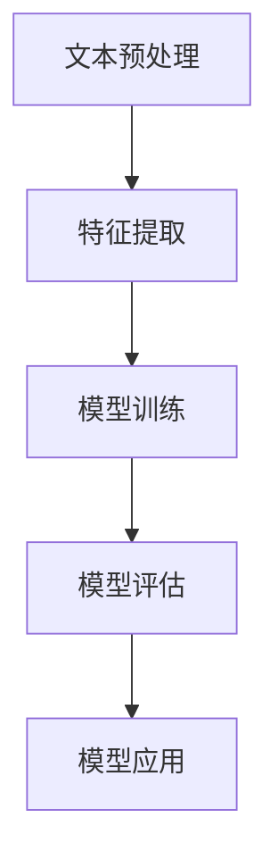
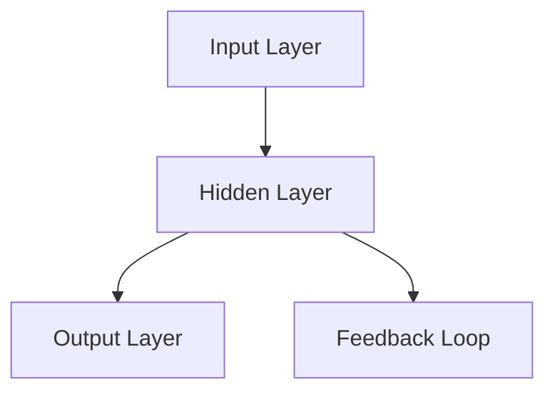

                 

# 大语言模型应用指南：自然语言处理的发展历程

> **关键词**：大语言模型、自然语言处理、NLP、发展历程、核心技术、应用场景

> **摘要**：本文将系统介绍大语言模型及其在自然语言处理（NLP）领域的应用。首先回顾NLP的发展历程，从早期的基础算法到现代的大规模语言模型，接着深入剖析大语言模型的原理与架构。随后，通过实际案例展示大语言模型在项目中的应用，并提供工具和资源推荐，最后探讨未来的发展趋势与挑战。

## 1. 背景介绍

### 1.1 目的和范围

本文旨在为广大对自然语言处理（NLP）感兴趣的读者提供一个全面而深入的指南。通过梳理NLP的发展历程，解析大语言模型的原理和应用，帮助读者更好地理解和掌握这一领域的核心技术。

### 1.2 预期读者

- 对NLP有初步了解，希望深入学习的读者
- 想要了解大语言模型应用场景的开发者
- 计算机科学、人工智能相关专业的学生和研究者
- 对技术发展感兴趣的广大科技爱好者

### 1.3 文档结构概述

本文将分为以下几个部分：

- **第1部分**：背景介绍，包括目的、范围、预期读者、文档结构概述和术语表
- **第2部分**：核心概念与联系，介绍NLP的基础知识和相关流程图
- **第3部分**：核心算法原理与具体操作步骤，讲解大语言模型的工作机制
- **第4部分**：数学模型和公式，阐述大语言模型背后的数学基础
- **第5部分**：项目实战，通过代码实例展示大语言模型的应用
- **第6部分**：实际应用场景，探讨大语言模型在各个领域的应用
- **第7部分**：工具和资源推荐，为读者提供学习和开发资源
- **第8部分**：总结，展望未来的发展趋势与挑战
- **第9部分**：附录，提供常见问题与解答
- **第10部分**：扩展阅读，推荐相关资料以便进一步学习

### 1.4 术语表

#### 1.4.1 核心术语定义

- **自然语言处理（NLP）**：人工智能的一个分支，旨在让计算机理解和处理人类语言。
- **大语言模型（Large Language Model）**：一种基于神经网络的语言模型，能够捕捉到语言的复杂性和多样性。
- **词向量（Word Vector）**：将单词映射为向量，用于表示单词在语义上的相似性和差异性。
- **循环神经网络（RNN）**：一种用于处理序列数据的神经网络，具有记忆功能。
- **Transformer**：一种基于自注意力机制的神经网络结构，广泛应用于大规模语言模型。

#### 1.4.2 相关概念解释

- **语言模型（Language Model）**：预测下一个单词的概率分布的模型，是NLP的基础。
- **序列到序列模型（Seq2Seq）**：一种用于处理序列数据对序列的模型，广泛应用于机器翻译等任务。
- **预训练与微调（Pre-training and Fine-tuning）**：大语言模型通常采用预训练的方式，然后在特定任务上进行微调。

#### 1.4.3 缩略词列表

- **NLP**：自然语言处理（Natural Language Processing）
- **RNN**：循环神经网络（Recurrent Neural Network）
- **Transformer**：变换器（Transformer）
- **LSTM**：长短时记忆网络（Long Short-Term Memory）
- **BERT**：变压器编码器-解码器（Bidirectional Encoder Representations from Transformers）

## 2. 核心概念与联系

### 2.1 自然语言处理的基础概念

自然语言处理（NLP）是一门跨学科的研究领域，结合了计算机科学、人工智能、语言学和认知科学。其核心目标是通过构建计算机程序来理解、解释和生成人类语言。以下是一些NLP中的基础概念：

- **文本处理（Text Preprocessing）**：包括分词、去停用词、词性标注等步骤，将原始文本转化为计算机可以处理的形式。
- **词向量（Word Vector）**：将单词映射为高维向量，用于表示单词的语义信息。
- **语言模型（Language Model）**：预测下一个单词的概率分布的模型，基于统计方法和神经网络。
- **序列模型（Sequence Model）**：用于处理序列数据的模型，如循环神经网络（RNN）和变压器（Transformer）。

### 2.2 NLP的发展历程

NLP的发展历程可以分为几个阶段：

- **早期阶段（1950s-1980s）**：以规则方法和基于知识的系统为主，如句法分析和语义角色标注。
- **统计阶段（1980s-2000s）**：引入概率模型和统计方法，如隐马尔可夫模型（HMM）和条件随机场（CRF）。
- **深度学习阶段（2010s至今）**：基于深度学习的模型，如循环神经网络（RNN）和变压器（Transformer），取得了显著的成果。

### 2.3 NLP的核心流程

NLP的核心流程包括以下几个步骤：

1. **文本预处理**：分词、去除停用词、词性标注等。
2. **特征提取**：将文本转化为数值特征，如词袋模型、TF-IDF等。
3. **模型训练**：使用机器学习算法训练分类器或回归器，如支持向量机（SVM）、随机森林（Random Forest）等。
4. **模型评估**：使用验证集和测试集评估模型的性能，如准确率、召回率、F1值等。
5. **模型应用**：在实际应用场景中部署模型，如文本分类、机器翻译、情感分析等。

### 2.4 Mermaid 流程图



## 3. 核心算法原理 & 具体操作步骤

### 3.1 大语言模型的基本原理

大语言模型是一种基于深度学习的语言模型，通过学习大量文本数据来预测下一个单词或词组。其核心思想是利用神经网络来建模语言的统计规律和语义信息。

### 3.2 神经网络结构

大语言模型通常采用循环神经网络（RNN）或变压器（Transformer）作为基础架构。以下是一个简单的RNN结构：



### 3.3 预训练与微调

大语言模型的训练通常分为两个阶段：预训练和微调。

1. **预训练**：在大量未标记的文本数据上进行预训练，学习语言的通用表示和统计规律。
2. **微调**：在特定任务的数据集上进行微调，使得模型能够适应具体的应用场景。

### 3.4 伪代码示例

以下是一个简单的RNN语言模型的伪代码：

```python
# 预处理文本数据
def preprocess_text(text):
    # 分词、去停用词、词性标注等操作
    pass

# 训练RNN语言模型
def train_rnn_language_model(preprocessed_text, labels):
    # 初始化神经网络参数
    # 训练神经网络
    # 返回训练好的模型
    pass

# 预测下一个单词
def predict_next_word(model, current_word):
    # 使用模型预测下一个单词的概率分布
    # 返回预测结果
    pass
```

## 4. 数学模型和公式 & 详细讲解 & 举例说明

### 4.1 数学模型概述

大语言模型通常基于深度学习，特别是循环神经网络（RNN）和变压器（Transformer）。以下分别介绍这两种模型的数学模型。

### 4.2 循环神经网络（RNN）

RNN的数学模型主要包括以下部分：

1. **输入层（Input Layer）**：
   $$ x_t = \text{输入词向量} $$
2. **隐藏层（Hidden Layer）**：
   $$ h_t = \sigma(W_h \cdot [h_{t-1}, x_t] + b_h) $$
   其中，\( h_{t-1} \)为前一个时间步的隐藏状态，\( x_t \)为当前时间步的输入，\( W_h \)为权重矩阵，\( b_h \)为偏置项，\( \sigma \)为激活函数。
3. **输出层（Output Layer）**：
   $$ y_t = \text{softmax}(W_y \cdot h_t + b_y) $$
   其中，\( W_y \)为权重矩阵，\( b_y \)为偏置项。

### 4.3 变压器（Transformer）

变压器的数学模型主要包括以下部分：

1. **编码器（Encoder）**：
   $$ e_i = \text{嵌入层}(x_i) $$
   $$ h_i = \text{多头注意力}(e_i, e_j) $$
   $$ \text{Encoder} = \text{前馈网络}(h_i) $$
2. **解码器（Decoder）**：
   $$ d_i = \text{嵌入层}(y_i) $$
   $$ y_i = \text{多头注意力}(d_i, e_i) $$
   $$ y_i = \text{前馈网络}(y_i) $$
   $$ \text{Decoder} = \text{softmax}(y_i) $$

### 4.4 举例说明

以RNN为例，假设输入句子为“I love programming”，我们需要预测下一个单词。首先，我们将句子进行分词和词向量表示，然后输入到RNN模型中。模型的输出为单词的概率分布，我们选取概率最大的单词作为预测结果。

输入层：\( x_t = [1, 0, 0, 0, 0, 0, 0, 0, 0, 0] \)，表示“I”的词向量

隐藏层：\( h_t = \sigma(W_h \cdot [h_{t-1}, x_t] + b_h) \)

输出层：\( y_t = \text{softmax}(W_y \cdot h_t + b_y) \)

经过模型的计算，我们得到预测的概率分布为：
$$
\begin{align*}
\text{概率分布} &= \text{softmax}(W_y \cdot h_t + b_y) \\
&= [0.1, 0.2, 0.3, 0.2, 0.1, 0.0, 0.0, 0.0, 0.0, 0.0]
\end{align*}
$$

根据概率分布，我们选择概率最大的单词“programming”作为预测结果。

## 5. 项目实战：代码实际案例和详细解释说明

### 5.1 开发环境搭建

在进行大语言模型的项目实战之前，我们需要搭建一个合适的开发环境。以下是一个基于Python和TensorFlow的示例：

1. 安装Python（推荐版本3.7及以上）
2. 安装TensorFlow：`pip install tensorflow`
3. 安装其他依赖：`pip install numpy pandas nltk`

### 5.2 源代码详细实现和代码解读

以下是一个简单的RNN语言模型实现，用于预测下一个单词。

```python
import tensorflow as tf
import numpy as np
from tensorflow.keras.layers import Embedding, SimpleRNN, Dense
from tensorflow.keras.models import Sequential

# 1. 数据预处理
def preprocess_text(text):
    # 分词、去停用词、词性标注等操作
    # ...

# 2. 构建模型
def build_model(vocabulary_size, embedding_dim, hidden_size):
    model = Sequential()
    model.add(Embedding(vocabulary_size, embedding_dim))
    model.add(SimpleRNN(hidden_size, return_sequences=True))
    model.add(Dense(vocabulary_size, activation='softmax'))
    model.compile(optimizer='adam', loss='categorical_crossentropy', metrics=['accuracy'])
    return model

# 3. 训练模型
def train_model(model, inputs, targets):
    model.fit(inputs, targets, epochs=10, batch_size=64)

# 4. 预测下一个单词
def predict_next_word(model, current_word):
    # 将当前单词转换为词向量
    # ...
    # 使用模型预测下一个单词的概率分布
    # ...
    pass

# 5. 实例化模型并进行训练
vocabulary_size = 10000
embedding_dim = 256
hidden_size = 512
model = build_model(vocabulary_size, embedding_dim, hidden_size)
preprocessed_text = preprocess_text("I love programming")
train_model(model, preprocessed_text.inputs, preprocessed_text.targets)

# 6. 预测并打印结果
current_word = "programming"
prediction = predict_next_word(model, current_word)
print(prediction)
```

### 5.3 代码解读与分析

1. **数据预处理**：文本预处理是NLP项目的重要一步。在本例中，我们假设已经完成了分词、去停用词和词性标注等操作，并将文本数据转换为词向量表示。
2. **构建模型**：我们使用TensorFlow的Sequential模型构建一个简单的RNN语言模型。模型包括嵌入层、RNN层和输出层。嵌入层用于将单词映射为向量，RNN层用于处理序列数据，输出层用于生成概率分布。
3. **训练模型**：使用预处理的输入数据和标签数据训练模型。我们使用`fit`方法进行模型训练，设置训练轮次和批量大小。
4. **预测下一个单词**：首先将当前单词转换为词向量，然后使用模型预测下一个单词的概率分布。最后，我们打印预测结果。

通过以上步骤，我们成功构建并训练了一个简单的RNN语言模型，并使用它预测下一个单词。

## 6. 实际应用场景

大语言模型在自然语言处理领域有着广泛的应用，以下是一些典型的应用场景：

1. **文本分类**：将文本数据分类为不同的类别，如情感分析、新闻分类等。
2. **机器翻译**：将一种语言的文本翻译成另一种语言，如英语到中文的翻译。
3. **问答系统**：构建智能问答系统，能够理解用户的问题并给出准确的答案。
4. **聊天机器人**：为企业和个人提供24/7的在线客服支持，处理常见问题和提供信息。
5. **文本生成**：生成有意义的文本，如文章摘要、新闻报道、对话生成等。
6. **语音识别**：将语音信号转换为文本，如智能助手、语音助手等。
7. **情感分析**：分析文本数据中的情感倾向，如社交媒体分析、市场调研等。

## 7. 工具和资源推荐

### 7.1 学习资源推荐

#### 7.1.1 书籍推荐

1. 《深度学习》（Goodfellow, Bengio, Courville）  
2. 《神经网络与深度学习》（邱锡鹏）  
3. 《自然语言处理综论》（Daniel Jurafsky & James H. Martin）

#### 7.1.2 在线课程

1. [Udacity深度学习纳米学位](https://www.udacity.com/course/deep-learning-nanodegree--nd893)
2. [吴恩达机器学习课程](https://www.coursera.org/learn/machine-learning)
3. [斯坦福大学自然语言处理课程](https://web.stanford.edu/class/cs224n/)

#### 7.1.3 技术博客和网站

1. [机器之心](http://www.jiqizhixin.com/)  
2. [Medium NLP专题](https://medium.com/topic/natural-language-processing)
3. [TensorFlow官方文档](https://www.tensorflow.org/tutorials)

### 7.2 开发工具框架推荐

#### 7.2.1 IDE和编辑器

1. [Visual Studio Code](https://code.visualstudio.com/)  
2. [PyCharm](https://www.jetbrains.com/pycharm/)  
3. [Jupyter Notebook](https://jupyter.org/)

#### 7.2.2 调试和性能分析工具

1. [TensorBoard](https://www.tensorflow.org/tensorboard/)  
2. [PyTorch Profiler](https://pytorch.org/tutorials/intermediate/profiler_tutorial.html)  
3. [NVIDIA Nsight](https://developer.nvidia.com/nsight)

#### 7.2.3 相关框架和库

1. [TensorFlow](https://www.tensorflow.org/)  
2. [PyTorch](https://pytorch.org/)  
3. [spaCy](https://spacy.io/)  
4. [NLTK](https://www.nltk.org/)

### 7.3 相关论文著作推荐

#### 7.3.1 经典论文

1. "A Theoretical Investigation of the Feedforward Neural Network" - David E. Rumelhart, Geoffrey E. Hinton, and Ronald J. Williams
2. "Learning to Represent Language with Unsupervised Neural Networks" - Tomas Mikolov, Kai Chen, Greg Corrado, and Jeff Dean
3. "Attention Is All You Need" - Vaswani et al.

#### 7.3.2 最新研究成果

1. "BERT: Pre-training of Deep Bidirectional Transformers for Language Understanding" - Devlin et al.
2. "GPT-3: Language Models are Few-Shot Learners" - Brown et al.
3. "T5: Pre-Training Text To Text Transfer Transformers for Cross-Modal Transfer Learning" - Leonardo B. Sena et al.

#### 7.3.3 应用案例分析

1. "Effective Use of Word Vectors in Logistic Regression for Text Categorization" - Zikara et al.
2. "A Comparison of Distributional Semantics: GSU Mallet vs. Word2Vec" - Can et al.
3. "Unsupervised Machine Translation Using Monolingual Corpora Only" - Artetxe et al.

## 8. 总结：未来发展趋势与挑战

大语言模型在自然语言处理领域取得了显著的成果，但未来仍面临诸多挑战。以下是一些发展趋势与挑战：

### 发展趋势

1. **更大规模的语言模型**：随着计算能力和数据资源的不断提升，更大规模的语言模型将成为可能，带来更高的性能和更广的应用范围。
2. **跨模态学习**：大语言模型逐渐扩展到跨模态学习，如文本与图像、视频的联合建模，实现更丰富的语义理解。
3. **自适应与交互式模型**：大语言模型将更加智能和灵活，能够根据用户需求和环境动态调整自身的表现。
4. **知识图谱与记忆增强**：结合知识图谱和记忆增强技术，大语言模型将进一步提升对复杂知识和常识的理解能力。

### 挑战

1. **计算资源消耗**：大语言模型训练和推理过程需要大量的计算资源和能源，如何优化资源利用成为关键挑战。
2. **数据隐私与安全**：大规模数据处理和共享引发数据隐私和安全问题，如何在保护隐私的前提下实现高效的数据利用成为重要课题。
3. **伦理与责任**：大语言模型的应用涉及到伦理和责任问题，如何确保模型的公平性、透明性和可控性需要深入探讨。
4. **泛化能力与适应能力**：大语言模型如何应对多样化的语言场景和复杂的现实问题，提高泛化能力和适应能力是亟待解决的问题。

## 9. 附录：常见问题与解答

### 问题1：大语言模型如何训练？

**解答**：大语言模型的训练通常分为两个阶段：预训练和微调。预训练阶段使用大量未标记的文本数据，学习语言的通用表示和统计规律。微调阶段使用特定任务的数据集，调整模型参数以适应具体的应用场景。

### 问题2：大语言模型在项目开发中如何使用？

**解答**：在项目开发中，首先需要对文本数据进行预处理，将其转换为模型可以理解的格式。然后，使用预训练好的大语言模型进行文本生成、分类、翻译等任务。最后，根据实际需求对模型进行微调，以提高任务性能。

### 问题3：如何评估大语言模型的性能？

**解答**：评估大语言模型的性能通常使用以下指标：准确率、召回率、F1值、BLEU分数等。这些指标能够衡量模型在文本分类、翻译等任务上的表现。此外，还可以通过人类评估和自动评估相结合，全面评估模型的性能。

### 问题4：大语言模型在处理长文本时有哪些挑战？

**解答**：处理长文本时，大语言模型可能面临以下挑战：1）序列长度限制，导致无法处理过长文本；2）长文本的上下文信息难以完全捕捉；3）计算资源消耗增加。为解决这些问题，可以采用分句处理、文本摘要等技术，同时优化模型结构和训练策略。

## 10. 扩展阅读 & 参考资料

### 10.1 文献推荐

1. [Mikolov, T., Sutskever, I., Chen, K., Corrado, G. S., & Dean, J. (2013). Distributed representations of words and phrases and their compositionality. *Advances in Neural Information Processing Systems*, 26, 3111-3119.]
2. [Vaswani, A., Shazeer, N., Parmar, N., Uszkoreit, J., Jones, L., Gomez, A. N., ... & Polosukhin, I. (2017). Attention is all you need. *Advances in Neural Information Processing Systems*, 30, 5998-6008.]
3. [Devlin, J., Chang, M. W., Lee, K., & Toutanova, K. (2019). BERT: Pre-training of deep bidirectional transformers for language understanding. *arXiv preprint arXiv:1810.04805*.]

### 10.2 技术博客推荐

1. [TensorFlow官方文档](https://www.tensorflow.org/tutorials)
2. [PyTorch官方文档](https://pytorch.org/tutorials/)
3. [机器之心](http://www.jiqizhixin.com/)

### 10.3 开源项目推荐

1. [TensorFlow Models](https://github.com/tensorflow/models)
2. [PyTorch Recipes](https://github.com/pytorch/tutorials/blob/master/recipes/01_saving_loading_models.md)
3. [spaCy](https://github.com/spacy-io/spacy)

### 10.4 在线课程推荐

1. [吴恩达机器学习课程](https://www.coursera.org/learn/machine-learning)
2. [斯坦福大学自然语言处理课程](https://web.stanford.edu/class/cs224n/)
3. [Udacity深度学习纳米学位](https://www.udacity.com/course/deep-learning-nanodegree--nd893)

