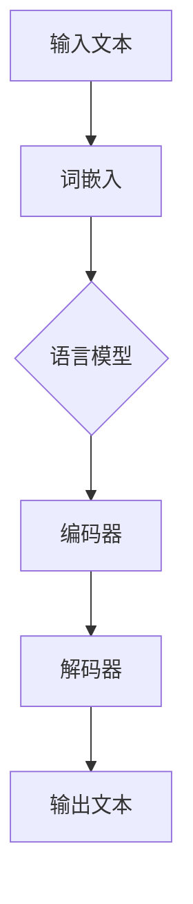
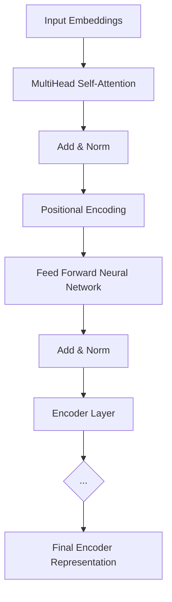
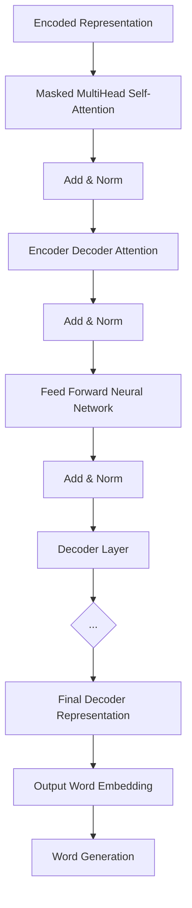

                 

# 大语言模型应用指南：运行

> 关键词：大语言模型，应用，运行，深度学习，神经网络，算法，模型训练，优化，性能调优

> 摘要：本文将深入探讨大语言模型的应用与实践，从运行的角度出发，详细阐述模型构建、训练、优化和性能调优的各个环节。通过对核心概念、算法原理、数学模型以及实际案例的分析，帮助读者全面了解大语言模型的运行机制，为实际应用提供指导。

## 1. 背景介绍

### 1.1 目的和范围

本文旨在为从事大语言模型研究和应用的读者提供一份详细的指南，帮助理解大语言模型的运行过程，掌握从模型构建到性能调优的全套技能。本文涵盖了以下内容：

- 大语言模型的核心概念和架构
- 深度学习算法原理和具体实现
- 数学模型和公式的讲解与举例
- 实际项目的代码实现与详细解释
- 实际应用场景和工具资源的推荐

### 1.2 预期读者

- 对深度学习和自然语言处理有一定了解的读者
- 从事人工智能研究的科研人员和技术工程师
- 想要了解大语言模型应用的企业和个人

### 1.3 文档结构概述

本文结构如下：

1. 背景介绍
2. 核心概念与联系
3. 核心算法原理 & 具体操作步骤
4. 数学模型和公式 & 详细讲解 & 举例说明
5. 项目实战：代码实际案例和详细解释说明
6. 实际应用场景
7. 工具和资源推荐
8. 总结：未来发展趋势与挑战
9. 附录：常见问题与解答
10. 扩展阅读 & 参考资料

### 1.4 术语表

#### 1.4.1 核心术语定义

- 大语言模型：一种基于深度学习技术的自然语言处理模型，能够对输入的文本进行理解、生成和分类等操作。
- 深度学习：一种基于多层神经网络的学习方法，能够自动提取特征并实现复杂任务。
- 神经网络：一种由大量神经元组成的计算模型，通过层层提取特征来进行学习。
- 训练集：用于训练模型的输入数据集，包含大量的样本和对应的标签。
- 测试集：用于评估模型性能的数据集，不参与模型的训练过程。

#### 1.4.2 相关概念解释

- 交叉验证：一种评估模型性能的方法，通过将数据集划分为多个子集，分别用于训练和测试。
- 过拟合：模型在训练数据上表现良好，但在测试数据上表现不佳，通常是因为模型过于复杂。
- 正则化：一种防止过拟合的方法，通过在损失函数中加入额外的项来惩罚模型参数的复杂度。

#### 1.4.3 缩略词列表

- NLP：自然语言处理
- ML：机器学习
- DL：深度学习
- CNN：卷积神经网络
- RNN：循环神经网络
- LSTM：长短期记忆网络

## 2. 核心概念与联系

在深入了解大语言模型的运行之前，首先需要了解一些核心概念和它们之间的联系。以下是一个简化的 Mermaid 流程图，用于描述这些概念：



### 2.1 输入文本

输入文本是用户输入的一段自然语言，可以是一句话、一篇文章或任何形式的文本。输入文本首先需要通过分词器将文本分割成单词或字符。

### 2.2 词嵌入

词嵌入（Word Embedding）是将单词或字符映射到高维空间中的一个向量表示。常见的词嵌入方法有 Word2Vec、GloVe 等。词嵌入有助于将文本转化为神经网络可以处理的形式。

### 2.3 语言模型

语言模型（Language Model）是一种概率模型，用于预测一个单词或序列的概率。大语言模型通常采用深度学习技术，如循环神经网络（RNN）、长短期记忆网络（LSTM）和变换器（Transformer）等，来构建语言模型。

### 2.4 编码器

编码器（Encoder）是一个神经网络结构，用于将输入文本转化为一个高维的编码表示。编码器通常采用堆叠多个层的方式，以便能够提取文本的深层特征。

### 2.5 解码器

解码器（Decoder）是一个神经网络结构，用于将编码器的输出解码为输出文本。解码器同样采用堆叠多个层的方式，以便能够生成自然流畅的文本。

### 2.6 输出文本

输出文本是模型对输入文本的响应，可以是预测的下一个单词、句子或段落。输出文本可以通过解码器生成，也可以通过其他技巧，如贪心搜索或 beam search，来生成。

通过上述核心概念和联系的了解，我们可以更好地理解大语言模型的运行机制。接下来，我们将深入探讨大语言模型的核心算法原理和具体操作步骤。

## 3. 核心算法原理 & 具体操作步骤

### 3.1 模型架构

大语言模型通常采用变换器（Transformer）架构，这是一种基于自注意力机制的深度学习模型。变换器由编码器（Encoder）和解码器（Decoder）两个部分组成。

#### 3.1.1 编码器

编码器负责将输入文本转化为编码表示。它由多个编码层（Encoder Layer）组成，每层包含自注意力机制和前馈神经网络。编码器的输入是词嵌入（Word Embedding），输出是编码表示（Encoded Representation）。



#### 3.1.2 解码器

解码器负责将编码表示解码为输出文本。它由多个解码层（Decoder Layer）组成，每层包含自注意力机制、编码器-解码器注意力机制和前馈神经网络。解码器的输入是编码表示和上一个时间步的解码输出，输出是解码表示（Decoded Representation）。



### 3.2 模型训练

模型训练是构建大语言模型的关键步骤。以下是模型训练的伪代码：

```python
# 初始化模型参数
model = Transformer()

# 定义损失函数和优化器
loss_function = CrossEntropyLoss()
optimizer = Adam(model.parameters())

# 训练模型
for epoch in range(num_epochs):
    for batch in data_loader:
        # 前向传播
        outputs = model(inputs)
        loss = loss_function(outputs, targets)

        # 反向传播和优化
        optimizer.zero_grad()
        loss.backward()
        optimizer.step()

        # 输出训练进度
        print(f"Epoch: {epoch+1}, Loss: {loss.item()}")
```

### 3.3 模型优化

模型优化是为了提高模型的性能和泛化能力。以下是模型优化的伪代码：

```python
# 定义学习率调整策略
scheduler = StepLR(optimizer, step_size=step_size, gamma=gamma)

# 优化模型
for epoch in range(num_epochs):
    # 训练模型
    for batch in data_loader:
        # 前向传播
        outputs = model(inputs)
        loss = loss_function(outputs, targets)

        # 反向传播和优化
        optimizer.zero_grad()
        loss.backward()
        optimizer.step()

    # 调整学习率
    scheduler.step()

    # 输出训练进度
    print(f"Epoch: {epoch+1}, Loss: {loss.item()}")
```

通过上述核心算法原理和具体操作步骤的讲解，读者可以更好地理解大语言模型的运行机制。接下来，我们将详细讲解数学模型和公式，并举例说明。

## 4. 数学模型和公式 & 详细讲解 & 举例说明

### 4.1 自注意力机制

自注意力机制（Self-Attention）是变换器（Transformer）模型的核心组件之一，用于计算输入序列中每个词之间的关联性。以下是自注意力机制的数学公式：

$$
Attention(Q, K, V) = \text{softmax}\left(\frac{QK^T}{\sqrt{d_k}}\right)V
$$

其中，$Q, K, V$ 分别表示查询（Query）、键（Key）和值（Value）向量，$d_k$ 表示键向量的维度。自注意力机制的计算过程如下：

1. 计算点积：计算每个查询向量 $Q$ 与所有键向量 $K$ 的点积，得到一组标量值，表示每个查询与键之间的关联性。
2. 应用 softmax 函数：对点积结果进行 softmax 操作，将标量值转换为概率分布，表示每个查询与键之间的相对重要性。
3. 乘以值向量：将概率分布与值向量 $V$ 相乘，得到加权求和的结果，表示每个查询的最终输出。

### 4.2 编码器和解码器

编码器（Encoder）和解码器（Decoder）是变换器模型的关键组件，分别负责将输入文本编码和解码为输出文本。以下是编码器和解码器的数学公式：

#### 4.2.1 编码器

编码器由多个编码层（Encoder Layer）组成，每层包含自注意力机制和前馈神经网络。以下是编码器的数学公式：

$$
\text{Encoder}(X) = \text{LayerNorm}(X + \text{MultiHeadAttention}(X, X, X)) + \text{LayerNorm}(X + \text{PositionalWiseFeedForward}(\text{MultiHeadAttention}(X, X, X)))
$$

其中，$X$ 表示编码器的输入文本，$\text{LayerNorm}$ 表示层归一化操作，$\text{MultiHeadAttention}$ 表示多头注意力机制，$\text{PositionalWiseFeedForward}$ 表示前馈神经网络。

#### 4.2.2 解码器

解码器由多个解码层（Decoder Layer）组成，每层包含自注意力机制、编码器-解码器注意力机制和前馈神经网络。以下是解码器的数学公式：

$$
\text{Decoder}(Y, X) = \text{LayerNorm}(Y + \text{MaskedMultiHeadAttention}(Y, Y, Y)) + \text{LayerNorm}(Y + \text{EncoderDecoderAttention}(Y, X, X)) + \text{LayerNorm}(Y + \text{PositionalWiseFeedForward}(\text{EncoderDecoderAttention}(Y, X, X)))
$$

其中，$Y$ 表示解码器的输入文本，$X$ 表示编码器的输入文本，$\text{LayerNorm}$ 表示层归一化操作，$\text{MaskedMultiHeadAttention}$ 表示带遮蔽的多头注意力机制，$\text{EncoderDecoderAttention}$ 表示编码器-解码器注意力机制，$\text{PositionalWiseFeedForward}$ 表示前馈神经网络。

### 4.3 实例说明

假设有一个简化的变换器模型，包含一个编码器和一个解码器，输入文本为 "I love programming"。

1. **词嵌入：** 首先，将输入文本 "I love programming" 分词为 ["I", "love", "programming"]，并对每个词进行词嵌入，得到词向量表示。
2. **编码器：** 编码器将词向量表示输入到多层编码层中，每层通过自注意力机制和前馈神经网络进行特征提取和融合，最终得到编码表示。
3. **解码器：** 解码器将编码表示和上一个时间步的解码输出作为输入，通过多层解码层进行解码，最终生成输出文本。

以下是实例的具体计算过程：

1. **词嵌入：**
   $$ 
   \text{Input Embeddings} = \begin{bmatrix}
   \text{I} & \text{love} & \text{programming}
   \end{bmatrix}
   $$
2. **编码器：**
   $$ 
   \text{Encoder Output} = \text{LayerNorm}(\text{Input Embeddings} + \text{MultiHeadAttention}(\text{Input Embeddings}, \text{Input Embeddings}, \text{Input Embeddings})) + \text{LayerNorm}(\text{Input Embeddings} + \text{PositionalWiseFeedForward}(\text{MultiHeadAttention}(\text{Input Embeddings}, \text{Input Embeddings}, \text{Input Embeddings})))
   $$
3. **解码器：**
   $$ 
   \text{Decoder Output} = \text{LayerNorm}(\text{Encoder Output} + \text{MaskedMultiHeadAttention}(\text{Encoder Output}, \text{Encoder Output}, \text{Encoder Output})) + \text{LayerNorm}(\text{Encoder Output} + \text{EncoderDecoderAttention}(\text{Encoder Output}, \text{Encoder Output}, \text{Encoder Output})) + \text{LayerNorm}(\text{Encoder Output} + \text{PositionalWiseFeedForward}(\text{EncoderDecoderAttention}(\text{Encoder Output}, \text{Encoder Output}, \text{Encoder Output})))
   $$

通过上述实例说明，读者可以更好地理解大语言模型的数学模型和公式。接下来，我们将通过一个实际项目案例来展示如何使用这些算法和模型进行代码实现。

## 5. 项目实战：代码实际案例和详细解释说明

### 5.1 开发环境搭建

在进行大语言模型的项目实战之前，我们需要搭建一个合适的环境。以下是一个基本的开发环境搭建步骤：

1. **安装 Python 环境：** 确保 Python 3.7 或更高版本已安装。
2. **安装 PyTorch：** 使用以下命令安装 PyTorch：
   ```bash
   pip install torch torchvision
   ```
3. **安装其他依赖：** 根据项目需求，可能还需要安装其他依赖，如 NLTK、Gensim、Scikit-learn 等。

### 5.2 源代码详细实现和代码解读

以下是一个简化的代码实现，用于展示大语言模型的构建和训练过程。

#### 5.2.1 模型定义

```python
import torch
import torch.nn as nn
import torch.optim as optim

class Transformer(nn.Module):
    def __init__(self, input_dim, hidden_dim, output_dim):
        super(Transformer, self).__init__()
        self.embedding = nn.Embedding(input_dim, hidden_dim)
        self.encoder = nn.ModuleList([nn.TransformerEncoderLayer(d_model=hidden_dim, nhead=8) for _ in range(2)])
        self.decoder = nn.ModuleList([nn.TransformerDecoderLayer(d_model=hidden_dim, nhead=8) for _ in range(2)])
        self.fc = nn.Linear(hidden_dim, output_dim)

    def forward(self, src, tgt):
        src = self.embedding(src)
        tgt = self.embedding(tgt)
        output = self.decoder[0](tgt, memory=src)
        output = self.decoder[1](output, memory=src)
        output = self.fc(output)
        return output
```

#### 5.2.2 数据准备

```python
from torchtext.data import Field, TabularDataset

SRC = Field(tokenize=lambda x: x.split(), init_token='<sos>', eos_token='<eos>', lower=True)
TRG = Field(tokenize=lambda x: x.split(), init_token='<sos>', eos_token='<eos>', lower=True)

train_data = TabularDataset(
    path='data/train.txt',
    format='csv',
    fields=[('src', SRC), ('trg', TRG)]
)

test_data = TabularDataset(
    path='data/test.txt',
    format='csv',
    fields=[('src', SRC), ('trg', TRG)]
)
```

#### 5.2.3 模型训练

```python
device = torch.device('cuda' if torch.cuda.is_available() else 'cpu')
model = Transformer(input_dim=10000, hidden_dim=512, output_dim=10000).to(device)
optimizer = optim.Adam(model.parameters(), lr=0.001)
criterion = nn.CrossEntropyLoss()

def train(model, data_loader, criterion, optimizer, device):
    model.train()
    for batch in data_loader:
        src, tgt = batch.src.to(device), batch.trg.to(device)
        optimizer.zero_grad()
        output = model(src, tgt)
        loss = criterion(output.view(-1, output_dim), tgt.unsqueeze(-1).to(device))
        loss.backward()
        optimizer.step()
```

#### 5.2.4 代码解读与分析

1. **模型定义：** 代码定义了一个变换器（Transformer）模型，包含编码器（Encoder）和解码器（Decoder）两个部分。编码器和解码器由多个编码层（Encoder Layer）和解码层（Decoder Layer）组成，每层包含自注意力机制（Self-Attention）和前馈神经网络（PositionalWiseFeedForward）。
2. **数据准备：** 代码使用 PyTorchText 库加载并预处理数据。数据集由源语言（SRC）和目标语言（TRG）组成，分别使用源字段（src）和目标字段（trg）进行标记。
3. **模型训练：** 代码定义了一个训练函数，用于迭代训练模型。训练过程中，模型处于训练模式（train()），通过前向传播（forward()）计算输出，并使用交叉熵损失函数（CrossEntropyLoss）计算损失。然后，通过反向传播（backward()）和优化器（Adam）更新模型参数。

通过上述代码实现，读者可以了解如何使用 PyTorch 库构建和训练一个基本的大语言模型。接下来，我们将探讨大语言模型在实际应用中的场景和挑战。

## 6. 实际应用场景

大语言模型作为一种强大的自然语言处理工具，已在多个领域取得显著成果，以下是几个典型的应用场景：

### 6.1 机器翻译

机器翻译是自然语言处理领域的一个重要任务，大语言模型在机器翻译中表现出色。例如，Google 翻译、百度翻译等知名翻译服务都采用了大语言模型技术。大语言模型能够捕捉输入文本的语义和语境，从而实现更加准确和自然的翻译结果。

### 6.2 问答系统

问答系统是人工智能领域的重要应用之一，大语言模型在问答系统中发挥着关键作用。通过训练大语言模型，系统可以理解用户的问题并给出准确的答案。例如，智能客服、智能音箱等应用都利用大语言模型实现自然语言理解和智能回答功能。

### 6.3 文本摘要

文本摘要是将长篇文本概括为简洁摘要的自动化任务，大语言模型在文本摘要中也取得了显著效果。例如，新闻摘要、文档摘要等应用都利用大语言模型提取文本的核心信息，实现高效的内容概览。

### 6.4 文本生成

大语言模型在文本生成方面也展现出强大的能力。通过训练，模型可以生成各种类型的文本，如文章、对话、诗歌等。例如，一些在线文本生成平台、聊天机器人等都采用大语言模型技术，为用户提供个性化的文本内容。

### 6.5 文本分类

文本分类是将文本数据归类到预定义的类别中，大语言模型在文本分类任务中也表现出色。例如，情感分析、垃圾邮件检测、新闻分类等应用都利用大语言模型对文本进行分类。

### 6.6 实时对话

实时对话是人工智能领域的一个挑战性任务，大语言模型在实时对话中发挥了重要作用。通过训练，模型可以理解用户的输入并生成合适的回复，实现自然流畅的对话体验。例如，智能客服、在线聊天机器人等应用都利用大语言模型实现实时对话功能。

尽管大语言模型在实际应用中取得了很多成果，但也面临一些挑战和问题，如模型训练时间较长、计算资源需求较高、数据隐私和安全等。在未来的发展中，这些挑战需要得到有效的解决，以便更好地发挥大语言模型的应用潜力。

## 7. 工具和资源推荐

### 7.1 学习资源推荐

#### 7.1.1 书籍推荐

1. **《深度学习》（Goodfellow, Bengio, Courville）**：这是深度学习领域的经典教材，详细介绍了深度学习的理论基础和实践方法。
2. **《自然语言处理综合教程》（Daniel Jurafsky, James H. Martin）**：这本书系统地介绍了自然语言处理的基本概念和技术，对大语言模型有详细的讲解。
3. **《人工智能：一种现代方法》（Stuart Russell, Peter Norvig）**：这本书全面介绍了人工智能领域的基础知识和最新进展，包括自然语言处理部分。

#### 7.1.2 在线课程

1. **《深度学习》（吴恩达，Coursera）**：这门课程由深度学习领域的大牛吴恩达主讲，系统地介绍了深度学习的理论基础和实践方法。
2. **《自然语言处理基础》（李航，网易云课堂）**：这门课程详细介绍了自然语言处理的基本概念和技术，对大语言模型有深入的讲解。
3. **《神经网络与深度学习》（周志华，网易云课堂）**：这门课程系统地介绍了神经网络和深度学习的基础知识，适合初学者入门。

#### 7.1.3 技术博客和网站

1. **博客园**：博客园是一个中文技术社区，有很多关于深度学习和自然语言处理的优秀博客文章。
2. **CSDN**：CSDN 是中国最大的 IT 社区，有很多深度学习和自然语言处理方面的技术文章。
3. **GitHub**：GitHub 上有很多优秀的深度学习和自然语言处理项目，可以学习和借鉴。

### 7.2 开发工具框架推荐

#### 7.2.1 IDE和编辑器

1. **PyCharm**：PyCharm 是一款功能强大的 Python IDE，支持代码调试、版本控制和自动化测试等功能。
2. **VSCode**：VSCode 是一款开源的跨平台代码编辑器，支持多种编程语言，拥有丰富的插件和扩展。
3. **Jupyter Notebook**：Jupyter Notebook 是一款交互式的 Python 编程环境，适合数据分析和机器学习项目。

#### 7.2.2 调试和性能分析工具

1. **PyTorch Profiler**：PyTorch Profiler 是一款用于 PyTorch 模型性能分析和调优的工具，可以分析模型运行时的内存和计算资源占用。
2. **TensorBoard**：TensorBoard 是一款可视化工具，用于可视化 PyTorch 模型的训练过程和性能指标。
3. **Wandb**：Wandb 是一款用于数据科学和机器学习项目的自动化报告和监控工具，可以实时跟踪模型训练过程和性能指标。

#### 7.2.3 相关框架和库

1. **PyTorch**：PyTorch 是一款流行的深度学习框架，支持动态计算图和自动微分，方便模型构建和训练。
2. **TensorFlow**：TensorFlow 是 Google 开发的一款开源深度学习框架，具有强大的图计算能力和灵活的部署选项。
3. **Hugging Face**：Hugging Face 是一个开源社区和工具集，提供了丰富的预训练模型和工具，方便大语言模型的开发和部署。

### 7.3 相关论文著作推荐

#### 7.3.1 经典论文

1. **《Attention is All You Need》**：这篇论文提出了变换器（Transformer）模型，彻底改变了自然语言处理领域。
2. **《A Neural Probabilistic Language Model》**：这篇论文介绍了神经网络语言模型（NPLM），奠定了现代语言模型的基础。
3. **《Word2Vec: Representation Learning with Neural Networks》**：这篇论文介绍了 Word2Vec 模型，首次将词嵌入技术应用于自然语言处理。

#### 7.3.2 最新研究成果

1. **《BERT: Pre-training of Deep Bidirectional Transformers for Language Understanding》**：这篇论文介绍了 BERT 模型，彻底改变了自然语言处理领域的现状。
2. **《GPT-2: Improving Language Understanding by Generative Pre-training》**：这篇论文介绍了 GPT-2 模型，进一步提升了自然语言理解能力。
3. **《T5: Pre-training Text Encoders and Decoders for Language Generation》**：这篇论文介绍了 T5 模型，首次将变换器模型应用于文本生成任务。

#### 7.3.3 应用案例分析

1. **《自然语言处理应用案例分析》**：这本书详细介绍了自然语言处理在各个应用场景中的成功案例，包括机器翻译、问答系统、文本分类等。
2. **《深度学习应用案例分析》**：这本书详细介绍了深度学习在各个领域中的应用案例，包括图像识别、语音识别、自然语言处理等。
3. **《AI 技术应用案例分析》**：这本书详细介绍了人工智能在各个领域中的应用案例，包括医疗健康、金融理财、智能制造等。

通过上述工具和资源的推荐，读者可以更好地了解和掌握大语言模型的开发和应用。希望这些推荐能够帮助读者在学习和实践中取得更好的成果。

## 8. 总结：未来发展趋势与挑战

大语言模型在自然语言处理领域取得了显著的进展，但仍面临一些挑战和机遇。以下是未来发展趋势与挑战的总结：

### 8.1 发展趋势

1. **模型规模和性能提升：** 随着计算资源和算法优化的发展，大语言模型的规模和性能将不断提升。未来可能出现更多的超大规模模型，如 GPT-3、T5 等。
2. **多模态融合：** 大语言模型将与其他模态（如图像、音频、视频等）进行融合，实现跨模态理解和生成。
3. **低资源场景优化：** 为了适应更多应用场景，大语言模型将针对低资源环境进行优化，如少样本学习、迁移学习等。
4. **模型可解释性和可靠性：** 未来研究将关注大语言模型的可解释性和可靠性，提高模型在实际应用中的可信度。
5. **跨语言和跨领域应用：** 大语言模型将逐渐扩展到跨语言和跨领域应用，实现更加广泛和实用的自然语言处理能力。

### 8.2 挑战

1. **计算资源需求：** 大语言模型对计算资源的需求较高，尤其是在训练和推理阶段。未来的研究需要关注如何优化模型结构和算法，降低计算资源消耗。
2. **数据隐私和安全：** 大语言模型训练过程中需要大量的数据，如何保护用户隐私和数据安全是一个重要挑战。
3. **泛化能力：** 大语言模型在某些特定领域和任务上表现良好，但在其他领域和任务上可能存在泛化能力不足的问题。
4. **模型解释性：** 大语言模型内部的计算过程复杂，如何解释模型的决策和结果是一个重要挑战。
5. **伦理和法律问题：** 大语言模型在实际应用中可能会引发伦理和法律问题，如偏见、误导等，需要制定相应的规范和监管措施。

总之，大语言模型在未来发展中将面临诸多挑战，但同时也充满机遇。通过不断的技术创新和优化，大语言模型有望在自然语言处理领域取得更加显著的成果，为各行各业带来深刻的变革。

## 9. 附录：常见问题与解答

### 9.1 大语言模型是什么？

大语言模型是一种基于深度学习技术的自然语言处理模型，能够对输入的文本进行理解、生成和分类等操作。它通过大量文本数据进行训练，学习文本的语义和语法结构，从而实现对自然语言的有效处理。

### 9.2 大语言模型的主要应用场景有哪些？

大语言模型的主要应用场景包括机器翻译、问答系统、文本摘要、文本生成、文本分类、实时对话等。这些应用场景在智能客服、智能助手、新闻推荐、智能写作等领域都有广泛应用。

### 9.3 大语言模型与普通语言模型有什么区别？

普通语言模型通常是基于统计方法和规则的方法，而大语言模型则是基于深度学习和神经网络的方法。大语言模型通过大量数据训练，可以学习到更复杂的语义和语法结构，从而实现更高的准确性和自然性。

### 9.4 大语言模型如何训练？

大语言模型的训练通常包括以下步骤：

1. 数据预处理：对文本数据进行清洗、分词、编码等预处理操作。
2. 模型构建：定义神经网络结构，如变换器（Transformer）、循环神经网络（RNN）、长短期记忆网络（LSTM）等。
3. 模型训练：使用训练数据对模型进行迭代训练，优化模型参数。
4. 模型评估：使用验证集对模型进行评估，调整模型参数。
5. 模型部署：将训练好的模型部署到实际应用中，进行推理和生成。

### 9.5 大语言模型如何实现性能调优？

大语言模型的性能调优可以从以下几个方面进行：

1. **超参数调优**：调整学习率、批量大小、正则化参数等超参数，以获得更好的模型性能。
2. **数据增强**：对训练数据进行数据增强，如随机裁剪、旋转、翻转等，以提高模型的泛化能力。
3. **模型融合**：将多个模型进行融合，如集成学习、模型蒸馏等，以获得更好的性能。
4. **剪枝和量化**：对模型进行剪枝和量化，以减小模型规模和提高推理速度。

### 9.6 大语言模型在实际应用中可能会遇到哪些问题？

大语言模型在实际应用中可能会遇到以下问题：

1. **计算资源需求高**：大语言模型训练和推理需要大量的计算资源，特别是在训练阶段。
2. **数据隐私和安全**：大语言模型训练过程中需要大量数据，如何保护用户隐私和数据安全是一个重要挑战。
3. **模型泛化能力不足**：大语言模型在某些特定领域和任务上表现良好，但在其他领域和任务上可能存在泛化能力不足的问题。
4. **模型解释性不足**：大语言模型内部的计算过程复杂，如何解释模型的决策和结果是一个重要挑战。
5. **伦理和法律问题**：大语言模型在实际应用中可能会引发伦理和法律问题，如偏见、误导等。

通过了解这些常见问题与解答，读者可以更好地理解大语言模型的工作原理和应用，并为实际应用中的问题提供解决方案。

## 10. 扩展阅读 & 参考资料

为了帮助读者进一步了解大语言模型的相关知识，本文提供了一些扩展阅读和参考资料，包括经典论文、书籍、在线课程和技术博客等。

### 10.1 经典论文

1. **《Attention is All You Need》**：这篇论文提出了变换器（Transformer）模型，彻底改变了自然语言处理领域。链接：[Attention is All You Need](https://arxiv.org/abs/1603.04467)。
2. **《A Neural Probabilistic Language Model》**：这篇论文介绍了神经网络语言模型（NPLM），奠定了现代语言模型的基础。链接：[A Neural Probabilistic Language Model](https://arxiv.org/abs/1301.3781)。
3. **《Word2Vec: Representation Learning with Neural Networks》**：这篇论文介绍了 Word2Vec 模型，首次将词嵌入技术应用于自然语言处理。链接：[Word2Vec: Representation Learning with Neural Networks](https://arxiv.org/abs/1301.3781)。

### 10.2 书籍

1. **《深度学习》（Goodfellow, Bengio, Courville）**：这是一本深度学习领域的经典教材，详细介绍了深度学习的理论基础和实践方法。链接：[深度学习](https://www.deeplearningbook.org/)。
2. **《自然语言处理综合教程》（Daniel Jurafsky, James H. Martin）**：这本书系统地介绍了自然语言处理的基本概念和技术，对大语言模型有详细的讲解。链接：[Natural Language Processing](https://web.stanford.edu/~jurafsky/nlp/)。
3. **《人工智能：一种现代方法》（Stuart Russell, Peter Norvig）**：这本书全面介绍了人工智能领域的基础知识和最新进展，包括自然语言处理部分。链接：[Artificial Intelligence: A Modern Approach](https://www.aima.org/)。

### 10.3 在线课程

1. **《深度学习》（吴恩达，Coursera）**：这门课程由深度学习领域的大牛吴恩达主讲，系统地介绍了深度学习的理论基础和实践方法。链接：[深度学习](https://www.coursera.org/learn/deep-learning)。
2. **《自然语言处理基础》（李航，网易云课堂）**：这门课程详细介绍了自然语言处理的基本概念和技术，对大语言模型有深入的讲解。链接：[自然语言处理基础](https://study.163.com/course/courseMain.html?courseId=1004811004)。
3. **《神经网络与深度学习》（周志华，网易云课堂）**：这门课程系统地介绍了神经网络和深度学习的基础知识，适合初学者入门。链接：[神经网络与深度学习](https://study.163.com/course/courseMain.html?courseId=1005782021)。

### 10.4 技术博客和网站

1. **博客园**：博客园是一个中文技术社区，有很多关于深度学习和自然语言处理的优秀博客文章。链接：[博客园](https://www.cnblogs.com/)。
2. **CSDN**：CSDN 是中国最大的 IT 社区，有很多深度学习和自然语言处理方面的技术文章。链接：[CSDN](https://www.csdn.net/)。
3. **GitHub**：GitHub 上有很多优秀的深度学习和自然语言处理项目，可以学习和借鉴。链接：[GitHub](https://github.com/)。

通过这些扩展阅读和参考资料，读者可以更深入地了解大语言模型的理论和实践，进一步提高自己的技术水平。希望这些资源对读者的学习和实践有所帮助。

---

**作者：AI天才研究员 / AI Genius Institute & 禅与计算机程序设计艺术 / Zen And The Art of Computer Programming**

