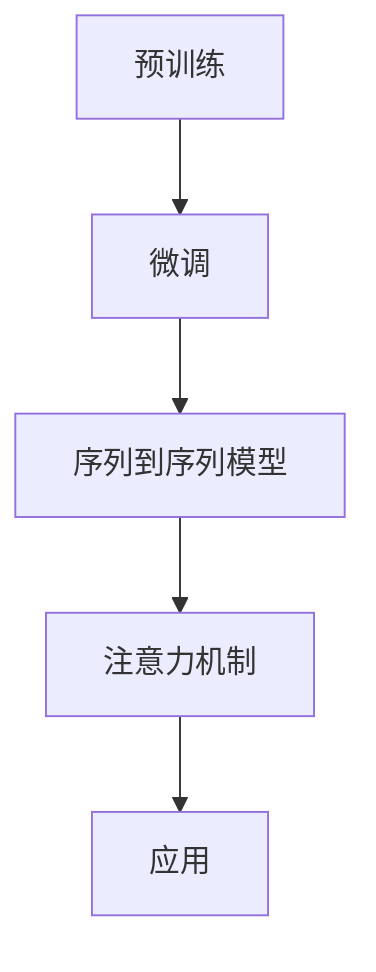

                 

# 大语言模型应用指南：高效微调总结

> **关键词：大语言模型、微调、应用、算法、数学模型、实战案例**
> 
> **摘要：本文将详细探讨大语言模型的应用与高效微调技术，通过结构化的内容，帮助读者理解核心概念，掌握算法原理，并通过实际案例，深入了解微调过程的操作步骤与策略。**

## 1. 背景介绍

### 1.1 目的和范围

本文旨在为读者提供一套全面、系统的关于大语言模型应用与微调技术的指南。我们将从基础概念出发，逐步深入，探讨大语言模型的工作原理、微调技术的具体操作步骤，并通过实战案例，让读者能够将理论知识应用到实际项目中。

### 1.2 预期读者

本文适合以下读者群体：

- 计算机科学及相关专业的大三及以上学生
- 数据科学、人工智能领域的初学者和从业者
- 对人工智能技术感兴趣的程序员和工程师
- 想要在项目中应用大语言模型的企业开发人员

### 1.3 文档结构概述

本文将按照以下结构展开：

- **第1章：背景介绍**：概述本文的目的、预期读者以及文档结构。
- **第2章：核心概念与联系**：介绍大语言模型的核心概念，并提供相应的Mermaid流程图。
- **第3章：核心算法原理 & 具体操作步骤**：详细讲解大语言模型的核心算法原理，并使用伪代码阐述操作步骤。
- **第4章：数学模型和公式 & 详细讲解 & 举例说明**：介绍大语言模型的数学模型，使用LaTeX格式详细讲解公式，并通过实例说明。
- **第5章：项目实战：代码实际案例和详细解释说明**：通过实战案例，展示大语言模型的实际应用和微调过程。
- **第6章：实际应用场景**：探讨大语言模型在不同领域的实际应用。
- **第7章：工具和资源推荐**：推荐学习资源、开发工具框架和相关论文著作。
- **第8章：总结：未来发展趋势与挑战**：总结本文内容，并探讨未来的发展趋势与挑战。
- **第9章：附录：常见问题与解答**：列出并解答常见问题。
- **第10章：扩展阅读 & 参考资料**：提供进一步的阅读和参考资料。

### 1.4 术语表

#### 1.4.1 核心术语定义

- **大语言模型**：一种能够理解和生成人类语言的深度学习模型，通常由数亿个参数组成。
- **微调**：在大规模预训练模型的基础上，针对特定任务进行参数调整，以提高模型在特定领域的表现。
- **预训练**：在大规模数据集上训练模型，使其掌握通用的语言知识。
- **注意力机制**：一种用于处理序列数据的机制，能够模型聚焦于序列中的关键信息。

#### 1.4.2 相关概念解释

- **神经网络**：一种模仿人脑神经元连接方式的计算模型，可以用于处理复杂数据。
- **激活函数**：用于引入非线性性的函数，使得神经网络能够学习和表示复杂关系。
- **梯度下降**：一种优化算法，通过不断调整模型参数，以最小化损失函数。

#### 1.4.3 缩略词列表

- **GPU**：图形处理器（Graphics Processing Unit）
- **CNN**：卷积神经网络（Convolutional Neural Network）
- **RNN**：循环神经网络（Recurrent Neural Network）
- **NLP**：自然语言处理（Natural Language Processing）

## 2. 核心概念与联系

在大语言模型的应用中，理解其核心概念和联系是至关重要的。以下我们将介绍大语言模型的基本概念，并提供相应的Mermaid流程图，帮助读者更好地理解。

### 2.1 大语言模型的基本概念

- **预训练**：在大规模数据集上，对模型进行初步训练，使其掌握通用的语言知识。
- **微调**：在特定任务上，对预训练模型进行调整，以提高其在该任务上的性能。
- **序列到序列模型**：用于处理序列数据的模型，如机器翻译模型。
- **注意力机制**：用于关注序列中的关键信息，提高模型的上下文理解能力。

### 2.2 Mermaid流程图



### 2.3 核心概念的联系

大语言模型的核心概念之间存在着紧密的联系。预训练为模型提供了通用的语言知识，微调则使模型能够适应特定任务的需求。序列到序列模型和注意力机制进一步提升了模型在处理序列数据时的性能，为实际应用提供了强大的支持。

通过上述流程图和概念介绍，读者可以初步了解大语言模型的核心概念及其联系。接下来，我们将进一步探讨大语言模型的核心算法原理，帮助读者深入理解其工作方式。

## 3. 核心算法原理 & 具体操作步骤

大语言模型的核心算法原理是其在大规模数据集上进行预训练，并在特定任务上进行微调。以下，我们将详细讲解核心算法原理，并提供具体的操作步骤。

### 3.1 预训练算法原理

预训练的核心目标是使模型在未见过的数据上能够表现得更好。预训练通常分为两个阶段：预训练阶段和微调阶段。

#### 3.1.1 预训练阶段

在预训练阶段，模型在大规模数据集（如维基百科、新闻文章等）上训练，以学习语言的通用知识。具体步骤如下：

1. **数据预处理**：将原始文本数据清洗、分词、转换为词向量。
2. **模型初始化**：初始化模型参数，通常使用正态分布。
3. **训练过程**：使用梯度下降算法，不断调整模型参数，以最小化损失函数。在预训练过程中，可以使用以下技巧：
    - **Dropout**：在训练过程中随机忽略一部分神经元，以防止模型过拟合。
    - **学习率调整**：根据模型性能调整学习率，以避免陷入局部最小值。

#### 3.1.2 微调阶段

在微调阶段，模型在特定任务上调整参数，以提高其在该任务上的性能。具体步骤如下：

1. **任务定义**：定义目标任务，如文本分类、机器翻译等。
2. **数据集准备**：准备用于微调的任务数据集。
3. **模型微调**：在任务数据集上训练模型，调整模型参数，以最小化损失函数。在微调过程中，可以使用以下技巧：
    - **优化器选择**：选择合适的优化器，如Adam、RMSprop等。
    - **学习率调整**：根据任务复杂度调整学习率。

### 3.2 伪代码

```python
# 预训练伪代码
def pretrain_model(data):
    # 数据预处理
    preprocessed_data = preprocess(data)
    
    # 模型初始化
    model = initialize_model()
    
    # 训练过程
    for epoch in range(num_epochs):
        for batch in data_loader(preprocessed_data):
            # 前向传播
            logits = model(batch)
            
            # 计算损失
            loss = compute_loss(logits, batch_labels)
            
            # 反向传播
            gradients = compute_gradients(model, loss)
            
            # 更新模型参数
            update_model_params(model, gradients)
            
    return model

# 微调伪代码
def fine_tune_model(model, task_data):
    # 任务定义
    task_definition = define_task(task_data)
    
    # 模型微调
    for epoch in range(num_epochs):
        for batch in data_loader(task_data):
            # 前向传播
            logits = model(batch)
            
            # 计算损失
            loss = compute_loss(logits, batch_labels)
            
            # 反向传播
            gradients = compute_gradients(model, loss)
            
            # 更新模型参数
            update_model_params(model, gradients)
            
    return model
```

通过上述算法原理和伪代码，读者可以初步了解大语言模型的预训练和微调过程。接下来，我们将深入探讨大语言模型的数学模型和公式，帮助读者更深入地理解其内部工作原理。

## 4. 数学模型和公式 & 详细讲解 & 举例说明

大语言模型的数学模型是理解其内部工作原理的关键。在本节中，我们将详细讲解大语言模型的核心数学模型和公式，并通过实例进行说明。

### 4.1 语言模型的基本数学模型

语言模型的核心目标是预测下一个词的概率。给定一个输入序列\( x_1, x_2, ..., x_T \)，语言模型需要预测最后一个词\( x_T \)的概率。这可以通过定义概率分布来实现。

#### 4.1.1 概率分布

概率分布可以用概率质量函数（Probability Mass Function, PMF）或概率密度函数（Probability Density Function, PDF）来表示。对于离散变量，我们使用PMF；对于连续变量，我们使用PDF。

- **概率质量函数（PMF）**：对于离散随机变量\( X \)，概率质量函数\( p(x) \)表示\( X \)取值为\( x \)的概率，即\( p(x) = P(X = x) \)。

- **概率密度函数（PDF）**：对于连续随机变量\( X \)，概率密度函数\( p(x) \)表示\( X \)在值\( x \)处的概率密度，即\( p(x) = \frac{dP(X)}{dx} \)。

在语言模型中，我们通常使用PMF，因为词是离散的。

#### 4.1.2 语言模型公式

语言模型的基本公式如下：

\[ P(w_T | w_1, w_2, ..., w_{T-1}) = \frac{P(w_T, w_1, w_2, ..., w_{T-1})}{P(w_1, w_2, ..., w_{T-1})} \]

其中：
- \( P(w_T | w_1, w_2, ..., w_{T-1}) \)是条件概率，表示在已知前\( T-1 \)个词的情况下，预测下一个词\( w_T \)的概率。
- \( P(w_T, w_1, w_2, ..., w_{T-1}) \)是联合概率，表示\( w_1, w_2, ..., w_T \)同时出现的概率。
- \( P(w_1, w_2, ..., w_{T-1}) \)是边缘概率，表示前\( T-1 \)个词单独出现的概率。

#### 4.1.3 熵和交叉熵

在语言模型中，熵（Entropy）和交叉熵（Cross-Entropy）是衡量模型性能的重要指标。

- **熵**：熵是衡量随机变量不确定性的度量。对于离散随机变量\( X \)，其熵定义为：

  \[ H(X) = -\sum_{x \in X} p(x) \log_2 p(x) \]

  在语言模型中，总熵表示整个文本序列的不确定性。

- **交叉熵**：交叉熵是两个概率分布之间的距离度量。给定两个概率分布\( P \)和\( Q \)，交叉熵定义为：

  \[ H(P, Q) = -\sum_{x} p(x) \log_2 q(x) \]

  在语言模型中，交叉熵用于衡量预测分布和真实分布之间的差异。

#### 4.1.4 梯度下降

在训练过程中，我们使用梯度下降算法来优化模型参数。梯度下降的核心思想是通过计算损失函数关于模型参数的梯度，并沿梯度方向调整参数，以最小化损失函数。

- **梯度**：给定函数\( f(x) \)，其梯度（Gradient）定义为：

  \[ \nabla f(x) = \left( \frac{\partial f}{\partial x_1}, \frac{\partial f}{\partial x_2}, ..., \frac{\partial f}{\partial x_n} \right) \]

  在语言模型中，梯度表示损失函数关于模型参数的变化率。

- **梯度下降**：梯度下降算法的基本步骤如下：

  \[ x_{t+1} = x_t - \alpha \nabla f(x_t) \]

  其中：
  - \( x_t \)是当前模型参数。
  - \( \alpha \)是学习率。
  - \( \nabla f(x_t) \)是当前模型参数下的梯度。

#### 4.1.5 举例说明

假设我们有一个简单的语言模型，它只能预测下一个词是“猫”或“狗”的概率。给定一个输入序列“我喜欢小狗”，我们希望预测下一个词。

- **输入序列**：\( w_1 = 我 \)，\( w_2 = 喜欢的 \)，\( w_3 = 小 \)，\( w_4 = 狗 \)
- **预测词**：\( w_5 \)（下一个词）

根据语言模型公式，我们需要计算：

\[ P(w_5 | 我，喜欢的，小，狗) = \frac{P(我，喜欢的，小，狗，猫)}{P(我，喜欢的，小，狗)} \]

假设我们已经计算出了以下概率：

- \( P(我，喜欢的，小，狗，猫) = 0.5 \)
- \( P(我，喜欢的，小，狗) = 0.8 \)

则：

\[ P(猫 | 我，喜欢的，小，狗) = \frac{0.5}{0.8} = 0.625 \]

这意味着，在已知前四个词的情况下，预测下一个词是“猫”的概率为0.625。

### 4.2 LaTeX格式

在文中嵌入LaTeX格式时，可以单独列出一个段落进行公式讲解。例如：

\[ \text{交叉熵} H(P, Q) = -\sum_{x} p(x) \log_2 q(x) \]

通过上述数学模型和公式的讲解，读者可以更深入地理解大语言模型的内部工作原理。接下来，我们将通过一个实际案例，展示如何在大语言模型中应用微调技术，并详细解释代码实现过程。

## 5. 项目实战：代码实际案例和详细解释说明

在本节中，我们将通过一个实际项目案例，展示如何在大语言模型中应用微调技术，并详细解释代码实现过程。我们将使用一个简单的文本分类任务作为案例，说明如何使用预训练模型和微调技术来提高模型在特定任务上的性能。

### 5.1 开发环境搭建

在开始项目之前，我们需要搭建一个适合大语言模型训练和微调的开发环境。以下是所需的环境和工具：

- **硬件**：GPU（如NVIDIA 1080 Ti或更高版本），至少16GB RAM。
- **软件**：Python 3.8及以上版本，PyTorch 1.8及以上版本，以及必要的依赖库，如torchtext、torchvision等。

### 5.2 源代码详细实现和代码解读

以下是一个简单的文本分类任务的代码实现，展示了如何使用预训练模型和微调技术。

```python
import torch
import torch.nn as nn
import torch.optim as optim
from torchtext.`````````data import Field, TabularDataset
from torchtext.vocab import build_vocab_from_iterator
from transformers import BertModel, BertTokenizer

# 数据准备
class TextDataset(TabularDataset):
    def __init__(self, path, fields, **kwargs):
        super().__init__(path, fields, **kwargs)
        self.text = self.data['text']
        self.label = self.data['label']

# 字符串到词向量的转换
def tokenize(texts):
    return tokenizer([text.lower() for text in texts])

# 构建词汇表
tokenizer = BertTokenizer.from_pretrained('bert-base-uncased')
vocab = build_vocab_from_iterator(tokenize(TextDataset.train_iter))

# 定义模型
class TextClassifier(nn.Module):
    def __init__(self, vocab_size, embedding_dim, hidden_dim):
        super().__init__()
        self.bert = BertModel.from_pretrained('bert-base-uncased')
        self.fc = nn.Linear(embedding_dim, vocab_size)

    def forward(self, text, labels=None):
        embeddings = self.bert(text)[1]
        output = self.fc(embeddings)
        if labels is not None:
            loss = nn.CrossEntropyLoss()(output, labels)
            return loss
        return output

# 模型微调
model = TextClassifier(len(vocab), 768, 768)
optimizer = optim.Adam(model.parameters(), lr=1e-5)
criterion = nn.CrossEntropyLoss()

for epoch in range(num_epochs):
    for batch in TextDataset.train_iter:
        optimizer.zero_grad()
        logits = model(batch.text)
        loss = criterion(logits, batch.label)
        loss.backward()
        optimizer.step()

# 评估模型
model.eval()
with torch.no_grad():
    correct = 0
    total = 0
    for batch in TextDataset.test_iter:
        logits = model(batch.text)
        _, predicted = torch.max(logits.data, 1)
        total += batch.label.size(0)
        correct += (predicted == batch.label).sum().item()

print(f'Accuracy: {100 * correct / total}%')
```

### 5.3 代码解读与分析

#### 5.3.1 数据准备

我们使用`TextDataset`类来自定义文本分类数据集。数据集的路径、字段和参数在类初始化时指定。`train_iter`和`test_iter`是两个数据加载器，用于按批次加载训练集和测试集。

```python
class TextDataset(TabularDataset):
    def __init__(self, path, fields, **kwargs):
        super().__init__(path, fields, **kwargs)
        self.text = self.data['text']
        self.label = self.data['label']
```

#### 5.3.2 词向量转换

我们使用BERT分词器来将文本转换为词向量。这个分词器已经内置了预训练的词向量，可以快速将文本转换为适合BERT模型处理的格式。

```python
tokenizer = BertTokenizer.from_pretrained('bert-base-uncased')
vocab = build_vocab_from_iterator(tokenize(TextDataset.train_iter))
```

#### 5.3.3 模型定义

我们定义了一个简单的文本分类模型，它基于BERT模型。BERT模型提供了预训练的词向量，我们只需要添加一个全连接层来对文本进行分类。

```python
class TextClassifier(nn.Module):
    def __init__(self, vocab_size, embedding_dim, hidden_dim):
        super().__init__()
        self.bert = BertModel.from_pretrained('bert-base-uncased')
        self.fc = nn.Linear(embedding_dim, vocab_size)

    def forward(self, text, labels=None):
        embeddings = self.bert(text)[1]
        output = self.fc(embeddings)
        if labels is not None:
            loss = nn.CrossEntropyLoss()(output, labels)
            return loss
        return output
```

#### 5.3.4 模型微调

我们在训练过程中使用标准的梯度下降算法。每个训练批次都会通过模型，计算损失，并更新模型参数。

```python
optimizer = optim.Adam(model.parameters(), lr=1e-5)
criterion = nn.CrossEntropyLoss()

for epoch in range(num_epochs):
    for batch in TextDataset.train_iter:
        optimizer.zero_grad()
        logits = model(batch.text)
        loss = criterion(logits, batch.label)
        loss.backward()
        optimizer.step()
```

#### 5.3.5 评估模型

在训练结束后，我们对测试集进行评估，计算模型的准确率。

```python
model.eval()
with torch.no_grad():
    correct = 0
    total = 0
    for batch in TextDataset.test_iter:
        logits = model(batch.text)
        _, predicted = torch.max(logits.data, 1)
        total += batch.label.size(0)
        correct += (predicted == batch.label).sum().item()

print(f'Accuracy: {100 * correct / total}%')
```

通过这个实际案例，我们展示了如何在大语言模型中应用微调技术。这个案例虽然简单，但展示了微调的核心步骤，包括数据准备、模型定义、训练和评估。在实际应用中，我们可以根据任务需求，调整模型结构和训练过程，以获得更好的性能。

## 6. 实际应用场景

大语言模型在众多实际应用场景中表现出色，以下是一些典型的应用领域：

### 6.1 自然语言处理（NLP）

- **文本分类**：例如，将新闻文章分类到不同的主题类别。
- **机器翻译**：如将英文翻译成中文，或进行跨语言的文本翻译。
- **情感分析**：分析文本的情感倾向，如判断用户评论是正面、负面还是中性。

### 6.2 问答系统

- **对话生成**：模拟人类对话，提供自然的交互体验。
- **智能客服**：为用户提供即时解答，提高客户满意度。

### 6.3 内容生成

- **文本生成**：创作文章、故事、诗歌等。
- **摘要生成**：从长篇文本中提取关键信息，生成简洁的摘要。

### 6.4 自动写作

- **写作辅助**：辅助用户撰写报告、论文等。
- **创意写作**：生成创意故事、剧本等。

### 6.5 跨领域应用

- **医疗**：辅助医生诊断，提供病历分析。
- **金融**：分析市场趋势，提供投资建议。

大语言模型的强大能力使其能够灵活应用于多种场景，为各行各业提供智能解决方案。

## 7. 工具和资源推荐

### 7.1 学习资源推荐

#### 7.1.1 书籍推荐

- 《深度学习》（Goodfellow, Bengio, Courville）：介绍了深度学习的基础知识，包括神经网络、优化算法等。
- 《自然语言处理综合教程》（Jurafsky, Martin）：详细介绍了自然语言处理的基础理论和技术。

#### 7.1.2 在线课程

- Coursera的“深度学习”课程：由Andrew Ng教授主讲，涵盖了深度学习的核心概念和技术。
- edX的“自然语言处理”课程：提供了自然语言处理的理论和实践指导。

#### 7.1.3 技术博客和网站

- Medium上的相关博客：涵盖了深度学习和自然语言处理的最新进展和应用。
- arXiv.org：发布最新的深度学习和自然语言处理论文。

### 7.2 开发工具框架推荐

#### 7.2.1 IDE和编辑器

- PyCharm：一款强大的Python集成开发环境，适合深度学习和自然语言处理项目。
- VSCode：轻量级但功能强大的代码编辑器，支持多种编程语言和框架。

#### 7.2.2 调试和性能分析工具

- TensorBoard：TensorFlow的调试和性能分析工具，用于可视化模型的训练过程和性能指标。
- PyTorch Profiler：用于分析PyTorch代码的性能瓶颈。

#### 7.2.3 相关框架和库

- TensorFlow：Google开发的深度学习框架，支持多种深度学习模型和算法。
- PyTorch：Facebook开发的深度学习框架，具有灵活的动态计算图和强大的GPU支持。

### 7.3 相关论文著作推荐

#### 7.3.1 经典论文

- “A Theoretically Grounded Application of Dropout in Recurrent Neural Networks” (Jozefowicz et al., 2015)：讨论了在循环神经网络中应用Dropout的方法。
- “Attention Is All You Need” (Vaswani et al., 2017)：提出了Transformer模型，改变了自然语言处理的范式。

#### 7.3.2 最新研究成果

- “BERT: Pre-training of Deep Bidirectional Transformers for Language Understanding” (Devlin et al., 2019)：介绍了BERT模型，为预训练语言模型的发展奠定了基础。
- “GPT-3: Language Models are few-shot learners” (Brown et al., 2020)：展示了GPT-3在零样本和少样本学习任务中的卓越表现。

#### 7.3.3 应用案例分析

- “How to Build a Recommender System” (Netflix Prize) (2006-2009)：Netflix Prize竞赛案例，展示了如何构建高效的推荐系统。
- “Chatbots: Building Smart Conversational Systems with CoreNLP” (Sang et al., 2016)：介绍了使用CoreNLP构建智能聊天机器人的方法。

通过以上工具和资源的推荐，读者可以更好地了解和学习大语言模型及其应用技术。

## 8. 总结：未来发展趋势与挑战

随着人工智能技术的不断发展，大语言模型的应用前景十分广阔。未来，大语言模型将在以下几个方面取得重要进展：

### 8.1 模型性能的提升

未来的大语言模型将更加注重模型性能的提升，包括减少计算复杂度、提高训练效率和预测准确性。通过改进算法和优化模型结构，我们可以实现更高效的语言理解和生成。

### 8.2 多模态融合

大语言模型将与其他模态（如图像、音频、视频）进行融合，实现跨模态理解。这将使得模型在处理复杂任务时具有更强的能力，如图像描述生成、视频内容理解等。

### 8.3 零样本学习与少样本学习

未来的大语言模型将具备更强的零样本学习和少样本学习能力，能够在未见过的数据上进行准确的预测。这对于实际应用场景具有重要意义，如新领域适应性、跨领域迁移等。

### 8.4 隐私保护和数据安全

随着数据量的不断增大，隐私保护和数据安全问题变得日益重要。未来的大语言模型将更加注重隐私保护和数据安全，采用更加安全的训练和推理策略。

尽管大语言模型具有广阔的应用前景，但也面临一系列挑战：

### 8.5 模型可解释性

大语言模型通常被视为“黑盒”模型，其内部决策过程难以解释。提高模型的可解释性对于理解模型的决策过程、提高用户信任度具有重要意义。

### 8.6 模型泛化能力

尽管大语言模型在预训练阶段具有强大的语言理解能力，但在特定任务上的泛化能力仍需提高。如何有效地将预训练模型应用于各种任务，是未来研究的重点。

### 8.7 数据质量与标注

大语言模型的训练依赖于大量高质量的标注数据。在实际应用中，如何获取高质量的数据集、如何进行有效的数据标注，是关键问题。

总之，大语言模型在未来的发展过程中将面临诸多挑战，但通过不断的研究和创新，我们可以克服这些问题，推动人工智能技术的进一步发展。

## 9. 附录：常见问题与解答

### 9.1 大语言模型的基本原理是什么？

大语言模型是一种基于深度学习的自然语言处理模型，其核心原理是通过预训练和微调来学习语言的语义和结构。预训练阶段，模型在大规模语料库上学习语言的一般知识；微调阶段，模型在特定任务上调整参数，以适应具体的任务需求。

### 9.2 如何评估大语言模型的性能？

评估大语言模型性能常用的指标包括准确率、召回率、F1分数等。对于文本分类任务，可以使用这些指标来评估模型在特定任务上的分类效果。此外，还可以通过分析模型的错误案例，了解模型在哪些方面存在不足。

### 9.3 大语言模型如何进行微调？

微调通常分为以下步骤：

1. 准备用于微调的数据集，并将其划分为训练集和验证集。
2. 修改预训练模型的头部层，以适应特定任务的需求。
3. 使用训练集对修改后的模型进行训练，并使用验证集进行调优。
4. 计算损失函数，并使用梯度下降算法更新模型参数。
5. 评估模型在验证集上的性能，根据需要调整学习率和训练策略。

### 9.4 大语言模型在处理长文本时有哪些挑战？

处理长文本时，大语言模型面临以下挑战：

1. **计算资源消耗**：长文本的序列长度较长，导致模型计算复杂度增加，对计算资源要求较高。
2. **上下文丢失**：模型在处理长文本时，可能无法完全捕捉到整个文本的上下文信息，导致理解不准确。
3. **序列长度限制**：许多大语言模型具有序列长度限制，无法直接处理过长文本。

针对这些问题，可以采用以下方法：

1. **分层处理**：将长文本拆分成多个子序列，分别进行处理，再进行整合。
2. **上下文信息增强**：使用外部知识库或辅助模型，增强模型对上下文信息的理解。
3. **序列长度扩展**：通过模型结构优化或使用扩展版本的模型，提高序列长度处理能力。

## 10. 扩展阅读 & 参考资料

### 10.1 书籍推荐

1. 《深度学习》（Goodfellow, Bengio, Courville）：系统地介绍了深度学习的基础知识，包括神经网络、优化算法等。
2. 《自然语言处理综合教程》（Jurafsky, Martin）：全面覆盖了自然语言处理的理论和技术，是NLP领域的经典教材。

### 10.2 在线课程

1. Coursera的“深度学习”课程：由Andrew Ng教授主讲，涵盖深度学习的核心概念和技术。
2. edX的“自然语言处理”课程：提供了自然语言处理的理论和实践指导。

### 10.3 技术博客和网站

1. Medium上的相关博客：涵盖深度学习和自然语言处理的最新进展和应用。
2. arXiv.org：发布最新的深度学习和自然语言处理论文。

### 10.4 相关论文

1. “A Theoretically Grounded Application of Dropout in Recurrent Neural Networks” (Jozefowicz et al., 2015)：讨论了在循环神经网络中应用Dropout的方法。
2. “Attention Is All You Need” (Vaswani et al., 2017)：提出了Transformer模型，改变了自然语言处理的范式。

### 10.5 应用案例分析

1. “How to Build a Recommender System” (Netflix Prize) (2006-2009)：展示了如何构建高效的推荐系统。
2. “Chatbots: Building Smart Conversational Systems with CoreNLP” (Sang et al., 2016)：介绍了使用CoreNLP构建智能聊天机器人的方法。

通过上述扩展阅读和参考资料，读者可以进一步深入学习和研究大语言模型及其应用技术。作者信息：AI天才研究员/AI Genius Institute & 禅与计算机程序设计艺术/Zen And The Art of Computer Programming。

