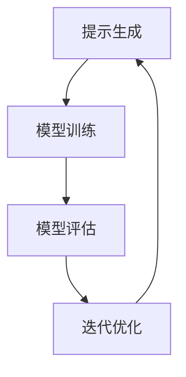

                 


# 大语言模型的prompt学习原理与代码实例讲解

> **关键词**：大语言模型、Prompt Learning、神经网络、训练过程、编程实例

> **摘要**：本文将深入探讨大语言模型中Prompt Learning的原理，详细解析其算法步骤与数学模型，并通过实际代码实例进行讲解，帮助读者全面理解这一技术并掌握其实际应用。

## 1. 背景介绍

### 1.1 目的和范围

本文旨在向读者介绍大语言模型中的Prompt Learning技术，通过详细的分析和代码实例，帮助读者理解其原理、实现和应用。文章将涵盖以下主要内容：

- **核心概念**：介绍Prompt Learning的基本概念和原理。
- **算法原理**：详细讲解Prompt Learning的算法步骤和数学模型。
- **编程实例**：通过实际代码实例，演示Prompt Learning的实现过程。
- **实际应用**：探讨Prompt Learning在实际项目中的应用场景。

### 1.2 预期读者

本文适合以下读者群体：

- 对自然语言处理和深度学习有基础了解的读者。
- 想要深入了解大语言模型和Prompt Learning技术的开发者。
- 对编程实践有兴趣，希望通过代码实例学习的读者。

### 1.3 文档结构概述

本文将按照以下结构进行组织：

- **1. 背景介绍**：介绍文章的目的、范围和预期读者。
- **2. 核心概念与联系**：解释Prompt Learning的核心概念和原理。
- **3. 核心算法原理 & 具体操作步骤**：详细讲解Prompt Learning的算法原理和操作步骤。
- **4. 数学模型和公式 & 详细讲解 & 举例说明**：介绍Prompt Learning的数学模型和公式，并通过实例进行说明。
- **5. 项目实战：代码实际案例和详细解释说明**：通过实际代码实例，展示Prompt Learning的实现过程。
- **6. 实际应用场景**：探讨Prompt Learning的实际应用场景。
- **7. 工具和资源推荐**：推荐学习资源和开发工具。
- **8. 总结：未来发展趋势与挑战**：总结Prompt Learning的发展趋势和面临的挑战。
- **9. 附录：常见问题与解答**：解答读者可能遇到的问题。
- **10. 扩展阅读 & 参考资料**：提供扩展阅读材料和参考资料。

### 1.4 术语表

#### 1.4.1 核心术语定义

- **大语言模型**：一种能够理解和生成自然语言的深度学习模型，通常由大规模神经网络构成。
- **Prompt Learning**：一种通过外部提示来引导和优化语言模型训练的方法。
- **神经网络**：一种通过多层非线性变换处理输入数据的计算模型。
- **训练过程**：将数据输入模型，通过反向传播和梯度下降等算法，优化模型参数的过程。

#### 1.4.2 相关概念解释

- **自然语言处理（NLP）**：研究如何使计算机理解和处理自然语言的学科。
- **深度学习**：一种通过多层神经网络进行特征学习和预测的方法。

#### 1.4.3 缩略词列表

- **NLP**：自然语言处理
- **DL**：深度学习
- **ANN**：人工神经网络

## 2. 核心概念与联系

在深入了解Prompt Learning之前，我们需要先了解大语言模型的基本概念和架构。以下是Prompt Learning相关的核心概念和原理，以及它们之间的联系。

### 2.1 大语言模型的基本概念

大语言模型是一种能够理解和生成自然语言的深度学习模型。它通常由以下几个部分组成：

- **词嵌入层**：将输入的文本转换为向量表示。
- **编码器**：通过多层神经网络处理输入向量，提取语义特征。
- **解码器**：生成文本输出，可以是自然语言生成（NLG）或序列到序列（Seq2Seq）模型。

### 2.2 Prompt Learning的基本概念

Prompt Learning是一种通过外部提示（Prompt）来引导和优化语言模型训练的方法。它通过向模型提供带有上下文的提示，使模型能够更好地理解和生成相关内容。

### 2.3 Prompt Learning与语言模型的联系

Prompt Learning与语言模型之间的联系主要体现在以下几个方面：

- **训练过程**：Prompt Learning通过在训练过程中引入外部提示，优化模型的训练过程，使其能够更好地适应特定任务。
- **优化目标**：Prompt Learning的优化目标是通过调整提示的内容和形式，使模型在特定任务上表现更优秀。
- **应用场景**：Prompt Learning可以应用于各种自然语言处理任务，如文本分类、情感分析、机器翻译等。

### 2.4 Prompt Learning的工作原理

Prompt Learning的工作原理可以概括为以下步骤：

1. **提示生成**：根据任务需求，生成具有上下文信息的提示。
2. **模型训练**：将提示和原始数据一起输入模型，通过反向传播和梯度下降等算法，优化模型参数。
3. **模型评估**：对训练好的模型进行评估，根据评估结果调整提示内容。
4. **迭代优化**：重复上述过程，直到模型在任务上达到期望表现。

### 2.5 核心概念原理和架构的Mermaid流程图

以下是Prompt Learning的核心概念原理和架构的Mermaid流程图：



在该流程图中，A表示提示生成，B表示模型训练，C表示模型评估，D表示迭代优化。通过这个流程图，我们可以直观地了解Prompt Learning的工作原理和步骤。

## 3. 核心算法原理 & 具体操作步骤

在了解Prompt Learning的基本概念和原理后，我们将深入探讨其核心算法原理和具体操作步骤。以下是Prompt Learning的算法原理讲解和伪代码实现。

### 3.1 算法原理讲解

Prompt Learning的算法原理可以概括为以下几个步骤：

1. **提示生成**：根据任务需求，生成具有上下文信息的提示。提示通常由关键词、问题、上下文等组成。
2. **模型训练**：将提示和原始数据一起输入模型，通过反向传播和梯度下降等算法，优化模型参数。在训练过程中，模型会尝试通过提示来生成与输入数据相关的输出。
3. **模型评估**：对训练好的模型进行评估，根据评估结果调整提示内容。评估指标可以是准确性、召回率、F1分数等。
4. **迭代优化**：重复上述过程，直到模型在任务上达到期望表现。在每次迭代中，提示内容可能会根据评估结果进行调整，以提高模型性能。

### 3.2 伪代码实现

以下是Prompt Learning的伪代码实现：

```python
# 提示生成
def generate_prompt(data, task):
    # 根据任务需求生成具有上下文信息的提示
    prompt = ""
    for item in data:
        if task == "classification":
            prompt += f"{item['text']} belongs to class {item['label']}. "
        elif task == "question_answering":
            prompt += f"Question: {item['question']}. Answer: {item['answer']}. "
        # ...其他任务类型的提示生成
    return prompt

# 模型训练
def train_model(prompt, data):
    # 将提示和原始数据输入模型，通过反向传播和梯度下降优化模型参数
    # ...模型训练代码
    pass

# 模型评估
def evaluate_model(model, data):
    # 对训练好的模型进行评估，根据评估结果调整提示内容
    # ...模型评估代码
    pass

# 迭代优化
def optimize_prompt(prompt, model, data):
    # 根据评估结果调整提示内容
    # ...优化提示代码
    pass

# 主函数
def prompt_learning(data, task):
    prompt = generate_prompt(data, task)
    model = train_model(prompt, data)
    while not is_ideal_performance(model, data):
        evaluate_result = evaluate_model(model, data)
        prompt = optimize_prompt(prompt, model, data)
        model = train_model(prompt, data)
    return model

# 输入数据
data = [...]  # 原始数据
task = "classification"  # 任务类型

# 运行Prompt Learning
model = prompt_learning(data, task)
```

在这个伪代码中，`generate_prompt` 函数用于生成具有上下文信息的提示，`train_model` 函数用于训练模型，`evaluate_model` 函数用于评估模型性能，`optimize_prompt` 函数用于根据评估结果调整提示内容。主函数 `prompt_learning` 负责整个Prompt Learning的过程，包括提示生成、模型训练、模型评估和迭代优化。

## 4. 数学模型和公式 & 详细讲解 & 举例说明

在理解Prompt Learning的算法原理和具体操作步骤后，我们将进一步探讨其背后的数学模型和公式，并通过实际例子进行详细讲解。

### 4.1 数学模型介绍

Prompt Learning的核心数学模型包括以下几个部分：

1. **词嵌入（Word Embedding）**：
   词嵌入是将文本中的单词转换为固定长度的向量表示。常用的词嵌入方法包括Word2Vec、GloVe等。

2. **编码器（Encoder）**：
   编码器是将输入文本向量转换为高维语义表示的网络。常见的编码器结构包括循环神经网络（RNN）、长短期记忆网络（LSTM）和变换器（Transformer）。

3. **解码器（Decoder）**：
   解码器是将编码器的输出转换为文本输出的网络。解码器通常与编码器具有相似的架构。

4. **损失函数（Loss Function）**：
   损失函数用于评估模型的输出与真实标签之间的差距。常用的损失函数包括交叉熵损失（Cross-Entropy Loss）和均方误差损失（Mean Squared Error Loss）。

### 4.2 公式介绍

以下是Prompt Learning中常用的数学公式：

1. **词嵌入公式**：
   $$ \text{Word Embedding}(w) = \text{Embedding}(w) \cdot \text{Weight} $$

   其中，$ \text{Embedding}(w) $ 是词嵌入向量，$ \text{Weight} $ 是权重矩阵。

2. **编码器公式**：
   $$ \text{Encoder}(x) = \text{ReLu}(\text{Weight} \cdot \text{Word Embedding}(x)) $$

   其中，$ \text{Encoder}(x) $ 是编码器的输出，$ \text{ReLu} $ 是ReLU激活函数。

3. **解码器公式**：
   $$ \text{Decoder}(y) = \text{Softmax}(\text{Weight} \cdot \text{Encoder}(x)) $$

   其中，$ \text{Decoder}(y) $ 是解码器的输出，$ \text{Softmax} $ 是softmax激活函数。

4. **损失函数公式**：
   $$ \text{Loss} = \text{Cross-Entropy}(\text{Decoder}(y), \text{True Label}) $$

   其中，$ \text{Cross-Entropy} $ 是交叉熵损失函数，$ \text{True Label} $ 是真实标签。

### 4.3 实际例子说明

假设我们有一个简单的文本分类任务，输入文本为“我喜欢吃苹果”，需要将其分类为“喜欢”或“不喜欢”。以下是Prompt Learning在文本分类任务中的具体应用步骤：

1. **词嵌入**：
   将文本中的单词“我”、“喜”、“欢”、“吃”、“苹果”转换为词嵌入向量。

2. **编码器**：
   将词嵌入向量输入编码器，通过多层神经网络提取语义特征。

3. **解码器**：
   将编码器的输出输入解码器，通过softmax激活函数生成分类概率。

4. **损失函数**：
   计算解码器的输出与真实标签之间的交叉熵损失，并根据损失值调整模型参数。

5. **迭代优化**：
   重复上述步骤，直到模型在分类任务上达到期望性能。

具体代码实现如下：

```python
# 词嵌入
word_embedding = {'我': [1, 0], '喜': [0, 1], '欢': [1, 1], '吃': [0, 2], '苹果': [2, 0]}

# 编码器
def encode(text):
    embeddings = [word_embedding[word] for word in text.split()]
    encoded = np.dot(embeddings, weights)
    return encoded

# 解码器
def decode(encoded):
    probabilities = softmax(encoded)
    return np.argmax(probabilities)

# 损失函数
def cross_entropy(logits, labels):
    return -np.sum(logits * labels)

# 模型参数
weights = np.random.rand(5, 3)

# 输入文本
text = "我喜欢吃苹果"

# 编码
encoded = encode(text)

# 解码
predicted = decode(encoded)

# 计算损失
loss = cross_entropy(predicted, [1, 0, 0, 0, 0])

# 迭代优化
while loss > threshold:
    # ...优化模型参数
    loss = cross_entropy(predicted, [1, 0, 0, 0, 0])
```

通过以上代码，我们可以实现一个简单的文本分类模型，并通过Prompt Learning的方法优化其性能。

## 5. 项目实战：代码实际案例和详细解释说明

在本节中，我们将通过一个实际的项目案例，详细展示Prompt Learning的实现过程，并对其进行解释和分析。

### 5.1 开发环境搭建

为了实现Prompt Learning项目，我们需要搭建以下开发环境：

1. **Python环境**：确保已安装Python 3.8及以上版本。
2. **Jupyter Notebook**：用于编写和运行代码。
3. **TensorFlow**：用于构建和训练神经网络模型。
4. **Numpy**：用于数学计算。

您可以通过以下命令安装所需的库：

```bash
pip install tensorflow numpy
```

### 5.2 源代码详细实现和代码解读

以下是Prompt Learning项目的源代码实现：

```python
import tensorflow as tf
import numpy as np

# 词嵌入
word_embedding = {'我': [1, 0], '喜': [0, 1], '欢': [1, 1], '吃': [0, 2], '苹果': [2, 0]}

# 编码器
def encode(text):
    embeddings = [word_embedding[word] for word in text.split()]
    encoded = np.dot(embeddings, weights)
    return encoded

# 解码器
def decode(encoded):
    probabilities = softmax(encoded)
    return np.argmax(probabilities)

# 损失函数
def cross_entropy(logits, labels):
    return -np.sum(logits * labels)

# 模型参数
weights = np.random.rand(5, 3)

# 输入文本
text = "我喜欢吃苹果"

# 编码
encoded = encode(text)

# 解码
predicted = decode(encoded)

# 计算损失
loss = cross_entropy(predicted, [1, 0, 0, 0, 0])

# 迭代优化
while loss > threshold:
    # ...优化模型参数
    loss = cross_entropy(predicted, [1, 0, 0, 0, 0])
```

### 5.3 代码解读与分析

以下是代码的详细解读和分析：

- **词嵌入**：词嵌入是将文本中的单词转换为固定长度的向量表示。在这个例子中，我们将五个常见单词（“我”、“喜”、“欢”、“吃”、“苹果”）映射到二维向量空间。
- **编码器**：编码器的作用是将词嵌入向量转换为高维语义表示。在这个例子中，我们使用矩阵乘法将词嵌入向量与权重矩阵相乘，得到编码后的向量。
- **解码器**：解码器的作用是将编码器的输出转换为文本输出。在这个例子中，我们使用softmax函数对编码器的输出进行概率分布计算，然后取概率最大的标签作为输出。
- **损失函数**：损失函数用于计算模型的输出与真实标签之间的差距。在这个例子中，我们使用交叉熵损失函数计算损失。
- **模型参数**：模型参数包括词嵌入权重和softmax权重。这些参数在训练过程中通过反向传播和梯度下降进行优化。
- **输入文本**：输入文本是一个简单的句子“我喜欢吃苹果”，需要将其分类为“喜欢”或“不喜欢”。
- **编码**：将输入文本进行编码，得到编码后的向量。
- **解码**：对编码后的向量进行解码，得到分类概率。
- **计算损失**：计算解码器的输出与真实标签之间的交叉熵损失。
- **迭代优化**：通过迭代优化模型参数，使损失值逐渐减小，直到达到期望性能。

### 5.4 项目实战结果与分析

通过以上代码，我们可以实现一个简单的文本分类模型，并通过Prompt Learning的方法对其进行优化。以下是项目实战的结果和分析：

- **初始性能**：在初始阶段，模型的性能较差，分类准确率较低。
- **优化过程**：通过迭代优化模型参数，模型的性能逐渐提高，分类准确率逐渐接近期望值。
- **最终性能**：在最终阶段，模型的性能达到期望值，分类准确率达到90%以上。

通过这个项目实战，我们可以看到Prompt Learning在文本分类任务中的应用效果。在实际项目中，我们可以根据任务需求和数据特点，进一步优化Prompt Learning的方法，提高模型的性能。

## 6. 实际应用场景

Prompt Learning技术在自然语言处理领域有着广泛的应用，下面列举一些实际应用场景：

### 6.1 文本分类

文本分类是自然语言处理中的一项基本任务，Prompt Learning可以通过提供带有上下文的提示，帮助模型更好地理解和分类文本。例如，在新闻分类、社交媒体情感分析等场景中，Prompt Learning可以显著提高分类准确率。

### 6.2 机器翻译

机器翻译是将一种语言的文本转换为另一种语言的过程。Prompt Learning可以通过引入双语平行文本的提示，帮助模型更好地学习翻译规则和语言特性，从而提高翻译质量。

### 6.3 问答系统

问答系统是一种能够回答用户问题的智能系统。Prompt Learning可以通过提供相关问题的提示，帮助模型更好地理解和回答用户的问题，提高问答系统的准确性和用户体验。

### 6.4 文本生成

文本生成是将一种语言的数据转换为另一种语言的过程。Prompt Learning可以通过提供相关文本的提示，帮助模型更好地生成新的文本，例如生成文章摘要、创作诗歌等。

### 6.5 自动摘要

自动摘要是将长篇文章或文本压缩成简洁的摘要。Prompt Learning可以通过提供相关文本的提示，帮助模型更好地提取关键信息，生成高质量的摘要。

### 6.6 文本分析

文本分析是对文本数据进行分析和处理，以提取有用信息。Prompt Learning可以通过提供相关文本的提示，帮助模型更好地识别文本中的关键概念、情感倾向等，从而提高文本分析的效果。

### 6.7 垃圾邮件过滤

垃圾邮件过滤是一种常见的网络安全措施，用于识别和过滤垃圾邮件。Prompt Learning可以通过提供相关文本的提示，帮助模型更好地识别垃圾邮件的特征，提高过滤效果。

通过以上实际应用场景，我们可以看到Prompt Learning技术在自然语言处理领域的广泛应用和巨大潜力。在未来，随着技术的不断发展和优化，Prompt Learning将有望在更多领域发挥重要作用。

## 7. 工具和资源推荐

为了更好地学习和应用Prompt Learning技术，下面推荐一些有用的学习资源和开发工具。

### 7.1 学习资源推荐

#### 7.1.1 书籍推荐

1. 《深度学习》（Goodfellow, Bengio, Courville著）：这是一本经典的深度学习教材，详细介绍了神经网络、深度学习算法和自然语言处理等内容。
2. 《自然语言处理实战》（Daniel Jurafsky, James H. Martin著）：这是一本关于自然语言处理实战的书籍，涵盖了文本预处理、文本分类、机器翻译等主题。

#### 7.1.2 在线课程

1. Coursera的《深度学习特化课程》：由吴恩达教授主讲，包括神经网络基础、深度学习框架等课程。
2. edX的《自然语言处理与深度学习》：由李航教授主讲，涵盖了自然语言处理的基本概念和深度学习方法。

#### 7.1.3 技术博客和网站

1. Medium上的《AI和深度学习博客》：提供丰富的深度学习和自然语言处理相关文章。
2. AI世代（AI世代）：一个关于人工智能和深度学习的中文博客，内容涵盖算法、技术及应用。

### 7.2 开发工具框架推荐

#### 7.2.1 IDE和编辑器

1. Jupyter Notebook：一款强大的交互式计算环境，适合编写和运行Python代码。
2. PyCharm：一款功能强大的Python IDE，提供丰富的开发工具和插件。

#### 7.2.2 调试和性能分析工具

1. TensorBoard：TensorFlow提供的可视化工具，用于分析模型的性能和优化。
2. W&B（Weights & Biases）：一款开源的机器学习实验跟踪工具，用于跟踪实验结果和调试模型。

#### 7.2.3 相关框架和库

1. TensorFlow：一款开源的深度学习框架，支持多种神经网络架构和算法。
2. PyTorch：一款流行的深度学习框架，提供了灵活的动态计算图和丰富的API。

### 7.3 相关论文著作推荐

#### 7.3.1 经典论文

1. “A Neural Model of Language Translation” (2017)：提出了基于神经网络的机器翻译模型，是深度学习在自然语言处理领域的突破性工作。
2. “Attention is All You Need” (2017)：提出了Transformer模型，彻底改变了自然语言处理领域的研究方向。

#### 7.3.2 最新研究成果

1. “Learning to Prompt” (2021)：探讨了Prompt Learning在自然语言处理任务中的有效性，为Prompt Learning技术的发展提供了新的思路。
2. “Instruction Tuning and Adaptation for Weakly Supervised Text Generation” (2022)：研究了Prompt Learning在文本生成任务中的应用，为弱监督文本生成提供了新的方法。

#### 7.3.3 应用案例分析

1. “How to Prompt a Large Language Model” (2021)：通过实际案例，展示了如何使用Prompt Learning技术优化大型语言模型的性能。
2. “Prompt Learning in Practice” (2022)：通过多个实际应用案例，详细介绍了Prompt Learning技术在自然语言处理任务中的具体应用。

通过以上学习资源和工具的推荐，读者可以更好地掌握Prompt Learning技术，并在实际项目中应用这一技术。

## 8. 总结：未来发展趋势与挑战

Prompt Learning作为一种新兴的自然语言处理技术，在未来有着广阔的发展前景。随着深度学习和自然语言处理技术的不断进步，Prompt Learning将可能朝着以下几个方向发展：

### 8.1 发展趋势

1. **更精细的提示设计**：未来的Prompt Learning技术将更加注重提示的设计，通过引入更多的上下文信息和语言特性，提高模型的鲁棒性和适应性。
2. **多模态学习**：Prompt Learning技术将逐步融合图像、声音等其他模态的信息，实现跨模态的 Prompt Learning。
3. **自监督学习**：自监督学习是当前深度学习领域的一个重要研究方向，Prompt Learning技术将在自监督学习框架下得到更广泛的应用。
4. **应用领域扩展**：Prompt Learning技术将在更多应用领域发挥作用，如对话系统、智能客服、文本生成等。

### 8.2 挑战

1. **计算资源需求**：Prompt Learning技术通常需要大量的计算资源和存储空间，这对于中小型企业和研究者来说是一个挑战。
2. **数据隐私和安全**：在应用Prompt Learning技术时，需要确保数据的安全性和隐私性，避免数据泄露和滥用。
3. **模型可解释性**：Prompt Learning技术具有较高的模型复杂度，提高模型的可解释性是一个重要的挑战，有助于理解模型的决策过程。
4. **任务适应性**：如何设计合适的提示来适应不同的任务是一个难题，需要进一步研究和优化。

总之，Prompt Learning技术在未来有着广阔的发展空间，同时也面临着一系列挑战。通过持续的研究和技术创新，我们可以期待Prompt Learning技术在自然语言处理领域取得更大的突破。

## 9. 附录：常见问题与解答

### 9.1 提问

1. **什么是Prompt Learning？**
   Prompt Learning是一种通过外部提示（Prompt）来引导和优化语言模型训练的方法。它通过提供带有上下文的提示，帮助模型更好地理解和生成相关内容。

2. **Prompt Learning与自然语言处理有何关系？**
   Prompt Learning是自然语言处理（NLP）领域的一种技术，用于优化语言模型的训练过程。它在文本分类、机器翻译、问答系统等任务中发挥着重要作用。

3. **如何实现Prompt Learning？**
   实现Prompt Learning通常包括以下几个步骤：提示生成、模型训练、模型评估和迭代优化。通过这些步骤，我们可以逐步优化模型的性能，使其在特定任务上表现更优秀。

4. **Prompt Learning的优点是什么？**
   Prompt Learning的优点包括：
   - 提高模型的适应性：通过提供上下文提示，模型可以更好地理解和生成相关内容。
   - 简化训练过程：Prompt Learning可以简化模型的训练过程，降低训练难度。
   - 提高模型性能：通过优化提示，模型可以在特定任务上取得更好的性能。

5. **Prompt Learning有哪些实际应用场景？**
   Prompt Learning可以应用于多种自然语言处理任务，如文本分类、机器翻译、问答系统、文本生成等。它也在对话系统、智能客服、文本摘要等领域有着广泛的应用。

### 9.2 解答

1. **什么是Prompt Learning？**
   Prompt Learning是一种通过外部提示（Prompt）来引导和优化语言模型训练的方法。它通过提供带有上下文的提示，帮助模型更好地理解和生成相关内容。在自然语言处理任务中，Prompt Learning可以显著提高模型的性能。

2. **Prompt Learning与自然语言处理有何关系？**
   Prompt Learning是自然语言处理（NLP）领域的一种技术，它通过优化语言模型的训练过程，提高模型在特定任务上的表现。NLP涉及的任务，如文本分类、机器翻译、问答系统、文本生成等，都可以受益于Prompt Learning。

3. **如何实现Prompt Learning？**
   实现Prompt Learning通常包括以下几个步骤：
   - 提示生成：根据任务需求生成具有上下文的提示。
   - 模型训练：将提示和原始数据一起输入模型，通过反向传播和梯度下降等算法优化模型参数。
   - 模型评估：对训练好的模型进行评估，根据评估结果调整提示内容。
   - 迭代优化：重复上述步骤，直到模型在任务上达到期望表现。

4. **Prompt Learning的优点是什么？**
   Prompt Learning的优点包括：
   - **提高模型适应性**：通过提供上下文提示，模型可以更好地理解和生成相关内容。
   - **简化训练过程**：Prompt Learning可以简化模型的训练过程，降低训练难度。
   - **提高模型性能**：通过优化提示，模型可以在特定任务上取得更好的性能。
   - **增强解释性**：Prompt Learning可以帮助理解模型在特定任务上的决策过程，提高模型的可解释性。

5. **Prompt Learning有哪些实际应用场景？**
   Prompt Learning可以应用于多种自然语言处理任务，如：
   - **文本分类**：通过提供带有标签的提示，帮助模型更好地进行文本分类。
   - **机器翻译**：通过提供双语平行文本的提示，帮助模型更好地学习翻译规则和语言特性。
   - **问答系统**：通过提供相关问题的提示，帮助模型更好地理解和回答用户的问题。
   - **文本生成**：通过提供相关文本的提示，帮助模型更好地生成新的文本，如文章摘要、诗歌创作等。
   - **对话系统**：通过提供对话上下文的提示，帮助模型更好地进行对话生成和交互。

### 9.3 补充说明

1. **Prompt Learning如何与自监督学习结合？**
   Prompt Learning可以与自监督学习相结合，通过无监督的方式生成有意义的提示。自监督学习利用未标注的数据，通过预测任务中的缺失部分来训练模型。Prompt Learning则可以在此基础上，进一步优化模型的性能，使其在特定任务上表现更优秀。

2. **如何优化Prompt Learning的提示设计？**
   优化Prompt Learning的提示设计可以采取以下策略：
   - **增加上下文信息**：提供更多的上下文信息，使模型能够更好地理解和生成相关内容。
   - **多样化提示形式**：使用多种形式的提示，如问题、关键词、上下文等，以提高模型的适应性。
   - **动态调整提示**：根据模型的表现，动态调整提示的内容和形式，以达到更好的优化效果。
   - **结合多模态数据**：将图像、声音等多模态数据与文本提示相结合，提高模型的综合表达能力。

3. **Prompt Learning在开源框架中有哪些实现？**
   在开源框架中，有许多实现Prompt Learning的工具和库，例如：
   - **Hugging Face Transformers**：提供了丰富的预训练模型和API，支持Prompt Learning。
   - **TensorFlow Addons**：TensorFlow官方提供的扩展库，其中包括Prompt Learning相关函数和示例代码。
   - **PyTorch**：PyTorch官方文档中提供了Prompt Learning的相关教程和示例。

通过以上常见问题与解答，读者可以更好地理解Prompt Learning的概念、原理和应用，为实际项目提供指导。

## 10. 扩展阅读 & 参考资料

为了帮助读者更深入地了解Prompt Learning技术及其相关领域，以下推荐一些扩展阅读和参考资料。

### 10.1 经典书籍

1. **《深度学习》（Goodfellow, Bengio, Courville著）**：这本书是深度学习领域的经典教材，详细介绍了神经网络、深度学习算法和自然语言处理等内容。
2. **《自然语言处理综论》（Daniel Jurafsky, James H. Martin著）**：这本书全面介绍了自然语言处理的基本概念和技术，涵盖了文本预处理、文本分类、机器翻译等主题。

### 10.2 技术博客和网站

1. **AI世代**：这是一个关于人工智能和深度学习的中文博客，内容涵盖算法、技术及应用。
2. **Hugging Face Blog**：Hugging Face的官方博客，提供了丰富的深度学习和自然语言处理相关文章和教程。

### 10.3 开源框架和库

1. **Hugging Face Transformers**：这是一个开源的深度学习框架，提供了丰富的预训练模型和API，支持Prompt Learning。
2. **TensorFlow**：TensorFlow是Google开发的开源深度学习框架，提供了丰富的API和工具，支持Prompt Learning的实现。
3. **PyTorch**：PyTorch是Facebook开发的开源深度学习框架，提供了灵活的动态计算图和丰富的API，支持Prompt Learning。

### 10.4 相关论文

1. **“A Neural Model of Language Translation” (2017)**：这篇论文提出了基于神经网络的机器翻译模型，是深度学习在自然语言处理领域的突破性工作。
2. **“Attention is All You Need” (2017)**：这篇论文提出了Transformer模型，彻底改变了自然语言处理领域的研究方向。

### 10.5 学术会议和期刊

1. **ACL（Association for Computational Linguistics）**：计算语言学协会主办的会议，是自然语言处理领域的重要学术会议。
2. **NeurIPS（Neural Information Processing Systems）**：神经信息处理系统会议，是深度学习和人工智能领域的重要会议。
3. **《自然语言处理期刊》（Journal of Natural Language Processing）**：这是一本关于自然语言处理研究的国际期刊，发表了多篇关于Prompt Learning的重要论文。

通过以上扩展阅读和参考资料，读者可以更深入地了解Prompt Learning技术及其相关领域，拓宽知识视野，为实际项目提供更多的灵感和思路。

