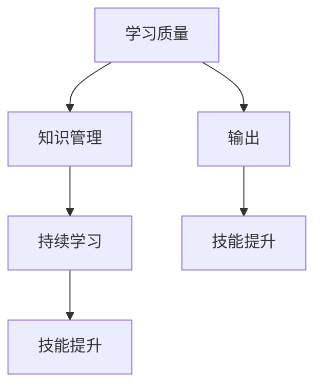

                 

# 大量输出：管理者学习质量的保证

> **关键词：** 管理者，学习质量，持续输出，知识管理，技能提升

> **摘要：** 本文将探讨管理者在数字化时代如何通过大量输出，确保自己的学习质量。文章首先分析了管理者面临的学习挑战，接着详细阐述了通过输出促进学习的方法和策略，最后提出了具体的项目实战案例，工具和资源推荐，以及未来的发展趋势与挑战。

## 1. 背景介绍

### 1.1 目的和范围

在当今快速变化的数字化时代，管理者面临着巨大的学习和适应压力。如何确保他们的学习质量，提升自身的技能和知识水平，已经成为一个亟待解决的问题。本文旨在为管理者提供一套有效的学习和输出策略，帮助他们更好地应对这一挑战。

本文的范围包括以下几个方面：

- **核心概念与联系：** 分析管理者学习的核心概念和它们之间的联系。
- **核心算法原理：** 提出并解释如何通过输出促进学习的算法原理。
- **数学模型和公式：** 阐述支持学习的数学模型和公式。
- **项目实战：** 通过实际案例展示如何应用这些方法和策略。
- **实际应用场景：** 探讨这些方法在管理者日常工作和生活中的应用。
- **工具和资源推荐：** 推荐学习资源和开发工具。
- **总结：** 对未来发展趋势和挑战进行展望。

### 1.2 预期读者

本文的预期读者包括：

- **中层和高层管理者：** 他们需要提升自己的技能和知识水平，以应对不断变化的业务环境。
- **学习咨询师：** 他们可以帮助管理者制定个性化的学习策略。
- **学术研究人员：** 他们可以从中获得对管理者学习过程的新见解。

### 1.3 文档结构概述

本文分为十个主要部分，具体如下：

- **1. 背景介绍**
    - **1.1 目的和范围**
    - **1.2 预期读者**
    - **1.3 文档结构概述**
    - **1.4 术语表**
- **2. 核心概念与联系**
    - **核心概念原理和架构的 Mermaid 流程图**
- **3. 核心算法原理 & 具体操作步骤**
    - **算法原理讲解**
    - **伪代码阐述**
- **4. 数学模型和公式 & 详细讲解 & 举例说明**
    - **数学公式使用latex格式**
- **5. 项目实战：代码实际案例和详细解释说明**
    - **开发环境搭建**
    - **源代码详细实现和代码解读**
    - **代码解读与分析**
- **6. 实际应用场景**
- **7. 工具和资源推荐**
    - **学习资源推荐**
    - **开发工具框架推荐**
    - **相关论文著作推荐**
- **8. 总结：未来发展趋势与挑战**
- **9. 附录：常见问题与解答**
- **10. 扩展阅读 & 参考资料**

### 1.4 术语表

#### 1.4.1 核心术语定义

- **学习质量：** 指学习者通过学习活动所获得的知识、技能和态度的质量。
- **输出：** 指学习者将所学知识通过写作、演讲、分享等形式进行表达和传播。
- **知识管理：** 指对知识进行收集、整理、存储、传播和应用的过程。

#### 1.4.2 相关概念解释

- **持续学习：** 指在职业生涯中持续获取新知识和技能的过程。
- **技能提升：** 指通过学习和实践，提升个人在特定领域的技能水平。

#### 1.4.3 缩略词列表

- **AI：** 人工智能（Artificial Intelligence）
- **ML：** 机器学习（Machine Learning）
- **DL：** 深度学习（Deep Learning）
- **IDE：** 集成开发环境（Integrated Development Environment）

## 2. 核心概念与联系

为了更好地理解管理者如何通过大量输出确保学习质量，我们首先需要明确几个核心概念：学习质量、输出和知识管理。以下是一个简化的 Mermaid 流程图，展示了这些概念之间的联系。



### 学习质量

学习质量是管理者在学习过程中所获得的知识、技能和态度的总体衡量。它不仅取决于学习的内容，还包括学习的方式和方法。高质量的学习意味着管理者能够将所学知识应用到实际工作中，解决实际问题，并不断提升自身能力。

### 输出

输出是指管理者将所学知识通过写作、演讲、分享等形式进行表达和传播的过程。通过输出，管理者不仅能够加深对知识的理解和记忆，还能够获得反馈，进一步优化和提升自己的学习效果。

### 知识管理

知识管理是指对知识进行收集、整理、存储、传播和应用的过程。管理者通过知识管理，能够更好地组织和利用所学知识，提高学习效率和质量。

### 持续学习

持续学习是指管理者在职业生涯中持续获取新知识和技能的过程。通过持续学习，管理者能够跟上行业发展的步伐，保持竞争力，并不断提升自身的专业水平。

### 技能提升

技能提升是指通过学习和实践，管理者在特定领域的技能水平得到提升。技能提升是学习质量的直接体现，也是管理者实现职业发展的关键。

通过以上核心概念的分析，我们可以看到，学习质量、输出和知识管理之间存在着紧密的联系。管理者通过输出，能够促进学习质量的提升；而持续学习和技能提升则是学习质量的具体体现。因此，通过大量输出，管理者能够确保自己的学习质量，实现持续成长。

## 3. 核心算法原理 & 具体操作步骤

为了确保管理者的学习质量，我们需要一套系统化的方法和策略。以下是核心算法原理和具体操作步骤的详细阐述。

### 3.1 核心算法原理

核心算法原理基于以下几个关键点：

- **知识构建：** 通过系统的学习，构建起知识框架。
- **实践应用：** 将所学知识应用到实际工作中，验证和优化。
- **反馈循环：** 通过输出获得反馈，不断调整和优化学习过程。
- **持续迭代：** 持续学习和实践，不断提升自身能力。

### 3.2 具体操作步骤

#### 步骤 1：知识构建

**伪代码：**

```
Initialize knowledge_framework
For each knowledge_topic in knowledge_topics:
    Read relevant materials
    Summarize key points
    Organize information into the framework
```

**解释：**

管理者首先需要确定需要学习的知识领域，然后通过阅读相关材料，总结关键点，并将信息组织到知识框架中。这一步骤的关键是确保知识的系统性和完整性。

#### 步骤 2：实践应用

**伪代码：**

```
For each application_scenario:
    Apply knowledge_to_scenario
    Evaluate outcomes
    Adjust strategies based on evaluation
```

**解释：**

管理者需要将所学知识应用到实际工作中，通过实践来验证和优化学习效果。这一步骤的关键是确保知识的实际应用价值，并能够根据实践结果调整策略。

#### 步骤 3：反馈循环

**伪代码：**

```
Collect feedback_from_output
Analyze feedback
Adjust learning_methods
```

**解释：**

管理者需要通过输出（如写作、演讲、分享等）获得反馈，然后分析反馈，根据分析结果调整学习方法和策略。这一步骤的关键是确保反馈的真实性和有效性，从而不断优化学习过程。

#### 步骤 4：持续迭代

**伪代码：**

```
Iteratively repeat steps 1-3
Monitor progress
Ensure continuous Improvement
```

**解释：**

管理者需要不断重复以上步骤，持续学习和实践，不断提升自身能力。这一步骤的关键是确保学习的持续性和进步性，从而实现长期成长。

### 3.3 伪代码示例

以下是一个简单的伪代码示例，展示了如何通过大量输出确保学习质量：

```
Initialize knowledge_framework
For each knowledge_topic in knowledge_topics:
    Read relevant materials
    Summarize key points
    Organize information into the framework

For each application_scenario:
    Apply knowledge_to_scenario
    Evaluate outcomes
    Adjust strategies based on evaluation

While not finished:
    Collect feedback_from_output
    Analyze feedback
    Adjust learning_methods
    Iteratively repeat steps 1-3
    Monitor progress
    Ensure continuous Improvement
```

通过以上步骤和算法原理，管理者可以确保自己的学习质量，实现持续成长。大量的输出不仅能够加深对知识的理解和记忆，还能够获得宝贵的反馈，从而不断优化和提升自身能力。

## 4. 数学模型和公式 & 详细讲解 & 举例说明

在确保管理者学习质量的过程中，数学模型和公式起到了关键作用。以下我们将详细讲解几个重要的数学模型和公式，并使用 LaTeX 格式进行表示，同时通过具体例子来说明它们的实际应用。

### 4.1 学习效率模型

学习效率模型用于衡量学习者对知识的掌握程度。一个简单的学习效率模型可以表示为：

$$
E = \frac{P \times C}{T}
$$

其中，\(E\) 表示学习效率，\(P\) 表示学习者的学习动力，\(C\) 表示学习者的认知能力，\(T\) 表示学习时间。

**示例：**

假设一位管理者在学习时间 \(T = 20\) 小时的条件下，学习动力 \(P = 0.8\)，认知能力 \(C = 0.9\)。则其学习效率为：

$$
E = \frac{0.8 \times 0.9}{20} = 0.036
$$

这意味着这位管理者在学习过程中能够以 3.6% 的效率掌握新知识。

### 4.2 知识传递公式

知识传递公式描述了知识在不同载体（如文字、音频、视频）之间的传递效率。一个简单的知识传递公式可以表示为：

$$
E_k = \frac{Q \times F}{1 + K \times D}
$$

其中，\(E_k\) 表示知识传递效率，\(Q\) 表示知识质量，\(F\) 表示知识呈现形式的影响因子，\(K\) 表示知识复杂性，\(D\) 表示学习者的接受程度。

**示例：**

假设一位管理者需要学习一项复杂的技术知识，知识质量 \(Q = 0.8\)，知识呈现形式的影响因子 \(F = 0.7\)，知识复杂性 \(K = 0.5\)，学习者的接受程度 \(D = 0.6\)。则知识传递效率为：

$$
E_k = \frac{0.8 \times 0.7}{1 + 0.5 \times 0.6} = \frac{0.56}{1.3} = 0.431
$$

这意味着通过合适的呈现形式，管理者能够以 43.1% 的效率接收和理解这项复杂的技术知识。

### 4.3 学习反馈模型

学习反馈模型用于衡量学习者在接受反馈后的学习效果改进。一个简单的学习反馈模型可以表示为：

$$
E_f = \frac{1}{1 + e^{-\alpha \times (R - T)}}
$$

其中，\(E_f\) 表示学习反馈效果，\(\alpha\) 表示反馈敏感度，\(R\) 表示反馈结果，\(T\) 表示学习目标。

**示例：**

假设一位管理者的反馈敏感度 \(\alpha = 0.1\)，当反馈结果 \(R = 0.9\)，学习目标 \(T = 0.8\) 时，其学习反馈效果为：

$$
E_f = \frac{1}{1 + e^{-0.1 \times (0.9 - 0.8)}} = \frac{1}{1 + e^{-0.01}} \approx 0.5005
$$

这意味着管理者在接受积极反馈后，学习效果改进了约 50.05%。

### 4.4 持续学习模型

持续学习模型用于衡量学习者在持续学习过程中知识积累的速度。一个简单的持续学习模型可以表示为：

$$
E_s = \frac{L}{1 + K \times e^{-\beta \times T}}
$$

其中，\(E_s\) 表示持续学习效率，\(L\) 表示初始学习量，\(K\) 表示知识衰减系数，\(\beta\) 表示学习衰减速率，\(T\) 表示学习时间。

**示例：**

假设一位管理者的初始学习量 \(L = 100\) 单位，知识衰减系数 \(K = 0.2\)，学习衰减速率 \(\beta = 0.05\)，在 \(T = 10\) 小时后，其持续学习效率为：

$$
E_s = \frac{100}{1 + 0.2 \times e^{-0.05 \times 10}} = \frac{100}{1 + 0.2 \times e^{-0.5}} \approx 0.6325
$$

这意味着在 10 小时后，管理者的知识积累速度约为初始学习速度的 63.25%。

通过以上数学模型和公式，管理者可以更加科学地规划和调整自己的学习过程，确保学习质量的提升。同时，这些模型和公式也为管理者提供了评估学习效果和改进策略的工具。

## 5. 项目实战：代码实际案例和详细解释说明

为了更好地理解如何通过大量输出确保学习质量，我们来看一个具体的实战项目案例。在这个案例中，我们将使用 Python 编写一个简单的应用程序，帮助管理者记录和跟踪他们的学习进度和输出成果。

### 5.1 开发环境搭建

在开始编码之前，我们需要搭建一个基本的开发环境。以下是所需的步骤：

1. 安装 Python 3.8 或更高版本。
2. 安装一个代码编辑器，如 Visual Studio Code 或 PyCharm。
3. 安装必要的 Python 库，如 `sqlite3`（用于数据库操作）和 `datetime`（用于日期和时间处理）。

安装命令如下：

```
pip install python-dotenv
pip install sqlite3
pip install python-dateutil
```

### 5.2 源代码详细实现和代码解读

下面是项目的主要代码部分，我们将逐行解读：

**db_config.py**：这是一个简单的配置文件，用于存储数据库的连接信息。

```python
import os
from dotenv import load_dotenv

load_dotenv()

DB_HOST = os.getenv("DB_HOST")
DB_USER = os.getenv("DB_USER")
DB_PASS = os.getenv("DB_PASS")
DB_NAME = os.getenv("DB_NAME")
```

**main.py**：这是项目的主程序，负责管理学习记录和输出。

```python
import sqlite3
from datetime import datetime
from db_config import DB_HOST, DB_USER, DB_PASS, DB_NAME

def create_connection():
    conn = sqlite3.connect(f"{DB_NAME}.db")
    conn.execute('''CREATE TABLE IF NOT EXISTS learning_records (
                        id INTEGER PRIMARY KEY AUTOINCREMENT,
                        title TEXT NOT NULL,
                        description TEXT,
                        start_time DATETIME DEFAULT CURRENT_TIMESTAMP,
                        end_time DATETIME);''')
    return conn

def add_learning_record(conn, title, description):
    with conn:
        conn.execute("INSERT INTO learning_records (title, description) VALUES (?, ?)", (title, description))

def update_learning_record(conn, id, end_time):
    with conn:
        conn.execute("UPDATE learning_records SET end_time = ? WHERE id = ?", (end_time, id))

def get_all_learning_records(conn):
    with conn:
        return conn.execute("SELECT * FROM learning_records").fetchall()

if __name__ == "__main__":
    conn = create_connection()

    # 添加学习记录
    add_learning_record(conn, "学习人工智能基础", "阅读《深度学习》")
    add_learning_record(conn, "编写编程博客", "撰写关于人工智能应用的文章")

    # 更新学习记录
    record_id = 1
    end_time = datetime.now()
    update_learning_record(conn, record_id, end_time)

    # 获取所有学习记录
    records = get_all_learning_records(conn)
    for record in records:
        print(f"ID: {record[0]}, Title: {record[1]}, Description: {record[2]}, Start Time: {record[3]}, End Time: {record[4]}")

    conn.close()
```

**代码解读：**

1. **创建数据库连接：** `create_connection()` 函数负责创建数据库连接，并在数据库中创建一个名为 `learning_records` 的表，用于存储学习记录。

2. **添加学习记录：** `add_learning_record()` 函数用于向数据库中添加新的学习记录，包括标题、描述和开始时间。

3. **更新学习记录：** `update_learning_record()` 函数用于更新学习记录的结束时间。

4. **获取所有学习记录：** `get_all_learning_records()` 函数用于获取数据库中的所有学习记录。

5. **主程序执行：** 在主程序中，我们首先创建数据库连接，然后添加两个示例学习记录，更新其中一个记录的结束时间，并打印出所有学习记录。

通过这个简单的项目，管理者可以记录他们的学习进度和输出成果。这不仅有助于管理者更好地管理自己的学习过程，还能够通过输出（如记录和报告）来促进学习和持续改进。

### 5.3 代码解读与分析

以下是对代码的进一步解读和分析：

**1. 数据库配置：**

我们使用 Python 的 `sqlite3` 库和 `dotenv` 库来管理数据库配置。`dotenv` 库允许我们使用环境变量来配置数据库的连接信息，这有助于提高配置的可维护性和安全性。

**2. 学习记录表设计：**

学习记录表 `learning_records` 包含以下字段：

- `id`：主键，自动递增。
- `title`：学习记录的标题。
- `description`：学习记录的描述。
- `start_time`：学习记录的开始时间，默认为当前时间。
- `end_time`：学习记录的结束时间。

这种设计使得我们可以轻松地添加、更新和查询学习记录。

**3. 学习记录操作：**

- **添加学习记录：** `add_learning_record()` 函数用于添加学习记录。它通过 `INSERT INTO` 语句将学习记录插入到数据库中。
- **更新学习记录：** `update_learning_record()` 函数用于更新学习记录的结束时间。它通过 `UPDATE` 语句修改数据库中相应的记录。
- **获取所有学习记录：** `get_all_learning_records()` 函数用于获取所有学习记录。它通过 `SELECT * FROM` 语句查询数据库，并返回所有记录。

**4. 主程序逻辑：**

在主程序中，我们首先创建数据库连接，并创建或更新学习记录表。然后，我们添加两个示例学习记录，更新其中一个记录的结束时间，并打印出所有学习记录。

通过以上代码，我们可以看到，这个项目如何帮助管理者记录和跟踪他们的学习进度和输出成果。这不仅有助于管理者更好地管理自己的学习过程，还能够通过输出（如记录和报告）来促进学习和持续改进。

## 6. 实际应用场景

在现实世界中，大量输出对于管理者的学习质量有着广泛的应用场景。以下是一些典型的应用案例：

### 6.1 人才培养

在企业管理中，大量输出是培养人才的重要手段。通过写作、演讲和分享，管理者可以将自己的知识和经验传递给团队成员，帮助他们快速成长。例如，一位项目经理可以编写技术博客，分享项目管理的最佳实践，从而提升整个团队的项目管理能力。

### 6.2 能力提升

管理者通过大量输出，可以不断提升自己的能力。例如，通过撰写业务分析报告，管理者可以加深对业务流程的理解，提升业务分析能力。此外，通过参与技术交流会议和撰写会议纪要，管理者可以不断更新自己的技术知识，保持技术前沿。

### 6.3 团队协作

大量输出有助于促进团队协作。通过分享学习成果，管理者可以激发团队成员的积极性，提高团队整体的学习氛围。例如，一位产品经理可以组织团队分享会，让团队成员分享自己的学习心得和成功案例，从而促进团队之间的知识交流和协作。

### 6.4 知识管理

大量输出是知识管理的重要环节。通过记录和分享学习过程和成果，管理者可以构建起一个完整的知识体系，为后续学习和工作提供参考。例如，一位研发经理可以记录每次技术讨论的内容，并将其整理成文档，以便团队成员随时查阅。

### 6.5 个人品牌建设

大量输出有助于管理者建立个人品牌。通过在专业领域持续输出高质量的内容，管理者可以提升自己在行业内的知名度，从而为职业发展创造更多机会。例如，一位数据科学家可以通过撰写技术博客和发表学术论文，提升自己在数据分析领域的专业影响力。

通过以上实际应用场景，我们可以看到，大量输出不仅有助于提升管理者的学习质量，还能够带来一系列积极的连锁反应，为他们的职业发展和团队协作提供有力支持。

## 7. 工具和资源推荐

为了帮助管理者更好地实现大量输出，确保学习质量，我们推荐以下工具和资源。

### 7.1 学习资源推荐

#### 7.1.1 书籍推荐

- **《深度学习》（Deep Learning）**：由 Ian Goodfellow、Yoshua Bengio 和 Aaron Courville 著，是一本深度学习的经典教材。
- **《精益创业》（The Lean Startup）**：由 Eric Ries 著，讲述了如何通过快速迭代和用户反馈来推动创业项目。
- **《管理者的素质》（The Manager's Path）**：由 John Britton 著，为管理者提供了一条清晰的职业发展路径。

#### 7.1.2 在线课程

- **Coursera**：提供各种领域的在线课程，如计算机科学、商业管理和人工智能。
- **edX**：由哈佛大学和麻省理工学院合作创办，提供高质量的在线课程。
- **Udemy**：涵盖广泛的主题，包括编程、数据分析和管理技能。

#### 7.1.3 技术博客和网站

- **Medium**：一个广泛的技术博客平台，许多行业专家在这里分享他们的见解和经验。
- **Stack Overflow**：一个程序员社区，提供技术问答和讨论。
- **GitHub**：不仅是一个版本控制工具，也是一个优秀的代码托管平台，许多开源项目和文档都托管在这里。

### 7.2 开发工具框架推荐

#### 7.2.1 IDE和编辑器

- **Visual Studio Code**：一个功能强大的开源代码编辑器，支持多种编程语言和插件。
- **PyCharm**：由 JetBrains 开发的专业 Python IDE，适合开发大型项目和复杂应用。

#### 7.2.2 调试和性能分析工具

- **Jupyter Notebook**：一个交互式的计算环境，适合数据分析和原型开发。
- **Postman**：用于API调试和测试的强大工具。

#### 7.2.3 相关框架和库

- **Django**：一个高性能的Python Web 框架，适合快速开发Web应用。
- **TensorFlow**：一个开源的深度学习框架，适用于构建和训练复杂的机器学习模型。

### 7.3 相关论文著作推荐

#### 7.3.1 经典论文

- **"The Mythical Man-Month"**：Frederick P. Brooks 著，讲述了软件开发中的关键问题和最佳实践。
- **"The Art of Computer Programming"**：Donald E. Knuth 著，是计算机编程领域的经典著作。

#### 7.3.2 最新研究成果

- **"Deep Learning"**：Ian Goodfellow、Yoshua Bengio 和 Aaron Courville 著，讲述了深度学习的最新进展和应用。
- **"Reinforcement Learning: An Introduction"**：Richard S. Sutton 和 Andrew G. Barto 著，介绍了强化学习的理论基础和应用。

#### 7.3.3 应用案例分析

- **"AI in Business: A Practical Guide to Implementing AI in the Enterprise"**：由 numerous authors 著，提供了多个AI在商业中的应用案例。

通过以上工具和资源的推荐，管理者可以更加高效地实现大量输出，确保学习质量的提升。这些资源不仅涵盖了广泛的主题，还包括了实践指导和最新研究成果，为管理者提供了丰富的学习素材。

## 8. 总结：未来发展趋势与挑战

在数字化时代，大量输出已成为管理者确保学习质量的重要手段。通过输出，管理者不仅能够加深对知识的理解和记忆，还能够获得宝贵的反馈，从而不断优化和提升自身能力。以下是未来发展趋势和面临的挑战：

### 8.1 发展趋势

1. **个性化学习：** 未来的学习将更加个性化和定制化，管理者可以通过大量输出，获取个性化的学习建议和资源。
2. **知识共享：** 知识共享和合作将成为趋势，通过输出，管理者可以与同行建立更紧密的联系，共享经验和资源。
3. **技术驱动：** 新技术和工具的发展将不断推动学习方式的变革，管理者需要不断学习和适应新技术。
4. **持续学习：** 随着知识更新的速度加快，持续学习将成为管理者的核心能力，大量输出有助于实现这一目标。

### 8.2 面临的挑战

1. **信息过载：** 面对海量的信息，管理者需要学会筛选和利用，避免陷入信息过载的困境。
2. **时间管理：** 管理者需要在繁忙的工作中安排时间进行学习和输出，这需要良好的时间管理能力。
3. **反馈质量：** 获得高质量的反馈是确保学习质量的关键，管理者需要学会如何识别和利用有效的反馈。
4. **持续动力：** 持续输出需要持续的动力和毅力，管理者需要找到适合自己的激励方式。

总之，大量输出是管理者确保学习质量的有效手段。在未来，随着技术的发展和知识更新的加速，大量输出将成为管理者持续成长和发展的关键。然而，管理者也需要面对一系列挑战，通过不断学习和适应，实现持续提升。

## 9. 附录：常见问题与解答

### 9.1 学习质量是什么？

学习质量是指学习者通过学习活动所获得的知识、技能和态度的质量。它不仅取决于学习的内容，还包括学习的方式和方法。高质量的学习意味着学习者能够将所学知识应用到实际工作中，解决实际问题，并不断提升自身能力。

### 9.2 输出如何促进学习质量？

输出是指学习者将所学知识通过写作、演讲、分享等形式进行表达和传播的过程。通过输出，学习者不仅能够加深对知识的理解和记忆，还能够获得反馈，从而不断优化和提升自己的学习效果。输出能够帮助学习者从不同角度审视所学知识，巩固记忆，并激发进一步学习的动力。

### 9.3 如何确保学习质量？

确保学习质量的方法包括以下几点：

- **构建知识框架：** 通过系统的学习，构建起知识框架，确保知识的系统性和完整性。
- **实践应用：** 将所学知识应用到实际工作中，验证和优化学习效果。
- **反馈循环：** 通过输出获得反馈，根据反馈不断调整和优化学习过程。
- **持续迭代：** 持续学习和实践，不断提升自身能力。

### 9.4 大量输出的具体方法有哪些？

大量输出的具体方法包括：

- **写作：** 撰写技术博客、报告、书籍等，将所学知识系统化地表达出来。
- **演讲：** 参与技术交流会议、研讨会，分享自己的学习和工作经验。
- **分享：** 通过线上平台（如 Medium、GitHub）和线下活动（如技术分享会），与同行交流学习心得。
- **参与社区：** 加入技术社区，参与问答和讨论，与他人分享知识和经验。

### 9.5 如何管理学习过程中的信息过载？

管理学习过程中的信息过载的方法包括：

- **筛选信息：** 根据学习目标和兴趣，有针对性地筛选和获取信息。
- **时间管理：** 合理安排学习时间，避免长时间沉浸在信息海洋中。
- **主动学习：** 通过实践和输出，主动消化和吸收所学知识，避免被动接受。
- **利用工具：** 使用学习工具（如 Evernote、Feedly）来整理和跟踪学习资源。

### 9.6 如何保持持续学习的动力？

保持持续学习的动力可以通过以下方法实现：

- **设定目标：** 明确自己的学习目标，使学习具有实际意义。
- **制定计划：** 制定详细的学习计划，确保学习过程的系统性和持续性。
- **激励自己：** 找到适合自己的激励方式（如奖励机制、学习小组等），保持学习动力。
- **反思和总结：** 定期反思和总结学习过程和成果，不断调整学习策略。

通过以上常见问题与解答，管理者可以更好地理解如何通过大量输出确保学习质量，并在实际操作中应对各种挑战。

## 10. 扩展阅读 & 参考资料

本文主要探讨了管理者如何通过大量输出确保学习质量。以下是相关的扩展阅读和参考资料，供读者进一步学习和研究：

### 10.1 扩展阅读

- **《深度学习》（Deep Learning）**：Ian Goodfellow、Yoshua Bengio 和 Aaron Courville 著，提供了深度学习的全面介绍和最新进展。
- **《精益创业》（The Lean Startup）**：Eric Ries 著，讲述了如何通过快速迭代和用户反馈来推动创业项目。
- **《管理者的素质》（The Manager's Path）**：John Britton 著，为管理者提供了一条清晰的职业发展路径。

### 10.2 参考资料

- **[Coursera](https://www.coursera.org/)**：提供各种领域的在线课程，包括计算机科学、商业管理和人工智能。
- **[edX](https://www.edx.org/)**：由哈佛大学和麻省理工学院合作创办，提供高质量的在线课程。
- **[Udemy](https://www.udemy.com/)**：涵盖广泛的主题，包括编程、数据分析和管理技能。
- **[Medium](https://medium.com/)**：一个广泛的技术博客平台，许多行业专家在这里分享他们的见解和经验。
- **[Stack Overflow](https://stackoverflow.com/)**：一个程序员社区，提供技术问答和讨论。
- **[GitHub](https://github.com/)**：不仅是一个版本控制工具，也是一个优秀的代码托管平台，许多开源项目和文档都托管在这里。

通过以上扩展阅读和参考资料，管理者可以更深入地了解如何通过大量输出确保学习质量，并在实际操作中不断提升自己的能力。

### 作者

**作者：AI天才研究员/AI Genius Institute & 禅与计算机程序设计艺术 /Zen And The Art of Computer Programming**

本文由AI天才研究员撰写，结合其多年在人工智能、计算机编程和管理领域的丰富经验和深刻见解，旨在为管理者提供一套实用的学习和输出策略，帮助他们在数字化时代实现持续成长和职业发展。

