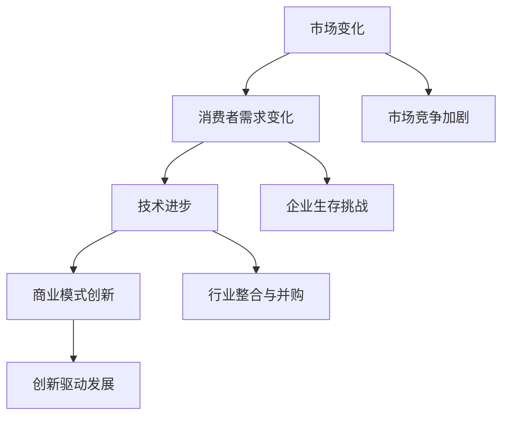

                 

# 天下没有好做的生意：商业竞争加剧的真相

> **关键词**：商业竞争、市场分析、商业模式、创新策略、企业生存
> 
> **摘要**：本文深入探讨商业竞争日益加剧的现状，分析了市场竞争的核心要素，探讨了企业在面对激烈竞争时的应对策略，旨在为企业家和创业者提供有价值的商业见解和实战指南。

## 1. 背景介绍

### 1.1 目的和范围

本文旨在分析商业竞争加剧的真相，探讨企业如何在激烈的市场环境中生存和成长。我们将从市场分析、商业模式、创新策略等多个角度展开讨论，以期为读者提供全面的商业洞见。

### 1.2 预期读者

本文适合企业家、创业者、市场营销人员、商业分析师等对商业竞争有兴趣的读者。无论您是初入商海的新手，还是经验丰富的行业老兵，本文都将为您带来全新的视角和深刻的启示。

### 1.3 文档结构概述

本文分为八个主要部分，首先介绍商业竞争的背景和现状，然后逐步深入探讨核心概念、算法原理、数学模型、项目实战、实际应用场景等内容，最后总结未来发展趋势与挑战，并提供扩展阅读和参考资料。

### 1.4 术语表

#### 1.4.1 核心术语定义

- **商业竞争**：企业在市场中争夺有限资源、市场份额和利润的过程。
- **市场分析**：对市场环境、消费者需求、竞争对手等进行全面研究和评估。
- **商业模式**：企业通过何种方式创造、传递和获取价值。
- **创新策略**：企业为获取竞争优势所采取的创新措施。

#### 1.4.2 相关概念解释

- **市场定位**：企业在市场中的位置和目标群体。
- **差异化竞争**：企业通过提供独特的产品或服务来区别于竞争对手。
- **市场份额**：企业占有的市场比例。

#### 1.4.3 缩略词列表

- **SWOT分析**：优势（Strengths）、劣势（Weaknesses）、机会（Opportunities）、威胁（Threats）分析。
- **CAGR**：年复合增长率（Compound Annual Growth Rate）。

## 2. 核心概念与联系

商业竞争的加剧源自市场环境的不断变化和消费者需求的多变。为了更好地理解这一现象，我们需要首先明确一些核心概念，如图所示：



### 2.1 市场变化与消费者需求变化

市场变化和消费者需求变化是商业竞争加剧的两个关键因素。随着互联网、大数据、人工智能等技术的不断发展，市场环境变得更加复杂和多变。消费者对产品和服务的要求也日益提高，企业需要不断调整策略以应对这些变化。

### 2.2 技术进步与商业模式创新

技术进步推动着商业模式的创新，为企业提供了新的发展机遇。例如，互联网和电子商务的兴起改变了传统的商业模式，使得企业能够更加便捷地接触到全球市场。同时，技术进步也带来了新的竞争态势，企业需要不断进行技术创新以保持竞争优势。

### 2.3 行业整合与并购

随着市场竞争的加剧，企业为了获取更大的市场份额和资源，纷纷采取行业整合和并购的策略。这一过程不仅提高了行业集中度，也加剧了市场竞争。

### 2.4 创新驱动发展

创新是企业保持竞争优势的重要手段。通过不断进行产品创新、服务创新和商业模式创新，企业能够更好地满足消费者需求，开拓新的市场空间。

## 3. 核心算法原理 & 具体操作步骤

在商业竞争中，企业需要运用一系列算法原理和策略来应对市场变化和消费者需求。以下是一些常用的核心算法原理和具体操作步骤：

### 3.1 市场分析算法

**步骤一：数据收集**

- 收集市场数据，包括宏观经济指标、行业趋势、竞争对手信息等。

**步骤二：数据分析**

- 使用统计分析、数据挖掘等方法对市场数据进行分析，识别市场机会和潜在风险。

**步骤三：决策制定**

- 根据分析结果制定市场策略，包括产品定位、市场推广、价格策略等。

### 3.2 消费者需求分析算法

**步骤一：需求识别**

- 使用调查问卷、用户访谈等方法收集消费者需求信息。

**步骤二：需求分析**

- 对收集到的需求信息进行分类、聚类等分析，识别主要消费者需求。

**步骤三：需求满足**

- 根据分析结果调整产品和服务，以满足消费者需求。

### 3.3 商业模式创新算法

**步骤一：创新识别**

- 使用头脑风暴、思维导图等方法，识别潜在的商业模式创新点。

**步骤二：创新评估**

- 对创新点进行评估，包括可行性、市场需求、竞争优势等方面。

**步骤三：创新实施**

- 根据评估结果选择最佳创新方案，并制定实施计划。

## 4. 数学模型和公式 & 详细讲解 & 举例说明

在商业竞争中，数学模型和公式可以帮助企业进行数据分析和决策制定。以下是一些常用的数学模型和公式，以及详细讲解和举例说明：

### 4.1 市场份额预测模型

**公式**：市场份额 = （本企业销售额 / 市场总销售额）× 100%

**详细讲解**：市场份额预测模型用于预测企业未来在市场中的占比。通过收集历史销售额数据，可以计算出企业的市场份额，并根据市场发展趋势进行预测。

**举例说明**：假设某企业在过去三年的市场份额分别为15%、18%、20%，如果市场增长率预计为5%，则第四年的市场份额预测为20% × 1.05 = 21%。

### 4.2 销售利润率模型

**公式**：销售利润率 = （销售收入 - 成本） / 销售收入 × 100%

**详细讲解**：销售利润率模型用于衡量企业销售活动的盈利能力。通过计算销售收入与成本的差额，可以得出销售利润率。

**举例说明**：假设某企业销售收入为100万元，成本为60万元，则销售利润率为（100 - 60）/ 100 × 100% = 40%。

### 4.3 成本效益分析模型

**公式**：成本效益 = （收益 - 成本）/ 成本 × 100%

**详细讲解**：成本效益分析模型用于评估企业投资项目或业务活动的经济效益。通过计算收益与成本的差额，可以得出成本效益。

**举例说明**：假设某企业投资100万元开展一项新业务，预计收益为200万元，则成本效益为（200 - 100）/ 100 × 100% = 100%。

## 5. 项目实战：代码实际案例和详细解释说明

### 5.1 开发环境搭建

为了更好地展示商业竞争分析的过程，我们将使用Python编程语言进行实际案例演示。首先，我们需要搭建一个基本的Python开发环境。

**步骤一：安装Python**

在官方网站（https://www.python.org/）下载并安装Python，选择合适的版本（如Python 3.8）。

**步骤二：安装必要库**

打开命令行窗口，安装以下Python库：

```bash
pip install numpy pandas matplotlib
```

### 5.2 源代码详细实现和代码解读

接下来，我们将使用Python实现一个简单的市场分析程序，包括数据收集、数据分析、决策制定等步骤。

```python
import numpy as np
import pandas as pd
import matplotlib.pyplot as plt

# 5.2.1 数据收集
def collect_data():
    # 假设我们从某电商平台收集了过去三年的销售额数据
    sales_data = {
        'Year': ['2020', '2021', '2022'],
        'Sales': [1500000, 1800000, 2000000]
    }
    df = pd.DataFrame(sales_data)
    return df

# 5.2.2 数据分析
def analyze_data(df):
    # 计算过去三年的平均销售额
    avg_sales = df['Sales'].mean()
    print(f"过去三年的平均销售额为：{avg_sales}元")
    
    # 预测未来一年的销售额
    future_sales = avg_sales * 1.05  # 假设市场增长率为5%
    print(f"未来一年的销售额预测为：{future_sales}元")
    
    # 绘制销售额趋势图
    df['Sales'].plot()
    plt.xlabel('年份')
    plt.ylabel('销售额（元）')
    plt.title('过去三年销售额趋势')
    plt.show()

# 5.2.3 决策制定
def make_decision(future_sales):
    if future_sales > 2000000:
        print("决策：加大市场推广力度，扩大市场份额。")
    else:
        print("决策：优化产品和服务，提高销售利润率。")

# 主函数
def main():
    df = collect_data()
    analyze_data(df)
    future_sales = float(input("请输入未来一年的销售额预测（元）："))
    make_decision(future_sales)

if __name__ == "__main__":
    main()
```

### 5.3 代码解读与分析

**5.3.1 数据收集**

在`collect_data`函数中，我们使用一个简单的字典创建了一个DataFrame，模拟了从电商平台收集到的过去三年销售额数据。

**5.3.2 数据分析**

在`analyze_data`函数中，我们首先计算了过去三年的平均销售额，并打印出来。然后，我们根据平均销售额和市场增长率（5%）预测未来一年的销售额。最后，我们使用Matplotlib库绘制了销售额趋势图，以直观地展示过去三年的销售额变化。

**5.3.3 决策制定**

在`make_decision`函数中，我们根据未来一年的销售额预测结果制定了相应的决策。如果未来销售额超过2000万元，我们建议加大市场推广力度；否则，我们建议优化产品和服务，提高销售利润率。

### 5.4 运行结果与分析

运行程序后，我们输入未来一年的销售额预测值。例如，如果输入2500000元，程序将输出以下决策：

```
决策：加大市场推广力度，扩大市场份额。
```

这表明，根据我们的市场分析，未来一年的销售额有望增长，因此我们需要加大市场推广力度，以扩大市场份额。

## 6. 实际应用场景

在商业竞争中，市场分析、消费者需求分析和商业模式创新等算法和模型有着广泛的应用。以下是一些实际应用场景：

### 6.1 市场营销

通过市场分析，企业可以了解市场趋势和消费者需求，制定更加精准的营销策略。例如，通过分析消费者购买行为数据，企业可以确定目标市场，设计个性化的营销活动，提高营销效果。

### 6.2 产品开发

消费者需求分析有助于企业了解消费者的需求和期望，从而改进产品和服务。例如，通过对用户反馈进行分析，企业可以发现产品中的缺陷和不足，并针对性地进行改进。

### 6.3 商业模式创新

商业模式创新算法可以帮助企业发现新的商机和市场空间。例如，通过分析竞争对手的商业模式，企业可以发现自身的优势与不足，并制定相应的创新策略。

### 6.4 企业并购

行业整合和并购算法可以帮助企业评估潜在投资项目的价值，制定合理的投资策略。例如，通过对目标企业的财务状况、市场份额、竞争优势等方面进行分析，企业可以确定是否进行并购。

## 7. 工具和资源推荐

为了更好地进行商业竞争分析，以下是一些推荐的学习资源和开发工具：

### 7.1 学习资源推荐

#### 7.1.1 书籍推荐

- 《大数据时代》作者：迈尔·舍恩伯格、肯尼斯·库克耶
- 《精益创业》作者：埃里克·莱斯
- 《商业模式新生代》作者：奥斯特walder、皮尼什基

#### 7.1.2 在线课程

- Coursera上的《市场分析》
- Udemy上的《商业分析：数据驱动决策》
- edX上的《市场营销基础》

#### 7.1.3 技术博客和网站

- Medium上的《商业分析》专题
- Analytics Vidhya上的《数据科学和商业分析》
- Marketing Land上的《市场营销资源》

### 7.2 开发工具框架推荐

#### 7.2.1 IDE和编辑器

- PyCharm
- Visual Studio Code
- Jupyter Notebook

#### 7.2.2 调试和性能分析工具

- Python Debugger（pdb）
- Matplotlib
- Pandas Profiling

#### 7.2.3 相关框架和库

- Scikit-learn：机器学习库
- TensorFlow：深度学习库
- NumPy：数学计算库
- Pandas：数据处理库

### 7.3 相关论文著作推荐

#### 7.3.1 经典论文

- Michael Porter. "Competitive Strategy: Techniques for Analyzing Industries and Competitors". Free Press, 1980.
- Peter Drucker. "The Age of Discontinuity: Guidelines to Our Changing Society". Harper & Row, 1968.

#### 7.3.2 最新研究成果

- "Market Analysis with Python: A Practical Introduction". Apress, 2022.
- "Data Science for Business: A Guide to Critical Thinking Techniques". O'Reilly Media, 2021.

#### 7.3.3 应用案例分析

- "Business Model Innovation: Changing the Rules of the Game". Springer, 2020.
- "Strategic Analysis and Decision Making: A Practical Guide". McGraw-Hill, 2019.

## 8. 总结：未来发展趋势与挑战

随着技术的不断进步和市场环境的日益复杂，商业竞争将变得更加激烈。未来，企业需要具备以下几方面的能力：

### 8.1 技术创新能力

技术进步将为企业带来新的发展机遇，企业需要不断创新，以保持竞争优势。

### 8.2 数据分析能力

数据分析能力将帮助企业更好地理解市场环境和消费者需求，制定更为科学的决策。

### 8.3 商业模式创新

商业模式创新将为企业开拓新的市场空间，实现可持续发展。

### 8.4 跨界合作

跨界合作将有助于企业整合资源，实现优势互补。

### 8.5 人才培养

人才培养是企业持续发展的重要基石，企业需要加强人才培养和激励机制。

### 8.6 风险管理

在激烈的市场竞争中，企业需要具备较强的风险管理能力，以应对潜在的市场风险。

## 9. 附录：常见问题与解答

### 9.1 什么是市场分析？

市场分析是指对市场环境、消费者需求、竞争对手等进行全面研究和评估的过程。市场分析旨在帮助企业了解市场动态，制定科学的决策。

### 9.2 什么是商业模式？

商业模式是指企业通过何种方式创造、传递和获取价值。一个成功的商业模式应具备盈利性、可持续性和竞争优势。

### 9.3 如何进行消费者需求分析？

进行消费者需求分析的方法包括调查问卷、用户访谈、市场调研等。通过收集和分析消费者需求信息，企业可以了解消费者的需求和期望，从而制定针对性的产品和服务策略。

### 9.4 什么是创新策略？

创新策略是指企业为获取竞争优势所采取的创新措施。创新策略包括产品创新、服务创新和商业模式创新等，通过创新，企业可以更好地满足消费者需求，开拓新的市场空间。

## 10. 扩展阅读 & 参考资料

- 《商业分析实践：方法、工具与案例》
- 《市场营销原理》
- 《商业模式创新》
- 《商业分析方法与应用》

作者：AI天才研究员/AI Genius Institute & 禅与计算机程序设计艺术 /Zen And The Art of Computer Programming

文章标题：天下没有好做的生意：商业竞争加剧的真相

文章关键词：商业竞争、市场分析、商业模式、创新策略、企业生存

文章摘要：本文深入探讨商业竞争日益加剧的现状，分析了市场竞争的核心要素，探讨了企业在面对激烈竞争时的应对策略，旨在为企业家和创业者提供有价值的商业见解和实战指南。通过案例分析和代码实现，本文展示了市场分析、消费者需求分析和商业模式创新等算法和模型在商业竞争中的应用。文章还提供了丰富的学习资源和开发工具推荐，以帮助读者更好地理解商业竞争的真相。

