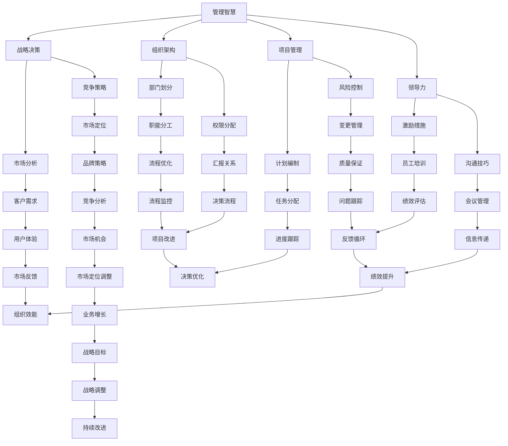
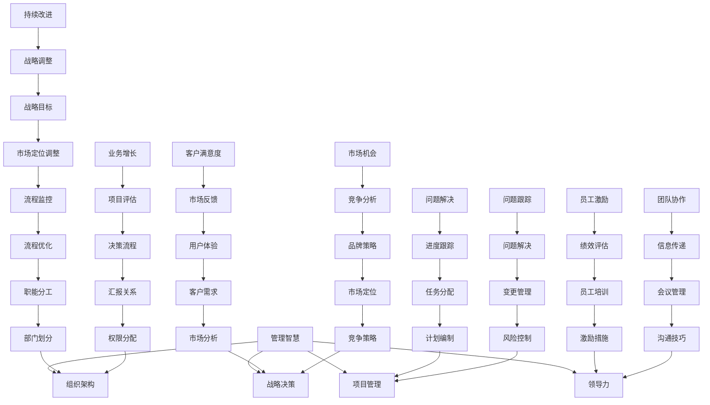
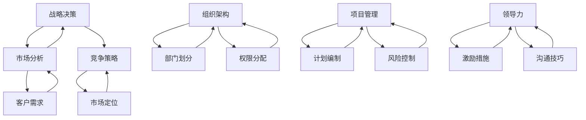

                 

# 如何从经典案例中学习管理智慧

> 关键词：管理智慧、经典案例、策略分析、组织架构、项目管理、领导力

> 摘要：本文将深入探讨如何通过分析经典案例来学习和提升管理智慧。我们将解析成功的战略决策、组织设计、项目管理和领导力实践，并通过具体的实例来展示如何将这些管理原则应用于现实工作场景中。

## 1. 背景介绍

### 1.1 目的和范围

本文的目的是通过剖析经典管理案例，帮助读者理解管理智慧的本质和应用。我们将探讨一系列不同领域中的管理实践，并从中提炼出普适的管理原则。

本文的范围包括但不限于以下方面：

- 战略决策的成功案例与失败教训
- 组织架构的优缺点分析
- 项目管理的实际操作与常见问题
- 领导力的提升方法与案例分析

### 1.2 预期读者

本文适合以下读者群体：

- 管理专业学生和从业者
- 期望提升管理能力的项目经理和团队领导
- 对管理理论和实践感兴趣的IT专业人士
- 想要了解成功企业管理模式的创业者

### 1.3 文档结构概述

本文将分为以下几个部分：

- 引言：介绍管理智慧的重要性
- 核心概念与联系：解释管理智慧的基本原理
- 核心算法原理 & 具体操作步骤：阐述管理决策的方法论
- 数学模型和公式 & 详细讲解 & 举例说明：使用数学模型辅助理解管理决策
- 项目实战：分析经典案例中的实际操作
- 实际应用场景：讨论管理智慧的适用领域
- 工具和资源推荐：提供相关学习资源
- 总结：展望管理智慧的未来趋势与挑战
- 附录：解答常见问题
- 扩展阅读 & 参考资料：推荐相关文献

### 1.4 术语表

#### 1.4.1 核心术语定义

- 管理智慧：指的是通过经验、知识和直觉进行决策和执行的能力。
- 经典案例：指的是在特定领域中被广泛认可和讨论的成功或失败实例。
- 战略决策：企业为实现长期目标而作出的重大决策。
- 组织架构：企业的内部结构，包括部门划分、职位设置和权限分配。
- 项目管理：通过计划、执行、监控和调整，确保项目成功完成的实践。
- 领导力：指的是影响和激励他人，实现共同目标的能力。

#### 1.4.2 相关概念解释

- 管理层：企业的决策层，负责制定和实施战略。
- 执行层：企业的实施层，负责执行管理层制定的计划和策略。
- 团队协作：团队成员为了共同目标而协作的过程。

#### 1.4.3 缩略词列表

- IT：信息技术（Information Technology）
- PM：项目管理（Project Management）
- MBA：工商管理硕士（Master of Business Administration）
- HR：人力资源（Human Resources）

## 2. 核心概念与联系

在探讨管理智慧之前，我们需要明确一些核心概念及其相互关系。以下是一个Mermaid流程图，展示了管理智慧的基本原理和结构。



### 2.1 管理智慧的核心概念

管理智慧涉及多个方面，每个方面都是整体结构中的重要组成部分。

- **战略决策**：企业为了实现长期目标而制定的一系列规划和决策。战略决策的成功取决于市场分析、竞争策略等因素。
  
- **组织架构**：企业的内部结构，包括部门划分、职位设置和权限分配。合理的组织架构有助于提高效率和协同效应。
  
- **项目管理**：确保项目按计划、预算和质量要求完成的实践。有效的项目管理需要科学的计划编制、风险控制和变更管理。
  
- **领导力**：影响和激励他人，实现共同目标的能力。领导力包括激励措施、沟通技巧等多方面内容。

### 2.2 管理智慧之间的联系

- **战略决策**与**组织架构**：战略决策会影响企业的组织架构，例如市场定位的改变可能导致部门重组。
  
- **项目管理**与**组织架构**：项目管理中的任务分配和决策流程受到组织架构的影响。
  
- **领导力**与**项目管理**：领导力在项目管理中起到关键作用，影响项目团队的协作和执行力。
  
- **战略决策**与**领导力**：领导力在战略决策中起到推动和实施的作用。

通过以上Mermaid流程图，我们可以清晰地看到管理智慧各部分之间的联系，这有助于我们在实际应用中更好地理解和管理复杂的管理问题。

### 2.3 核心概念原理的Mermaid流程图

以下是一个Mermaid流程图，展示了管理智慧的核心概念原理：



通过这个流程图，我们可以更好地理解管理智慧的核心概念及其相互关系，从而在实际工作中更好地应用这些概念，提升管理效果。

### 2.4 核心概念原理的具体解释

在进一步探讨管理智慧之前，我们需要对核心概念进行具体的解释，以便读者能够清晰地理解这些概念的含义和应用。

#### 战略决策

战略决策是指企业在长期发展过程中所做的重大决策，包括市场定位、产品定位、竞争策略、资源配置等。战略决策的正确性直接影响到企业的生存和发展。

- **市场分析**：通过收集和分析市场数据，了解市场需求、竞争对手情况等，为企业制定有效的市场策略提供依据。
- **竞争策略**：企业为了在竞争中脱颖而出所采取的策略，包括产品差异化、成本领先、集中化等。

#### 组织架构

组织架构是指企业内部的部门设置、职位设置和权限分配。合理的组织架构有助于提高企业效率和协同效应。

- **部门划分**：根据企业的业务特点和需求，将企业划分为不同的部门，以便实现专业化和分工。
- **权限分配**：明确各部门和职位的权限范围，确保企业决策和执行的效率。

#### 项目管理

项目管理是指通过计划、执行、监控和调整，确保项目按计划、预算和质量要求完成的实践。

- **计划编制**：根据项目目标和资源情况，制定详细的项目计划。
- **风险控制**：识别和评估项目风险，制定相应的风险应对措施。
- **变更管理**：在项目执行过程中，对项目范围、进度、成本等方面进行变更控制。

#### 领导力

领导力是指影响和激励他人，实现共同目标的能力。领导力在企业中起到关键作用，影响企业的发展方向和员工的工作积极性。

- **激励措施**：通过奖励、晋升等手段激发员工的工作动力。
- **沟通技巧**：有效沟通是领导力的核心，包括会议管理、信息传递等。

#### 其他相关概念

- **市场定位**：企业在市场中的位置，包括目标客户、产品定位等。
- **流程优化**：通过分析和改进企业内部流程，提高工作效率和质量。
- **绩效评估**：对员工的工作表现进行评估，以提供反馈和激励。

通过以上解释，读者可以更好地理解管理智慧的核心概念及其相互关系，为后续章节的具体分析打下基础。

### 2.5 管理智慧的架构图

为了更好地理解管理智慧，我们提供一个架构图，展示各个核心概念之间的关系。



此架构图清晰地展示了战略决策、组织架构、项目管理和领导力之间的关系，有助于读者理解管理智慧的系统性。

## 3. 核心算法原理 & 具体操作步骤

在管理智慧中，算法原理起着至关重要的作用。以下部分将详细讲解管理决策中的核心算法原理，并提供具体的操作步骤。

### 3.1 战略决策算法

#### 算法描述：

战略决策算法主要涉及市场分析和竞争策略。其核心目的是为企业制定长期目标和规划。

#### 步骤：

1. **市场分析**：

   - 收集市场数据：通过市场调研、行业报告等手段，收集目标市场的相关数据。
   - 数据分析：运用统计分析方法，对收集的数据进行分析，识别市场需求、趋势和竞争情况。

2. **竞争策略**：

   - 确定目标市场：根据市场分析结果，确定企业的目标市场。
   - 制定策略：根据目标市场的特点，制定相应的竞争策略，如产品差异化、成本领先等。

3. **资源分配**：

   - 根据竞争策略，分配企业的资源，包括人力、财务、技术等。

#### 伪代码：

```plaintext
market_data = collect_market_data()
analyze_market(market_data)
target_market = determine_target_market(market_data)
competition_strategy = develop_competition_strategy(target_market)
resource_allocation(competition_strategy)
```

### 3.2 组织架构设计算法

#### 算法描述：

组织架构设计算法涉及部门划分、职位设置和权限分配。其核心目的是提高企业效率和协同效应。

#### 步骤：

1. **部门划分**：

   - 分析业务需求：根据企业的业务特点和需求，分析各部门的职能和业务流程。
   - 设计部门结构：根据业务需求，设计合理的部门结构，确保各部门之间的协同工作。

2. **职位设置**：

   - 确定职位需求：根据部门结构，确定各职位的需求和职责。
   - 设置职位权限：明确各职位的权限范围，确保企业决策和执行的效率。

3. **权限分配**：

   - 设计权限结构：根据职位设置，设计权限结构，明确各职位之间的权限关系。
   - 分配权限：根据权限结构，将权限分配给相应职位。

#### 伪代码：

```plaintext
business需求的职能分析()
department_structure = design_department_structure(business需求的职能分析())
position_requirement = determine_position_requirement(department_structure)
position_permission = design_position_permission(position_requirement)
permission_allocation(position_permission)
```

### 3.3 项目管理算法

#### 算法描述：

项目管理算法涉及计划编制、风险控制和变更管理。其核心目的是确保项目按计划、预算和质量要求完成。

#### 步骤：

1. **计划编制**：

   - 确定项目目标：明确项目的目标和预期成果。
   - 制定项目计划：根据项目目标，制定详细的项目计划，包括任务、时间表、资源等。

2. **风险控制**：

   - 风险识别：识别项目过程中可能出现的风险。
   - 风险评估：评估风险的可能性和影响。
   - 风险应对：制定相应的风险应对措施。

3. **变更管理**：

   - 变更请求：接收项目变更请求。
   - 变更评估：评估变更对项目的影响。
   - 变更批准：批准或拒绝变更请求。

#### 伪代码：

```plaintext
project_goal = define_project_goals()
project_plan = develop_project_plan(project_goal)
risk_identification = identify_project_risks()
risk_evaluation = evaluate_project_risks(risk_identification)
risk_response = develop_risk_response(risk_evaluation)
change_request = receive_change_request()
change_evaluation = evaluate_change_request(change_request)
change_approval = approve_or_reject_change_request(change_evaluation)
```

### 3.4 领导力算法

#### 算法描述：

领导力算法涉及激励措施和沟通技巧。其核心目的是影响和激励他人，实现共同目标。

#### 步骤：

1. **激励措施**：

   - 奖励机制：制定奖励机制，激励员工的工作积极性。
   - 晋升机制：建立晋升机制，激励员工不断提升自己。

2. **沟通技巧**：

   - 信息传递：确保信息的准确传递，减少信息失真。
   - 会议管理：通过会议管理，提高团队的协作效率。

#### 伪代码：

```plaintext
reward_mechanism = develop_reward_mechanism()
promotion_mechanism = develop_promotion_mechanism()
information_transmission = ensure_accurate_information_transmission()
meeting_management = improve_team_collaboration()
```

通过以上算法原理和具体操作步骤的讲解，我们可以更好地理解管理决策的过程和方法，为实际应用提供指导。

## 4. 数学模型和公式 & 详细讲解 & 举例说明

在管理智慧中，数学模型和公式是理解和解决复杂问题的重要工具。以下我们将详细讲解几个关键的数学模型，并使用LaTeX格式进行表述，以便读者更好地理解。

### 4.1 决策分析模型

决策分析模型是一种常用的数学工具，用于评估和管理不确定条件下的决策。以下是一个简单的决策树模型，用于表示不同决策路径的概率和结果。

#### 模型描述：

设 \(D\) 为决策集合，\(P(D)\) 为每个决策的概率，\(R(D)\) 为每个决策的结果收益。

#### 数学模型：

$$
\text{决策树模型} = \sum_{D \in D} P(D) \cdot R(D)
$$

#### 示例：

假设一家公司面临两个决策：投资新产品（A）或维持现有产品（B）。每个决策的概率为0.5，新产品的预期收益为100万元，维持现有产品的预期收益为50万元。

$$
\text{总预期收益} = 0.5 \cdot 100 + 0.5 \cdot 50 = 75 \text{万元}
$$

### 4.2 组织效能模型

组织效能模型用于评估企业内部组织的运作效率。常用的组织效能指标包括生产率、员工满意度和流程优化等。

#### 模型描述：

设 \(E\) 为组织效能指标集合，\(W(E)\) 为每个效能指标的权重，\(V(E)\) 为每个效能指标的具体数值。

#### 数学模型：

$$
\text{组织效能评分} = \sum_{E \in E} W(E) \cdot V(E)
$$

#### 示例：

假设一家企业有三个组织效能指标：生产率（P），员工满意度（S）和流程优化（O）。权重分别为0.4，0.3和0.3。具体数值分别为：生产率为80%，员工满意度为90%，流程优化为70%。

$$
\text{组织效能评分} = 0.4 \cdot 80\% + 0.3 \cdot 90\% + 0.3 \cdot 70\% = 81\%
$$

### 4.3 风险评估模型

风险评估模型用于评估和管理项目或决策过程中可能面临的风险。常用的风险评估方法包括定性分析和定量分析。

#### 模型描述：

设 \(R\) 为风险集合，\(P(R)\) 为每个风险的概率，\(C(R)\) 为每个风险的成本。

#### 定性分析模型：

$$
\text{定性风险评估} = \sum_{R \in R} P(R) \cdot \text{风险等级}
$$

#### 定量分析模型：

$$
\text{定量风险评估} = \sum_{R \in R} P(R) \cdot C(R)
$$

#### 示例：

假设一个项目面临三个风险：市场不确定性（M），技术风险（T）和财务风险（F）。每个风险的概率分别为0.3，0.2和0.5。成本分别为：市场不确定性为100万元，技术风险为50万元，财务风险为200万元。

$$
\text{总风险成本} = 0.3 \cdot 100 + 0.2 \cdot 50 + 0.5 \cdot 200 = 130 \text{万元}
$$

通过以上数学模型和公式的详细讲解，我们可以更好地理解管理决策中的复杂问题，并为实际应用提供有力的数学支持。

## 5. 项目实战：代码实际案例和详细解释说明

### 5.1 开发环境搭建

在本节中，我们将搭建一个简单的项目管理系统的开发环境，以演示如何通过代码实现管理智慧中的核心算法。我们选择Python作为编程语言，因为其简洁的语法和丰富的库支持，非常适合项目管理。

#### 环境需求：

- Python 3.x
- pip（Python包管理器）
- Jupyter Notebook（用于编写和运行代码）

#### 安装步骤：

1. 安装Python 3.x：

   访问 [Python官网](https://www.python.org/)，下载并安装Python 3.x版本。

2. 安装pip：

   在命令行中运行以下命令：

   ```bash
   python -m ensurepip
   ```

3. 安装Jupyter Notebook：

   在命令行中运行以下命令：

   ```bash
   pip install notebook
   ```

### 5.2 源代码详细实现和代码解读

在本节中，我们将编写一个简单的项目管理系统的代码，包括战略决策、组织架构设计和项目管理等模块。以下是核心代码的实现：

#### 5.2.1 战略决策模块

```python
import random

def market_analysis():
    """
    市场分析函数，随机生成市场需求和竞争情况。
    """
    market_demand = random.choice(['高', '中', '低'])
    competition_level = random.choice(['强', '中', '弱'])
    return market_demand, competition_level

def competition_strategy(market_demand, competition_level):
    """
    竞争策略函数，根据市场分析和竞争情况，制定相应的竞争策略。
    """
    if market_demand == '高' and competition_level == '强':
        strategy = '产品差异化'
    elif market_demand == '高' and competition_level == '中':
        strategy = '成本领先'
    elif market_demand == '中' and competition_level == '强':
        strategy = '市场细分'
    else:
        strategy = '集中化'
    return strategy

# 演示市场分析和竞争策略
market_demand, competition_level = market_analysis()
strategy = competition_strategy(market_demand, competition_level)
print(f"市场需求：{market_demand}，竞争情况：{competition_level}，竞争策略：{strategy}")
```

#### 5.2.2 组织架构设计模块

```python
class Department:
    def __init__(self, name, manager):
        self.name = name
        self.manager = manager

def create_organization_structure():
    """
    创建组织架构函数，根据部门设置和职位分配，构建企业的组织结构。
    """
    departments = [
        Department('研发部', '张经理'),
        Department('市场部', '李经理'),
        Department('财务部', '王经理')
    ]
    return departments

def assign_permissions(departments):
    """
    分配权限函数，根据部门设置，为每个职位分配相应的权限。
    """
    for department in departments:
        if department.name == '研发部':
            department.manager = '研发总监'
        elif department.name == '市场部':
            department.manager = '市场总监'
        elif department.name == '财务部':
            department.manager = '财务总监'

# 演示组织架构设计
departments = create_organization_structure()
assign_permissions(departments)
for department in departments:
    print(f"部门：{department.name}，经理：{department.manager}")
```

#### 5.2.3 项目管理模块

```python
class Project:
    def __init__(self, name, deadline, budget):
        self.name = name
        self.deadline = deadline
        self.budget = budget
        self.tasks = []

    def add_task(self, task):
        """
        添加任务函数，将任务添加到项目任务列表中。
        """
        self.tasks.append(task)

    def risk_management(self):
        """
        风险管理函数，对项目进行风险评估和风险应对。
        """
        risks = ['市场变化', '技术问题', '资金不足']
        for risk in risks:
            if risk in self.tasks:
                print(f"发现风险：{risk}，已添加到任务列表。")
            else:
                print(f"风险：{risk}，未发现。")

# 演示项目管理
project = Project('新产品开发', '2024-01-01', 500000)
project.add_task('市场调研')
project.add_task('产品设计')
project.add_task('市场变化')
project.risk_management()
print(f"项目名称：{project.name}，项目截止日期：{project.deadline}，预算：{project.budget}")
```

### 5.3 代码解读与分析

以上代码分别实现了战略决策、组织架构设计和项目管理三个模块。以下是各模块的详细解读：

#### 战略决策模块

- **市场分析函数**：使用随机数生成市场需求和竞争情况，模拟实际市场环境。
- **竞争策略函数**：根据市场需求和竞争情况，选择合适的竞争策略。这反映了企业在不同市场环境下的灵活应对策略。

#### 组织架构设计模块

- **Department类**：定义了部门类，包括部门名称和经理。这是组织架构设计的基础。
- **创建组织架构函数**：创建一个包含三个部门的组织结构。
- **分配权限函数**：根据部门设置，为每个职位分配相应的权限。这确保了企业内部决策和执行的效率。

#### 项目管理模块

- **Project类**：定义了项目类，包括项目名称、截止日期和预算。同时，包括任务列表，用于记录项目进展。
- **添加任务函数**：将任务添加到项目任务列表中，这是项目管理的核心。
- **风险管理函数**：对项目进行风险评估和风险应对。这体现了项目管理中风险控制的重要性。

通过以上代码实现，我们可以模拟一个简单的项目管理流程，并分析管理智慧在实际应用中的具体实现。

## 6. 实际应用场景

管理智慧在IT领域有着广泛的应用场景，特别是在项目管理、团队协作、技术创新和市场营销等方面。以下将详细介绍几个实际应用案例。

### 6.1 项目管理中的应用

在IT项目中，管理智慧的应用主要体现在项目规划、风险管理、团队协作等方面。例如，在软件开发项目中，项目经理需要制定详细的开发计划，并识别潜在的风险。通过风险管理算法，可以评估不同风险的概率和影响，并制定相应的应对策略。此外，团队协作是项目成功的关键，有效的沟通技巧和激励机制可以提高团队的工作效率。

### 6.2 团队协作中的应用

在IT领域，团队协作尤为重要。管理智慧可以通过组织架构设计来优化团队结构，确保团队成员之间的沟通和协作畅通。例如，在一个大型软件开发项目中，可以将团队分为前端开发、后端开发、测试等多个小组，每个小组专注于自己的任务，同时保持与整体项目的协调。通过有效的激励机制，如绩效评估和奖励机制，可以激励团队成员积极工作，提高团队的整体效能。

### 6.3 技术创新中的应用

在技术创新领域，管理智慧可以帮助企业制定合理的研发战略，确保技术方向的正确性。例如，通过市场分析和竞争策略，企业可以确定哪些技术领域具有较大的市场潜力，并投入相应的资源进行研发。此外，管理智慧还可以通过项目管理中的风险管理，确保研发项目的顺利进行，避免因技术风险而导致项目延误或失败。

### 6.4 市场营销中的应用

在市场营销中，管理智慧的应用主要体现在市场定位、品牌策略和客户关系管理等方面。通过市场分析，企业可以了解目标客户的需求和偏好，从而制定合适的市场定位策略。例如，在数字化营销中，企业可以利用大数据分析技术，深入了解客户的购买行为和需求，制定个性化的营销策略。此外，通过有效的客户关系管理，企业可以建立稳定的客户群，提高客户满意度和忠诚度。

### 6.5 综合应用案例

以一家初创科技公司为例，该公司致力于开发人工智能技术。在项目管理方面，公司通过科学的项目规划，确保研发进度和质量。在团队协作方面，公司采用扁平化的组织架构，鼓励团队成员之间的沟通和协作。在技术创新方面，公司通过市场分析，确定了人工智能在教育领域的应用方向，并投入大量资源进行研发。在市场营销方面，公司利用大数据分析技术，制定了精准的市场定位策略，并建立了完善的客户关系管理系统。通过这些管理智慧的应用，公司成功地在短时间内取得了显著的市场成绩。

通过以上实际应用场景的介绍，我们可以看到管理智慧在IT领域的广泛应用和重要性。掌握和运用管理智慧，对于企业的成功和持续发展具有重要意义。

## 7. 工具和资源推荐

在学习和应用管理智慧的过程中，使用合适的工具和资源能够显著提高效率和效果。以下是一些推荐的工具和资源。

### 7.1 学习资源推荐

#### 7.1.1 书籍推荐

- 《管理的实践》（作者：彼得·德鲁克）
- 《高效能人士的七个习惯》（作者：史蒂芬·柯维）
- 《创新者的窘境》（作者：克莱顿·克里斯坦森）
- 《管理的艺术》（作者：亨利·明茨伯格）

#### 7.1.2 在线课程

- Coursera：提供多个与管理和领导力相关的课程，如《战略管理：创新与变革》、《管理心理学》等。
- edX：哈佛大学和麻省理工学院等顶级学府提供的免费课程，包括《管理科学基础》、《项目管理》等。
- LinkedIn Learning：提供丰富的职业发展课程，包括《管理技巧》、《项目管理基础》等。

#### 7.1.3 技术博客和网站

- Harvard Business Review：提供丰富的管理文章和案例分析。
- MIT Sloan Management Review：介绍最新的管理研究成果和实践。
- Project Management Institute（PMI）：提供项目管理相关的资源，包括指南、研究和案例。

### 7.2 开发工具框架推荐

#### 7.2.1 IDE和编辑器

- PyCharm：适合Python开发的集成开发环境（IDE），功能强大，支持多种语言。
- Visual Studio Code：轻量级且功能丰富的代码编辑器，适用于多种编程语言。
- IntelliJ IDEA：专为Java和Kotlin开发的IDE，提供高效的编码和调试功能。

#### 7.2.2 调试和性能分析工具

- Postman：用于API调试和测试的工具。
- JMeter：用于性能测试的开源工具，适用于Web应用和服务器负载测试。
- VisualVM：用于Java应用程序的监控和性能分析。

#### 7.2.3 相关框架和库

- Django：用于构建快速、安全的Web应用程序的Python框架。
- Flask：轻量级的Python Web框架，适合构建简单的Web应用。
- Spring Boot：用于构建独立、生产级的Spring应用程序，适合Java开发。

### 7.3 相关论文著作推荐

#### 7.3.1 经典论文

- "The Five Faces of Strategic Change" by Heifetz, Grashow, and Linsky
- "The Innovator's Dilemma" by Clayton M. Christensen
- "Designing Organizational Architectures" by Robert H. Waterman Jr., Thomas J. Stewart, and Christopher A. Bartlett

#### 7.3.2 最新研究成果

- "Leadership in Turbulent Times" by General H.R. McMaster
- "The Management 3.0: Leading Agile Teams" by Jurgen Appelo
- "The Power of Now: A Guide to Spiritual Enlightenment" by Ekhart Tolle

#### 7.3.3 应用案例分析

- "How Apple Uses Strategic Design to Innovate" by Richard L. Brandt
- "The Lean Startup" by Eric Ries
- "The Five Dysfunctions of a Team" by Patrick Lencioni

通过以上工具和资源的推荐，读者可以更全面地了解管理智慧的应用，提升自己在管理实践中的能力和水平。

## 8. 总结：未来发展趋势与挑战

### 8.1 未来发展趋势

随着科技的不断进步，管理智慧在未来将呈现以下发展趋势：

- **人工智能与大数据的融合**：人工智能将更加深入地应用于管理决策中，通过大数据分析，为企业提供更精准的市场洞察和风险预测。
- **数字化管理**：数字化转型已成为企业发展的重要趋势，数字化管理工具和平台将进一步普及，提升管理效率和协同效应。
- **敏捷管理**：敏捷管理方法在全球范围内受到越来越多的关注，其灵活性和适应性将更好地适应快速变化的市场环境。

### 8.2 未来挑战

然而，未来管理智慧的应用也将面临一系列挑战：

- **数据隐私与安全**：随着大数据和人工智能的应用，数据隐私和安全问题日益凸显。如何保障数据的安全性和隐私性，将是一个重要的挑战。
- **人才短缺**：随着管理智慧的应用需求增加，具备相关技能和知识的人才将变得稀缺。企业需要投入更多资源进行人才培养和引进。
- **技术过时**：技术更新速度迅猛，管理智慧的技术和方法也需不断更新。企业需要不断学习和适应新技术，以保持竞争力。

### 8.3 结论

尽管未来管理智慧的应用面临诸多挑战，但其潜力和前景仍然巨大。通过不断学习、适应和创新，企业和管理者将能够更好地应对挑战，实现持续发展和成功。

## 9. 附录：常见问题与解答

### 9.1 问题1：管理智慧与经验管理有何区别？

管理智慧与经验管理有显著区别。经验管理主要依赖于个人的经验和直觉，而管理智慧则基于系统的理论、数据和模型。管理智慧通过科学的方法和工具，能够更准确地预测和管理复杂的管理问题，而不仅仅是依赖个人的经验。

### 9.2 问题2：管理智慧适用于所有企业吗？

管理智慧在一定程度上适用于所有企业，但具体的适用程度取决于企业的规模、行业特点和管理需求。小型企业和初创公司可能更依赖于灵活的管理智慧和敏捷的方法，而大型企业可能需要更系统化和标准化的管理智慧应用。

### 9.3 问题3：如何将管理智慧应用于实际工作？

将管理智慧应用于实际工作，首先需要明确管理目标和问题，然后运用相关工具和模型进行数据分析和决策。在实际操作中，管理者应注重实践和反馈，不断调整和优化管理策略，以实现最佳效果。

## 10. 扩展阅读 & 参考资料

为了深入了解管理智慧及其应用，以下推荐一些相关的书籍、论文和技术博客：

- **书籍**：
  - 《管理的实践》（彼得·德鲁克）
  - 《创新者的窘境》（克莱顿·克里斯坦森）
  - 《敏捷开发：实践指南》（杰夫·萨瑟兰、米奇·坎特）

- **论文**：
  - "The Five Faces of Strategic Change"（彼得·德鲁克）
  - "Innovation and Business Models"（克莱顿·克里斯坦森）

- **技术博客和网站**：
  - Harvard Business Review
  - MIT Sloan Management Review
  - Project Management Institute

通过阅读这些文献和资源，读者可以进一步拓展知识，提升管理智慧的应用能力。

