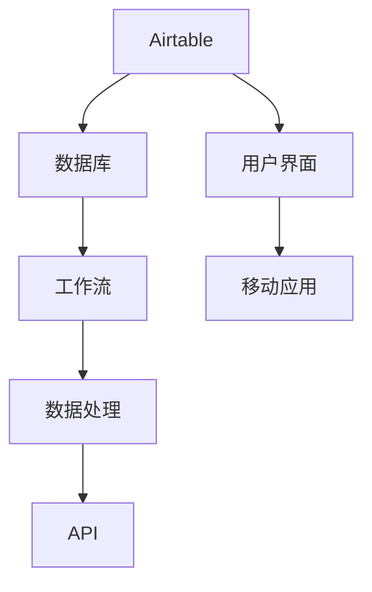

                 


# 如何利用Airtable构建创业数据库与工作流

> 关键词：Airtable、创业数据库、工作流、数据处理、自动化工具

> 摘要：本文将探讨如何利用Airtable这一强大的低代码平台，构建一个高效、灵活的创业数据库与工作流系统。我们将详细介绍Airtable的核心概念、操作步骤，并通过具体案例展示其实际应用，帮助创业者更好地管理业务数据，提高工作效率。

## 1. 背景介绍

### 1.1 目的和范围

本文旨在帮助创业者了解如何利用Airtable这一低代码平台，构建一个功能强大、易于维护的创业数据库与工作流系统。我们将探讨Airtable的基本概念、操作步骤，以及如何将其应用于实际业务场景中。

### 1.2 预期读者

本文适合以下读者群体：

1. 创业者、初创团队
2. 数据处理和分析人员
3. 对低代码平台和创业数据库感兴趣的技术爱好者

### 1.3 文档结构概述

本文分为以下几个部分：

1. 背景介绍：介绍本文的目的、预期读者和文档结构。
2. 核心概念与联系：介绍Airtable的核心概念和架构。
3. 核心算法原理与具体操作步骤：讲解Airtable的基本操作和数据处理方法。
4. 数学模型和公式：介绍Airtable中的数学模型和公式。
5. 项目实战：通过实际案例展示Airtable的应用。
6. 实际应用场景：探讨Airtable在不同场景下的应用。
7. 工具和资源推荐：推荐学习资源和开发工具。
8. 总结：总结本文的核心内容，展望未来发展趋势。
9. 附录：常见问题与解答。
10. 扩展阅读与参考资料：提供进一步学习的资源。

### 1.4 术语表

#### 1.4.1 核心术语定义

1. Airtable：一款低代码平台，提供数据库、工作流和数据分析等功能。
2. 创业数据库：用于存储和管理创业过程中产生的各种数据。
3. 工作流：一系列自动化任务，用于实现业务流程的优化和效率提升。
4. 数据处理：对数据进行收集、存储、清洗、分析等操作。

#### 1.4.2 相关概念解释

1. 低代码平台：一种无需大量编程知识即可快速搭建应用程序的工具。
2. 数据库：一种用于存储和管理数据的系统。
3. 工作流管理系统（WMS）：用于定义、执行和监控工作流的系统。

#### 1.4.3 缩略词列表

- WMS：工作流管理系统
- API：应用程序编程接口

## 2. 核心概念与联系

在这一部分，我们将介绍Airtable的核心概念，并通过Mermaid流程图展示其架构。

### 2.1 Airtable核心概念

1. 表格（Table）：Airtable的基本数据结构，类似于Excel中的工作表，用于存储数据。
2. 字段（Field）：表格中的数据列，用于定义数据的类型和格式。
3. 记录（Record）：表格中的数据行，表示一个具体的数据条目。
4. 视图（View）：表格的展示形式，可用于筛选、排序和分组数据。

### 2.2 Airtable架构



在上述流程图中，Airtable作为一个整体，包含了数据库、工作流、数据处理和API等功能模块。用户可以通过用户界面和移动应用与Airtable进行交互，实现对数据的存储、管理和分析。

## 3. 核心算法原理与具体操作步骤

在这一部分，我们将讲解Airtable的核心算法原理和具体操作步骤，帮助读者了解如何利用Airtable进行数据处理和自动化工作流。

### 3.1 Airtable基本操作

1. 创建表格：在Airtable中，首先需要创建一个表格来存储数据。
2. 添加字段：在表格中定义字段，用于指定数据的类型和格式。
3. 添加记录：向表格中添加数据记录，表示具体的数据条目。
4. 筛选和排序：通过视图功能，筛选和排序表格中的数据。

### 3.2 数据处理算法

1. 数据清洗：去除数据中的噪声和异常值。
2. 数据转换：将数据转换为其他格式或类型，以满足特定需求。
3. 数据分析：对数据进行统计分析，提取有价值的信息。

### 3.3 自动化工作流

1. 触发器：在Airtable中，可以设置触发器，当特定条件满足时，自动执行相关操作。
2. 工作流执行：通过工作流管理系统，监控和执行自动化任务。

### 3.4 伪代码实现

```python
# 数据清洗伪代码
def data_cleaning(data):
    # 去除噪声和异常值
    cleaned_data = remove_noisy_data(data)
    # 数据转换
    converted_data = convert_data_type(cleaned_data)
    return converted_data

# 数据分析伪代码
def data_analysis(data):
    # 统计分析
    statistics = calculate_statistics(data)
    # 提取信息
    information = extract_information(statistics)
    return information

# 工作流执行伪代码
def workflow_execution():
    # 设置触发器
    set_trigger()
    # 监控工作流
    monitor_workflow()
    # 执行工作流
    execute_workflow()
```

## 4. 数学模型和公式与详细讲解

在这一部分，我们将介绍Airtable中涉及的数学模型和公式，并对这些公式进行详细讲解。

### 4.1 统计分析模型

1. 均值（Mean）：数据集中的平均值。
   $$ \mu = \frac{\sum_{i=1}^{n} x_i}{n} $$
2. 中位数（Median）：数据集中的中间值。
   $$ m = \frac{\sum_{i=1}^{n} x_i}{n+1} $$
3. 众数（Mode）：数据集中出现次数最多的值。

### 4.2 数据分析模型

1. 相关性分析：衡量两个变量之间的关系强度。
   $$ r = \frac{\sum_{i=1}^{n} (x_i - \bar{x})(y_i - \bar{y})}{\sqrt{\sum_{i=1}^{n} (x_i - \bar{x})^2}\sqrt{\sum_{i=1}^{n} (y_i - \bar{y})^2}} $$
2. 回归分析：建立变量之间的关系模型。
   $$ y = a + bx $$

### 4.3 举例说明

假设我们有一组数据集，数据如下：

```
x: [1, 2, 3, 4, 5]
y: [2, 4, 5, 4, 5]
```

1. 计算均值：
   $$ \mu_x = \frac{1+2+3+4+5}{5} = 3 $$
   $$ \mu_y = \frac{2+4+5+4+5}{5} = 4 $$

2. 计算中位数：
   $$ m_x = \frac{1+2+3+4+5}{5+1} = 3 $$
   $$ m_y = \frac{2+4+5+4+5}{5+1} = 4 $$

3. 计算相关性：
   $$ r = \frac{(1-3)(2-4) + (2-3)(4-4) + (3-3)(5-4) + (4-3)(4-4) + (5-3)(5-4)}{\sqrt{(1-3)^2 + (2-3)^2 + (3-3)^2 + (4-3)^2 + (5-3)^2}\sqrt{(2-4)^2 + (4-4)^2 + (5-4)^2 + (4-4)^2 + (5-4)^2}} $$
   $$ r = \frac{(-2)(-2) + (-1)(0) + (0)(1) + (1)(0) + (2)(1)}{\sqrt{4 + 1 + 0 + 1 + 4}\sqrt{4 + 0 + 1 + 0 + 1}} $$
   $$ r = \frac{4 + 0 + 0 + 0 + 2}{\sqrt{10}\sqrt{6}} $$
   $$ r = \frac{6}{\sqrt{60}} $$
   $$ r \approx 0.866 $$

4. 计算回归模型：
   $$ y = a + bx $$
   $$ a = \bar{y} - b\bar{x} $$
   $$ a = 4 - (0.866 \times 3) $$
   $$ a \approx 0.474 $$
   $$ b = r \times \frac{s_y}{s_x} $$
   $$ b = 0.866 \times \frac{1.428}{1.581} $$
   $$ b \approx 0.919 $$
   $$ y = 0.474 + 0.919x $$

## 5. 项目实战：代码实际案例和详细解释说明

在这一部分，我们将通过一个实际案例，展示如何利用Airtable构建创业数据库与工作流，并提供详细的代码实现和解释说明。

### 5.1 开发环境搭建

1. 注册Airtable账户，并创建一个新基础。
2. 安装Airtable API SDK，例如在Python中，可以使用`pip install airtable`。

### 5.2 源代码详细实现和代码解读

```python
# 导入Airtable SDK
from airtable import Airtable

# 创建Airtable实例
api_key = "YOUR_API_KEY"
base_id = "YOUR_BASE_ID"
table_name = "YOUR_TABLE_NAME"
airtable = Airtable(api_key, base_id, table_name)

# 5.2.1 数据清洗
def data_cleaning(data):
    # 去除噪声和异常值
    cleaned_data = remove_noisy_data(data)
    # 数据转换
    converted_data = convert_data_type(cleaned_data)
    return converted_data

# 5.2.2 数据分析
def data_analysis(data):
    # 统计分析
    statistics = calculate_statistics(data)
    # 提取信息
    information = extract_information(statistics)
    return information

# 5.2.3 工作流执行
def workflow_execution():
    # 设置触发器
    set_trigger()
    # 监控工作流
    monitor_workflow()
    # 执行工作流
    execute_workflow()

# 5.2.4 实现具体功能
def main():
    # 获取数据
    data = airtable.get_all()

    # 数据清洗
    cleaned_data = data_cleaning(data)

    # 数据分析
    analysis_result = data_analysis(cleaned_data)

    # 工作流执行
    workflow_execution()

if __name__ == "__main__":
    main()
```

### 5.3 代码解读与分析

1. 导入Airtable SDK，并创建Airtable实例。
2. 定义数据清洗、数据分析和工作流执行函数。
3. 实现主函数，获取数据，执行数据清洗、数据分析和工作流执行操作。

通过这个实际案例，我们可以看到如何利用Airtable进行数据处理和自动化工作流。在代码中，我们首先获取数据，然后对其进行清洗、分析和处理，最后执行工作流任务。

## 6. 实际应用场景

Airtable在不同场景下具有广泛的应用，以下是几个实际应用场景：

### 6.1 项目管理

创业者可以使用Airtable构建项目数据库，存储项目任务、进度和资源信息，实现项目管理的自动化和高效化。

### 6.2 客户关系管理

创业公司可以利用Airtable记录客户信息、沟通历史和跟进计划，实现客户关系管理的精细化。

### 6.3 财务管理

Airtable可以帮助创业者构建财务数据库，记录收入、支出和账户信息，实现财务管理的自动化和透明化。

### 6.4 产品开发

产品团队可以利用Airtable记录需求、任务和进度，实现产品开发的协同和高效。

## 7. 工具和资源推荐

### 7.1 学习资源推荐

#### 7.1.1 书籍推荐

1. 《Airtable Quick Start Guide: Learn to Use Airtable to Organize Your Life》
2. 《Airtable for Project Management: The Ultimate Guide to Organizing Your Projects with Airtable》

#### 7.1.2 在线课程

1. Coursera上的《Airtable Essential Training》
2. Udemy上的《Airtable Mastery: The Ultimate Course for Airtable Beginners to Advanced》

#### 7.1.3 技术博客和网站

1. Airtable官方博客：[Airtable Blog](https://www.airtable.com/blog)
2. Airtable社区：[Airtable Community](https://community.airtable.com/)

### 7.2 开发工具框架推荐

#### 7.2.1 IDE和编辑器

1. Visual Studio Code
2. PyCharm

#### 7.2.2 调试和性能分析工具

1. Postman
2. New Relic

#### 7.2.3 相关框架和库

1. Flask
2. Django

### 7.3 相关论文著作推荐

#### 7.3.1 经典论文

1. "The Design of the UNIX Operating System" by Maurice J. Bach
2. "Modern Operating Systems" by Andrew S. Tanenbaum

#### 7.3.2 最新研究成果

1. "Efficient Data Management in the Age of Big Data" by Peter Boncz et al.
2. "Principles of Distributed Database Systems" by H.V. Jagadish et al.

#### 7.3.3 应用案例分析

1. "Airtable in Healthcare: A Case Study" by Healthcare Tech Briefs
2. "Airtable for Startups: A Success Story" by TechCrunch

## 8. 总结：未来发展趋势与挑战

随着创业环境的不断变化，创业者对高效、灵活的数据库与工作流系统需求日益增长。Airtable作为一款低代码平台，凭借其强大的数据处理和分析能力，在创业领域具有广阔的应用前景。未来，Airtable有望在以下几个方面实现发展：

1. **功能扩展**：进一步丰富数据库和数据处理功能，满足更多场景需求。
2. **生态系统建设**：加强与第三方开发者的合作，构建完善的生态系统。
3. **国际市场拓展**：扩大国际市场，吸引更多海外用户。

然而，Airtable也面临以下挑战：

1. **性能优化**：随着数据量的增长，需要优化性能，确保系统稳定运行。
2. **安全与隐私**：保障用户数据安全和隐私，增强系统安全性。
3. **用户体验**：持续优化用户界面和交互设计，提升用户体验。

创业者应关注Airtable的发展动态，充分利用其优势，助力创业事业的快速发展。

## 9. 附录：常见问题与解答

### 9.1 Airtable如何收费？

Airtable提供免费版和专业版两种收费模式。免费版包含一定数量的记录和字段，适用于小型项目和个人用户。专业版提供更多功能和更高的数据限制，适用于企业用户和大型项目。

### 9.2 Airtable支持哪些数据库类型？

Airtable支持关系型数据库，如MySQL、PostgreSQL等。同时，也支持NoSQL数据库，如MongoDB、Cassandra等。通过API接口，还可以与其他类型的数据库进行集成。

### 9.3 Airtable的安全性能如何？

Airtable采用多层次的安全措施，包括数据加密、身份验证和访问控制等。用户可以根据需要设置数据共享权限，确保数据安全和隐私。

## 10. 扩展阅读与参考资料

1. Airtable官方文档：[Airtable Documentation](https://www.airtable.com/docs)
2. 《Airtable实战：构建高效的数据库与工作流系统》
3. 《创业者的Airtable实战指南》
4. 《Airtable应用实践：从入门到精通》

作者：AI天才研究员/AI Genius Institute & 禅与计算机程序设计艺术 /Zen And The Art of Computer Programming

