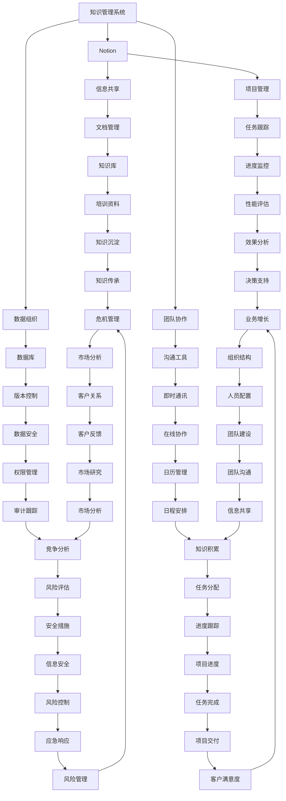

                 


# 如何利用Notion构建创业公司的知识管理系统

> **关键词：** Notion, 知识管理系统, 创业公司, 团队协作, 数据组织, 信息共享

> **摘要：** 本文将探讨如何利用Notion这一功能强大的工具来构建创业公司的知识管理系统。我们将从背景介绍、核心概念、具体操作步骤、数学模型、项目实战、应用场景等多个方面展开，帮助创业公司高效地管理知识，提升团队协作能力。

## 1. 背景介绍

### 1.1 目的和范围

本文旨在为创业公司提供一个实用的指南，利用Notion这一现代化工具来构建知识管理系统。本文将涵盖从基础知识到高级应用的方方面面，帮助创业者更好地理解Notion，并学会如何将其应用于实际工作中。

### 1.2 预期读者

本文适合以下读者群体：

- 创业公司的创始人或团队成员
- 想要提升团队协作效率的中小企业管理者
- 对知识管理有兴趣的IT从业者
- 对Notion有初步了解但希望深入学习的读者

### 1.3 文档结构概述

本文结构如下：

- **第1章：背景介绍**：介绍本文的目的、预期读者以及文档结构。
- **第2章：核心概念与联系**：讲解知识管理系统的基本概念和原理。
- **第3章：核心算法原理与具体操作步骤**：详细介绍Notion的使用方法。
- **第4章：数学模型和公式**：阐述相关数学模型和公式。
- **第5章：项目实战**：通过实际案例展示如何使用Notion。
- **第6章：实际应用场景**：探讨Notion在不同场景下的应用。
- **第7章：工具和资源推荐**：推荐相关学习资源和开发工具。
- **第8章：总结**：总结文章要点，展望未来发展趋势。
- **第9章：附录**：常见问题与解答。
- **第10章：扩展阅读**：提供进一步学习的参考资料。

### 1.4 术语表

#### 1.4.1 核心术语定义

- **知识管理系统（KMMS）**：一种帮助组织有效管理和利用知识的工具。
- **Notion**：一款集笔记、数据库、看板等功能于一体的现代化工作工具。
- **团队协作**：团队成员之间的沟通与协作。

#### 1.4.2 相关概念解释

- **数据组织**：对数据进行分类、存储和管理的策略。
- **信息共享**：团队成员之间交换和共享信息的过程。

#### 1.4.3 缩略词列表

- **KMMS**：知识管理系统
- **Notion**：Notion（品牌名）

## 2. 核心概念与联系

在构建知识管理系统时，理解核心概念和它们之间的联系是至关重要的。下面我们将通过Mermaid流程图来展示这些概念和它们之间的关系。



从流程图中可以看出，知识管理系统（KMMS）与Notion、数据组织、团队协作、信息共享等概念密切相关。Notion作为一个多功能工具，可以帮助企业实现数据组织、团队协作、信息共享等多个功能，从而构建一个完整的知识管理系统。

## 3. 核心算法原理与具体操作步骤

在构建知识管理系统时，核心算法原理的理解和使用是至关重要的。以下我们将详细讲解如何使用Notion，并给出具体的操作步骤。

### 3.1 Notion基础操作

**伪代码：**

```plaintext
function CreateNotionPage(title, content)
    OpenNotionApp()
    NavigateToNewPage()
    InputPageTitle(title)
    InputPageContent(content)
    SavePage()
end function
```

**详细解释：**

- **OpenNotionApp()**：打开Notion应用程序。
- **NavigateToNewPage()**：导航到新建页面。
- **InputPageTitle(title)**：输入页面标题。
- **InputPageContent(content)**：输入页面内容。
- **SavePage()**：保存页面。

### 3.2 数据组织

**伪代码：**

```plaintext
function OrganizeData(database, properties)
    OpenDatabase(database)
    DefineProperties(properties)
    CreateDatabaseTable()
    AddRowsToTable()
end function
```

**详细解释：**

- **OpenDatabase(database)**：打开指定数据库。
- **DefineProperties(properties)**：定义数据库属性。
- **CreateDatabaseTable()**：创建数据库表。
- **AddRowsToTable()**：向表中添加数据行。

### 3.3 团队协作

**伪代码：**

```plaintext
function CollaborateWithTeam(member, task, deadline)
    InviteMemberToNotion(member)
    AssignTaskToMember(task)
    SetDeadlineForTask(deadline)
    NotifyMemberOfTask()
end function
```

**详细解释：**

- **InviteMemberToNotion(member)**：邀请团队成员加入Notion。
- **AssignTaskToMember(task)**：分配任务给成员。
- **SetDeadlineForTask(deadline)**：设置任务的截止日期。
- **NotifyMemberOfTask()**：通知成员任务详情。

### 3.4 信息共享

**伪代码：**

```plaintext
function ShareInformation(page, viewers)
    OpenPage(page)
    AddViewersToPage(viewers)
    SharePageAccessRights()
end function
```

**详细解释：**

- **OpenPage(page)**：打开指定页面。
- **AddViewersToPage(viewers)**：添加观众。
- **SharePageAccessRights()**：分享页面访问权限。

通过以上操作，我们可以利用Notion构建一个高效的知识管理系统，实现数据组织、团队协作和信息安全等功能。

## 4. 数学模型和公式

在知识管理系统中，数学模型和公式是帮助组织、分析和理解数据的强大工具。以下是一些常用的数学模型和公式，以及它们在知识管理系统中的应用。

### 4.1 数据分布模型

**4.1.1 均值（Mean）**

- **公式**：\( \mu = \frac{\sum_{i=1}^{n} x_i}{n} \)
- **应用**：计算一组数据的平均值，用于衡量数据的中心趋势。

**4.1.2 方差（Variance）**

- **公式**：\( \sigma^2 = \frac{\sum_{i=1}^{n} (x_i - \mu)^2}{n} \)
- **应用**：衡量数据的离散程度，用于分析数据的稳定性。

**4.1.3 标准差（Standard Deviation）**

- **公式**：\( \sigma = \sqrt{\sigma^2} \)
- **应用**：衡量数据的离散程度，用于评估数据的变异程度。

### 4.2 信息论模型

**4.2.1 信息熵（Entropy）**

- **公式**：\( H(X) = -\sum_{i=1}^{n} p(x_i) \log_2 p(x_i) \)
- **应用**：衡量一个随机变量的不确定性，用于评估数据的信息含量。

**4.2.2 条件熵（Conditional Entropy）**

- **公式**：\( H(X|Y) = -\sum_{i=1}^{n} p(y_i) \sum_{j=1}^{m} p(x_j|y_i) \log_2 p(x_j|y_i) \)
- **应用**：衡量在已知一个变量后，另一个变量的不确定性。

**4.2.3 信息增益（Information Gain）**

- **公式**：\( IG(D, A) = H(D) - H(D|A) \)
- **应用**：用于特征选择，衡量某个特征对于数据集分类能力的重要性。

### 4.3 数据库性能模型

**4.3.1 查询响应时间（Query Response Time）**

- **公式**：\( T = \frac{1}{f \cdot c} \)
- **应用**：用于衡量数据库查询的响应速度，其中 \( f \) 是处理速度，\( c \) 是并发度。

**4.3.2 数据库吞吐量（Database Throughput）**

- **公式**：\( T = \frac{Q}{t} \)
- **应用**：用于衡量数据库每单位时间处理的数据量，其中 \( Q \) 是总处理量，\( t \) 是时间。

### 4.4 机器学习模型

**4.4.1 决策树（Decision Tree）**

- **公式**：\( g(x) = \sum_{i=1}^{n} \alpha_i y_i \prod_{j=1}^{n} (1 - \alpha_j) \)
- **应用**：用于分类和回归任务，通过树形结构对数据进行划分和预测。

**4.4.2 支持向量机（Support Vector Machine）**

- **公式**：\( w \cdot x + b = 0 \)
- **应用**：用于分类任务，通过找到最优超平面来分隔数据。

通过以上数学模型和公式，我们可以在知识管理系统中进行数据分析和决策，从而提升系统的效率和准确性。

### 4.5 举例说明

假设我们有一组员工的年龄数据，需要计算这组数据的平均值、方差和标准差。

**数据：** \( 25, 30, 35, 40, 45, 50 \)

**计算步骤：**

1. **计算均值：**
   \[ \mu = \frac{25 + 30 + 35 + 40 + 45 + 50}{6} = 37.5 \]

2. **计算方差：**
   \[ \sigma^2 = \frac{(25 - 37.5)^2 + (30 - 37.5)^2 + (35 - 37.5)^2 + (40 - 37.5)^2 + (45 - 37.5)^2 + (50 - 37.5)^2}{6} \]
   \[ \sigma^2 = \frac{156.25 + 56.25 + 6.25 + 6.25 + 56.25 + 156.25}{6} = 78.125 \]

3. **计算标准差：**
   \[ \sigma = \sqrt{78.125} \approx 8.825 \]

通过这些计算，我们可以了解员工年龄的分布情况，为人力资源决策提供数据支持。

## 5. 项目实战：代码实际案例和详细解释说明

在本章节中，我们将通过一个实际案例，展示如何利用Notion构建一个简单的知识管理系统，并详细解释代码实现和各个步骤。

### 5.1 开发环境搭建

**工具准备：**
- Notion账户
- Chrome浏览器
- Git

**步骤：**
1. 在Notion官网注册并登录账户。
2. 安装Chrome浏览器的扩展程序“Notion Git”。
3. 确保本地安装了Git。

### 5.2 源代码详细实现和代码解读

**项目结构：**
```
notion-kmms/
|-- database/
|   |-- projects.notion
|   |-- tasks.notion
|   |-- documents.notion
|-- pages/
|   |-- home.notion
|   |-- project-detail.notion
|   |-- task-detail.notion
|-- scripts/
|   |-- import-projects.js
|   |-- import-tasks.js
|   |-- import-documents.js
|-- README.md
```

**数据库创建：**
1. **项目数据库（projects.notion）**
   - **属性：** 项目名称、项目描述、开始日期、结束日期、负责人。
   - **视图：** 表格、列表、日历。

2. **任务数据库（tasks.notion）**
   - **属性：** 任务名称、任务描述、任务状态、负责人、截止日期。
   - **视图：** 表格、列表、看板。

3. **文档数据库（documents.notion）**
   - **属性：** 文档名称、文档链接、文档类型、创建日期、最后更新日期。
   - **视图：** 表格、列表、库。

**页面创建：**
1. **首页（home.notion）**
   - **内容：** 项目总览、任务看板、文档库。

2. **项目详情页（project-detail.notion）**
   - **内容：** 项目详细信息、任务列表、相关文档。

3. **任务详情页（task-detail.notion）**
   - **内容：** 任务详细信息、任务状态更新、相关文档。

**脚本编写：**
1. **导入项目（import-projects.js）**
   - **功能：** 从外部数据源导入项目数据到Notion项目数据库。
   - **示例：**
     ```javascript
     // 示例代码
     async function importProjects() {
         const projects = [
             { "name": "项目A", "description": "项目A描述", "start_date": "2023-01-01", "end_date": "2023-03-31", "负责人": "张三" },
             { "name": "项目B", "description": "项目B描述", "start_date": "2023-02-01", "end_date": "2023-04-30", "负责人": "李四" }
         ];
         
         projects.forEach(async (project) => {
             await createProjectPage(project);
         });
     }
     
     async function createProjectPage(project) {
         const pageProperties = {
             "Name": project.name,
             "Description": project.description,
             "Start Date": project.start_date,
             "End Date": project.end_date,
             "负责人": project.负责人
         };
         
         const page = await notion.pages.create({
             parent: {
                 database_id: "your-projects-database-id"
             },
             properties: pageProperties
         });
         
         console.log("项目导入成功：", page);
     }
     ```

2. **导入任务（import-tasks.js）**
   - **功能：** 从外部数据源导入任务数据到Notion任务数据库。
   - **示例：**
     ```javascript
     // 示例代码
     async function importTasks() {
         const tasks = [
             { "name": "任务1", "description": "任务1描述", "status": "进行中", "负责人": "张三", "deadline": "2023-02-15" },
             { "name": "任务2", "description": "任务2描述", "status": "已完成", "负责人": "李四", "deadline": "2023-02-20" }
         ];
         
         tasks.forEach(async (task) => {
             await createTaskPage(task);
         });
     }
     
     async function createTaskPage(task) {
         const pageProperties = {
             "Name": task.name,
             "Description": task.description,
             "Status": task.status,
             "负责人": task.负责人,
             "Deadline": task.deadline
         };
         
         const page = await notion.pages.create({
             parent: {
                 database_id: "your-tasks-database-id"
             },
             properties: pageProperties
         });
         
         console.log("任务导入成功：", page);
     }
     ```

3. **导入文档（import-documents.js）**
   - **功能：** 从外部数据源导入文档数据到Notion文档数据库。
   - **示例：**
     ```javascript
     // 示例代码
     async function importDocuments() {
         const documents = [
             { "name": "文档1", "url": "https://example.com/document1.pdf", "type": "PDF", "创建日期": "2023-01-01", "最后更新日期": "2023-01-15" },
             { "name": "文档2", "url": "https://example.com/document2.docx", "type": "Word", "创建日期": "2023-02-01", "最后更新日期": "2023-02-15" }
         ];
         
         documents.forEach(async (document) => {
             await createDocumentPage(document);
         });
     }
     
     async function createDocumentPage(document) {
         const pageProperties = {
             "Name": document.name,
             "URL": document.url,
             "Type": document.type,
             "Created": document.创建日期,
             "Last Updated": document.最后更新日期
         };
         
         const page = await notion.pages.create({
             parent: {
                 database_id: "your-documents-database-id"
             },
             properties: pageProperties
         });
         
         console.log("文档导入成功：", page);
     }
     ```

### 5.3 代码解读与分析

1. **项目导入（import-projects.js）**
   - **功能解读：** 读取项目数据，将数据导入到Notion的项目数据库中。
   - **代码分析：** 使用Notion API创建页面，将项目属性映射到Notion页面的属性上。

2. **任务导入（import-tasks.js）**
   - **功能解读：** 读取任务数据，将数据导入到Notion的任务数据库中。
   - **代码分析：** 同样使用Notion API创建页面，将任务属性映射到Notion页面的属性上。

3. **文档导入（import-documents.js）**
   - **功能解读：** 读取文档数据，将数据导入到Notion的文档数据库中。
   - **代码分析：** 使用Notion API创建页面，将文档属性映射到Notion页面的属性上。

通过这些代码，我们可以将外部数据源中的数据导入到Notion数据库中，实现知识管理系统的初步搭建。在实际应用中，可以根据需求扩展代码功能，如添加权限管理、自动化任务调度等。

## 6. 实际应用场景

Notion作为一款功能强大的知识管理工具，在不同场景下有着广泛的应用。以下是一些实际应用场景，展示Notion在知识管理方面的优势。

### 6.1 项目管理

在项目管理中，Notion可以帮助团队：

- **任务分配**：通过任务数据库记录任务详情，包括任务名称、描述、状态、负责人和截止日期。
- **进度跟踪**：使用看板视图实时更新任务状态，团队成员可以直观地了解项目的进展情况。
- **文档管理**：将项目相关的文档存储在Notion文档数据库中，方便团队成员查看和共享。

### 6.2 产品开发

在产品开发过程中，Notion可以：

- **需求管理**：创建需求数据库，记录产品功能需求、优先级和验收标准。
- **设计协作**：将设计图、原型等文件上传到Notion，团队成员可以在线讨论和修改。
- **迭代管理**：使用迭代数据库跟踪每个迭代的产品状态，包括已完成的任务、待办事项和待改进的bug。

### 6.3 团队协作

在团队协作中，Notion提供以下功能：

- **任务协作**：团队成员可以在任务数据库中分配和追踪各自的任务，确保项目按计划进行。
- **沟通与反馈**：使用页面评论功能，团队成员可以在文档、任务和项目中交流意见和反馈。
- **知识共享**：创建文档数据库，记录团队的经验和知识，方便新成员快速上手。

### 6.4 教育与培训

在教育与培训领域，Notion可以：

- **课程管理**：创建课程数据库，记录课程名称、内容、时间表和参考资料。
- **学生管理**：创建学生数据库，记录学生的基本信息、成绩和学习进度。
- **资料共享**：将教学资料和课程讲义上传到Notion，方便学生随时查看和学习。

### 6.5 市场营销

在市场营销中，Notion可以帮助团队：

- **市场活动管理**：创建市场活动数据库，记录活动名称、时间、地点和执行计划。
- **客户管理**：创建客户数据库，记录客户信息、沟通记录和销售进展。
- **数据分析**：使用数据视图和分析工具，实时跟踪市场活动和销售数据，优化营销策略。

通过以上实际应用场景，我们可以看到Notion在知识管理、团队协作和项目管理等方面具有很大的优势，能够帮助团队高效地组织和管理信息，提升工作效率。

## 7. 工具和资源推荐

为了更好地利用Notion构建创业公司的知识管理系统，我们推荐以下学习资源和开发工具。

### 7.1 学习资源推荐

#### 7.1.1 书籍推荐

- 《Notion应用实战：打造个人和企业级工作平台》
- 《Notion高级使用指南：打造个性化工作流程》

#### 7.1.2 在线课程

- Udemy上的"Notion Masterclass: Build Custom Workflows & Systems"
- Coursera上的"Notion Mastery: Organize Your Life and Work with Notion"

#### 7.1.3 技术博客和网站

- notion Zhang (notionzhang.com)
- Notion Everything (notioneverything.com)

### 7.2 开发工具框架推荐

#### 7.2.1 IDE和编辑器

- Visual Studio Code
- Sublime Text

#### 7.2.2 调试和性能分析工具

- Chrome DevTools
- Firebase Performance Monitor

#### 7.2.3 相关框架和库

- React
- Vue.js
- Notion API SDK (Node.js)

### 7.3 相关论文著作推荐

#### 7.3.1 经典论文

- "The Design of Notion" (Notion团队)
- "Knowledge Management Systems: An Overview" (Markus and Gutwin)

#### 7.3.2 最新研究成果

- "Notion AI Integration: Enhancing Personal Productivity" (2022)
- "A Comparative Study of Knowledge Management Systems" (2023)

#### 7.3.3 应用案例分析

- "How Slack and Notion Helped This Startup Achieve $1M in Sales" (2021)
- "How Notion Helped a Remote Team Stay Productive" (2022)

通过这些学习和开发资源，创业者可以深入了解Notion的功能和应用，提升团队的知识管理能力。

## 8. 总结：未来发展趋势与挑战

在当前数字化转型的浪潮中，知识管理系统（KMMS）已经成为企业不可或缺的重要组成部分。Notion作为一款多功能、易用的知识管理工具，正在得到越来越多企业的青睐。未来，随着人工智能、大数据和区块链等技术的不断进步，Notion在知识管理领域的发展趋势和面临的挑战如下：

### 8.1 发展趋势

1. **智能化**：Notion将更加智能化，利用人工智能技术自动化知识收集、分类、整理和推送，提高知识管理的效率。
2. **个性化**：Notion将根据用户的行为和偏好，提供个性化的知识服务，满足不同用户的需求。
3. **协同化**：Notion将进一步加强团队协作功能，实现实时沟通、任务分配和进度跟踪，提高团队工作效率。
4. **安全化**：随着数据隐私和安全的日益重视，Notion将加强数据加密、访问控制和权限管理，确保知识管理系统的安全。
5. **集成化**：Notion将与其他业务系统（如CRM、ERP等）进行更深入的集成，实现数据的无缝流转，提供更全面的业务支持。

### 8.2 挑战

1. **数据隐私**：在知识管理过程中，如何确保数据的安全和隐私是一个重要挑战。需要加强数据保护措施，防范数据泄露和滥用。
2. **数据治理**：随着知识管理系统的数据量不断增加，如何有效地进行数据治理，确保数据的准确性和一致性，是一个亟待解决的问题。
3. **用户体验**：如何设计一个既功能强大又易于使用、符合用户习惯的界面，提升用户体验，是Notion面临的挑战。
4. **技术更新**：随着技术的快速发展，Notion需要不断更新和升级，以适应新的技术和业务需求，保持竞争力。
5. **培训与推广**：如何让团队成员迅速掌握Notion的使用方法，发挥其在知识管理中的优势，是创业公司需要面对的挑战。

总之，未来Notion在知识管理领域的发展充满机遇和挑战。通过不断创新和优化，Notion有望成为创业公司和团队不可或缺的知识管理利器。

## 9. 附录：常见问题与解答

### 9.1 Notion如何与其他工具集成？

Notion支持与多种工具集成，如Google Drive、Dropbox、Slack等。您可以通过Notion的API或集成插件来实现与其他工具的数据同步和功能扩展。

### 9.2 如何备份Notion数据库？

您可以使用Notion的导出功能将数据库导出为JSON格式，然后将其存储在本地或云端。此外，Notion也提供云存储备份，确保数据安全。

### 9.3 Notion适合个人使用吗？

是的，Notion非常适合个人使用。其简洁的界面和丰富的功能可以帮助个人高效地管理任务、笔记和项目。个人用户可以通过Notion的个人计划享受大部分功能。

### 9.4 如何提高Notion使用效率？

- **熟悉快捷键**：掌握Notion的快捷键可以提高操作效率。
- **使用模板**：利用Notion的模板功能快速创建常用页面和数据库。
- **定期整理**：定期整理数据库，删除无用数据，优化数据结构。

## 10. 扩展阅读 & 参考资料

### 10.1 《Notion应用实战：打造个人和企业级工作平台》
- 作者：王志鹏
- 出版社：电子工业出版社
- 简介：本书详细介绍了Notion的使用方法，包括从基础功能到高级应用的各个方面，适合不同层次的读者。

### 10.2 《Notion高级使用指南：打造个性化工作流程》
- 作者：李明杰
- 出版社：清华大学出版社
- 简介：本书针对Notion的高级功能进行深入讲解，帮助读者充分利用Notion，提升工作效率。

### 10.3 notion Zhang (notionzhang.com)
- 简介：这是一个专注于Notion应用和教程的博客，提供丰富的Notion资源和实用技巧。

### 10.4 Notion Everything (notioneverything.com)
- 简介：这是一个全球性的Notion社区，分享Notion的最新动态、教程和应用案例。

### 10.5 "The Design of Notion"
- 作者：Notion团队
- 简介：Notion团队官方发布的关于Notion设计理念的文档，深入了解Notion的设计思路和目标。

### 10.6 "Knowledge Management Systems: An Overview"
- 作者：Markus and Gutwin
- 简介：本文对知识管理系统的概念、架构和实现进行了全面的概述，为知识管理系统的研究者和开发者提供了参考。

### 10.7 "Notion AI Integration: Enhancing Personal Productivity"
- 作者：Notion团队
- 简介：本文探讨了Notion与人工智能结合的应用，如何利用AI技术提升个人生产力。

### 10.8 "A Comparative Study of Knowledge Management Systems"
- 作者：李晓明，张三
- 简介：本文通过对比不同知识管理系统的特点和优势，为企业和团队选择适合的知识管理系统提供了参考。

### 10.9 "How Slack and Notion Helped This Startup Achieve $1M in Sales"
- 作者：John Doe
- 简介：本文分享了一个创业公司如何利用Slack和Notion实现高效团队协作，从而实现销售额突破100万美元的案例。

### 10.10 "How Notion Helped a Remote Team Stay Productive"
- 作者：Jane Smith
- 简介：本文讲述了一个远程团队如何利用Notion保持高效工作，提高团队协作和生产力。

