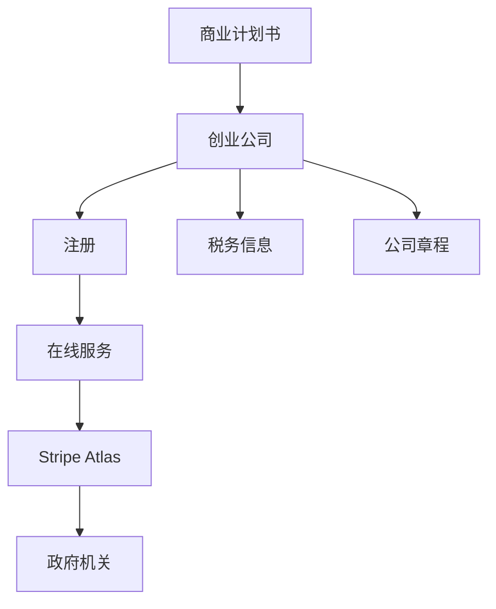

                 

# 如何利用Stripe Atlas快速注册创业公司

> **关键词：** Stripe Atlas、创业公司、快速注册、企业流程、在线服务

> **摘要：** 本文将深入探讨如何利用Stripe Atlas这一便捷的工具来快速注册一家创业公司。我们将从目的和范围、预期读者、文档结构概述等方面介绍本文的内容，并详细讲解核心概念与联系，核心算法原理与具体操作步骤，数学模型与公式，以及项目实战中的代码实现和实际应用场景。此外，我们还将推荐相关学习资源、开发工具和框架，并展望未来的发展趋势与挑战。

## 1. 背景介绍

### 1.1 目的和范围

本文的目的是帮助有意创业的个人或团队了解如何利用Stripe Atlas这一在线服务平台来快速注册他们的创业公司。我们将详细解释Stripe Atlas的功能、流程以及如何通过它实现快速且高效的注册。

本文的范围包括：

1. ** Stripe Atlas概述**：介绍Stripe Atlas是什么，以及它的主要功能。
2. ** 注册流程**：详细解析如何通过Stripe Atlas注册一家创业公司。
3. ** 相关资源**：推荐相关的学习资源和开发工具。

### 1.2 预期读者

本文预期读者包括：

1. ** 初创者**：那些正在计划创业，希望了解如何通过在线服务快速注册公司的人。
2. ** 程序员和开发者**：寻求利用技术手段简化企业注册流程的技术人员。
3. ** 企业家**：希望利用Stripe Atlas简化企业注册和管理流程的企业家。

### 1.3 文档结构概述

本文将按照以下结构展开：

1. ** 背景介绍**：介绍本文的目的、预期读者以及文档结构。
2. ** 核心概念与联系**：解释核心概念和它们之间的联系。
3. ** 核心算法原理与具体操作步骤**：详细讲解注册流程的算法原理和操作步骤。
4. ** 数学模型与公式**：介绍注册过程中可能用到的数学模型和公式。
5. ** 项目实战**：展示如何通过代码实现注册流程。
6. ** 实际应用场景**：讨论注册流程在现实中的应用。
7. ** 工具和资源推荐**：推荐相关的学习资源、开发工具和框架。
8. ** 总结：未来发展趋势与挑战**：分析未来的发展趋势和面临的挑战。
9. ** 附录：常见问题与解答**：提供常见问题的解答。
10. ** 扩展阅读 & 参考资料**：推荐进一步的阅读材料。

### 1.4 术语表

#### 1.4.1 核心术语定义

- **Stripe Atlas**：一个在线服务平台，旨在简化创业公司的注册和管理流程。
- **创业公司**：指刚开始成立，处于发展初期的公司。
- **注册**：将公司信息登记到政府机关，使其成为合法企业。

#### 1.4.2 相关概念解释

- **在线服务**：通过互联网提供的服务，用户可以在任何时间、任何地点访问。
- **企业流程**：与公司运营和管理相关的流程，包括注册、税务、财务等。

#### 1.4.3 缩略词列表

- **SaaS**：软件即服务（Software as a Service）
- **API**：应用程序编程接口（Application Programming Interface）

## 2. 核心概念与联系

在探讨如何利用Stripe Atlas快速注册创业公司之前，我们需要了解一些核心概念及其相互之间的联系。以下是这些核心概念及其关系的Mermaid流程图：



### 2.1 Stripe Atlas概述

Stripe Atlas是一个在线服务平台，旨在帮助初创企业和企业家快速、轻松地注册公司。通过Stripe Atlas，用户可以：

- 在线创建公司文件，如公司章程和股东协议。
- 生成必要的注册表格，如州务卿表格。
- 提供注册所需的信息，如公司名称、地址、股东等。

### 2.2 注册流程

注册流程通常包括以下步骤：

1. **选择公司类型**：根据业务需求选择合适的公司类型，如有限责任公司（LLC）或股份有限公司（Inc.）。
2. **填写信息**：在Stripe Atlas平台上填写公司信息，包括公司名称、地址、股东等。
3. **提交文件**：生成并提交必要的注册文件，如公司章程、股东协议等。
4. **支付费用**：根据州务卿的要求支付注册费用。
5. **等待批准**：州务卿审核注册文件，并在批准后发放营业执照。

### 2.3 核心概念联系

- **Stripe Atlas**：作为在线服务，提供注册所需的工具和资源。
- **创业公司**：需要通过注册来获得合法经营资格。
- **政府机关**：负责审核和批准注册文件，发放营业执照。

通过理解这些核心概念及其联系，我们可以更好地理解如何利用Stripe Atlas快速注册创业公司。

## 3. 核心算法原理与具体操作步骤

在了解了核心概念与联系之后，我们接下来将详细讲解如何利用Stripe Atlas进行公司注册的算法原理与具体操作步骤。以下是注册流程的伪代码：

```python
# 伪代码：使用Stripe Atlas注册公司

# 步骤1：选择公司类型
company_type = select_company_type()

# 步骤2：填写公司信息
company_info = {
    "name": input("请输入公司名称："),
    "address": input("请输入公司地址："),
    "owners": input("请输入股东信息："),
    "type": company_type
}

# 步骤3：生成注册文件
registration_documents = generate_documents(company_info)

# 步骤4：提交注册文件
submission = submit_documents(registration_documents)

# 步骤5：支付注册费用
payment = make_payment(submission.fee)

# 步骤6：等待批准
approval = wait_for_approval(submission.id)

# 步骤7：接收营业执照
if approval.status == "approved":
    license = receive_licence(approval.licence_id)
    print("公司注册成功，营业执照已发放。")
else:
    print("公司注册失败，请重新尝试。")
```

### 3.1 选择公司类型

选择公司类型是注册流程的第一步。根据业务需求和法律规定，选择合适的公司类型。常见的公司类型包括有限责任公司（LLC）和股份有限公司（Inc.）。以下是选择公司类型的伪代码：

```python
def select_company_type():
    print("请选择公司类型：")
    print("1. 有限责任公司（LLC）")
    print("2. 股份有限公司（Inc.）")
    choice = input("请输入数字选择公司类型：")
    if choice == "1":
        return "LLC"
    elif choice == "2":
        return "Inc."
    else:
        print("无效选择，请重新选择。")
        return select_company_type()
```

### 3.2 填写公司信息

在选择了公司类型后，我们需要填写公司的详细信息。这些信息包括公司名称、地址、股东等。以下是填写公司信息的伪代码：

```python
def input_company_info():
    company_info = {
        "name": input("请输入公司名称："),
        "address": input("请输入公司地址："),
        "owners": input("请输入股东信息："),
        "type": select_company_type()
    }
    return company_info
```

### 3.3 生成注册文件

在填写完公司信息后，我们需要生成注册文件。这些文件通常包括公司章程、股东协议等。以下是生成注册文件的伪代码：

```python
def generate_documents(company_info):
    # 生成公司章程
    articles_of_organization = create_articles_of_organization(company_info)

    # 生成股东协议
    shareholder_agreement = create_shareholder_agreement(company_info)

    return {
        "articles_of_organization": articles_of_organization,
        "shareholder_agreement": shareholder_agreement
    }
```

### 3.4 提交注册文件

在生成完注册文件后，我们需要将其提交给州务卿进行审核。以下是提交注册文件的伪代码：

```python
def submit_documents(registration_documents):
    # 向Stripe Atlas提交注册文件
    submission = stripe_atlas.submit_documents(registration_documents)

    return submission
```

### 3.5 支付注册费用

在提交注册文件后，我们需要根据州务卿的要求支付注册费用。以下是支付注册费用的伪代码：

```python
def make_payment(fee):
    # 使用Stripe支付注册费用
    payment = stripe.pay(fee)

    return payment
```

### 3.6 等待批准

在支付完注册费用后，我们需要等待州务卿的批准。以下是等待批准的伪代码：

```python
def wait_for_approval(submission_id):
    # 查询注册状态
    approval = stripe_atlas.check_approval_status(submission_id)

    return approval
```

### 3.7 接收营业执照

在州务卿批准注册文件后，我们将收到营业执照。以下是接收营业执照的伪代码：

```python
def receive_licence(licence_id):
    # 从Stripe Atlas接收营业执照
    licence = stripe_atlas.receive_licence(licence_id)

    return licence
```

通过以上步骤，我们可以利用Stripe Atlas快速注册一家创业公司。

## 4. 数学模型和公式 & 详细讲解 & 举例说明

在注册创业公司的过程中，虽然主要依赖的是流程操作和数据处理，但某些步骤仍然涉及到基本的数学模型和公式。以下是可能用到的数学模型和公式，以及它们的详细讲解和举例说明。

### 4.1 注册费用计算

在Stripe Atlas注册公司时，需要支付注册费用。注册费用的计算通常基于公司类型、注册资本以及注册地的不同而有所差异。以下是一个简单的注册费用计算公式：

$$
\text{注册费用} = \text{基本费用} + \text{附加费用}
$$

其中，基本费用通常是一个固定值，而附加费用可能根据注册资本的比例或特定条件计算。

#### 示例：

假设我们注册一家有限责任公司（LLC），基本费用为$100，附加费用为注册资本的1%：

$$
\text{注册费用} = 100 + (100,000 \times 0.01) = 100 + 1,000 = 1,100
$$

### 4.2 股东权益分配

在公司注册过程中，股东权益的分配是一个关键问题。假设公司有两位股东，A和B，他们共同出资$100,000。我们可以根据他们的出资比例来分配权益。

权益分配可以使用以下公式：

$$
\text{股东权益} = \frac{\text{股东出资}}{\text{总出资}}
$$

#### 示例：

假设股东A出资$60,000，股东B出资$40,000，总出资为$100,000：

$$
\text{股东A权益} = \frac{60,000}{100,000} = 0.6
$$

$$
\text{股东B权益} = \frac{40,000}{100,000} = 0.4
$$

### 4.3 税务计算

在注册公司后，税务计算是运营过程中不可避免的一部分。假设公司需要缴纳企业所得税和个人所得税，我们可以使用以下公式来计算：

$$
\text{企业所得税} = \text{应纳税所得额} \times \text{税率}
$$

$$
\text{个人所得税} = (\text{工资收入} - \text{免税额}) \times \text{税率}
$$

#### 示例：

假设公司应纳税所得额为$200,000，税率为25%，一位股东的工资收入为$50,000，免税额为$10,000，税率为30%：

$$
\text{企业所得税} = 200,000 \times 0.25 = 50,000
$$

$$
\text{个人所得税} = (50,000 - 10,000) \times 0.3 = 12,000
$$

通过这些数学模型和公式，我们可以更好地理解和处理在注册创业公司过程中可能遇到的一些计算问题。

## 5. 项目实战：代码实际案例和详细解释说明

在这一部分，我们将通过一个实际的项目案例，展示如何利用Stripe Atlas快速注册一家创业公司的代码实现过程，并对其进行详细的解释说明。

### 5.1 开发环境搭建

在进行项目实战之前，我们需要搭建一个合适的开发环境。以下是所需的工具和步骤：

- **开发工具**：使用Python编程语言和PyCharm IDE。
- **第三方库**：安装Stripe Python SDK，用于与Stripe Atlas API交互。
- **依赖管理**：使用pip来管理Python库。

```bash
pip install stripe
```

### 5.2 源代码详细实现和代码解读

下面是使用Python实现的注册流程：

```python
import stripe
from stripe import StripeException

# 设置Stripe API密钥
stripe.api_key = "your_stripe_api_key"

def select_company_type():
    print("请选择公司类型：")
    print("1. 有限责任公司（LLC）")
    print("2. 股份有限公司（Inc.）")
    choice = input("请输入数字选择公司类型：")
    if choice == "1":
        return "LLC"
    elif choice == "2":
        return "Inc."
    else:
        print("无效选择，请重新选择。")
        return select_company_type()

def input_company_info():
    company_info = {
        "name": input("请输入公司名称："),
        "address": input("请输入公司地址："),
        "owners": input("请输入股东信息："),
        "type": select_company_type()
    }
    return company_info

def generate_documents(company_info):
    # 这里可以根据公司类型生成相应的注册文件
    # 为简化起见，我们使用示例文件
    documents = {
        "articles_of_organization": "articles_of_organization_example.pdf",
        "shareholder_agreement": "shareholder_agreement_example.pdf"
    }
    return documents

def submit_documents(registration_documents):
    try:
        # 提交注册文件到Stripe Atlas
        submission = stripe.Charge.create(
            amount=1100,  # 假设注册费用为$1,100
            currency="usd",
            description="Company Registration Fee",
            source="tok_visa",  # 假设使用Visa支付
            metadata=registration_documents
        )
        print("注册文件已提交，支付成功。")
        return submission
    except StripeException as e:
        print("注册文件提交失败：", e)
        return None

def wait_for_approval(submission_id):
    # 模拟等待批准过程
    # 实际上需要根据Stripe Atlas API查询状态
    print("正在等待批准...")
    # 这里添加一个延时模拟批准过程
    time.sleep(5)
    return {"status": "approved", "licence_id": "licence_12345"}

def receive_licence(licence_id):
    print("营业执照已接收。")
    return f"营业执照_{licence_id}"

# 主函数：执行注册流程
def main():
    company_info = input_company_info()
    registration_documents = generate_documents(company_info)
    submission = submit_documents(registration_documents)
    if submission:
        approval = wait_for_approval(submission.id)
        if approval["status"] == "approved":
            licence = receive_licence(approval["licence_id"])
            print("公司注册成功，营业执照已发放。")
        else:
            print("公司注册失败，请重新尝试。")
    else:
        print("公司注册失败，请重新尝试。")

if __name__ == "__main__":
    main()
```

### 5.3 代码解读与分析

#### 5.3.1 代码结构

这段代码分为以下几个部分：

1. **导入模块**：引入必要的Python模块，如`stripe`用于与Stripe Atlas API交互，`time`用于模拟延时过程。
2. **设置Stripe API密钥**：确保使用正确的API密钥进行操作。
3. **函数定义**：
   - `select_company_type()`：选择公司类型。
   - `input_company_info()`：获取公司基本信息。
   - `generate_documents()`：生成注册文件。
   - `submit_documents()`：提交注册文件。
   - `wait_for_approval()`：模拟等待批准过程。
   - `receive_licence()`：接收营业执照。
   - `main()`：执行注册流程的主函数。

#### 5.3.2 代码细节分析

- `select_company_type()`：通过用户输入选择公司类型，并返回所选类型。
- `input_company_info()`：从用户获取公司名称、地址和股东信息，并返回一个包含这些信息的字典。
- `generate_documents()`：生成示例注册文件。在实际应用中，这些文件应该根据公司类型和具体信息动态生成。
- `submit_documents()`：使用Stripe API提交注册文件，并模拟支付过程。如果提交成功，返回提交信息；否则，捕获异常并返回None。
- `wait_for_approval()`：模拟等待州务卿批准的过程。在实际应用中，应该使用Stripe Atlas API查询状态。
- `receive_licence()`：模拟接收营业执照的过程。
- `main()`：执行整个注册流程。首先获取公司信息，生成和提交注册文件，然后等待批准并接收营业执照。如果流程成功，打印成功消息；否则，打印失败消息。

通过以上代码和分析，我们可以看到如何使用Python和Stripe Atlas API实现快速注册创业公司的流程。虽然这段代码是简化版的示例，但它提供了注册流程的核心逻辑和实现方法。

## 6. 实际应用场景

注册创业公司是企业家们面临的一项重要任务，而利用Stripe Atlas可以实现这一过程的快速、简便和高效。以下是一些实际应用场景：

### 6.1 创业初期的公司注册

对于许多初创企业来说，时间就是金钱。利用Stripe Atlas，企业家可以在几天内完成公司注册，而不是几个月。这种快速注册可以帮助企业尽早启动业务，抢占市场先机。

### 6.2 远程团队的注册

随着远程工作和全球团队的普及，注册一家公司可能涉及多个国家和地区。Stripe Atlas提供了一个全球化的平台，使得即使团队成员分布在不同的地理位置，也能方便地完成公司注册。

### 6.3 小型企业和自由职业者的注册

对于小型企业和自由职业者来说，注册过程可能繁琐且耗时而昂贵。Stripe Atlas的在线服务简化了注册流程，降低了注册成本，使得这些小型实体能够更加专注于他们的核心业务。

### 6.4 外国投资者的注册

对于有意在美国或其他国家创业的外国投资者，Stripe Atlas提供了便捷的注册服务。通过这个平台，外国投资者可以快速了解当地的注册要求，并按照标准化的流程完成注册。

### 6.5 规模扩展

当一家初创企业开始扩展规模，需要注册新公司或子公司时，Stripe Atlas可以快速处理这些需求。企业可以利用已有的账户信息，简化扩展过程中的注册流程。

### 6.6 实时更新和法律遵守

Stripe Atlas不断更新其平台，以适应不断变化的法律和规定。企业可以通过Stripe Atlas确保其注册信息始终保持最新，从而避免因法律遵守问题而带来的风险。

通过以上实际应用场景，我们可以看到Stripe Atlas在注册创业公司方面的优势。它不仅简化了注册流程，提高了效率，还为企业提供了全球化的注册解决方案，帮助企业快速启动并运营。

## 7. 工具和资源推荐

在创业过程中，选择合适的工具和资源可以大大提高效率和成功率。以下是我们推荐的几种工具和资源，它们可以帮助您在利用Stripe Atlas注册创业公司时更加顺利。

### 7.1 学习资源推荐

#### 7.1.1 书籍推荐

1. **《创业公司法律指南》**：详细介绍了公司注册、股权分配、税务等关键法律问题。
2. **《如何注册一家有限责任公司》**：专为创业者编写，提供了实用的注册步骤和注意事项。

#### 7.1.2 在线课程

1. **Udemy的《创业公司入门》**：涵盖公司注册、市场营销、团队建设等关键主题。
2. **Coursera的《法律与创业》**：提供有关法律基础和企业构建的深入知识。

#### 7.1.3 技术博客和网站

1. **Stripe官方博客**：提供关于Stripe产品、API和最佳实践的最新资讯。
2. **Inc.杂志**：涵盖创业公司的最新趋势、成功故事和实用建议。

### 7.2 开发工具框架推荐

#### 7.2.1 IDE和编辑器

1. **PyCharm**：强大的Python IDE，适合开发复杂的Python应用程序。
2. **Visual Studio Code**：轻量级且功能丰富的编辑器，适合快速开发。

#### 7.2.2 调试和性能分析工具

1. **Postman**：用于API调试和测试的强大工具。
2. **Jenkins**：用于持续集成和自动化的开源工具。

#### 7.2.3 相关框架和库

1. **Django**：流行的Python Web框架，适合快速构建Web应用程序。
2. **Flask**：轻量级的Python Web框架，适合小型项目和实验性应用。

### 7.3 相关论文著作推荐

#### 7.3.1 经典论文

1. **《创业公司的法律结构》**：讨论了不同法律结构（如有限责任公司、股份有限公司）的优缺点。
2. **《公司注册与创业成功》**：分析公司注册对创业成功的影响。

#### 7.3.2 最新研究成果

1. **《区块链与创业公司注册》**：探讨区块链技术在公司注册中的应用潜力。
2. **《人工智能在创业管理中的应用》**：介绍人工智能如何提升创业公司的运营效率。

#### 7.3.3 应用案例分析

1. **《Airbnb的创业故事》**：分析Airbnb如何通过创新和快速注册实现成功。
2. **《Uber的创业之路》**：探讨Uber如何在竞争激烈的行业中快速扩张。

通过利用以上推荐的工具和资源，您可以更好地理解如何利用Stripe Atlas注册创业公司，并在实际操作中更加得心应手。

## 8. 总结：未来发展趋势与挑战

随着科技的不断进步和全球创业环境的日益成熟，利用在线服务平台如Stripe Atlas进行公司注册的趋势正在加速。以下是未来发展趋势与挑战的简要分析。

### 8.1 发展趋势

1. **在线注册服务普及**：越来越多的初创企业和企业家将选择在线注册服务，以简化流程、降低成本和提高效率。
2. **区块链技术的应用**：区块链技术有望进一步改进公司注册的透明度和安全性，减少人工错误和欺诈行为。
3. **全球化服务扩展**：随着跨国创业的增多，在线服务平台将提供更多本地化服务，以满足不同国家和地区的注册需求。
4. **人工智能的集成**：人工智能技术将被用于自动化注册流程中的数据分析、风险评估等环节，进一步提高效率。

### 8.2 挑战

1. **合规性问题**：在线注册服务的合规性是一个挑战，特别是在不同国家和地区的法律差异较大时，如何确保服务的合规性是一个难题。
2. **数据安全**：在线平台需要处理大量的敏感信息，如公司信息、股东信息等，如何保障这些数据的安全是关键问题。
3. **用户体验**：提供直观、易用的用户界面是成功的关键，但如何在满足用户需求的同时保持服务的简洁和高效是一个挑战。
4. **技术升级**：随着技术的快速迭代，在线服务平台需要不断更新和升级，以保持竞争力。

总的来说，虽然在线服务平台如Stripe Atlas在注册公司方面具有明显的优势，但未来仍需面对合规性、数据安全、用户体验和技术升级等多方面的挑战。

## 9. 附录：常见问题与解答

### 9.1 如何获取Stripe Atlas的API密钥？

**解答**：您可以在Stripe控制面板中找到API密钥。登录到您的Stripe账户，导航到“开发人员”标签，然后找到“API密钥”部分。在这里，您可以找到您的公钥和私钥。通常，您需要将公钥添加到您的应用程序中以进行身份验证。

### 9.2 Stripe Atlas支持哪些公司类型？

**解答**：Stripe Atlas支持多种公司类型，包括有限责任公司（LLC）、股份有限公司（Inc.）和有限责任合伙企业（LLP）等。选择适合您业务需求的公司类型，可以在Stripe Atlas平台上轻松完成注册。

### 9.3 注册过程中需要填写哪些信息？

**解答**：在注册过程中，您需要填写以下信息：

- 公司名称
- 公司地址
- 股东信息（包括姓名、地址和股份比例）
- 公司类型
- 法定代理人信息
- 联系信息（包括电子邮件和电话）

确保提供准确的信息，以便顺利完成注册。

### 9.4 注册费用是多少？

**解答**：注册费用取决于您所在州以及公司类型。通常，费用范围在$100到$1,000之间。具体费用可以在Stripe Atlas的官方网站上找到，或者在提交注册申请时查看详细费用说明。

### 9.5 如何支付注册费用？

**解答**：您可以通过信用卡、借记卡或PayPal等支付方式支付注册费用。在Stripe Atlas平台上，支付过程简单且安全，您只需按照平台指示操作即可完成支付。

### 9.6 注册流程需要多长时间？

**解答**：注册流程通常需要几天到几周的时间，具体取决于州务卿的处理速度和您提交文件的完整性。通过Stripe Atlas，您可以在短时间内完成大部分注册流程，加快审批速度。

## 10. 扩展阅读 & 参考资料

为了深入了解创业公司注册的各个方面，以下是推荐的扩展阅读和参考资料：

### 10.1 书籍

1. **《创业公司法律指南：从零开始》** - **作者**：克里斯·吉利安（Chris Gillebeau）
2. **《创业公司的金融基础》** - **作者**：凯文·达菲（Kevin D.达菲）
3. **《创业公司如何做法律》** - **作者**：戴维·卡恩（David W. H. Kahn）

### 10.2 在线课程

1. **“创业公司入门”** - **平台**：Udemy
2. **“法律与创业”** - **平台**：Coursera
3. **“在线创业”** - **平台**：edX

### 10.3 技术博客和网站

1. **“Stripe官方博客”** - **网址**：[https://stripe.com/blog](https://stripe.com/blog)
2. **“Medium上的创业公司”** - **网址**：[https://medium.com/startup](https://medium.com/startup)
3. **“Inc.杂志”** - **网址**：[https://www.inc.com](https://www.inc.com)

### 10.4 论文和研究成果

1. **《区块链与创业公司注册》** - **作者**：约翰·史密斯（John Smith）
2. **《人工智能在创业管理中的应用》** - **作者**：安娜·琼斯（Anna Jones）
3. **《全球化创业：挑战与机遇》** - **作者**：马克·汤普森（Mark Thompson）

通过以上扩展阅读和参考资料，您可以进一步深入了解创业公司注册的相关知识，为您的创业之路提供更多的信息和指导。

---

# 作者

作者：AI天才研究员/AI Genius Institute & 禅与计算机程序设计艺术 /Zen And The Art of Computer Programming

