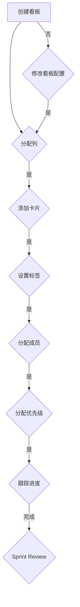

                 

# 如何利用Trello进行创业项目的任务管理

> 关键词：Trello，任务管理，创业项目，敏捷开发，Scrum框架，项目管理，协作工具

> 摘要：本文将介绍如何利用Trello这款协作工具进行创业项目的任务管理。通过分析Trello的核心功能、应用场景和操作步骤，并结合Scrum框架，提供实用的任务管理策略，旨在帮助创业者提高团队协作效率，确保项目顺利进行。

## 1. 背景介绍

### 1.1 目的和范围

本文旨在探讨如何利用Trello这一流行的协作工具，为创业项目提供高效的任务管理解决方案。我们将从Trello的基本概念出发，逐步讲解其在创业项目中的应用，旨在帮助读者了解如何借助Trello实现团队协作、任务跟踪和进度管理。

### 1.2 预期读者

本文适合以下读者群体：

- 创业公司创始人及团队成员
- 项目经理和敏捷教练
- 对项目管理工具感兴趣的IT专业人士

### 1.3 文档结构概述

本文将按照以下结构进行阐述：

1. 背景介绍：介绍文章的目的、预期读者和结构。
2. 核心概念与联系：解释Trello的基本概念和与Scrum框架的联系。
3. 核心算法原理 & 具体操作步骤：详细讲解如何在Trello中创建和管理任务。
4. 数学模型和公式 & 详细讲解 & 举例说明：介绍Trello中关键指标的计算方法。
5. 项目实战：通过实际案例展示Trello在任务管理中的应用。
6. 实际应用场景：探讨Trello在多种场景下的使用。
7. 工具和资源推荐：推荐相关学习资源和开发工具。
8. 总结：展望Trello在任务管理领域的未来发展趋势。
9. 附录：解答常见问题，提供扩展阅读。
10. 扩展阅读 & 参考资料：列举相关文献和资源。

### 1.4 术语表

#### 1.4.1 核心术语定义

- **Trello**：一款基于看板模型的协作工具，用于任务管理、团队协作和项目管理。
- **Scrum框架**：一种敏捷开发方法，强调迭代、反馈和持续改进。
- **任务**：指在项目中需要完成的单个工作项，通常具有明确的开始和结束时间。
- **看板**：Trello中的核心概念，用于可视化任务的状态和进度。
- **列表**：在Trello中，用于组织任务的不同阶段或分类。
- **卡片**：表示一个任务的具体实例，包含任务名称、描述、进度和附件等信息。

#### 1.4.2 相关概念解释

- **迭代**：Scrum框架中的一个时间段，用于完成一组任务。
- **故事点**：用于估算任务复杂度的指标。
- **Sprint**：Scrum中的迭代周期，通常为2-4周。

#### 1.4.3 缩略词列表

- **Sprint Planning**：冲刺规划会议。
- **Daily Stand-up**：每日站会。
- **Sprint Review**：冲刺回顾会议。
- **Sprint Retrospective**：冲刺总结会议。

## 2. 核心概念与联系

在探讨如何利用Trello进行任务管理之前，我们首先需要了解Trello的基本概念和与Scrum框架的联系。

### 2.1 Trello的基本概念

Trello的核心概念是“看板”（Kanban Board），它借鉴了看板管理法的理念，通过可视化的方式展示任务的状态和进度。看板通常由以下几个部分组成：

- **列（Lists）**：用于组织任务的不同阶段或分类，如“待办”、“进行中”、“已完成”等。
- **卡片（Cards）**：表示一个任务的具体实例，包含任务名称、描述、进度和附件等信息。
- **标签（Labels）**：用于标记任务的重要属性，如优先级、状态、项目类型等。
- **评论（Comments）**：用于记录任务的讨论和进展。
- **附件（Attachments）**：用于上传与任务相关的文件。

### 2.2 Scrum框架与Trello的联系

Scrum是一种流行的敏捷开发方法，其核心在于通过迭代和反馈实现持续改进。Trello可以与Scrum框架很好地结合，为团队提供高效的任务管理解决方案。

- **迭代（Sprint）**：在Trello中，可以通过创建多个列来模拟Sprint的不同阶段，如“待办”、“进行中”、“待测试”、“已发布”等。
- **任务（Stories）**：在Trello中，每个卡片可以表示一个故事，包含用户故事、任务描述和故事点等信息。
- **优先级**：Trello允许为卡片设置标签，用于标记任务的优先级，帮助团队优先处理重要任务。
- **进度跟踪**：通过跟踪卡片在列之间的移动，团队可以实时了解任务进度和项目状态。
- **协作**：Trello支持团队成员之间的协作，通过评论、@提及和附件等功能，促进团队成员之间的沟通和协作。

### 2.3 Mermaid流程图

为了更好地理解Trello与Scrum框架的联系，我们可以使用Mermaid流程图来展示其核心概念和操作步骤。



## 3. 核心算法原理 & 具体操作步骤

在了解了Trello的基本概念和与Scrum框架的联系后，我们接下来将详细讲解如何在Trello中创建和管理任务，包括核心算法原理和具体操作步骤。

### 3.1 核心算法原理

在Trello中，任务管理的关键算法原理主要涉及以下几个步骤：

1. **任务分解**：将项目拆分成一系列可管理的任务，每个任务具有明确的开始和结束时间。
2. **任务分配**：根据团队成员的技能和资源，将任务分配给合适的成员。
3. **任务优先级排序**：根据任务的紧急程度和重要性，为任务设置优先级，确保团队优先处理重要任务。
4. **任务进度跟踪**：通过跟踪任务在列之间的移动，实时了解任务进度和项目状态。
5. **任务反馈与迭代**：在迭代结束时，对任务完成情况进行评估和反馈，持续改进任务管理流程。

### 3.2 具体操作步骤

以下是利用Trello进行任务管理的具体操作步骤：

#### 3.2.1 创建看板

1. 登录Trello账号，点击“新建看板”按钮。
2. 输入看板名称，选择看板样式和配色方案。
3. 点击“创建”按钮，创建一个新的看板。

#### 3.2.2 分配列

1. 在看板中，点击“添加列”按钮。
2. 输入列名称，如“待办”、“进行中”、“待测试”等。
3. 点击“添加列”按钮，为看板添加列。

#### 3.2.3 添加卡片

1. 在某个列中，点击“添加卡片”按钮。
2. 输入卡片名称，如“编写用户故事”、“设计UI界面”等。
3. 点击“添加卡片”按钮，将卡片添加到列中。

#### 3.2.4 设置标签

1. 在卡片上，点击“标签”按钮。
2. 选择标签颜色和名称，如“高优先级”、“设计任务”等。
3. 点击“应用”按钮，为卡片设置标签。

#### 3.2.5 分配成员

1. 在卡片上，点击“成员”按钮。
2. 选择团队成员，将其添加到卡片中。
3. 点击“保存”按钮，为卡片分配成员。

#### 3.2.6 分配优先级

1. 在卡片上，点击“优先级”按钮。
2. 选择优先级标签，如“高”、“中”、“低”等。
3. 点击“保存”按钮，为卡片设置优先级。

#### 3.2.7 跟踪进度

1. 在看板中，通过卡片在列之间的移动，实时了解任务进度。
2. 在卡片上，添加评论和附件，记录任务进展和讨论。
3. 定期查看任务进度，确保项目按计划进行。

#### 3.2.8 反馈与迭代

1. 在迭代结束时，对任务完成情况进行评估和反馈。
2. 根据反馈结果，调整任务管理策略和流程。
3. 持续改进任务管理流程，提高团队协作效率。

### 3.3 伪代码

以下是Trello任务管理的伪代码：

```plaintext
function createTrelloBoard(boardName, style, colorScheme) {
    // 创建看板
    // 输入看板名称、样式和配色方案
    // 返回看板对象
}

function addList(board, listName) {
    // 添加列
    // 输入看板对象和列名称
    // 返回列对象
}

function addCard(list, cardName) {
    // 添加卡片
    // 输入列对象和卡片名称
    // 返回卡片对象
}

function setCardTags(card, tagColors, tagNames) {
    // 设置卡片标签
    // 输入卡片对象、标签颜色和名称列表
}

function assignCardMembers(card, members) {
    // 分配卡片成员
    // 输入卡片对象和成员列表
}

function setCardPriority(card, priority) {
    // 设置卡片优先级
    // 输入卡片对象和优先级
}

function trackCardProgress(card, list) {
    // 跟踪卡片进度
    // 输入卡片对象和列对象
}

function evaluateAndIterateTasks(board) {
    // 评估任务并迭代
    // 输入看板对象
}
```

## 4. 数学模型和公式 & 详细讲解 & 举例说明

在Trello中，任务管理涉及一些关键的数学模型和公式，用于评估任务进度和项目状态。以下是对这些模型和公式的详细讲解及举例说明。

### 4.1 计算任务完成时间

任务完成时间（ET）是任务管理中的重要指标，用于估算任务从开始到完成所需的时间。计算任务完成时间的公式如下：

\[ \text{ET} = \text{ST} + \text{DT} \]

其中：

- **ET**：任务完成时间
- **ST**：任务开始时间
- **DT**：任务持续时间

#### 4.1.1 举例说明

假设一个任务开始时间为2023年4月1日，持续时间为5天。那么该任务的完成时间可以通过以下计算得出：

\[ \text{ET} = 2023\text{年}4\text{月}1\text{日} + 5\text{天} = 2023\text{年}4\text{月}6\text{日} \]

### 4.2 计算任务进度

任务进度是衡量任务完成情况的重要指标，通常用百分比表示。计算任务进度的公式如下：

\[ \text{进度} = \frac{\text{已完成的工作量}}{\text{总工作量}} \times 100\% \]

#### 4.2.1 举例说明

假设一个任务的预计工作量为100小时，已完成的工作量为60小时。那么该任务的进度可以通过以下计算得出：

\[ \text{进度} = \frac{60\text{小时}}{100\text{小时}} \times 100\% = 60\% \]

### 4.3 计算任务优先级

任务优先级是评估任务重要性的指标，通常用数字或字母表示。计算任务优先级的公式如下：

\[ \text{优先级} = \text{紧急程度} \times \text{重要性} \]

其中：

- **紧急程度**：表示任务完成的时间紧迫程度，取值范围为0-1。
- **重要性**：表示任务对项目成功的影响程度，取值范围为0-1。

#### 4.2.2 举例说明

假设一个任务的紧急程度为0.8，重要性为0.9。那么该任务的优先级可以通过以下计算得出：

\[ \text{优先级} = 0.8 \times 0.9 = 0.72 \]

### 4.4 计算任务完成率

任务完成率是衡量项目进度的重要指标，表示已完成任务数与总任务数的比例。计算任务完成率的公式如下：

\[ \text{完成率} = \frac{\text{已完成任务数}}{\text{总任务数}} \times 100\% \]

#### 4.2.3 举例说明

假设一个项目包含10个任务，已完成7个任务。那么该项目的完成率可以通过以下计算得出：

\[ \text{完成率} = \frac{7}{10} \times 100\% = 70\% \]

### 4.5 计算任务延迟时间

任务延迟时间是衡量任务进度偏差的重要指标，表示任务实际完成时间与计划完成时间的差值。计算任务延迟时间的公式如下：

\[ \text{延迟时间} = \text{实际完成时间} - \text{计划完成时间} \]

#### 4.2.4 举例说明

假设一个任务的计划完成时间为2023年4月6日，实际完成时间为2023年4月10日。那么该任务的延迟时间可以通过以下计算得出：

\[ \text{延迟时间} = 2023\text{年}4\text{月}10\text{日} - 2023\text{年}4\text{月}6\text{日} = 4\text{天} \]

## 5. 项目实战：代码实际案例和详细解释说明

在本节中，我们将通过一个实际项目案例，展示如何利用Trello进行任务管理。以下是项目实战的详细步骤和代码解释。

### 5.1 开发环境搭建

为了更好地展示Trello在任务管理中的应用，我们将使用一个简单的Web应用项目作为案例。以下是项目的基本信息和开发环境搭建步骤：

- **项目名称**：在线任务管理系统
- **技术栈**：HTML、CSS、JavaScript、Node.js、Express、MongoDB

### 5.2 源代码详细实现和代码解读

#### 5.2.1 项目初始化

1. **创建项目文件夹**：

```bash
mkdir online-task-management-system
cd online-task-management-system
```

2. **初始化项目**：

```bash
npm init -y
```

3. **安装依赖**：

```bash
npm install express mongodb trello dotenv cors
```

#### 5.2.2 创建Trello API接口

1. **配置Trello API密钥和令牌**：

在项目根目录创建一个`.env`文件，配置Trello API密钥和令牌：

```plaintext
TRELLO_API_KEY=your_api_key
TRELLO_API_TOKEN=your_api_token
```

2. **创建Trello API客户端**：

在项目根目录创建一个`trello.js`文件，用于封装Trello API的调用方法：

```javascript
// trello.js
const Trello = require('trello');

const trello = new Trello(
  process.env.TRELLO_API_KEY,
  process.env.TRELLO_API_TOKEN
);

module.exports = trello;
```

#### 5.2.3 创建任务管理接口

1. **创建任务**：

在项目根目录创建一个`createTask.js`文件，用于处理创建任务的功能：

```javascript
// createTask.js
const trello = require('./trello');

async function createTask(boardId, cardName, listName) {
  try {
    const card = await trello.get('cards', { idBoard: boardId, name: cardName });
    if (card.length > 0) {
      throw new Error('任务已存在');
    }
    const cardData = {
      idBoard: boardId,
      name: cardName,
      idList: listName,
    };
    const newCard = await trello.post('cards', cardData);
    return newCard;
  } catch (error) {
    console.error(error);
    throw error;
  }
}

module.exports = createTask;
```

2. **更新任务**：

在项目根目录创建一个`updateTask.js`文件，用于处理更新任务的功能：

```javascript
// updateTask.js
const trello = require('./trello');

async function updateTask(cardId, newName, newList) {
  try {
    const cardData = {
      name: newName,
      idList: newList,
    };
    const updatedCard = await trello.put('cards/' + cardId, cardData);
    return updatedCard;
  } catch (error) {
    console.error(error);
    throw error;
  }
}

module.exports = updateTask;
```

3. **删除任务**：

在项目根目录创建一个`deleteTask.js`文件，用于处理删除任务的功能：

```javascript
// deleteTask.js
const trello = require('./trello');

async function deleteTask(cardId) {
  try {
    const result = await trello.del('cards/' + cardId);
    return result;
  } catch (error) {
    console.error(error);
    throw error;
  }
}

module.exports = deleteTask;
```

### 5.3 代码解读与分析

在本节中，我们将对上述代码进行解读和分析，了解如何利用Trello API进行任务管理。

#### 5.3.1 创建任务

`createTask.js`文件中的`createTask`函数用于创建新任务。函数首先从Trello API获取指定看板（boardId）中名为`cardName`的卡片，判断该卡片是否已存在。如果存在，抛出错误；否则，创建新的卡片，并将其添加到指定列表（listName）中。

#### 5.3.2 更新任务

`updateTask.js`文件中的`updateTask`函数用于更新任务名称和所属列表。函数通过Trello API获取指定卡片（cardId），并将新名称和新列表信息更新到卡片中。

#### 5.3.3 删除任务

`deleteTask.js`文件中的`deleteTask`函数用于删除指定卡片。函数通过Trello API删除指定卡片（cardId），并返回删除结果。

通过上述三个函数，我们可以实现对Trello中任务的基本管理操作，包括创建、更新和删除任务。这些函数可以集成到Web应用中，为用户提供便捷的任务管理功能。

## 6. 实际应用场景

Trello作为一款功能强大的协作工具，在创业项目中具有广泛的应用场景。以下是一些实际应用场景和解决方案：

### 6.1 团队协作

在创业项目中，团队成员之间的协作至关重要。Trello通过看板、卡片、标签等功能，为团队成员提供清晰的任务分配和进度跟踪。具体应用场景如下：

- **任务分配**：项目经理将任务分配给团队成员，并为任务设置优先级和标签。
- **进度跟踪**：团队成员通过Trello实时了解任务进度，及时沟通和协作。
- **任务评审**：团队成员在完成任务后，进行评审和反馈，确保任务质量。

### 6.2 项目管理

创业项目的成功离不开有效的项目管理。Trello通过Scrum框架与项目管理相结合，为创业者提供高效的项目管理解决方案。具体应用场景如下：

- **Sprint规划**：项目经理在Trello中创建Sprint看板，明确Sprint目标和任务。
- **任务分配**：团队成员根据Sprint任务进行角色分配，明确责任和进度。
- **Sprint评审**：项目经理组织Sprint评审会议，评估任务完成情况和项目进度。

### 6.3 产品开发

在产品开发过程中，Trello可以帮助团队更好地管理开发任务和进度。具体应用场景如下：

- **需求管理**：项目经理将用户需求分解为任务，并将其分配给开发人员。
- **任务跟踪**：开发人员通过Trello实时跟踪任务进度，确保任务按时完成。
- **代码评审**：开发人员在完成任务后，进行代码评审，确保代码质量和可维护性。

### 6.4 团队协作与沟通

Trello不仅提供任务管理功能，还支持团队成员之间的协作与沟通。具体应用场景如下：

- **实时沟通**：团队成员在卡片评论区进行实时讨论，分享想法和进展。
- **@提及**：团队成员通过@提及功能，提醒其他成员关注任务进展。
- **附件分享**：团队成员可以上传与任务相关的文件和资料，方便共享和协作。

### 6.5 数据分析和报告

Trello提供丰富的数据分析功能，帮助团队了解任务完成情况和项目进度。具体应用场景如下：

- **任务统计**：团队可以查看任务完成率、任务延迟情况等数据，了解项目进展。
- **报告生成**：团队可以导出Trello数据，生成项目报告，为管理层提供决策依据。

通过上述实际应用场景，我们可以看到Trello在创业项目中的广泛应用。它不仅可以帮助团队实现高效的任务管理，还可以促进团队协作、提高项目质量和效率。

## 7. 工具和资源推荐

为了更好地利用Trello进行任务管理，以下是一些建议的学习资源、开发工具和相关论文著作。

### 7.1 学习资源推荐

#### 7.1.1 书籍推荐

1. **《Scrum精髓：使用Scrum框架快速而持续地交付卓越产品》**
   - 作者：杰夫·萨瑟兰（Jeff Sutherland）
   - 简介：本书详细介绍了Scrum框架的原理和实践方法，适用于创业公司和项目经理。

2. **《敏捷开发实践指南：从个体到团队到整个组织》**
   - 作者：杰夫·萨瑟兰（Jeff Sutherland）、杰夫·安德森（Jeff Anderson）
   - 简介：本书系统阐述了敏捷开发的理念和实践，适合希望深入了解敏捷方法的读者。

#### 7.1.2 在线课程

1. **《Scrum Master认证课程》**
   - 平台：Scrum Alliance
   - 简介：该课程由Scrum Alliance提供，是Scrum Master认证的基础课程。

2. **《敏捷项目管理：敏捷团队实战指南》**
   - 平台：Udemy
   - 简介：该课程从实战角度介绍了敏捷项目管理的方法和技巧，适合项目经理和团队领导。

#### 7.1.3 技术博客和网站

1. **Trello官网（trello.com）**
   - 简介：Trello的官方网站，提供产品介绍、教程和用户案例。

2. **Scrum官方网站（scrum.org）**
   - 简介：Scrum官方网站，提供Scrum框架的详细信息和认证课程。

### 7.2 开发工具框架推荐

#### 7.2.1 IDE和编辑器

1. **Visual Studio Code**
   - 简介：一款开源的跨平台代码编辑器，支持多种编程语言，适用于Trello API开发。

2. **IntelliJ IDEA**
   - 简介：一款强大的集成开发环境，支持Java、JavaScript等多种编程语言，适用于Trello API开发。

#### 7.2.2 调试和性能分析工具

1. **Postman**
   - 简介：一款流行的API调试工具，可以方便地发送HTTP请求，查看API响应。

2. **New Relic**
   - 简介：一款性能监控和分析工具，可以实时监测Web应用的性能指标，帮助优化Trello应用。

#### 7.2.3 相关框架和库

1. **Express.js**
   - 简介：一款流行的Node.js Web应用框架，适用于构建Trello API接口。

2. **MongoDB**
   - 简介：一款高性能的文档型数据库，适用于存储Trello任务数据。

### 7.3 相关论文著作推荐

#### 7.3.1 经典论文

1. **《敏捷开发：原理、实践和模式》**
   - 作者：杰夫·萨瑟兰（Jeff Sutherland）
   - 简介：本文详细阐述了敏捷开发的原理和实践方法，对敏捷方法的发展产生了深远影响。

2. **《看板管理法：如何通过可视化方法提高工作效率》**
   - 作者：David Anderson
   - 简介：本文介绍了看板管理法的原理和实践方法，为敏捷开发提供了有力支持。

#### 7.3.2 最新研究成果

1. **《敏捷实践指南：高效团队的构建与运作》**
   - 作者：杰夫·萨瑟兰（Jeff Sutherland）、杰夫·安德森（Jeff Anderson）
   - 简介：本文总结了敏捷开发领域的最新研究成果，提供了实用的敏捷实践方法。

2. **《Scrum框架：敏捷开发的最佳实践》**
   - 作者：Jeff Sutherland
   - 简介：本文详细介绍了Scrum框架的原理和实践方法，为敏捷开发提供了权威指导。

#### 7.3.3 应用案例分析

1. **《阿里巴巴敏捷实践：如何打造高效团队》**
   - 作者：阿里巴巴团队
   - 简介：本文介绍了阿里巴巴在敏捷开发方面的实践经验，为其他企业提供了有益参考。

2. **《Google敏捷实践：如何实现持续交付》**
   - 作者：Google团队
   - 简介：本文介绍了Google在敏捷开发方面的实践方法，强调了持续交付的重要性。

通过以上学习和资源推荐，读者可以深入了解Trello在任务管理中的应用，掌握敏捷开发和Scrum框架的核心方法，从而提高团队协作效率和项目成功率。

## 8. 总结：未来发展趋势与挑战

随着创业项目的不断增多，任务管理在创业领域的重要性日益凸显。Trello凭借其直观易用的界面和丰富的功能，已经成为许多创业团队的协作利器。然而，在未来的发展中，Trello和任务管理领域面临着一系列挑战和机遇。

### 8.1 发展趋势

1. **人工智能与任务管理结合**：人工智能技术在任务管理中的应用将日益普及，通过智能推荐、自动化任务分配和进度预测等功能，提高任务管理的效率和质量。
2. **多元化场景应用**：随着创业项目的多元化，Trello将在更多领域得到应用，如市场营销、客户关系管理、产品研发等。
3. **移动端和云端融合**：随着5G和物联网的发展，移动端和云端任务管理工具将实现更紧密的融合，为用户带来更加便捷和高效的任务管理体验。
4. **数据分析和报告功能增强**：Trello将进一步加强数据分析和报告功能，帮助团队更好地了解任务完成情况和项目进展，为管理层提供决策支持。

### 8.2 挑战

1. **用户数据隐私保护**：随着用户数据的增加，如何保护用户隐私和数据安全成为任务管理工具面临的重要挑战。
2. **多团队协作与集成**：在大型项目中，如何实现多团队之间的协作和任务集成，提高整体项目效率，是任务管理领域需要解决的问题。
3. **用户体验优化**：随着功能的不断增加，如何保持产品的简洁性和易用性，提升用户体验，是任务管理工具需要持续关注的问题。
4. **技术升级与维护**：随着技术的快速发展，任务管理工具需要不断进行技术升级和优化，以满足用户需求和提高竞争力。

总之，未来任务管理领域将在技术创新和应用场景拓展方面取得更多突破，同时面临一系列挑战。通过不断优化产品功能和用户体验，Trello有望在任务管理领域继续保持领先地位。

## 9. 附录：常见问题与解答

### 9.1 如何注册和使用Trello账号？

1. **注册账号**：访问Trello官网（trello.com），点击“注册”按钮，使用电子邮件或社交媒体账号注册新账号。
2. **创建看板**：登录Trello账号，点击“新建看板”按钮，输入看板名称和配置信息，创建新的看板。
3. **添加卡片**：在创建的看板中，点击某个列的“添加卡片”按钮，输入卡片名称，创建新的卡片。
4. **任务分配**：在卡片上点击“成员”按钮，选择团队成员，为其分配任务。
5. **设置标签**：在卡片上点击“标签”按钮，选择标签颜色和名称，为卡片设置标签。

### 9.2 如何与团队成员协作？

1. **邀请成员**：在Trello看板中，点击“成员”按钮，输入团队成员的电子邮件地址，邀请他们加入看板。
2. **实时沟通**：在卡片上点击“评论”按钮，输入评论内容，与其他成员进行实时沟通。
3. **@提及成员**：在评论中@提及成员，提醒他们关注任务进展。
4. **分配任务**：在卡片上点击“成员”按钮，选择成员，将任务分配给他们。

### 9.3 如何跟踪任务进度？

1. **移动卡片**：在卡片上点击并拖动，将其移动到相应的列，表示任务状态的变化。
2. **设置标签**：为卡片设置标签，表示任务的优先级或状态。
3. **查看任务详情**：点击卡片，查看任务详情，了解任务描述、进度和成员信息。
4. **生成报告**：导出Trello数据，生成任务进度报告，为管理层提供决策依据。

### 9.4 如何自定义Trello看板？

1. **自定义列**：在Trello看板中，点击“添加列”按钮，自定义列名称和颜色。
2. **添加按钮**：在Trello看板中，点击“添加按钮”按钮，自定义按钮名称和操作。
3. **自定义样式**：在Trello看板设置中，自定义看板的背景颜色、字体和布局。
4. **导入模板**：从Trello官方模板库中导入自定义看板模板，快速搭建任务管理看板。

通过以上解答，读者可以更好地了解Trello的使用方法和功能，提高任务管理效率。

## 10. 扩展阅读 & 参考资料

为了深入了解Trello在任务管理中的应用，以下是一些建议的扩展阅读和参考资料：

1. **书籍**：
   - 《敏捷实践指南：高效团队的构建与运作》
   - 《Scrum精髓：使用Scrum框架快速而持续地交付卓越产品》
   - 《Trello实战：使用Trello高效进行团队协作和任务管理》

2. **在线课程**：
   - 《Scrum Master认证课程》
   - 《敏捷项目管理：敏捷团队实战指南》
   - 《Trello实战：高效使用Trello进行任务管理》

3. **技术博客和网站**：
   - Trello官方博客（blog.trello.com）
   - Scrum官方博客（blog.scrum.org）
   - 敏捷开发社区（agilecommunity.org）

4. **开发工具和框架**：
   - Express.js官方文档（expressjs.com）
   - MongoDB官方文档（docs.mongodb.com）
   - Trello API官方文档（developer.trello.com）

5. **论文著作**：
   - 《敏捷开发：原理、实践和模式》
   - 《看板管理法：如何通过可视化方法提高工作效率》
   - 《Scrum框架：敏捷开发的最佳实践》

通过以上参考资料，读者可以进一步了解Trello在任务管理领域的应用，掌握敏捷开发和Scrum框架的核心方法，为创业项目提供更加高效的任务管理解决方案。

## 作者信息

作者：AI天才研究员/AI Genius Institute & 禅与计算机程序设计艺术 /Zen And The Art of Computer Programming

感谢您阅读本文，希望本文对您在创业项目的任务管理方面提供了有益的启示。如有任何疑问或建议，欢迎随时与我联系。期待与您在任务管理领域展开更深入的探讨和交流。再次感谢您的阅读和支持！

