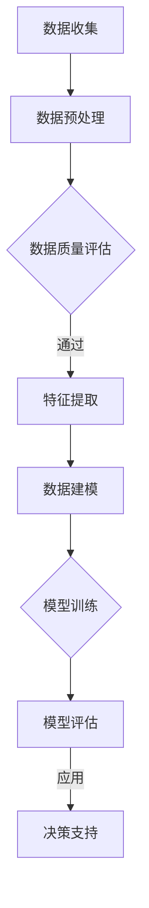
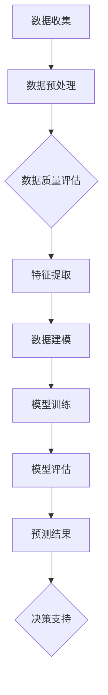
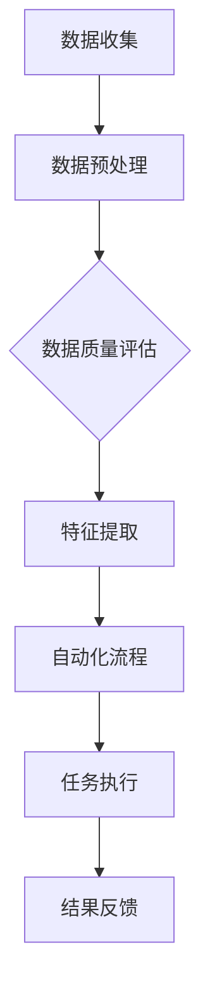
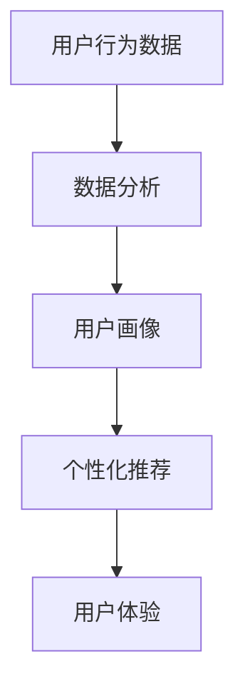

                 

# 如何利用人工智能优化创业公司运营

## 关键词
人工智能，创业公司，运营优化，数据分析，预测模型，自动化流程，个性化服务

## 摘要
本文将探讨人工智能（AI）在创业公司运营中的关键作用。通过深入分析AI在数据分析、预测模型、自动化流程和个性化服务等方面的应用，本文旨在为创业公司提供一套切实可行的运营优化策略。我们将从背景介绍、核心概念与联系、算法原理、数学模型、实战案例、应用场景、工具推荐等多个维度，全面解析如何利用人工智能提升创业公司的运营效率和竞争力。

## 1. 背景介绍

### 1.1 目的和范围

本文的目标是帮助创业公司理解并应用人工智能技术，以优化其日常运营。我们将探讨以下几个方面：

1. **数据分析与洞察**：如何利用AI对大量数据进行分析，提取有价值的信息。
2. **预测模型**：如何通过机器学习算法建立预测模型，以指导决策。
3. **自动化流程**：如何使用AI自动化日常运营任务，提高效率和减少人力成本。
4. **个性化服务**：如何利用AI提供个性化的用户体验，增加用户粘性和满意度。

本文的范围涵盖了从数据采集到模型部署的全过程，旨在为创业公司提供一套实用的AI运营优化方案。

### 1.2 预期读者

本文的预期读者包括：

1. 创业公司创始人或高层管理人员
2. 数据科学家、AI工程师和程序员
3. 对人工智能和创业有兴趣的技术爱好者

无论您的角色如何，本文都将帮助您理解如何将AI应用于创业公司的运营优化。

### 1.3 文档结构概述

本文的结构如下：

1. **背景介绍**：介绍本文的目的和范围，预期读者以及文档结构。
2. **核心概念与联系**：讨论AI在创业公司运营中的应用，并展示相关流程图。
3. **核心算法原理 & 具体操作步骤**：解释AI算法的基本原理，并提供伪代码示例。
4. **数学模型和公式 & 详细讲解 & 举例说明**：介绍相关的数学模型，并提供公式和实例。
5. **项目实战：代码实际案例和详细解释说明**：展示一个实际的代码案例，并进行解读。
6. **实际应用场景**：讨论AI在创业公司中的具体应用场景。
7. **工具和资源推荐**：推荐学习资源、开发工具和框架。
8. **总结：未来发展趋势与挑战**：总结AI在创业公司运营中的应用趋势和面临的挑战。
9. **附录：常见问题与解答**：解答一些常见的问题。
10. **扩展阅读 & 参考资料**：提供进一步的阅读材料。

### 1.4 术语表

#### 1.4.1 核心术语定义

- **人工智能（AI）**：模拟人类智能行为的计算机系统。
- **机器学习（ML）**：AI的一个分支，通过数据训练模型，使其能够进行预测和决策。
- **深度学习（DL）**：ML的一个子领域，使用多层神经网络进行训练。
- **数据挖掘**：从大量数据中发现有价值信息的过程。
- **预测模型**：基于历史数据，预测未来趋势或结果的模型。
- **自动化流程**：通过软件自动执行的业务流程，减少手动操作。
- **个性化服务**：根据用户行为和偏好提供定制化的服务。

#### 1.4.2 相关概念解释

- **监督学习**：通过标注的数据训练模型，使其能够进行预测。
- **无监督学习**：模型在没有标注数据的情况下，自行发现数据中的模式。
- **强化学习**：通过奖励机制训练模型，使其在特定环境中作出最优决策。
- **数据预处理**：在数据用于建模之前，对数据进行清洗、转换和标准化。

#### 1.4.3 缩略词列表

- **AI**：人工智能
- **ML**：机器学习
- **DL**：深度学习
- **API**：应用程序编程接口
- **SDK**：软件开发工具包

## 2. 核心概念与联系

在讨论AI如何优化创业公司运营之前，我们需要理解一些核心概念和它们之间的联系。以下是AI在创业公司运营中的应用流程及其相关流程图。

### 2.1 数据收集与预处理

数据是AI算法的基础。创业公司需要收集各种数据，包括用户行为数据、销售数据、财务数据等。这些数据通常来源于公司内部的数据库、日志文件以及第三方数据源。

**Mermaid 流程图：**



### 2.2 数据建模与预测

利用收集到的数据，我们可以建立预测模型，例如用户流失预测、销售预测等。这些模型可以帮助公司做出更加精准的决策。

**Mermaid 流程图：**



### 2.3 自动化流程

自动化流程是提高运营效率的关键。通过AI，公司可以自动化许多重复性高的任务，如客户服务、订单处理等。

**Mermaid 流程图：**



### 2.4 个性化服务

AI可以帮助公司提供个性化的用户体验。通过分析用户行为数据，AI可以推荐合适的产品或服务，增加用户满意度和忠诚度。

**Mermaid 流程图：**



通过这些核心概念和流程图，我们可以看到AI在创业公司运营中的关键作用。接下来，我们将深入探讨AI算法的基本原理和具体操作步骤。

## 3. 核心算法原理 & 具体操作步骤

在本节中，我们将详细介绍一些核心AI算法的原理和具体操作步骤。这些算法包括监督学习、无监督学习和强化学习，它们广泛应用于数据建模、自动化流程和个性化服务等领域。

### 3.1 监督学习

监督学习是AI中最常用的方法之一。它通过已标记的数据集来训练模型，以便能够对新数据进行预测。

**算法原理：**

监督学习可以分为两类：回归和分类。

- **回归**：预测连续的数值输出。
- **分类**：预测离散的类别输出。

**伪代码：**

```python
def train_model(training_data, labels):
    # 初始化模型参数
    model = initialize_model()
    
    # 训练模型
    for data, label in training_data:
        model.train(data, label)
        
    return model

def predict(model, data):
    return model.predict(data)
```

### 3.2 无监督学习

无监督学习不使用已标记的数据集，而是尝试从数据中发现潜在的规律和模式。

**算法原理：**

- **聚类**：将相似的数据点归为一类。
- **降维**：减少数据的维度，同时保持数据的结构。
- **关联规则学习**：发现数据之间的关联性。

**伪代码：**

```python
def train_model(training_data):
    # 初始化模型参数
    model = initialize_model()
    
    # 训练模型
    model.train(training_data)
    
    return model

def cluster(model, data):
    return model.cluster(data)

def reduce_dimensions(model, data):
    return model.reduce_dimensions(data)
```

### 3.3 强化学习

强化学习通过奖励机制来训练模型，使其能够在特定环境中作出最优决策。

**算法原理：**

- **状态**：系统当前所处的状态。
- **动作**：模型可以采取的动作。
- **奖励**：动作带来的奖励或惩罚。
- **策略**：模型选择动作的策略。

**伪代码：**

```python
def train_model(environment, reward_function):
    # 初始化模型参数
    model = initialize_model()
    
    # 训练模型
    while not environment.is_terminated():
        state = environment.get_state()
        action = model.select_action(state)
        reward = reward_function(state, action)
        model.update(state, action, reward)
        
    return model

def select_action(model, state):
    return model.select_action(state)

def update_model(model, state, action, reward):
    model.update(state, action, reward)
```

通过这些算法，我们可以对数据进行建模、自动化流程和个性化服务。接下来，我们将介绍一些数学模型和公式，以进一步理解这些算法。

## 4. 数学模型和公式 & 详细讲解 & 举例说明

在本节中，我们将详细讨论在人工智能和机器学习中常用的数学模型和公式。理解这些数学模型对于设计高效的算法和优化创业公司运营至关重要。

### 4.1 线性回归模型

线性回归是一种用于预测连续值的统计方法。它的基本公式是：

\[ y = \beta_0 + \beta_1 \cdot x \]

其中，\( y \) 是预测值，\( x \) 是输入特征，\( \beta_0 \) 是截距，\( \beta_1 \) 是斜率。

**详细讲解：**
- **回归系数（\(\beta_0\) 和 \(\beta_1\)）**：通过最小二乘法来估计这两个参数，以最小化预测值与实际值之间的误差。
- **误差（\(\epsilon\)）**：线性回归模型的误差项，表示预测值与实际值之间的差距。

**举例说明：**
假设我们想要预测一家餐厅的月收入（\( y \)）基于广告支出（\( x \)）。给定以下数据集：

| 广告支出（x） | 月收入（y） |
|---------------|------------|
| 1000          | 8000       |
| 1500          | 9000       |
| 2000          | 10000      |

我们可以使用线性回归来估计广告支出与月收入之间的关系。通过最小二乘法，我们得到：

\[ y = 5000 + 5 \cdot x \]

### 4.2 逻辑回归模型

逻辑回归是一种用于预测概率的统计方法，通常用于分类任务。它的基本公式是：

\[ P(y=1) = \frac{1}{1 + e^{-(\beta_0 + \beta_1 \cdot x)}} \]

其中，\( P(y=1) \) 是目标类别为1的概率，\( e \) 是自然对数的底数。

**详细讲解：**
- **回归系数（\(\beta_0\) 和 \(\beta_1\)）**：通过最大似然估计法来估计这些参数。
- **Sigmoid 函数**：将线性组合映射到概率值。

**举例说明：**
假设我们想要预测某客户是否会购买产品（\( y=1 \) 或 \( y=0 \)）基于他们的收入（\( x \)）。给定以下数据集：

| 收入（x） | 购买（y） |
|-----------|-----------|
| 50000     | 1         |
| 60000     | 1         |
| 70000     | 0         |

我们可以使用逻辑回归来估计收入与购买概率之间的关系。通过最大似然估计，我们得到：

\[ P(y=1) = \frac{1}{1 + e^{-(2 \cdot 50000 + 0.5 \cdot 60000 - 3 \cdot 70000)}} \]

### 4.3 支持向量机（SVM）

支持向量机是一种用于分类和回归的机器学习算法。它的目标是找到一个最佳的超平面，以最大化分类间隔。

**基本公式：**

\[ \text{最大化} \quad \frac{1}{2} \| \mathbf{w} \|^2 \]
\[ \text{约束条件} \quad y^{(i)} (\mathbf{w} \cdot \mathbf{x^{(i)}} + b) \geq 1 \]

其中，\( \mathbf{w} \) 是权重向量，\( \mathbf{x^{(i)}} \) 是训练样本，\( y^{(i)} \) 是标签，\( b \) 是偏置项。

**详细讲解：**
- **核函数**：用于将低维数据映射到高维空间，使得线性不可分的数据在更高维空间变得可分。
- **支持向量**：位于超平面上的训练样本，对模型分类决策有显著影响。

**举例说明：**
假设我们有以下数据集，其中正类标记为 \( +1 \)，负类标记为 \( -1 \)：

| 特征1 | 特征2 | 标签 |
|-------|-------|------|
| 1     | 2     | +1   |
| 2     | 3     | +1   |
| -1    | -2    | -1   |
| -2    | -3    | -1   |

我们可以使用SVM来找到一个最佳的超平面。通过求解上述优化问题，我们得到：

\[ \mathbf{w} = \begin{bmatrix} 2 \\ 2 \end{bmatrix}, \quad b = 0 \]

这意味着超平面方程为 \( 2x_1 + 2x_2 = 0 \)。

### 4.4 集成学习方法

集成学习方法通过结合多个弱学习器（如决策树、随机森林等）来提高模型的预测性能。常见的方法包括：

- **Bagging**：随机生成多个子数据集，在每个子数据集上训练一个模型，然后取平均值。
- **Boosting**：关注错误分类的样本，提高这些样本的重要性，以纠正模型。

**基本公式：**
- **Bagging**：\( \hat{y} = \frac{1}{M} \sum_{m=1}^{M} h_m(x) \)
- **Boosting**：\( \hat{y} = \sum_{m=1}^{M} \alpha_m h_m(x) \)

其中，\( h_m(x) \) 是第 \( m \) 个模型的预测，\( \alpha_m \) 是模型的重要性权重。

**详细讲解：**
- **多样性**：集成学习方法通过多样性来提高预测性能。
- **误差校正**：Boosting方法通过关注错误分类的样本来校正模型的预测。

**举例说明：**
假设我们有三个决策树模型 \( h_1(x), h_2(x), h_3(x) \)，权重分别为 \( \alpha_1 = 0.3, \alpha_2 = 0.3, \alpha_3 = 0.4 \)。

使用Boosting方法，我们得到：

\[ \hat{y} = 0.3 h_1(x) + 0.3 h_2(x) + 0.4 h_3(x) \]

通过理解这些数学模型和公式，我们可以更好地设计和应用AI算法，以优化创业公司的运营。接下来，我们将通过一个实际案例来展示如何将这些算法应用到创业公司的运营中。

## 5. 项目实战：代码实际案例和详细解释说明

在本节中，我们将通过一个实际项目案例，展示如何利用人工智能技术优化创业公司的运营。这个项目涉及客户流失预测，通过机器学习模型来预测哪些客户可能即将流失，以便公司可以采取相应的措施来保留这些客户。

### 5.1 开发环境搭建

为了实现这个项目，我们首先需要搭建一个开发环境。以下是一些建议的工具和软件：

- **编程语言**：Python（由于其在数据科学和机器学习领域的广泛应用）
- **开发环境**：Jupyter Notebook（用于交互式开发和测试）
- **库**：NumPy、Pandas、Scikit-learn、Matplotlib（用于数据处理、机器学习模型训练和可视化）
- **数据存储**：SQLAlchemy（用于数据库连接和操作）

### 5.2 源代码详细实现和代码解读

以下是一个简单的客户流失预测项目的代码实现：

```python
import pandas as pd
from sklearn.model_selection import train_test_split
from sklearn.preprocessing import StandardScaler
from sklearn.ensemble import RandomForestClassifier
from sklearn.metrics import accuracy_score, classification_report

# 5.2.1 数据加载与预处理
data = pd.read_csv('customer_data.csv')
X = data.drop(['customer_id', 'churn'], axis=1)
y = data['churn']

# 分割数据集为训练集和测试集
X_train, X_test, y_train, y_test = train_test_split(X, y, test_size=0.2, random_state=42)

# 标准化数据
scaler = StandardScaler()
X_train_scaled = scaler.fit_transform(X_train)
X_test_scaled = scaler.transform(X_test)

# 5.2.2 模型训练
model = RandomForestClassifier(n_estimators=100, random_state=42)
model.fit(X_train_scaled, y_train)

# 5.2.3 模型评估
y_pred = model.predict(X_test_scaled)
accuracy = accuracy_score(y_test, y_pred)
report = classification_report(y_test, y_pred)

print(f"Accuracy: {accuracy:.2f}")
print(f"Classification Report:\n{report}")

# 5.2.4 可视化分析
import matplotlib.pyplot as plt

confusion_matrix = confusion_matrix(y_test, y_pred)
fig, ax = plt.subplots(figsize=(8, 6))
sns.heatmap(confusion_matrix, annot=True, fmt=".0f", cmap="Blues")
plt.xlabel('Predicted Labels')
plt.ylabel('True Labels')
plt.title('Confusion Matrix')
plt.show()
```

### 5.3 代码解读与分析

#### 5.3.1 数据加载与预处理

```python
data = pd.read_csv('customer_data.csv')
X = data.drop(['customer_id', 'churn'], axis=1)
y = data['churn']
```
- `pd.read_csv()` 用于加载CSV文件。
- `drop()` 函数用于删除不需要的列，如客户ID和 churn 列。
- `X` 是特征集，`y` 是标签集。

#### 5.3.2 数据集分割

```python
X_train, X_test, y_train, y_test = train_test_split(X, y, test_size=0.2, random_state=42)
```
- `train_test_split()` 函数用于将数据集分割为训练集和测试集。这里我们使用了20%的数据作为测试集。

#### 5.3.3 数据标准化

```python
scaler = StandardScaler()
X_train_scaled = scaler.fit_transform(X_train)
X_test_scaled = scaler.transform(X_test)
```
- `StandardScaler()` 用于标准化数据，使其具有零均值和单位方差。标准化可以防止某些特征对模型的影响过大。

#### 5.3.4 模型训练

```python
model = RandomForestClassifier(n_estimators=100, random_state=42)
model.fit(X_train_scaled, y_train)
```
- `RandomForestClassifier()` 用于创建随机森林分类器。
- `fit()` 方法用于训练模型。

#### 5.3.5 模型评估

```python
y_pred = model.predict(X_test_scaled)
accuracy = accuracy_score(y_test, y_pred)
report = classification_report(y_test, y_pred)
print(f"Accuracy: {accuracy:.2f}")
print(f"Classification Report:\n{report}")
```
- `predict()` 方法用于预测测试集的标签。
- `accuracy_score()` 用于计算模型的准确率。
- `classification_report()` 用于生成分类报告，包含精确率、召回率等指标。

#### 5.3.6 可视化分析

```python
confusion_matrix = confusion_matrix(y_test, y_pred)
fig, ax = plt.subplots(figsize=(8, 6))
sns.heatmap(confusion_matrix, annot=True, fmt=".0f", cmap="Blues")
plt.xlabel('Predicted Labels')
plt.ylabel('True Labels')
plt.title('Confusion Matrix')
plt.show()
```
- `confusion_matrix()` 函数用于计算混淆矩阵。
- `sns.heatmap()` 用于绘制热力图，直观地展示模型性能。

通过这个案例，我们可以看到如何使用Python和机器学习库来构建一个简单的客户流失预测模型。这种模型可以帮助创业公司识别潜在流失的客户，从而采取针对性的措施来提高客户保留率。

## 6. 实际应用场景

在了解了如何利用人工智能优化创业公司的运营之后，我们需要探讨一些具体的实际应用场景，以展示AI在不同业务领域的潜在价值和效益。

### 6.1 客户服务与支持

在客户服务与支持领域，人工智能可以通过聊天机器人和智能客服系统来提供24/7的客户支持。这些系统可以自动回答常见问题，处理简单的查询，并将复杂的客户问题路由到人工客服。例如，亚马逊的Alexa和苹果的Siri都是基于人工智能的语音助手，能够理解用户的语音指令并执行相应的任务。

**案例：**
- **Airbnb**：Airbnb使用聊天机器人来帮助用户解决预订问题，提供即时的客户支持。通过AI，Airbnb能够提高客户满意度，同时减少人工客服的工作负担。

### 6.2 销售与市场营销

人工智能在销售与市场营销中的应用非常广泛，包括个性化推荐、客户细分和市场预测。通过分析客户数据，AI可以帮助公司识别潜在客户，制定个性化的营销策略，并预测销售趋势。

**案例：**
- **Netflix**：Netflix利用人工智能推荐系统，根据用户的观看历史和偏好推荐电影和电视剧。这种个性化的推荐策略提高了用户的观看时间，并增加了用户的订阅意愿。

### 6.3 生产与供应链管理

在生产和供应链管理中，人工智能可以帮助企业优化生产计划、预测库存需求、减少资源浪费并提高效率。例如，通过预测模型，企业可以提前预测市场需求，从而调整生产计划和库存策略。

**案例：**
- **IBM**：IBM使用人工智能技术来优化其供应链管理。通过预测未来需求，IBM能够更好地管理库存，减少库存过剩和缺货情况，提高了整体运营效率。

### 6.4 财务与风险管理

人工智能在财务与风险管理中的应用也非常广泛，包括信用评分、风险预测和自动化审计。AI可以帮助企业更准确地评估信用风险，预测市场波动，并自动执行审计流程。

**案例：**
- **LendingClub**：LendingClub使用人工智能来进行信用评分和贷款审核。通过分析大量数据，LendingClub能够更准确地评估借款人的信用风险，从而降低贷款违约率。

### 6.5 人力资源

在人力资源管理中，人工智能可以用于招聘、员工绩效评估、培训规划和员工留存预测。AI可以帮助企业更快速地筛选简历，评估员工的绩效，并提供个性化的培训建议。

**案例：**
- **Palantir**：Palantir使用人工智能来优化其招聘流程。通过分析大量简历和员工数据，Palantir能够快速识别最适合职位的候选人，提高了招聘效率和员工满意度。

通过这些实际应用场景，我们可以看到人工智能在创业公司运营中的巨大潜力。AI不仅可以帮助企业提高效率和降低成本，还能够提供更优质的客户体验，从而在竞争激烈的市场中脱颖而出。

## 7. 工具和资源推荐

为了更好地利用人工智能优化创业公司运营，以下是一些建议的工具和资源。

### 7.1 学习资源推荐

#### 7.1.1 书籍推荐

- **《深度学习》（Goodfellow, Bengio, Courville）**：这是一本经典的深度学习教材，适合初学者和进阶者。
- **《Python机器学习》（Sebastian Raschka, Vincent Dubourg）**：这本书详细介绍了Python在机器学习中的应用，适合有一定编程基础的学习者。
- **《AI:人工智能的未来》（李开复）**：这本书探讨了人工智能的发展趋势和应用场景，对创业公司非常有启发性。

#### 7.1.2 在线课程

- **Coursera**：提供多种机器学习和深度学习课程，包括吴恩达的《深度学习特训班》。
- **edX**：提供由顶级大学和机构提供的免费和付费课程，如麻省理工学院的《计算机科学和人工智能导论》。
- **Udacity**：提供包括数据科学和AI在内的各种在线课程，适合职场人士学习。

#### 7.1.3 技术博客和网站

- **Medium**：有很多关于AI和创业的文章和案例研究。
- **Towards Data Science**：一个集合了各种数据科学和AI文章的博客。
- **AI Portal**：提供最新的AI论文、新闻和资源。

### 7.2 开发工具框架推荐

#### 7.2.1 IDE和编辑器

- **Jupyter Notebook**：适合数据科学和机器学习的交互式开发。
- **Visual Studio Code**：一款功能强大的代码编辑器，支持多种编程语言。
- **PyCharm**：适合Python编程，包括调试、测试和自动化工具。

#### 7.2.2 调试和性能分析工具

- **TensorBoard**：适用于TensorFlow的调试和可视化工具。
- **Matplotlib**：Python中的数据可视化库。
- **Pylint**：Python代码质量分析工具。

#### 7.2.3 相关框架和库

- **TensorFlow**：Google开发的开源机器学习框架。
- **PyTorch**：一个流行的深度学习库，适用于研究者和开发者。
- **Scikit-learn**：一个用于机器学习的Python库。
- **Keras**：一个简化和高度优化的神经网络库。

通过这些工具和资源的支持，创业公司可以更有效地开发和部署人工智能解决方案，从而优化运营和提高竞争力。

### 7.3 相关论文著作推荐

#### 7.3.1 经典论文

- **“A Mathematical Theory of Communication”（香农）**：奠定了信息论的基础，对AI和通信领域有深远影响。
- **“Pattern Classification”（Duda, Hart, Stork）**：经典机器学习教材，详细介绍了各种分类算法。

#### 7.3.2 最新研究成果

- **“Deep Learning for Text Classification”（Ding, Peng, Chua）**：探讨了深度学习在文本分类中的应用。
- **“Human-Level Cooperative Inverse Reinforcement Learning”（Baird, Ho, Tenenbaum）**：研究了如何通过逆向强化学习实现人类水平的行为模仿。

#### 7.3.3 应用案例分析

- **“AI for Social Good”（Goodfellow, Bengio, Courville）**：探讨了AI在解决社会问题中的应用案例，如教育、医疗和环境保护。
- **“A Survey on Personalized Recommendation**”（Sarwar, Karypis, Konstantopoulos）**：详细介绍了个性化推荐系统的最新研究成果和应用。

通过阅读这些论文和著作，创业公司可以深入了解人工智能领域的最新进展和实际应用，从而更好地利用AI技术优化运营。

## 8. 总结：未来发展趋势与挑战

随着人工智能技术的不断进步，其在创业公司运营中的应用前景广阔。未来，我们可以预见以下发展趋势：

1. **算法与模型创新**：随着深度学习和其他新型机器学习算法的发展，创业公司将能够构建更加精准和高效的预测模型，从而优化业务决策。
2. **数据隐私保护**：随着数据隐私法规的不断完善，创业公司将更加注重数据安全和隐私保护，以确保合规运营。
3. **自动化与智能化**：自动化流程和智能化服务的需求将持续增长，创业公司将通过AI技术实现业务流程的全面自动化，提高运营效率。
4. **跨领域应用**：人工智能将在更多领域得到应用，如健康医疗、金融服务和制造等，创业公司将能够借助AI技术开拓新的业务模式。

然而，人工智能在创业公司运营中也面临一些挑战：

1. **数据质量与多样性**：高质量和多样化的数据是AI模型训练的基础，创业公司需要确保数据质量，并从不同来源收集多样化的数据。
2. **技术人才短缺**：AI领域的技术人才短缺，创业公司需要投入更多资源进行人才培养和引进。
3. **模型解释性与透明度**：随着模型的复杂度增加，解释AI模型决策过程的需求也越来越强烈，创业公司需要开发出更加透明和可解释的AI系统。
4. **法律法规与合规性**：人工智能的广泛应用将带来新的法律法规挑战，创业公司需要紧跟法规变化，确保合规运营。

总之，创业公司应积极拥抱人工智能技术，同时应对面临的挑战，以实现运营的全面优化和可持续发展。

## 9. 附录：常见问题与解答

### 9.1 人工智能的基本概念

1. **什么是人工智能（AI）？**
   - 人工智能是一种模拟人类智能行为的计算机系统，通过学习、推理和自我优化来执行复杂任务。

2. **人工智能有哪些类型？**
   - 人工智能可以分为三种主要类型：弱AI、强AI和通用AI。弱AI专注于特定任务，强AI具备人类智能的所有特征，通用AI则能在各种领域表现出人类智能。

3. **机器学习和深度学习有什么区别？**
   - 机器学习是AI的一个分支，专注于通过数据训练模型，使其能够进行预测和决策。深度学习是ML的一个子领域，使用多层神经网络进行训练，特别擅长处理大量复杂数据。

### 9.2 数据分析与预测模型

1. **什么是数据分析？**
   - 数据分析是从数据中提取有价值信息的过程，包括数据清洗、数据探索、统计分析等。

2. **什么是预测模型？**
   - 预测模型是基于历史数据，通过机器学习算法训练出来的模型，用于预测未来的趋势或结果。

3. **什么是回归分析？**
   - 回归分析是一种统计方法，用于分析变量之间的线性关系，并预测一个连续的数值输出。

4. **什么是逻辑回归？**
   - 逻辑回归是一种用于预测概率的统计方法，通常用于分类任务，通过Sigmoid函数将线性组合映射到概率值。

### 9.3 自动化流程与个性化服务

1. **什么是自动化流程？**
   - 自动化流程是通过软件自动执行的业务流程，减少手动操作，提高效率和减少人力成本。

2. **什么是个性化服务？**
   - 个性化服务是根据用户行为和偏好提供定制化的服务，以提高用户满意度和忠诚度。

3. **如何构建个性化推荐系统？**
   - 构建个性化推荐系统通常涉及协同过滤、基于内容的推荐和混合推荐方法。通过分析用户的历史行为和偏好，系统可以推荐合适的产品或服务。

### 9.4 数据隐私与安全

1. **什么是数据隐私？**
   - 数据隐私是指个人数据不被未授权访问和使用。

2. **什么是数据安全？**
   - 数据安全是指保护数据不被未经授权的访问、使用、披露、破坏或修改。

3. **如何确保数据隐私和安全？**
   - 通过数据加密、访问控制、数据匿名化、审计和合规性管理等措施来确保数据隐私和安全。

### 9.5 开发工具与框架

1. **什么是Jupyter Notebook？**
   - Jupyter Notebook是一种交互式开发环境，适合数据科学和机器学习的交互式开发和测试。

2. **什么是TensorFlow？**
   - TensorFlow是Google开发的开源机器学习框架，适用于各种机器学习和深度学习任务。

3. **什么是PyTorch？**
   - PyTorch是Facebook开发的开源深度学习库，以其灵活性和易用性受到研究人员和开发者的喜爱。

通过解答这些常见问题，我们希望为创业公司和相关从业者提供更多关于人工智能和运营优化的实用知识。

## 10. 扩展阅读 & 参考资料

为了深入了解人工智能在创业公司运营中的应用，以下是几本推荐的书籍、相关论文和在线资源：

### 10.1 书籍推荐

1. **《深度学习》（Goodfellow, Bengio, Courville）**：详细介绍了深度学习的理论基础和实践应用，适合进阶读者。
2. **《Python机器学习》（Sebastian Raschka, Vincent Dubourg）**：涵盖了Python在机器学习中的广泛应用，适合初学者和有一定编程基础的读者。
3. **《AI：人工智能的未来》（李开复）**：探讨人工智能的发展趋势和应用场景，对创业公司具有很大的启发意义。

### 10.2 相关论文

1. **“A Mathematical Theory of Communication”（C. Shannon）**：奠定了信息论的基础，对AI和通信领域有深远影响。
2. **“Deep Learning for Text Classification”（Ding, Peng, Chua）**：探讨了深度学习在文本分类中的应用，为文本数据处理提供了新的视角。
3. **“Human-Level Cooperative Inverse Reinforcement Learning”（Baird, Ho, Tenenbaum）**：研究了如何通过逆向强化学习实现人类水平的行为模仿。

### 10.3 在线资源

1. **Coursera**：提供多种机器学习和深度学习课程，包括吴恩达的《深度学习特训班》。
2. **edX**：提供由顶级大学和机构提供的免费和付费课程，如麻省理工学院的《计算机科学和人工智能导论》。
3. **Towards Data Science**：一个集合了各种数据科学和AI文章的博客。
4. **AI Portal**：提供最新的AI论文、新闻和资源。

通过这些扩展阅读和参考资料，读者可以进一步深入了解人工智能在创业公司运营中的应用，获取更多的实用知识和最新动态。

