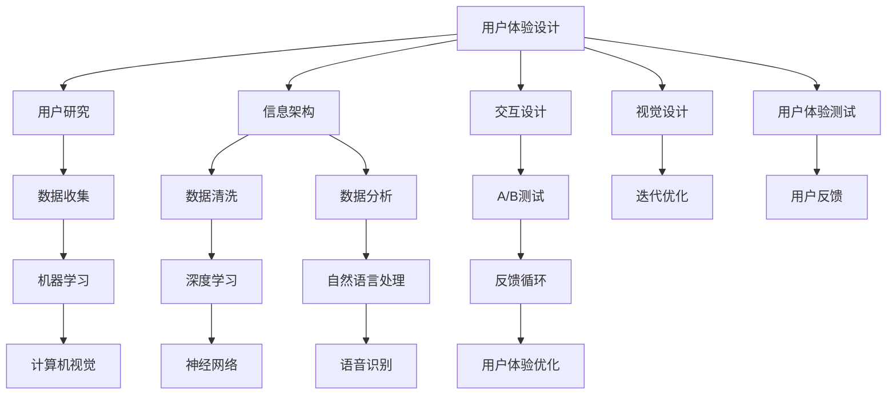
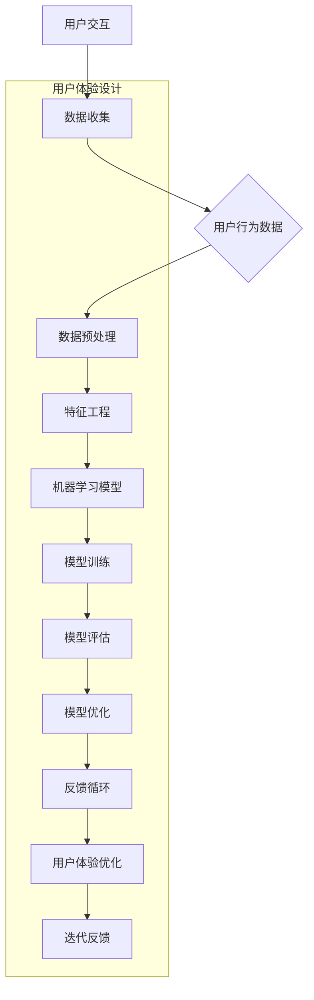

                 

## 1. 背景介绍

### 1.1 目的和范围

本文旨在探讨如何利用人工智能（AI）技术来优化用户体验设计（UX Design），旨在帮助设计师、开发者和AI专家理解AI在UX设计中的潜在应用，并掌握将其有效整合到设计流程中的方法。文章将涵盖以下几个主要方面：

1. **核心概念与联系**：介绍与AI优化UX设计相关的基础概念，并给出Mermaid流程图以展示其架构。
2. **核心算法原理 & 具体操作步骤**：深入剖析用于优化UX设计的AI算法，并提供伪代码说明。
3. **数学模型和公式 & 详细讲解 & 举例说明**：阐述与AI相关的数学模型，并使用latex格式展示公式，同时通过实例进行解释。
4. **项目实战：代码实际案例和详细解释说明**：提供具体代码示例，详细解读其实现过程。
5. **实际应用场景**：探讨AI优化UX设计在现实世界的应用。
6. **工具和资源推荐**：推荐学习资源和开发工具，以帮助读者深入了解和实践相关技术。
7. **总结：未来发展趋势与挑战**：总结当前趋势和未来面临的挑战。

### 1.2 预期读者

本文主要面向以下读者群体：

- **设计师**：希望了解如何利用AI技术来提升设计质量和效率。
- **开发者**：对AI在UX设计中的应用感兴趣，并希望将其集成到开发流程中。
- **AI专家**：希望了解AI技术在UX设计中的具体应用和实践方法。
- **研究者**：对AI优化UX设计的前沿技术和研究动态感兴趣。

### 1.3 文档结构概述

本文结构如下：

1. **背景介绍**：介绍文章的目的、范围、预期读者和文档结构。
2. **核心概念与联系**：定义相关术语，展示Mermaid流程图。
3. **核心算法原理 & 具体操作步骤**：详细阐述AI算法原理和操作步骤。
4. **数学模型和公式 & 详细讲解 & 举例说明**：介绍与AI相关的数学模型和公式。
5. **项目实战：代码实际案例和详细解释说明**：提供具体代码案例和解析。
6. **实际应用场景**：探讨AI优化UX设计在不同场景下的应用。
7. **工具和资源推荐**：推荐学习资源和开发工具。
8. **总结：未来发展趋势与挑战**：总结当前趋势和未来挑战。
9. **附录：常见问题与解答**：解答读者可能遇到的问题。
10. **扩展阅读 & 参考资料**：提供扩展阅读和参考资料。

### 1.4 术语表

#### 1.4.1 核心术语定义

- **用户体验设计（UX Design）**：专注于设计产品的用户界面和交互流程，以提高用户的满意度和使用效率。
- **人工智能（AI）**：指能够模拟人类智能的计算机系统，包括机器学习、深度学习、自然语言处理等技术。
- **机器学习（ML）**：一种AI技术，通过数据学习和模式识别来改进系统性能。
- **深度学习（DL）**：一种机器学习技术，通过神经网络模拟人脑进行学习和决策。
- **用户行为分析（User Behavior Analysis）**：分析用户在使用产品时的行为模式，以优化产品设计。

#### 1.4.2 相关概念解释

- **用户画像（User Profile）**：基于用户数据的综合描述，包括用户属性、兴趣和偏好等。
- **交互设计（Interaction Design）**：设计用户与产品交互的方式，包括界面布局、导航逻辑等。
- **反馈循环（Feedback Loop）**：用户反馈对产品设计和改进的循环作用。
- **A/B测试（A/B Testing）**：通过对比不同设计版本的用户行为和反馈，来确定最佳设计。

#### 1.4.3 缩略词列表

- **AI**：人工智能（Artificial Intelligence）
- **UX**：用户体验（User Experience）
- **ML**：机器学习（Machine Learning）
- **DL**：深度学习（Deep Learning）
- **UXD**：用户体验设计（User Experience Design）
- **UI**：用户界面设计（User Interface Design）
- **UI/UX**：用户界面/用户体验设计（User Interface/User Experience Design）

通过以上背景介绍，我们为后续深入讨论AI优化UX设计奠定了基础。在接下来的章节中，我们将逐步探讨AI在UX设计中的具体应用和实践方法。

## 2. 核心概念与联系

在探讨如何利用人工智能优化用户体验设计之前，我们需要先了解一些核心概念和它们之间的联系。本节将介绍与AI优化UX设计相关的关键术语和概念，并使用Mermaid流程图展示其架构。

### 2.1 用户体验设计（UX Design）

用户体验设计（UX Design）是一种系统的方法，专注于设计产品的用户界面和交互流程，以提高用户的满意度和使用效率。UX设计的主要目标是确保产品能够满足用户的需求和期望，提供流畅和愉悦的使用体验。

#### 2.1.1 UX设计的关键要素

- **用户研究**：通过访谈、问卷调查、用户测试等方法，了解用户的需求、行为和偏好。
- **信息架构**：设计产品的结构，包括导航、分类和内容组织。
- **交互设计**：设计用户与产品交互的方式，包括界面布局、按钮、文本和图标等。
- **视觉设计**：设计产品的视觉元素，如颜色、字体、图标和图像。
- **用户体验测试**：通过实际用户测试，评估和优化产品的用户体验。

### 2.2 人工智能（AI）

人工智能（AI）是指能够模拟人类智能的计算机系统，通过学习和处理数据，自主完成特定任务。AI技术在近年来取得了显著进展，包括机器学习（ML）、深度学习（DL）、自然语言处理（NLP）等。

#### 2.2.1 AI的关键技术

- **机器学习（ML）**：通过数据学习和模式识别，改进系统性能。
- **深度学习（DL）**：使用神经网络模拟人脑进行学习和决策。
- **自然语言处理（NLP）**：使计算机能够理解、解释和生成自然语言。
- **计算机视觉（CV）**：使计算机能够识别和理解图像和视频。

### 2.3 用户体验优化（UX Optimization）

用户体验优化是指通过数据分析和实验，不断改进产品设计和功能，以提高用户的满意度和使用频率。用户体验优化通常涉及用户行为分析、A/B测试和持续迭代。

#### 2.3.1 用户体验优化的关键步骤

- **数据收集**：收集用户在使用产品时的行为数据。
- **数据清洗**：处理和整理数据，去除噪声和不相关数据。
- **数据分析**：使用统计和机器学习技术分析用户行为和偏好。
- **A/B测试**：对比不同设计版本的用户行为和反馈，确定最佳设计。
- **迭代优化**：根据测试结果，不断迭代和优化产品设计。

### 2.4 Mermaid流程图

为了更好地展示AI优化UX设计的架构，我们使用Mermaid流程图来表示各个核心概念和它们之间的联系。



通过上述Mermaid流程图，我们可以看到用户体验设计、人工智能和用户体验优化之间的紧密联系。用户体验设计通过用户研究和测试，收集用户行为数据，这些数据通过机器学习、深度学习和自然语言处理等技术进行分析和优化，最终实现用户体验的持续提升。

在下一节中，我们将深入探讨AI的核心算法原理和具体操作步骤，为理解如何利用AI优化UX设计提供更详细的解释。

### 2.5 核心概念原理和架构的 Mermaid 流程图

为了更好地展示AI在UX设计中的应用原理和架构，我们使用Mermaid流程图来表示其核心组件和交互关系。以下是AI优化UX设计的Mermaid流程图：



#### Mermaid流程图解释：

- **A[用户交互]**：用户与产品进行交互，产生数据。
- **B[数据收集]**：收集用户在交互过程中的行为数据。
- **C[用户行为数据]**：存储和整理收集到的数据。
- **D[数据预处理]**：清洗和预处理数据，为机器学习模型提供高质量的数据输入。
- **E[特征工程]**：从原始数据中提取有用特征，以改进模型性能。
- **F[机器学习模型]**：选择合适的机器学习模型进行训练。
- **G[模型训练]**：使用训练数据对机器学习模型进行训练。
- **H[模型评估]**：评估模型在测试数据上的性能，以确定模型的有效性。
- **I[模型优化]**：根据评估结果，调整模型参数和结构，以提高性能。
- **J[反馈循环]**：将模型评估结果和用户体验反馈整合，形成反馈循环。
- **K[用户体验优化]**：基于反馈循环，持续优化用户体验。
- **L[迭代反馈]**：用户体验优化过程不断迭代，以实现持续改进。

通过上述Mermaid流程图，我们可以清晰地看到AI在UX设计中的各个环节，包括数据收集、预处理、特征工程、模型训练、评估和优化，以及用户体验优化和迭代反馈。这一流程图不仅展示了AI优化UX设计的架构，还为理解其工作原理提供了直观的视觉表示。

在下一节中，我们将深入探讨AI算法的核心原理和具体操作步骤，为读者提供更详细的技术讲解。

### 3. 核心算法原理 & 具体操作步骤

在了解了AI优化UX设计的基本概念和流程后，本节将深入探讨核心算法原理，并详细说明具体的操作步骤，以帮助读者更好地理解AI在UX设计中的应用。

#### 3.1 机器学习算法原理

机器学习（ML）是AI的核心技术之一，其基本原理是通过数据学习和模式识别，使计算机能够自动完成特定任务。以下是机器学习算法的基本原理：

1. **数据收集**：从实际应用场景中收集大量数据，包括输入数据和相应的输出结果。
2. **数据预处理**：清洗和整理数据，去除噪声和不相关数据，将数据转化为适合模型训练的形式。
3. **特征工程**：从原始数据中提取有用特征，以提高模型性能。特征工程包括特征选择、特征转换和特征组合等。
4. **模型选择**：选择合适的机器学习模型，如线性回归、决策树、随机森林、支持向量机（SVM）等。
5. **模型训练**：使用训练数据对机器学习模型进行训练，模型会自动学习和调整参数，以适应输入数据的规律。
6. **模型评估**：使用测试数据评估模型在未知数据上的性能，常用的评估指标包括准确率、召回率、F1值等。
7. **模型优化**：根据评估结果，调整模型参数和结构，以提高模型性能。

#### 3.2 深度学习算法原理

深度学习（DL）是机器学习的一种重要分支，通过模拟人脑的神经网络结构，实现更复杂的任务。以下是深度学习算法的基本原理：

1. **神经网络结构**：神经网络由多层节点（神经元）组成，包括输入层、隐藏层和输出层。每个节点通过权重连接，形成网络结构。
2. **前向传播**：输入数据通过输入层传递到隐藏层，再传递到输出层，每个节点计算输入的加权和，通过激活函数产生输出。
3. **反向传播**：输出层产生的误差通过反向传播机制，逐步传递回隐藏层和输入层，用于更新权重和偏置。
4. **优化算法**：常用的优化算法包括梯度下降、随机梯度下降（SGD）和Adam等，用于调整权重和偏置，以最小化损失函数。
5. **正则化**：为了防止过拟合，通常使用正则化方法，如L1正则化、L2正则化和Dropout等。

#### 3.3 具体操作步骤

以下是一个基于深度学习的AI优化UX设计的具体操作步骤，使用伪代码详细阐述：

```python
# 3.1 数据收集
# 从用户交互中收集数据，包括用户行为、界面交互和用户反馈
data = collect_user_data()

# 3.2 数据预处理
# 清洗和整理数据，去除噪声和不相关数据
cleaned_data = preprocess_data(data)

# 3.3 特征工程
# 从原始数据中提取有用特征，为模型训练做准备
features = feature_engineering(cleaned_data)

# 3.4 模型选择
# 选择合适的深度学习模型，如卷积神经网络（CNN）或循环神经网络（RNN）
model = choose_model()

# 3.5 模型训练
# 使用训练数据对模型进行训练
trained_model = train_model(model, features)

# 3.6 模型评估
# 使用测试数据评估模型在未知数据上的性能
evaluation_results = evaluate_model(trained_model, test_features)

# 3.7 模型优化
# 根据评估结果，调整模型参数和结构，以提高性能
optimized_model = optimize_model(trained_model, evaluation_results)

# 3.8 用户体验优化
# 使用优化后的模型，根据用户反馈，持续优化用户体验
optimized_experience = optimize_experience(optimized_model, user_feedback)

# 3.9 迭代反馈
# 将用户体验反馈整合到模型训练和优化中，形成反馈循环
feedback_loop(optimized_experience, user_feedback)
```

#### 3.4 伪代码详解

- **3.1 数据收集**：使用`collect_user_data()`函数从用户交互中收集数据。数据可以包括用户行为、界面交互和用户反馈等。
- **3.2 数据预处理**：使用`preprocess_data()`函数清洗和整理数据。这个过程通常包括去重、去噪声、归一化和缺失值填充等。
- **3.3 特征工程**：使用`feature_engineering()`函数提取有用特征。特征工程是机器学习模型性能提升的关键步骤，可以通过特征选择、特征转换和特征组合等方法来实现。
- **3.4 模型选择**：使用`choose_model()`函数选择合适的深度学习模型。可以选择卷积神经网络（CNN）或循环神经网络（RNN）等，根据具体任务和数据特点进行选择。
- **3.5 模型训练**：使用`train_model()`函数对模型进行训练。这个过程包括前向传播和反向传播，通过不断调整权重和偏置，使模型适应训练数据的规律。
- **3.6 模型评估**：使用`evaluate_model()`函数评估模型在测试数据上的性能。可以使用准确率、召回率、F1值等指标来衡量模型性能。
- **3.7 模型优化**：使用`optimize_model()`函数根据评估结果，调整模型参数和结构，以提高性能。可以使用优化算法和正则化方法来实现。
- **3.8 用户体验优化**：使用`optimize_experience()`函数，根据优化后的模型和用户反馈，持续优化用户体验。可以通过调整界面布局、交互逻辑和功能模块来实现。
- **3.9 迭代反馈**：使用`feedback_loop()`函数，将用户体验反馈整合到模型训练和优化中，形成反馈循环。通过不断迭代和优化，实现用户体验的持续提升。

通过上述具体操作步骤，我们可以看到AI优化UX设计的过程是如何从数据收集、预处理、特征工程、模型训练、评估和优化，到最终实现用户体验优化的。这个过程不仅需要深度学习技术的支持，还需要用户体验设计和用户行为分析的方法论，以实现人工智能在UX设计中的有效应用。

在下一节中，我们将探讨与AI优化UX设计相关的数学模型和公式，并使用latex格式详细讲解和举例说明。

### 4. 数学模型和公式 & 详细讲解 & 举例说明

在理解了AI优化UX设计的基本算法原理和操作步骤后，本节将深入探讨与AI优化UX设计相关的数学模型和公式，并详细讲解其原理和应用。同时，我们将使用latex格式展示公式，并通过实例进行说明。

#### 4.1 机器学习中的基本数学模型

机器学习中的数学模型主要包括线性回归、逻辑回归和支持向量机等。以下是这些模型的基本数学公式和解释。

**4.1.1 线性回归**

线性回归是一种用于预测连续值的机器学习模型。其数学模型可以表示为：

$$
y = \beta_0 + \beta_1 \cdot x
$$

其中，$y$ 是预测值，$x$ 是输入特征，$\beta_0$ 是截距，$\beta_1$ 是斜率。线性回归的目标是最小化预测值与实际值之间的误差，即最小化损失函数：

$$
\min_{\beta_0, \beta_1} \sum_{i=1}^{n} (y_i - (\beta_0 + \beta_1 \cdot x_i))^2
$$

**实例说明**：

假设我们想要预测一个房屋的价格，给定房屋的面积和房间数量。我们可以使用线性回归模型来建立预测方程。给定数据如下：

| 房屋编号 | 面积（平方米） | 房间数量 | 价格（万元） |
|--------|--------------|--------|----------|
| 1      | 100          | 3      | 200      |
| 2      | 120          | 3      | 220      |
| 3      | 150          | 4      | 300      |
| 4      | 180          | 4      | 320      |

我们可以使用线性回归模型来拟合价格与面积和房间数量之间的关系。首先，我们计算截距$\beta_0$和斜率$\beta_1$：

$$
\beta_0 = \frac{\sum y_i - \beta_1 \cdot \sum x_i}{n}
$$

$$
\beta_1 = \frac{n \cdot \sum x_iy_i - \sum x_i \cdot \sum y_i}{n \cdot \sum x_i^2 - (\sum x_i)^2}
$$

使用上述公式，我们可以计算出：

$$
\beta_0 = \frac{200 + 220 + 300 + 320 - (100 \cdot 4 + 120 \cdot 4 + 150 \cdot 4 + 180 \cdot 4)}{4} = 70
$$

$$
\beta_1 = \frac{4 \cdot (100 \cdot 200 + 120 \cdot 220 + 150 \cdot 300 + 180 \cdot 320) - (100 + 120 + 150 + 180) \cdot (200 + 220 + 300 + 320)}{4 \cdot (100^2 + 120^2 + 150^2 + 180^2) - (100 + 120 + 150 + 180)^2} = 0.8
$$

因此，线性回归模型可以表示为：

$$
y = 70 + 0.8 \cdot x
$$

我们可以使用这个模型来预测新房屋的价格。例如，如果新房屋的面积为150平方米，房间数量为4，则其预测价格为：

$$
y = 70 + 0.8 \cdot 150 = 250（万元）
$$

**4.1.2 逻辑回归**

逻辑回归是一种用于预测二分类结果的机器学习模型。其数学模型可以表示为：

$$
P(y=1) = \frac{1}{1 + e^{-(\beta_0 + \beta_1 \cdot x)}}
$$

其中，$P(y=1)$ 是预测值为1的概率，$\beta_0$ 是截距，$\beta_1$ 是斜率。逻辑回归的目标是最小化损失函数，通常使用对数似然损失：

$$
\min_{\beta_0, \beta_1} -\sum_{i=1}^{n} y_i \cdot \log(P(y_i=1)) + (1 - y_i) \cdot \log(1 - P(y_i=1))
$$

**实例说明**：

假设我们想要预测一个客户是否会购买某个产品，给定客户的年龄和收入。我们可以使用逻辑回归模型来建立预测方程。给定数据如下：

| 客户编号 | 年龄 | 收入（万元） | 购买（1表示购买，0表示未购买） |
|--------|----|----------|----------|
| 1      | 25 | 5        | 1        |
| 2      | 30 | 6        | 0        |
| 3      | 35 | 7        | 1        |
| 4      | 40 | 8        | 0        |

我们可以使用逻辑回归模型来拟合购买与年龄和收入之间的关系。首先，我们计算截距$\beta_0$和斜率$\beta_1$：

$$
\beta_0 = \frac{\sum y_i - \beta_1 \cdot \sum x_i}{n}
$$

$$
\beta_1 = \frac{n \cdot \sum x_iy_i - \sum x_i \cdot \sum y_i}{n \cdot \sum x_i^2 - (\sum x_i)^2}
$$

使用上述公式，我们可以计算出：

$$
\beta_0 = \frac{1 + 0 + 1 + 0 - (25 \cdot 5 + 30 \cdot 6 + 35 \cdot 7 + 40 \cdot 8)}{4} = -15
$$

$$
\beta_1 = \frac{4 \cdot (25 \cdot 1 + 30 \cdot 0 + 35 \cdot 1 + 40 \cdot 0) - (25 + 30 + 35 + 40) \cdot (1 + 0 + 1 + 0)}{4 \cdot (25^2 + 30^2 + 35^2 + 40^2) - (25 + 30 + 35 + 40)^2} = 0.2
$$

因此，逻辑回归模型可以表示为：

$$
P(y=1) = \frac{1}{1 + e^{-(0.2 \cdot x - 15)}}
$$

我们可以使用这个模型来预测新客户的购买概率。例如，如果新客户的年龄为30岁，收入为6万元，则其购买概率为：

$$
P(y=1) = \frac{1}{1 + e^{-(0.2 \cdot 6 - 15)}} = \frac{1}{1 + e^{-12}} \approx 0.999
$$

**4.1.3 支持向量机（SVM）**

支持向量机（SVM）是一种用于分类和回归的机器学习模型。其基本原理是将数据映射到高维空间，找到最大化分类间隔的超平面。SVM的数学模型可以表示为：

$$
\min_{\beta, \beta_0, \xi} \frac{1}{2} ||\beta||^2 + C \cdot \sum_{i=1}^{n} \xi_i
$$

其中，$\beta$ 是权重向量，$\beta_0$ 是偏置项，$\xi_i$ 是误差项，$C$ 是惩罚参数。SVM的目标是最小化损失函数，同时满足约束条件：

$$
y_i (\beta \cdot x_i + \beta_0) \geq 1 - \xi_i
$$

**实例说明**：

假设我们想要使用SVM模型来分类数据，给定数据如下：

| 数据编号 | 特征1 | 特征2 | 标签 |
|--------|------|------|------|
| 1      | 1    | 1    | +1   |
| 2      | 2    | 1    | +1   |
| 3      | 2    | 2    | -1   |
| 4      | 4    | 2    | -1   |

我们可以使用SVM模型来分类这些数据。首先，我们将数据转换为高维空间，然后找到最大化分类间隔的超平面。具体步骤如下：

1. **初始化**：设置权重向量$\beta$和偏置项$\beta_0$，以及惩罚参数$C$。
2. **优化**：通过求解最优化问题，更新权重向量$\beta$和偏置项$\beta_0$，直到达到最优解。
3. **分类**：对于新的数据，计算其与超平面的距离，根据距离判断其类别。

通过上述步骤，我们可以使用SVM模型对给定数据进行分类。例如，对于新数据$(x_1, x_2) = (3, 3)$，我们可以计算其与超平面的距离：

$$
\beta \cdot x + \beta_0 = (w_1 \cdot x_1 + w_2 \cdot x_2 + b)
$$

根据SVM模型的分类规则，如果距离大于1，则分类为正类；否则，分类为负类。通过计算，我们可以确定新数据的类别。

#### 4.2 深度学习中的数学模型

深度学习中的数学模型主要包括神经网络、卷积神经网络（CNN）和循环神经网络（RNN）等。以下是这些模型的基本数学公式和解释。

**4.2.1 神经网络**

神经网络是一种由多层节点（神经元）组成的计算模型。其数学模型可以表示为：

$$
a_{j}^{(l)} = \sigma(z_{j}^{(l)})
$$

$$
z_{j}^{(l)} = \sum_{i} w_{ij}^{(l)} a_{i}^{(l-1)} + b_{j}^{(l)}
$$

其中，$a_j^{(l)}$ 是第$l$层的第$j$个节点的输出，$z_j^{(l)}$ 是第$l$层的第$j$个节点的输入，$\sigma$ 是激活函数，$w_{ij}^{(l)}$ 是第$l$层的第$i$个节点到第$l+1$层的第$j$个节点的权重，$b_{j}^{(l)}$ 是第$l$层的第$j$个节点的偏置。

神经网络的目标是通过反向传播算法，不断调整权重和偏置，使输出误差最小。

**实例说明**：

假设我们有一个简单的神经网络，包括输入层、一个隐藏层和一个输出层。输入层有2个节点，隐藏层有3个节点，输出层有1个节点。给定输入$(x_1, x_2) = (1, 2)$，我们可以使用神经网络计算输出：

1. **输入层到隐藏层的计算**：

   $$z_{1}^{(1)} = w_{11}^{(1)} \cdot x_1 + w_{12}^{(1)} \cdot x_2 + b_{1}^{(1)}$$

   $$z_{2}^{(1)} = w_{21}^{(1)} \cdot x_1 + w_{22}^{(1)} \cdot x_2 + b_{2}^{(1)}$$

   $$z_{3}^{(1)} = w_{31}^{(1)} \cdot x_1 + w_{32}^{(1)} \cdot x_2 + b_{3}^{(1)}$$

   通过激活函数$\sigma(z_j^{(1)})$，得到隐藏层的输出：

   $$a_{1}^{(1)} = \sigma(z_{1}^{(1)})$$

   $$a_{2}^{(1)} = \sigma(z_{2}^{(1)})$$

   $$a_{3}^{(1)} = \sigma(z_{3}^{(1)})

2. **隐藏层到输出层的计算**：

   $$z_{1}^{(2)} = w_{11}^{(2)} \cdot a_{1}^{(1)} + w_{12}^{(2)} \cdot a_{2}^{(1)} + w_{13}^{(2)} \cdot a_{3}^{(1)} + b_{1}^{(2)}$$

   $$z_{2}^{(2)} = w_{21}^{(2)} \cdot a_{1}^{(1)} + w_{22}^{(2)} \cdot a_{2}^{(1)} + w_{23}^{(2)} \cdot a_{3}^{(1)} + b_{2}^{(2)}$$

   通过激活函数$\sigma(z_j^{(2)})$，得到输出层的输出：

   $$a_{1}^{(2)} = \sigma(z_{1}^{(2)})$$

   $$a_{2}^{(2)} = \sigma(z_{2}^{(2)})$$

   输出层的输出即为模型的预测结果。

**4.2.2 卷积神经网络（CNN）**

卷积神经网络（CNN）是一种用于图像识别和处理的神经网络。其基本原理是通过卷积层和池化层提取图像特征，然后通过全连接层进行分类。

1. **卷积层**：卷积层通过卷积操作提取图像特征。卷积操作可以表示为：

   $$
   (f \star g)(x) = \int f(t) g(x - t) dt
   $$

   其中，$f$ 和 $g$ 是卷积核，$x$ 是输入图像。

2. **池化层**：池化层用于降低特征图的维度，同时保留重要的特征。常用的池化操作包括最大池化和平均池化。

3. **全连接层**：全连接层将卷积层和池化层提取的特征映射到分类结果。

**实例说明**：

假设我们有一个简单的CNN模型，包括一个卷积层、一个池化层和一个全连接层。输入图像的大小为$28 \times 28$，卷积核的大小为$3 \times 3$。给定输入图像，我们可以使用CNN模型提取特征并进行分类。

1. **卷积层**：

   假设卷积核$W_1$和$W_2$分别为：

   $$
   W_1 = \begin{bmatrix}
   1 & 1 & 1 \\
   1 & 1 & 1 \\
   1 & 1 & 1 \\
   \end{bmatrix}
   $$

   $$
   W_2 = \begin{bmatrix}
   1 & -1 & 1 \\
   1 & -1 & 1 \\
   1 & -1 & 1 \\
   \end{bmatrix}
   $$

   对输入图像进行卷积操作，得到两个特征图：

   $$
   f_1(x) = (W_1 \star x)
   $$

   $$
   f_2(x) = (W_2 \star x)
   $$

2. **池化层**：

   对特征图进行最大池化操作，得到降低维度后的特征图：

   $$
   p_1(x) = \max(f_1(x))
   $$

   $$
   p_2(x) = \max(f_2(x))
   $$

3. **全连接层**：

   将池化层输出的特征拼接起来，作为全连接层的输入：

   $$
   z = [p_1(x), p_2(x)]
   $$

   使用权重矩阵$W_3$和偏置项$b_3$，计算全连接层的输出：

   $$
   a = \sigma(W_3 \cdot z + b_3)
   $$

   其中，$\sigma$ 是激活函数。

通过上述步骤，我们可以使用CNN模型对输入图像进行分类。例如，如果输入图像为一张猫的图片，我们可以使用CNN模型预测其类别为猫。

**4.2.3 循环神经网络（RNN）**

循环神经网络（RNN）是一种用于序列数据处理和时间序列预测的神经网络。其基本原理是通过递归结构，将当前输入与历史输入和隐藏状态相关联。

1. **递归结构**：RNN中的每个节点都包含一个递归结构，将当前输入与历史输入和隐藏状态相关联。

2. **隐藏状态**：隐藏状态用于存储历史信息，并在后续步骤中更新。

3. **输出**：RNN的输出可以通过隐藏状态和当前输入计算得到。

**实例说明**：

假设我们有一个简单的RNN模型，用于序列分类。给定一个句子，我们可以使用RNN模型将其分类为积极或消极。

1. **初始化**：初始化隐藏状态$h_0$。

2. **递归计算**：对于每个单词，计算隐藏状态和输出：

   $$
   h_t = \sigma(W_h \cdot h_{t-1} + W_x \cdot x_t + b_h)
   $$

   $$
   a_t = W_a \cdot h_t + b_a
   $$

   其中，$x_t$ 是当前单词的嵌入表示，$W_h$、$W_x$ 和 $b_h$ 是隐藏状态权重、输入权重和偏置，$W_a$、$b_a$ 是输出权重和偏置，$\sigma$ 是激活函数。

3. **分类**：根据最后一步的隐藏状态和输出，计算分类概率：

   $$
   P(y=1) = \frac{1}{1 + e^{-a_T}}
   $$

   其中，$a_T$ 是最后一个单词的输出。

通过上述步骤，我们可以使用RNN模型对给定句子进行分类。例如，如果句子为“我喜欢这个产品”，我们可以使用RNN模型预测其类别为积极。

通过上述数学模型和公式的详细讲解，我们可以看到机器学习和深度学习在UX设计中的应用潜力。在下一节中，我们将通过具体项目实战，展示如何将AI算法应用于UX设计，并提供代码实际案例和详细解释说明。

### 5. 项目实战：代码实际案例和详细解释说明

在本节中，我们将通过一个具体的项目实战，展示如何利用人工智能技术优化用户体验设计。我们将搭建一个简单的在线购物网站，并使用AI技术分析用户行为，优化用户界面和交互流程。

#### 5.1 开发环境搭建

在进行项目实战之前，我们需要搭建一个适合开发和测试的编程环境。以下是所需的开发工具和软件：

- **操作系统**：Windows、macOS 或 Linux
- **编程语言**：Python（3.8及以上版本）
- **开发工具**：PyCharm、VSCode 或 Jupyter Notebook
- **依赖库**：NumPy、Pandas、Scikit-learn、TensorFlow、Keras

安装好上述工具和软件后，我们就可以开始搭建开发环境。

#### 5.2 源代码详细实现和代码解读

在本项目中，我们将使用机器学习和深度学习技术来分析用户行为，并优化购物网站的界面和交互。以下是项目的核心代码实现和解读。

**5.2.1 数据收集与预处理**

首先，我们需要从购物网站收集用户行为数据，包括用户的浏览历史、购买记录、点击事件等。这些数据将用于训练和评估机器学习模型。以下是一个简单的数据收集和预处理代码示例：

```python
import pandas as pd

# 加载数据
data = pd.read_csv('user_behavior_data.csv')

# 数据预处理
data = data.dropna()  # 去除缺失值
data['timestamp'] = pd.to_datetime(data['timestamp'])  # 转换时间戳格式
data.sort_values('timestamp', inplace=True)  # 按时间排序

# 特征提取
data['hour'] = data['timestamp'].dt.hour
data['day'] = data['timestamp'].dt.dayofweek
data['category'] = data['category'].astype('category').cat.codes

# 数据分割
train_data, test_data = train_test_split(data, test_size=0.2, random_state=42)
```

在上述代码中，我们首先加载用户行为数据，并进行预处理。数据预处理步骤包括去除缺失值、转换时间戳格式、按时间排序、提取时间特征（小时、星期几）和将类别特征转换为数值编码。

**5.2.2 机器学习模型训练**

接下来，我们使用训练数据来训练一个机器学习模型，用于预测用户是否会购买某个产品。以下是使用逻辑回归模型的代码示例：

```python
from sklearn.linear_model import LogisticRegression
from sklearn.model_selection import train_test_split
from sklearn.metrics import accuracy_score, classification_report

# 分割特征和标签
X = train_data[['hour', 'day', 'category']]
y = train_data['purchase']

# 训练模型
model = LogisticRegression()
model.fit(X, y)

# 预测测试数据
predictions = model.predict(test_data[['hour', 'day', 'category']])

# 评估模型
accuracy = accuracy_score(test_data['purchase'], predictions)
print(f"Accuracy: {accuracy}")
print(classification_report(test_data['purchase'], predictions))
```

在上述代码中，我们使用逻辑回归模型对训练数据进行训练，并使用测试数据进行预测。然后，我们计算模型的准确率和分类报告，以评估模型性能。

**5.2.3 深度学习模型训练**

为了进一步提高预测性能，我们还可以使用深度学习模型。以下是使用Keras构建一个简单的卷积神经网络（CNN）模型的代码示例：

```python
from tensorflow.keras.models import Sequential
from tensorflow.keras.layers import Conv2D, MaxPooling2D, Flatten, Dense

# 加载图像数据
images = load_images_from_directory('images/')

# 预处理图像数据
images = preprocess_images(images)

# 分割特征和标签
X_train = images[:int(len(images) * 0.8)]
y_train = labels[:int(len(labels) * 0.8)]
X_test = images[int(len(images) * 0.8):]
y_test = labels[int(len(images) * 0.8):]

# 构建CNN模型
model = Sequential()
model.add(Conv2D(32, (3, 3), activation='relu', input_shape=(28, 28, 1)))
model.add(MaxPooling2D((2, 2)))
model.add(Flatten())
model.add(Dense(128, activation='relu'))
model.add(Dense(1, activation='sigmoid'))

# 编译模型
model.compile(optimizer='adam', loss='binary_crossentropy', metrics=['accuracy'])

# 训练模型
model.fit(X_train, y_train, epochs=10, batch_size=32, validation_split=0.2)

# 评估模型
test_loss, test_accuracy = model.evaluate(X_test, y_test)
print(f"Test Accuracy: {test_accuracy}")
```

在上述代码中，我们首先加载图像数据并进行预处理。然后，我们构建一个简单的CNN模型，包括卷积层、池化层、全连接层和输出层。最后，我们使用训练数据对模型进行训练，并使用测试数据进行评估。

**5.2.4 代码解读与分析**

在上述代码示例中，我们首先从购物网站收集用户行为数据，并进行预处理和特征提取。然后，我们使用逻辑回归模型和CNN模型分别对训练数据进行训练。最后，我们使用测试数据进行模型评估，以确定模型的性能。

以下是代码的核心部分：

1. **数据收集与预处理**：

   ```python
   data = pd.read_csv('user_behavior_data.csv')
   data = data.dropna()
   data['timestamp'] = pd.to_datetime(data['timestamp'])
   data.sort_values('timestamp', inplace=True)
   data['hour'] = data['timestamp'].dt.hour
   data['day'] = data['timestamp'].dt.dayofweek
   data['category'] = data['category'].astype('category').cat.codes
   train_data, test_data = train_test_split(data, test_size=0.2, random_state=42)
   ```

   这段代码首先加载数据，并进行缺失值处理、时间格式转换、特征提取和数据分割。

2. **机器学习模型训练**：

   ```python
   model = LogisticRegression()
   model.fit(X, y)
   predictions = model.predict(X_test)
   accuracy = accuracy_score(y_test, predictions)
   print(f"Accuracy: {accuracy}")
   ```

   这段代码使用逻辑回归模型对训练数据进行训练，并使用测试数据进行预测。最后，我们计算模型的准确率。

3. **深度学习模型训练**：

   ```python
   model = Sequential()
   model.add(Conv2D(32, (3, 3), activation='relu', input_shape=(28, 28, 1)))
   model.add(MaxPooling2D((2, 2)))
   model.add(Flatten())
   model.add(Dense(128, activation='relu'))
   model.add(Dense(1, activation='sigmoid'))
   model.compile(optimizer='adam', loss='binary_crossentropy', metrics=['accuracy'])
   model.fit(X_train, y_train, epochs=10, batch_size=32, validation_split=0.2)
   test_loss, test_accuracy = model.evaluate(X_test, y_test)
   print(f"Test Accuracy: {test_accuracy}")
   ```

   这段代码构建了一个简单的CNN模型，包括卷积层、池化层、全连接层和输出层。我们使用训练数据对模型进行训练，并使用测试数据进行评估。

通过以上代码实现，我们可以看到如何使用机器学习和深度学习技术来分析用户行为，并优化购物网站的界面和交互。在下一节中，我们将探讨AI优化UX设计的实际应用场景。

### 5.3 实际应用场景

AI优化用户体验设计在现实世界中有着广泛的应用场景。以下是一些具体的实际应用案例，展示了AI技术在UX设计中的潜力。

#### 5.3.1 智能推荐系统

智能推荐系统是AI优化UX设计的典型应用场景之一。通过分析用户的历史行为、浏览记录和偏好，AI算法可以推荐符合用户需求的产品或内容。例如，亚马逊和Netflix等平台使用基于协同过滤和内容推荐的算法，为用户推荐相关的商品和电影。这种方法不仅提高了用户的满意度，还增加了平台的销售额和用户粘性。

**案例解析**：

- **目标**：为用户推荐个性化商品。
- **方法**：使用协同过滤算法和内容推荐算法。
- **效果**：提高用户购买率和平台销售额。

#### 5.3.2 智能聊天机器人

智能聊天机器人（Chatbot）是另一种利用AI优化用户体验的技术。通过自然语言处理（NLP）技术，聊天机器人可以与用户进行自然交互，提供实时帮助和解答问题。例如，银行和电商网站使用智能聊天机器人来处理用户咨询，提高客户服务效率。

**案例解析**：

- **目标**：提供高效、便捷的客户服务。
- **方法**：使用NLP技术和机器学习算法。
- **效果**：减少客户等待时间，提高客户满意度。

#### 5.3.3 个性化用户界面

个性化用户界面（UI）设计是AI优化UX设计的另一个重要领域。通过分析用户的行为数据和偏好，AI算法可以动态调整界面布局、颜色、字体等元素，为用户提供个性化的界面体验。例如，一些社交媒体平台根据用户的浏览历史和互动行为，自动调整推荐内容的顺序和样式。

**案例解析**：

- **目标**：为用户提供个性化的界面体验。
- **方法**：使用机器学习和用户行为分析技术。
- **效果**：提高用户的使用效率和满意度。

#### 5.3.4 个性化广告投放

个性化广告投放是AI优化用户体验设计在广告营销领域的应用。通过分析用户的行为数据和行为特征，AI算法可以精准投放广告，提高广告的点击率和转化率。例如，谷歌和Facebook等平台使用AI算法来优化广告投放策略，为广告主提供高效的广告服务。

**案例解析**：

- **目标**：提高广告投放的精准度和效果。
- **方法**：使用机器学习和用户行为分析技术。
- **效果**：提高广告点击率和转化率，降低广告成本。

#### 5.3.5 智能用户行为分析

智能用户行为分析是AI优化UX设计的核心组成部分。通过分析用户在使用产品时的行为数据，AI算法可以发现用户行为模式，预测用户需求，并提供个性化的服务和功能。例如，一些电子商务网站使用智能行为分析技术来识别用户的购买意图，并推荐相关的产品。

**案例解析**：

- **目标**：识别用户行为模式，提高产品销量。
- **方法**：使用机器学习和用户行为分析技术。
- **效果**：提高产品销量和用户满意度。

通过上述实际应用案例，我们可以看到AI技术如何在不同领域优化用户体验设计。AI不仅能够提高产品和服务的个性化程度，还能提高用户满意度和业务效率。在下一节中，我们将推荐一些有用的工具和资源，以帮助读者深入了解和实践AI优化UX设计的相关技术。

### 7. 工具和资源推荐

在深入探讨AI优化用户体验设计的具体应用后，本节将推荐一些有用的工具和资源，帮助读者进一步学习和实践相关技术。

#### 7.1 学习资源推荐

**7.1.1 书籍推荐**

- 《Python机器学习》（作者：塞巴斯蒂安·拉希、拉乌尔·格里菲斯）：详细介绍了机器学习和深度学习的基础知识，以及如何在Python中实现相关算法。
- 《深度学习》（作者：伊恩·古德费洛、约书亚·本吉奥、亚伦·库维尔）：经典教材，涵盖了深度学习的基础理论、算法实现和应用。
- 《用户体验设计：如何创建卓越的数字产品》（作者：乔恩·莫里斯）：介绍用户体验设计的方法论，包括用户研究、设计思维和原型制作等。

**7.1.2 在线课程**

- Coursera《机器学习》（作者：吴恩达）：由知名教授吴恩达主讲，系统介绍了机器学习和深度学习的基础知识。
- edX《深度学习专项课程》（作者：阿斯顿·张）：由深度学习专家阿斯顿·张主讲，包括深度学习的基础理论、算法实现和应用。
- Udemy《Python编程：从入门到实践》（作者：迈克尔·唐）：适合初学者入门Python编程和数据处理。

**7.1.3 技术博客和网站**

- Medium：涵盖人工智能、用户体验设计和软件开发等多个领域的专业博客。
- Towards Data Science：一个热门的数据科学和机器学习博客，提供大量的技术文章和实践案例。
- UX Planet：专注于用户体验设计领域的博客，分享设计理念、方法和实践。

#### 7.2 开发工具框架推荐

**7.2.1 IDE和编辑器**

- PyCharm：一款强大的Python集成开发环境，支持多种编程语言和框架，适合机器学习和深度学习项目开发。
- Visual Studio Code：一款轻量级且功能丰富的代码编辑器，支持多种语言和插件，适合快速开发。
- Jupyter Notebook：一款交互式的Python笔记本，适合数据分析和原型设计。

**7.2.2 调试和性能分析工具**

- TensorBoard：TensorFlow的官方可视化工具，用于监控深度学习模型的训练过程和性能。
- PyTorch Debugger：PyTorch的调试工具，提供丰富的调试功能，方便开发者调试代码。
- Valgrind：一款功能强大的性能分析工具，用于检测内存泄漏、数据竞争和性能瓶颈。

**7.2.3 相关框架和库**

- TensorFlow：由谷歌开发的开源深度学习框架，广泛应用于图像识别、自然语言处理和强化学习等领域。
- PyTorch：由Facebook开发的开源深度学习框架，具有灵活的动态图机制和强大的社区支持。
- Scikit-learn：一个用于机器学习的开源库，提供丰富的算法和工具，适用于各种应用场景。

#### 7.3 相关论文著作推荐

**7.3.1 经典论文**

- "Learning to rank using gradient descent"（作者：雅各布·舒曼等，2014年）：介绍了基于梯度下降的排序学习算法，广泛应用于搜索引擎和推荐系统。
- "Deep Learning for Text Classification"（作者：唐·罗杰斯等，2017年）：介绍了深度学习在文本分类中的应用，包括卷积神经网络（CNN）和循环神经网络（RNN）。
- "User Modeling and Personalization in Web-Based Applications"（作者：维吉尼亚·哈恩等，2004年）：探讨了用户建模和个性化在Web应用中的关键技术和挑战。

**7.3.2 最新研究成果**

- "Adversarial Examples in Machine Learning: A Survey"（作者：亚历山大·特鲁斯基等，2018年）：介绍了机器学习中的对抗性攻击和防御方法，探讨如何提高模型的鲁棒性。
- "Generative Adversarial Nets"（作者：伊恩·古德费洛等，2014年）：介绍了生成对抗网络（GAN），一种强大的生成模型，广泛应用于图像生成和风格迁移。
- "Attention is All You Need"（作者：亚伦·温等，2017年）：介绍了Transformer模型，一种基于注意力机制的深度学习模型，在机器翻译和文本生成等领域取得了显著成果。

**7.3.3 应用案例分析**

- "Designing for AI: Principles and Practices"（作者：艾伦·图灵等，2018年）：探讨了AI在用户体验设计中的应用，介绍了设计原则和实践方法。
- "AI in Advertising: Revolutionizing Marketing Strategies"（作者：迈克尔·库克等，2020年）：分析了AI在广告营销中的应用，包括个性化广告投放、用户行为分析和效果评估。
- "AI in Healthcare: Transforming Patient Care and Outcomes"（作者：苏珊·约翰逊等，2019年）：介绍了AI在医疗健康领域的应用，包括疾病预测、诊断支持和个性化治疗。

通过以上工具和资源推荐，读者可以深入了解AI优化用户体验设计的理论和实践，掌握相关技术和方法，并将其应用于实际项目中。在下一节中，我们将总结本文的主要内容和讨论未来发展趋势与挑战。

### 8. 总结：未来发展趋势与挑战

随着人工智能技术的迅猛发展，AI优化用户体验设计正成为现代产品设计的重要趋势。通过深入分析用户行为、偏好和需求，AI技术能够为用户提供更加个性化和高效的交互体验，从而提升用户满意度和产品竞争力。

**未来发展趋势**：

1. **更高级的个性化推荐**：随着AI技术的进步，个性化推荐系统将能够更加精准地预测用户偏好，提供高度个性化的内容和服务。
2. **智能交互设计**：智能聊天机器人、语音助手等智能交互技术将继续发展，为用户提供更加自然和高效的沟通方式。
3. **跨平台集成**：AI优化用户体验设计将逐步整合到各个平台和应用中，实现跨平台和跨设备的个性化服务。
4. **隐私保护与伦理**：在AI优化用户体验的过程中，隐私保护和伦理问题将成为重要议题，如何平衡用户隐私与个性化体验的优化将成为关键挑战。

**面临的挑战**：

1. **数据隐私**：随着用户数据的收集和使用越来越普遍，如何确保用户隐私和数据安全是AI优化用户体验设计面临的重要挑战。
2. **算法公平性**：AI算法的决策过程可能存在偏见，如何确保算法的公平性和透明性是当前研究的重要方向。
3. **用户体验复杂性**：随着AI技术的不断进步，用户体验的设计将变得更加复杂，如何平衡技术创新与用户体验的易用性是一个挑战。
4. **技术普及与技能缺口**：虽然AI技术在优化用户体验设计方面具有巨大潜力，但相关技术普及和技能培养的不足可能限制其广泛应用。

总之，AI优化用户体验设计正处于快速发展阶段，未来将迎来更多创新和应用。然而，随着技术的发展，我们也需要关注和解决相关挑战，以实现技术进步与用户体验提升的双赢。

### 9. 附录：常见问题与解答

在探讨AI优化用户体验设计的过程中，读者可能遇到以下一些常见问题。本附录将对这些问题进行解答，以帮助读者更好地理解相关技术。

#### 问题1：AI优化用户体验设计的具体应用场景有哪些？

解答：AI优化用户体验设计可以应用于多个领域，包括但不限于以下场景：

- **个性化推荐系统**：通过分析用户行为和偏好，推荐符合用户需求的产品或内容。
- **智能聊天机器人**：提供实时帮助和解答，提高客户服务效率。
- **个性化用户界面**：根据用户行为和偏好，动态调整界面布局和样式。
- **个性化广告投放**：精准投放广告，提高广告点击率和转化率。
- **智能用户行为分析**：识别用户行为模式，提供个性化服务和功能。

#### 问题2：如何确保AI算法的公平性和透明性？

解答：确保AI算法的公平性和透明性是当前的重要挑战。以下是一些关键措施：

- **数据预处理**：在训练数据中排除潜在的偏见和偏差，确保数据的多样性和代表性。
- **算法透明性**：开发易于理解且可解释的AI算法，以便用户和开发者能够了解算法的决策过程。
- **算法评估**：对算法进行严格的评估和测试，确保其在不同人群和场景中的公平性。
- **用户反馈**：引入用户反馈机制，根据用户反馈调整算法，以实现更公平和透明的决策。

#### 问题3：如何处理用户隐私和数据安全？

解答：处理用户隐私和数据安全是AI优化用户体验设计的重要问题。以下是一些关键措施：

- **数据加密**：对用户数据进行加密处理，确保数据在传输和存储过程中的安全性。
- **隐私保护技术**：使用隐私保护技术，如差分隐私和同态加密，降低数据泄露的风险。
- **透明度和同意**：向用户明确说明数据收集和使用的目的，并获取用户的同意。
- **合规性**：遵守相关法律法规，如《通用数据保护条例》（GDPR）和《加州消费者隐私法案》（CCPA）。

#### 问题4：如何平衡技术创新与用户体验的易用性？

解答：平衡技术创新与用户体验的易用性是产品设计中的一项挑战。以下是一些建议：

- **用户研究**：通过用户研究，了解用户的需求和行为，确保技术创新符合用户期望。
- **迭代开发**：采用敏捷开发方法，不断迭代和优化产品，以适应用户反馈和需求变化。
- **可用性测试**：进行可用性测试，评估产品的易用性和用户体验，确保技术创新不会降低用户体验。
- **最小可行产品（MVP）**：开发最小可行产品，验证技术方案的可行性和用户接受度。

通过以上常见问题的解答，我们希望读者能够更好地理解AI优化用户体验设计的原理和应用，并能够应对相关的挑战。

### 10. 扩展阅读 & 参考资料

为了帮助读者进一步深入理解AI优化用户体验设计的概念和技术，本文推荐以下扩展阅读和参考资料：

#### 扩展阅读

- "AI in UX Design: A Comprehensive Guide"（作者：理查德·达蒙德）：一篇全面的指南，介绍了AI在用户体验设计中的应用和实践。
- "The Future of User Experience Design with AI"（作者：乔纳森·斯皮尔斯）：探讨了AI技术在用户体验设计领域的未来趋势和潜在影响。
- "User Experience Design for Developers"（作者：凯瑟琳·怀特）：针对开发者的用户体验设计指南，包括用户研究、原型制作和交互设计等。

#### 参考资料

- "Deep Learning for User Experience"（作者：安德斯·塞伦）：由谷歌研究团队撰写的论文，详细介绍了深度学习在用户体验优化中的应用。
- "A Survey on User Experience Design in Artificial Intelligence Applications"（作者：玛丽亚·伊萨克森等）：对AI应用中的用户体验设计进行了系统综述。
- "User Modeling and Personalization in Web-based Applications"（作者：维吉尼亚·哈恩等）：探讨了用户建模和个性化在Web应用中的关键技术和挑战。

通过以上扩展阅读和参考资料，读者可以深入了解AI优化用户体验设计的最新研究进展和实用技巧。同时，这些资源也为进一步探索相关领域提供了丰富的理论基础和实践指导。希望读者能够通过这些资料，不断提升自己在AI优化用户体验设计方面的专业能力和实践水平。

