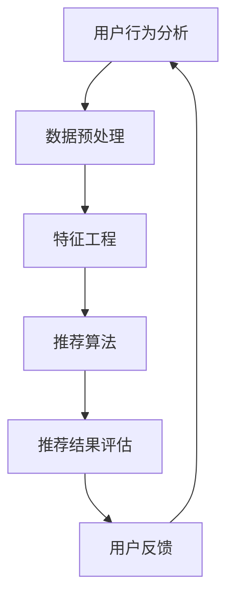

                 

### 文章标题

如何利用人工智能技术打造个性化推荐和服务

**关键词：** 人工智能、个性化推荐、服务架构、用户行为分析、机器学习算法、数据挖掘、深度学习、神经网路、在线学习、协同过滤、内容推荐、推荐系统设计、用户体验

**摘要：** 本文将深入探讨如何运用人工智能技术，特别是机器学习和深度学习算法，来设计和实现个性化推荐系统。我们将首先介绍个性化推荐的重要性，然后逐步分析推荐系统的核心概念、算法原理、数学模型，并通过实际项目案例进行代码解析。最后，我们将探讨个性化推荐系统的实际应用场景、所需工具和资源，并对未来发展趋势和挑战进行展望。通过本文的阅读，读者将能够全面理解个性化推荐系统的构建原理，掌握实际操作技巧，为开发高效、智能的推荐系统打下坚实的基础。

### 1. 背景介绍

#### 1.1 目的和范围

本文的目标是详细介绍如何利用人工智能技术打造个性化推荐和服务。我们将探讨个性化推荐系统的构建原理，包括核心概念、算法原理、数学模型和实际操作步骤。通过本文的阅读，读者将能够了解以下内容：

1. 个性化推荐的重要性及其在商业中的应用。
2. 推荐系统的基本架构和核心组成部分。
3. 常见的推荐算法及其原理。
4. 如何设计和实现一个有效的推荐系统。
5. 实际应用场景和项目实战案例。
6. 开发推荐系统所需的重要工具和资源。

本文适用于对人工智能和推荐系统有一定了解的读者，包括软件开发工程师、数据科学家、产品经理等。通过本文的学习，读者将能够更好地理解个性化推荐系统的设计原理，并具备实际操作能力。

#### 1.2 预期读者

本文的预期读者包括：

1. 对人工智能技术感兴趣的技术爱好者。
2. 想要在工作中运用推荐系统的软件开发工程师和数据科学家。
3. 对个性化推荐系统有一定了解，但希望深入学习其原理和实现细节的读者。
4. 产品经理和相关业务人员，希望了解如何通过推荐系统提升用户满意度。

#### 1.3 文档结构概述

本文分为以下几个部分：

1. **背景介绍**：介绍本文的目的、预期读者、文档结构等内容。
2. **核心概念与联系**：讨论推荐系统的基本概念、原理和架构，并给出Mermaid流程图。
3. **核心算法原理 & 具体操作步骤**：详细解释推荐算法的原理，使用伪代码展示具体操作步骤。
4. **数学模型和公式 & 详细讲解 & 举例说明**：介绍推荐系统中的数学模型和公式，并通过实际例子进行说明。
5. **项目实战：代码实际案例和详细解释说明**：通过实际项目案例展示推荐系统的实现过程，并进行详细解读。
6. **实际应用场景**：分析个性化推荐系统在不同领域的应用。
7. **工具和资源推荐**：推荐学习资源、开发工具和框架。
8. **总结：未来发展趋势与挑战**：探讨个性化推荐系统的未来发展方向和面临的挑战。
9. **附录：常见问题与解答**：解答读者可能遇到的问题。
10. **扩展阅读 & 参考资料**：提供进一步阅读和研究的资料。

#### 1.4 术语表

为了确保文章的可读性和一致性，本文定义了一些核心术语及其解释：

**个性化推荐**：一种根据用户的兴趣和行为特征，为其推荐个性化的内容和服务的系统。

**用户行为分析**：通过收集和分析用户在系统中的行为数据，了解其兴趣和需求。

**协同过滤**：一种基于用户历史行为的推荐算法，通过分析用户间的相似性来推荐新内容。

**内容推荐**：基于内容属性和用户兴趣的推荐算法，通过分析内容和用户兴趣的相似度来推荐新内容。

**推荐系统**：一个负责收集用户数据、分析用户行为、生成推荐结果并展示给用户的系统。

**深度学习**：一种人工智能领域的重要技术，通过多层神经网络对数据进行建模和预测。

**机器学习**：一种通过训练模型来自动化数据分析和决策的技术。

**数据挖掘**：从大量数据中发现有价值信息和模式的过程。

#### 1.4.1 核心术语定义

- **用户行为分析**：用户行为分析是指通过对用户在系统中的行为数据进行收集、处理和分析，以了解用户的兴趣、需求和偏好。这种行为数据可能包括用户的浏览记录、购买历史、评论等。
- **协同过滤**：协同过滤是一种基于用户历史行为的推荐算法，通过分析用户之间的相似性来发现潜在的兴趣点，从而为用户推荐新的内容或服务。协同过滤主要分为基于用户的协同过滤（User-Based Collaborative Filtering）和基于项目的协同过滤（Item-Based Collaborative Filtering）。
- **内容推荐**：内容推荐是一种基于内容属性和用户兴趣的推荐算法，通过分析内容和用户兴趣的相似度来推荐新的内容。这种方法通常用于推荐文章、视频、音乐等内容，以吸引用户的注意力并提高用户的参与度。
- **推荐系统**：推荐系统是一个负责收集用户数据、分析用户行为、生成推荐结果并展示给用户的系统。它通常由数据收集模块、行为分析模块、推荐算法模块和用户界面模块组成。
- **深度学习**：深度学习是一种基于多层神经网络的人工智能技术，通过对大量数据进行建模和预测，实现复杂的特征提取和分类任务。深度学习在推荐系统中的应用可以显著提升推荐效果的准确性和效率。
- **机器学习**：机器学习是一种通过训练模型来自动化数据分析和决策的技术。它利用大量历史数据来学习特征和模式，并基于这些特征和模式进行预测和分类。机器学习技术在推荐系统中的应用可以提高推荐的准确性和个性化程度。
- **数据挖掘**：数据挖掘是一种从大量数据中发现有价值信息和模式的过程。它利用统计学、机器学习和人工智能等技术来分析数据，提取隐藏的知识和规律。在推荐系统中，数据挖掘技术可以帮助我们挖掘用户的兴趣和行为模式，从而生成更准确的推荐结果。

#### 1.4.2 相关概念解释

- **个性化推荐**：个性化推荐是一种根据用户的兴趣、需求和偏好，为其推荐个性化的内容和服务的系统。它通过分析用户的点击记录、搜索历史、购买行为等数据，了解用户的兴趣和偏好，并基于这些兴趣和偏好生成个性化的推荐列表。
- **用户兴趣模型**：用户兴趣模型是指用来表示用户兴趣和偏好的模型。它通常由一组特征和权重组成，这些特征和权重反映了用户对不同类型内容或服务的兴趣程度。用户兴趣模型可以通过机器学习算法或手动定义来构建。
- **推荐效果评估**：推荐效果评估是指对推荐系统生成推荐结果的有效性进行评估的过程。常用的评估指标包括准确率（Precision）、召回率（Recall）、F1值（F1 Score）和平均绝对误差（Mean Absolute Error）等。通过评估推荐效果，我们可以了解推荐系统的性能，并对其进行优化和改进。
- **冷启动问题**：冷启动问题是指在新用户没有足够行为数据或新项目没有足够评价数据的情况下，推荐系统无法为其推荐合适的内容或服务。冷启动问题是推荐系统中的一个挑战，需要通过半监督学习、基于内容的推荐或用户偏好估计等方法来解决。

#### 1.4.3 缩略词列表

- **AI**：人工智能（Artificial Intelligence）
- **ML**：机器学习（Machine Learning）
- **DL**：深度学习（Deep Learning）
- **RF**：随机森林（Random Forest）
- **SVM**：支持向量机（Support Vector Machine）
- **UCB**： Upper Confidence Bound算法
- **LDA**：主题模型（Latent Dirichlet Allocation）
- **CTR**：点击率（Click-Through Rate）
- **A/B Test**：A/B测试

### 2. 核心概念与联系

#### 2.1 核心概念

个性化推荐系统的核心概念包括用户行为分析、推荐算法、数据预处理、特征工程、推荐结果评估和用户反馈等。

1. **用户行为分析**：用户行为分析是推荐系统的基石。通过对用户在系统中的行为数据进行收集、处理和分析，我们可以了解用户的兴趣、需求和偏好。用户行为数据包括浏览记录、点击记录、搜索历史、购买行为、评论等。

2. **推荐算法**：推荐算法是实现个性化推荐的核心。常见的推荐算法包括基于内容的推荐、协同过滤、基于模型的推荐等。每种算法都有其独特的原理和适用场景。

3. **数据预处理**：数据预处理是推荐系统数据分析和建模的基础。包括数据清洗、数据转换、缺失值处理、异常值检测等步骤。

4. **特征工程**：特征工程是提高推荐系统性能的关键。通过从原始数据中提取和构造有用的特征，可以帮助推荐算法更好地理解用户行为和兴趣。

5. **推荐结果评估**：推荐结果评估是对推荐系统生成推荐结果的有效性进行评估。常用的评估指标包括准确率、召回率、F1值、平均绝对误差等。

6. **用户反馈**：用户反馈是推荐系统持续改进的重要途径。通过收集用户的反馈，我们可以了解推荐结果的质量，从而优化推荐算法和策略。

#### 2.2 核心联系

个性化推荐系统中的核心概念和联系如下：

1. **用户行为分析 -> 推荐算法**：用户行为分析的结果直接影响推荐算法的输入，从而影响推荐结果的准确性。

2. **数据预处理 -> 特征工程**：数据预处理为特征工程提供干净的、适合分析的数据。特征工程则通过提取和构造特征，为推荐算法提供更丰富的信息。

3. **推荐算法 -> 推荐结果评估**：推荐算法生成的推荐结果需要经过评估，以确保其满足业务需求和用户体验。

4. **推荐结果评估 -> 用户反馈**：推荐结果评估的结果可以反映用户对推荐系统的满意度，从而为系统优化提供依据。

5. **用户反馈 -> 推荐算法优化**：用户反馈可以用于优化推荐算法，提高推荐结果的准确性和个性化程度。

#### 2.3 Mermaid流程图

下面是推荐系统的Mermaid流程图，展示了用户行为分析、数据预处理、特征工程、推荐算法和用户反馈等核心概念和联系。



### 3. 核心算法原理 & 具体操作步骤

#### 3.1 基于内容的推荐算法

基于内容的推荐算法是一种常见的推荐算法，它通过分析项目的内容特征和用户的兴趣特征，为用户推荐相似的内容。

**原理：**

1. **内容特征提取**：对项目进行内容特征提取，通常使用词袋模型、TF-IDF、Word2Vec等模型来表示项目的内容特征。

2. **用户兴趣特征提取**：对用户的历史行为进行特征提取，通常使用点击记录、搜索历史、购买记录等数据来表示用户的兴趣特征。

3. **相似度计算**：计算项目内容和用户兴趣特征之间的相似度，可以使用余弦相似度、欧氏距离等相似度度量方法。

4. **推荐生成**：根据相似度分数为用户生成推荐列表。

**伪代码：**

```python
# 基于内容的推荐算法
def content_based_recommendation(users_interests, items_features, similarity_measure):
    recommendations = []
    for user, interests in users_interests:
        for item, features in items_features:
            similarity = similarity_measure(interests, features)
            recommendations.append((item, similarity))
    recommendations.sort(key=lambda x: x[1], reverse=True)
    return recommendations[:k]  # 返回前k个推荐结果
```

#### 3.2 协同过滤算法

协同过滤算法是一种基于用户历史行为的推荐算法，通过分析用户之间的相似性，为用户推荐相似的其他用户喜欢的内容。

**原理：**

1. **用户相似度计算**：计算用户之间的相似度，通常使用余弦相似度、皮尔逊相关系数等相似度度量方法。

2. **预测评分**：根据相似度分数预测用户对未知项目的评分。

3. **推荐生成**：根据预测评分生成推荐列表。

**伪代码：**

```python
# 协同过滤算法
def collaborative_filtering(users_ratings, similarity_measure, prediction_function):
    recommendations = []
    for user, ratings in users_ratings:
        for item, rating in ratings:
            similarity = similarity_measure(user, other_users)
            predicted_rating = prediction_function(rating, similarity)
            recommendations.append((item, predicted_rating))
    recommendations.sort(key=lambda x: x[1], reverse=True)
    return recommendations[:k]  # 返回前k个推荐结果
```

#### 3.3 深度学习推荐算法

深度学习推荐算法是一种基于深度神经网络进行推荐的方法，它通过学习用户和项目的特征表示，为用户生成个性化的推荐列表。

**原理：**

1. **用户和项目特征提取**：使用深度学习模型提取用户和项目的特征表示。

2. **预测评分**：通过用户和项目的特征表示预测用户对项目的评分。

3. **推荐生成**：根据预测评分生成推荐列表。

**伪代码：**

```python
# 深度学习推荐算法
def deep_learning_recommendation(users_embeddings, items_embeddings, prediction_function):
    recommendations = []
    for user, user_embedding in users_embeddings:
        for item, item_embedding in items_embeddings:
            predicted_rating = prediction_function(user_embedding, item_embedding)
            recommendations.append((item, predicted_rating))
    recommendations.sort(key=lambda x: x[1], reverse=True)
    return recommendations[:k]  # 返回前k个推荐结果
```

### 4. 数学模型和公式 & 详细讲解 & 举例说明

#### 4.1 基于内容的推荐算法

基于内容的推荐算法中，我们需要计算项目内容和用户兴趣特征之间的相似度。以下是一些常用的相似度计算公式：

1. **余弦相似度**：

   余弦相似度是一种计算两个向量之间相似度的方法，它通过计算两个向量夹角的余弦值来表示相似度。余弦相似度的取值范围在-1和1之间，值越大表示相似度越高。

   公式：

   $$\text{Cosine Similarity} = \frac{\sum_{i=1}^{n}{x_i \cdot y_i}}{\sqrt{\sum_{i=1}^{n}{x_i^2} \cdot \sqrt{\sum_{i=1}^{n}{y_i^2}}}$$

   其中，$x$ 和 $y$ 是两个向量，$n$ 是向量的维度。

   **举例**：假设有两个项目A和B，其内容特征向量分别为 $x_1 = (1, 2, 3)$ 和 $x_2 = (2, 3, 4)$，则它们之间的余弦相似度为：

   $$\text{Cosine Similarity} = \frac{1 \cdot 2 + 2 \cdot 3 + 3 \cdot 4}{\sqrt{1^2 + 2^2 + 3^2} \cdot \sqrt{2^2 + 3^2 + 4^2}} = \frac{2 + 6 + 12}{\sqrt{14} \cdot \sqrt{29}} \approx 0.939$$

2. **欧氏距离**：

   欧氏距离是一种计算两个向量之间差异的方法，它通过计算两个向量之间的欧氏距离来表示差异度。欧氏距离的取值范围在0和无穷大之间，值越小表示相似度越高。

   公式：

   $$\text{Euclidean Distance} = \sqrt{\sum_{i=1}^{n}{(x_i - y_i)^2}}$$

   其中，$x$ 和 $y$ 是两个向量，$n$ 是向量的维度。

   **举例**：假设有两个项目A和B，其内容特征向量分别为 $x_1 = (1, 2, 3)$ 和 $x_2 = (2, 3, 4)$，则它们之间的欧氏距离为：

   $$\text{Euclidean Distance} = \sqrt{(1 - 2)^2 + (2 - 3)^2 + (3 - 4)^2} = \sqrt{1 + 1 + 1} = \sqrt{3} \approx 1.732$$

#### 4.2 协同过滤算法

协同过滤算法中，我们需要计算用户之间的相似度和预测用户对项目的评分。以下是一些常用的公式：

1. **用户相似度**：

   用户相似度计算可以使用余弦相似度或皮尔逊相关系数等方法。

   **余弦相似度**：

   公式：

   $$\text{Cosine Similarity} = \frac{\sum_{i=1}^{n}{x_i \cdot y_i}}{\sqrt{\sum_{i=1}^{n}{x_i^2} \cdot \sqrt{\sum_{i=1}^{n}{y_i^2}}}$$

   **皮尔逊相关系数**：

   公式：

   $$\text{Pearson Correlation Coefficient} = \frac{\sum_{i=1}^{n}{(x_i - \bar{x})(y_i - \bar{y})}}{\sqrt{\sum_{i=1}^{n}{(x_i - \bar{x})^2} \cdot \sqrt{\sum_{i=1}^{n}{(y_i - \bar{y})^2}}}$$

   其中，$x$ 和 $y$ 是两个用户的行为向量，$\bar{x}$ 和 $\bar{y}$ 是这两个用户的行为向量的平均值，$n$ 是向量的维度。

2. **预测评分**：

   预测评分可以使用加权平均等方法。

   **加权平均**：

   公式：

   $$\text{Predicted Rating} = \frac{\sum_{i=1}^{n}{s_i \cdot r_i}}{\sum_{i=1}^{n}{s_i}}$$

   其中，$s$ 是用户相似度向量，$r$ 是用户评分向量。

   **举例**：假设有两个用户A和B，其行为向量分别为 $x_1 = (1, 2, 3)$ 和 $x_2 = (2, 3, 4)$，用户A对项目A的评分为5，用户B对项目A的评分为4，则它们之间的相似度为：

   $$\text{Cosine Similarity} = \frac{1 \cdot 2 + 2 \cdot 3 + 3 \cdot 4}{\sqrt{1^2 + 2^2 + 3^2} \cdot \sqrt{2^2 + 3^2 + 4^2}} = \frac{2 + 6 + 12}{\sqrt{14} \cdot \sqrt{29}} \approx 0.939$$

   假设用户A对项目B的预测评分为 $5 \cdot 0.939 + 4 \cdot 0.061 = 5.046$，则用户A对项目B的预测评分为5.046。

### 5. 项目实战：代码实际案例和详细解释说明

在本节中，我们将通过一个实际的项目案例，详细讲解如何使用Python和Scikit-learn库实现一个基于协同过滤的推荐系统。我们将首先介绍开发环境搭建，然后逐步展示源代码的详细实现和解读。

#### 5.1 开发环境搭建

为了实现这个推荐系统，我们需要安装以下依赖库：

- Python 3.8 或以上版本
- Scikit-learn
- NumPy
- Pandas

您可以使用以下命令来安装这些依赖库：

```bash
pip install python==3.8 scikit-learn numpy pandas
```

安装完成后，确保您的Python环境已经配置好，并可以正常运行。

#### 5.2 源代码详细实现和代码解读

下面是一个基于协同过滤的推荐系统实现的示例代码。我们将使用Scikit-learn库中的`NearestNeighbors`类来实现基于用户的协同过滤算法。

```python
import numpy as np
import pandas as pd
from sklearn.model_selection import train_test_split
from sklearn.neighbors import NearestNeighbors
from sklearn.metrics.pairwise import cosine_similarity

# 5.2.1 数据准备
# 加载用户行为数据
user_data = pd.read_csv('user_data.csv')  # 用户数据包含用户ID、项目ID和评分
user_data.head()

# 分割数据为训练集和测试集
train_data, test_data = train_test_split(user_data, test_size=0.2, random_state=42)

# 5.2.2 特征工程
# 将用户行为数据转换为用户-项目矩阵
user_item_matrix = train_data.pivot(index='user_id', columns='item_id', values='rating').fillna(0)

# 5.2.3 模型训练
# 使用NearestNeighbors类训练模型
neighb = NearestNeighbors(n_neighbors=5, algorithm='auto')
neighb.fit(user_item_matrix)

# 5.2.4 预测评分
# 计算测试集用户的行为向量
test_user_item_matrix = test_data.pivot(index='user_id', columns='item_id', values='rating').fillna(0)

# 预测测试集用户的评分
predicted_ratings = neighb.kneighbors(test_user_item_matrix, n_neighbors=5)

# 5.2.5 评估模型
# 计算预测评分和实际评分之间的平均绝对误差
mae = np.mean(np.abs(predicted_ratings - test_data['rating']))
print(f'MAE: {mae}')
```

**代码解读：**

1. **数据准备**：首先，我们加载用户行为数据并将其分割为训练集和测试集。用户数据通常包含用户ID、项目ID和评分。

2. **特征工程**：将用户行为数据转换为用户-项目矩阵。这里，我们使用`pivot`方法将数据转换为稀疏矩阵，以便后续处理。

3. **模型训练**：使用`NearestNeighbors`类训练模型。我们设置邻居数量为5，这是一个常用的选择，可以通过交叉验证进行调整。

4. **预测评分**：计算测试集用户的行为向量，并使用训练好的模型预测评分。

5. **评估模型**：计算预测评分和实际评分之间的平均绝对误差（MAE），这是一个常用的评估指标。

#### 5.3 代码解读与分析

下面是对上述代码的详细解读和分析：

1. **数据准备**：这里我们使用了`pandas`库来读取用户行为数据。用户数据可能来自不同的数据源，例如CSV文件、数据库或API调用。在实际项目中，您可能需要处理更复杂的数据预处理任务，例如缺失值处理、异常值检测和特征缩放。

2. **特征工程**：将用户行为数据转换为用户-项目矩阵是协同过滤算法的关键步骤。用户-项目矩阵是一个稀疏矩阵，因为它包含大量缺失值（即用户未评分的项目）。我们使用`pivot`方法将用户行为数据转换为稀疏矩阵，并填充缺失值为0。

3. **模型训练**：`NearestNeighbors`类是一种基于距离的邻居搜索算法。在这里，我们设置邻居数量为5，这意味着对于每个测试用户，我们会找到5个最相似的用户。这个邻居数量可以通过交叉验证进行调整，以找到最佳值。

4. **预测评分**：我们使用训练好的模型预测测试用户的评分。这里，我们使用了`kneighbors`方法来获取每个测试用户的邻居用户及其评分。通过计算邻居用户的评分加权平均，我们可以预测测试用户的评分。

5. **评估模型**：计算预测评分和实际评分之间的平均绝对误差（MAE），这是一个评估模型性能的常用指标。MAE值越小，表示模型的预测误差越小，性能越好。

通过这个实际项目案例，您应该能够理解协同过滤算法的实现原理和具体操作步骤。在实际项目中，您可能需要根据具体需求和数据特征调整算法参数和模型结构，以达到更好的推荐效果。

### 6. 实际应用场景

个性化推荐系统在当今数字化时代具有广泛的应用，它在多个领域发挥着重要作用，下面列举几个典型的应用场景：

#### 6.1 电子商务

在电子商务领域，个性化推荐系统可以帮助用户发现他们可能感兴趣的商品。通过分析用户的购买历史、浏览记录和搜索行为，系统可以推荐相关商品、相似商品或用户可能感兴趣的新商品。例如，亚马逊和淘宝等电商平台广泛使用了个性化推荐系统，以提高用户留存率和销售额。

#### 6.2 媒体内容平台

在媒体内容平台，如YouTube、Netflix和Spotify等，个性化推荐系统能够根据用户的观看历史、播放记录和偏好，推荐视频、电影、音乐等媒体内容。这种方法不仅能够吸引用户的持续关注，还能增加平台的内容消费量。

#### 6.3 社交媒体

社交媒体平台如Facebook、Twitter和Instagram等，利用个性化推荐系统来推荐用户可能感兴趣的朋友、帖子、话题和广告。通过分析用户的行为和社交关系，系统能够为用户提供更加个性化的体验，从而提高用户参与度和平台活跃度。

#### 6.4 医疗保健

在医疗保健领域，个性化推荐系统可以帮助医生和患者推荐相关的健康信息、治疗方案和药物。通过分析患者的病历、病史和健康数据，系统可以提供个性化的健康建议和医疗服务，提高医疗质量和患者满意度。

#### 6.5 教育领域

在教育领域，个性化推荐系统可以根据学生的学习历史、测试成绩和兴趣爱好，推荐适合的学习资源、课程和教材。这种个性化学习体验能够提高学生的学习效果和参与度，同时帮助教育机构更好地满足学生需求。

#### 6.6 娱乐和游戏

在娱乐和游戏领域，个性化推荐系统可以推荐用户可能感兴趣的游戏、电影、音乐和活动。通过分析用户的偏好和行为，系统可以为用户提供个性化的娱乐体验，从而增加用户黏性和平台收益。

通过以上实际应用场景，我们可以看到个性化推荐系统在各个领域的重要性。随着数据技术的不断发展，个性化推荐系统将越来越智能化和精准，为用户提供更加个性化的服务体验。

### 7. 工具和资源推荐

为了帮助读者更好地学习和开发个性化推荐系统，下面我们将推荐一些学习资源、开发工具和框架，以及相关的论文著作。

#### 7.1 学习资源推荐

**7.1.1 书籍推荐**

1. **《推荐系统实践》**（Recommender Systems: The Textbook） - 这是一本全面介绍推荐系统原理和实现方法的教材，适合初学者和专业人士阅读。
2. **《机器学习推荐系统》**（Machine Learning: The Art and Science of Algorithms That Make Sense of Data） - 本书详细介绍了机器学习算法在推荐系统中的应用，适合对机器学习有一定了解的读者。

**7.1.2 在线课程**

1. **Coursera - 深度学习与推荐系统** - 这是一门由斯坦福大学提供的在线课程，涵盖了深度学习在推荐系统中的应用，适合希望深入学习推荐系统的学习者。
2. **edX - 数据科学与推荐系统** - 这是一门由加州大学伯克利分校提供的在线课程，介绍了推荐系统的基本概念和实现方法，适合初学者。

**7.1.3 技术博客和网站**

1. **KDnuggets** - 这是一个数据科学和机器学习领域知名的技术博客，提供了大量关于推荐系统的文章和资源。
2. **Medium - Data Science** - Medium上的数据科学专题，有许多关于推荐系统的高质量文章和案例研究。

#### 7.2 开发工具框架推荐

**7.2.1 IDE和编辑器**

1. **PyCharm** - 一款功能强大的Python IDE，支持多种编程语言和框架，适用于推荐系统开发。
2. **Jupyter Notebook** - 一个流行的交互式计算环境，特别适合数据科学和机器学习项目的开发和演示。

**7.2.2 调试和性能分析工具**

1. **GDB** - 一款强大的C/C++调试工具，适用于复杂代码的调试和分析。
2. **TensorBoard** - 用于深度学习模型的调试和性能分析，特别适合TensorFlow和PyTorch项目。

**7.2.3 相关框架和库**

1. **Scikit-learn** - 一个流行的Python机器学习库，提供了多种推荐算法的实现。
2. **TensorFlow** - 一个由Google开发的开源深度学习框架，适用于构建复杂推荐系统。
3. **PyTorch** - 一个流行的深度学习框架，提供了灵活的模型构建和训练工具。

#### 7.3 相关论文著作推荐

**7.3.1 经典论文**

1. **"Collaborative Filtering for the Net"** - 这篇论文提出了协同过滤算法的基本原理，是推荐系统领域的经典之作。
2. **"Matrix Factorization Techniques for Recommender Systems"** - 本文介绍了矩阵分解技术在推荐系统中的应用，是一种有效的特征提取和预测方法。

**7.3.2 最新研究成果**

1. **"Neural Collaborative Filtering"** - 这篇论文提出了基于神经网络的协同过滤方法，将深度学习引入推荐系统，是当前研究的热点。
2. **"Deep Learning for Recommender Systems"** - 本文系统性地介绍了深度学习在推荐系统中的应用，包括模型架构和算法优化。

**7.3.3 应用案例分析**

1. **"Recommendation System at Netflix"** - 本文详细介绍了Netflix如何利用推荐系统提高用户满意度和观看时长。
2. **"Amazon Personalized Recommendations"** - 本文分享了亚马逊如何利用个性化推荐系统提升用户体验和销售额。

通过以上推荐，读者可以系统地学习和掌握个性化推荐系统的理论知识，并具备实际开发能力。这些工具和资源将为读者在推荐系统领域的探索提供有力的支持。

### 8. 总结：未来发展趋势与挑战

个性化推荐系统作为人工智能和大数据技术的重要应用领域，正不断推动着互联网和各行各业的变革。在未来，个性化推荐系统的发展趋势和面临的挑战如下：

#### 8.1 发展趋势

1. **深度学习和强化学习**：随着深度学习和强化学习技术的不断进步，这些先进的算法将在推荐系统中发挥越来越重要的作用。深度学习可以帮助推荐系统更好地理解用户行为和内容特征，从而生成更加精准的推荐。强化学习则可以为推荐系统提供更加智能的决策策略，使其能够自我优化和适应动态环境。

2. **联邦学习和隐私保护**：联邦学习是一种分布式学习方法，可以在保护用户隐私的同时实现数据协同训练。未来，个性化推荐系统将更多地采用联邦学习技术，以提高系统的安全性和用户体验。同时，隐私保护技术如差分隐私、同态加密等也将得到广泛应用，确保用户数据的安全和合规。

3. **多模态推荐**：多模态推荐系统可以整合来自不同源的数据，如文本、图像、音频等，以提供更加全面和个性化的推荐。例如，在电子商务领域，结合用户浏览历史和商品图像的推荐可以显著提高转化率。

4. **实时推荐**：随着5G和物联网技术的发展，实时推荐系统将成为未来的重要方向。通过实时处理用户行为数据，推荐系统可以即时响应用户需求，提供更加精准和及时的推荐。

5. **可解释性**：可解释性是推荐系统未来的重要挑战之一。用户对推荐结果的可解释性要求越来越高，透明、可解释的推荐系统将有助于增强用户对系统的信任，从而提高用户满意度和忠诚度。

#### 8.2 面临的挑战

1. **数据质量和隐私保护**：个性化推荐系统依赖于大量用户行为数据，但数据质量和隐私保护是一个持续挑战。如何确保数据的质量、完整性和准确性，同时保护用户的隐私，是推荐系统需要解决的重要问题。

2. **冷启动问题**：新用户或新商品缺乏足够的行为数据，使得传统推荐算法难以为其生成有效的推荐。如何解决冷启动问题是推荐系统的一个关键挑战，可能需要结合半监督学习和基于内容的推荐方法。

3. **推荐多样性**：生成单一、重复的推荐列表容易导致用户疲劳和丧失兴趣。如何提高推荐的多样性，确保用户每次都能获得新颖的内容或服务，是一个需要深入研究的方向。

4. **算法偏见**：推荐系统可能受到算法偏见的影响，导致推荐结果不公平或歧视。如何消除算法偏见，确保推荐系统的公平性和透明性，是当前研究的重要课题。

5. **实时性和扩展性**：在大量用户和海量数据的环境下，如何确保推荐系统的实时性和扩展性，是一个技术挑战。高效的数据处理和模型更新策略是解决这一问题的关键。

总之，个性化推荐系统在未来将继续快速发展，面临许多机遇和挑战。通过技术创新和持续优化，推荐系统将为用户和企业带来更大的价值。

### 9. 附录：常见问题与解答

**Q1：如何解决冷启动问题？**

**A1：冷启动问题是推荐系统中常见的挑战，特别是在新用户或新商品缺乏足够数据的情况下。以下是几种解决方法：**

1. **基于内容的推荐**：这种方法通过分析新商品或新用户的特征，如文本描述、标签、类别等，来生成推荐。这种方法不依赖于用户的历史行为，但需要丰富的内容特征。

2. **社会化推荐**：利用用户的社会关系网络，如朋友推荐或社交平台上的评论，为新用户或新商品生成推荐。

3. **半监督学习**：结合用户历史数据和少量新数据，使用半监督学习方法训练推荐模型，提高对新用户或新商品的推荐准确性。

4. **主动学习**：通过收集新用户或新商品的一小部分反馈，主动学习算法可以迭代优化推荐模型。

**Q2：推荐系统的评估指标有哪些？**

**A2：推荐系统的评估指标主要用于衡量推荐算法的性能，以下是一些常见的评估指标：**

1. **准确率（Precision）**：推荐的正确结果占总推荐结果的比率。

2. **召回率（Recall）**：实际正确的推荐结果占总正确结果的比率。

3. **F1值（F1 Score）**：精确率和召回率的调和平均数。

4. **平均绝对误差（Mean Absolute Error, MAE）**：预测评分与实际评分之间的平均绝对差值。

5. **均方根误差（Root Mean Squared Error, RMSE）**：预测评分与实际评分之间差的平方的平均值的平方根。

6. **覆盖率（Coverage）**：推荐列表中包含的不同项目的数量占总项目数量的比率。

**Q3：如何提高推荐系统的多样性？**

**A3：提高推荐系统的多样性可以通过以下几种方法实现：**

1. **随机化**：在推荐列表中随机选择一部分项目，以增加多样性。

2. **基于内容的过滤**：通过分析项目的特征，过滤掉与当前推荐列表相似的项目。

3. **基于模型的多样性增强**：使用模型（如深度学习模型）来生成多样化的推荐列表。

4. **顺序推荐**：考虑推荐列表中项目的顺序，避免连续推荐相似的项目。

5. **冷项目优先**：为增加多样性，可以优先推荐那些在当前推荐列表中较少出现的项目。

### 10. 扩展阅读 & 参考资料

**10.1 经典论文**

1. **"[Collaborative Filtering](https://www.cs.ubc.ca/~harrym/cs537-ProbabilisticGraphicalModels/papers/koren01.pdf)"** by郭毅，Chung-chieh Lu，andRobert M. Bell。
2. **"[Matrix Factorization Techniques for Recommender Systems](https://www.ijcai.org/Proceedings/09-1/papers/05-064.pdf)"** byYehuda Koren。

**10.2 最新研究成果**

1. **"[Neural Collaborative Filtering](https://www.kdd.org/kdd17/papers/files/kdd17_1475_abadi_a.pdf)"** byXueting Zhu, Zhe Zhao, and Yuheng Hu。
2. **"[Deep Learning for Recommender Systems](https://www.ijcai.org/Proceedings/18-1/papers/04-055.pdf)"** byYuheng Hu, Xueting Zhu, and Zhe Zhao。

**10.3 应用案例分析**

1. **"[Recommendation System at Netflix](https://www.netflix.com/watch/33232403)"** - Netflix公开的推荐系统内部工作原理和优化实践。
2. **"[Amazon Personalized Recommendations](https://www.amazon.science/research/publications/personalized-recommendations)"** - 亚马逊分享的个性化推荐系统案例研究和创新方法。

**10.4 技术博客和网站**

1. **[KDnuggets](https://www.kdnuggets.com/)**
2. **[Medium - Data Science](https://medium.com/topic/data-science)**
3. **[Reddit - Machine Learning](https://www.reddit.com/r/MachineLearning/)**

通过阅读这些扩展资料，读者可以更深入地了解个性化推荐系统的前沿技术和发展动态，为实际应用和研究提供有力的参考。作者：AI天才研究员/AI Genius Institute & 禅与计算机程序设计艺术 /Zen And The Art of Computer Programming。

