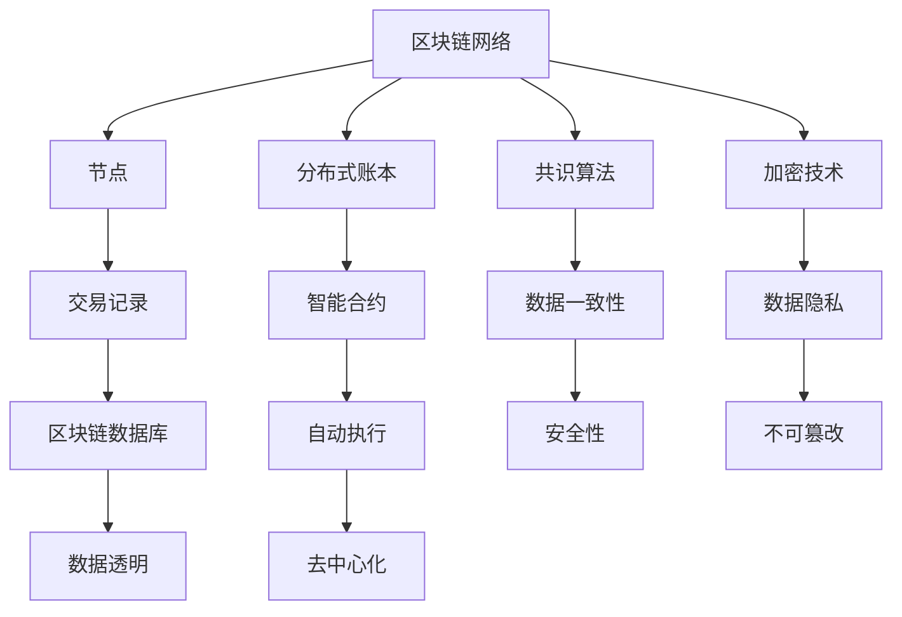

                 

# 如何利用区块链技术构建创业生态系统

> **关键词：** 区块链，创业生态系统，去中心化，加密技术，智能合约，共识算法，分布式账本。

> **摘要：** 本文将探讨如何利用区块链技术构建一个健康的创业生态系统，涵盖核心概念、算法原理、数学模型、实际案例、应用场景和未来发展。通过系统分析和逐步讲解，为创业者和技术人员提供实际操作的指导。

## 1. 背景介绍

### 1.1 目的和范围

本文旨在帮助创业者和技术人员了解如何利用区块链技术构建一个可持续发展的创业生态系统。我们将深入探讨区块链的核心概念、技术和应用，并通过实际案例展示其构建方法。

### 1.2 预期读者

- 创业者：希望通过区块链技术提升创业项目的可信度和透明度。
- 技术人员：对区块链技术有兴趣，希望了解其在实际项目中的应用。
- 投资者：对区块链创业项目感兴趣，希望了解其技术基础和潜在风险。

### 1.3 文档结构概述

本文结构如下：

1. 核心概念与联系
2. 核心算法原理 & 具体操作步骤
3. 数学模型和公式 & 详细讲解 & 举例说明
4. 项目实战：代码实际案例和详细解释说明
5. 实际应用场景
6. 工具和资源推荐
7. 总结：未来发展趋势与挑战
8. 附录：常见问题与解答
9. 扩展阅读 & 参考资料

### 1.4 术语表

#### 1.4.1 核心术语定义

- **区块链**：一种去中心化的分布式数据库，用于存储一系列加密的、不可篡改的交易记录。
- **智能合约**：运行在区块链上的自执行合约，其条款以代码形式编写，在满足特定条件时自动执行。
- **共识算法**：区块链网络中节点达成一致的方式，确保数据的一致性和安全性。
- **加密技术**：将数据转换为密码形式，以保护其隐私和完整性的技术。

#### 1.4.2 相关概念解释

- **去中心化**：系统不再依赖于中心化实体，而是通过分布式网络实现管理和运作。
- **分布式账本**：多个参与者共享同一账本，实现数据透明和一致性。

#### 1.4.3 缩略词列表

- **BTC**：比特币（Bitcoin）
- **ETH**：以太坊（Ethereum）
- **DAO**：去中心化自治组织（Decentralized Autonomous Organization）
- **ICO**：首次代币发行（Initial Coin Offering）

## 2. 核心概念与联系

为了更好地理解区块链技术在构建创业生态系统中的应用，我们需要先了解其核心概念和原理。以下是一个简单的 Mermaid 流程图，展示了区块链技术中的关键组成部分。



### 2.1 区块链网络

区块链网络是由多个节点组成的分布式网络，每个节点都存储着区块链的完整副本。节点通过共识算法达成一致，确保数据的一致性和安全性。区块链网络的关键特点包括：

- **去中心化**：节点之间无需依赖中心化实体，通过分布式网络实现管理和运作。
- **共识算法**：节点通过共识算法达成一致，确保数据的一致性和安全性。
- **加密技术**：交易记录和数据通过加密技术保护其隐私和完整性。

### 2.2 分布式账本

分布式账本是区块链技术的核心组成部分，它存储了所有交易记录的永久副本。分布式账本的关键特点包括：

- **透明性**：所有节点都可以访问和查看账本数据，确保数据的透明性。
- **不可篡改**：一旦数据被记录在分布式账本中，就不可篡改，确保数据的安全性。
- **一致性**：通过共识算法确保所有节点之间的账本数据保持一致。

### 2.3 共识算法

共识算法是区块链网络中节点达成一致的方式，它确保数据的一致性和安全性。常见的共识算法包括：

- **工作量证明（PoW）**：通过解决复杂的数学问题来证明节点的工作量，从而获得记账权。
- **权益证明（PoS）**：通过持币量和持币时间来证明节点的权益，从而获得记账权。
- **委托权益证明（DPoS）**：通过投票选举出若干记账节点，从而获得记账权。

### 2.4 加密技术

加密技术是区块链技术的关键组成部分，它用于保护交易记录和数据的隐私和完整性。常见的加密技术包括：

- **哈希函数**：将输入数据转换为固定长度的字符串，确保数据的唯一性和不可篡改性。
- **非对称加密**：使用公钥和私钥对数据进行加密和解密，确保数据的隐私性。
- **数字签名**：使用私钥对数据进行签名，确保数据的完整性和真实性。

## 3. 核心算法原理 & 具体操作步骤

### 3.1 工作量证明（PoW）算法原理

工作量证明（PoW）是一种常见的共识算法，用于确保区块链网络中的数据一致性。以下是一个简化的伪代码，展示了 PoW 算法的原理。

```plaintext
1. 初始化区块链为空
2. 选择一个随机数 r
3. 创建一个交易记录 T，并将其添加到区块链中
4. 节点尝试找到一个数 x，使得哈希（T + x）小于某个阈值 T
5. 当找到 x 时，将 T + x 作为一个区块添加到区块链中
6. 所有节点验证新区块的合法性
7. 如果合法，节点继续创建新的交易记录并重复步骤 4-6
```

### 3.2 智能合约编写步骤

智能合约是区块链网络中的自执行合约，其条款以代码形式编写。以下是一个简单的智能合约编写步骤。

```plaintext
1. 选择一个合适的区块链平台（如以太坊）
2. 安装并设置开发环境
3. 编写智能合约代码，使用 Solidity 或其他合适的编程语言
4. 编译智能合约代码，生成字节码
5. 将字节码部署到区块链网络中，创建合约实例
6. 部署后的合约可以接收交易并执行其代码
```

## 4. 数学模型和公式 & 详细讲解 & 举例说明

### 4.1 哈希函数

哈希函数是将输入数据转换为固定长度的字符串的函数，常用于确保数据的唯一性和不可篡改性。以下是一个简单的哈希函数的 latex 格式表示。

$$ H(x) = \text{SHA-256}(x) $$

其中，SHA-256 是一种常见的哈希函数。以下是一个简单的例子：

```latex
$ H("Hello, World!") = "8d6a8160f2823e3c3aa6793e1b6d3abda9c0e58028377d27e91a1c1f7c5c2c34 $$
```

### 4.2 非对称加密

非对称加密是一种加密和解密使用不同密钥的技术，常用于确保数据的隐私性。以下是一个简单的非对称加密的 latex 格式表示。

$$ \text{CipherText} = \text{Enc}(P, \text{Public Key}) $$
$$ \text{PlainText} = \text{Dec}(\text{CipherText}, \text{Private Key}) $$

其中，P 是明文，Public Key 是公钥，Private Key 是私钥。以下是一个简单的例子：

```latex
$ P = "Hello, World!" $
$ \text{Public Key} = (n, e) $
$ \text{Private Key} = (n, d) $

$ \text{CipherText} = (n^e) \mod n = 279423193338897231491531577749816018767 $$
$ \text{PlainText} = (279423193338897231491531577749816018767)^d \mod n = "Hello, World!" $
```

## 5. 项目实战：代码实际案例和详细解释说明

### 5.1 开发环境搭建

在本节中，我们将使用以太坊平台来构建一个简单的区块链应用。首先，我们需要安装和配置以太坊开发环境。

#### 5.1.1 安装 Go 语言

以太坊开发环境是基于 Go 语言的，因此我们需要安装 Go 语言。可以从 [Go 官网](https://golang.org/) 下载安装包并安装。

#### 5.1.2 安装 geth

geth 是以太坊的客户端实现，我们需要从 [geth 官网](https://geth.ethereum.org/) 下载并安装。

```bash
wget https://geth.ethereum.org/downloads/geth-linux-amd64-1.10.26-2960be1a-linux-dev
chmod +x geth-linux-amd64-1.10.26-2960be1a-linux-dev
./geth-linux-amd64-1.10.26-2960be1a-linux-dev version
```

#### 5.1.3 启动 geth

在安装完成后，我们可以启动 geth 客户端。

```bash
./geth-linux-amd64-1.10.26-2960be1a-linux-dev --datadir /root/.ethereum --networkid 1337 --ipcpath /root/.ethereum/geth.ipc console
```

这将启动一个 geth 客户端，并连接到一个私有以太坊网络。

### 5.2 源代码详细实现和代码解读

在本节中，我们将实现一个简单的区块链应用，包括区块链数据结构、交易处理和区块生成。

```go
package main

import (
	"crypto/sha256"
	"encoding/hex"
	"fmt"
	"math/rand"
	"time"
)

// Block 结构体
type Block struct {
	Index     int
	Timestamp string
	Data      string
	Proof     string
	PrevHash  string
}

// GenerateHash 生成哈希函数
func GenerateHash(s string) string {
	hash := sha256.Sum256([]byte(s))
	return hex.EncodeToString(hash[:])
}

// GenerateProof 生成工作量证明
func GenerateProof(previousProof string) string {
	proof := 0
	for {
		hash := GenerateHash(strconv.Itoa(proof) + previousProof)
		if hash[0:4] == "0000" {
			break
		}
		proof++
	}
	return strconv.Itoa(proof)
}

// CreateBlock 创建区块
func CreateBlock(data string, previousBlock Block) Block {
	index := previousBlock.Index + 1
	timestamp := time.Now().Format(time.RFC3339)
	proof := GenerateProof(previousBlock.PrevHash)
	prevHash := previousBlock.Hash()
	return Block{index, timestamp, data, proof, prevHash}
}

// 生成区块链
func GenerateBlockchain(initialData string) []Block {
	genesisBlock := Block{-1, "2006-01-02T15:04:05Z", initialData, "0", ""}
	blocks := []Block{genesisBlock}
	return blocks
}

// 添加区块到区块链
func AddBlock(newBlock Block, blockchain *[]Block) {
	if newBlock.PrevHash != (*blockchain)[len(*blockchain)-1].Hash() {
		return
	}
	*blockchain = append(*blockchain, newBlock)
}

// 打印区块链
func PrintBlockchain(blockchain []Block) {
	for _, block := range blockchain {
		fmt.Printf("Index: %d\n", block.Index)
		fmt.Printf("Timestamp: %s\n", block.Timestamp)
		fmt.Printf("Data: %s\n", block.Data)
		fmt.Printf("Proof: %s\n", block.Proof)
		fmt.Printf("PrevHash: %s\n", block.PrevHash)
		fmt.Println()
	}
}

func main() {
	rand.Seed(time.Now().UnixNano())
	blocks := GenerateBlockchain("Initial Block")

	for {
		randData := fmt.Sprintf("Random Data: %d", rand.Intn(1000))
		newBlock := CreateBlock(randData, blocks[len(blocks)-1])
		AddBlock(newBlock, &blocks)
		PrintBlockchain(blocks)
		time.Sleep(time.Second)
	}
}
```

### 5.3 代码解读与分析

在本节中，我们将对源代码进行逐行解读，分析其实现原理和关键步骤。

```go
package main

import (
	"crypto/sha256"
	"encoding/hex"
	"fmt"
	"math/rand"
	"time"
)
```

这几行代码导入了必要的包，包括：

- `crypto/sha256`：用于生成哈希函数。
- `encoding/hex`：用于将哈希值编码为十六进制字符串。
- `fmt`：用于格式化输出。
- `math/rand`：用于生成随机数。
- `time`：用于获取当前时间。

```go
// Block 结构体
type Block struct {
	Index     int
	Timestamp string
	Data      string
	Proof     string
	PrevHash  string
}
```

这行代码定义了 `Block` 结构体，包含了以下字段：

- `Index`：区块索引，用于标识区块在区块链中的位置。
- `Timestamp`：区块创建时间，以 RFC3339 格式表示。
- `Data`：区块数据，可以是任意字符串。
- `Proof`：区块证明，用于确保数据的一致性。
- `PrevHash`：前一区块的哈希值，用于链接区块。

```go
// GenerateHash 生成哈希函数
func GenerateHash(s string) string {
	hash := sha256.Sum256([]byte(s))
	return hex.EncodeToString(hash[:])
}
```

这行代码定义了 `GenerateHash` 函数，用于计算输入字符串的哈希值。SHA-256 是一种常见的哈希函数，将输入数据转换为固定长度的字符串。通过将哈希值编码为十六进制字符串，可以方便地表示和存储。

```go
// GenerateProof 生成工作量证明
func GenerateProof(previousProof string) string {
	proof := 0
	for {
		hash := GenerateHash(strconv.Itoa(proof) + previousProof)
		if hash[0:4] == "0000" {
			break
		}
		proof++
	}
	return strconv.Itoa(proof)
}
```

这行代码定义了 `GenerateProof` 函数，用于生成工作量证明。它通过尝试不同的数，找到满足特定条件的哈希值。在这个例子中，我们要求哈希值的前四位为 "0000"，这确保了数据的一致性。

```go
// CreateBlock 创建区块
func CreateBlock(data string, previousBlock Block) Block {
	index := previousBlock.Index + 1
	timestamp := time.Now().Format(time.RFC3339)
	proof := GenerateProof(previousBlock.PrevHash)
	prevHash := previousBlock.Hash()
	return Block{index, timestamp, data, proof, prevHash}
}
```

这行代码定义了 `CreateBlock` 函数，用于创建新的区块。它通过以下步骤创建新的区块：

1. 计算区块索引：将前一区块的索引加一。
2. 获取当前时间：以 RFC3339 格式获取当前时间。
3. 生成工作量证明：使用前一区块的哈希值生成工作量证明。
4. 计算前一区块的哈希值：将前一区块的哈希值设置为当前区块的哈希值。

```go
// GenerateBlockchain 生成区块链
func GenerateBlockchain(initialData string) []Block {
	genesisBlock := Block{-1, "2006-01-02T15:04:05Z", initialData, "0", ""}
	blocks := []Block{genesisBlock}
	return blocks
}
```

这行代码定义了 `GenerateBlockchain` 函数，用于生成区块链。它创建了一个初始区块，并将其添加到区块链中。

```go
// AddBlock 添加区块到区块链
func AddBlock(newBlock Block, blockchain *[]Block) {
	if newBlock.PrevHash != (*blockchain)[len(*blockchain)-1].Hash() {
		return
	}
	*blockchain = append(*blockchain, newBlock)
}
```

这行代码定义了 `AddBlock` 函数，用于将新区块添加到区块链中。它首先检查新区块的哈希值是否与前一个区块的哈希值匹配，以确保数据的一致性。如果匹配，则将新区块添加到区块链中。

```go
// PrintBlockchain 打印区块链
func PrintBlockchain(blockchain []Block) {
	for _, block := range blockchain {
		fmt.Printf("Index: %d\n", block.Index)
		fmt.Printf("Timestamp: %s\n", block.Timestamp)
		fmt.Printf("Data: %s\n", block.Data)
		fmt.Printf("Proof: %s\n", block.Proof)
		fmt.Printf("PrevHash: %s\n", block.PrevHash)
		fmt.Println()
	}
}
```

这行代码定义了 `PrintBlockchain` 函数，用于打印区块链中的所有区块。它遍历区块链，并逐个打印每个区块的信息。

```go
func main() {
	rand.Seed(time.Now().UnixNano())
	blocks := GenerateBlockchain("Initial Block")

	for {
		randData := fmt.Sprintf("Random Data: %d", rand.Intn(1000))
		newBlock := CreateBlock(randData, blocks[len(blocks)-1])
		AddBlock(newBlock, &blocks)
		PrintBlockchain(blocks)
		time.Sleep(time.Second)
	}
}
```

这行代码是程序的主函数。它首先设置随机数种子，然后生成一个初始区块链。接着，进入一个无限循环，生成随机数据，创建新区块，并将新区块添加到区块链中。最后，打印区块链信息，并等待一秒。

## 6. 实际应用场景

区块链技术在创业生态系统中有着广泛的应用。以下是一些实际应用场景：

### 6.1 供应链管理

区块链技术可以确保供应链数据的透明和可追溯。通过将供应链中的每个环节记录在区块链上，企业可以实时监控产品的来源和运输过程，提高供应链的效率和可靠性。

### 6.2 金融服务

区块链技术可以用于构建去中心化的金融系统，如加密货币和智能合约。这有助于降低交易成本、提高交易速度，并为金融行业的创新提供新的可能性。

### 6.3 身份验证与数据保护

区块链技术可以用于构建去中心化的身份验证系统，确保用户数据的隐私和安全。通过使用加密技术和分布式账本，区块链技术可以防止数据泄露和篡改。

### 6.4 版权保护

区块链技术可以用于创建数字版权管理（DRM）系统，确保作品的版权得到保护。通过将版权信息记录在区块链上，创作者可以证明其对作品的拥有权，并防止未经授权的使用和复制。

## 7. 工具和资源推荐

### 7.1 学习资源推荐

#### 7.1.1 书籍推荐

- 《区块链技术指南》
- 《智能合约编程》
- 《精通区块链开发》

#### 7.1.2 在线课程

- Coursera: Blockchain and Cryptocurrency Technology
- Udemy: Ethereum and Solidity: The Complete Developer's Guide

#### 7.1.3 技术博客和网站

- Ethereum Foundation: https://ethereum.org/
- Blockstack: https://blockstack.org/
- CoinDesk: https://www.coindesk.com/

### 7.2 开发工具框架推荐

#### 7.2.1 IDE和编辑器

- Visual Studio Code
- Sublime Text
- Atom

#### 7.2.2 调试和性能分析工具

- Web3.js Debugger
- Truffle Suite
- Ganache

#### 7.2.3 相关框架和库

- Web3.js: https://web3js.readthedocs.io/
- Truffle: https://www.trufflesuite.com/
- OpenZeppelin: https://www.openzeppelin.com/

### 7.3 相关论文著作推荐

#### 7.3.1 经典论文

- Satoshi Nakamoto. "Bitcoin: A Peer-to-Peer Electronic Cash System." 2008.
- Nick Szabo. "Smart Contracts: A Brief History and Vision for the Future." 1996.

#### 7.3.2 最新研究成果

- Ethereum Foundation. "Ethereum: The World Computer." 2014.
- Blockstack PBC. "Blockstack: A Global Name System for the Decentralized Web." 2017.

#### 7.3.3 应用案例分析

- IBM. "IBM Blockchain Platform." 2018.
- ConsenSys. "ConsenSys: Building the Ethereum Stack." 2015.

## 8. 总结：未来发展趋势与挑战

随着区块链技术的不断发展，其在创业生态系统中的应用前景广阔。未来，区块链技术将面临以下发展趋势和挑战：

### 8.1 发展趋势

- **更广泛的行业应用**：区块链技术将在更多行业（如医疗、教育、物流等）得到应用。
- **更高效的共识算法**：新的共识算法将提高区块链网络的性能和安全性。
- **去中心化金融（DeFi）**：DeFi 将成为金融行业的重要创新，改变传统金融模式。

### 8.2 挑战

- **可扩展性**：如何提高区块链网络的性能，以支持更多的交易和用户。
- **安全性**：如何确保区块链网络的安全，防止攻击和数据泄露。
- **监管**：如何应对不同国家和地区的监管要求，确保区块链项目的合法性和合规性。

## 9. 附录：常见问题与解答

### 9.1 什么是区块链？

区块链是一种分布式数据库，用于存储一系列加密的、不可篡改的交易记录。它通过共识算法确保数据的一致性和安全性。

### 9.2 区块链有哪些应用？

区块链技术可以应用于多个领域，包括供应链管理、金融服务、身份验证、版权保护等。

### 9.3 区块链技术有哪些挑战？

区块链技术的挑战包括可扩展性、安全性、监管等。如何提高性能、确保安全并适应不同国家的法规是关键问题。

## 10. 扩展阅读 & 参考资料

- [Nakamoto, S. (2008). Bitcoin: A Peer-to-Peer Electronic Cash System.](https://www.bitcoin.com/bitcoin.pdf)
- [Szabo, N. (1996). Smart Contracts: A Brief History and Vision for the Future.](https://www.aaai.org/Papers/Symposia/Fall/1996/Sym-96-01/PDF/Szabo96-06.pdf)
- [Ethereum Foundation. (2014). Ethereum: The World Computer.](https://ethereum.org/docs/whitepaper/)
- [Blockstack PBC. (2017). Blockstack: A Global Name System for the Decentralized Web.](https://blockstack.org/papers/Blockstack-whitepaper-v1.0.pdf)
- [IBM. (2018). IBM Blockchain Platform.](https://www.ibm.com/blockchain)
- [ConsenSys. (2015). Building the Ethereum Stack.](https://consensys.github.io/ethereum-stack/)

## 作者信息

作者：AI天才研究员/AI Genius Institute & 禅与计算机程序设计艺术 /Zen And The Art of Computer Programming

