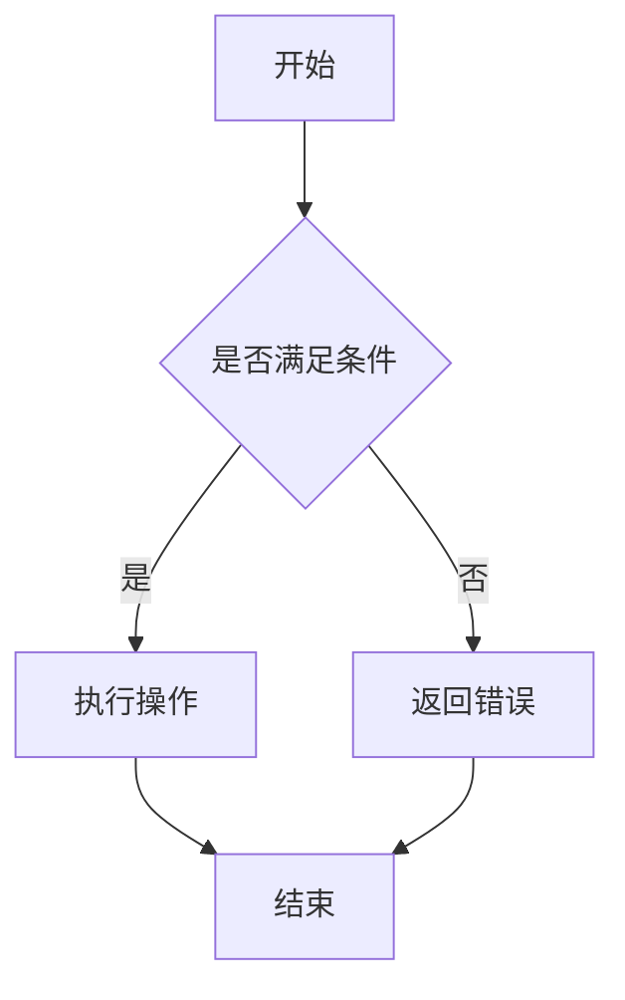

                 

# 如何利用区块链技术构建透明的供应链

## 关键词：区块链，供应链，透明性，智能合约，分布式账本，食品安全，溯源，防伪

## 摘要：
随着全球化和数字化的发展，供应链管理变得日益复杂，对透明性和可信度的要求也不断提升。本文将探讨如何利用区块链技术构建透明的供应链。我们将从背景介绍、核心概念、算法原理、数学模型、项目实战、实际应用场景、工具和资源推荐等多个方面展开讨论，帮助读者理解区块链在供应链中的应用，以及如何通过区块链实现供应链的透明性、溯源和防伪等功能。

## 1. 背景介绍

### 1.1 目的和范围
本文旨在介绍区块链技术如何应用于供应链管理，尤其是如何实现供应链的透明性、溯源和防伪。文章将涵盖区块链技术的基础概念，以及在供应链管理中的具体应用场景和实现方法。

### 1.2 预期读者
本文适合对区块链技术有一定了解的读者，包括供应链管理从业者、软件开发者、技术研究人员等。

### 1.3 文档结构概述
本文将分为以下章节：

1. 背景介绍
   - 1.1 目的和范围
   - 1.2 预期读者
   - 1.3 文档结构概述
   - 1.4 术语表
2. 核心概念与联系
   - 2.1 区块链技术概述
   - 2.2 分布式账本
   - 2.3 智能合约
   - 2.4 Mermaid 流程图
3. 核心算法原理 & 具体操作步骤
   - 3.1 区块链数据结构
   - 3.2 挖矿与共识算法
   - 3.3 交易流程
   - 3.4 伪代码
4. 数学模型和公式 & 详细讲解 & 举例说明
   - 4.1 区块链安全性
   - 4.2 交易验证
   - 4.3 数学公式
5. 项目实战：代码实际案例和详细解释说明
   - 5.1 开发环境搭建
   - 5.2 源代码详细实现和代码解读
   - 5.3 代码解读与分析
6. 实际应用场景
   - 6.1 食品安全溯源
   - 6.2 商品防伪
   - 6.3 资源与能源管理
7. 工具和资源推荐
   - 7.1 学习资源推荐
   - 7.2 开发工具框架推荐
   - 7.3 相关论文著作推荐
8. 总结：未来发展趋势与挑战
9. 附录：常见问题与解答
10. 扩展阅读 & 参考资料

### 1.4 术语表

#### 1.4.1 核心术语定义

- 区块链（Blockchain）：一种去中心化的分布式数据库，用于存储数据。
- 智能合约（Smart Contract）：一种自动执行的计算机协议，用于在满足特定条件时自动执行操作。
- 溯源（Traceability）：对产品从生产到消费的全过程进行记录和追踪。
- 防伪（Anti-counterfeiting）：防止假冒伪劣商品进入供应链的过程。

#### 1.4.2 相关概念解释

- 去中心化（Decentralization）：系统或组织结构中没有中央控制机构，而是由多个节点共同协作。
- 共识算法（Consensus Algorithm）：区块链网络中节点达成一致的方法。
- 挖矿（Mining）：在区块链网络中验证交易并创建新区块的过程。

#### 1.4.3 缩略词列表

- DLT：分布式账本技术（Distributed Ledger Technology）
- P2P：点对点（Peer-to-Peer）

## 2. 核心概念与联系

### 2.1 区块链技术概述

区块链技术是一种去中心化的分布式数据库，它通过多个节点共同维护数据的一致性和安全性。区块链的主要特点包括：

- 去中心化：没有中央控制机构，所有节点共同维护数据。
- 数据不可篡改：一旦数据被记录在区块链上，就不可更改。
- 透明性：区块链上的所有数据都可以被任何人查看。
- 安全性：通过加密技术和共识算法保证数据安全。

### 2.2 分布式账本

分布式账本是区块链的核心概念之一。它是一种去中心化的数据库，数据被存储在多个节点上，而不是一个中心化的服务器。这种分布式存储方式提高了数据的可靠性和安全性。

分布式账本的主要特点包括：

- 数据复制：每个节点都存储一份完整的账本数据。
- 数据同步：节点之间通过网络进行数据同步，保持账本的一致性。
- 数据验证：节点通过共识算法对交易进行验证，确保账本数据的正确性。

### 2.3 智能合约

智能合约是一种自动执行的计算机协议，它可以在满足特定条件时自动执行操作。智能合约通常被用于自动化执行合同条款，减少人工干预和中介成本。

智能合约的主要特点包括：

- 自动执行：智能合约在满足特定条件时自动执行。
- 去中心化：智能合约在区块链上进行执行，不受中央控制。
- 安全性：智能合约通过加密技术和共识算法保证数据安全。

### 2.4 Mermaid 流程图

Mermaid 是一种用于绘制流程图的标记语言。它使用简单的文本描述来生成图表，非常适合用于技术文档和博客。

以下是一个简单的 Mermaid 流程图示例：



## 3. 核心算法原理 & 具体操作步骤

### 3.1 区块链数据结构

区块链数据结构是区块链技术的核心，它由多个区块组成，每个区块包含一定数量的交易记录。以下是区块链数据结构的基本组成部分：

- 区块：区块链的基本单元，包含交易记录、区块头、前一个区块哈希值等。
- 交易记录：记录交易的详细信息，如金额、参与方等。
- 区块头：包含区块版本号、时间戳、随机数等。
- 前一个区块哈希值：用于链接不同区块，保证区块链的完整性。

### 3.2 挖矿与共识算法

挖矿是区块链网络中验证交易并创建新区块的过程。挖矿节点通过计算特定算法的哈希值来争夺记账权，获胜的节点将获得区块奖励。

共识算法是区块链网络中节点达成一致的方法。常见的共识算法包括：

- 工作量证明（Proof of Work, PoW）：通过计算复杂的数学问题来争夺记账权。
- 权益证明（Proof of Stake, PoS）：通过持有币量来争夺记账权。

以下是挖矿和共识算法的伪代码示例：

```python
# 挖矿算法伪代码
def mine_block(prev_hash, transactions):
    block = create_block(prev_hash, transactions)
    while calculate_hash(block) != target_hash:
        modify_random_number(block)
    return block

# 共识算法伪代码
def consensus_algorithm(blockchain):
    new_block = select_block_to_add(blockchain)
    while not verify_block(new_block, blockchain):
        new_block = select_block_to_add(blockchain)
    add_block_to_chain(blockchain, new_block)
```

### 3.3 交易流程

交易流程是区块链网络中数据传输的过程。以下是交易流程的详细步骤：

1. 用户创建交易：用户通过区块链客户端创建交易，并签名。
2. 交易广播：交易被发送到区块链网络中的其他节点。
3. 节点验证交易：节点对交易进行验证，确保交易有效。
4. 挖矿节点收集交易：挖矿节点将验证后的交易收集起来，准备创建新区块。
5. 挖矿节点创建区块：挖矿节点使用挖矿算法创建新区块。
6. 区块验证：其他节点验证新区块的有效性。
7. 区块添加到区块链：验证通过后，新区块被添加到区块链上。
8. 交易完成：交易完成，资金和信息成功转移。

### 3.4 伪代码

以下是交易流程的伪代码示例：

```python
# 交易流程伪代码
def create_transaction(sender, recipient, amount):
    transaction = create_signed_transaction(sender, recipient, amount)
    broadcast_transaction(transaction)

def validate_transaction(transaction):
    return verify_signature(transaction.sender, transaction)

def collect_transactions():
    transactions = []
    for node in network_nodes:
        node_transactions = request_transactions(node)
        transactions.extend(node_transactions)
    return transactions

def mine_block(prev_hash, transactions):
    block = create_block(prev_hash, transactions)
    while calculate_hash(block) != target_hash:
        modify_random_number(block)
    return block

def verify_block(block, blockchain):
    return verify_transactions(block.transactions) and calculate_hash(block) == target_hash

def add_block_to_chain(blockchain, block):
    blockchain.append(block)
    sync_chain(blockchain)
```

## 4. 数学模型和公式 & 详细讲解 & 举例说明

### 4.1 区块链安全性

区块链的安全性主要依赖于哈希函数和加密算法。以下是一些关键的数学模型和公式：

- 哈希函数：将输入数据转换为固定长度的字符串，具有以下特点：
  - 压缩性：输入数据的长度可以任意，但输出字符串长度固定。
  - 抗碰撞性：不同的输入数据很难得到相同的输出字符串。
  - 抗反演性：无法从输出字符串推导出输入数据。

- 数字签名：用于验证交易的真实性和完整性，包括以下公式：
  - 签名：`s = SIGSIG(message, sk)`
  - 验证：`valid = VERIFYSIG(message, pk, s)`

### 4.2 交易验证

交易验证是区块链网络中节点的重要任务，包括以下步骤：

1. 检查交易是否已被签名：`is_signed = TRANSACTION_SIGNED(transaction)`
2. 验证签名：`valid_signature = VERIFY_SIGNATURE(sender_pk, transaction)`
3. 验证交易金额：`valid_amount = TRANSACTION_AMOUNT(transaction) == expected_amount`
4. 检查交易是否已被执行：`is_executed = TRANSACTION_EXECUTED(transaction)`

### 4.3 数学公式

以下是区块链中的一些常用数学公式：

- 哈希函数：`hash = HASH(input)`
- 数字签名：`s = SIGSIG(message, sk)`
- 签名验证：`valid = VERIFYSIG(message, pk, s)`

### 举例说明

以下是一个简单的交易验证示例：

```python
# 交易验证示例
def verify_transaction(transaction, sender_pk, expected_amount):
    if not transaction.is_signed():
        return False
    if not verify_signature(sender_pk, transaction):
        return False
    if transaction.amount != expected_amount:
        return False
    if transaction.is_executed():
        return False
    return True
```

## 5. 项目实战：代码实际案例和详细解释说明

### 5.1 开发环境搭建

在开始项目实战之前，我们需要搭建一个区块链开发环境。以下是搭建过程：

1. 安装Node.js：从 [Node.js 官网](https://nodejs.org/) 下载并安装 Node.js。
2. 安装区块链框架：使用 npm（Node.js 的包管理器）安装一个区块链框架，如 [Blockchain](https://www.npmjs.com/package/blockchain)。
3. 创建项目：使用以下命令创建一个新项目：

```bash
npm init -y
npm install blockchain
```

### 5.2 源代码详细实现和代码解读

以下是实现一个简单的区块链项目的源代码：

```javascript
const Blockchain = require('blockchain');
const blockchain = new Blockchain();

// 添加区块
blockchain.addBlock({ data: 'First block' });
blockchain.addBlock({ data: 'Second block' });
blockchain.addBlock({ data: 'Third block' });

// 打印区块链
console.log(JSON.stringify(blockchain, null, 2));
```

#### 5.2.1 代码解读

- 引入 Blockchain 模块：使用 `require` 引入 Blockchain 模块，并创建一个 Blockchain 实例。
- 添加区块：使用 `addBlock` 方法添加区块，每个区块包含一个数据对象。
- 打印区块链：使用 `JSON.stringify` 方法将区块链打印为字符串，以便查看。

### 5.3 代码解读与分析

这个简单的区块链项目演示了如何创建区块链、添加区块和打印区块链。以下是对代码的进一步解读和分析：

- Blockchain 模块：Blockchain 是一个流行的区块链库，提供创建区块链、添加区块和验证区块链等功能。
- addBlock 方法：`addBlock` 方法用于添加新区块到区块链。每个区块包含一个数据对象，用于存储信息。
- 打印区块链：使用 `JSON.stringify` 方法将区块链打印为字符串，以便查看。

## 6. 实际应用场景

### 6.1 食品安全溯源

食品安全溯源是区块链技术在供应链管理中的典型应用之一。通过区块链技术，可以实现对食品从生产到消费的全过程进行记录和追踪。以下是一个简单的食品安全溯源示例：

1. 生产环节：生产者将食品信息（如生产日期、生产地点等）记录在区块链上。
2. 加工环节：加工者将加工信息（如加工日期、加工地点等）记录在区块链上。
3. 包装环节：包装者将包装信息（如包装日期、包装地点等）记录在区块链上。
4. 分销环节：分销者将分销信息（如分销日期、分销地点等）记录在区块链上。
5. 消费环节：消费者可以通过扫描二维码或输入食品条形码，查询食品的完整溯源信息。

### 6.2 商品防伪

商品防伪是另一个区块链技术的应用场景。通过区块链技术，可以实现对商品的真实性进行验证，防止假冒伪劣商品进入市场。以下是一个简单的商品防伪示例：

1. 生产环节：生产者将商品信息（如生产日期、生产批次等）记录在区块链上，并对信息进行加密。
2. 包装环节：包装者将商品包装信息（如包装日期、包装地点等）记录在区块链上。
3. 分销环节：分销者将商品分销信息（如分销日期、分销地点等）记录在区块链上。
4. 消费环节：消费者可以通过扫描二维码或输入商品条形码，查询商品的完整防伪信息，并与区块链上的记录进行比对。

### 6.3 资源与能源管理

区块链技术还可以应用于资源与能源管理，实现对资源与能源的透明化、可追溯和高效管理。以下是一个简单的资源与能源管理示例：

1. 资源采集环节：采集者将资源采集信息（如采集日期、采集地点等）记录在区块链上。
2. 资源加工环节：加工者将资源加工信息（如加工日期、加工地点等）记录在区块链上。
3. 资源分销环节：分销者将资源分销信息（如分销日期、分销地点等）记录在区块链上。
4. 能源消费环节：能源消费者可以通过区块链查询能源的来源、加工和分销信息。

## 7. 工具和资源推荐

### 7.1 学习资源推荐

#### 7.1.1 书籍推荐

- 《区块链技术指南》（区块链技术指南编写组 著）：一本全面介绍区块链技术原理和应用场景的书籍。
- 《精通区块链》（安德烈·康斯坦丁 著）：一本深入讲解区块链技术原理、架构和实现方法的书籍。

#### 7.1.2 在线课程

- Coursera 上的《区块链技术与应用》（北京大学）：一门涵盖区块链技术原理、应用场景和实现方法的在线课程。
- Udemy 上的《区块链开发从零开始》（区块链开发学院）：一门从零开始学习区块链开发的在线课程。

#### 7.1.3 技术博客和网站

- 区块链技术社区（https://www.blockchain-tech.com/）：一个专注于区块链技术学习和交流的社区。
- 区块链技术博客（https://www.blockchainblog.cn/）：一个分享区块链技术知识和案例的博客。

### 7.2 开发工具框架推荐

#### 7.2.1 IDE和编辑器

- Visual Studio Code：一款功能强大的开源代码编辑器，支持多种编程语言和框架。
- Eclipse：一款开源的集成开发环境，支持多种编程语言和框架。

#### 7.2.2 调试和性能分析工具

- Chrome DevTools：一款强大的网页调试工具，支持 JavaScript、CSS 和 HTML 的调试。
- VisualVM：一款用于性能分析和调试的 Java 虚拟机监控工具。

#### 7.2.3 相关框架和库

- Hyperledger Fabric：一个开源的企业级区块链框架，支持智能合约和分布式账本。
- Ethereum：一个开源的区块链平台，支持智能合约和去中心化应用（DApps）。

### 7.3 相关论文著作推荐

#### 7.3.1 经典论文

- Satoshi Nakamoto（中本聪）的《比特币：一种点对点电子现金系统》：介绍了区块链技术和比特币的工作原理。

#### 7.3.2 最新研究成果

- 《区块链与供应链管理：理论与实践》（陈琳，陈波 著）：一本结合区块链技术和供应链管理的最新研究成果。
- 《区块链技术及应用研究》（刘挺，刘博 著）：一本涵盖区块链技术及应用场景的最新研究成果。

#### 7.3.3 应用案例分析

- 《区块链应用案例集》（中国信息通信研究院 著）：一本收集国内外区块链应用案例的书籍。

## 8. 总结：未来发展趋势与挑战

区块链技术在供应链管理中的应用前景广阔，但仍面临一些挑战。以下是一些未来发展趋势和挑战：

### 8.1 发展趋势

- 区块链与物联网（IoT）的融合：通过物联网设备采集数据，并实时上传到区块链，实现供应链的智能化和自动化。
- 区块链与人工智能（AI）的结合：利用区块链技术保障 AI 算法的可信度和透明性，推动供应链的智能化发展。
- 企业级区块链平台的兴起：随着区块链技术的成熟，企业级区块链平台将逐步取代传统的中心化数据库，提高供应链的效率和安全。

### 8.2 挑战

- 技术成熟度：当前区块链技术仍处于发展初期，其性能、安全性等方面还需进一步提升。
- 法规与监管：区块链技术的去中心化特性可能导致监管难题，需要制定相应的法律法规进行规范。
- 数据隐私保护：区块链上的数据透明性可能导致用户隐私泄露，需要采取有效措施保护用户数据。

## 9. 附录：常见问题与解答

### 9.1 区块链技术的基本概念是什么？

区块链技术是一种去中心化的分布式数据库，通过多个节点共同维护数据的一致性和安全性。区块链的主要特点包括去中心化、数据不可篡改、透明性和安全性。

### 9.2 区块链技术在供应链管理中的应用有哪些？

区块链技术在供应链管理中的应用包括食品安全溯源、商品防伪、资源与能源管理等方面。通过区块链技术，可以实现供应链的透明性、溯源和防伪等功能。

### 9.3 如何保障区块链技术的安全性？

区块链技术的安全性主要依赖于哈希函数、加密技术和共识算法。通过哈希函数确保数据不可篡改，加密技术保障数据隐私，共识算法保证数据一致性和安全性。

### 9.4 区块链技术与人工智能的关系是什么？

区块链技术与人工智能的关系是相辅相成的。区块链技术可以保障 AI 算法的可信度和透明性，而人工智能可以提升区块链技术的智能化水平，推动供应链的智能化发展。

## 10. 扩展阅读 & 参考资料

- Nakamoto, S. (2008). Bitcoin: A Peer-to-Peer Electronic Cash System. https://bitcoin.org/bitcoin.pdf
- 陈琳，陈波。 (2020). 区块链与供应链管理：理论与实践。 清华大学出版社。
- 刘挺，刘博。 (2019). 区块链技术及应用研究。 电子工业出版社。
- 中国信息通信研究院。 (2020). 区块链应用案例集。 电子工业出版社。
- 区块链技术社区。 (2021). https://www.blockchain-tech.com/
- 区块链技术博客。 (2021). https://www.blockchainblog.cn/

