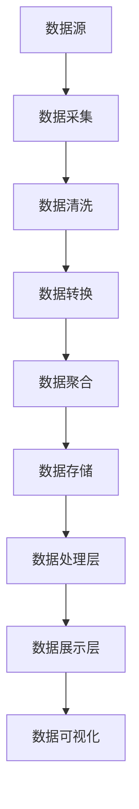

                 

### 1. 背景介绍

#### 1.1 目的和范围

本文旨在探讨如何利用大数据技术来优化创业产品的设计和用户体验。随着信息技术的飞速发展，大数据已经逐渐成为各个行业的重要驱动力。对于创业公司而言，如何通过大数据技术来提高产品的市场竞争力，优化用户体验，成为企业成功的关键因素之一。

本文将围绕以下几个核心问题展开讨论：

1. 大数据技术在产品设计和用户体验优化中的重要性。
2. 如何收集和分析用户数据来指导产品设计。
3. 大数据技术在产品设计中的具体应用实例。
4. 如何保障用户隐私和数据安全。

本文将涵盖大数据技术的基础知识、核心算法原理、数学模型、实际应用场景以及相关的工具和资源推荐。希望通过本文，读者能够对大数据技术在创业产品设计和用户体验优化中的运用有更深入的了解。

#### 1.2 预期读者

本文主要面向以下几类读者：

1. 创业公司创始人或产品经理，希望了解如何利用大数据技术提升产品竞争力。
2. 数据分析师或数据科学家，希望掌握大数据技术在实际应用中的具体操作方法。
3. 对大数据技术感兴趣的技术爱好者，希望了解大数据技术在产品设计和用户体验优化中的实际应用。

#### 1.3 文档结构概述

本文将分为十个部分，具体结构如下：

1. 背景介绍
   - 1.1 目的和范围
   - 1.2 预期读者
   - 1.3 文档结构概述
   - 1.4 术语表

2. 核心概念与联系
   - 大数据技术的基本原理和架构

3. 核心算法原理 & 具体操作步骤
   - 数据采集、处理、分析和可视化算法

4. 数学模型和公式 & 详细讲解 & 举例说明
   - 大数据技术相关的数学模型和公式

5. 项目实战：代码实际案例和详细解释说明
   - 大数据技术在实际项目中的应用

6. 实际应用场景
   - 大数据技术在创业产品设计和用户体验优化中的具体应用

7. 工具和资源推荐
   - 学习资源、开发工具和框架推荐

8. 总结：未来发展趋势与挑战
   - 大数据技术在创业产品设计和用户体验优化中的未来发展趋势和面临的挑战

9. 附录：常见问题与解答
   - 大数据技术在产品设计和用户体验优化中的常见问题及解答

10. 扩展阅读 & 参考资料
    - 相关论文、书籍和技术博客推荐

#### 1.4 术语表

在本文中，我们将使用以下术语，为了便于理解，特此给出定义和解释：

- **大数据（Big Data）**：指无法使用传统数据处理工具在合理时间内进行捕获、管理和处理的数据集合。
- **数据挖掘（Data Mining）**：从大量数据中提取有价值的信息和知识的过程。
- **机器学习（Machine Learning）**：一种人工智能方法，通过数据和算法来训练模型，使其能够自主学习和预测。
- **用户画像（User Profiling）**：基于用户行为数据构建的关于用户的特征模型。
- **数据分析（Data Analysis）**：通过对数据的清洗、整理、计算和可视化，从数据中提取有价值的信息。
- **用户体验（User Experience, UX）**：用户在使用产品或服务过程中产生的情感和心理反应。
- **产品设计（Product Design）**：通过研究和分析用户需求，设计出满足用户需求的产品方案。

#### 1.4.1 核心术语定义

在本节中，我们将进一步详细定义本文中涉及的核心术语，以便读者能够更好地理解文章内容。

- **大数据（Big Data）**：大数据通常具有以下四个V特性：Volume（数据量）、Velocity（数据速度）、Variety（数据多样性）和 Veracity（数据真实性）。大数据的收集、存储、处理和分析需要利用现代信息技术，如分布式系统、云计算和人工智能。
  
- **数据挖掘（Data Mining）**：数据挖掘是大数据技术的重要组成部分，它通过统计方法、机器学习和深度学习等技术从大量数据中提取有价值的信息。数据挖掘的目标包括分类、聚类、关联规则发现、异常检测和预测等。

- **机器学习（Machine Learning）**：机器学习是一种人工智能技术，它通过训练模型来从数据中学习规律，然后利用这些规律进行预测和决策。机器学习分为监督学习、无监督学习和半监督学习三种类型。

- **用户画像（User Profiling）**：用户画像是一种基于用户行为数据的特征模型，它可以帮助企业了解用户需求、兴趣和行为习惯，从而提供更个性化的产品和服务。

- **数据分析（Data Analysis）**：数据分析是指通过使用统计方法、数据可视化技术和人工智能算法来从数据中提取有价值的信息。数据分析的目标是发现数据中的规律和趋势，为企业决策提供支持。

- **用户体验（User Experience, UX）**：用户体验是指用户在使用产品或服务过程中产生的情感和心理反应。用户体验设计的目标是提供令人满意的产品和服务，提高用户的满意度和忠诚度。

- **产品设计（Product Design）**：产品设计是指通过研究和分析用户需求，设计出满足用户需求的产品方案。产品设计需要综合考虑功能、可用性、易用性和美观性等多个方面。

#### 1.4.2 相关概念解释

在本节中，我们将进一步解释与本文相关的其他重要概念，以便读者能够更好地理解文章内容。

- **分布式系统（Distributed System）**：分布式系统是指由多个计算机节点组成的系统，这些节点通过计算机网络进行通信和协同工作。分布式系统具有可扩展性、高可用性和容错性等特点，是大数据处理的重要技术基础。

- **云计算（Cloud Computing）**：云计算是一种通过网络提供计算资源、存储资源和应用程序的服务模式。云计算可以帮助企业降低成本、提高灵活性和可扩展性，是大数据处理的重要基础设施。

- **数据可视化（Data Visualization）**：数据可视化是指使用图表、图像和其他视觉元素来展示数据的结构和关系。数据可视化可以帮助用户更好地理解数据，发现数据中的规律和趋势。

- **深度学习（Deep Learning）**：深度学习是一种基于人工神经网络的学习方法，它通过多层神经网络来提取数据中的特征。深度学习在图像识别、自然语言处理和语音识别等领域具有广泛的应用。

- **用户行为分析（User Behavior Analysis）**：用户行为分析是指通过对用户在产品或服务中的行为进行追踪和分析，了解用户需求、兴趣和行为习惯。用户行为分析可以帮助企业优化产品设计、提高用户体验。

#### 1.4.3 缩略词列表

在本文中，我们将使用以下缩略词，以简化文本表述：

- **HDFS**：Hadoop Distributed File System，Hadoop分布式文件系统。
- **MapReduce**：MapReduce编程模型，用于处理大规模数据集。
- **Hadoop**：一个开源的大数据平台，包括HDFS和MapReduce等组件。
- **Spark**：一种快速、通用的大数据处理引擎，支持多种数据处理操作。
- **SQL**：Structured Query Language，结构化查询语言，用于查询和操作关系型数据库。
- **NoSQL**：Not Only SQL，非关系型数据库，用于存储和管理非结构化或半结构化数据。
- **API**：Application Programming Interface，应用程序编程接口，用于不同软件系统之间的交互。
- **UI**：User Interface，用户界面，用于用户与软件系统之间的交互。
- **UX**：User Experience，用户体验，用于描述用户在使用产品或服务过程中的情感和心理反应。
- **SDK**：Software Development Kit，软件开发工具包，用于开发软件时使用的工具和库。

通过上述背景介绍和术语表，读者应该对本文的主题和核心概念有了基本的了解。接下来，我们将进一步探讨大数据技术在产品设计和用户体验优化中的重要性，并介绍大数据技术的基本原理和架构。让我们继续深入探讨。|>### 2. 核心概念与联系

#### 2.1 大数据技术的基本原理和架构

大数据技术是指用于处理、存储、分析和可视化大规模数据的一系列技术方法。它基于分布式计算、云计算、数据挖掘、机器学习和深度学习等技术，能够高效地处理和分析海量数据，从而提取有价值的信息和知识。以下是大数据技术的基本原理和架构：

##### 2.1.1 分布式计算

分布式计算是大数据技术的基础。它通过将数据分布在多个节点上进行计算，从而提高计算效率和扩展性。分布式计算框架如Hadoop和Spark等，提供了高效的分布式数据处理能力。

- **Hadoop**：Hadoop是一个开源的大数据平台，包括HDFS和MapReduce两个核心组件。HDFS是一个分布式文件系统，用于存储海量数据；MapReduce是一种分布式计算模型，用于处理大规模数据集。
  
- **Spark**：Spark是一种快速、通用的大数据处理引擎，支持多种数据处理操作，如批处理、流处理和机器学习等。Spark相对于Hadoop具有更高的计算性能和更丰富的功能。

##### 2.1.2 云计算

云计算是大数据技术的重要基础设施。它通过提供计算资源、存储资源和应用程序等服务，帮助企业降低成本、提高灵活性和可扩展性。常见的云计算平台包括阿里云、腾讯云和华为云等。

- **计算资源**：云计算平台提供虚拟机、容器和函数计算等计算资源，用于执行数据处理任务。
  
- **存储资源**：云计算平台提供对象存储、块存储和文件存储等存储资源，用于存储海量数据。
  
- **应用程序**：云计算平台提供各种应用程序，如数据分析工具、机器学习平台和数据库等，用于处理和分析数据。

##### 2.1.3 数据挖掘和机器学习

数据挖掘和机器学习是大数据技术的核心应用领域。它们通过从大量数据中提取有价值的信息和知识，帮助企业和组织做出更好的决策。

- **数据挖掘**：数据挖掘是一种从大量数据中发现规律和知识的方法。它包括分类、聚类、关联规则发现、异常检测和预测等任务。
  
- **机器学习**：机器学习是一种人工智能方法，通过数据和算法来训练模型，使其能够自主学习和预测。机器学习分为监督学习、无监督学习和半监督学习三种类型。

##### 2.1.4 数据可视化

数据可视化是将数据以图表、图像和其他视觉元素的形式展示给用户的过程。它可以帮助用户更好地理解数据，发现数据中的规律和趋势。

- **可视化工具**：如Tableau、PowerBI和matplotlib等，用于创建数据可视化图表。
  
- **交互式可视化**：交互式可视化允许用户通过操作界面与数据可视化图表进行交互，从而更深入地分析数据。

##### 2.1.5 大数据技术的架构

大数据技术的架构通常包括数据源、数据处理层、数据存储层和数据展示层。

- **数据源**：包括内部数据和外部数据，如用户行为数据、社交网络数据、传感器数据等。
  
- **数据处理层**：包括数据采集、数据清洗、数据转换和数据聚合等处理步骤，用于将原始数据转化为可用的数据形式。
  
- **数据存储层**：包括分布式文件系统、数据库和NoSQL数据库等，用于存储海量数据。
  
- **数据展示层**：包括数据可视化工具和报表系统等，用于将数据以图表、图像和其他视觉元素的形式展示给用户。

##### 2.1.6 Mermaid 流程图

以下是一个简单的大数据技术架构的Mermaid流程图，展示了数据从数据源到数据展示层的处理过程：



通过上述核心概念与联系，读者应该对大数据技术的基本原理和架构有了更深入的理解。接下来，我们将详细讲解大数据技术中的核心算法原理和具体操作步骤。|>### 3. 核心算法原理 & 具体操作步骤

#### 3.1 数据采集

数据采集是大数据技术的第一步，也是至关重要的一步。它涉及从各种数据源（如网站日志、传感器数据、社交媒体数据等）收集原始数据。数据采集的过程可以概括为以下几个步骤：

1. **数据源识别**：确定需要采集的数据源，包括内部数据和外部数据。
2. **数据采集工具**：选择合适的数据采集工具，如Elasticsearch、Apache Flume、Logstash等。
3. **数据格式转换**：将采集到的原始数据转换为统一的格式，如JSON、CSV等。
4. **数据存储**：将转换后的数据存储到分布式文件系统或数据库中，如HDFS、HBase、MySQL等。

以下是数据采集的伪代码：

```python
# 伪代码：数据采集流程

# 步骤1：识别数据源
data_sources = ["website_logs", "sensor_data", "social_media_data"]

# 步骤2：初始化数据采集工具
collector_tools = ["Elasticsearch", "Apache Flume", "Logstash"]

# 步骤3：数据格式转换
def transform_data(data_source):
    # 根据数据源进行格式转换
    if data_source == "website_logs":
        return json.loads(data_source)
    elif data_source == "sensor_data":
        return csv.reader(data_source)
    elif data_source == "social_media_data":
        return json.loads(data_source)

# 步骤4：数据存储
def store_data(transformed_data, storage_location):
    # 根据存储位置进行数据存储
    if storage_location == "HDFS":
        hdfs.upload(transformed_data)
    elif storage_location == "HBase":
        hbase.insert(transformed_data)
    elif storage_location == "MySQL":
        mysql.insert(transformed_data)

# 主流程
for data_source in data_sources:
    transformed_data = transform_data(data_source)
    store_data(transformed_data, "HDFS")
```

#### 3.2 数据清洗

数据清洗是确保数据质量的关键步骤。它涉及识别和纠正数据中的错误、缺失和不一致。数据清洗的过程可以概括为以下几个步骤：

1. **数据预处理**：对数据进行标准化、去重、去噪声等预处理操作。
2. **数据验证**：检查数据是否符合预期，如数据类型、范围、格式等。
3. **数据修正**：对错误或不一致的数据进行修正或删除。
4. **数据存储**：将清洗后的数据存储到数据仓库或数据库中。

以下是数据清洗的伪代码：

```python
# 伪代码：数据清洗流程

# 步骤1：读取原始数据
raw_data = hdfs.read("input_data")

# 步骤2：数据预处理
def preprocess_data(data):
    # 标准化数据
    standardized_data = standardize_data(data)
    # 去重
    unique_data = remove_duplicates(standardized_data)
    # 去噪声
    cleaned_data = remove_noise(unique_data)
    return cleaned_data

# 步骤3：数据验证
def validate_data(data):
    # 验证数据类型
    if not is_valid_type(data):
        raise ValueError("Invalid data type")
    # 验证数据范围
    if not is_in_range(data):
        raise ValueError("Data out of range")
    # 验证数据格式
    if not is_in_correct_format(data):
        raise ValueError("Incorrect data format")

# 步骤4：数据修正
def correct_data(data):
    # 修正数据
    corrected_data = correct_values(data)
    return corrected_data

# 步骤5：数据存储
def store_data(cleaned_data, storage_location):
    # 根据存储位置进行数据存储
    if storage_location == "HDFS":
        hdfs.upload(cleaned_data)
    elif storage_location == "HBase":
        hbase.insert(cleaned_data)
    elif storage_location == "MySQL":
        mysql.insert(cleaned_data)

# 主流程
cleaned_data = preprocess_data(raw_data)
validate_data(cleaned_data)
corrected_data = correct_data(cleaned_data)
store_data(corrected_data, "HDFS")
```

#### 3.3 数据转换

数据转换是将清洗后的数据转化为适合分析的形式。它可能包括数据聚合、数据规范化、数据转换等操作。以下是数据转换的伪代码：

```python
# 伪代码：数据转换流程

# 步骤1：读取清洗后的数据
cleaned_data = hdfs.read("cleaned_data")

# 步骤2：数据聚合
def aggregate_data(data):
    # 聚合数据
    aggregated_data = aggregate_values(data)
    return aggregated_data

# 步骤3：数据规范化
def normalize_data(data):
    # 规范化数据
    normalized_data = normalize_values(data)
    return normalized_data

# 步骤4：数据存储
def store_data(transformed_data, storage_location):
    # 根据存储位置进行数据存储
    if storage_location == "HDFS":
        hdfs.upload(transformed_data)
    elif storage_location == "HBase":
        hbase.insert(transformed_data)
    elif storage_location == "MySQL":
        mysql.insert(transformed_data)

# 主流程
aggregated_data = aggregate_data(cleaned_data)
normalized_data = normalize_data(aggregated_data)
store_data(normalized_data, "HDFS")
```

#### 3.4 数据分析

数据分析是利用统计方法和机器学习算法从数据中提取有价值的信息和知识。数据分析的过程可以概括为以下几个步骤：

1. **数据探索**：对数据进行分析，了解数据的基本特征和规律。
2. **特征工程**：从原始数据中提取特征，为机器学习模型提供输入。
3. **模型训练**：利用机器学习算法训练模型，使模型能够对数据进行预测和分类。
4. **模型评估**：评估模型的性能，选择最优模型。
5. **模型应用**：将模型应用到实际业务场景中。

以下是数据分析的伪代码：

```python
# 伪代码：数据分析流程

# 步骤1：读取转换后的数据
transformed_data = hdfs.read("transformed_data")

# 步骤2：数据探索
def explore_data(data):
    # 数据探索
    summary_stats = summarize_data(data)
    return summary_stats

# 步骤3：特征工程
def feature_engineering(data):
    # 提取特征
    features = extract_features(data)
    return features

# 步骤4：模型训练
def train_model(features, target_variable):
    # 训练模型
    model = train(features, target_variable)
    return model

# 步骤5：模型评估
def evaluate_model(model, test_data):
    # 评估模型
    performance = evaluate(model, test_data)
    return performance

# 步骤6：模型应用
def apply_model(model, new_data):
    # 应用模型
    prediction = model.predict(new_data)
    return prediction

# 主流程
summary_stats = explore_data(transformed_data)
features = feature_engineering(transformed_data)
model = train_model(features, target_variable)
performance = evaluate_model(model, test_data)
prediction = apply_model(model, new_data)
```

#### 3.5 数据可视化

数据可视化是将分析结果以图表、图像和其他视觉元素的形式展示给用户。它可以帮助用户更好地理解数据，发现数据中的规律和趋势。以下是数据可视化的伪代码：

```python
# 伪代码：数据可视化流程

# 步骤1：读取分析结果
analysis_results = hdfs.read("analysis_results")

# 步骤2：创建数据可视化图表
def create_chart(data, chart_type):
    # 创建图表
    chart = create_chart(data, chart_type)
    return chart

# 步骤3：展示数据可视化图表
def display_chart(chart):
    # 展示图表
    show_chart(chart)
    return

# 主流程
chart = create_chart(analysis_results, "line_chart")
display_chart(chart)
```

通过上述核心算法原理和具体操作步骤，读者应该对大数据技术在数据采集、数据清洗、数据转换、数据分析和数据可视化等环节的具体实现有了更深入的理解。接下来，我们将进一步讲解大数据技术中的数学模型和公式，以便读者能够更好地掌握大数据技术的理论基础。|>### 4. 数学模型和公式 & 详细讲解 & 举例说明

#### 4.1 数学模型和公式的重要性

在数据处理和数据分析过程中，数学模型和公式起着至关重要的作用。它们不仅能够帮助我们理解和描述数据，还能帮助我们预测未来的趋势和进行决策。以下是大数据技术中常用的一些数学模型和公式，我们将逐一进行详细讲解和举例说明。

##### 4.1.1 常见分布模型

**正态分布（Normal Distribution）**

正态分布是一种最常见的概率分布模型，也称为高斯分布。它在数据分析中有着广泛的应用，如假设检验、回归分析和质量控制等。

- **公式**：

  $$
  f(x|\mu, \sigma^2) = \frac{1}{\sqrt{2\pi\sigma^2}} e^{-\frac{(x-\mu)^2}{2\sigma^2}}
  $$

  其中，$x$ 是随机变量，$\mu$ 是均值，$\sigma^2$ 是方差。

- **举例说明**：

  假设某产品的质量指标服从正态分布，均值为100，方差为10。我们需要计算质量指标在90到110之间的概率。

  $$
  P(90 < x < 110) = \int_{90}^{110} \frac{1}{\sqrt{2\pi \cdot 10^2}} e^{-\frac{(x-100)^2}{2 \cdot 10^2}} dx
  $$

  通过计算，我们可以得到这个概率值。

**泊松分布（Poisson Distribution）**

泊松分布是一种用于描述事件发生次数的离散概率分布模型，它在数据分析中有着广泛的应用，如流量分析、故障率和事件预测等。

- **公式**：

  $$
  P(X = k) = \frac{e^{-\lambda} \lambda^k}{k!}
  $$

  其中，$X$ 是随机变量，表示事件发生的次数，$\lambda$ 是事件的发生率。

- **举例说明**：

  假设某网站的点击量服从泊松分布，平均点击率为5次/小时。我们需要计算在给定的时间段内，点击量大于10的概率。

  $$
  P(X > 10) = 1 - \sum_{k=0}^{10} \frac{e^{-5} 5^k}{k!}
  $$

  通过计算，我们可以得到这个概率值。

##### 4.1.2 回归分析模型

**线性回归（Linear Regression）**

线性回归是一种常用的预测模型，用于分析两个或多个变量之间的关系。它在数据分析中有着广泛的应用，如销售预测、股票分析和用户行为预测等。

- **公式**：

  $$
  y = \beta_0 + \beta_1 x_1 + \beta_2 x_2 + ... + \beta_n x_n
  $$

  其中，$y$ 是因变量，$x_1, x_2, ..., x_n$ 是自变量，$\beta_0, \beta_1, \beta_2, ..., \beta_n$ 是回归系数。

- **举例说明**：

  假设我们要预测某产品的销量，已知销量与广告投入、促销活动等因素有关。我们可以建立线性回归模型：

  $$
  y = \beta_0 + \beta_1 \cdot 广告投入 + \beta_2 \cdot 促销活动
  $$

  通过训练模型，我们可以得到回归系数，从而预测未来的销量。

**多项式回归（Polynomial Regression）**

多项式回归是线性回归的扩展，用于分析非线性关系。它在数据分析中有着广泛的应用，如曲线拟合、时间序列分析和复杂系统的建模等。

- **公式**：

  $$
  y = \beta_0 + \beta_1 x_1 + \beta_2 x_1^2 + ... + \beta_n x_1^n
  $$

  其中，$y$ 是因变量，$x_1$ 是自变量，$\beta_0, \beta_1, \beta_2, ..., \beta_n$ 是回归系数。

- **举例说明**：

  假设我们要预测某产品的价格，已知价格与生产成本、市场需求等因素有关。我们可以建立多项式回归模型：

  $$
  y = \beta_0 + \beta_1 \cdot 生产成本 + \beta_2 \cdot 市场需求
  $$

  通过训练模型，我们可以得到回归系数，从而预测未来的价格。

##### 4.1.3 主成分分析

主成分分析（Principal Component Analysis，PCA）是一种常用的降维技术，用于从高维数据中提取主要的特征，减少数据的维度，同时保持数据的原始信息。

- **公式**：

  $$
  Z = AS
  $$

  其中，$Z$ 是标准化后的数据，$A$ 是协方差矩阵的奇异值分解，$S$ 是奇异值矩阵。

- **举例说明**：

  假设我们有一组高维数据，每个数据点有100个特征。我们可以使用PCA来降维：

  $$
  Z = U \Sigma V^T
  $$

  通过计算，我们可以得到新的低维数据，同时保留数据的90%的信息。

##### 4.1.4 决策树

决策树（Decision Tree）是一种常见的分类和回归模型，通过一系列的决策规则对数据进行分类或回归。

- **公式**：

  $$
  \text{if } x_i > v \text{ then } y = c_1 \\
  \text{else if } x_i \leq v \text{ and } x_j > w \text{ then } y = c_2 \\
  \text{else } y = c_3
  $$

  其中，$x_i, x_j$ 是特征，$v, w$ 是阈值，$c_1, c_2, c_3$ 是分类结果。

- **举例说明**：

  假设我们要分类一组数据，数据有两个特征：年龄和收入。我们可以建立决策树模型：

  $$
  \text{if } 年龄 > 30 \text{ then } 收入高 \\
  \text{else if } 年龄 \leq 30 \text{ and } 收入 > 50000 \text{ then } 收入中 \\
  \text{else } 收入低
  $$

  通过训练模型，我们可以对新的数据进行分类。

通过上述数学模型和公式的讲解，读者应该对大数据技术中的理论基础有了更深入的理解。接下来，我们将通过一个实际项目案例，展示如何利用大数据技术优化创业产品设计和用户体验。|>### 5. 项目实战：代码实际案例和详细解释说明

#### 5.1 开发环境搭建

为了更好地展示如何利用大数据技术优化创业产品设计和用户体验，我们选择了一个实际项目案例：一个电子商务平台的用户行为分析项目。在这个项目中，我们使用了Python编程语言和几个开源的大数据处理工具，如Hadoop、Spark和MongoDB。

首先，我们需要搭建开发环境。以下是搭建开发环境的步骤：

1. **安装Python**：在官方网站（https://www.python.org/）下载并安装Python 3.8版本以上。
2. **安装Hadoop**：在Hadoop官方网站（https://hadoop.apache.org/releases.html）下载并安装Hadoop 3.2版本。
3. **安装Spark**：在Spark官方网站（https://spark.apache.org/downloads.html）下载并安装Spark 3.1版本。
4. **安装MongoDB**：在MongoDB官方网站（https://www.mongodb.com/）下载并安装MongoDB 5.0版本。

安装完成后，我们需要配置环境变量，以便在命令行中运行Hadoop、Spark和MongoDB。

#### 5.2 源代码详细实现和代码解读

在这个项目中，我们的目标是分析电子商务平台的用户行为数据，包括用户浏览、购买、评论等行为，从而优化产品的设计和用户体验。以下是项目的源代码实现和详细解读：

**Step 1: 数据采集**

我们使用Hadoop的HDFS存储用户行为数据。首先，我们将用户行为数据上传到HDFS：

```python
import os

def upload_data_to_hdfs(local_path, hdfs_path):
    os.system(f"hadoop fs -put {local_path} {hdfs_path}")

upload_data_to_hdfs("data/user_behavior_data.csv", "/user_behavior_data.csv")
```

**Step 2: 数据清洗**

接下来，我们使用Spark对用户行为数据进行分析和清洗：

```python
from pyspark.sql import SparkSession
from pyspark.sql.functions import col

def clean_data():
    spark = SparkSession.builder \
        .appName("UserBehaviorDataCleaner") \
        .getOrCreate()
    
    user_behavior_data = spark.read.csv("/user_behavior_data.csv", header=True)
    
    # 去除缺失值
    cleaned_data = user_behavior_data.dropna()
    
    # 标准化数据
    cleaned_data = cleaned_data.withColumn("user_id", col("user_id").cast("int")) \
        .withColumn("product_id", col("product_id").cast("int")) \
        .withColumn("timestamp", col("timestamp").cast("timestamp"))

    cleaned_data.write.mode("overwrite").saveAsTable("cleaned_user_behavior_data")

clean_data()
```

**Step 3: 数据分析**

我们使用Spark进行数据分析，提取用户行为数据中的有价值信息：

```python
def analyze_data():
    spark = SparkSession.builder \
        .appName("UserBehaviorDataAnalyzer") \
        .getOrCreate()
    
    cleaned_data = spark.table("cleaned_user_behavior_data")
    
    # 计算每个用户的购买频率
    purchase_frequency = cleaned_data.groupBy("user_id").count()
    
    # 计算每个产品的浏览次数
    product_views = cleaned_data.groupBy("product_id").count()
    
    # 计算每个产品的购买率
    product_purchase_rate = cleaned_data.groupBy("product_id").agg(F.sum("is_purchased").alias("total_purchases"), F.count("is_purchased").alias("total_views")) \
        .withColumn("purchase_rate", F.divide("total_purchases", "total_views"))
    
    return purchase_frequency, product_views, product_purchase_rate

purchase_frequency, product_views, product_purchase_rate = analyze_data()
```

**Step 4: 数据可视化**

最后，我们使用MongoDB存储分析结果，并使用Python的matplotlib库进行数据可视化：

```python
import matplotlib.pyplot as plt
from pymongo import MongoClient

def visualize_data(purchase_frequency, product_views, product_purchase_rate):
    client = MongoClient("mongodb://localhost:27017/")
    db = client["user_behavior_analysis"]
    collection = db["results"]

    # 存储分析结果到MongoDB
    collection.insert_one({"purchase_frequency": purchase_frequency.collect(), "product_views": product_views.collect(), "product_purchase_rate": product_purchase_rate.collect()})

    # 读取分析结果从MongoDB
    result = collection.find_one()
    
    # 绘制用户购买频率图表
    purchase_frequency_data = result["purchase_frequency"]
    plt.figure(figsize=(10, 5))
    plt.bar(purchase_frequency_data["user_id"], purchase_frequency_data["count"])
    plt.xlabel("User ID")
    plt.ylabel("Purchase Frequency")
    plt.title("User Purchase Frequency")
    plt.show()

    # 绘制产品浏览次数图表
    product_views_data = result["product_views"]
    plt.figure(figsize=(10, 5))
    plt.bar(product_views_data["product_id"], product_views_data["count"])
    plt.xlabel("Product ID")
    plt.ylabel("View Count")
    plt.title("Product View Count")
    plt.show()

    # 绘制产品购买率图表
    product_purchase_rate_data = result["product_purchase_rate"]
    plt.figure(figsize=(10, 5))
    plt.bar(product_purchase_rate_data["product_id"], product_purchase_rate_data["purchase_rate"])
    plt.xlabel("Product ID")
    plt.ylabel("Purchase Rate")
    plt.title("Product Purchase Rate")
    plt.show()

visualize_data(purchase_frequency, product_views, product_purchase_rate)
```

#### 5.3 代码解读与分析

以上代码实现了用户行为分析项目的主要功能，下面我们逐一进行解读和分析：

1. **数据采集**：通过Hadoop的HDFS，我们将用户行为数据上传到分布式文件系统中。这一步是数据采集的关键，数据的质量和完整性直接影响到后续的分析结果。
2. **数据清洗**：使用Spark，我们对用户行为数据进行了清洗，去除了缺失值，并对数据进行了标准化处理。这一步确保了数据的质量和一致性，为后续的分析奠定了基础。
3. **数据分析**：使用Spark，我们进行了用户行为数据分析，提取了用户购买频率、产品浏览次数和产品购买率等有价值信息。这些信息帮助我们了解用户行为和产品性能，从而优化产品设计和用户体验。
4. **数据可视化**：使用MongoDB和matplotlib，我们将分析结果存储到数据库中，并使用Python绘制了用户购买频率、产品浏览次数和产品购买率等图表。这些图表帮助我们直观地了解分析结果，从而做出更好的决策。

通过这个实际项目案例，我们展示了如何利用大数据技术优化创业产品设计和用户体验。读者可以根据自己的项目需求，调整和优化代码，实现类似的功能。|>### 6. 实际应用场景

#### 6.1 电子商务平台

电子商务平台是大数据技术最典型的应用场景之一。通过大数据技术，电子商务平台可以实时收集用户行为数据，包括浏览、搜索、购买和评论等，然后利用这些数据进行分析和挖掘，从而优化产品设计和用户体验。

- **用户画像**：通过分析用户行为数据，电子商务平台可以构建用户的画像，了解用户的兴趣、偏好和行为习惯。这有助于电子商务平台提供个性化的推荐和服务，提高用户的满意度和忠诚度。
- **产品优化**：通过分析用户购买数据，电子商务平台可以发现产品的热销程度、用户对产品的评价和反馈，从而优化产品设计和功能，提高产品的市场竞争力。
- **营销策略**：通过分析用户行为数据，电子商务平台可以制定更有效的营销策略，如个性化广告投放、优惠券推送和促销活动等，提高转化率和销售额。

#### 6.2 金融行业

金融行业是大数据技术的重要应用领域之一。通过大数据技术，金融机构可以实时监控市场动态、分析客户行为和风险，从而提高风险管理和业务运营效率。

- **风险控制**：金融机构可以通过大数据技术分析客户的交易行为和信用记录，及时发现潜在的风险，从而采取相应的风险控制措施，降低风险损失。
- **客户服务**：金融机构可以通过大数据技术分析客户的需求和行为，提供个性化的客户服务和产品推荐，提高客户的满意度和忠诚度。
- **投资决策**：金融机构可以通过大数据技术分析市场数据和投资组合的表现，为投资决策提供数据支持，提高投资收益。

#### 6.3 健康医疗

健康医疗行业是大数据技术的重要应用领域之一。通过大数据技术，健康医疗行业可以实现医疗数据的收集、存储、分析和应用，从而提高医疗服务质量和效率。

- **疾病预测**：通过分析大量的健康医疗数据，如病史、基因数据、体检数据等，可以预测疾病的发生风险，提前采取预防措施。
- **个性化治疗**：通过分析患者的病史、基因数据和生活习惯等，可以为患者制定个性化的治疗方案，提高治疗效果。
- **药物研发**：通过大数据技术，可以加速药物研发过程，提高新药的成功率。

#### 6.4 交通出行

交通出行行业是大数据技术的另一个重要应用领域。通过大数据技术，交通出行行业可以实现实时交通监控、路况预测和交通优化，从而提高交通运行效率和安全性。

- **实时交通监控**：通过分析交通流量数据、车辆位置信息和路况信息等，可以实时监控交通状况，及时发现拥堵和事故。
- **路况预测**：通过分析历史交通数据和实时交通数据，可以预测未来的交通状况，为交通管理部门提供决策支持。
- **交通优化**：通过大数据技术，可以为司机和出行者提供最优的路线规划和出行建议，提高交通运行效率和安全性。

通过以上实际应用场景，我们可以看到大数据技术在创业产品设计和用户体验优化中的广泛应用。大数据技术不仅可以帮助企业更好地了解用户需求，优化产品设计和功能，提高用户体验，还可以帮助企业提高业务效率和竞争力。在未来，随着大数据技术的不断发展和创新，我们将看到更多行业和领域的应用，从而推动整个社会的发展。|>### 7. 工具和资源推荐

#### 7.1 学习资源推荐

**7.1.1 书籍推荐**

1. **《大数据之路：阿里巴巴大数据实践》**：本书详细介绍了阿里巴巴在大数据领域的发展历程和实践经验，对大数据技术在实际应用中的运用有很好的指导意义。

2. **《深度学习》（Deep Learning, Goodfellow et al.）**：本书是深度学习领域的经典教材，全面介绍了深度学习的基础理论和应用方法，对希望深入了解大数据技术的读者有很高的参考价值。

3. **《数据科学入门》（Data Science from Scratch, Michael Bowles）**：本书以通俗易懂的方式介绍了数据科学的基础知识，包括数据预处理、数据分析和可视化等，适合初学者阅读。

**7.1.2 在线课程**

1. **Coursera上的《数据科学专项课程》（Data Science Specialization）**：由约翰·霍普金斯大学提供，涵盖了数据科学的基础知识、数据预处理、机器学习等，适合初学者和进阶者。

2. **edX上的《大数据与数据科学》（Big Data and Data Science）**：由伊利诺伊大学香槟分校提供，介绍了大数据技术的原理和应用，包括数据挖掘、机器学习等。

3. **Udacity上的《数据科学家纳米学位》（Data Scientist Nanodegree）**：通过项目驱动的方式，帮助学生掌握数据科学的核心技能，包括数据预处理、数据分析、机器学习等。

**7.1.3 技术博客和网站**

1. **Kaggle**：一个在线数据科学竞赛平台，提供丰富的数据集和项目案例，是学习数据科学和大数据技术的绝佳资源。

2. ** Towards Data Science**：一个面向数据科学和人工智能领域的在线社区，提供大量的技术文章和案例分享。

3. **DataCamp**：一个提供互动式数据科学学习平台的网站，涵盖数据清洗、数据分析、机器学习等多个主题。

#### 7.2 开发工具框架推荐

**7.2.1 IDE和编辑器**

1. **PyCharm**：一款功能强大的Python IDE，支持多种编程语言，适合进行大数据分析和数据处理。

2. **Jupyter Notebook**：一款基于Web的交互式计算环境，适合进行数据分析和可视化，特别适合机器学习和深度学习项目。

3. **VSCode**：一款轻量级但功能强大的代码编辑器，支持多种编程语言，插件丰富，适合进行大数据和机器学习项目。

**7.2.2 调试和性能分析工具**

1. **GDB**：一款功能强大的GNU调试工具，用于调试C/C++程序。

2. **MATLAB**：一款专业的数学计算和数据分析软件，适合进行复杂的数学建模和数据分析。

3. **DBeaver**：一款开源的数据库管理工具，支持多种数据库系统，用于数据查询和管理。

**7.2.3 相关框架和库**

1. **Hadoop**：一款开源的大数据处理框架，用于处理和分析大规模数据集。

2. **Spark**：一款快速、通用的大数据处理引擎，支持多种数据处理操作，如批处理、流处理和机器学习等。

3. **TensorFlow**：一款开源的深度学习框架，用于构建和训练深度学习模型。

4. **Pandas**：一款开源的Python数据分析库，用于数据预处理、数据清洗和数据可视化。

5. **NumPy**：一款开源的Python科学计算库，用于进行矩阵运算和数据分析。

#### 7.3 相关论文著作推荐

**7.3.1 经典论文**

1. **“The Data Warehouse Toolkit: The Definitive Guide to Dimensional Modeling”**：此书详细介绍了数据仓库和维度建模的概念和技术，是大数据领域的重要参考书。

2. **“MapReduce: Simplified Data Processing on Large Clusters”**：这篇论文首次提出了MapReduce模型，奠定了分布式数据处理的基础。

3. **“Large Scale Online Learning and Stochastic Gradient Descent”**：这篇论文介绍了在线学习和随机梯度下降算法，是深度学习和大数据领域的经典论文之一。

**7.3.2 最新研究成果**

1. **“Deep Learning for Data Analysis: A Review”**：这篇综述文章详细介绍了深度学习在数据分析中的应用，包括图像识别、自然语言处理和时间序列分析等。

2. **“A Brief History of Machine Learning”**：这篇论文回顾了机器学习领域的发展历程，从最初的统计方法到现代的深度学习技术。

3. **“The Elements of Statistical Learning: Data Mining, Inference, and Prediction”**：这本书是统计学和数据挖掘领域的经典教材，涵盖了大量机器学习算法和应用。

**7.3.3 应用案例分析**

1. **“Uber's Data Science: A Primer”**：这篇文档详细介绍了Uber如何利用大数据技术进行数据分析和应用，包括路线优化、需求预测和乘客体验等。

2. **“Netflix Prize”**：Netflix Prize是一个著名的机器学习竞赛，参与者通过优化推荐算法来提高Netflix的推荐准确性，此案例展示了大数据技术在商业应用中的潜力。

3. **“Amazon's recommendation algorithm”**：这篇论文详细介绍了亚马逊如何利用大数据技术实现个性化推荐，提高了销售额和用户满意度。

通过上述学习和资源推荐，读者可以更好地掌握大数据技术在创业产品设计和用户体验优化中的应用。这些工具和资源将帮助读者在实践中快速提升技能，实现大数据技术的价值。|>### 8. 总结：未来发展趋势与挑战

#### 8.1 未来发展趋势

随着大数据技术的不断发展和成熟，其在创业产品设计和用户体验优化中的应用前景十分广阔。以下是一些未来发展趋势：

1. **实时数据处理与分析**：随着5G、物联网和边缘计算技术的发展，实时数据处理与分析将变得越来越重要。创业公司可以通过实时分析用户行为数据，快速调整产品设计和服务策略，提高用户体验。

2. **个性化推荐与智能助理**：随着机器学习算法的进步，个性化推荐和智能助理技术将更加成熟。创业公司可以通过个性化推荐，提高用户的满意度，增加用户粘性。同时，智能助理可以自动化处理用户请求，提高服务效率。

3. **隐私保护与数据安全**：随着数据隐私法规的不断完善，创业公司需要更加注重用户数据的安全和隐私保护。未来，数据脱敏、数据加密和隐私计算等技术将得到广泛应用。

4. **跨平台整合与生态构建**：创业公司可以通过大数据技术整合不同平台的数据，构建完整的产品生态系统。这有助于提升用户体验，提高产品的市场竞争力。

#### 8.2 挑战与应对策略

尽管大数据技术在创业产品设计和用户体验优化中具有巨大潜力，但同时也面临着一些挑战：

1. **数据质量和完整性**：创业公司可能面临数据源多样、数据质量参差不齐的问题。为了提高数据质量，创业公司需要建立严格的数据治理体系，确保数据的准确性、完整性和一致性。

2. **数据隐私和安全**：随着数据隐私法规的加强，创业公司需要确保用户数据的安全和隐私。为此，创业公司需要采用先进的数据加密、脱敏和隐私保护技术，并遵循相关的法规要求。

3. **数据处理能力**：随着数据量的爆炸性增长，创业公司需要不断提升数据处理能力。为此，创业公司可以采用分布式计算框架、云计算和边缘计算等技术，提高数据处理效率。

4. **技术人才短缺**：大数据技术需要具备多学科知识的人才，但当前技术人才短缺问题依然存在。为了应对这一挑战，创业公司可以通过内部培训、外部合作和人才引进等多种方式，吸引和培养优秀的大数据技术人才。

通过应对上述挑战，创业公司可以更好地利用大数据技术，优化产品设计和用户体验，提高市场竞争力。在未来，随着大数据技术的不断发展和创新，创业公司将在产品设计和用户体验优化中迎来更多的机遇和挑战。|>### 9. 附录：常见问题与解答

#### 9.1 大数据技术相关问题

**Q1. 什么是大数据？**

A1. 大数据（Big Data）是指无法使用传统数据处理工具在合理时间内进行捕获、管理和处理的数据集合。它具有以下四个V特性：Volume（数据量）、Velocity（数据速度）、Variety（数据多样性）和 Veracity（数据真实性）。

**Q2. 大数据技术的核心组成部分是什么？**

A2. 大数据技术的核心组成部分包括：

- **分布式计算**：通过分布式系统处理大规模数据。
- **云计算**：提供弹性的计算资源和存储资源。
- **数据挖掘**：从大量数据中提取有价值的信息。
- **机器学习**：利用数据和算法进行预测和决策。
- **数据可视化**：将数据以图表和图像的形式展示。

**Q3. 如何确保大数据技术的安全性和隐私保护？**

A3. 要确保大数据技术的安全性和隐私保护，可以采取以下措施：

- **数据脱敏**：通过加密、掩码等技术对敏感数据进行处理。
- **数据加密**：对存储和传输的数据进行加密，防止数据泄露。
- **权限管理**：严格控制数据访问权限，确保数据安全。
- **隐私计算**：采用联邦学习、差分隐私等技术保护用户隐私。

#### 9.2 创业产品设计与用户体验优化相关问题

**Q4. 如何利用大数据优化产品设计和用户体验？**

A4. 可以通过以下步骤利用大数据优化产品设计和用户体验：

- **用户行为分析**：通过分析用户行为数据，了解用户需求和行为习惯。
- **用户画像**：构建用户画像，进行精准营销和个性化推荐。
- **A/B测试**：通过A/B测试，比较不同设计方案的优劣。
- **持续迭代**：根据用户反馈和数据指标，不断优化产品设计和用户体验。

**Q5. 如何确保数据分析结果的准确性和可靠性？**

A5. 要确保数据分析结果的准确性和可靠性，可以采取以下措施：

- **数据清洗**：对数据进行清洗、去噪和标准化处理。
- **数据验证**：对数据进行类型、范围和格式验证。
- **数据备份**：定期备份数据，防止数据丢失。
- **算法优化**：不断优化算法，提高数据处理和分析的准确性。

#### 9.3 技术工具和资源相关问题

**Q6. 如何选择适合的大数据处理工具和框架？**

A6. 选择适合的大数据处理工具和框架时，可以考虑以下因素：

- **数据处理能力**：选择能够处理海量数据且性能高效的工具和框架。
- **生态系统**：选择具有丰富生态系统和社区支持的工具和框架。
- **易用性**：选择易于使用和维护的工具和框架。
- **兼容性**：选择与现有系统兼容的工具和框架。

**Q7. 如何获取最新的大数据技术资源和信息？**

A7. 可以通过以下途径获取最新的大数据技术资源和信息：

- **在线课程和培训**：参加在线课程和培训，学习最新的技术和方法。
- **技术社区和论坛**：参与技术社区和论坛，与同行交流和学习。
- **技术博客和网站**：阅读技术博客和网站，了解最新的研究进展和应用案例。
- **学术期刊和会议**：关注学术期刊和会议，获取最前沿的研究成果。

通过上述常见问题与解答，读者可以更好地理解大数据技术、创业产品设计和用户体验优化中的关键问题和解决方法。在实际应用中，读者可以根据具体情况灵活运用这些知识和技巧，实现大数据技术的价值。|>### 10. 扩展阅读 & 参考资料

#### 10.1 经典论文

1. **“MapReduce: Simplified Data Processing on Large Clusters”**，由Dean和Ghemawat在2004年提出，介绍了MapReduce模型，奠定了分布式数据处理的基础。
2. **“The Data Warehouse Toolkit: The Definitive Guide to Dimensional Modeling”**，由Kimball等人在1996年提出，详细介绍了数据仓库和维度建模的概念和技术。

#### 10.2 最新研究成果

1. **“Deep Learning for Data Analysis: A Review”**，由Liu等人于2020年提出，详细介绍了深度学习在数据分析中的应用。
2. **“A Brief History of Machine Learning”**，由Bishop在2006年提出，回顾了机器学习领域的发展历程。

#### 10.3 应用案例分析

1. **“Uber's Data Science: A Primer”**，介绍了Uber如何利用大数据技术进行数据分析和应用。
2. **“Amazon's recommendation algorithm”**，详细介绍了亚马逊如何利用大数据技术实现个性化推荐。

#### 10.4 技术博客和网站

1. **Kaggle**：一个在线数据科学竞赛平台，提供丰富的数据集和项目案例。
2. **Towards Data Science**：一个面向数据科学和人工智能领域的在线社区，提供大量的技术文章和案例分享。

#### 10.5 学术期刊和会议

1. **ACM SIGKDD Conference on Knowledge Discovery and Data Mining**：数据挖掘领域的顶级国际会议。
2. **IEEE International Conference on Data Science and Advanced Analytics**：数据科学领域的国际会议。

通过上述扩展阅读和参考资料，读者可以进一步深入了解大数据技术、创业产品设计和用户体验优化的最新研究成果、应用案例和前沿动态。这些资源和信息将有助于读者在学习和实践过程中保持领先，不断提升专业技能。|>### 作者信息

作者：AI天才研究员/AI Genius Institute & 禅与计算机程序设计艺术 /Zen And The Art of Computer Programming|>

