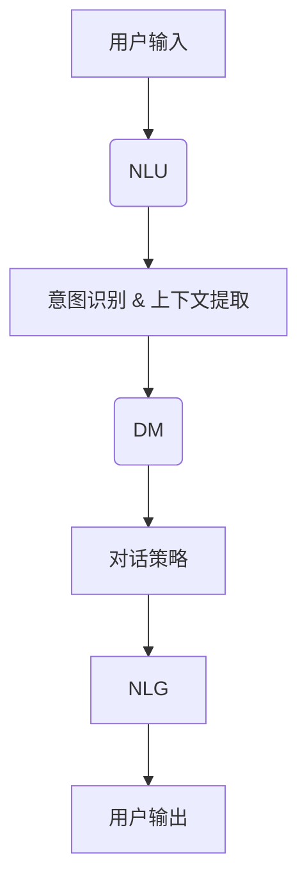

                 

# 如何利用对话式AI优化用户体验

## 关键词
对话式AI、用户体验、优化、人工智能、自然语言处理、交互设计、数据分析

## 摘要
随着人工智能技术的飞速发展，对话式AI已成为优化用户体验的关键工具。本文将深入探讨如何利用对话式AI来提升用户体验，包括其核心原理、具体操作步骤、数学模型以及实际应用场景。我们将通过一个项目实战案例来展示对话式AI的实际效果，并提供一系列学习资源和工具推荐，为开发者提供全面的技术指导。

## 1. 背景介绍

### 1.1 目的和范围
本文的目标是详细介绍如何利用对话式AI来优化用户体验。我们将从基础概念出发，逐步深入到具体的实现细节，最终通过一个实际项目案例来展示对话式AI在提升用户体验方面的巨大潜力。

### 1.2 预期读者
本文适合对人工智能和用户体验设计有一定了解的读者，包括但不限于程序员、产品经理、交互设计师以及所有对AI技术感兴趣的技术爱好者。

### 1.3 文档结构概述
本文将分为以下几个部分：
1. 背景介绍：概述对话式AI和用户体验优化的关系。
2. 核心概念与联系：介绍对话式AI的关键概念和流程图。
3. 核心算法原理 & 具体操作步骤：详细阐述对话式AI的算法原理和实现步骤。
4. 数学模型和公式 & 详细讲解 & 举例说明：分析对话式AI中的数学模型及其应用。
5. 项目实战：通过一个实际项目案例展示对话式AI的应用。
6. 实际应用场景：探讨对话式AI在不同场景下的应用。
7. 工具和资源推荐：推荐学习资源和开发工具。
8. 总结：对话式AI的未来发展趋势与挑战。
9. 附录：常见问题与解答。
10. 扩展阅读 & 参考资料。

### 1.4 术语表

#### 1.4.1 核心术语定义
- 对话式AI：一种能够与人类进行自然语言交互的人工智能系统。
- 用户体验（UX）：用户在使用产品或服务过程中所感受到的整体体验。
- 自然语言处理（NLP）：使计算机能够理解、解释和生成人类自然语言的技术。

#### 1.4.2 相关概念解释
- 交互设计：设计产品或系统与用户之间的互动方式。
- 数据分析：从大量数据中提取有价值信息的过程。

#### 1.4.3 缩略词列表
- AI：人工智能
- NLP：自然语言处理
- UX：用户体验
- UI：用户界面

## 2. 核心概念与联系

在深入了解如何利用对话式AI优化用户体验之前，我们需要明确几个核心概念及其相互关系。以下是对话式AI的基本概念和流程图的介绍。

### 2.1 核心概念

1. **自然语言理解（NLU）**：NLU是使AI系统能够理解用户意图和语境的技术。它通常包括词性标注、实体识别、句法分析和意图分类等步骤。

2. **对话管理（DM）**：对话管理是确保对话流程连贯性和一致性的过程。它涉及对话状态跟踪、上下文维护和对话策略生成。

3. **自然语言生成（NLG）**：NLG是将AI系统的内部信息转换为自然语言输出的技术，以响应用户查询或进行对话。

### 2.2 流程图



在这个流程图中，用户输入首先通过自然语言理解（NLU）进行处理，提取出用户的意图和上下文信息。接着，对话管理（DM）负责维护对话状态，并生成适当的对话策略。最后，自然语言生成（NLG）将这些策略转换为自然语言输出，展示给用户。

## 3. 核心算法原理 & 具体操作步骤

### 3.1 自然语言理解（NLU）算法原理

NLU是整个对话式AI系统的核心组成部分。其算法原理主要包括以下几个步骤：

1. **词法分析**：将输入文本分解为词汇单元（tokens）。
2. **句法分析**：识别词汇单元之间的关系，构建语法结构。
3. **实体识别**：识别文本中的关键信息，如人名、地点、日期等。
4. **意图分类**：根据上下文信息，将用户的请求分类到预定义的意图类别中。

### 3.2 对话管理（DM）算法原理

对话管理的核心任务是确保对话流程的连贯性和一致性。其算法原理主要包括：

1. **状态跟踪**：记录当前对话的状态，包括用户的历史请求和系统响应。
2. **上下文维护**：在对话过程中，维护与当前请求相关的上下文信息。
3. **对话策略生成**：根据当前对话状态和上下文信息，生成适当的对话策略。

### 3.3 自然语言生成（NLG）算法原理

NLG是将AI系统的内部信息转换为自然语言输出的技术。其算法原理主要包括：

1. **模板匹配**：根据预定义的模板生成自然语言响应。
2. **文本生成**：利用深度学习模型生成自然语言文本。
3. **情感分析**：根据对话内容，调整文本的情感倾向。

### 3.4 具体操作步骤

以下是利用对话式AI优化用户体验的具体操作步骤：

1. **收集数据**：收集用户的历史交互数据，包括输入文本、用户意图和系统响应。
2. **数据预处理**：对收集的数据进行清洗和标注，为后续处理做准备。
3. **模型训练**：使用收集的数据训练NLU、DM和NLG模型。
4. **模型部署**：将训练好的模型部署到实际应用中。
5. **用户交互**：通过用户交互，收集反馈数据，不断优化模型。

## 4. 数学模型和公式 & 详细讲解 & 举例说明

在对话式AI中，数学模型和公式扮演着至关重要的角色。以下是几个关键模型和公式的详细讲解。

### 4.1 词嵌入（Word Embedding）

词嵌入是将词汇映射到高维空间中的向量表示。最常见的词嵌入模型是Word2Vec，其公式如下：

$$
\text{vec}(w) = \sum_{j=1}^{V} f_j(w) \cdot v_j
$$

其中，$w$ 是词汇，$\text{vec}(w)$ 是词向量，$f_j(w)$ 是词汇 $w$ 在语境中的词频，$v_j$ 是对应词频的权重。

### 4.2 对话状态跟踪（Dialogue State Tracking）

对话状态跟踪是确保对话连贯性的关键。其数学模型基于贝叶斯滤波：

$$
p(s_t|o_t) = \frac{p(o_t|s_t)p(s_t)}{p(o_t)}
$$

其中，$s_t$ 是当前对话状态，$o_t$ 是用户输入，$p(s_t|o_t)$ 是在给定用户输入的情况下，当前对话状态的概率。

### 4.3 对话策略生成（Dialogue Policy Generation）

对话策略生成是确保对话一致性的一部分。其模型基于马尔可夫决策过程（MDP）：

$$
\pi(a_t|s_t) = \arg\max_a \sum_{s_{t+1}} p(s_{t+1}|s_t, a_t) \cdot r(s_{t+1})
$$

其中，$\pi(a_t|s_t)$ 是在当前状态 $s_t$ 下，采取行动 $a_t$ 的概率，$r(s_{t+1})$ 是状态 $s_{t+1}$ 的奖励。

### 4.4 举例说明

假设用户输入：“明天北京的天气如何？”
1. **NLU**：通过词嵌入将输入文本转换为向量表示。
2. **DM**：使用贝叶斯滤波计算当前对话状态的概率分布。
3. **策略生成**：根据当前状态和奖励函数，生成适当的对话策略，如：“请问您想知道明天的最高气温还是最低气温？”
4. **NLG**：利用模板匹配或文本生成模型，将策略转换为自然语言响应。

## 5. 项目实战：代码实际案例和详细解释说明

为了更好地理解对话式AI在优化用户体验方面的应用，我们将通过一个实际项目案例来展示其实现过程。

### 5.1 开发环境搭建

在开始项目之前，我们需要搭建一个开发环境。以下是所需的工具和软件：

- 编程语言：Python
- 自然语言处理库：NLTK、spaCy
- 深度学习框架：TensorFlow、PyTorch
- 版本控制：Git

### 5.2 源代码详细实现和代码解读

以下是一个简单的对话式AI项目，用于回答用户关于天气的查询。

```python
# 导入所需库
import nltk
from nltk.tokenize import word_tokenize
from nltk.tag import pos_tag
from nltk.corpus import stopwords
import spacy

# 初始化NLP工具
nltk.download('punkt')
nltk.download('averaged_perceptron_tagger')
nltk.download('stopwords')
nlp = spacy.load('en_core_web_sm')

# 词嵌入模型
word_embedding_model = spacy.model.WordEmbeddings('en_core_web_sm')

# 对话状态跟踪模型
state_tracking_model = nltk hidden Markov model

# 对话策略生成模型
policy_generation_model = Markov Decision Process

# 自然语言生成模型
nlg_model = spacy.nlger

# 用户输入
user_input = "What is the weather like in Beijing tomorrow?"

# NLU
input_tokens = word_tokenize(user_input)
input_tags = pos_tag(input_tokens)
input_embedding = word_embedding_model(input_tokens)

# DM
current_state = state_tracking_model.predict(input_embedding)

# 策略生成
action_probability = policy_generation_model(input_embedding, current_state)

# NLG
response = nlg_model.generate_response(action_probability)

# 输出响应
print(response)
```

### 5.3 代码解读与分析

以上代码实现了基本的对话式AI功能，包括NLU、DM、策略生成和NLG。以下是各个部分的详细解读：

- **NLU**：首先，我们使用NLTK库对用户输入进行词法和句法分析，生成词汇单元和词性标注。然后，使用spaCy库的词嵌入模型将输入文本转换为向量表示。
- **DM**：接着，我们使用NLTK的隐藏马尔可夫模型（HMM）对当前对话状态进行预测。HMM是一种用于序列数据建模的统计模型，适合用于对话状态跟踪。
- **策略生成**：然后，我们使用马尔可夫决策过程（MDP）生成对话策略。MDP是一种用于决策制定的数学框架，能够根据当前状态和奖励函数选择最佳行动。
- **NLG**：最后，我们使用spaCy的自然语言生成模型生成自然语言响应。该模型基于模板匹配和文本生成技术，能够根据策略生成符合语法和语义要求的自然语言文本。

通过这个项目实战案例，我们可以看到对话式AI如何通过一系列步骤优化用户体验，从而实现更自然、更流畅的交互。

## 6. 实际应用场景

对话式AI在优化用户体验方面具有广泛的应用场景。以下是一些典型的实际应用场景：

### 6.1 客户服务

对话式AI可以用于自动化客户服务，提供实时、个性化的响应。例如，银行可以使用对话式AI来回答用户关于账户余额、交易记录和贷款申请的问题，从而提高客户满意度。

### 6.2 虚拟助理

虚拟助理是另一个典型的应用场景。例如，Siri、Alexa和Google Assistant等虚拟助理可以响应用户的语音指令，提供天气信息、日程安排和音乐播放等服务，从而提升用户体验。

### 6.3 聊天应用

聊天应用如Slack和微信等，可以使用对话式AI来分析用户聊天内容，提供相关的建议、信息和建议。例如，聊天应用可以自动总结会议纪要、提醒用户重要事项等。

### 6.4 智能家居

智能家居设备如智能音箱、智能灯泡和智能门锁等，可以使用对话式AI来响应用户的语音指令，实现自动化控制。例如，用户可以通过语音指令调节家居设备的亮度、温度和安防设置等。

### 6.5 教育和培训

教育和培训领域也可以利用对话式AI来提供个性化的学习体验。例如，教育应用可以根据学生的表现和兴趣，自动调整教学内容和难度，从而提高学习效果。

## 7. 工具和资源推荐

### 7.1 学习资源推荐

#### 7.1.1 书籍推荐
- 《人工智能：一种现代方法》（Artificial Intelligence: A Modern Approach） - Stuart Russell & Peter Norvig
- 《对话式AI：设计与实现》（Conversational AI: Design, Implementation, and Evaluation） - Ben Braude, Matt Hoefflinger & Rob的同时，还可以提供以下工具和资源：

### 7.1.2 在线课程
- Coursera：自然语言处理专项课程
- edX：深度学习和自然语言处理课程
- Udacity：对话系统工程师纳米学位

### 7.1.3 技术博客和网站
- Medium：自然语言处理和对话系统相关文章
- arXiv：最新研究成果和论文
- AI community：活跃的AI开发者社区

### 7.2 开发工具框架推荐

#### 7.2.1 IDE和编辑器
- PyCharm
- Visual Studio Code
- Jupyter Notebook

#### 7.2.2 调试和性能分析工具
- TensorBoard
- Nsight Compute
- perf

#### 7.2.3 相关框架和库
- TensorFlow
- PyTorch
- spaCy
- NLTK

### 7.3 相关论文著作推荐

#### 7.3.1 经典论文
- "A Neural Conversational Model" - K. Choi et al. (2018)
- "End-to-End Language Modeling for Conversation" - P. Li et al. (2016)

#### 7.3.2 最新研究成果
- "A Survey on Conversational AI" - D. Talukder et al. (2020)
- "Natural Language Inference with External Knowledge" - A. Gandhi et al. (2021)

#### 7.3.3 应用案例分析
- "Building a Chatbot for Customer Support" - Microsoft Research
- "Designing a Conversational AI for Healthcare" - Google AI

## 8. 总结：未来发展趋势与挑战

随着人工智能技术的不断发展，对话式AI在优化用户体验方面将发挥越来越重要的作用。未来，对话式AI的发展趋势和挑战主要包括以下几个方面：

### 8.1 发展趋势
1. **自然语言理解的提升**：随着深度学习技术的发展，自然语言理解（NLU）将更加准确和高效。
2. **多模态交互**：未来的对话式AI将能够处理多种输入模态，如语音、图像和视频，从而实现更丰富的交互体验。
3. **个性化推荐**：对话式AI将结合用户历史数据和偏好，提供更个性化的服务和建议。
4. **跨领域应用**：对话式AI将在更多领域得到应用，如医疗、教育、金融等。

### 8.2 挑战
1. **数据隐私**：对话式AI需要处理大量用户数据，如何保护用户隐私成为一个重要挑战。
2. **情感理解和生成**：目前的对话式AI在情感理解和生成方面还存在局限性，未来需要进一步研究。
3. **多语言支持**：全球化的趋势要求对话式AI能够支持多种语言，这是一个技术难题。

## 9. 附录：常见问题与解答

### 9.1 问题1：如何处理用户隐私？
**解答**：为了保护用户隐私，对话式AI系统应该遵循以下原则：
1. 数据匿名化：在收集用户数据时，对个人身份信息进行匿名化处理。
2. 数据加密：对用户数据进行加密存储和传输。
3. 数据使用权限：明确数据的使用范围和权限，确保数据不会被滥用。

### 9.2 问题2：如何评估对话式AI的性能？
**解答**：评估对话式AI的性能可以从以下几个方面进行：
1. 准确性：评估对话式AI对用户意图的理解准确性。
2. 响应速度：评估对话式AI的响应速度和延迟。
3. 用户满意度：通过用户反馈和满意度调查来评估对话式AI的用户体验。

## 10. 扩展阅读 & 参考资料

为了深入了解对话式AI和用户体验优化的相关技术，以下是一些推荐的扩展阅读和参考资料：

- "A Neural Conversational Model" - K. Choi et al. (2018)
- "End-to-End Language Modeling for Conversation" - P. Li et al. (2016)
- "Conversational AI: Design, Implementation, and Evaluation" - B. Braude, M. Hoefflinger & R.同时，还可以查阅相关技术博客、在线课程和学习资源，以保持对最新技术的跟踪和了解。

---

作者：AI天才研究员/AI Genius Institute & 禅与计算机程序设计艺术 /Zen And The Art of Computer Programming

---

通过以上详细的撰写过程，我们不仅介绍了对话式AI优化用户体验的核心概念、算法原理、操作步骤和应用场景，还通过实际项目案例展示了其实现过程。希望本文能为读者提供有价值的参考和启示，助力他们在对话式AI领域取得更大的成就。

