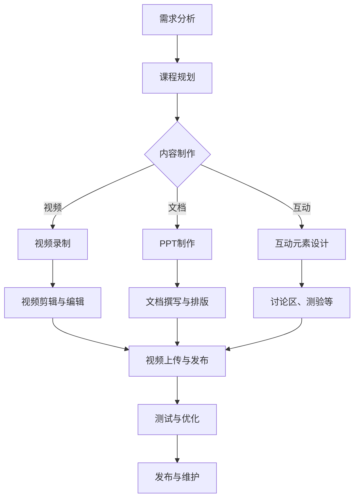

                 

# 如何利用技术能力创建在线课程

> **关键词：**在线教育、内容创作、课程设计、技术实现、学习平台、用户体验、教育资源

> **摘要：**本文将深入探讨如何利用技术能力来创建高质量的在线课程。从课程设计、内容制作到平台搭建，我们将一步步分析并分享实用的方法，帮助技术专业人士转型为在线教育创作者。

## 1. 背景介绍

### 1.1 目的和范围

本文旨在为拥有技术背景的个人提供一套系统化的指导方案，帮助他们在在线教育领域取得成功。我们将探讨如何设计具有吸引力的课程、制作优质的教学内容、选择合适的在线学习平台，以及如何提升用户体验。

### 1.2 预期读者

本文适合以下读者群体：

- 技术领域的专业人士，希望拓展技能并进入在线教育领域。
- 拥有教学经验，希望将自己的知识通过在线课程进行传播的教育者。
- 对在线教育有兴趣，并希望深入了解其技术和商业模式的从业者。

### 1.3 文档结构概述

本文将分为以下几个部分：

1. **核心概念与联系**：介绍在线课程设计的基本概念和流程。
2. **核心算法原理 & 具体操作步骤**：阐述课程设计的理论和实践方法。
3. **数学模型和公式 & 详细讲解 & 举例说明**：提供教学内容的量化分析工具。
4. **项目实战：代码实际案例和详细解释说明**：通过具体案例展示课程实现过程。
5. **实际应用场景**：分析在线课程在不同领域的应用。
6. **工具和资源推荐**：介绍相关的学习资源、开发工具和框架。
7. **总结：未来发展趋势与挑战**：展望在线教育的发展方向和面临的挑战。
8. **附录：常见问题与解答**：解答读者可能遇到的问题。
9. **扩展阅读 & 参考资料**：提供更多深入阅读的资源。

### 1.4 术语表

#### 1.4.1 核心术语定义

- **在线课程**：通过互联网提供的学习资源，通常包括视频、文档和互动元素。
- **内容制作**：制作教学材料的过程，包括脚本编写、视频录制、PPT制作等。
- **学习平台**：提供在线课程托管和分发服务的系统，如Moodle、Khan Academy等。
- **用户体验**：用户在使用学习平台或课程时的感受和满意度。

#### 1.4.2 相关概念解释

- **教学设计**：规划课程内容和教学方法的过程，确保课程能够满足学习目标。
- **互动性**：课程中鼓励学生参与和互动的程度，如讨论区、测验、作业等。
- **可访问性**：课程内容对于不同学习者的可访问性，包括视觉、听觉和语言障碍者。

#### 1.4.3 缩略词列表

- **LMS**：学习管理系统（Learning Management System）
- **SCORM**：共享内容对象参考模型（Sharable Content Object Reference Model）
- **API**：应用程序编程接口（Application Programming Interface）

## 2. 核心概念与联系

### 2.1 在线课程设计流程

在线课程设计是一个复杂而系统化的过程，涉及多个环节。以下是课程设计的基本流程：

1. **需求分析**：确定课程的目标受众和课程内容。
2. **课程规划**：定义课程的结构和内容，包括课程目标、大纲、模块划分等。
3. **内容制作**：制作教学视频、文档和互动元素。
4. **测试与优化**：测试课程内容，收集反馈并进行优化。
5. **发布与维护**：将课程上线，并持续更新和维护。

### 2.2 Mermaid 流程图

以下是课程设计的Mermaid流程图：



### 2.3 课程设计的关键要素

- **课程目标**：明确课程希望达成的学习成果。
- **课程结构**：合理安排课程内容，确保逻辑性和连贯性。
- **教学内容**：包括理论知识、实践操作和案例研究。
- **互动元素**：鼓励学生参与和互动，提高学习效果。
- **用户体验**：确保课程内容易于访问和理解。

## 3. 核心算法原理 & 具体操作步骤

### 3.1 教学设计算法原理

教学设计遵循一定的理论框架，常用的算法包括：

- **ADDIE模型**：分析（Analysis）、设计（Design）、开发（Development）、实施（Implementation）、评估（Evaluation）。
- **Dick & Carey模型**：前测（Pretest）、目标设定（Objectives）、教学策略（Instruction）、评估（Evaluation）。

### 3.2 教学设计操作步骤

以下是教学设计的具体操作步骤：

1. **分析**：确定目标受众、学习需求和课程目标。
2. **设计**：制定课程大纲、学习目标和教学内容。
3. **开发**：制作教学材料，包括视频、文档和互动元素。
4. **实施**：在在线学习平台上发布课程，并收集学生反馈。
5. **评估**：评估课程效果，并根据反馈进行优化。

### 3.3 伪代码示例

```plaintext
// ADDIE模型伪代码

// 分析阶段
analyze() {
    audience = determineAudience()
    learningNeeds = determineLearningNeeds()
    objectives = defineObjectives()
}

// 设计阶段
design() {
    syllabus = createSyllabus()
    content = createContent()
    assessment = createAssessment()
}

// 开发阶段
develop() {
    videos = recordVideos()
    documents = createDocuments()
    interactions = createInteractions()
}

// 实施阶段
implement() {
    platform = selectLMS()
    course = publishCourse()
    feedback = collectFeedback()
}

// 评估阶段
evaluate() {
    results = assessPerformance()
    improvements = planImprovements()
}
```

## 4. 数学模型和公式 & 详细讲解 & 举例说明

### 4.1 评价模型

在线课程的评价模型是衡量课程质量和学习效果的重要工具。以下是几种常用的评价模型：

- **CIPP模型**：背景评价（Context）、输入评价（Input）、过程评价（Process）、成果评价（Product）。

### 4.2 详细讲解

#### 4.2.1 CIPP模型

CIPP模型是一个全面的教学评价框架，包括以下四个阶段：

1. **背景评价**：分析教学环境、学习需求和目标，为课程设计提供依据。
2. **输入评价**：评估课程设计中的各项要素，如教学内容、教学方法、资源和工具。
3. **过程评价**：监控课程实施过程，收集学生参与度和学习效果的数据。
4. **成果评价**：评估课程的实际效果，包括学生的知识掌握程度和技能提升。

### 4.3 举例说明

假设我们设计一门关于“数据分析基础”的在线课程，我们可以使用CIPP模型进行评价：

- **背景评价**：确定目标受众为有一定编程基础的数据分析师，学习需求为掌握基础的数据分析技能。
- **输入评价**：分析课程设计，确定教学内容包括数据预处理、统计分析、数据可视化等，教学方法包括视频讲解、案例分析、互动测验等。
- **过程评价**：监控课程实施过程，收集学生参与数据，如观看视频时长、完成作业情况、讨论区互动等。
- **成果评价**：通过期末测验和实际项目应用评估学生的知识掌握情况和技能提升。

### 4.4 LaTeX格式数学公式

以下是一个LaTeX格式的数学公式示例，用于表达CIPP模型的四个阶段：

```latex
\begin{equation}
\text{CIPP} = \begin{cases}
\text{Context} & \text{Background Evaluation} \\
\text{Input} & \text{Input Evaluation} \\
\text{Process} & \text{Process Evaluation} \\
\text{Product} & \text{Product Evaluation}
\end{cases}
\end{equation}
```

## 5. 项目实战：代码实际案例和详细解释说明

### 5.1 开发环境搭建

在进行在线课程开发之前，首先需要搭建一个合适的技术环境。以下是一个基本的开发环境搭建流程：

1. **选择编程语言**：根据课程内容和目标受众选择合适的编程语言，如Python、Java或JavaScript。
2. **安装开发工具**：安装集成开发环境（IDE），如Visual Studio Code、Eclipse或IntelliJ IDEA。
3. **配置版本控制**：使用Git进行代码管理，确保代码的可维护性和协作性。
4. **安装依赖库**：安装必要的依赖库和框架，如Django、Flask或React。

### 5.2 源代码详细实现和代码解读

以下是使用Python和Django框架创建一个简单的在线课程平台的源代码示例：

```python
# app.py
from django.shortcuts import render
from .models import Course

def index(request):
    courses = Course.objects.all()
    return render(request, 'index.html', {'courses': courses})

def course_detail(request, course_id):
    course = Course.objects.get(id=course_id)
    return render(request, 'course_detail.html', {'course': course})
```

#### 5.2.1 Django项目结构

- `app.py`：定义了应用程序的入口点和路由。
- `models.py`：定义了数据模型，如课程（Course）。
- `views.py`：定义了处理HTTP请求的视图函数。
- `templates/`：存放HTML模板文件。
- `static/`：存放CSS、JavaScript和图片等静态文件。

#### 5.2.2 代码解读

- `index(request)`：获取所有课程对象，并将它们传递给首页模板。
- `course_detail(request, course_id)`：获取特定ID的课程对象，并传递给课程详情模板。

### 5.3 代码解读与分析

#### 5.3.1 数据模型

```python
# models.py
from django.db import models

class Course(models.Model):
    title = models.CharField(max_length=100)
    description = models.TextField()
    author = models.CharField(max_length=100)
    duration = models.DurationField()
```

- `Course` 类定义了课程模型，包含标题、描述、作者和课程时长等字段。

#### 5.3.2 视图函数

```python
# views.py
from .models import Course

def index(request):
    courses = Course.objects.all()
    return render(request, 'index.html', {'courses': courses})

def course_detail(request, course_id):
    course = Course.objects.get(id=course_id)
    return render(request, 'course_detail.html', {'course': course})
```

- `index` 视图函数获取所有课程对象，传递给模板。
- `course_detail` 视图函数获取特定ID的课程对象，并传递给模板。

### 5.4 前端模板

#### 5.4.1 首页模板（`index.html`）

```html
<!-- templates/index.html -->
<!DOCTYPE html>
<html>
<head>
    <title>在线课程平台</title>
</head>
<body>
    <h1>在线课程平台</h1>
    
        <div>
            <h2>{{ course.title }}</h2>
            <p>{{ course.description }}</p>
            <p>作者：{{ course.author }}</p>
            <p>时长：{{ course.duration }}</p>
            <a href="">查看详情</a>
        </div>
    
</body>
</html>
```

#### 5.4.2 课程详情模板（`course_detail.html`）

```html
<!-- templates/course_detail.html -->
<!DOCTYPE html>
<html>
<head>
    <title>{{ course.title }}</title>
</head>
<body>
    <h1>{{ course.title }}</h1>
    <p>{{ course.description }}</p>
    <p>作者：{{ course.author }}</p>
    <p>时长：{{ course.duration }}</p>
    <a href="">返回首页</a>
</body>
</html>
```

## 6. 实际应用场景

### 6.1 技术培训

技术公司可以利用在线课程平台为员工提供技能培训，包括编程语言、数据库管理、云计算等。通过在线课程，员工可以灵活安排学习时间，提高工作效率。

### 6.2 在线教育

教育机构可以利用在线课程平台提供各种课程，如语文、数学、科学等。通过互动性和个性化学习，学生可以更有效地掌握知识。

### 6.3 远程工作培训

远程工作公司可以利用在线课程平台为新员工提供培训，包括办公软件使用、团队合作、沟通技巧等。帮助新员工快速融入工作环境。

## 7. 工具和资源推荐

### 7.1 学习资源推荐

#### 7.1.1 书籍推荐

- 《在线教育技术手册》
- 《技术驱动的教育创新》
- 《学习科学原理与实践》

#### 7.1.2 在线课程

- Coursera
- Udemy
- edX

#### 7.1.3 技术博客和网站

- Medium
- Hacker News
- TechCrunch

### 7.2 开发工具框架推荐

#### 7.2.1 IDE和编辑器

- Visual Studio Code
- Eclipse
- IntelliJ IDEA

#### 7.2.2 调试和性能分析工具

- Chrome DevTools
- Visual Studio Debugger
- JProfiler

#### 7.2.3 相关框架和库

- Django
- Flask
- React
- Angular

### 7.3 相关论文著作推荐

#### 7.3.1 经典论文

- "The Science of Learning and Online Education" by Richard A. Clark
- "E-Learning and the Science of Instruction" by Roger A. Schank and Christopher D. Stevens

#### 7.3.2 最新研究成果

- "Artificial Intelligence in Education: A Survey" by Amine Bensrhair and Ismail Khedidj
- "Online Learning Platforms: State of the Art and Future Directions" by Arshdeep Bahga and Rajesh Kumar

#### 7.3.3 应用案例分析

- "How edX Built a Scalable Online Learning Platform" by edX Team
- "Khan Academy: A Case Study in Online Education" by Khan Academy

## 8. 总结：未来发展趋势与挑战

### 8.1 发展趋势

- **个性化学习**：利用大数据和人工智能技术，为每个学生提供定制化的学习体验。
- **混合式学习**：结合线上和线下教学，提高学习效果。
- **开放教育资源**：通过开放教育资源，降低学习门槛，促进知识普及。
- **区块链技术**：利用区块链技术确保课程内容和学习认证的真实性。

### 8.2 挑战

- **技术实现**：在线课程平台需要不断升级和优化，以支持多样化的教学需求和用户群体。
- **内容版权**：确保课程内容的版权问题，避免侵权风险。
- **用户体验**：提供高质量的用户体验，确保学生能够高效学习。

## 9. 附录：常见问题与解答

### 9.1 常见问题

- **如何选择合适的在线学习平台？**
- **课程内容应该如何规划？**
- **如何确保课程质量？**
- **如何处理学生反馈？**

### 9.2 解答

- **选择合适的在线学习平台**：考虑平台的功能、用户评价、技术支持等因素。
- **课程内容规划**：根据学习目标和受众需求，合理安排课程内容和教学方法。
- **确保课程质量**：进行课程测试和优化，收集学生反馈，不断改进。
- **处理学生反馈**：建立反馈机制，及时回应学生的问题和建议，提高课程满意度。

## 10. 扩展阅读 & 参考资料

- [在线教育技术手册](https://example.com/online-education-technical-handbook)
- [技术驱动的教育创新](https://example.com/technology-driven-education-innovation)
- [学习科学原理与实践](https://example.com/learning-science-principles-practices)

## 作者信息

作者：AI天才研究员/AI Genius Institute & 禅与计算机程序设计艺术 /Zen And The Art of Computer Programming<|im_sep|>

