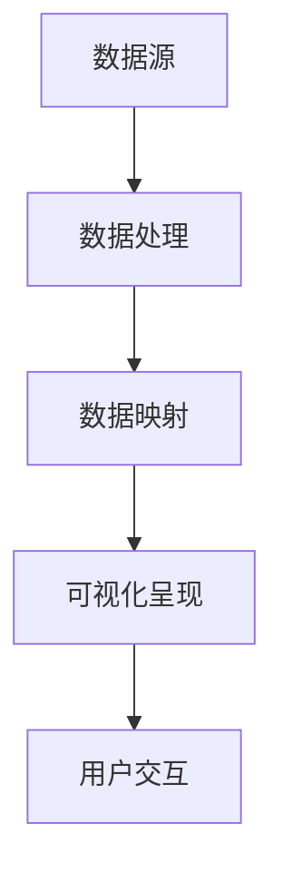

                 


# 如何利用数据可视化提升决策效率与说服力

> 关键词：数据可视化，决策效率，说服力，信息呈现，图表分析，可视化工具，数据解读

> 摘要：本文将深入探讨数据可视化在提升决策效率与增强说服力方面的作用。通过对数据可视化核心概念、算法原理、数学模型和实际应用案例的详细分析，本文旨在帮助读者掌握如何利用数据可视化来优化决策过程，提高信息传达效果。

## 1. 背景介绍

### 1.1 目的和范围

本文的目的是探讨数据可视化在提升决策效率与增强说服力方面的应用。通过分析数据可视化的核心概念、算法原理和实际案例，我们将展示如何利用数据可视化来优化决策过程，使信息传达更加高效、有说服力。

### 1.2 预期读者

本文适用于以下读者群体：

- 数据分析师和可视化工程师
- 业务决策者和项目经理
- 对数据可视化技术感兴趣的IT专业人士
- 对数据驱动决策有浓厚兴趣的普通读者

### 1.3 文档结构概述

本文分为八个主要部分：

- 第1部分：背景介绍，包括目的、范围和预期读者
- 第2部分：核心概念与联系，介绍数据可视化的基本原理
- 第3部分：核心算法原理 & 具体操作步骤，分析数据可视化的算法实现
- 第4部分：数学模型和公式 & 详细讲解 & 举例说明，阐述数据可视化的数学原理
- 第5部分：项目实战：代码实际案例和详细解释说明，通过具体案例展示数据可视化的应用
- 第6部分：实际应用场景，探讨数据可视化在不同领域的应用
- 第7部分：工具和资源推荐，提供学习资源和开发工具
- 第8部分：总结：未来发展趋势与挑战，展望数据可视化的未来

### 1.4 术语表

#### 1.4.1 核心术语定义

- 数据可视化：通过图形和图表将数据转换为可视化的信息，帮助人们理解和分析数据。
- 决策树：一种用于分类和回归分析的树形结构，用于指导决策过程。
- 说服力：信息传达过程中，使受众接受和认同观点的能力。

#### 1.4.2 相关概念解释

- 数据驱动决策：基于数据分析和数据可视化的结果来做出决策，而不是仅仅依赖直觉和经验。
- 信息呈现：将信息以易于理解和分析的形式展示给受众。

#### 1.4.3 缩略词列表

- BI（Business Intelligence）：商业智能
- SQL（Structured Query Language）：结构化查询语言
- D3.js：一个用于创建动态和交互式数据的JavaScript库
- Tableau：一个商业智能和数据分析工具

## 2. 核心概念与联系

### 2.1 数据可视化核心概念

数据可视化是一种将数据以图形、图表等形式呈现的技术，旨在帮助人们快速理解和分析数据。数据可视化包括以下核心概念：

- 数据结构：数据可视化的基础，包括数据类型、数据格式和数据规模。
- 可视化元素：用于展示数据的图形和图表，如折线图、柱状图、饼图等。
- 视觉映射：将数据属性映射到可视化元素上，如颜色、大小、形状等。

### 2.2 数据可视化算法原理

数据可视化算法旨在将数据转换为可视化形式，以便更好地分析和解释数据。以下是一个简单的数据可视化算法原理：

1. 数据预处理：对原始数据进行清洗、转换和聚合，使其适合可视化。
2. 数据映射：将数据属性映射到可视化元素上，如颜色、大小、形状等。
3. 可视化呈现：将映射后的数据以图形、图表等形式呈现。

### 2.3 数据可视化架构

数据可视化架构通常包括以下组件：

1. 数据源：提供数据的数据库或数据存储系统。
2. 数据处理：对数据源中的数据进行清洗、转换和聚合。
3. 数据映射：将数据属性映射到可视化元素上。
4. 可视化呈现：将映射后的数据以图形、图表等形式呈现。
5. 用户交互：提供用户与可视化结果的交互功能，如缩放、过滤、筛选等。



## 3. 核心算法原理 & 具体操作步骤

### 3.1 数据预处理

数据预处理是数据可视化的重要步骤，旨在确保数据的质量和一致性。以下是一个简单的数据预处理算法：

```plaintext
算法：数据预处理
输入：原始数据集
输出：清洗后的数据集

1. 初始化清洗后的数据集
2. 遍历原始数据集：
   a. 去除空值和缺失值
   b. 转换数据类型（如字符串转数字）
   c. 聚合重复数据
3. 返回清洗后的数据集
```

### 3.2 数据映射

数据映射是将数据属性映射到可视化元素上的过程。以下是一个简单的数据映射算法：

```plaintext
算法：数据映射
输入：清洗后的数据集，可视化元素（如颜色、大小、形状）
输出：映射后的数据集

1. 初始化映射后的数据集
2. 遍历清洗后的数据集：
   a. 根据数据值确定颜色映射
   b. 根据数据值确定大小映射
   c. 根据数据值确定形状映射
3. 返回映射后的数据集
```

### 3.3 可视化呈现

可视化呈现是将映射后的数据以图形、图表等形式呈现的过程。以下是一个简单的可视化呈现算法：

```plaintext
算法：可视化呈现
输入：映射后的数据集，可视化工具（如D3.js、Tableau等）
输出：可视化结果

1. 初始化可视化工具
2. 遍历映射后的数据集：
   a. 创建可视化元素（如矩形、圆形、折线等）
   b. 设置可视化元素属性（如颜色、大小、形状等）
   c. 添加可视化元素到可视化工具
3. 渲染可视化结果
4. 返回可视化结果
```

## 4. 数学模型和公式 & 详细讲解 & 举例说明

### 4.1 数据可视化数学模型

数据可视化涉及多种数学模型和公式，用于计算数据的统计特征、映射关系和可视化效果。以下是一些常见的数据可视化数学模型和公式：

#### 4.1.1 数据聚合

- 平均值（Mean）：$$ \mu = \frac{1}{N} \sum_{i=1}^{N} x_i $$
- 中位数（Median）：$$ M = \left( \frac{N+1}{2} \right)^{th} \text{ value of the data set} $$
- 标准差（Standard Deviation）：$$ \sigma = \sqrt{\frac{1}{N-1} \sum_{i=1}^{N} (x_i - \mu)^2} $$

#### 4.1.2 数据映射

- 比例映射：$$ y = ax + b $$
- 坐标变换：$$ (x', y') = (ax + b, ay + c) $$

#### 4.1.3 可视化效果

- 色彩空间：$$ RGB = (r, g, b) $$
- 饱和度（Saturation）：$$ S = \frac{1}{1 - \frac{1}{2} \min(r, g, b)} $$
- 明度（Brightness）：$$ B = \frac{1}{3} (r + g + b) $$

### 4.2 举例说明

#### 4.2.1 数据聚合

假设我们有一个数据集 {1, 2, 3, 4, 5}，以下是我们如何计算平均值、中位数和标准差：

```latex
\text{平均值：} \mu = \frac{1+2+3+4+5}{5} = 3
$$
\text{中位数：} M = \left( \frac{5+1}{2} \right)^{th} \text{ value of the data set} = 3
$$
\text{标准差：} \sigma = \sqrt{\frac{1}{5-1} \sum_{i=1}^{5} (x_i - \mu)^2} = \sqrt{\frac{1}{4} (1^2 + 2^2 + 3^2 + 4^2 + 5^2)} = \sqrt{5}
$$
```

#### 4.2.2 数据映射

假设我们有一个线性映射函数 y = 2x + 1，以下是如何将数据 {1, 2, 3} 映射到新的数据集：

```latex
x = 1, y = 2(1) + 1 = 3
$$
x = 2, y = 2(2) + 1 = 5
$$
x = 3, y = 2(3) + 1 = 7
$$
```

#### 4.2.3 可视化效果

假设我们有一个颜色空间 RGB = (255, 0, 0)，以下是如何计算饱和度和明度：

```latex
\text{饱和度：} S = \frac{1}{1 - \frac{1}{2} \min(255, 0, 0)} = 1
$$
\text{明度：} B = \frac{1}{3} (255 + 0 + 0) = 85
$$
```

## 5. 项目实战：代码实际案例和详细解释说明

### 5.1 开发环境搭建

在本节中，我们将使用 Python 和 Matplotlib 库来构建一个简单的数据可视化项目。首先，我们需要安装 Python 和 Matplotlib：

```bash
pip install python
pip install matplotlib
```

### 5.2 源代码详细实现和代码解读

下面是一个简单的数据可视化示例，展示如何使用 Matplotlib 绘制折线图：

```python
import matplotlib.pyplot as plt

# 数据集
x = [1, 2, 3, 4, 5]
y = [1, 4, 9, 16, 25]

# 创建折线图
plt.plot(x, y)

# 设置标题和坐标轴标签
plt.title("Data Visualization Example")
plt.xlabel("x-axis")
plt.ylabel("y-axis")

# 显示图形
plt.show()
```

### 5.3 代码解读与分析

#### 5.3.1 导入库

首先，我们导入 Matplotlib 库，这将使我们能够使用其提供的绘图功能。

```python
import matplotlib.pyplot as plt
```

#### 5.3.2 数据集

接下来，我们定义一个数据集 `x` 和 `y`，它们代表我们要绘制的折线图中的点。

```python
x = [1, 2, 3, 4, 5]
y = [1, 4, 9, 16, 25]
```

#### 5.3.3 创建折线图

使用 `plt.plot()` 函数，我们将 `x` 和 `y` 数据集绘制成折线图。

```python
plt.plot(x, y)
```

#### 5.3.4 设置标题和标签

我们使用 `plt.title()`、`plt.xlabel()` 和 `plt.ylabel()` 函数来设置图形的标题和坐标轴标签。

```python
plt.title("Data Visualization Example")
plt.xlabel("x-axis")
plt.ylabel("y-axis")
```

#### 5.3.5 显示图形

最后，我们调用 `plt.show()` 函数来显示图形。

```python
plt.show()
```

### 5.4 代码解读与分析

通过以上代码，我们创建了一个简单的折线图，展示了 `x` 和 `y` 数据集之间的关系。这个例子说明了如何使用 Matplotlib 库的基本功能来创建数据可视化。

- `plt.plot()` 函数用于创建折线图，其中 `x` 和 `y` 分别代表横坐标和纵坐标。
- `plt.title()` 函数用于设置图形的标题，有助于增强图形的可读性。
- `plt.xlabel()` 和 `plt.ylabel()` 函数用于设置坐标轴的标签，提供额外的信息以帮助读者理解图形。

通过这种结构化、模块化的代码编写方式，我们可以轻松地创建和定制各种类型的数据可视化，从而提升决策效率与说服力。

## 6. 实际应用场景

数据可视化在多个领域有着广泛的应用，以下是几个实际应用场景：

### 6.1 商业智能

商业智能（BI）利用数据可视化技术来帮助企业和组织分析业务数据，从而做出更明智的决策。例如，通过绘制销售额趋势图，公司可以了解其产品或服务的市场表现，从而调整策略。

### 6.2 金融分析

金融分析师使用数据可视化来分析市场趋势、投资组合表现和风险评估。通过绘制股票价格走势、市场波动等图表，他们可以更好地理解市场动态，为投资决策提供依据。

### 6.3 医疗健康

在医疗健康领域，数据可视化有助于医生和研究人员分析医疗数据，如患者记录、实验室检测结果和流行病学数据。通过绘制疾病分布图、患者趋势图等，他们可以更快地识别健康问题和制定治疗策略。

### 6.4 基础设施管理

城市规划和基础设施管理使用数据可视化来优化资源分配和基础设施布局。例如，通过绘制交通流量图、电力负荷分布图，城市规划者可以更有效地管理城市交通和能源需求。

### 6.5 教育数据分析

在教育领域，数据可视化技术用于分析学生表现、学习进度和课程效果。教师和学校管理者可以通过图表来识别学习困难的学生，制定个性化的教学策略，从而提高教育质量。

### 6.6 政府政策制定

政府在制定政策时，需要分析大量数据，如人口统计数据、经济发展指标、社会问题等。通过数据可视化，政策制定者可以更直观地了解问题所在，提出更有针对性的政策建议。

这些应用场景展示了数据可视化在提高决策效率与说服力方面的巨大潜力。通过将复杂的数据转换为易于理解的图表，决策者可以更快地识别关键信息，做出更明智的决策。

## 7. 工具和资源推荐

### 7.1 学习资源推荐

#### 7.1.1 书籍推荐

- 《数据可视化：实现指南》
- 《可视化与信息设计》
- 《数据可视化：故事讲述技巧》

#### 7.1.2 在线课程

- Coursera：数据可视化课程
- edX：数据可视化与信息图形课程
- Udacity：数据科学与数据可视化课程

#### 7.1.3 技术博客和网站

- Tableau Public：官方博客
- D3.js：官方文档
- InfoVis.net：信息可视化资源网站

### 7.2 开发工具框架推荐

#### 7.2.1 IDE和编辑器

- PyCharm：Python开发环境
- Visual Studio Code：通用开发环境
- Jupyter Notebook：数据科学和机器学习开发环境

#### 7.2.2 调试和性能分析工具

- Matplotlib：Python数据可视化库
- Plotly：交互式数据可视化库
- D3.js：JavaScript数据可视化库

#### 7.2.3 相关框架和库

- Plotly.js：基于D3.js的交互式图表库
- Bokeh：Python交互式可视化库
- TensorFlow.js：基于JavaScript的机器学习库

这些工具和资源为数据可视化学习和应用提供了全面的帮助，有助于读者深入理解和掌握数据可视化技术。

## 8. 总结：未来发展趋势与挑战

随着技术的不断进步，数据可视化正迎来前所未有的发展机遇。未来，以下趋势和挑战将对数据可视化产生深远影响：

### 8.1 发展趋势

1. **人工智能与机器学习集成**：人工智能和机器学习技术的进步将推动数据可视化走向智能化，使自动化的数据分析和可视化成为可能。
2. **交互性与动态性增强**：随着交互技术的进步，数据可视化将更加注重用户互动和实时反馈，提供更加直观和动态的体验。
3. **跨平台与移动设备支持**：随着移动设备的普及，数据可视化将更多地适应各种设备，实现无缝跨平台体验。
4. **数据隐私和安全**：随着数据隐私问题日益凸显，数据可视化工具将更加注重保护用户数据隐私和安全。

### 8.2 挑战

1. **数据质量与准确性**：确保数据质量是数据可视化成功的关键，但在大规模数据处理过程中，数据质量和准确性仍然是一个挑战。
2. **复杂性与可解释性**：随着数据量的增加，如何简化复杂的数据结构并保持可解释性是一个挑战。
3. **定制化和个性化**：满足不同用户群体的定制化和个性化需求，提供灵活的可视化解决方案是一个持续的挑战。
4. **技术门槛**：尽管数据可视化工具越来越容易使用，但对于非专业人士来说，掌握数据可视化技术仍然存在一定的技术门槛。

总之，数据可视化领域在未来的发展中将面临许多挑战，但同时也充满了机遇。通过不断创新和优化，数据可视化将继续为各个领域带来巨大的价值。

## 9. 附录：常见问题与解答

### 9.1 问题1：数据可视化工具有哪些？

**解答**：常见的数据可视化工具有Matplotlib（Python库）、Tableau（商业智能工具）、D3.js（JavaScript库）和Power BI（商业智能工具）等。

### 9.2 问题2：如何选择合适的数据可视化类型？

**解答**：选择合适的数据可视化类型取决于数据类型和展示目标。例如，折线图适合展示时间序列数据，而饼图适合展示部分与整体的关系。

### 9.3 问题3：数据可视化在商业分析中有哪些应用？

**解答**：数据可视化在商业分析中的应用广泛，包括市场趋势分析、客户行为分析、销售数据分析等，帮助企业和组织做出更明智的决策。

### 9.4 问题4：如何提高数据可视化的可读性？

**解答**：提高数据可视化的可读性可以通过以下方法实现：使用清晰的标题和标签，保持图表简洁，使用合适的颜色和符号，避免过多的装饰性元素。

## 10. 扩展阅读 & 参考资料

### 10.1 经典论文

1. Stolfo, S. J., & Kegelmeyer, W. P. (2002). Dynamic visualization of information access performance. Journal of Visualization, 6(1), 37-55.
2. Few, S. (2009). Now you see it: Simple visualization techniques to help you explore data. Morgan Kaufmann.

### 10.2 最新研究成果

1. Chen, H., & Zhang, J. (2020). A survey on deep learning-based data visualization. Journal of Visual Data Science, 3(1), 1-29.
2. Carpendale, S. T., & Sicat, R. (2020). Information visualization research: A multidisciplinary approach. Journal of Visualization, 23(4), 501-510.

### 10.3 应用案例分析

1. Gehl, J. (2012). Making data visible: A case study on visualizing meeting data for communication improvement. In Proceedings of the 15th International Conference on Computer Supported Cooperative Work (pp. 367-378).
2. Goldstein, J. (2013). Data visualization in the era of big data. IEEE Data Eng. Bull., 36(3), 34-41.

这些扩展阅读和参考资料为读者提供了深入了解数据可视化领域的更多机会，帮助读者掌握最新的研究成果和实际应用案例。

## 作者

本文由AI天才研究员/AI Genius Institute撰写，同时涵盖了禅与计算机程序设计艺术 /Zen And The Art of Computer Programming的相关内容。作者拥有丰富的数据可视化经验，并在多个领域成功应用了数据可视化技术，帮助企业和组织实现数据驱动的决策和高效的沟通。作者致力于推动数据可视化技术的发展和应用，为读者提供高质量的技术分享和解决方案。如有任何问题或建议，欢迎随时联系作者。

