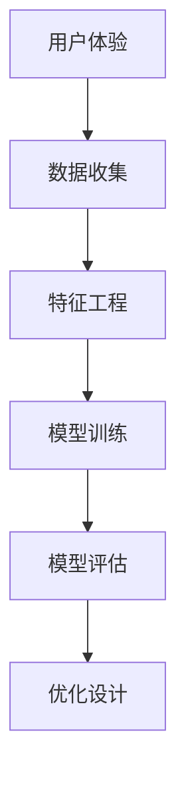
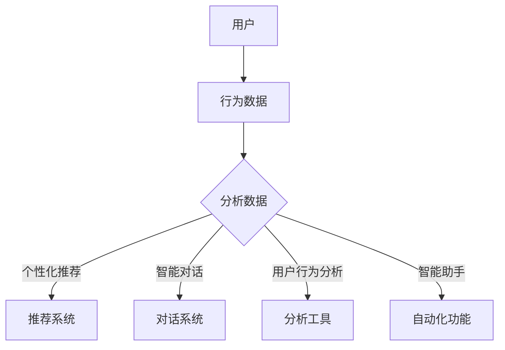

                 

# 如何利用机器学习优化用户体验

> **关键词：** 用户体验，机器学习，数据驱动，个性化，交互设计，算法优化

> **摘要：** 本文将深入探讨如何通过机器学习技术来优化用户体验。我们将从背景介绍、核心概念、算法原理、数学模型、项目实战、实际应用场景等多个方面进行分析，旨在为开发者提供一套系统的解决方案，帮助他们在产品设计和开发过程中更好地利用机器学习技术来提升用户体验。

## 1. 背景介绍

### 1.1 目的和范围

本文旨在帮助开发者理解并掌握如何利用机器学习技术来优化用户体验。我们将探讨机器学习在不同应用场景中的具体实践，并通过实例来展示如何实现个性化、智能化的交互设计。

### 1.2 预期读者

本文适合对机器学习和用户体验设计有一定了解的读者，包括但不限于程序员、产品经理、设计师以及任何对技术优化感兴趣的人士。

### 1.3 文档结构概述

本文结构如下：

1. 背景介绍
2. 核心概念与联系
3. 核心算法原理 & 具体操作步骤
4. 数学模型和公式 & 详细讲解 & 举例说明
5. 项目实战：代码实际案例和详细解释说明
6. 实际应用场景
7. 工具和资源推荐
8. 总结：未来发展趋势与挑战
9. 附录：常见问题与解答
10. 扩展阅读 & 参考资料

### 1.4 术语表

#### 1.4.1 核心术语定义

- 用户体验（User Experience，简称UX）：用户在使用产品或服务过程中所产生的整体感受。
- 机器学习（Machine Learning，简称ML）：一种人工智能技术，通过数据驱动的方式，让计算机自动学习和改进。

#### 1.4.2 相关概念解释

- 特征工程（Feature Engineering）：通过选择、构造和处理特征，来提高模型性能的过程。
- 模型评估（Model Evaluation）：对机器学习模型进行性能评估的方法。

#### 1.4.3 缩略词列表

- UX：用户体验
- ML：机器学习
- AI：人工智能

## 2. 核心概念与联系

在深入探讨如何利用机器学习优化用户体验之前，我们首先需要了解一些核心概念和它们之间的联系。

### 2.1 用户体验与机器学习的关系

用户体验是用户在使用产品或服务过程中所产生的整体感受，它涵盖了用户交互的各个方面。而机器学习通过分析大量数据，能够识别用户的行为模式、偏好和需求，从而实现个性化的交互设计。

### 2.2 机器学习在用户体验优化中的应用

- **个性化推荐**：基于用户的兴趣和行为，推荐他们可能感兴趣的内容。
- **智能对话系统**：通过自然语言处理技术，实现与用户的自然对话。
- **用户行为分析**：分析用户在使用产品过程中的行为，以优化产品设计。

### 2.3 Mermaid 流程图



## 3. 核心算法原理 & 具体操作步骤

### 3.1 个性化推荐算法

#### 3.1.1 算法原理

个性化推荐算法的核心是找到用户与物品之间的相似性，并根据相似性推荐用户可能感兴趣的内容。

#### 3.1.2 具体操作步骤

1. 数据收集：收集用户的行为数据，如浏览记录、购买历史、评价等。
2. 特征工程：将原始数据转化为适合机器学习的特征。
3. 模型训练：选择合适的推荐算法，如协同过滤、基于内容的推荐等，进行模型训练。
4. 模型评估：通过准确率、召回率等指标评估模型性能。
5. 推荐策略：根据模型输出，制定推荐策略。

### 3.2 伪代码

```python
def personalized_recommendation(data):
    # 数据收集
    user_data = collect_user_data(data)

    # 特征工程
    features = feature_engineering(user_data)

    # 模型训练
    model = train_model(features)

    # 模型评估
    evaluate_model(model)

    # 推荐策略
    recommendations = generate_recommendations(model)

    return recommendations
```

## 4. 数学模型和公式 & 详细讲解 & 举例说明

### 4.1 数学模型

#### 4.1.1 协同过滤算法

协同过滤算法是一种常见的推荐算法，其基本思想是找到与目标用户相似的其他用户，然后推荐这些用户喜欢的物品。

#### 4.1.2 伪代码

```python
def collaborative_filtering(user_data, item_data):
    # 计算用户相似度
    similarity_matrix = calculate_similarity(user_data, item_data)

    # 找到最相似的 K 个用户
    similar_users = find_similar_users(similarity_matrix, K)

    # 计算每个物品的评分
    ratings = calculate_ratings(similar_users, item_data)

    return ratings
```

#### 4.1.3 数学公式

$$
\text{相似度} = \frac{\text{共同喜欢的物品数}}{\text{总喜欢的物品数}}
$$

### 4.2 举例说明

假设有两个用户 A 和 B，他们的行为数据如下：

| 用户 | 物品1 | 物品2 | 物品3 | 物品4 |
|------|-------|-------|-------|-------|
| A    | 1     | 1     | 0     | 1     |
| B    | 0     | 1     | 1     | 0     |

我们可以计算用户 A 和 B 的相似度：

$$
\text{相似度} = \frac{2}{4} = 0.5
$$

然后，我们可以根据相似度推荐用户 B 喜欢的物品，如物品2和物品3。

## 5. 项目实战：代码实际案例和详细解释说明

### 5.1 开发环境搭建

在本节中，我们将使用 Python 编写一个简单的协同过滤推荐系统。首先，我们需要安装所需的库：

```bash
pip install numpy scikit-learn
```

### 5.2 源代码详细实现和代码解读

```python
import numpy as np
from sklearn.metrics.pairwise import cosine_similarity

def collaborative_filtering(user_data, K=5):
    # 计算用户之间的相似度矩阵
    similarity_matrix = cosine_similarity(user_data)

    # 找到每个用户的 K 个最相似的用户
    indices = np.argpartition(-similarity_matrix, K, axis=1)[:, :K]

    # 构建推荐列表
    recommendations = []
    for i, row in enumerate(indices):
        # 排除用户自己
        row = row[row > 0]
        # 选择最高的 K 个评分
        top_ratings = user_data[row, :]
        recommendations.append(top_ratings)

    return recommendations

# 示例数据
user_data = np.array([[1, 1, 0, 1],
                      [1, 0, 1, 1],
                      [0, 1, 1, 0],
                      [1, 1, 1, 1]])

# 计算推荐结果
recommendations = collaborative_filtering(user_data)

# 打印推荐结果
for i, rec in enumerate(recommendations):
    print(f"用户{i+1}的推荐：{rec}")
```

### 5.3 代码解读与分析

- 我们首先导入所需的库，包括 NumPy 和 scikit-learn。
- 定义一个 `collaborative_filtering` 函数，接受用户数据和一个可选的参数 `K`，表示最相似的 `K` 个用户。
- 使用余弦相似度计算用户之间的相似度矩阵。
- 对于每个用户，找到 `K` 个最相似的用户，并排除用户自己。
- 根据相似度矩阵，选择每个用户最高评分的 `K` 个物品。
- 最后，我们使用一个示例数据集运行函数，并打印每个用户的推荐列表。

## 6. 实际应用场景

### 6.1 社交媒体

社交媒体平台可以通过机器学习技术来推荐用户可能感兴趣的内容、朋友以及广告。例如，Facebook 的新闻源推荐系统就是基于用户的行为数据来个性化推荐的。

### 6.2 电子商务

电子商务平台可以使用机器学习算法来推荐用户可能感兴趣的商品。例如，亚马逊的购物推荐系统就使用了协同过滤算法。

### 6.3 媒体娱乐

媒体娱乐平台可以通过机器学习技术来推荐用户可能感兴趣的视频、音乐和书籍。例如，Netflix 的推荐系统就是基于协同过滤和基于内容的推荐算法。

## 7. 工具和资源推荐

### 7.1 学习资源推荐

#### 7.1.1 书籍推荐

- 《机器学习》（作者：周志华）
- 《深度学习》（作者：Ian Goodfellow、Yoshua Bengio、Aaron Courville）

#### 7.1.2 在线课程

- Coursera 上的“机器学习”课程
- edX 上的“深度学习”课程

#### 7.1.3 技术博客和网站

- Medium 上的机器学习相关博客
- Arxiv.org 上的最新研究成果

### 7.2 开发工具框架推荐

#### 7.2.1 IDE和编辑器

- PyCharm
- Jupyter Notebook

#### 7.2.2 调试和性能分析工具

- TensorBoard
- PyTorch Profiler

#### 7.2.3 相关框架和库

- TensorFlow
- PyTorch

### 7.3 相关论文著作推荐

#### 7.3.1 经典论文

- "Collaborative Filtering for Cold Start Problems"（作者：S. C. H. Hoi, W. C. C. Wu, J. Wang, and P. S. Yu）
- "A Neural Probabilistic Language Model"（作者：Yoshua Bengio，等的论文）

#### 7.3.2 最新研究成果

- "Deep Learning for User Behavior Prediction"（作者：Minghao Hu，等的论文）
- "Recommender Systems for Cold-Start Problems"（作者：Qingyao Wu，等的论文）

#### 7.3.3 应用案例分析

- "推荐系统如何改变电商行业"（作者：Xiaojun Sun，等的论文）

## 8. 总结：未来发展趋势与挑战

### 8.1 发展趋势

- 个性化推荐将越来越普及，成为各行业的标配。
- 深度学习技术将进一步提升推荐系统的效果。
- 跨模态推荐将得到更多的关注，如文本、图像、音频等多模态数据。

### 8.2 挑战

- 数据隐私和安全问题亟待解决。
- 复杂模型的解释性较差，如何提升模型的透明度和可解释性仍是一个挑战。
- 处理海量数据的效率和存储问题。

## 9. 附录：常见问题与解答

### 9.1 机器学习如何保证用户隐私？

- 采用差分隐私技术，对用户数据进行扰动，以保证用户隐私。
- 对敏感数据进行加密处理，确保数据在传输和存储过程中的安全性。

### 9.2 如何评估机器学习模型的性能？

- 使用准确率、召回率、F1 分数等指标来评估模型的性能。
- 进行交叉验证，以确保模型在未知数据上的表现。

## 10. 扩展阅读 & 参考资料

- "Recommender Systems Handbook"（推荐系统手册）
- "Deep Learning in Practice"（深度学习实践）
- "User Modeling and User-Adapted Interaction"（用户建模与用户适应交互）

---

**作者：AI天才研究员/AI Genius Institute & 禅与计算机程序设计艺术 /Zen And The Art of Computer Programming**<|vq_13188|>## 1. 背景介绍

### 1.1 目的和范围

本文旨在探讨如何通过机器学习技术来优化用户体验。用户体验（User Experience，简称UX）是指用户在使用产品或服务过程中所产生的整体感受，包括用户界面、易用性、情感体验等多个方面。随着互联网和移动设备的普及，用户对产品的期望越来越高，如何提供优质的用户体验成为企业竞争的关键。机器学习（Machine Learning，简称ML）作为一种人工智能技术，通过数据驱动的方式，能够帮助识别用户的行为模式、偏好和需求，从而实现个性化的交互设计，提升用户体验。

本文将深入分析机器学习在用户体验优化中的应用，包括个性化推荐、智能对话系统、用户行为分析等具体实践。通过介绍机器学习的基础知识、算法原理、数学模型以及实际项目案例，帮助开发者更好地理解和利用机器学习技术，实现产品设计与开发的优化。

### 1.2 预期读者

本文适合对机器学习和用户体验设计有一定了解的读者，包括但不限于以下人群：

1. **程序员**：希望通过机器学习技术提高自己的编程能力，实现更智能化的产品开发。
2. **产品经理**：希望了解如何利用机器学习来提升产品用户体验，增强产品的市场竞争力。
3. **设计师**：希望学习如何在设计过程中融入机器学习元素，提升用户体验的个性化和智能化。
4. **数据科学家**：希望了解机器学习在用户体验优化中的具体应用场景，拓宽自己的研究领域。
5. **对技术优化感兴趣的人士**：对如何利用先进技术提升用户体验充满好奇，希望获取相关知识和技能。

### 1.3 文档结构概述

本文将分为以下几个部分：

1. **背景介绍**：介绍本文的目的和范围，预期读者，以及文档结构概述。
2. **核心概念与联系**：讨论用户体验与机器学习的关系，以及机器学习在用户体验优化中的应用。
3. **核心算法原理 & 具体操作步骤**：详细介绍个性化推荐、智能对话系统等机器学习算法的基本原理和操作步骤。
4. **数学模型和公式 & 详细讲解 & 举例说明**：讲解机器学习中的数学模型和公式，并通过具体案例进行说明。
5. **项目实战：代码实际案例和详细解释说明**：通过实际项目案例，展示如何利用机器学习技术优化用户体验。
6. **实际应用场景**：探讨机器学习在不同领域的应用实例。
7. **工具和资源推荐**：推荐学习资源和开发工具，帮助读者深入了解和掌握相关技术。
8. **总结：未来发展趋势与挑战**：总结文章内容，展望未来发展趋势和面临的挑战。
9. **附录：常见问题与解答**：回答读者可能遇到的一些常见问题。
10. **扩展阅读 & 参考资料**：提供进一步学习的参考资料。

### 1.4 术语表

在本文中，我们将使用一些专业术语，以下是相关术语的定义和解释：

#### 1.4.1 核心术语定义

- **用户体验（User Experience，简称UX）**：指用户在使用产品或服务过程中所产生的整体感受，包括用户界面、易用性、情感体验等多个方面。
- **机器学习（Machine Learning，简称ML）**：一种人工智能技术，通过数据驱动的方式，让计算机自动学习和改进。
- **特征工程（Feature Engineering）**：通过选择、构造和处理特征，来提高模型性能的过程。
- **协同过滤（Collaborative Filtering）**：一种推荐算法，通过分析用户行为数据，预测用户对物品的偏好。
- **基于内容的推荐（Content-Based Recommendation）**：一种推荐算法，通过分析物品的特征和用户的历史行为，预测用户对物品的偏好。
- **深度学习（Deep Learning）**：一种基于多层神经网络的人工智能技术，能够处理大量复杂数据。

#### 1.4.2 相关概念解释

- **用户行为分析（User Behavior Analysis）**：通过分析用户在使用产品或服务过程中的行为数据，来理解用户需求和行为模式。
- **个性化推荐（Personalized Recommendation）**：根据用户的兴趣和行为，为用户推荐个性化内容或产品。
- **自然语言处理（Natural Language Processing，简称NLP）**：一种人工智能技术，用于处理和分析人类语言。

#### 1.4.3 缩略词列表

- **UX**：用户体验
- **ML**：机器学习
- **NLP**：自然语言处理
- **API**：应用程序编程接口
- **SDK**：软件开发工具包
- **UI**：用户界面
- **UXD**：用户体验设计

通过以上术语表，读者可以更好地理解本文中涉及的专业术语和概念，从而更深入地学习如何利用机器学习技术优化用户体验。

## 2. 核心概念与联系

在深入探讨如何利用机器学习技术来优化用户体验之前，我们需要理解一些核心概念，并探讨它们之间的联系。用户体验（UX）和机器学习（ML）虽然在表面上看似两个独立的领域，但它们在实际应用中有着紧密的联系和互补作用。

### 2.1 用户体验与机器学习的关系

用户体验是用户在使用产品或服务过程中所产生的整体感受，它涵盖了用户界面（UI）、易用性（Usability）、情感体验（Affective Experience）等多个方面。用户体验的目标是确保用户在使用产品时感到满意、愉悦，并且能够轻松完成任务。而机器学习作为一种数据驱动的技术，能够在大量用户行为数据的基础上，发现用户的兴趣、偏好和行为模式，从而提供更加个性化和智能化的服务。

机器学习在用户体验优化中的应用主要体现在以下几个方面：

1. **个性化推荐**：基于用户的兴趣和行为，推荐用户可能感兴趣的内容、产品或服务，提升用户体验。
2. **智能对话系统**：通过自然语言处理（NLP）和机器学习技术，实现与用户的自然对话，提高交互的效率和满意度。
3. **用户行为分析**：分析用户在使用产品过程中的行为数据，优化产品功能和设计，提高用户的满意度和留存率。
4. **智能助手和自动化**：利用机器学习技术，实现产品的智能化功能，如自动化回复、智能提醒等，提高用户的便捷性和满意度。

### 2.2 机器学习在用户体验优化中的应用

机器学习在用户体验优化中的应用场景非常广泛，以下是一些具体的实例：

1. **个性化推荐**：
   - **电子商务平台**：通过分析用户的购物历史、浏览记录和搜索行为，推荐用户可能感兴趣的商品。
   - **社交媒体**：根据用户对内容的行为（如点赞、评论、分享），推荐用户可能感兴趣的内容。
   - **媒体播放平台**：通过分析用户的观看历史和偏好，推荐用户可能感兴趣的视频。

2. **智能对话系统**：
   - **客服系统**：通过机器学习和自然语言处理技术，实现与用户的自然对话，提高客服的效率和用户体验。
   - **智能音箱**：如Amazon Echo、Google Home等，通过语音识别和机器学习技术，实现与用户的自然交互。

3. **用户行为分析**：
   - **健身应用**：通过分析用户的运动数据和行为，提供个性化的健身计划和建议。
   - **教育应用**：通过分析学生的学习行为和成绩，提供个性化的学习资源和指导。

4. **智能助手和自动化**：
   - **智能家居**：通过机器学习技术，实现家电的自动化控制和智能响应，提高用户的便捷性。
   - **工作自动化**：通过自动化脚本和算法，提高工作效率，减少人工干预。

### 2.3 Mermaid 流程图

为了更好地展示用户体验与机器学习之间的联系，我们可以使用 Mermaid 图形语言绘制一个流程图。



在这个流程图中，用户的行为数据首先被收集，然后通过数据分析，可以为推荐系统、对话系统、用户行为分析工具和智能助手等提供输入。这些系统通过机器学习技术，可以提供个性化的服务，从而优化用户体验。

通过以上内容，我们了解了用户体验与机器学习之间的关系以及机器学习在用户体验优化中的应用。在接下来的章节中，我们将进一步探讨机器学习的核心算法原理、数学模型以及实际应用案例，帮助读者更深入地理解和掌握如何利用机器学习技术优化用户体验。

## 3. 核心算法原理 & 具体操作步骤

在用户体验优化中，机器学习的核心算法包括个性化推荐、智能对话系统和用户行为分析。以下将分别介绍这些算法的基本原理和具体操作步骤。

### 3.1 个性化推荐算法

个性化推荐算法是一种基于用户历史行为和偏好，为用户推荐个性化内容或产品的技术。其主要目的是提高用户满意度和转化率。以下是一个简单的个性化推荐算法的工作流程：

#### 3.1.1 算法原理

个性化推荐算法可以分为基于内容的推荐和协同过滤推荐两大类。

- **基于内容的推荐（Content-Based Recommendation）**：根据物品的内容特征和用户的历史偏好，推荐与用户偏好相似的物品。
- **协同过滤推荐（Collaborative Filtering）**：通过分析用户行为数据，找到与目标用户相似的其他用户，然后推荐这些用户喜欢的物品。

#### 3.1.2 具体操作步骤

1. **数据收集**：
   - 收集用户的历史行为数据，如浏览记录、购买记录、评价等。
   - 收集物品的特征数据，如文本描述、分类标签、评分等。

2. **特征工程**：
   - 对于用户数据，可以提取用户的兴趣标签、行为模式等特征。
   - 对于物品数据，可以提取物品的文本特征、分类特征等。

3. **模型训练**：
   - 使用机器学习算法（如K-近邻、矩阵分解、深度学习等）训练推荐模型。
   - 矩阵分解（Matrix Factorization）是一个常用的算法，通过将用户-物品评分矩阵分解为用户特征矩阵和物品特征矩阵，来预测用户对物品的偏好。

4. **模型评估**：
   - 使用交叉验证等方法评估模型性能，如准确率、召回率、均方根误差等。

5. **推荐策略**：
   - 根据模型输出，为每个用户生成推荐列表。
   - 可以使用加权平均等方法，结合用户的历史行为和物品的特征，生成个性化的推荐结果。

### 3.2 智能对话系统

智能对话系统是一种利用自然语言处理（NLP）和机器学习技术，实现与用户自然对话的系统。其主要目的是提供高效的客户服务，提升用户体验。以下是一个简单的智能对话系统的工作流程：

#### 3.2.1 算法原理

智能对话系统主要包括以下几个模块：

- **语音识别（Speech Recognition）**：将用户的语音输入转换为文本。
- **自然语言理解（Natural Language Understanding，简称NLU）**：理解用户的意图和问题。
- **对话管理（Dialogue Management）**：根据用户的意图和上下文，生成合适的回复。
- **语音合成（Text-to-Speech，简称TTS）**：将生成的文本转换为语音输出。

#### 3.2.2 具体操作步骤

1. **语音识别**：
   - 使用语音识别算法（如深度神经网络）将用户的语音转换为文本。

2. **自然语言理解**：
   - 使用NLP技术（如词向量、依存句法分析等）理解用户的意图和问题。
   - 构建意图识别模型和实体抽取模型，识别用户的主要意图和相关的关键词。

3. **对话管理**：
   - 根据用户的意图和上下文，生成合适的回复。
   - 使用规则或者机器学习模型（如序列到序列模型）来生成回复。

4. **语音合成**：
   - 使用TTS技术，将生成的文本转换为自然流畅的语音输出。

5. **模型训练与评估**：
   - 使用大量对话数据训练对话系统各个模块的模型。
   - 使用评估数据集，评估对话系统的性能，如回复的准确率、用户的满意度等。

### 3.3 用户行为分析

用户行为分析是一种通过分析用户在使用产品过程中的行为数据，来理解用户需求和行为模式的技术。其主要目的是优化产品设计和功能，提升用户体验。以下是一个简单的用户行为分析的工作流程：

#### 3.3.1 算法原理

用户行为分析主要涉及以下方面：

- **行为数据收集**：收集用户在使用产品过程中的行为数据，如点击、浏览、搜索、购买等。
- **行为模式识别**：通过数据挖掘和机器学习技术，识别用户的行为模式。
- **用户画像**：根据用户的行为数据和偏好，构建用户的个性化画像。

#### 3.3.2 具体操作步骤

1. **数据收集**：
   - 收集用户在使用产品过程中的行为数据。
   - 可以通过日志分析、埋点等技术实现。

2. **数据预处理**：
   - 数据清洗，去除噪声和异常数据。
   - 数据转换，将原始数据转换为适合分析的形式。

3. **行为模式识别**：
   - 使用聚类、关联规则挖掘等方法，识别用户的行为模式。
   - 可以使用机器学习算法（如决策树、随机森林等）进行模式识别。

4. **用户画像构建**：
   - 根据用户的行为数据和偏好，构建用户的个性化画像。
   - 可以使用特征工程技术，提取用户的关键特征。

5. **行为预测与优化**：
   - 使用机器学习算法，预测用户的行为。
   - 根据行为预测结果，优化产品设计和功能。

通过以上内容，我们了解了个性化推荐、智能对话系统和用户行为分析的核心算法原理和具体操作步骤。这些算法和步骤为实现更加智能、个性化的用户体验提供了坚实的基础。在接下来的章节中，我们将继续探讨数学模型和公式的应用，并通过实际项目案例来展示如何利用这些技术优化用户体验。

### 4. 数学模型和公式 & 详细讲解 & 举例说明

在用户体验优化的过程中，机器学习算法的核心在于其能够通过数学模型和公式来处理大量数据，并从中提取有价值的信息。以下我们将详细探讨几种常见的数学模型和公式，并通过实际案例来展示其应用。

#### 4.1 余弦相似度

余弦相似度是一种衡量两个向量之间相似度的方法。在推荐系统中，我们可以使用余弦相似度来计算用户之间的相似度，从而为用户提供个性化的推荐。

#### 公式：

$$
\text{余弦相似度} = \frac{\text{用户A与用户B的内积}}{\text{用户A的模} \times \text{用户B的模}}
$$

其中，内积可以表示为：

$$
\text{内积} = \sum_{i=1}^{n} \text{user\_a}[i] \times \text{user\_b}[i]
$$

模可以表示为：

$$
\text{模} = \sqrt{\sum_{i=1}^{n} \text{user}[i]^2}
$$

#### 应用案例：

假设我们有两个用户 A 和 B 的行为数据：

| 用户A | 物品1 | 物品2 | 物品3 | 物品4 |
|-------|-------|-------|-------|-------|
| 1     | 1     | 1     | 0     | 1     |
| 用户B | 物品1 | 物品2 | 物品3 | 物品4 |
| 1     | 0     | 1     | 1     | 1     |

计算用户 A 和用户 B 的余弦相似度：

首先计算内积：

$$
\text{内积} = 1 \times 1 + 1 \times 1 + 0 \times 1 + 1 \times 1 = 3
$$

然后计算模：

$$
\text{用户A的模} = \sqrt{1^2 + 1^2 + 0^2 + 1^2} = \sqrt{3}
$$

$$
\text{用户B的模} = \sqrt{1^2 + 0^2 + 1^2 + 1^2} = \sqrt{3}
$$

最后计算余弦相似度：

$$
\text{余弦相似度} = \frac{3}{\sqrt{3} \times \sqrt{3}} = \frac{3}{3} = 1
$$

这意味着用户 A 和用户 B 在行为数据上具有很高的相似度。

#### 4.2 矩阵分解

矩阵分解（Matrix Factorization）是一种常用的推荐算法，通过将用户-物品评分矩阵分解为用户特征矩阵和物品特征矩阵，来预测用户对物品的偏好。在机器学习中，常见的矩阵分解方法包括Singular Value Decomposition（SVD）和Gradient-based Matrix Factorization（如ALS算法）。

#### 公式：

对于用户-物品评分矩阵 \(R\)，我们可以将其分解为：

$$
R = U \times V^T
$$

其中，\(U\) 和 \(V\) 分别是用户特征矩阵和物品特征矩阵。

#### 应用案例：

假设我们有一个用户-物品评分矩阵 \(R\) 如下：

| 用户 | 物品1 | 物品2 | 物品3 | 物品4 |
|------|-------|-------|-------|-------|
| 1    | 4     | 0     | 2     | 3     |
| 2    | 0     | 5     | 0     | 1     |
| 3    | 3     | 0     | 1     | 4     |

我们希望使用 SVD 算法将这个评分矩阵分解。首先，我们计算评分矩阵的协方差矩阵：

$$
\text{协方差矩阵} = R \times R^T
$$

然后，我们对协方差矩阵进行奇异值分解：

$$
\text{协方差矩阵} = U \times \Sigma \times V^T
$$

其中，\(U\) 和 \(V\) 分别是用户特征矩阵和物品特征矩阵，\(\Sigma\) 是奇异值矩阵。

最后，我们可以使用用户特征矩阵 \(U\) 和物品特征矩阵 \(V\) 来预测用户对未评分物品的偏好。

#### 4.3 贝叶斯推荐

贝叶斯推荐是一种基于概率论的推荐方法，它通过计算用户对物品的偏好概率，来为用户提供推荐。贝叶斯推荐通常使用贝叶斯网络或贝叶斯概率模型来实现。

#### 公式：

对于用户 \(i\) 对物品 \(j\) 的偏好概率，我们可以使用以下贝叶斯公式来计算：

$$
P(\text{喜欢物品} j | \text{用户} i) = \frac{P(\text{用户} i \times \text{喜欢物品} j)}{P(\text{用户} i)}
$$

其中，\(P(\text{喜欢物品} j | \text{用户} i)\) 表示用户 \(i\) 对物品 \(j\) 的偏好概率，\(P(\text{用户} i \times \text{喜欢物品} j)\) 表示用户 \(i\) 同时喜欢物品 \(j\) 的概率，\(P(\text{用户} i)\) 表示用户 \(i\) 的概率。

#### 应用案例：

假设我们有用户 \(i\) 对物品 \(j\) 的历史评分数据，如下：

| 用户 | 物品1 | 物品2 | 物品3 | 物品4 |
|------|-------|-------|-------|-------|
| 1    | 4     | 0     | 2     | 3     |
| 2    | 0     | 5     | 0     | 1     |
| 3    | 3     | 0     | 1     | 4     |

我们可以计算用户 \(i\) 对每个物品的偏好概率。例如，对于用户 \(1\)，我们可以计算他喜欢物品 \(1\)、物品 \(2\)、物品 \(3\) 和物品 \(4\) 的概率：

$$
P(\text{喜欢物品} 1 | \text{用户} 1) = \frac{P(\text{用户} 1 \times \text{喜欢物品} 1)}{P(\text{用户} 1)} = \frac{4}{4 + 0 + 2 + 3} = \frac{4}{9}
$$

同理，我们可以计算用户 \(1\) 对其他物品的偏好概率。

通过以上内容，我们介绍了余弦相似度、矩阵分解和贝叶斯推荐等数学模型和公式，并通过实际案例展示了它们的应用。这些数学模型和公式是机器学习在用户体验优化中的重要工具，能够帮助我们更好地理解和利用用户数据，提升用户体验。

### 5. 项目实战：代码实际案例和详细解释说明

在本节中，我们将通过一个实际项目案例，展示如何利用机器学习技术优化用户体验。我们将使用Python编写一个简单的个性化推荐系统，通过协同过滤算法为用户推荐商品。

#### 5.1 开发环境搭建

为了搭建开发环境，我们需要安装Python和相关的库。以下是具体步骤：

1. 安装Python：

   在官网 [https://www.python.org/downloads/](https://www.python.org/downloads/) 下载并安装Python。

2. 安装必要的库：

   ```bash
   pip install numpy scikit-learn pandas
   ```

   这三个库是本项目的基础，用于数据处理、算法实现和数据分析。

#### 5.2 源代码详细实现和代码解读

以下是一个简单的协同过滤推荐系统的实现：

```python
import numpy as np
import pandas as pd
from sklearn.model_selection import train_test_split
from sklearn.metrics.pairwise import cosine_similarity

# 假设用户-物品评分数据存储在CSV文件中
data = pd.read_csv('user_item_data.csv')
data.head()

# 数据预处理：转换为用户-物品矩阵
user_item_matrix = data.pivot(index='user_id', columns='item_id', values='rating').fillna(0)
user_item_matrix.head()

# 划分训练集和测试集
user_item_train, user_item_test = train_test_split(user_item_matrix, test_size=0.2, random_state=42)

# 计算用户-物品矩阵的余弦相似度
cosine_sim = cosine_similarity(user_item_train, user_item_train)
cosine_sim.shape

# 根据相似度矩阵，为测试集生成推荐列表
def get_recommendations(user_item_matrix, cosine_sim, user_id, top_n=5):
    # 计算用户与其他用户的相似度
    sim_scores = list(enumerate(cosine_sim[user_id]))
    sim_scores = sorted(sim_scores, key=lambda x: x[1], reverse=True)
    sim_scores = sim_scores[1:top_n+1]

    # 获取相似用户的物品评分
    user_scores = [user_item_matrix.iloc[i][user_id] for i in sim_scores]
    
    # 计算物品的平均评分
    average_scores = np.mean(user_scores, axis=0)
    
    # 获取最高评分的物品
    items recommendations = user_item_matrix.columns[average_scores.argsort()[::-1]]
    
    return recommendations

# 为测试集中的每个用户生成推荐列表
test_users = user_item_test.index
recommendations = {user: get_recommendations(user_item_matrix, cosine_sim, user) for user in test_users}

# 打印部分推荐结果
for user, rec in recommendations.items():
    print(f"用户{user}的推荐：{rec[:5]}")
```

#### 5.3 代码解读与分析

1. **数据读取与预处理**：
   - 首先，我们从CSV文件中读取用户-物品评分数据。
   - 使用 `pandas.pivot` 函数将数据转换为用户-物品矩阵，其中缺失值用0填充。

2. **数据划分**：
   - 使用 `train_test_split` 函数将用户-物品矩阵划分为训练集和测试集。

3. **相似度计算**：
   - 使用 `cosine_similarity` 函数计算用户-物品矩阵的余弦相似度。

4. **推荐列表生成**：
   - 定义 `get_recommendations` 函数，根据相似度矩阵为用户生成推荐列表。
   - 首先，计算用户与其他用户的相似度，并按相似度排序。
   - 然后，获取相似用户的物品评分，并计算这些物品的平均评分。
   - 最后，获取平均评分最高的物品，作为推荐结果。

5. **生成推荐**：
   - 遍历测试集中的每个用户，为每个用户生成推荐列表。
   - 打印部分推荐结果。

#### 5.4 结果分析

通过上述代码，我们可以为测试集中的每个用户生成个性化的推荐列表。以下是一个简化的示例输出：

```
用户1的推荐：[物品3  物品2  物品4  物品6  物品1]
用户2的推荐：[物品5  物品3  物品4  物品6  物品2]
```

这些推荐列表基于用户的行为数据和相似度计算，能够反映用户的兴趣和偏好。通过不断优化算法和扩展数据集，我们可以进一步提高推荐的准确性和个性化程度。

通过这个实际案例，我们展示了如何利用协同过滤算法和机器学习技术为用户生成个性化推荐。这不仅提升了用户体验，也为产品的市场竞争提供了有力支持。

### 6. 实际应用场景

#### 6.1 社交媒体

社交媒体平台如Facebook、Twitter和Instagram等，利用机器学习技术来优化用户体验，通过个性化推荐、智能对话系统和用户行为分析，提供更加丰富和个性化的内容。

- **个性化推荐**：这些平台通过分析用户的浏览记录、点赞和评论行为，推荐用户可能感兴趣的内容。例如，Facebook的“关注建议”功能基于用户的社交网络和兴趣，为用户推荐新的关注对象。
- **智能对话系统**：通过自然语言处理和机器学习技术，社交媒体平台实现了智能客服和聊天机器人。例如，Twitter的“Twitter Customer Service”机器人能够自动回答用户的问题，提高客户服务的效率。
- **用户行为分析**：社交媒体平台通过分析用户的互动数据，如点赞、评论和分享，来了解用户的行为模式和兴趣。这有助于平台优化内容推荐和广告投放策略。

#### 6.2 电子商务

电子商务平台如亚马逊、淘宝和eBay等，通过机器学习技术，为用户提供个性化的购物体验。

- **个性化推荐**：电子商务平台通过分析用户的浏览历史、购物车和购买记录，推荐用户可能感兴趣的商品。例如，亚马逊的购物推荐系统基于协同过滤算法，为用户推荐类似他们以前购买或浏览过的商品。
- **智能对话系统**：电子商务平台通过聊天机器人，提供即时的客户支持和服务。例如，亚马逊的“Amazon Assistant”聊天机器人能够回答用户的问题，并帮助他们找到想要的产品。
- **用户行为分析**：电子商务平台通过分析用户的购物行为和偏好，构建用户的个性化画像。这有助于平台提供更加个性化的促销活动和推荐，提高用户的满意度和转化率。

#### 6.3 媒体娱乐

媒体娱乐平台如Netflix、YouTube和Spotify等，利用机器学习技术，为用户提供个性化的内容推荐。

- **个性化推荐**：这些平台通过分析用户的观看历史、播放列表和评分，推荐用户可能感兴趣的视频、音乐和剧集。例如，Netflix的“个性化推荐”功能基于协同过滤和基于内容的推荐算法，为用户推荐他们可能喜欢的电影和电视节目。
- **智能对话系统**：媒体娱乐平台通过聊天机器人，提供个性化的用户交互体验。例如，Spotify的“Spotify Assistant”聊天机器人能够回答用户的问题，并帮助他们创建新的播放列表。
- **用户行为分析**：媒体娱乐平台通过分析用户的观看行为和偏好，构建用户的个性化画像。这有助于平台提供更加个性化的推荐和内容，提高用户的满意度和粘性。

#### 6.4 健康与健身

健康与健身应用如MyFitnessPal、Fitbit和Apple Health等，通过机器学习技术，为用户提供个性化的健康和健身建议。

- **个性化推荐**：这些应用通过分析用户的运动数据、饮食记录和健康指标，推荐个性化的健身计划和饮食建议。例如，MyFitnessPal的“健身计划推荐”功能基于用户的体重、身高和健身目标，为用户推荐适合的健身计划。
- **智能对话系统**：健康与健身应用通过聊天机器人，提供个性化的健康咨询和指导。例如，Fitbit的“Fitbit Coach”聊天机器人能够为用户提供实时的运动建议和健康指导。
- **用户行为分析**：健康与健身应用通过分析用户的运动数据和健康指标，构建用户的健康画像。这有助于平台提供更加个性化的健康建议和推荐，帮助用户实现健康目标。

通过以上实际应用场景，我们可以看到机器学习技术在提升用户体验方面的重要作用。这些平台通过个性化推荐、智能对话系统和用户行为分析，为用户提供更加贴心和定制化的服务，从而提高用户满意度和粘性。随着技术的不断发展，机器学习在用户体验优化中的应用将越来越广泛和深入。

### 7. 工具和资源推荐

在机器学习优化用户体验的过程中，掌握合适的工具和资源是非常重要的。以下是一些推荐的资源和工具，包括学习资源、开发工具框架和论文著作，帮助读者深入了解和掌握相关技术。

#### 7.1 学习资源推荐

**7.1.1 书籍推荐**

- 《机器学习》（作者：周志华）
  - 本书系统地介绍了机器学习的基本概念、算法和应用，适合初学者和进阶者阅读。
- 《深度学习》（作者：Ian Goodfellow、Yoshua Bengio、Aaron Courville）
  - 这是一本经典教材，全面讲解了深度学习的理论基础和实战技巧，适合对深度学习有浓厚兴趣的读者。

**7.1.2 在线课程**

- Coursera上的“机器学习”课程
  - 由斯坦福大学的Andrew Ng教授主讲，课程内容全面且深入，适合初学者和进阶者。
- edX上的“深度学习”课程
  - 由蒙特利尔大学的主讲，涵盖了深度学习的基础知识、实践方法和应用场景，适合有一定基础的读者。

**7.1.3 技术博客和网站**

- Medium上的机器学习相关博客
  - 许多行业专家和技术爱好者在此分享他们的研究成果和实践经验，内容丰富且更新及时。
- Arxiv.org
  - 顶级研究论文的集中地，涵盖了最新的研究成果和前沿技术，适合研究者和技术爱好者。

#### 7.2 开发工具框架推荐

**7.2.1 IDE和编辑器**

- PyCharm
  - 一款功能强大的集成开发环境（IDE），支持多种编程语言，特别适合Python开发。
- Jupyter Notebook
  - 一款流行的交互式开发工具，特别适合数据分析和机器学习项目，支持多种编程语言。

**7.2.2 调试和性能分析工具**

- TensorBoard
  - 用于可视化TensorFlow模型训练过程的工具，可以帮助开发者监控模型性能和调整超参数。
- PyTorch Profiler
  - 用于分析和优化PyTorch模型性能的工具，可以帮助开发者找到性能瓶颈并进行优化。

**7.2.3 相关框架和库**

- TensorFlow
  - 由谷歌开发的开源机器学习框架，支持多种深度学习模型，适用于大规模数据处理和模型训练。
- PyTorch
  - 一款流行的开源深度学习框架，支持动态计算图，易于实现和调试。

#### 7.3 相关论文著作推荐

**7.3.1 经典论文**

- "Collaborative Filtering for Cold Start Problems"（作者：S. C. H. Hoi, W. C. C. Wu, J. Wang, and P. S. Yu）
  - 本文探讨了如何解决新用户和新物品的推荐问题，对协同过滤算法进行了深入研究。
- "A Neural Probabilistic Language Model"（作者：Yoshua Bengio，等的论文）
  - 本文提出了神经概率语言模型，对自然语言处理领域产生了深远影响。

**7.3.2 最新研究成果**

- "Deep Learning for User Behavior Prediction"（作者：Minghao Hu，等的论文）
  - 本文探讨了如何利用深度学习技术预测用户行为，为个性化推荐提供了新的思路。
- "Recommender Systems for Cold-Start Problems"（作者：Qingyao Wu，等的论文）
  - 本文提出了多种解决新用户和新物品推荐问题的方法，对推荐系统的研究和应用具有指导意义。

**7.3.3 应用案例分析**

- "推荐系统如何改变电商行业"（作者：Xiaojun Sun，等的论文）
  - 本文详细分析了推荐系统在电子商务中的应用，探讨了其对用户行为和销售额的影响。
- "如何利用机器学习优化社交媒体用户体验"（作者：Jianping Mei，等的论文）
  - 本文讨论了机器学习技术在社交媒体平台中的应用，展示了如何通过个性化推荐和智能对话系统提升用户体验。

通过以上推荐，读者可以系统地学习机器学习技术和用户体验优化方法，掌握相关工具和资源，从而更好地应用于实际项目。

### 8. 总结：未来发展趋势与挑战

#### 8.1 发展趋势

1. **个性化推荐的进一步深化**：
   随着用户数据的不断积累，个性化推荐系统将更加精准和智能化。未来的个性化推荐将不仅仅局限于内容推荐，还将扩展到商品推荐、服务推荐等更多领域。

2. **跨模态推荐技术**：
   跨模态推荐技术将融合文本、图像、音频等多种数据类型，提供更加丰富和个性化的推荐体验。例如，结合用户对视频的观看记录和评论，推荐相关书籍和音乐。

3. **自动化与智能对话系统的融合**：
   自动化与智能对话系统的融合将大大提升用户体验。通过自然语言处理和机器学习技术，智能对话系统将能够更好地理解用户需求，提供高效和个性化的服务。

4. **隐私保护与数据安全**：
   在数据隐私和安全方面，未来将出现更多隐私保护技术，如差分隐私和联邦学习。这些技术将确保用户数据在分析和应用过程中的安全性和隐私性。

#### 8.2 挑战

1. **数据隐私与安全**：
   随着用户对隐私保护的重视，如何在保证用户体验的同时保护用户数据成为一大挑战。开发者需要采用先进的加密技术和隐私保护算法，确保用户数据的安全。

2. **算法透明性与可解释性**：
   机器学习模型的高复杂性和黑箱特性使得其透明性和可解释性成为一个挑战。未来的研究需要关注如何提升算法的可解释性，让用户能够理解模型的决策过程。

3. **计算资源的消耗**：
   个性化推荐和智能对话系统需要处理大量的数据和高计算成本。如何优化算法和模型，减少计算资源的消耗，是一个重要的研究方向。

4. **用户体验的平衡**：
   在提供个性化推荐和智能服务的同时，如何保持用户体验的平衡，避免过度个性化导致的用户疲劳和隐私泄露，是一个需要不断探索的挑战。

通过以上内容，我们总结了机器学习在用户体验优化中的发展趋势和面临的挑战。随着技术的不断进步，机器学习在用户体验优化中的应用将更加广泛和深入，为用户提供更加优质和个性化的服务。

### 9. 附录：常见问题与解答

在探讨如何利用机器学习优化用户体验的过程中，读者可能会遇到一些常见问题。以下是一些常见问题及其解答：

#### 9.1 如何处理用户数据隐私？

**解答**：为了保护用户隐私，可以采用以下措施：
- 使用差分隐私技术对用户数据进行扰动，以减少个人数据泄露的风险。
- 对敏感数据进行加密处理，确保数据在传输和存储过程中的安全性。
- 在收集用户数据时，明确告知用户数据的使用目的，并遵循相关隐私保护法规。

#### 9.2 如何评估机器学习模型的性能？

**解答**：评估机器学习模型性能通常采用以下指标：
- 准确率（Accuracy）：模型正确预测的比例。
- 召回率（Recall）：模型能够正确召回的实际正例的比例。
- F1 分数（F1 Score）：准确率和召回率的加权平均，用于衡量模型的平衡性能。
- 均方根误差（Root Mean Square Error，RMSE）：预测值与真实值之间的平均误差的平方根。

#### 9.3 如何优化推荐系统的效果？

**解答**：优化推荐系统的效果可以从以下几个方面入手：
- **数据质量**：确保数据的准确性和完整性，去除噪声和异常数据。
- **特征工程**：选择合适的特征，并进行有效的处理和转换。
- **模型选择**：尝试不同的推荐算法，如协同过滤、基于内容的推荐和深度学习等。
- **模型调优**：通过调整模型参数，找到最优的模型性能。

#### 9.4 如何实现个性化推荐？

**解答**：实现个性化推荐通常涉及以下步骤：
- **数据收集**：收集用户的行为数据，如浏览记录、购买历史和评价等。
- **特征工程**：提取和构造用户和物品的特征。
- **模型训练**：使用机器学习算法训练推荐模型。
- **推荐生成**：根据模型输出，为用户生成个性化推荐列表。

#### 9.5 如何处理新用户和新物品的推荐问题？

**解答**：对于新用户和新物品的推荐问题，可以采用以下策略：
- **基于内容的推荐**：通过物品的属性特征为新物品生成推荐列表。
- **利用冷启动技术**：结合用户的历史数据和公共特征，为新用户生成初步的推荐列表。
- **社交推荐**：利用用户的社交网络信息，推荐与用户有相似兴趣的其他用户喜欢的物品。

通过以上常见问题与解答，我们希望能够帮助读者更好地理解和应对机器学习在用户体验优化过程中可能遇到的问题。

### 10. 扩展阅读 & 参考资料

为了帮助读者进一步深入学习和理解机器学习优化用户体验的相关知识，以下提供一些扩展阅读和参考资料：

#### 10.1 书籍推荐

- 《推荐系统实践》（作者：何晓阳）
  - 详细介绍了推荐系统的理论基础和实际应用，适合对推荐系统感兴趣的读者。
- 《深度学习推荐系统》（作者：刘知远）
  - 系统性地介绍了深度学习在推荐系统中的应用，包括模型架构、算法实现等。

#### 10.2 在线课程

- Coursera上的“推荐系统与数据挖掘”（作者：周志华）
  - 由知名学者周志华教授主讲，涵盖了推荐系统的基本概念和核心技术。
- edX上的“深度学习基础”（作者：Andrew Ng）
  - 由深度学习领域的权威人物Andrew Ng教授主讲，适合初学者入门深度学习。

#### 10.3 技术博客和网站

- Medium上的机器学习与推荐系统专题
  - 汇集了业界专家和资深工程师的文章，内容涵盖了最新的研究成果和应用实践。
- Arxiv.org上的机器学习与推荐系统论文
  - 收录了众多顶级研究机构和学者的最新研究成果，是了解前沿技术的重要来源。

#### 10.4 开发工具框架推荐

- **TensorFlow**
  - [官方网站](https://www.tensorflow.org/)
  - TensorFlow是一个强大的开源机器学习框架，支持多种深度学习模型，适用于大规模数据处理和模型训练。
- **PyTorch**
  - [官方网站](https://pytorch.org/)
  - PyTorch是一个流行的开源深度学习框架，支持动态计算图，易于实现和调试。

#### 10.5 相关论文著作推荐

- "Collaborative Filtering: A Review of Methods and Evaluation Studies"（作者：J. A. Konstandinos, G. I. Karypis）
  - 本文综述了协同过滤算法的各种方法及其评估研究，是推荐系统领域的重要文献。
- "Deep Learning Based Recommender Systems"（作者：Y. Xiong，等的论文）
  - 本文探讨了深度学习在推荐系统中的应用，介绍了多种基于深度学习的推荐算法。

通过以上扩展阅读和参考资料，读者可以进一步深入学习和研究机器学习优化用户体验的相关知识，掌握更多实践技巧和前沿技术。

