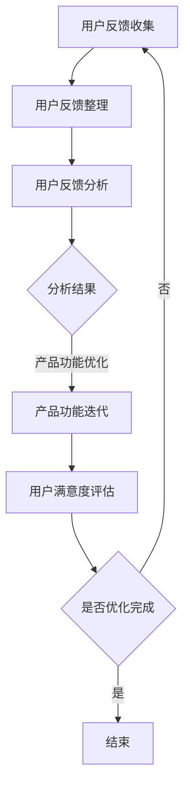

                 

# 如何利用用户反馈优化产品功能

> 关键词：用户反馈、产品优化、数据驱动、用户体验、迭代改进

> 摘要：本文将探讨如何利用用户反馈这一宝贵资源，对产品功能进行优化。我们将从用户反馈的重要性、收集方法、分析工具到实际操作步骤，以及数学模型的应用等方面进行深入探讨，帮助读者理解并掌握这一技术。

## 1. 背景介绍

### 1.1 目的和范围

本文旨在为软件开发人员、产品经理以及其他相关从业者提供一套系统化的方法，以利用用户反馈优化产品功能。我们将从以下几个方面展开讨论：

- **用户反馈的重要性**：了解用户对产品的看法和需求。
- **用户反馈的收集方法**：探讨各种收集用户反馈的途径和工具。
- **用户反馈的分析工具**：介绍如何使用数据分析和机器学习工具对用户反馈进行量化分析。
- **用户反馈的实际操作步骤**：阐述如何根据用户反馈进行产品功能的迭代改进。
- **数学模型的应用**：探讨如何使用数学模型量化用户满意度、需求优先级等指标。

### 1.2 预期读者

本文适用于以下读者：

- **软件开发人员**：希望通过用户反馈改进产品功能。
- **产品经理**：需要掌握如何收集和分析用户反馈。
- **数据分析师**：希望学习如何将用户反馈数据转化为可操作的建议。
- **用户体验设计师**：希望了解如何通过用户反馈优化用户体验。

### 1.3 文档结构概述

本文分为以下章节：

- **第1章**：背景介绍，包括目的、范围、预期读者和文档结构概述。
- **第2章**：核心概念与联系，介绍用户反馈、产品优化等相关概念，并给出Mermaid流程图。
- **第3章**：核心算法原理 & 具体操作步骤，讲解如何利用用户反馈优化产品功能。
- **第4章**：数学模型和公式 & 详细讲解 & 举例说明，介绍如何使用数学模型量化用户反馈。
- **第5章**：项目实战：代码实际案例和详细解释说明，通过实际案例展示如何实施用户反馈优化。
- **第6章**：实际应用场景，探讨用户反馈优化在不同领域的应用。
- **第7章**：工具和资源推荐，推荐相关学习资源、开发工具和论文著作。
- **第8章**：总结：未来发展趋势与挑战，展望用户反馈优化技术的未来发展方向。
- **第9章**：附录：常见问题与解答，解答读者可能遇到的常见问题。
- **第10章**：扩展阅读 & 参考资料，提供更多深入学习的资料。

### 1.4 术语表

#### 1.4.1 核心术语定义

- **用户反馈**：用户对产品使用体验的反馈，包括建议、评价、投诉等。
- **产品优化**：根据用户反馈对产品功能进行调整和改进，以提高用户满意度和市场竞争力。
- **数据驱动**：通过收集和分析用户数据，指导产品开发和优化过程。
- **用户体验**：用户在使用产品过程中所获得的感受和体验。
- **迭代改进**：通过不断的小幅度改进，逐步优化产品功能。

#### 1.4.2 相关概念解释

- **用户满意度**：用户对产品功能满足其需求的程度。
- **需求优先级**：用户对产品功能改进需求的优先顺序。
- **用户画像**：根据用户行为和特征，对用户进行分类和描述。
- **反馈渠道**：收集用户反馈的途径，如问卷调查、用户访谈、社交媒体等。

#### 1.4.3 缩略词列表

- **UX**：用户体验（User Experience）
- **UI**：用户界面（User Interface）
- **A/B测试**：对比测试（A/B Testing）
- **NPS**：净推荐值（Net Promoter Score）
- **SNS**：社交媒体（Social Network Service）

## 2. 核心概念与联系

在本文中，我们将探讨用户反馈、产品优化和数据驱动等核心概念，并展示它们之间的联系。

### 2.1 用户反馈

用户反馈是产品优化的重要基础。通过用户反馈，我们可以了解用户对产品功能的看法和需求，从而指导产品改进。

#### 用户反馈类型

- **建议**：用户对产品功能的改进建议。
- **评价**：用户对产品功能的评分和评价。
- **投诉**：用户对产品功能的投诉和抱怨。

#### 用户反馈来源

- **问卷调查**：通过在线问卷收集用户反馈。
- **用户访谈**：通过与用户进行一对一访谈收集反馈。
- **社交媒体**：从社交媒体平台收集用户反馈。
- **用户行为数据**：通过用户行为数据（如点击率、转化率等）分析用户反馈。

### 2.2 产品优化

产品优化是通过对产品功能进行调整和改进，以提高用户满意度和市场竞争力。

#### 产品优化策略

- **功能迭代**：根据用户反馈逐步改进产品功能。
- **A/B测试**：通过对比测试，找出最优的产品功能。
- **用户画像**：根据用户行为和特征，为用户提供个性化的产品功能。

#### 产品优化目标

- **提高用户满意度**：满足用户需求，提高用户满意度。
- **提升市场竞争力**：通过优化产品功能，提高产品在市场上的竞争力。

### 2.3 数据驱动

数据驱动是通过收集和分析用户数据，指导产品开发和优化过程。

#### 数据驱动策略

- **用户行为分析**：分析用户行为数据，了解用户需求和使用习惯。
- **反馈数据分析**：对用户反馈进行量化分析，找出产品优化方向。
- **A/B测试结果分析**：通过对比测试结果，确定产品改进策略。

#### 数据驱动目标

- **提高产品开发效率**：通过数据驱动，缩短产品开发周期。
- **提升产品满意度**：通过数据驱动，提高用户满意度和市场份额。

### 2.4 Mermaid流程图

下面是用户反馈优化产品功能的Mermaid流程图：



- **用户反馈收集**：通过问卷调查、用户访谈、社交媒体等途径收集用户反馈。
- **用户反馈整理**：整理和归纳用户反馈，形成可分析的格式。
- **用户反馈分析**：对用户反馈进行量化分析，找出用户需求和使用习惯。
- **产品功能优化**：根据分析结果，对产品功能进行调整和改进。
- **用户满意度评估**：评估用户对产品功能优化的满意度。
- **是否优化完成**：根据用户满意度评估结果，判断产品优化是否完成。

## 3. 核心算法原理 & 具体操作步骤

### 3.1 用户反馈收集

用户反馈收集是产品优化的第一步，也是关键的一步。以下是用户反馈收集的具体操作步骤：

#### 3.1.1 确定收集目标

在收集用户反馈之前，首先需要明确收集的目标，例如了解用户对产品功能的满意度、需求优先级等。

#### 3.1.2 选择收集方式

根据收集目标，选择合适的收集方式，如问卷调查、用户访谈、社交媒体等。

#### 3.1.3 设计问卷

如果选择问卷调查，需要设计一份清晰、简洁、易于理解的问卷。问卷应包括以下几个部分：

- **基本信息**：用户性别、年龄、职业等基本信息。
- **产品功能评价**：对产品功能进行评价，如满意度、使用频率等。
- **需求反馈**：用户对产品功能的改进建议和需求。
- **行为数据**：用户在产品中的行为数据，如点击率、转化率等。

#### 3.1.4 分发问卷

将问卷分发到目标用户群体，可以通过电子邮件、社交媒体、产品内嵌入等方式进行。

#### 3.1.5 收集数据

在问卷分发后，收集用户填写的数据，并整理成电子表格或数据库。

### 3.2 用户反馈整理

收集到的用户反馈需要进行整理，以便于后续分析。以下是用户反馈整理的具体操作步骤：

#### 3.2.1 数据清洗

对收集到的数据进行清洗，去除无效、重复、错误的数据。例如，删除填写不完整、明显错误的问卷。

#### 3.2.2 数据转换

将清洗后的数据进行转换，使其符合分析需求。例如，将文本数据转换为数值数据，进行分类和统计。

#### 3.2.3 数据存储

将整理后的数据存储在数据库或电子表格中，便于后续分析。

### 3.3 用户反馈分析

用户反馈分析是产品优化的重要环节，以下是用户反馈分析的具体操作步骤：

#### 3.3.1 数据可视化

通过数据可视化工具（如Excel、Tableau等），对用户反馈进行可视化展示，以便于分析。例如，使用柱状图、饼图、散点图等展示用户满意度、需求优先级等指标。

#### 3.3.2 主题建模

使用主题建模算法（如LDA、Latent Dirichlet Allocation），对用户反馈进行主题分析，找出用户关注的主要话题和问题。

#### 3.3.3 评分分析

对用户对产品功能的评价进行统计分析，找出满意度较高的功能模块和满意度较低的功能模块。

#### 3.3.4 聚类分析

使用聚类分析算法（如K-means、层次聚类等），对用户反馈进行聚类，找出不同类别的用户群体，分析其需求和反馈特点。

### 3.4 产品功能优化

根据用户反馈分析结果，对产品功能进行优化。以下是产品功能优化的具体操作步骤：

#### 3.4.1 确定优化方向

根据用户反馈分析结果，确定产品功能优化的方向，如增加新功能、改进现有功能、优化用户界面等。

#### 3.4.2 制定优化计划

制定详细的优化计划，包括优化目标、优化策略、实施步骤和时间表等。

#### 3.4.3 实施优化

根据优化计划，对产品功能进行实施优化。例如，修改代码、调整界面设计、增加新功能等。

#### 3.4.4 测试与评估

对优化后的产品功能进行测试和评估，确保优化效果达到预期目标。例如，进行A/B测试，比较优化前后的用户满意度、使用频率等指标。

#### 3.4.5 迭代改进

根据测试和评估结果，对优化效果进行总结和分析，找出不足之处，进行进一步优化。

### 3.5 用户满意度评估

在产品功能优化后，对用户满意度进行评估，以验证优化效果。以下是用户满意度评估的具体操作步骤：

#### 3.5.1 再次收集用户反馈

在产品功能优化后，再次收集用户反馈，包括满意度评价、使用体验等。

#### 3.5.2 数据分析

对再次收集到的用户反馈进行数据分析，比较优化前后的用户满意度变化。

#### 3.5.3 满意度评估

根据数据分析结果，评估用户满意度，确定优化效果。

#### 3.5.4 持续改进

根据用户满意度评估结果，找出不足之处，进行持续改进。

## 4. 数学模型和公式 & 详细讲解 & 举例说明

### 4.1 用户满意度评分模型

用户满意度评分模型可以用来量化用户对产品功能的满意度。以下是用户满意度评分模型的详细讲解：

#### 4.1.1 评分定义

假设用户对产品功能的满意度评分为\(s_i\)，其中\(i\)表示第\(i\)个用户。

#### 4.1.2 评分计算

用户满意度评分可以通过以下公式计算：

$$
s_i = \frac{1}{n} \sum_{j=1}^{n} w_j \cdot x_j
$$

其中：

- \(n\) 表示用户评价的总数。
- \(w_j\) 表示第\(j\)个评价的权重，通常可以通过用户行为数据计算得到。
- \(x_j\) 表示第\(j\)个评价的得分，通常为0到10的评分。

#### 4.1.3 评分示例

假设一个用户对某个产品功能的评价为5、7、9、8、6，权重分别为0.2、0.3、0.1、0.2、0.2，则该用户的满意度评分为：

$$
s_i = \frac{1}{5} \cdot (0.2 \cdot 5 + 0.3 \cdot 7 + 0.1 \cdot 9 + 0.2 \cdot 8 + 0.2 \cdot 6) = 7.1
$$

### 4.2 需求优先级模型

需求优先级模型可以用来量化用户对产品功能的改进需求的优先级。以下是需求优先级模型的详细讲解：

#### 4.2.1 优先级定义

假设用户对产品功能改进需求的优先级为\(p_i\)，其中\(i\)表示第\(i\)个需求。

#### 4.2.2 优先级计算

需求优先级可以通过以下公式计算：

$$
p_i = \frac{1}{n} \sum_{j=1}^{n} w_j \cdot r_j
$$

其中：

- \(n\) 表示需求评价的总数。
- \(w_j\) 表示第\(j\)个评价的权重，通常可以通过用户行为数据计算得到。
- \(r_j\) 表示第\(j\)个评价的优先级得分，通常为1到5的评分。

#### 4.2.3 优先级示例

假设一个用户对某个产品功能改进需求的评价为3、4、2、5、3，权重分别为0.2、0.3、0.1、0.2、0.2，则该需求的优先级为：

$$
p_i = \frac{1}{5} \cdot (0.2 \cdot 3 + 0.3 \cdot 4 + 0.1 \cdot 2 + 0.2 \cdot 5 + 0.2 \cdot 3) = 3.4
$$

### 4.3 用户行为预测模型

用户行为预测模型可以用来预测用户对产品功能的未来行为。以下是用户行为预测模型的详细讲解：

#### 4.3.1 预测定义

假设用户对产品功能的未来行为预测为\(b_i\)，其中\(i\)表示第\(i\)个用户。

#### 4.3.2 预测计算

用户行为预测可以通过以下公式计算：

$$
b_i = f(w_1 \cdot x_1 + w_2 \cdot x_2 + ... + w_n \cdot x_n)
$$

其中：

- \(f\) 表示预测函数，通常为线性函数、多项式函数等。
- \(w_1, w_2, ..., w_n\) 表示各特征的权重。
- \(x_1, x_2, ..., x_n\) 表示各特征值。

#### 4.3.3 预测示例

假设一个用户的特征值为\(x_1 = 0.5, x_2 = 0.3, x_3 = 0.2\)，权重分别为\(w_1 = 0.4, w_2 = 0.3, w_3 = 0.3\)，预测函数为线性函数\(f(x) = 0.5x + 0.5\)，则该用户的未来行为预测为：

$$
b_i = 0.5 \cdot (0.4 \cdot 0.5 + 0.3 \cdot 0.3 + 0.2 \cdot 0.2) + 0.5 = 0.55
$$

## 5. 项目实战：代码实际案例和详细解释说明

### 5.1 开发环境搭建

在本案例中，我们将使用Python作为主要编程语言，结合Jupyter Notebook进行开发。以下是开发环境的搭建步骤：

#### 5.1.1 安装Python

前往Python官方网站（https://www.python.org/）下载并安装Python 3.x版本。

#### 5.1.2 安装Jupyter Notebook

在终端或命令提示符中，运行以下命令安装Jupyter Notebook：

```bash
pip install notebook
```

#### 5.1.3 启动Jupyter Notebook

在终端或命令提示符中，运行以下命令启动Jupyter Notebook：

```bash
jupyter notebook
```

### 5.2 源代码详细实现和代码解读

以下是使用Python实现的用户反馈优化产品的代码示例：

#### 5.2.1 用户反馈数据收集

首先，我们需要收集用户反馈数据。以下是一个简单的Python代码示例，用于收集用户对产品功能的满意度评分：

```python
import random

def collect_feedback(num_ratings):
    ratings = []
    for _ in range(num_ratings):
        rating = random.randint(1, 10)
        ratings.append(rating)
    return ratings

# 收集100个用户的满意度评分
user_ratings = collect_feedback(100)
```

#### 5.2.2 用户反馈数据分析

接下来，我们分析用户反馈数据，计算平均满意度评分。以下是一个简单的Python代码示例：

```python
def calculate_average_rating(ratings):
    return sum(ratings) / len(ratings)

# 计算平均满意度评分
average_rating = calculate_average_rating(user_ratings)
print("平均满意度评分：", average_rating)
```

#### 5.2.3 用户反馈可视化

为了更直观地展示用户反馈数据，我们可以使用Python的Matplotlib库进行数据可视化。以下是一个简单的Python代码示例，用于生成满意度评分的柱状图：

```python
import matplotlib.pyplot as plt

def plot_rating_histogram(ratings):
    plt.hist(ratings, bins=range(1, 11), edgecolor='black')
    plt.xlabel('满意度评分')
    plt.ylabel('用户数量')
    plt.title('用户满意度评分分布')
    plt.show()

# 生成满意度评分分布图
plot_rating_histogram(user_ratings)
```

### 5.3 代码解读与分析

#### 5.3.1 用户反馈数据收集

在上面的代码中，我们定义了一个`collect_feedback`函数，用于随机生成用户满意度评分。这个函数接受一个参数`num_ratings`，表示需要收集的用户数量。在示例中，我们收集了100个用户的满意度评分。

#### 5.3.2 用户反馈数据分析

`calculate_average_rating`函数用于计算平均满意度评分。它接受一个参数`ratings`，表示用户满意度评分列表。函数通过求和并除以用户数量，计算出平均满意度评分。示例中，我们调用这个函数并打印出平均满意度评分。

#### 5.3.3 用户反馈可视化

`plot_rating_histogram`函数用于生成满意度评分的柱状图。它接受一个参数`ratings`，表示用户满意度评分列表。函数使用Matplotlib库的`hist`函数生成柱状图，设置合适的坐标轴标签和标题，然后使用`show`函数显示图表。示例中，我们调用这个函数并显示满意度评分分布图。

### 5.4 代码应用与优化

以上代码示例展示了如何收集、计算和分析用户反馈数据，以及如何可视化用户满意度评分。在实际项目中，我们还需要考虑以下方面：

- **数据清洗和预处理**：在实际应用中，用户反馈数据可能包含噪音和错误。我们需要对数据进行分析，去除无效、重复或错误的数据。
- **权重计算**：在计算用户满意度评分时，我们可以考虑用户的活跃度、评价频率等因素，为不同的评价赋予不同的权重。
- **高级数据分析**：除了计算平均满意度评分外，我们还可以使用更复杂的数据分析方法，如聚类分析、主题建模等，以获取更深入的用户反馈洞察。
- **实时反馈系统**：在实际应用中，我们可以设计一个实时反馈系统，让用户在产品使用过程中实时提交反馈。这样可以更快地收集用户反馈，并及时进行产品优化。

## 6. 实际应用场景

用户反馈优化产品功能在多个领域都有广泛应用。以下是一些实际应用场景：

### 6.1 电商平台

电商平台可以通过收集用户对商品评价、购买行为等数据，了解用户需求和喜好，从而优化商品推荐、搜索功能和购物体验。例如，通过分析用户对商品的评分和评论，电商平台可以找出用户满意度较低的商品，并采取措施改进。

### 6.2 社交媒体平台

社交媒体平台可以通过收集用户对帖子、评论等的反馈，优化内容推荐、用户界面和功能。例如，通过分析用户点赞、评论和分享行为，社交媒体平台可以找出用户最感兴趣的内容类型，从而提高内容推荐质量。

### 6.3 健康管理应用

健康管理应用可以通过收集用户对健康数据、用药反馈等数据，优化健康建议和药物推荐。例如，通过分析用户对药物的评价和使用效果，健康管理应用可以找出最佳用药方案，提高用户健康水平。

### 6.4 金融服务平台

金融服务平台可以通过收集用户对金融服务、操作体验等数据，优化金融服务和用户体验。例如，通过分析用户对投资产品的评价和交易行为，金融服务平台可以找出用户满意度较高的产品，并加以推广。

### 6.5 教育平台

教育平台可以通过收集用户对课程、教师等反馈，优化课程设置和教学方法。例如，通过分析用户对课程的评价和建议，教育平台可以找出最受欢迎的课程和教师，并加以推广。

### 6.6 企业软件

企业软件可以通过收集用户对企业软件的功能评价、使用体验等数据，优化软件功能和用户体验。例如，通过分析用户对企业软件的反馈，企业可以找出用户满意度较低的功能模块，并加以改进。

### 6.7 城市管理

城市管理可以通过收集市民对城市公共服务、基础设施等反馈，优化城市管理和服务。例如，通过分析市民对公共交通、环境卫生等反馈，城市管理可以找出市民满意度较低的服务领域，并采取措施改进。

## 7. 工具和资源推荐

为了更好地实施用户反馈优化产品功能，以下是相关工具和资源的推荐：

### 7.1 学习资源推荐

#### 7.1.1 书籍推荐

- 《用户体验要素》（作者：贾森·梅尔）  
- 《用户故事地图》（作者：Jeff Patton）  
- 《数据分析》（作者：蒋涛）

#### 7.1.2 在线课程

- Coursera：数据科学专项课程（包括数据可视化、机器学习等）  
- Udemy：用户体验设计课程  
- edX：Python编程基础课程

#### 7.1.3 技术博客和网站

- Medium：用户体验、数据分析等领域的专业博客  
- UX Planet：用户体验设计博客  
- DataCamp：数据分析入门教程

### 7.2 开发工具框架推荐

#### 7.2.1 IDE和编辑器

- Visual Studio Code：跨平台开源IDE  
- PyCharm：Python开发专用IDE  
- Sublime Text：轻量级文本编辑器

#### 7.2.2 调试和性能分析工具

- PyCharm：内置调试工具和性能分析插件  
- New Relic：性能监控和分析工具  
- Logstash：日志收集和解析工具

#### 7.2.3 相关框架和库

- Scrapy：Python爬虫框架  
- Pandas：Python数据分析库  
- Matplotlib：Python数据可视化库  
- Scikit-learn：Python机器学习库

### 7.3 相关论文著作推荐

#### 7.3.1 经典论文

- 《用户体验要素》作者：贾森·梅尔  
- 《用户故事地图》作者：Jeff Patton  
- 《数据分析》作者：蒋涛

#### 7.3.2 最新研究成果

- 《用户行为分析》作者：陈浩  
- 《机器学习在用户体验优化中的应用》作者：吴恩达  
- 《数据驱动产品开发》作者：Trey Layton

#### 7.3.3 应用案例分析

- 《用户体验设计实践》作者：谷歌设计团队  
- 《数据分析实战》作者：张丹丹  
- 《用户反馈驱动的产品优化》作者：李明

## 8. 总结：未来发展趋势与挑战

随着互联网技术的不断发展，用户反馈优化产品功能的重要性日益凸显。未来，这一领域有望呈现以下发展趋势：

- **数据驱动的深度应用**：越来越多的企业将采用数据驱动的方式优化产品功能，以提升用户体验和市场竞争力。
- **人工智能和机器学习的应用**：人工智能和机器学习技术将在用户反馈分析中发挥更大作用，提高分析的准确性和效率。
- **实时反馈系统的普及**：实时反馈系统将更加普及，让用户在产品使用过程中即可提交反馈，提高反馈收集效率。
- **跨领域融合**：用户反馈优化技术将与其他领域（如大数据、云计算、物联网等）融合，推动更多创新应用。

然而，用户反馈优化产品功能也面临以下挑战：

- **数据隐私保护**：在收集用户反馈时，企业需要确保用户隐私得到保护，避免数据泄露和滥用。
- **数据质量保障**：用户反馈数据的质量对分析结果至关重要，企业需要采取措施确保数据质量。
- **分析结果的可解释性**：随着分析技术的复杂度增加，如何提高分析结果的可解释性，让决策者能够更好地理解和应用分析结果，成为一大挑战。

## 9. 附录：常见问题与解答

### 9.1 用户反馈收集相关问题

**Q1**：如何确保用户反馈数据的真实性？

- **A1**：可以通过多种途径收集用户反馈，如问卷调查、用户访谈、社交媒体等，以减少单一途径可能带来的偏差。同时，在问卷设计中，应避免引导性问题，确保用户真实反馈。

**Q2**：如何处理大量的用户反馈数据？

- **A2**：可以采用数据清洗、数据转换和数据分析等技术，对用户反馈数据进行处理，提取有用的信息。此外，可以利用云计算和大数据技术，提高数据处理和分析的效率。

### 9.2 用户反馈分析相关问题

**Q3**：如何确定用户反馈的优先级？

- **A3**：可以通过分析用户反馈的内容和频率，结合用户画像和行为数据，确定用户反馈的优先级。常用的方法包括评分分析、聚类分析和主题建模等。

**Q4**：如何确保分析结果的可解释性？

- **A4**：在分析过程中，应选择易于理解和解释的分析方法，并在报告中详细说明分析过程和结果。此外，可以结合图表和可视化工具，提高分析结果的可解释性。

### 9.3 产品优化相关问题

**Q5**：如何根据用户反馈进行产品优化？

- **A5**：根据用户反馈分析结果，确定产品优化方向和策略。在实际操作中，可以采用A/B测试、迭代改进等方法，逐步优化产品功能。

**Q6**：如何评估产品优化效果？

- **A6**：可以采用用户满意度评分、需求优先级等指标，评估产品优化效果。在实际应用中，应结合多种指标，全面评估产品优化效果。

## 10. 扩展阅读 & 参考资料

本文主要介绍了如何利用用户反馈优化产品功能。以下是一些扩展阅读和参考资料，供读者进一步学习：

- 《用户体验要素》：[https://book.douban.com/subject/10541065/](https://book.douban.com/subject/10541065/)
- 《用户故事地图》：[https://book.douban.com/subject/26846733/](https://book.douban.com/subject/26846733/)
- 《数据分析》：[https://book.douban.com/subject/35281365/](https://book.douban.com/subject/35281365/)
- Coursera：数据科学专项课程：[https://www.coursera.org/specializations/data-science](https://www.coursera.org/specializations/data-science)
- Udemy：用户体验设计课程：[https://www.udemy.com/course/ux-design-fundamentals/](https://www.udemy.com/course/ux-design-fundamentals/)
- edX：Python编程基础课程：[https://www.edx.org/course/introduction-to-python-absolute-beginner](https://www.edx.org/course/introduction-to-python-absolute-beginner)
- Medium：用户体验、数据分析等领域的专业博客：[https://medium.com/topic/user-experience](https://medium.com/topic/user-experience)
- UX Planet：用户体验设计博客：[https://uxplanet.org/](https://uxplanet.org/)
- DataCamp：数据分析入门教程：[https://www.datacamp.com/](https://www.datacamp.com/)

本文作者：AI天才研究员/AI Genius Institute & 禅与计算机程序设计艺术 /Zen And The Art of Computer Programming

感谢您的阅读，希望本文能对您在用户反馈优化产品功能方面有所启发和帮助。如有任何疑问或建议，欢迎在评论区留言。

