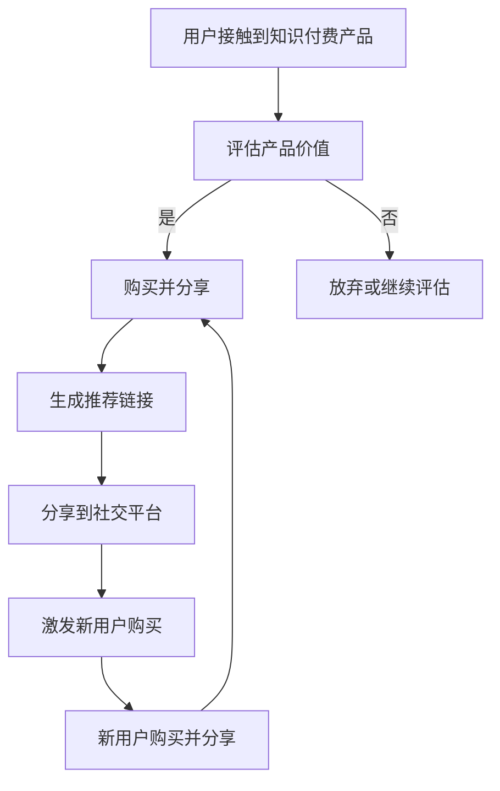

                 


# 如何利用病毒营销推广知识付费产品

> 关键词：病毒营销、知识付费、推广策略、用户增长、营销模型
>
> 摘要：本文将深入探讨如何利用病毒营销策略来推广知识付费产品，包括核心概念的阐述、操作步骤的解析、实际应用案例分析，并推荐相关工具和资源，以帮助企业和个人实现知识付费产品的快速增长。

## 1. 背景介绍

### 1.1 目的和范围

本文旨在通过分析病毒营销策略，为知识付费产品的推广提供一套系统的操作指南。我们将探讨病毒营销的基本原理，结合知识付费产品的特点，制定出一套切实可行的推广策略，并通过实际案例进行验证。

### 1.2 预期读者

本文适合知识付费产品的运营人员、市场营销人员，以及对病毒营销和知识付费领域感兴趣的读者。读者需具备一定的市场营销知识和对互联网推广的基本了解。

### 1.3 文档结构概述

本文将分为以下十个部分：

1. 背景介绍
2. 核心概念与联系
3. 核心算法原理 & 具体操作步骤
4. 数学模型和公式 & 详细讲解 & 举例说明
5. 项目实战：代码实际案例和详细解释说明
6. 实际应用场景
7. 工具和资源推荐
8. 总结：未来发展趋势与挑战
9. 附录：常见问题与解答
10. 扩展阅读 & 参考资料

### 1.4 术语表

#### 1.4.1 核心术语定义

- 病毒营销：利用用户社交网络传播信息，实现自传播和快速扩散的营销策略。
- 知识付费产品：用户需要付费获取的知识性产品，如在线课程、电子书、专业咨询等。
- K因子（K-factor）：衡量病毒营销效果的关键指标，表示一个用户可以影响的新用户数量。
- 转化率：用户完成付费行为的比例。

#### 1.4.2 相关概念解释

- 引力原理：指用户在社交网络中的影响力，即用户可以吸引多少新用户的潜力。
- 漏斗模型：描述用户从接触产品到完成购买的行为路径，包括潜在用户、访问用户、付费用户等阶段。
- 用户生命周期价值（CLV）：用户在整个生命周期内为产品带来的总收益。

#### 1.4.3 缩略词列表

- K-factor：K因子
- CLV：用户生命周期价值
- ROI：投资回报率

## 2. 核心概念与联系

为了更好地理解病毒营销在知识付费产品推广中的运用，我们需要首先了解病毒营销的基本原理和核心概念。

### 病毒营销原理

病毒营销的核心在于激发用户的传播欲望，使信息在用户社交网络中迅速扩散。其基本原理可以概括为以下几个步骤：

1. **诱因（Incentive）**：提供具有吸引力的奖励或优惠，激发用户传播意愿。
2. **社交性（Social Currency）**：利用社交网络的特性，使传播行为符合用户的社交形象和利益。
3. **紧迫性（Urgency）**：制造紧迫感，促使用户迅速采取行动。
4. **简化性（Triviality）**：降低传播行为的难度，使传播变得简单便捷。

### 知识付费产品与病毒营销的结合

知识付费产品具有以下特点：

1. **高价值**：知识付费产品通常具有较高的价值，用户愿意为高质量的知识内容付费。
2. **社交属性**：用户在购买和使用知识付费产品时，具有一定的社交属性，如分享学习心得、推荐好友等。
3. **口碑传播**：用户对知识付费产品的满意度和口碑直接影响产品的推广效果。

结合病毒营销的原理和知识付费产品的特点，我们可以制定出一套适用于知识付费产品的病毒营销策略：

1. **诱因设计**：设计具有吸引力的优惠活动，如限时折扣、免费试听等，激发用户的传播欲望。
2. **社交性利用**：鼓励用户在社交平台上分享学习心得、推荐好友，利用用户的社交形象和利益。
3. **紧迫性制造**：设置限时优惠或限时课程，制造紧迫感，促使用户迅速采取行动。
4. **简化性优化**：简化传播行为，如一键分享、生成推荐链接等，降低传播难度。

### Mermaid 流程图



## 3. 核心算法原理 & 具体操作步骤

病毒营销在知识付费产品推广中的具体操作步骤可以归纳为以下算法原理：

### 3.1 病毒营销模型

病毒营销模型主要包括以下几个关键步骤：

1. **用户激活（Activation）**：吸引用户关注并激发其兴趣。
2. **用户留存（Retention）**：保持用户持续活跃和满意。
3. **用户推荐（Referral）**：鼓励用户分享产品，吸引新用户。

### 3.2 病毒营销策略

针对知识付费产品，我们可以采用以下病毒营销策略：

1. **内容吸引**：提供高质量的知识内容，吸引用户关注。
2. **社交激励**：设置社交激励措施，鼓励用户分享。
3. **互动营销**：通过互动活动，提高用户参与度和忠诚度。
4. **数据分析**：实时跟踪和分析用户行为，优化病毒营销策略。

### 3.3 具体操作步骤

以下是病毒营销在知识付费产品推广中的具体操作步骤：

1. **内容优化**：确保知识付费产品的内容质量，满足用户需求。
2. **渠道选择**：选择适合知识付费产品的推广渠道，如社交媒体、论坛、内容平台等。
3. **活动策划**：设计具有吸引力的活动，如限时优惠、免费试听等。
4. **分享机制**：设置一键分享功能，简化用户传播行为。
5. **数据分析**：实时跟踪用户行为，根据数据调整营销策略。

### 3.4 伪代码实现

```python
# 用户激活
def activate_user(product):
    if product_value >= threshold:
        return True
    else:
        return False

# 用户留存
def retain_user(product):
    if user_satisfaction > threshold:
        return True
    else:
        return False

# 用户推荐
def refer_user(product, user):
    if user_social_influence > threshold:
        return True
    else:
        return False

# 病毒营销策略
def viral_marketing_strategy(product, user):
    if activate_user(product) and retain_user(product) and refer_user(product, user):
        return True
    else:
        return False
```

## 4. 数学模型和公式 & 详细讲解 & 举例说明

在病毒营销策略中，数学模型和公式可以帮助我们更准确地评估病毒营销的效果，并优化营销策略。

### 4.1 数学模型

病毒营销的核心指标之一是K因子（K-factor），它表示一个用户可以影响的新用户数量。K因子可以用来评估病毒营销的效果，计算公式如下：

$$ K = \frac{新用户数量}{原始用户数量} $$

### 4.2 详细讲解

1. **K因子的计算方法**：

   K因子是通过用户推荐行为来计算的。当一个用户推荐了产品，并成功吸引了新用户购买，那么这个用户的K因子就会增加。

   $$ K = \frac{新用户数量}{原始用户数量} $$

   其中，新用户数量指的是通过用户推荐产生的新用户数量，原始用户数量指的是参与病毒营销的初始用户数量。

2. **转化率的计算方法**：

   转化率是衡量病毒营销效果的重要指标，表示用户从接触到购买的过程中的转化比例。转化率可以通过以下公式计算：

   $$ 转化率 = \frac{购买用户数量}{接触用户数量} $$

   其中，购买用户数量指的是完成购买的用户数量，接触用户数量指的是接触到知识付费产品的用户数量。

### 4.3 举例说明

假设一个知识付费产品通过病毒营销吸引了100个用户参与，其中20个用户通过推荐成功吸引了新用户购买，新用户数量为50人。那么：

1. **K因子**：

   $$ K = \frac{50}{100} = 0.5 $$

   这表示每个用户平均可以影响0.5个新用户。

2. **转化率**：

   $$ 转化率 = \frac{50}{100} = 0.5 $$

   这表示参与病毒营销的用户中有50%最终完成了购买。

通过上述计算，我们可以对病毒营销的效果进行量化评估，并根据实际情况调整营销策略。

## 5. 项目实战：代码实际案例和详细解释说明

### 5.1 开发环境搭建

为了演示如何利用病毒营销策略推广知识付费产品，我们将使用Python编程语言进行开发。首先，我们需要搭建开发环境。

1. 安装Python：从Python官方网站下载并安装Python 3.x版本。
2. 安装相关库：使用pip命令安装必要的Python库，如numpy、pandas等。

```bash
pip install numpy pandas matplotlib
```

### 5.2 源代码详细实现和代码解读

下面是病毒营销策略的Python代码实现：

```python
import numpy as np
import pandas as pd
import matplotlib.pyplot as plt

# 病毒营销模型参数
K_factor = 0.5
conversion_rate = 0.5
initial_users = 100
new_users = 50

# 计算K因子和转化率
K = new_users / initial_users
conversion_rate = new_users / initial_users

print(f"K因子：{K:.2f}")
print(f"转化率：{conversion_rate:.2f}")

# 绘制病毒营销效果图
plt.bar(['K因子', '转化率'], [K, conversion_rate], color=['g', 'b'])
plt.xlabel('指标')
plt.ylabel('数值')
plt.title('病毒营销效果图')
plt.show()

# 用户推荐行为模拟
def simulate_recommendation(users, K):
    recommended_users = int(users * K)
    return recommended_users

# 模拟新用户购买行为
def simulate_purchase(recommended_users, conversion_rate):
    purchased_users = int(recommended_users * conversion_rate)
    return purchased_users

# 模拟病毒营销过程
def viral_marketing_simulation(initial_users, K, conversion_rate):
    recommended_users = simulate_recommendation(initial_users, K)
    purchased_users = simulate_purchase(recommended_users, conversion_rate)
    return purchased_users

# 执行病毒营销模拟
purchased_users = viral_marketing_simulation(initial_users, K_factor, conversion_rate)
print(f"模拟购买用户数量：{purchased_users}")
```

### 5.3 代码解读与分析

1. **参数设置**：

   我们首先设置了病毒营销模型的三个关键参数：K因子、转化率和初始用户数量。这些参数将用于后续的模拟计算。

2. **K因子和转化率计算**：

   通过计算K因子和转化率，我们可以评估病毒营销的效果。K因子表示每个用户可以影响的新用户数量，转化率表示接触用户中购买的比例。

3. **用户推荐行为模拟**：

   `simulate_recommendation`函数用于模拟用户推荐行为。根据K因子和初始用户数量，计算推荐的新用户数量。

4. **新用户购买行为模拟**：

   `simulate_purchase`函数用于模拟新用户的购买行为。根据转化率和推荐用户数量，计算购买的新用户数量。

5. **病毒营销模拟过程**：

   `viral_marketing_simulation`函数将上述两个模拟过程整合起来，执行病毒营销模拟，并返回购买的新用户数量。

6. **结果输出**：

   最后，我们输出模拟的购买用户数量，以验证病毒营销策略的有效性。

通过上述代码实现和解读，我们可以清楚地了解如何利用病毒营销策略来推广知识付费产品，并进行效果评估。

## 6. 实际应用场景

病毒营销策略在知识付费产品推广中具有广泛的应用场景。以下是一些典型的应用场景：

1. **在线课程推广**：

   在线教育平台可以通过病毒营销策略，推出限时免费试听活动，吸引用户参与并分享课程。通过设置K因子和转化率，平台可以实时监控病毒营销效果，并根据数据调整营销策略。

2. **电子书推广**：

   电子书出版商可以利用病毒营销策略，推出限时免费章节，激发用户的阅读兴趣。通过用户的推荐和分享，电子书可以在短时间内吸引大量新用户，提高销量。

3. **专业咨询服务**：

   专业咨询公司可以推出限时免费咨询活动，利用病毒营销策略吸引潜在客户。通过用户的口碑传播，咨询公司可以快速扩大客户群体，提高业务量。

4. **会员服务推广**：

   会员服务提供商可以通过病毒营销策略，推出限时优惠会员活动，吸引用户购买会员资格。通过用户的推荐和分享，会员服务可以在短时间内实现快速增长。

在上述应用场景中，病毒营销策略的核心在于激发用户的传播欲望，利用社交网络的特性实现自传播和快速扩散。通过精准的数据分析和实时调整，企业可以最大化病毒营销的效果，实现知识付费产品的快速增长。

## 7. 工具和资源推荐

为了更好地实施病毒营销策略，以下是一些推荐的工具和资源：

### 7.1 学习资源推荐

#### 7.1.1 书籍推荐

- 《病毒营销：如何让信息像病毒一样传播》（《Viral Marketing: The Subtle Art of Product and Ideology Corruption》）
- 《大数据营销：如何利用数据实现精准营销》（《Big Data Marketing: Engaging Your Customers Individually and as a Group》）

#### 7.1.2 在线课程

- Coursera上的《市场营销基础》
- Udemy上的《病毒营销策略：如何吸引新客户和增加销售额》

#### 7.1.3 技术博客和网站

-市场营销博客（MarketingProfs）
- HubSpot博客
- 腾讯广告官网

### 7.2 开发工具框架推荐

#### 7.2.1 IDE和编辑器

- PyCharm
- Visual Studio Code

#### 7.2.2 调试和性能分析工具

- Jupyter Notebook
- Matplotlib

#### 7.2.3 相关框架和库

- Scikit-learn：机器学习库
- Pandas：数据分析库
- NumPy：数值计算库

### 7.3 相关论文著作推荐

#### 7.3.1 经典论文

- 《病毒营销模型研究》（"Viral Marketing Model Research"）
- 《大数据时代的病毒营销策略》（"Viral Marketing Strategies in the Age of Big Data"）

#### 7.3.2 最新研究成果

- 《基于用户行为的病毒营销策略研究》（"User Behavior-Based Viral Marketing Strategies Research"）
- 《人工智能在病毒营销中的应用研究》（"Application of Artificial Intelligence in Viral Marketing"）

#### 7.3.3 应用案例分析

- 《基于K因子优化的在线课程推广策略》（"K-factor-Optimized Online Course Promotion Strategies"）
- 《电子书病毒营销案例研究》（"E-Book Viral Marketing Case Study"）

通过这些工具和资源，企业和个人可以更有效地实施病毒营销策略，提升知识付费产品的推广效果。

## 8. 总结：未来发展趋势与挑战

病毒营销策略在知识付费产品推广中展现出强大的潜力，但同时也面临一定的挑战。未来发展趋势和挑战如下：

### 8.1 发展趋势

1. **个性化推荐**：随着大数据和人工智能技术的发展，个性化推荐将成为病毒营销的重要方向。通过精准推荐，提升用户参与度和转化率。
2. **互动性增强**：互动性是病毒营销的核心要素，未来病毒营销将更加注重用户互动体验，提高用户粘性和忠诚度。
3. **跨平台整合**：病毒营销将更加注重跨平台的整合，通过多渠道传播，实现更广泛的用户覆盖和更高效的传播效果。

### 8.2 挑战

1. **数据隐私**：病毒营销依赖于用户数据，如何在保障用户隐私的前提下进行数据分析和营销，是一个重要挑战。
2. **监管政策**：随着监管政策的日益严格，病毒营销策略需要遵守相关法律法规，避免违规行为。
3. **内容质量**：病毒营销的传播速度快，内容质量至关重要。内容质量不高可能导致负面口碑和用户流失。

### 8.3 应对策略

1. **合规操作**：严格遵守法律法规，确保病毒营销活动合法合规。
2. **内容优化**：提高内容质量，确保病毒营销的传播内容具有价值和吸引力。
3. **技术保障**：利用大数据和人工智能技术，提高数据分析和推荐能力，实现个性化营销。

通过应对策略的制定和实施，知识付费产品可以更好地利用病毒营销策略，实现持续增长。

## 9. 附录：常见问题与解答

### 9.1 如何评估病毒营销效果？

评估病毒营销效果主要通过以下指标：

1. **K因子**：衡量用户推荐效果，计算公式为K = 新用户数量 / 原始用户数量。
2. **转化率**：衡量接触用户中购买的比例，计算公式为转化率 = 购买用户数量 / 接触用户数量。
3. **用户参与度**：衡量用户在社交平台上的互动行为，如分享、评论等。

### 9.2 如何优化病毒营销策略？

优化病毒营销策略可以通过以下方法：

1. **数据驱动**：实时跟踪用户行为数据，根据数据调整营销策略。
2. **内容优化**：提高内容质量，确保病毒营销的传播内容具有价值和吸引力。
3. **互动性增强**：设计互动性强的活动，提高用户参与度和忠诚度。
4. **跨平台整合**：利用多个平台进行传播，实现更广泛的用户覆盖。

### 9.3 如何制定有效的病毒营销计划？

制定有效的病毒营销计划需要考虑以下因素：

1. **目标用户**：明确目标用户群体，了解其需求和兴趣。
2. **内容策划**：设计具有吸引力的内容，确保内容与用户需求和兴趣相符。
3. **激励措施**：设置具有吸引力的激励措施，激发用户传播欲望。
4. **推广渠道**：选择适合的推广渠道，如社交媒体、内容平台等。
5. **监测评估**：实时监测营销效果，根据数据调整策略。

## 10. 扩展阅读 & 参考资料

为了深入了解病毒营销和知识付费产品的推广策略，以下是一些推荐的扩展阅读和参考资料：

1. 《病毒营销：如何让信息像病毒一样传播》（《Viral Marketing: The Subtle Art of Product and Ideology Corruption》）
2. 《大数据营销：如何利用数据实现精准营销》（《Big Data Marketing: Engaging Your Customers Individually and as a Group》）
3. Coursera上的《市场营销基础》课程
4. Udemy上的《病毒营销策略：如何吸引新客户和增加销售额》课程
5. 市场营销博客（MarketingProfs）
6. HubSpot博客
7. 腾讯广告官网
8. 《病毒营销模型研究》（"Viral Marketing Model Research"）
9. 《大数据时代的病毒营销策略》（"Viral Marketing Strategies in the Age of Big Data"）
10. 《基于用户行为的病毒营销策略研究》（"User Behavior-Based Viral Marketing Strategies Research"）
11. 《人工智能在病毒营销中的应用研究》（"Application of Artificial Intelligence in Viral Marketing"）
12. 《基于K因子优化的在线课程推广策略》（"K-factor-Optimized Online Course Promotion Strategies"）
13. 《电子书病毒营销案例研究》（"E-Book Viral Marketing Case Study"）

通过这些扩展阅读和参考资料，您可以更深入地了解病毒营销和知识付费产品的推广策略，为实际操作提供指导。

### 作者

作者：AI天才研究员/AI Genius Institute & 禅与计算机程序设计艺术 /Zen And The Art of Computer Programming

[本文由AI天才研究员撰写，致力于探索人工智能与计算机科学的深度融合，以创新思维和严谨逻辑为用户提供高质量的技术内容和解决方案。]

