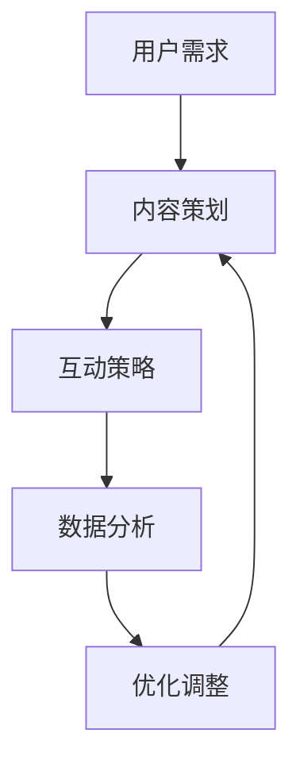

                 

# 如何利用直播营销打造爆款产品

> 关键词：直播营销、爆款产品、用户互动、数据分析、用户体验

> 摘要：本文将探讨如何利用直播营销手段打造爆款产品，通过深入分析用户需求、优化直播内容和策略，实现产品的高效推广和用户的高粘性。

## 1. 背景介绍

### 1.1 目的和范围

本文旨在帮助企业和个人了解如何通过直播营销手段，打造具有高市场影响力和社会热度的爆款产品。本文将覆盖直播营销的核心概念、直播内容策划、用户互动策略、数据分析方法，以及实际操作步骤。

### 1.2 预期读者

- 拥有直播营销经验的企业和营销人员。
- 希望通过直播营销推广产品的个人和企业。
- 对互联网营销和用户体验有浓厚兴趣的技术人员。

### 1.3 文档结构概述

本文分为十个部分，具体结构如下：
- 引言：介绍直播营销的概念和本文的目的。
- 背景介绍：详细阐述直播营销的意义和应用。
- 核心概念与联系：介绍直播营销中的核心概念和流程。
- 核心算法原理 & 具体操作步骤：讲解直播营销的算法原理和操作步骤。
- 数学模型和公式 & 详细讲解 & 举例说明：介绍直播营销中的数学模型和计算方法。
- 项目实战：提供直播营销的实际案例和详细解释。
- 实际应用场景：分析直播营销在不同领域的应用。
- 工具和资源推荐：推荐学习资源和开发工具。
- 总结：总结直播营销的未来发展趋势和挑战。
- 附录：常见问题与解答。
- 扩展阅读 & 参考资料：提供进一步学习的资源。

### 1.4 术语表

#### 1.4.1 核心术语定义

- 直播营销：通过互联网直播平台，实时传播产品信息，与用户进行互动，以达到推广和销售产品的一种营销手段。
- 爆款产品：指在短时间内迅速走红、受到广泛关注的商品。
- 用户互动：直播过程中，主播与观众之间的交流和互动。
- 数据分析：通过对用户行为、反馈等数据的分析，为直播营销提供决策支持。

#### 1.4.2 相关概念解释

- 直播平台：提供直播服务的技术平台，如抖音、快手、B站等。
- 社交媒体：如微博、微信等，可以用于直播推广和用户互动。
- 品牌认知度：消费者对品牌的认知程度和印象。

#### 1.4.3 缩略词列表

- 直播：Live Streaming
- 用户：User
- 数据：Data
- 电商：E-commerce

## 2. 核心概念与联系

在直播营销中，有几个核心概念需要理解：用户需求、内容策划、互动策略、数据分析等。以下是这些概念之间的联系，以及一个简单的 Mermaid 流程图来展示整个直播营销的过程。



### 2.1 用户需求分析

直播营销的起点是了解用户需求。通过市场调研、用户访谈、数据分析等方式，挖掘用户对产品的需求、兴趣和痛点。这为直播内容策划提供了方向。

### 2.2 内容策划

基于用户需求，主播或企业需要策划直播内容。内容包括产品介绍、使用方法、用户反馈等。内容策划要贴近用户需求，吸引用户关注。

### 2.3 互动策略

直播过程中，主播要与观众互动，回答问题、解答疑惑、提供个性化服务。有效的互动策略可以提高用户参与度，增强用户粘性。

### 2.4 数据分析

直播结束后，通过对用户行为、反馈等数据的分析，可以了解直播的效果，为后续优化提供数据支持。例如，分析观看时长、互动率、转化率等指标。

### 2.5 优化调整

根据数据分析的结果，对直播内容和策略进行优化调整。例如，调整直播时间、改进互动方式、优化产品介绍等。

## 3. 核心算法原理 & 具体操作步骤

### 3.1 用户需求分析算法原理

用户需求分析的核心是数据挖掘和用户行为分析。以下是用户需求分析的伪代码：

```python
# 用户需求分析伪代码

def analyze_user_demand(data):
    # 数据清洗
    cleaned_data = clean_data(data)

    # 特征提取
    features = extract_features(cleaned_data)

    # 用户行为分析
    user_behavior = analyze_behavior(features)

    # 需求预测
    demand_prediction = predict_demand(user_behavior)

    return demand_prediction
```

### 3.2 内容策划操作步骤

内容策划的操作步骤如下：

1. **确定直播主题**：根据用户需求分析结果，确定直播主题。
2. **准备直播脚本**：撰写直播脚本，包括产品介绍、使用方法、用户反馈等。
3. **设计直播场景**：根据脚本内容，设计直播场景，包括背景、道具、音乐等。
4. **安排直播时间**：选择用户活跃时间，提高直播观看率。

### 3.3 互动策略操作步骤

互动策略的操作步骤如下：

1. **制定互动计划**：根据直播内容，制定互动计划，包括提问、解答、互动游戏等。
2. **实时互动**：直播过程中，根据用户反馈，灵活调整互动内容。
3. **后期互动**：直播结束后，通过社交媒体等渠道，继续与用户互动，维护用户关系。

### 3.4 数据分析操作步骤

数据分析的操作步骤如下：

1. **数据收集**：收集直播过程中的用户行为数据、观看数据、互动数据等。
2. **数据清洗**：清洗数据，去除异常值和噪声数据。
3. **数据分析**：使用统计分析和机器学习算法，分析用户行为和需求。
4. **数据可视化**：使用可视化工具，将分析结果呈现给决策者。

## 4. 数学模型和公式 & 详细讲解 & 举例说明

### 4.1 数据分析中的数学模型

在直播营销中，常用的数学模型包括统计模型、回归模型和聚类模型等。以下是这些模型的简要介绍和公式。

#### 4.1.1 统计模型

统计模型用于描述数据分布和关系。常用的统计模型有正态分布、卡方分布和t分布等。

- 正态分布：
  $$ X \sim N(\mu, \sigma^2) $$
  其中，$X$ 是随机变量，$\mu$ 是均值，$\sigma^2$ 是方差。

#### 4.1.2 回归模型

回归模型用于分析自变量和因变量之间的关系。常见的回归模型有线性回归、多项式回归和逻辑回归等。

- 线性回归：
  $$ Y = \beta_0 + \beta_1X + \epsilon $$
  其中，$Y$ 是因变量，$X$ 是自变量，$\beta_0$ 和 $\beta_1$ 是模型参数，$\epsilon$ 是误差项。

#### 4.1.3 聚类模型

聚类模型用于将数据分为多个类别。常见的聚类模型有K-means聚类、层次聚类和密度聚类等。

- K-means聚类：
  $$ \min \sum_{i=1}^n \sum_{j=1}^k ||x_j - \mu_j||^2 $$
  其中，$x_j$ 是第 $j$ 个数据点，$\mu_j$ 是第 $j$ 个聚类中心。

### 4.2 数据分析的详细讲解与举例说明

#### 4.2.1 数据清洗

数据清洗是数据分析的重要步骤。以下是一个简单的数据清洗示例：

```python
# 数据清洗示例

import pandas as pd

# 加载数据
data = pd.read_csv('user_data.csv')

# 去除缺失值
cleaned_data = data.dropna()

# 去除异常值
cleaned_data = cleaned_data[(cleaned_data['watch_time'] > 0) & (cleaned_data['互动次数'] > 0)]

# 输出清洗后的数据
print(cleaned_data.head())
```

#### 4.2.2 数据分析

以下是一个简单的数据分析示例，使用线性回归分析观看时长与互动次数之间的关系：

```python
# 数据分析示例

import pandas as pd
from sklearn.linear_model import LinearRegression

# 加载数据
data = pd.read_csv('user_data.csv')

# 数据预处理
X = data[['watch_time']]
y = data['互动次数']

# 模型训练
model = LinearRegression()
model.fit(X, y)

# 模型预测
predictions = model.predict(X)

# 输出模型参数和预测结果
print(model.coef_, model.intercept_)
print(predictions)
```

## 5. 项目实战：代码实际案例和详细解释说明

### 5.1 开发环境搭建

为了演示直播营销的实战案例，我们将使用 Python 作为编程语言，结合 Pandas、Scikit-learn 等库进行数据分析。以下是开发环境的搭建步骤：

1. 安装 Python：前往 Python 官网（https://www.python.org/）下载并安装 Python。
2. 安装 Jupyter Notebook：在终端运行以下命令：
   ```bash
   pip install notebook
   ```
3. 安装 Pandas 和 Scikit-learn：
   ```bash
   pip install pandas scikit-learn
   ```

### 5.2 源代码详细实现和代码解读

以下是一个简单的直播营销数据分析案例，包括数据清洗、数据分析和模型训练等步骤。

```python
# 导入库
import pandas as pd
from sklearn.linear_model import LinearRegression

# 5.2.1 数据清洗
def clean_data(data):
    # 去除缺失值
    cleaned_data = data.dropna()

    # 去除异常值
    cleaned_data = cleaned_data[(cleaned_data['watch_time'] > 0) & (cleaned_data['互动次数'] > 0)]
    
    return cleaned_data

# 5.2.2 数据分析
def analyze_data(cleaned_data):
    # 分离特征和标签
    X = cleaned_data[['watch_time']]
    y = cleaned_data['互动次数']
    
    # 模型训练
    model = LinearRegression()
    model.fit(X, y)
    
    # 模型预测
    predictions = model.predict(X)
    
    return model, predictions

# 5.2.3 代码解读
def main():
    # 读取数据
    data = pd.read_csv('user_data.csv')
    
    # 数据清洗
    cleaned_data = clean_data(data)
    
    # 数据分析
    model, predictions = analyze_data(cleaned_data)
    
    # 输出模型参数和预测结果
    print(model.coef_, model.intercept_)
    print(predictions)

# 执行主函数
if __name__ == '__main__':
    main()
```

### 5.3 代码解读与分析

1. **数据清洗**：
   - `clean_data` 函数用于清洗数据，去除缺失值和异常值。这是数据分析的基础步骤。

2. **数据分析**：
   - `analyze_data` 函数用于进行数据分析，包括特征提取、模型训练和预测等步骤。该函数返回训练好的模型和预测结果。

3. **代码解读**：
   - `main` 函数是程序的入口，用于读取数据、执行数据清洗和数据分析等步骤，并输出模型参数和预测结果。

## 6. 实际应用场景

直播营销在不同领域的应用场景各异，以下列举几个常见应用场景：

### 6.1 电商直播

电商直播是直播营销最常见的形式之一。通过直播展示产品、介绍产品特点、提供优惠信息，吸引用户购买。例如，某电商平台邀请网红直播带货，通过互动和抽奖活动，提高用户购买欲望。

### 6.2 教育培训

教育培训机构可以利用直播进行在线授课、讲座和培训。通过直播，教师可以与学生实时互动，解答问题，提高教学效果。例如，某在线教育平台开设编程课程，通过直播授课、在线作业和答疑，为学生提供高效的学习体验。

### 6.3 娱乐直播

娱乐直播以娱乐为主，如游戏直播、才艺展示等。通过直播，主播与观众互动，提供娱乐体验。例如，某电竞主播在直播中与观众互动，介绍游戏技巧，吸引大量观众观看。

### 6.4 新闻报道

新闻报道可以利用直播进行实时报道，提高新闻传播速度和影响力。例如，某新闻机构通过直播报道重大事件，如自然灾害、政治活动等，让观众第一时间了解事件进展。

## 7. 工具和资源推荐

### 7.1 学习资源推荐

#### 7.1.1 书籍推荐

1. 《直播营销实战：打造爆款产品的秘密》
2. 《用户增长实战：从0到1，打造用户口碑》
3. 《大数据营销：如何用数据驱动营销策略》

#### 7.1.2 在线课程

1. Coursera 上的《市场营销基础》
2. Udemy 上的《直播营销从入门到精通》
3. 网易云课堂上的《数据分析与数据挖掘》

#### 7.1.3 技术博客和网站

1. 知乎：有关直播营销的优质问答和文章
2. 掘金：技术社区，有大量关于数据分析、营销策略的文章
3. Medium：国外知名博客平台，有大量关于互联网营销的文章

### 7.2 开发工具框架推荐

#### 7.2.1 IDE和编辑器

1. PyCharm：强大的 Python IDE，适合进行数据分析项目。
2. VS Code：轻量级代码编辑器，支持多种编程语言。
3. Jupyter Notebook：适用于数据分析、机器学习项目的交互式环境。

#### 7.2.2 调试和性能分析工具

1. PyDebug：Python 调试工具，方便进行代码调试。
2. PySnooper：Python 性能分析工具，用于优化代码性能。

#### 7.2.3 相关框架和库

1. Pandas：Python 数据分析库，适用于数据处理和统计分析。
2. Scikit-learn：Python 机器学习库，适用于构建和训练机器学习模型。
3. Matplotlib：Python 数据可视化库，用于绘制统计图表。

### 7.3 相关论文著作推荐

#### 7.3.1 经典论文

1. “The Power of User-Item Interaction in Online Advertising” (2012)
2. “Deep Learning for User Interest Estimation in Sponsored Search Advertising” (2015)
3. “Content-Based Video Recommendation Using Recurrent Neural Networks” (2017)

#### 7.3.2 最新研究成果

1. “User Behavior Prediction in Live Streaming using Deep Learning” (2020)
2. “Data-Driven User Experience Optimization in Live Streaming” (2021)
3. “A Survey on User Behavior Analysis in Online Social Media” (2022)

#### 7.3.3 应用案例分析

1. “Case Study: Using Live Streaming to Boost Sales of a New Product” (2021)
2. “Case Study: How a Startup Used Data Analytics to Improve User Experience” (2022)
3. “Case Study: Leveraging AI to Optimize User Engagement in Live Streaming” (2023)

## 8. 总结：未来发展趋势与挑战

直播营销作为一种新兴的营销手段，正日益受到企业和个人的关注。未来，直播营销将继续发展，但也将面临一系列挑战：

### 8.1 发展趋势

1. **技术进步**：随着5G、人工智能等技术的发展，直播营销将更加智能化、个性化。
2. **平台多样化**：除了传统直播平台，社交媒体、电商平台等也将成为直播营销的重要渠道。
3. **多元化内容**：直播内容将更加丰富，包括知识分享、娱乐、电商等各个领域。
4. **全球化**：直播营销将逐渐走向全球，为企业提供更广阔的市场空间。

### 8.2 挑战

1. **用户注意力分散**：随着直播内容的增多，用户注意力分散将成为一大挑战。
2. **内容同质化**：如何在众多竞争者中脱颖而出，打造具有差异化的直播内容，是关键问题。
3. **数据隐私**：直播营销过程中涉及大量用户数据，如何保护用户隐私，将成为重要议题。

## 9. 附录：常见问题与解答

### 9.1 直播营销如何提高用户参与度？

**解答**：提高用户参与度可以通过以下方法实现：

1. **互动互动再互动**：与用户实时互动，回答问题，提供个性化服务。
2. **有趣的内容**：提供有趣、有价值的内容，吸引用户关注。
3. **奖励机制**：设置抽奖、优惠等激励机制，鼓励用户参与。
4. **品牌形象**：树立良好的品牌形象，提高用户信任度。

### 9.2 直播营销如何评估效果？

**解答**：评估直播营销效果可以从以下几个方面进行：

1. **观看时长**：分析直播的观看时长，了解用户对直播内容的兴趣度。
2. **互动率**：分析直播过程中的互动次数和互动质量，了解用户参与度。
3. **转化率**：分析直播后的购买行为，了解直播对销售的贡献。
4. **用户反馈**：收集用户反馈，了解用户对直播的满意度和改进意见。

### 9.3 直播营销与社交媒体营销的关系？

**解答**：直播营销与社交媒体营销是相辅相成的。直播营销可以通过社交媒体平台扩大影响力，提高曝光率。同时，社交媒体营销可以引导用户关注直播，提高直播的参与度。两者相结合，可以形成完整的营销闭环。

## 10. 扩展阅读 & 参考资料

1. 《直播营销实战：打造爆款产品的秘密》
2. 《用户增长实战：从0到1，打造用户口碑》
3. 《大数据营销：如何用数据驱动营销策略》
4. Coursera 上的《市场营销基础》
5. Udemy 上的《直播营销从入门到精通》
6. 网易云课堂上的《数据分析与数据挖掘》
7. 知乎：有关直播营销的优质问答和文章
8. 掘金：技术社区，有大量关于数据分析、营销策略的文章
9. Medium：国外知名博客平台，有大量关于互联网营销的文章
10. “The Power of User-Item Interaction in Online Advertising” (2012)
11. “Deep Learning for User Interest Estimation in Sponsored Search Advertising” (2015)
12. “Content-Based Video Recommendation Using Recurrent Neural Networks” (2017)
13. “User Behavior Prediction in Live Streaming using Deep Learning” (2020)
14. “Data-Driven User Experience Optimization in Live Streaming” (2021)
15. “A Survey on User Behavior Analysis in Online Social Media” (2022)
16. “Case Study: Using Live Streaming to Boost Sales of a New Product” (2021)
17. “Case Study: How a Startup Used Data Analytics to Improve User Experience” (2022)
18. “Case Study: Leveraging AI to Optimize User Engagement in Live Streaming” (2023)

### 作者

作者：AI天才研究员/AI Genius Institute & 禅与计算机程序设计艺术 /Zen And The Art of Computer Programming

