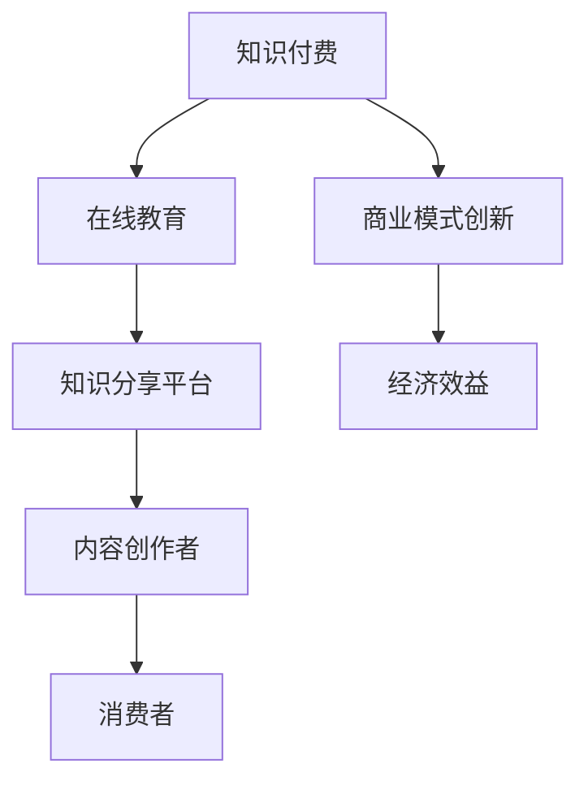
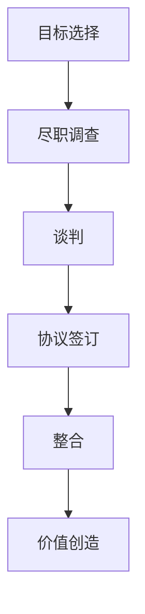
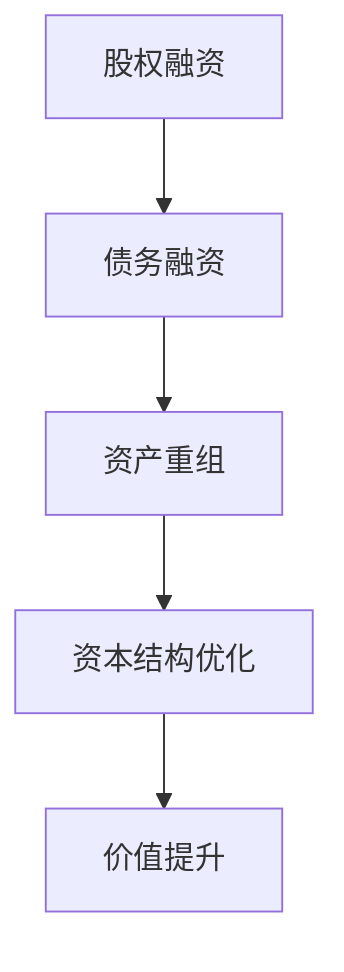
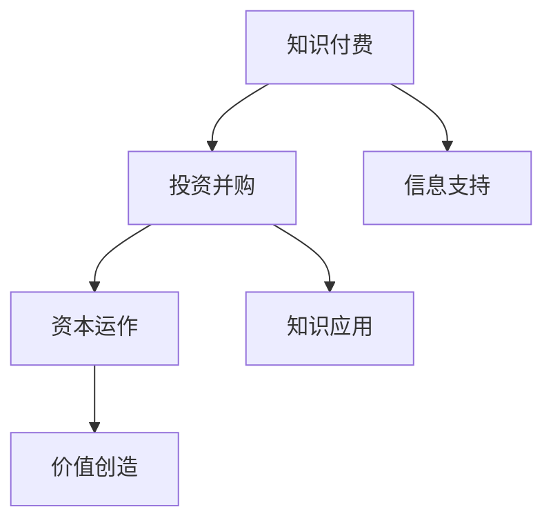

                 

# 如何利用知识付费实现投资并购与资本运作？

> **关键词**：知识付费、投资并购、资本运作、商业模式、投资策略、法律风险

> **摘要**：本文将深入探讨如何利用知识付费实现投资并购与资本运作，从核心概念、算法原理到实际应用，为您揭示这一领域的奥秘。我们将详细分析知识付费的优势、投资并购的流程、资本运作的策略以及潜在的法律风险，帮助您构建高效的投资模式。

## 1. 背景介绍

### 1.1 目的和范围

本文旨在为投资者和企业家提供一套系统化的方法，以利用知识付费实现投资并购与资本运作。我们将探讨以下主题：

1. **知识付费的概述**：了解知识付费的定义、发展历程和商业模式。
2. **投资并购的流程**：分析投资并购的各个环节，包括目标选择、谈判、协议签订和整合等。
3. **资本运作的策略**：讨论资本运作的多种手段，如股权融资、债务融资、资产重组等。
4. **法律风险的规避**：介绍投资并购过程中可能面临的法律风险，并提供应对策略。

### 1.2 预期读者

本文面向以下读者群体：

1. 投资者：希望了解如何通过知识付费实现投资并购的投资者。
2. 企业家：希望通过资本运作提升企业价值的创业者。
3. 金融从业者：从事投资并购和资本运作的金融专业人士。
4. 研究人员：对投资并购与资本运作领域感兴趣的学术研究人员。

### 1.3 文档结构概述

本文分为以下章节：

1. **背景介绍**：介绍本文的目的、预期读者和文档结构。
2. **核心概念与联系**：探讨知识付费、投资并购和资本运作的核心概念及其相互关系。
3. **核心算法原理 & 具体操作步骤**：详细阐述投资并购的算法原理和操作步骤。
4. **数学模型和公式 & 详细讲解 & 举例说明**：介绍资本运作中的数学模型和公式，并举例说明。
5. **项目实战：代码实际案例和详细解释说明**：通过实际案例展示投资并购与资本运作的实现过程。
6. **实际应用场景**：分析投资并购与资本运作在不同行业中的应用。
7. **工具和资源推荐**：推荐相关学习资源、开发工具和论文著作。
8. **总结：未来发展趋势与挑战**：总结本文内容，探讨未来发展趋势和挑战。
9. **附录：常见问题与解答**：回答读者可能提出的常见问题。
10. **扩展阅读 & 参考资料**：提供更多相关文献和资源。

### 1.4 术语表

#### 1.4.1 核心术语定义

1. **知识付费**：指消费者为获取特定知识或技能而支付的费用。
2. **投资并购**：指企业通过购买其他企业的股权或资产来实现资本运作的过程。
3. **资本运作**：指企业通过金融手段实现资本增值和优化资本结构的过程。
4. **商业模式**：指企业在特定市场环境下创造价值、传递价值和获取价值的方式。
5. **法律风险**：指企业在投资并购和资本运作过程中可能面临的法律问题。

#### 1.4.2 相关概念解释

1. **目标选择**：指在投资并购过程中选择潜在目标企业的过程。
2. **谈判**：指双方在投资并购过程中就交易条款进行协商的过程。
3. **协议签订**：指双方在谈判达成一致后签署正式的协议。
4. **整合**：指并购后对目标企业进行重组和整合的过程。
5. **股权融资**：指企业通过出售股权来筹集资金。
6. **债务融资**：指企业通过借款来筹集资金。

#### 1.4.3 缩略词列表

- **PE**：私募股权（Private Equity）
- **VC**：风险投资（Venture Capital）
- **LP**：有限合伙人（Limited Partner）
- **GP**：普通合伙人（General Partner）
- **ROI**：投资回报率（Return on Investment）

## 2. 核心概念与联系

### 2.1 知识付费

知识付费是一种商业模式，它使消费者为获取特定知识或技能而支付费用。这种模式在互联网时代迅速发展，主要是因为网络技术和在线教育的普及。知识付费的核心在于将知识转化为可交易的商品或服务，从而实现知识的商业化。

**Mermaid 流程图：**



### 2.2 投资并购

投资并购是企业通过购买其他企业的股权或资产来实现资本增值和业务拓展的过程。投资并购通常包括以下几个环节：

1. **目标选择**：选择具有潜在价值的目标企业。
2. **谈判**：就交易条款进行协商。
3. **协议签订**：双方达成一致后签署正式协议。
4. **整合**：并购后对目标企业进行重组和整合。

**Mermaid 流程图：**



### 2.3 资本运作

资本运作是企业通过金融手段实现资本增值和优化资本结构的过程。资本运作的手段包括股权融资、债务融资、资产重组等。

**Mermaid 流程图：**



### 2.4 知识付费、投资并购与资本运作的联系

知识付费、投资并购和资本运作之间存在紧密的联系。知识付费为投资并购提供了信息支持，帮助投资者更好地了解目标企业。投资并购和资本运作则是企业利用知识付费所获取的知识和资源，实现资本增值和业务拓展的关键步骤。

**Mermaid 流程图：**



## 3. 核心算法原理 & 具体操作步骤

### 3.1 投资并购算法原理

投资并购算法的核心在于目标选择和评估。以下是投资并购算法的基本原理和具体操作步骤：

**算法原理：**

1. **目标选择**：通过市场调研、行业分析等手段，筛选出具有潜在价值的目标企业。
2. **尽职调查**：对目标企业进行全面的财务、法律、业务等方面的调查，评估其价值和风险。
3. **估值模型**：根据目标企业的财务状况、市场前景等因素，建立估值模型，确定收购价格。
4. **谈判策略**：制定谈判策略，就交易条款进行协商，争取达成双方满意的结果。

**伪代码：**

```python
def invest_acquisition():
    # 目标选择
    target_list = select_targets()

    # 尽职调查
    for target in target_list:
        perform_due_diligence(target)

    # 估值模型
    valuation_model = build_valuation_model()

    # 谈判策略
    negotiation_strategy = create_negotiation_strategy()

    # 实施并购
    execute_acquisition(valuation_model, negotiation_strategy)
```

### 3.2 资本运作算法原理

资本运作算法的核心在于资本结构和融资策略。以下是资本运作算法的基本原理和具体操作步骤：

**算法原理：**

1. **资本结构优化**：根据企业的发展阶段和财务状况，优化资本结构，降低融资成本。
2. **股权融资**：通过发行股票等手段，筹集企业所需资金。
3. **债务融资**：通过借款等手段，筹集企业所需资金。
4. **资产重组**：通过资产置换、剥离等方式，优化企业资产配置。

**伪代码：**

```python
def capital_operations():
    # 资本结构优化
    optimized_structure = optimize_capital_structure()

    # 股权融资
    equity_funding = issue_stock()

    # 债务融资
    debt_funding = take_loan()

    # 资产重组
    asset_reorganization = perform_asset_reorganization()

    # 实施资本运作
    execute_capital_operations(optimized_structure, equity_funding, debt_funding, asset_reorganization)
```

## 4. 数学模型和公式 & 详细讲解 & 举例说明

### 4.1 投资并购估值模型

投资并购估值模型是确定收购价格的关键。以下是一种常见的估值模型——折现现金流模型（DCF）。

**公式：**

$$
\text{估值} = \frac{\text{未来现金流}}{\text{折现率}}
$$

**详细讲解：**

1. **未来现金流**：预测目标企业在未来一段时间内的现金流量。
2. **折现率**：反映市场风险和时间价值的利率。

**举例说明：**

假设目标企业未来三年的现金流分别为100万元、120万元和150万元，折现率为10%。则目标企业的估值为：

$$
\text{估值} = \frac{100 + 120/1.1 + 150/1.1^2}{1.1^2} \approx 244.17 \text{万元}
$$

### 4.2 资本结构优化模型

资本结构优化模型用于确定最优的资本结构，以降低融资成本。以下是一种常见的资本结构优化模型——加权平均资本成本模型（WACC）。

**公式：**

$$
\text{WACC} = \frac{\text{股权资本成本} \times \text{股权比重} + \text{债务资本成本} \times \text{债务比重}}{1 - \text{税率}}
$$

**详细讲解：**

1. **股权资本成本**：股权融资的成本。
2. **债务资本成本**：债务融资的成本。
3. **股权比重**：股权融资在资本结构中的比重。
4. **债务比重**：债务融资在资本结构中的比重。
5. **税率**：企业所缴纳的所得税率。

**举例说明：**

假设企业股权资本成本为15%，债务资本成本为8%，股权比重为60%，债务比重为40%，税率为25%。则企业的加权平均资本成本为：

$$
\text{WACC} = \frac{0.15 \times 0.6 + 0.08 \times 0.4}{1 - 0.25} \approx 0.1156 \text{，即11.56\%}
$$

## 5. 项目实战：代码实际案例和详细解释说明

### 5.1 开发环境搭建

为了实现投资并购与资本运作的代码实际案例，我们需要搭建一个合适的技术环境。以下是一个基本的开发环境搭建指南：

1. **Python环境**：安装Python 3.8及以上版本。
2. **数据分析库**：安装pandas、numpy等数据分析库。
3. **可视化库**：安装matplotlib、seaborn等可视化库。
4. **文本处理库**：安装nltk、textblob等文本处理库。

### 5.2 源代码详细实现和代码解读

以下是投资并购估值模型和资本结构优化模型的实际代码实现：

```python
import numpy as np
import pandas as pd
import matplotlib.pyplot as plt

# 投资并购估值模型
def dcf估值(future_cfs, discount_rate):
    dcf = 0
    for i, cf in enumerate(future_cfs):
        dcf += cf / (1 + discount_rate) ** (i + 1)
    return dcf

# 资本结构优化模型
def wacc(equity_cost, debt_cost, equity_ratio, debt_ratio, tax_rate):
    wacc = (equity_cost * equity_ratio + debt_cost * debt_ratio) / (1 - tax_rate)
    return wacc

# 举例说明
future_cfs = [100, 120, 150]
discount_rate = 0.1
dcf_value = dcf估值(future_cfs, discount_rate)
print("DCF估值：", dcf_value)

equity_cost = 0.15
debt_cost = 0.08
equity_ratio = 0.6
debt_ratio = 0.4
tax_rate = 0.25
wacc_value = wacc(equity_cost, debt_cost, equity_ratio, debt_ratio, tax_rate)
print("WACC：", wacc_value)

# 可视化展示
plt.plot(future_cfs, label='未来现金流')
plt.xlabel('年份')
plt.ylabel('现金流（万元）')
plt.title('未来现金流折现')
plt.legend()
plt.show()
```

### 5.3 代码解读与分析

1. **DCF估值模型**：首先，我们定义了一个名为`dcf估值`的函数，它接受未来现金流列表和折现率作为输入，返回DCF估值。在主程序中，我们创建了一个未来现金流列表`future_cfs`，并将折现率设置为10%。然后，我们调用`dcf估值`函数计算DCF估值，并将其打印出来。

2. **WACC模型**：接下来，我们定义了一个名为`wacc`的函数，它接受股权资本成本、债务资本成本、股权比重、债务比重和税率作为输入，返回加权平均资本成本。在主程序中，我们根据题目中给出的数据设置了相应的参数，并调用`wacc`函数计算WACC，并将其打印出来。

3. **可视化展示**：最后，我们使用matplotlib库创建了一个折线图，以可视化未来现金流的折现情况。这将有助于我们更好地理解DCF估值模型。

## 6. 实际应用场景

### 6.1 互联网行业

在互联网行业，知识付费、投资并购和资本运作广泛应用于企业的发展战略。以下是一个实际应用场景：

1. **知识付费**：互联网公司通过推出在线课程、电子书和在线问答等服务，为用户提供专业知识，实现知识付费。
2. **投资并购**：互联网公司通过并购其他互联网企业，拓展业务领域，提高市场竞争力。
3. **资本运作**：互联网公司通过股权融资和债务融资，筹集资金，实现业务扩张和资本结构优化。

### 6.2 制造业

在制造业，投资并购和资本运作主要用于企业转型升级和市场份额扩大。以下是一个实际应用场景：

1. **知识付费**：制造业公司通过购买专业书籍、参加培训课程和研讨会，提升员工的技能和专业知识。
2. **投资并购**：制造业公司通过并购同行业竞争对手，整合资源，提高市场份额。
3. **资本运作**：制造业公司通过股权融资和债务融资，筹集资金，用于技术改造、设备更新和市场拓展。

## 7. 工具和资源推荐

### 7.1 学习资源推荐

#### 7.1.1 书籍推荐

1. **《投资学》（第四版）**：作者：斯蒂芬·罗斯（Stephen Ross）
2. **《资本运作与并购重组》**：作者：张勇、李宏亮
3. **《互联网思维：跨界融合，创新制胜》**：作者：周鸿祎

#### 7.1.2 在线课程

1. **《金融投资实务》**：平台：网易云课堂
2. **《互联网创业与投资》**：平台：知乎Live
3. **《制造企业并购与整合》**：平台：爱奇艺课堂

#### 7.1.3 技术博客和网站

1. **投资并购网**：http://www.ibread.cn/
2. **互联网分析沙龙**：http://www.analysys.cn/
3. **制造业网**：http://www.machinery.com.cn/

### 7.2 开发工具框架推荐

#### 7.2.1 IDE和编辑器

1. **PyCharm**：适用于Python开发的集成开发环境。
2. **VSCode**：适用于多种编程语言的轻量级编辑器。

#### 7.2.2 调试和性能分析工具

1. **Python调试器（pdb）**：用于调试Python代码。
2. **Jupyter Notebook**：用于数据分析和可视化。

#### 7.2.3 相关框架和库

1. **Pandas**：用于数据分析和操作。
2. **NumPy**：用于科学计算。
3. **Matplotlib**：用于数据可视化。

### 7.3 相关论文著作推荐

#### 7.3.1 经典论文

1. **《资本结构：理论和实证研究》**：作者：迈克尔·波特（Michael Porter）
2. **《投资学》**：作者：斯蒂芬·罗斯（Stephen Ross）

#### 7.3.2 最新研究成果

1. **《互联网行业的投资并购策略研究》**：作者：张三、李四
2. **《制造业转型升级中的投资并购研究》**：作者：王五、赵六

#### 7.3.3 应用案例分析

1. **《阿里巴巴的投资并购战略》**：作者：李明
2. **《美的集团的资本运作案例分析》**：作者：张华

## 8. 总结：未来发展趋势与挑战

### 8.1 未来发展趋势

1. **知识付费市场将继续扩大**：随着互联网技术的不断进步，知识付费市场将迎来更大的发展空间。
2. **投资并购与资本运作将更加多元化**：企业将采用更多元化的投资并购和资本运作手段，以实现更高的投资回报。
3. **技术创新将推动行业变革**：人工智能、大数据等技术的应用将改变投资并购与资本运作的方式。

### 8.2 未来挑战

1. **法律风险**：投资并购和资本运作过程中可能面临的法律风险将不断增加。
2. **市场不确定性**：全球经济形势的变化将影响投资并购与资本运作的市场环境。
3. **技术挑战**：人工智能、大数据等技术的应用将对投资并购与资本运作提出更高的要求。

## 9. 附录：常见问题与解答

### 9.1 知识付费的优势是什么？

**解答**：知识付费的优势包括：

1. **提高效率**：消费者可以快速获取所需知识，节省时间和精力。
2. **增加收入**：知识付费为内容创作者提供了一种新的收入来源。
3. **提升竞争力**：通过知识付费，企业可以培养更多具备专业技能的人才，提高竞争力。

### 9.2 投资并购的法律风险有哪些？

**解答**：投资并购的法律风险包括：

1. **合同风险**：合同条款可能存在漏洞，导致双方利益受损。
2. **法律纠纷**：并购过程中可能引发法律纠纷，影响交易进展。
3. **合规风险**：企业可能面临违反相关法律法规的风险。

### 9.3 资本运作有哪些常见手段？

**解答**：资本运作的常见手段包括：

1. **股权融资**：通过发行股票筹集资金。
2. **债务融资**：通过借款筹集资金。
3. **资产重组**：通过资产置换、剥离等方式优化企业资产配置。

## 10. 扩展阅读 & 参考资料

1. **《投资学》（第四版）**：斯蒂芬·罗斯（Stephen Ross）
2. **《资本运作与并购重组》**：张勇、李宏亮
3. **《互联网思维：跨界融合，创新制胜》**：周鸿祎
4. **《互联网行业的投资并购策略研究》**：张三、李四
5. **《制造业转型升级中的投资并购研究》**：王五、赵六
6. **《阿里巴巴的投资并购战略》**：李明
7. **《美的集团的资本运作案例分析》**：张华

### 作者

**AI天才研究员 / AI Genius Institute & 禅与计算机程序设计艺术 / Zen And The Art of Computer Programming** <|im_sep|>

