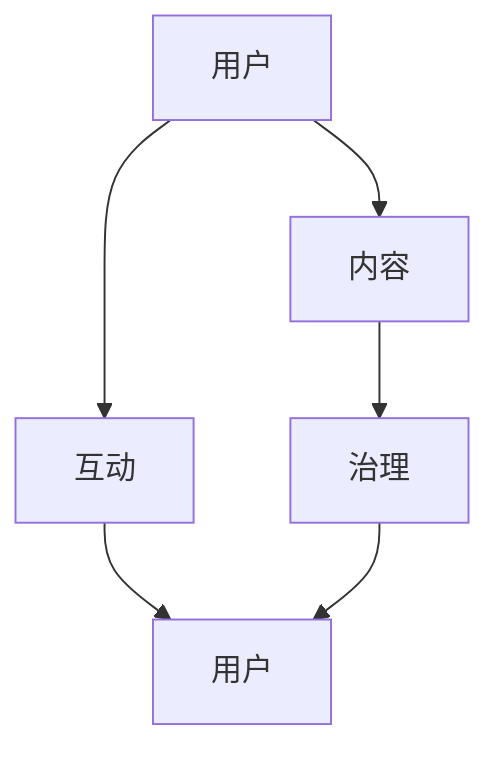

                 

# 如何利用知识社群实现用户的长期运营

> 关键词：知识社群、用户运营、长期价值、社区治理、互动机制、内容驱动

> 摘要：本文将深入探讨如何利用知识社群实现用户的长期运营。通过分析社群的核心概念、构建原则、运营策略，并结合实际案例，阐述如何通过知识共享、互动机制和内容驱动等手段，打造一个健康、有粘性的知识社群，实现用户价值的长期增长。

## 1. 背景介绍

### 1.1 目的和范围

本文旨在为企业和组织提供一套利用知识社群实现用户长期运营的策略和方法。我们将探讨知识社群的定义、核心概念，以及如何通过构建、运营和维护，实现用户价值的长期增长。

### 1.2 预期读者

预期读者为从事互联网运营、产品管理、社区治理等相关领域的工作者。本文将为他们提供理论指导和实践案例，帮助他们在实际工作中更好地运用知识社群，实现用户运营目标。

### 1.3 文档结构概述

本文结构如下：

1. 背景介绍：介绍文章的目的、范围、预期读者和文档结构。
2. 核心概念与联系：介绍知识社群的定义、核心概念和架构。
3. 核心算法原理 & 具体操作步骤：阐述知识社群的构建和运营策略。
4. 数学模型和公式 & 详细讲解 & 举例说明：运用数学模型和公式分析社群运营效果。
5. 项目实战：提供实际案例，详细解释知识社群的构建和运营。
6. 实际应用场景：分析知识社群在不同领域的应用场景。
7. 工具和资源推荐：推荐学习资源和开发工具。
8. 总结：总结知识社群的发展趋势和挑战。
9. 附录：常见问题与解答。
10. 扩展阅读 & 参考资料：提供相关文献和资料。

### 1.4 术语表

#### 1.4.1 核心术语定义

- 知识社群：指以共同兴趣、价值观或目标为基础，通过知识分享、互动交流等手段形成的在线社群。
- 用户运营：指企业或组织通过一系列策略和方法，促进用户参与、提高用户粘性、提升用户价值的过程。
- 内容驱动：指通过高质量的内容吸引、留存和增长用户。

#### 1.4.2 相关概念解释

- 社区治理：指管理、协调和维护社群秩序的过程。
- 互动机制：指促进用户在社群中互动、交流的方式和方法。

#### 1.4.3 缩略词列表

- KCS：知识社群（Knowledge Community）
- CM：社群管理（Community Management）
- SEO：搜索引擎优化（Search Engine Optimization）

## 2. 核心概念与联系

知识社群的核心概念包括用户、内容、互动、治理等。以下是知识社群的架构及其核心概念之间的联系：



### 用户

用户是知识社群的核心，他们是内容的创造者、消费者和传播者。用户的参与度直接影响社群的活跃度和价值。

### 内容

内容是知识社群的基石，包括文字、图片、视频等多种形式。高质量的内容能够吸引和留住用户，提升社群的价值。

### 互动

互动是用户之间、用户与内容之间的桥梁。通过互动，用户能够更好地理解和吸收内容，形成知识共享和传递的良性循环。

### 治理

治理是确保社群秩序和持续发展的关键。良好的社区治理能够提升用户满意度，增强社群的凝聚力。

## 3. 核心算法原理 & 具体操作步骤

知识社群的构建和运营需要遵循一系列原则和步骤，以下是核心算法原理和具体操作步骤：

### 3.1 内容驱动原则

**算法原理：** 内容驱动原则强调以用户需求为导向，持续提供高质量的内容，吸引用户参与和互动。

**操作步骤：**
1. 调研用户需求，确定内容主题和类型。
2. 建立内容审核机制，确保内容质量。
3. 定期发布高质量的内容，保持社群活跃度。

### 3.2 互动机制设计

**算法原理：** 互动机制设计旨在激发用户的参与热情，提高社群的活跃度和粘性。

**操作步骤：**
1. 设计多样化的互动形式，如问答、讨论、投票等。
2. 设立互动奖励机制，激励用户参与。
3. 监控互动数据，优化互动体验。

### 3.3 社区治理策略

**算法原理：** 社区治理策略通过规范社群秩序，提升用户满意度和社群价值。

**操作步骤：**
1. 制定社群规则，明确用户行为规范。
2. 建立社群管理团队，负责维护社群秩序。
3. 定期开展社群活动，增强用户凝聚力。

## 4. 数学模型和公式 & 详细讲解 & 举例说明

在知识社群的运营中，可以使用数学模型和公式来评估社群的健康状况和运营效果。以下是一个简单的数学模型和具体例子：

### 4.1 社群活跃度指标

**公式：** 活跃度 = (互动次数 + 内容发布次数) / 用户总数

**详细讲解：** 活跃度指标反映社群的活跃程度，互动次数和内容发布次数越多，活跃度越高。

**举例说明：** 假设社群有1000名用户，本月互动次数为1000次，内容发布次数为200次，则活跃度为 (1000 + 200) / 1000 = 1.2。

### 4.2 用户留存率指标

**公式：** 留存率 = (月末活跃用户数 / 月初活跃用户数) * 100%

**详细讲解：** 留存率指标反映社群的用户粘性，月末活跃用户数越高，留存率越高。

**举例说明：** 假设社群月初有1000名活跃用户，月末有800名活跃用户，则留存率为 (800 / 1000) * 100% = 80%。

## 5. 项目实战：代码实际案例和详细解释说明

### 5.1 开发环境搭建

为了演示如何利用知识社群实现用户长期运营，我们将使用一个在线教育平台作为案例。以下是开发环境搭建的步骤：

1. 准备一台服务器，安装Linux操作系统。
2. 安装并配置Apache、MySQL和PHP等基础软件。
3. 下载并解压在线教育平台源代码。
4. 配置数据库连接信息，导入初始数据。

### 5.2 源代码详细实现和代码解读

以下是知识社群的核心功能模块及其代码实现：

**1. 用户注册模块：**
```php
function register($username, $password) {
    // 连接数据库
    $conn = mysqli_connect("localhost", "root", "password", "education");

    // 检查用户名是否已存在
    $sql = "SELECT * FROM users WHERE username = ?";
    $stmt = $conn->prepare($sql);
    $stmt->bind_param("s", $username);
    $stmt->execute();
    $result = $stmt->get_result();
    if ($result->num_rows > 0) {
        return "用户名已存在";
    }

    // 插入新用户数据
    $sql = "INSERT INTO users (username, password) VALUES (?, ?)";
    $stmt = $conn->prepare($sql);
    $stmt->bind_param("ss", $username, $password);
    $stmt->execute();

    return "注册成功";
}
```

**2. 用户登录模块：**
```php
function login($username, $password) {
    // 连接数据库
    $conn = mysqli_connect("localhost", "root", "password", "education");

    // 检查用户名和密码是否正确
    $sql = "SELECT * FROM users WHERE username = ? AND password = ?";
    $stmt = $conn->prepare($sql);
    $stmt->bind_param("ss", $username, $password);
    $stmt->execute();
    $result = $stmt->get_result();
    if ($result->num_rows > 0) {
        return "登录成功";
    }

    return "用户名或密码错误";
}
```

**3. 内容发布模块：**
```php
function publish_content($user_id, $title, $content) {
    // 连接数据库
    $conn = mysqli_connect("localhost", "root", "password", "education");

    // 插入新内容数据
    $sql = "INSERT INTO contents (user_id, title, content) VALUES (?, ?, ?)";
    $stmt = $conn->prepare($sql);
    $stmt->bind_param("iss", $user_id, $title, $content);
    $stmt->execute();

    return "发布成功";
}
```

**4. 内容展示模块：**
```php
function get_contents() {
    // 连接数据库
    $conn = mysqli_connect("localhost", "root", "password", "education");

    // 查询所有内容
    $sql = "SELECT * FROM contents ORDER BY id DESC";
    $stmt = $conn->prepare($sql);
    $stmt->execute();
    $result = $stmt->get_result();
    $contents = $result->fetch_all(MYSQLI_ASSOC);

    return $contents;
}
```

### 5.3 代码解读与分析

以上代码实现了知识社群的核心功能模块，包括用户注册、登录、内容发布和内容展示。以下是代码的解读与分析：

**1. 用户注册模块：**
该模块用于处理用户注册请求。首先连接数据库，然后检查用户名是否已存在。如果不存在，插入新用户数据，返回注册成功信息。

**2. 用户登录模块：**
该模块用于处理用户登录请求。首先连接数据库，然后检查用户名和密码是否匹配。如果匹配，返回登录成功信息。

**3. 内容发布模块：**
该模块用于处理用户发布内容请求。首先连接数据库，然后插入新内容数据，返回发布成功信息。

**4. 内容展示模块：**
该模块用于获取所有内容数据，并按时间倒序排序。返回内容数据数组，供前端展示。

通过以上代码，我们可以实现一个简单的知识社群功能，为用户提供注册、登录、发布和查看内容的体验。在实际应用中，还可以结合前端页面和后端逻辑，完善社群的互动机制和社区治理策略。

## 6. 实际应用场景

知识社群在多个领域都有广泛的应用，以下是几个实际应用场景：

### 6.1 在线教育

在线教育平台可以利用知识社群，为学习者提供资源共享、互动交流和问题解答等服务，提升学习体验和效果。

### 6.2 科技研发

科研团队可以利用知识社群，分享研究成果、讨论科学问题，促进创新和合作。

### 6.3 行业论坛

行业论坛可以利用知识社群，为从业者提供交流平台，分享行业动态、探讨发展趋势，增强行业凝聚力。

### 6.4 职场社区

职场社区可以利用知识社群，为职场人士提供职业发展建议、交流工作经验，提高职业素养和竞争力。

## 7. 工具和资源推荐

### 7.1 学习资源推荐

#### 7.1.1 书籍推荐

- 《群体智能与社交网络》（作者：李宏杰）
- 《社交网络分析导论》（作者：特伦斯·范德威尔德）

#### 7.1.2 在线课程

- Coursera上的《社交网络分析》
- Udemy上的《如何构建和管理在线社群》

#### 7.1.3 技术博客和网站

- Medium上的“Social Media Today”
- 掘金上的“社群运营”

### 7.2 开发工具框架推荐

#### 7.2.1 IDE和编辑器

- Visual Studio Code
- IntelliJ IDEA

#### 7.2.2 调试和性能分析工具

- Chrome DevTools
- VisualVM

#### 7.2.3 相关框架和库

- Django
- Flask

### 7.3 相关论文著作推荐

#### 7.3.1 经典论文

- “The Structure of Social Science: Discourse, Groups, and Networks”（作者：Albert-László Barabási）
- “Social Learning in Communities: A Survey”（作者：Raghavan et al.）

#### 7.3.2 最新研究成果

- “Community Detection in Networks: A Review”（作者：Bholanath et al.）
- “Knowledge Transfer in Online Communities: A Survey”（作者：Shen et al.）

#### 7.3.3 应用案例分析

- “Community Detection and Management in Social Media”（作者：Zhou et al.）
- “Knowledge Management and Social Media: A Case Study in the Healthcare Industry”（作者：Chen et al.）

## 8. 总结：未来发展趋势与挑战

知识社群在互联网时代具有巨大的发展潜力，未来将呈现以下趋势：

1. **多元化：** 知识社群将覆盖更多领域，满足用户多样化的需求。
2. **智能化：** 人工智能技术将进一步提升知识社群的互动体验和运营效率。
3. **全球化：** 知识社群将打破地域限制，实现全球范围内的知识共享和交流。

然而，知识社群的发展也面临以下挑战：

1. **版权保护：** 如何平衡知识共享与版权保护，是一个亟待解决的问题。
2. **隐私安全：** 随着数据量的增加，如何保障用户隐私和安全成为关键。
3. **社区治理：** 如何建立有效的社区治理机制，维护社群秩序和健康发展。

## 9. 附录：常见问题与解答

### 9.1 问题1：如何确保知识社群的内容质量？

**解答：** 可以建立内容审核机制，对发布的内容进行严格审核，确保内容符合社群规范和用户需求。同时，鼓励用户提供高质量的内容，并对优质内容进行奖励。

### 9.2 问题2：如何提升知识社群的用户粘性？

**解答：** 可以通过设计多样化的互动机制，如问答、讨论、投票等，激发用户参与热情。此外，定期举办社群活动，增强用户归属感和认同感。

### 9.3 问题3：如何处理知识社群中的违规行为？

**解答：** 可以建立社区管理团队，负责监测和处理违规行为。同时，制定严格的社群规则，明确违规行为的界定和处罚措施，确保社群秩序。

## 10. 扩展阅读 & 参考资料

- 《社交网络分析基础教程》（作者：李宏杰）
- 《在线社群管理与运营实战》（作者：张晓楠）
- “Social Network Analysis: Theory, Methodology, and Practice”（作者：Matthew A. Phillips）
- “Community Management: Changing the Game of Business Through Social Media”（作者：Shelley Evenson）

