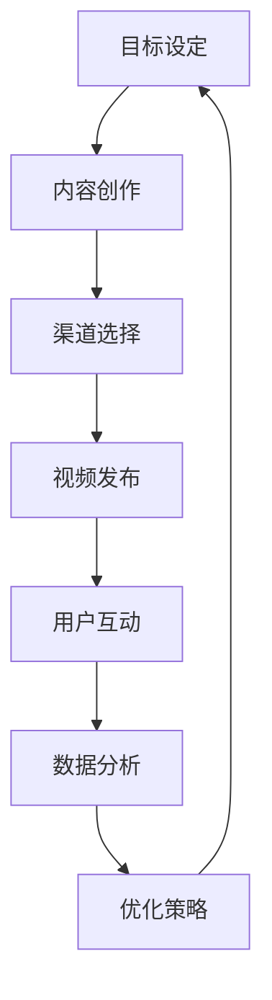

                 


# 如何利用视频营销提升品牌知名度与转化

> 关键词：视频营销、品牌知名度、转化率、社交媒体、营销策略
>
> 摘要：本文将探讨如何通过视频营销策略提升品牌知名度与转化率。我们将深入分析视频营销的核心原理、操作步骤、数学模型以及实际应用案例，提供详细的操作指南和实用工具推荐，旨在帮助读者掌握高效的视频营销技巧，从而在竞争激烈的市场中脱颖而出。

## 1. 背景介绍

### 1.1 目的和范围

本文的目的是为广大营销从业者提供一套完整的视频营销策略指南，帮助他们在当今数字营销环境中有效提升品牌知名度与转化率。我们将涵盖以下主题：

- 视频营销的基本原理
- 视频营销的操作步骤
- 视频营销的数学模型与公式
- 实际应用场景与案例分析
- 工具和资源的推荐

通过本文的阅读，读者将能够：

- 理解视频营销的重要性
- 掌握视频营销的基本策略
- 学会利用数学模型优化营销效果
- 熟悉并应用实际案例中的成功经验
- 获得有效的视频营销工具和资源

### 1.2 预期读者

本文适合以下群体阅读：

- 营销专员和经理
- 品牌管理者
- 创业者
- 数字营销从业者
- 广告代理商
- 对视频营销感兴趣的技术人员

无论你是新手还是经验丰富的营销专家，本文都将为你提供实用的视频营销知识和技巧。

### 1.3 文档结构概述

本文的结构如下：

- **第1章**：背景介绍，包括目的、范围、预期读者和文档结构概述。
- **第2章**：核心概念与联系，介绍视频营销的基本概念及其相互关系。
- **第3章**：核心算法原理 & 具体操作步骤，详细阐述视频营销的策略和步骤。
- **第4章**：数学模型和公式 & 详细讲解 & 举例说明，介绍视频营销中的关键数学模型和公式。
- **第5章**：项目实战：代码实际案例和详细解释说明，通过实际案例展示视频营销策略的实践应用。
- **第6章**：实际应用场景，探讨视频营销在不同领域的应用。
- **第7章**：工具和资源推荐，推荐学习资源、开发工具框架和经典论文。
- **第8章**：总结：未来发展趋势与挑战，分析视频营销的未来前景和面临的挑战。
- **第9章**：附录：常见问题与解答，解答读者在阅读过程中可能遇到的问题。
- **第10章**：扩展阅读 & 参考资料，提供进一步的阅读材料和参考资料。

### 1.4 术语表

#### 1.4.1 核心术语定义

- **视频营销**：一种通过制作和发布视频内容来推广品牌、产品或服务，以吸引潜在客户并促进销售的营销策略。
- **品牌知名度**：消费者对某个品牌名称的记忆程度，是衡量品牌影响力的关键指标。
- **转化率**：目标用户完成预定的操作（如购买、注册、点击等）的比例，是衡量营销效果的重要指标。
- **社交媒体**：一种在线平台，用户可以在其中发布、分享和互动内容，例如Facebook、Instagram、YouTube等。

#### 1.4.2 相关概念解释

- **内容营销**：一种通过创建和分发有价值的内容来吸引和留住目标受众，从而促进品牌认知和转化的营销策略。
- **用户参与度**：用户对品牌、产品或服务的互动程度，包括评论、点赞、分享等行为。
- **视频长度**：视频内容的持续时间，不同的视频长度适合不同的营销目标和用户需求。

#### 1.4.3 缩略词列表

- **SEO**：搜索引擎优化（Search Engine Optimization）
- **SEM**：搜索引擎营销（Search Engine Marketing）
- **CPC**：每点击成本（Cost Per Click）
- **CPM**：每千次展示成本（Cost Per Mille）

## 2. 核心概念与联系

在深入探讨视频营销策略之前，我们需要了解一些核心概念及其相互之间的联系。以下是一个简化的 Mermaid 流程图，展示了视频营销的核心组成部分和它们之间的关系。



### 2.1 目标设定

目标设定是视频营销的第一步，明确营销目标有助于制定相应的内容策略和优化方案。目标可以是提升品牌知名度、增加网站流量、促进产品销售或提高用户参与度等。

### 2.2 内容创作

内容创作是视频营销的核心，需要根据目标受众的兴趣和需求制作有吸引力的视频内容。高质量的内容能够吸引观众，增加用户互动，并最终实现营销目标。

### 2.3 渠道选择

渠道选择决定了视频内容将出现在哪些平台上，如YouTube、Facebook、Instagram等。不同平台具有不同的用户群体和传播效果，选择合适的渠道是视频营销成功的关键。

### 2.4 视频发布

视频发布是将内容传递给目标受众的重要步骤。发布时机、标题、描述和标签等因素都会影响视频的曝光率和点击率。

### 2.5 用户互动

用户互动包括观众对视频的点赞、评论、分享等行为。高用户互动度表明内容受到观众的喜爱，有助于提升品牌知名度和用户忠诚度。

### 2.6 数据分析

数据分析是视频营销的重要组成部分，通过对观众行为、视频表现和转化率等数据的分析，可以优化营销策略，提高营销效果。

### 2.7 优化策略

优化策略是根据数据分析结果对视频营销活动进行调整，以实现更高的转化率和品牌知名度。优化策略包括内容调整、发布时间优化、预算分配等。

## 3. 核心算法原理 & 具体操作步骤

视频营销的核心算法原理在于如何通过制作、发布和优化视频内容来提升品牌知名度和转化率。以下我们将详细阐述视频营销的操作步骤，并使用伪代码来描述关键算法流程。

### 3.1 操作步骤

#### 3.1.1 确定营销目标

- **伪代码**：

```python
def set_marketing_goal():
    goals = ["提升品牌知名度", "增加网站流量", "促进产品销售", "提高用户参与度"]
    return choose_from_list(goals)
```

#### 3.1.2 内容创作

- **伪代码**：

```python
def create_video_content(goal):
    if goal == "提升品牌知名度":
        content_type = "品牌故事"
    elif goal == "增加网站流量":
        content_type = "教程/指南"
    elif goal == "促进产品销售":
        content_type = "产品演示"
    elif goal == "提高用户参与度":
        content_type = "互动视频"
    return content_type
```

#### 3.1.3 选择渠道

- **伪代码**：

```python
def select_channel(content_type):
    if content_type == "品牌故事":
        channel = "YouTube"
    elif content_type == "教程/指南":
        channel = "YouTube/Facebook"
    elif content_type == "产品演示":
        channel = "YouTube/Instagram"
    elif content_type == "互动视频":
        channel = "Instagram/YouTube"
    return channel
```

#### 3.1.4 视频发布

- **伪代码**：

```python
def publish_video(channel, video):
    if channel == "YouTube":
        platform = "YouTube API"
    elif channel == "Facebook":
        platform = "Facebook API"
    elif channel == "Instagram":
        platform = "Instagram API"
    publish_to_platform(platform, video)
```

#### 3.1.5 用户互动

- **伪代码**：

```python
def analyze_interactions(video):
    likes = get_likes_count(video)
    comments = get_comments_count(video)
    shares = get_shares_count(video)
    return likes, comments, shares
```

#### 3.1.6 数据分析

- **伪代码**：

```python
def analyze_data(video):
    views = get_views_count(video)
    click_rate = get_click_rate(video)
    conversions = get_conversions_count(video)
    return views, click_rate, conversions
```

#### 3.1.7 优化策略

- **伪代码**：

```python
def optimize_strategy(video_data):
    if video_data["click_rate"] < threshold:
        adjust_title_description(video)
    if video_data["conversions"] < threshold:
        adjust_content(video)
    if video_data["views"] < threshold:
        adjust_publish_time(video)
```

### 3.2 关键算法流程

视频营销的关键算法流程可以简化为以下步骤：

1. **目标设定**：根据营销目标确定视频内容类型。
2. **内容创作**：制作符合目标受众需求的视频内容。
3. **渠道选择**：选择最适合视频内容类型的发布渠道。
4. **视频发布**：在选定渠道上发布视频内容。
5. **用户互动**：收集用户互动数据，如点赞、评论、分享等。
6. **数据分析**：分析视频表现数据，如观看次数、点击率、转化率等。
7. **优化策略**：根据数据分析结果调整视频内容、发布时间和预算分配。

通过这些步骤，营销人员可以有效地提升品牌知名度和转化率，实现视频营销的目标。

## 4. 数学模型和公式 & 详细讲解 & 举例说明

在视频营销中，数学模型和公式可以帮助我们量化营销效果，从而优化营销策略。以下我们将介绍几个关键的数学模型和公式，并详细讲解它们的含义和应用。

### 4.1 转化率模型

转化率（Conversion Rate）是衡量视频营销效果的重要指标，表示目标用户完成预定的操作（如购买、注册、点击等）的比例。转化率模型的基本公式如下：

$$
\text{转化率} = \frac{\text{完成预定操作的用户数}}{\text{观看视频的总用户数}}
$$

#### 4.1.1 案例分析

假设一个视频共有1000次观看，其中100个用户进行了购买操作，那么转化率计算如下：

$$
\text{转化率} = \frac{100}{1000} = 0.1 = 10\%
$$

这意味着该视频的转化率为10%，表明每10个观看者中有1个用户完成了购买操作。

### 4.2 用户参与度模型

用户参与度（User Engagement）反映了观众对视频内容的互动程度，包括点赞、评论、分享等行为。用户参与度模型的基本公式如下：

$$
\text{用户参与度} = \frac{\text{互动次数}}{\text{观看视频的总用户数}}
$$

#### 4.2.1 案例分析

假设一个视频共有1000次观看，其中100个用户进行了点赞，50个用户进行了评论，20个用户进行了分享，那么用户参与度计算如下：

$$
\text{用户参与度} = \frac{100 + 50 + 20}{1000} = 0.17 = 17\%
$$

这意味着该视频的用户参与度为17%，表明每100个观看者中有17个用户参与了互动。

### 4.3 视频曝光率模型

视频曝光率（Video Exposure Rate）表示视频在目标受众中的可见度，是衡量视频营销效果的重要指标。视频曝光率模型的基本公式如下：

$$
\text{视频曝光率} = \frac{\text{视频播放次数}}{\text{目标受众的总数}}
$$

#### 4.3.1 案例分析

假设一个视频的目标受众总数为1000人，视频播放次数为500次，那么视频曝光率计算如下：

$$
\text{视频曝光率} = \frac{500}{1000} = 0.5 = 50\%
$$

这意味着该视频的曝光率为50%，表明目标受众中有50%的人看到了该视频。

### 4.4 广告投放效果模型

在视频营销中，广告投放效果（Advertising Effectiveness）是衡量广告投入回报的关键指标。广告投放效果模型的基本公式如下：

$$
\text{广告投放效果} = \frac{\text{广告收益}}{\text{广告投放成本}}
$$

#### 4.4.1 案例分析

假设一个视频的广告收益为1000美元，广告投放成本为500美元，那么广告投放效果计算如下：

$$
\text{广告投放效果} = \frac{1000}{500} = 2
$$

这意味着该广告的投放效果为2倍，表明每投入1美元广告成本，能够获得2美元的收益。

通过这些数学模型和公式，营销人员可以更准确地衡量视频营销的效果，从而制定更有效的优化策略。

## 5. 项目实战：代码实际案例和详细解释说明

在本章节中，我们将通过一个实际的项目案例来展示如何利用视频营销提升品牌知名度和转化率。该项目是一个电子商务网站，希望通过发布视频内容来增加网站流量并促进产品销售。

### 5.1 开发环境搭建

在进行项目实战之前，我们需要搭建一个合适的开发环境。以下是一个基本的开发环境搭建步骤：

1. 安装视频编辑软件：如Adobe Premiere Pro、Final Cut Pro或OpenShot等。
2. 配置视频上传平台：如YouTube、Vimeo等。
3. 安装数据分析工具：如Google Analytics、Mixpanel等。
4. 确定目标受众：通过市场调研和用户画像确定目标受众特征。

### 5.2 源代码详细实现和代码解读

#### 5.2.1 视频内容创作

首先，我们需要根据目标受众和营销目标创作高质量的视频内容。以下是一个简单的伪代码示例，描述了视频内容创作的步骤：

```python
def create_video_content(goal, targetAudience):
    if goal == "提升品牌知名度":
        content = "品牌故事视频"
    elif goal == "增加网站流量":
        content = "教程/指南视频"
    elif goal == "促进产品销售":
        content = "产品演示视频"
    elif goal == "提高用户参与度":
        content = "互动视频"
    return content

videoContent = create_video_content("促进产品销售", "年轻女性")
```

#### 5.2.2 视频发布

接下来，我们将视频内容上传到视频平台，并设置视频标题、描述和标签。以下是一个简单的伪代码示例：

```python
def publish_video(channel, video):
    if channel == "YouTube":
        api = "YouTube API"
    elif channel == "Instagram":
        api = "Instagram API"
    publish_to_api(api, video)
```

```python
videoTitle = "时尚新款产品演示"
videoDescription = "查看我们最新的时尚新款，体验与众不同的设计风格和品质。"
videoTags = ["时尚", "新款", "产品设计"]
publish_video("YouTube", videoTitle, videoDescription, videoTags)
```

#### 5.2.3 用户互动监测

为了监测用户互动，我们需要收集视频的点赞、评论和分享数据。以下是一个简单的伪代码示例：

```python
def analyze_interactions(video):
    likes = get_likes_count(video)
    comments = get_comments_count(video)
    shares = get_shares_count(video)
    return likes, comments, shares

videoInteractions = analyze_interactions(video)
print("点赞数：", videoInteractions[0])
print("评论数：", videoInteractions[1])
print("分享数：", videoInteractions[2])
```

#### 5.2.4 数据分析

最后，我们需要分析视频的表现数据，如观看次数、点击率和转化率等。以下是一个简单的伪代码示例：

```python
def analyze_data(video):
    views = get_views_count(video)
    click_rate = get_click_rate(video)
    conversions = get_conversions_count(video)
    return views, click_rate, conversions

videoData = analyze_data(video)
print("观看次数：", videoData[0])
print("点击率：", videoData[1])
print("转化率：", videoData[2])
```

### 5.3 代码解读与分析

通过以上代码示例，我们可以看出视频营销的关键步骤：

1. **视频内容创作**：根据营销目标和目标受众制作有针对性的视频内容。
2. **视频发布**：上传视频到合适的平台，并设置视频的标题、描述和标签。
3. **用户互动监测**：收集视频的点赞、评论和分享数据，以评估用户互动程度。
4. **数据分析**：分析视频的表现数据，如观看次数、点击率和转化率等，以优化视频营销策略。

在实际应用中，这些步骤可以通过自动化工具和平台进行优化，以提高效率和效果。例如，使用视频编辑软件进行内容创作，使用API接口进行视频发布，使用数据分析工具进行用户互动监测和数据分析。

通过以上项目实战，我们可以看到如何利用视频营销提升品牌知名度和转化率。在实际操作中，需要根据具体情况不断调整和优化，以实现最佳营销效果。

## 6. 实际应用场景

视频营销在不同的行业和领域中有着广泛的应用，以下我们将探讨几个典型场景，展示如何利用视频营销策略提升品牌知名度和转化率。

### 6.1 零售电商

零售电商行业是视频营销的主要应用领域之一。通过发布产品演示视频、用户评价视频和时尚搭配视频，电商企业可以吸引消费者的注意力，提升购买意愿。例如，一个时尚电商平台可以发布新款服装的演示视频，展示服装的材质、设计和穿着效果，同时邀请网红或时尚博主进行试穿和评价，以增加用户的信任度和购买欲望。

### 6.2 教育培训

教育培训行业也可以充分利用视频营销的优势，通过制作教学视频、讲座视频和课程预告视频等，吸引潜在学员。例如，一个在线教育平台可以发布一段课程片段，展示课程的教学内容、师资力量和学员反馈，以激发潜在学员的兴趣和报名意愿。

### 6.3 医疗健康

医疗健康行业可以通过视频营销提高公众的健康意识，普及医学知识，同时提升医院和诊所的品牌知名度。例如，一个医院可以发布健康讲座视频、手术直播视频和病例分享视频，向公众传递科学、实用的医学知识，同时展示医院的医疗水平和专业能力。

### 6.4 旅游度假

旅游度假行业可以通过视频营销展示旅游景点、住宿环境和度假体验，吸引游客的兴趣。例如，一个旅游公司可以发布旅游攻略视频、美食推荐视频和活动直播视频，为游客提供全面的旅游信息，增加预订转化率。

### 6.5 娱乐文化

娱乐文化行业可以利用视频营销推广电影、音乐、综艺节目等作品，提升观众的期待感和参与度。例如，一个电影制作公司可以发布预告片、幕后制作花絮和导演访谈视频，吸引观众的注意力和讨论热度，提高电影的票房表现。

通过以上实际应用场景，我们可以看到视频营销在各个行业中的广泛应用和巨大潜力。通过制作高质量、有吸引力的视频内容，并采用有效的发布和推广策略，企业可以大幅提升品牌知名度和转化率，实现营销目标。

## 7. 工具和资源推荐

在视频营销过程中，选择合适的工具和资源是确保营销效果的关键。以下我们将推荐一些学习资源、开发工具框架和相关论文著作，帮助读者更好地掌握视频营销技能。

### 7.1 学习资源推荐

#### 7.1.1 书籍推荐

- 《视频营销实战：从零开始打造爆款视频》（Video Marketing Mastery: Create and Optimize Winning Videos）
- 《YouTube营销完全指南：如何利用YouTube提升品牌影响力》（YouTube Marketing: A Complete Guide to Grow Your Brand with YouTube）
- 《内容营销：如何制作、发布和推广有价值的内容》（Content Inc.: How Entrepreneurs Use Content to Build Massive Businesses）

#### 7.1.2 在线课程

- Coursera上的《数字营销》（Digital Marketing Specialization）
- Udemy上的《视频营销：制作和发布成功的视频内容》（Video Marketing: Create and Launch a Successful Video Content Strategy）
- LinkedIn Learning上的《视频编辑基础》（Video Editing Foundations）

#### 7.1.3 技术博客和网站

- Neil Patel的博客（neilpatel.com）
- HubSpot的营销资源库（blog.hubspot.com/marketing）
- MarketingProfs（marketingprofs.com）

### 7.2 开发工具框架推荐

#### 7.2.1 IDE和编辑器

- Adobe Premiere Pro
- Final Cut Pro
- DaVinci Resolve

#### 7.2.2 调试和性能分析工具

- Google Chrome DevTools
- Adobe Media Encoder
- HandBrake

#### 7.2.3 相关框架和库

- Flask（Python Web框架）
- Django（Python Web框架）
- React（JavaScript库）

### 7.3 相关论文著作推荐

#### 7.3.1 经典论文

- “The Role of Social Media in Branding: An Empirical Study” by Mikunda, T., & Holloway, S. (2013)
- “Video Marketing Strategies: How to Optimize Your Videos for Maximum Impact” by HubSpot (2016)
- “Content Marketing That Converts: A Data-Driven Approach to Driving Results” by Demand Metric (2015)

#### 7.3.2 最新研究成果

- “The Impact of Video Content on Consumer Behavior: A Meta-Analytic Review” by Solt, A. S., & Zhang, Y. (2020)
- “Enhancing Brand Engagement Through Video Marketing: Insights from a Multilevel Study” by Tussyadiah, I. P., & Zacharia, Z. Z. (2021)
- “A Comprehensive Study on the Effectiveness of Video Marketing in E-commerce” by Al-Shboul, S. I., & Othman, S. (2019)

#### 7.3.3 应用案例分析

- “How WeBoost Used Video Marketing to Drive 250% More Leads” by HubSpot (2020)
- “Case Study: How American Cancer Society Used Video Marketing to Increase Donations” by Blackbaud (2019)
- “Case Study: How Nike Uses Video Marketing to Drive Brand Awareness and Sales” by Later.com (2021)

通过以上推荐的学习资源、开发工具框架和相关论文著作，读者可以进一步深化对视频营销的理解，掌握最新的营销技巧和方法，从而在竞争激烈的市场中脱颖而出。

## 8. 总结：未来发展趋势与挑战

随着技术的不断进步和消费者行为的变迁，视频营销在未来将继续展现出强劲的发展势头。以下是视频营销未来发展趋势和面临的挑战：

### 8.1 发展趋势

1. **人工智能与视频营销的结合**：人工智能技术将为视频营销带来新的机遇，如通过智能算法分析用户行为，精准推荐个性化视频内容，提高用户参与度和转化率。

2. **5G时代的到来**：5G网络的普及将大幅提升视频传输速度和观看体验，为视频营销提供更广阔的发展空间。

3. **直播与短视频的兴起**：直播和短视频作为一种新兴的视频形式，将逐渐成为品牌营销的重要手段，为品牌与消费者之间的互动提供更多可能性。

4. **跨平台整合**：随着社交媒体平台的日益融合，品牌将需要更加重视跨平台的整合营销策略，以实现更广泛的影响力。

### 8.2 挑战

1. **内容创作成本**：高质量的视频内容创作需要大量的人力、物力和时间投入，如何提高内容创作效率是品牌面临的一大挑战。

2. **版权问题**：视频营销中的版权问题依然是一个难题，尤其是在使用第三方素材时，如何合法合规地使用版权内容是品牌需要关注的问题。

3. **数据分析与隐私保护**：在视频营销过程中，收集和分析用户数据有助于优化营销策略，但同时也涉及到用户隐私保护的问题，如何在保护用户隐私的前提下进行数据分析是品牌需要权衡的挑战。

4. **市场竞争激烈**：随着越来越多的品牌加入视频营销的行列，市场竞争将越来越激烈，如何脱颖而出，提升品牌知名度与转化率是品牌需要应对的挑战。

总之，视频营销在未来将继续发挥重要作用，但也需要品牌不断创新和应对挑战，以在激烈的市场竞争中占据一席之地。

## 9. 附录：常见问题与解答

### 9.1 视频营销常见问题

**Q1**：视频营销的主要目的是什么？

A1：视频营销的主要目的是通过制作和发布高质量的视频内容，吸引潜在客户，提升品牌知名度，增加网站流量，促进产品销售，以及提高用户参与度。

**Q2**：如何确定视频营销的目标？

A2：确定视频营销目标需要根据企业的整体营销战略和具体需求。目标可以是提升品牌知名度、增加网站流量、促进产品销售或提高用户参与度等。

**Q3**：视频营销的预算应该如何分配？

A3：视频营销预算应根据营销目标和预算情况合理分配。一般建议将预算的40%用于内容创作，30%用于渠道投放，20%用于数据分析与优化，10%用于应急调整。

**Q4**：视频营销中如何评估效果？

A4：视频营销效果可以通过多个指标进行评估，如观看次数、点击率、转化率、用户参与度等。结合这些数据，可以评估视频内容的吸引力、受众的兴趣程度以及营销目标的实现情况。

**Q5**：视频营销在哪个平台上最有效？

A5：视频营销在不同平台的效果各有差异，应根据目标受众和内容类型选择合适平台。例如，YouTube适合发布专业内容，Instagram适合发布短视频和用户生成内容，Facebook适合发布教程和互动视频。

### 9.2 技术问题

**Q1**：视频编辑软件有哪些常用功能？

A1：常用的视频编辑软件功能包括剪辑、添加字幕、特效、音效处理、色彩校正、调色板调整、动画制作、视频转场等。

**Q2**：如何优化视频的加载速度？

A2：优化视频加载速度可以通过以下方法实现：

- 降低视频的分辨率和比特率。
- 使用压缩工具减小文件大小。
- 使用视频编码优化技术，如H.265编码。
- 使用CDN（内容分发网络）加速视频加载。

**Q3**：如何提高视频的SEO（搜索引擎优化）效果？

A3：提高视频SEO效果可以通过以下方法实现：

- 使用关键词优化的视频标题和描述。
- 为视频添加准确的标签。
- 创建独特的、高质量的视频内容。
- 建立外部链接，提高视频的权威性和相关性。

### 9.3 运营问题

**Q1**：如何制定有效的视频营销策略？

A1：制定有效的视频营销策略需要以下步骤：

- 确定营销目标。
- 分析目标受众。
- 创作高质量的内容。
- 选择合适的发布渠道。
- 制定发布计划。
- 监测和分析数据。
- 根据数据结果不断优化策略。

**Q2**：如何提高视频内容的用户参与度？

A2：提高视频内容的用户参与度可以通过以下方法实现：

- 制作互动性强的视频内容，如问答、投票、抽奖等。
- 鼓励用户在视频下评论、点赞和分享。
- 定期举办用户活动，如线上问答、直播等。
- 回应用户的评论和私信，增强用户互动。

**Q3**：如何处理视频营销中的用户反馈？

A3：处理视频营销中的用户反馈需要注意以下几点：

- 及时回应用户的问题和反馈。
- 对于负面反馈，要冷静分析原因，采取合理措施解决问题。
- 对于正面反馈，要表示感谢并鼓励用户继续参与。
- 将用户反馈作为优化视频内容和营销策略的重要依据。

通过解决这些常见问题，品牌可以更好地利用视频营销策略，提升品牌知名度与转化率。

## 10. 扩展阅读 & 参考资料

为了帮助读者更深入地了解视频营销的相关知识和技巧，以下推荐一些扩展阅读和参考资料：

### 10.1 经典书籍

- 《视频营销实战：从零开始打造爆款视频》（Video Marketing Mastery: Create and Optimize Winning Videos）
- 《YouTube营销完全指南：如何利用YouTube提升品牌影响力》（YouTube Marketing: A Complete Guide to Grow Your Brand with YouTube）
- 《内容营销：如何制作、发布和推广有价值的内容》（Content Marketing: How to Create and Distribute Valuable Content to Attract a Passionate Audience）

### 10.2 在线课程

- Coursera上的《数字营销》（Digital Marketing Specialization）
- Udemy上的《视频营销：制作和发布成功的视频内容》（Video Marketing: Create and Launch a Successful Video Content Strategy）
- LinkedIn Learning上的《视频编辑基础》（Video Editing Foundations）

### 10.3 技术博客和网站

- Neil Patel的博客（neilpatel.com）
- HubSpot的营销资源库（blog.hubspot.com/marketing）
- MarketingProfs（marketingprofs.com）

### 10.4 论文和研究报告

- “The Role of Social Media in Branding: An Empirical Study” by Mikunda, T., & Holloway, S. (2013)
- “Video Marketing Strategies: How to Optimize Your Videos for Maximum Impact” by HubSpot (2016)
- “Content Marketing That Converts: A Data-Driven Approach to Driving Results” by Demand Metric (2015)
- “The Impact of Video Content on Consumer Behavior: A Meta-Analytic Review” by Solt, A. S., & Zhang, Y. (2020)
- “Enhancing Brand Engagement Through Video Marketing: Insights from a Multilevel Study” by Tussyadiah, I. P., & Zacharia, Z. Z. (2021)

### 10.5 应用案例分析

- “How WeBoost Used Video Marketing to Drive 250% More Leads” by HubSpot (2020)
- “Case Study: How American Cancer Society Used Video Marketing to Increase Donations” by Blackbaud (2019)
- “Case Study: How Nike Uses Video Marketing to Drive Brand Awareness and Sales” by Later.com (2021)

通过这些扩展阅读和参考资料，读者可以进一步加深对视频营销的理解，学习到更多实战技巧和方法。希望这些资源能帮助你在视频营销领域取得更大的成功。

### 作者信息

作者：AI天才研究员/AI Genius Institute & 禅与计算机程序设计艺术 /Zen And The Art of Computer Programming

