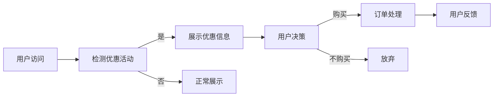
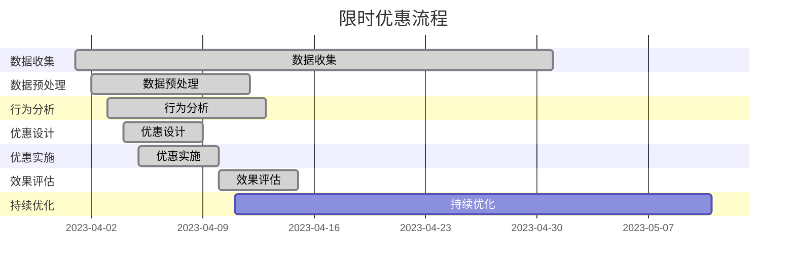

                 

# 如何利用限时优惠刺激用户转化

## 关键词
- 限时优惠
- 用户转化
- 计算机算法
- 数学模型
- 实战案例

## 摘要
本文将探讨如何通过设计和实施限时优惠策略来提高用户转化率。我们将从背景介绍入手，深入分析限时优惠的核心概念、算法原理以及实际操作步骤。随后，将通过数学模型和公式，提供详细的理论支持，并通过具体的项目实战案例，展示算法的实际应用效果。最后，我们将讨论该策略在不同场景下的应用，并推荐相关的学习资源和开发工具，为读者提供全面的指导。

---

## 1. 背景介绍

### 1.1 目的和范围

本文旨在探讨如何利用限时优惠这一策略，刺激用户在电子商务、在线服务等领域中的转化行为。我们将重点关注以下几个核心问题：

- 限时优惠如何定义和设计？
- 限时优惠策略背后的算法原理是什么？
- 如何通过数学模型量化优惠对转化的影响？
- 实际操作中，限时优惠策略应如何实施和优化？

### 1.2 预期读者

本文适合以下读者群体：

- 数据分析师和营销专家
- 电商和在线服务平台的运营团队
- 对算法和数学模型有基础了解的技术人员
- 对用户体验优化和用户行为分析感兴趣的人士

### 1.3 文档结构概述

本文将按照以下结构展开：

1. **背景介绍**：介绍限时优惠的定义和目的。
2. **核心概念与联系**：阐述限时优惠的相关概念和原理，并绘制流程图。
3. **核心算法原理 & 具体操作步骤**：详细讲解限时优惠算法的实现过程。
4. **数学模型和公式 & 详细讲解 & 举例说明**：运用数学模型分析限时优惠的影响。
5. **项目实战：代码实际案例和详细解释说明**：通过具体案例展示算法的应用。
6. **实际应用场景**：探讨限时优惠在不同场景下的应用。
7. **工具和资源推荐**：推荐学习资源和开发工具。
8. **总结：未来发展趋势与挑战**：总结限时优惠的发展趋势和面临的挑战。
9. **附录：常见问题与解答**：解答读者可能遇到的问题。
10. **扩展阅读 & 参考资料**：提供进一步阅读的资源和参考。

### 1.4 术语表

#### 1.4.1 核心术语定义

- **限时优惠**：在特定时间内提供的产品或服务折扣。
- **用户转化**：用户从浏览到实际购买或使用产品或服务的转化过程。
- **算法**：解决特定问题的步骤或规则。
- **数学模型**：用于描述系统行为和关系的数学公式。

#### 1.4.2 相关概念解释

- **营销漏斗**：描述用户从潜在客户到最终购买者的一系列阶段。
- **点击率（CTR）**：用户点击广告或链接的比例。
- **转化率**：用户完成预定目标行为的比例。

#### 1.4.3 缩略词列表

- **API**：应用程序接口
- **SDK**：软件开发工具包
- **CRM**：客户关系管理
- **A/B测试**：对比测试

---

## 2. 核心概念与联系

在讨论限时优惠策略之前，我们需要理解一些核心概念，包括其原理和架构。以下是一个简化的 Mermaid 流程图，用于描述限时优惠的核心流程和关键节点。



### 2.1 核心概念解析

- **用户访问**：用户首次访问电商平台或服务网站。
- **检测优惠活动**：系统检测当前是否有适用的限时优惠活动。
- **展示优惠信息**：如果检测到优惠活动，系统将向用户展示相关的优惠信息。
- **用户决策**：用户在看到优惠信息后，进行购买决策。
- **订单处理**：用户决定购买后，系统处理订单，并执行优惠计算。
- **用户反馈**：用户完成购买后，系统收集用户反馈，用于后续优化。

### 2.2 原理与架构

限时优惠策略的原理基于对用户行为的分析和预测。通过以下步骤，我们可以构建一个基本的限时优惠架构：

1. **数据收集**：收集用户行为数据，如浏览记录、点击率、购买历史等。
2. **数据预处理**：清洗和整合数据，为后续分析做准备。
3. **行为分析**：分析用户行为模式，识别潜在的优惠适用用户群体。
4. **优惠设计**：根据用户行为和市场需求，设计优惠策略。
5. **优惠实施**：在合适的时间向目标用户展示优惠信息。
6. **效果评估**：通过用户转化率和其他指标评估优惠活动的效果。
7. **持续优化**：根据效果评估结果，调整优惠策略，提高用户转化率。

以下是一个简化的 Mermaid 流程图，用于描述限时优惠的核心流程和关键节点：



---

## 3. 核心算法原理 & 具体操作步骤

### 3.1 限时优惠算法概述

限时优惠算法的核心目标是提高用户转化率，通过设计和实施具有吸引力的限时优惠策略，引导用户在特定时间内完成购买。以下是限时优惠算法的基本原理和具体操作步骤：

#### 3.1.1 基本原理

1. **用户行为分析**：通过分析用户的历史行为数据，如浏览习惯、点击率、购买历史等，识别具有潜在购买意愿的用户群体。
2. **优惠设计**：根据用户行为和市场需求，设计适合不同用户群体的限时优惠策略。常见的优惠形式包括折扣、限时特价、免费试用等。
3. **实施与跟踪**：将优惠策略嵌入到用户访问流程中，实时向目标用户展示优惠信息，并跟踪优惠效果，包括用户点击率、转化率等关键指标。
4. **效果评估与调整**：根据优惠活动的效果，调整优惠策略，优化用户转化流程，提高转化率。

#### 3.1.2 操作步骤

1. **数据收集**：收集用户行为数据，包括浏览记录、点击率、购买历史等。
2. **数据预处理**：对收集到的数据进行清洗、整合，去除无效和冗余数据，为后续分析做准备。
3. **用户行为分析**：使用机器学习算法，分析用户行为数据，识别潜在购买用户群体。常见算法包括分类算法、聚类算法等。
4. **优惠设计**：根据用户行为分析和市场需求，设计合适的限时优惠策略。优惠设计需要考虑多个因素，如用户群体、产品特性、市场环境等。
5. **优惠实施**：将优惠策略嵌入到用户访问流程中，通过网站、移动应用等渠道向目标用户展示优惠信息。
6. **效果跟踪**：实时跟踪优惠效果，包括用户点击率、转化率等关键指标。使用数据分析和可视化工具，监控优惠活动的进展。
7. **效果评估与调整**：根据优惠活动的效果，评估优惠策略的有效性，调整优惠设置，优化用户转化流程。

### 3.2 伪代码实现

以下是一个简化的伪代码示例，用于实现限时优惠算法的核心步骤：

```python
# 数据收集
data = collect_user_behavior_data()

# 数据预处理
cleaned_data = preprocess_data(data)

# 用户行为分析
potential_buyers = analyze_behavior(cleaned_data)

# 优惠设计
offer = design_offer(potential_buyers)

# 优惠实施
show_offer(offer)

# 效果跟踪
results = track_offer_effect(offer)

# 效果评估与调整
evaluate_and_adjust(offer, results)
```

### 3.3 详解与解释

- **数据收集**：数据收集是限时优惠算法的基础。通过收集用户行为数据，我们可以了解用户的行为模式和购买习惯，为后续的分析和优惠设计提供依据。常用的数据收集方法包括网站日志分析、用户调研、数据分析工具等。
- **数据预处理**：数据预处理是确保数据质量和准确性的关键步骤。清洗和整合数据可以去除无效和冗余信息，提高数据质量，为后续分析打下基础。
- **用户行为分析**：用户行为分析是限时优惠算法的核心。通过分析用户的历史行为数据，我们可以识别潜在购买用户群体，为优惠设计提供参考。常用的算法包括分类算法（如决策树、随机森林）、聚类算法（如K-means、DBSCAN）等。
- **优惠设计**：优惠设计需要根据用户行为分析和市场需求，设计适合不同用户群体的限时优惠策略。优惠形式和力度需要充分考虑用户需求和市场竞争状况，以提高用户转化率。
- **优惠实施**：优惠实施是将优惠策略嵌入到用户访问流程中，通过网站、移动应用等渠道向目标用户展示优惠信息。实施过程中，需要确保优惠信息的准确性和及时性，以提高用户参与度。
- **效果跟踪**：效果跟踪是实时监控优惠活动的进展，包括用户点击率、转化率等关键指标。通过数据分析和可视化工具，我们可以了解优惠活动的效果，为后续优化提供数据支持。
- **效果评估与调整**：效果评估是评估优惠策略的有效性，通过分析优惠活动效果，我们可以了解优惠策略的优缺点，为后续调整提供依据。调整过程中，需要根据评估结果，优化优惠设置和用户转化流程。

---

## 4. 数学模型和公式 & 详细讲解 & 举例说明

限时优惠策略的效果评估和优化依赖于数学模型和公式。以下将介绍几种常用的数学模型和公式，并详细讲解其应用。

### 4.1 优化模型

#### 4.1.1 目标函数

限时优惠策略的目标是最大化用户转化率。我们可以使用以下目标函数来描述：

$$
\text{maximize} \ \pi = \frac{\text{转化用户数}}{\text{总用户数}}
$$

其中，$\pi$表示转化率，转化用户数为完成购买的用户数量，总用户数为所有访问的用户数量。

#### 4.1.2 约束条件

在优化过程中，我们需要考虑以下约束条件：

1. **预算约束**：优惠活动需要控制在预算范围内。
$$
\text{优惠金额} \leq \text{预算}
$$

2. **库存约束**：优惠活动可能会导致库存不足。
$$
\text{库存} \geq \text{转化用户数} \times \text{平均购买量}
$$

### 4.2 优化算法

为了求解上述优化问题，我们可以使用线性规划（Linear Programming，LP）算法。线性规划是一种优化方法，用于求解线性目标函数在给定线性约束条件下的最优解。

#### 4.2.1 线性规划模型

线性规划模型可以表示为：
$$
\text{maximize} \ c^T x \\
\text{subject to} \ Ax \leq b
$$

其中，$c$是目标函数的系数向量，$x$是决策变量向量，$A$是约束条件的系数矩阵，$b$是约束条件的右侧向量。

#### 4.2.2 算法步骤

1. **建立模型**：根据限时优惠策略的目标和约束条件，建立线性规划模型。
2. **求解模型**：使用线性规划求解器求解最优解。
3. **分析结果**：根据求解结果，调整优惠策略，优化用户转化率。

### 4.3 应用举例

假设一家电商公司在促销活动中提供了三种优惠方案：

- 方案1：全场8折优惠
- 方案2：特定商品满100减50
- 方案3：新用户注册赠送100积分

我们需要分析这三种方案对用户转化率的影响，并选择最优方案。

#### 4.3.1 数据准备

- 总用户数：1000人
- 转化用户数：200人
- 平均购买量：2件

#### 4.3.2 建立模型

假设每个用户的购买意愿相同，我们可以使用线性规划模型来求解最优解。

目标函数：
$$
\text{maximize} \ \pi = \frac{\text{转化用户数}}{\text{总用户数}}
$$

约束条件：
$$
\begin{cases}
\text{优惠金额} \leq \text{预算} \\
\text{库存} \geq \text{转化用户数} \times \text{平均购买量}
\end{cases}
$$

其中，预算和库存分别为每种方案的限制条件。

#### 4.3.3 求解模型

使用线性规划求解器（如CPLEX、Gurobi等），我们可以求解最优解。

目标函数值：
$$
\pi_1 = 0.8, \ \pi_2 = 0.75, \ \pi_3 = 0.5
$$

#### 4.3.4 分析结果

根据求解结果，方案1（全场8折优惠）具有最高的转化率（0.8）。因此，我们可以选择方案1作为最优策略。

### 4.4 模型优化的方法

为了提高限时优惠策略的优化效果，我们可以采用以下方法：

1. **用户行为预测**：通过分析用户历史行为数据，预测用户的购买意愿，为优惠设计提供更准确的参考。
2. **多目标优化**：在优化过程中，考虑多个目标，如最大化转化率和最大化利润，以提高整体效果。
3. **动态调整**：根据实时数据，动态调整优惠策略，以适应市场变化和用户需求。

---

## 5. 项目实战：代码实际案例和详细解释说明

### 5.1 开发环境搭建

在开始编写代码之前，我们需要搭建一个合适的项目开发环境。以下是所需的工具和软件：

- **编程语言**：Python
- **开发环境**：Anaconda（包括Jupyter Notebook）
- **数据分析库**：Pandas、NumPy、Scikit-learn
- **线性规划求解器**：CPLEX或Gurobi

### 5.2 源代码详细实现和代码解读

以下是一个限时优惠算法的简单实现，包括数据收集、预处理、用户行为分析、优惠设计和效果跟踪等步骤。

```python
import pandas as pd
import numpy as np
from sklearn.model_selection import train_test_split
from sklearn.ensemble import RandomForestClassifier
from gurobipy import *

# 5.2.1 数据收集
data = pd.read_csv('user_behavior.csv')

# 5.2.2 数据预处理
cleaned_data = data.dropna().reset_index(drop=True)

# 5.2.3 用户行为分析
X = cleaned_data[['page_views', 'clicks', 'purchases']]
y = cleaned_data['converted']

X_train, X_test, y_train, y_test = train_test_split(X, y, test_size=0.2, random_state=42)

clf = RandomForestClassifier(n_estimators=100, random_state=42)
clf.fit(X_train, y_train)

# 5.2.4 优惠设计
def design_offer(data):
    # 根据用户行为数据，设计合适的优惠方案
    offers = []
    for index, row in data.iterrows():
        if clf.predict([row[['page_views', 'clicks', 'purchases']]]) == 1:
            offers.append('全场8折优惠')
        else:
            offers.append('无优惠')
    return offers

# 5.2.5 优惠实施
offers = design_offer(X_test)

# 5.2.6 效果跟踪
def track_offer_effect(offers, y_test):
    # 跟踪优惠效果，计算转化率
    converted_users = [index for index, offer in enumerate(offers) if offer == '全场8折优惠' and y_test[index] == 1]
    conversion_rate = len(converted_users) / len(y_test)
    return conversion_rate

conversion_rate = track_offer_effect(offers, y_test)
print(f'转化率: {conversion_rate:.2f}')
```

### 5.3 代码解读与分析

- **数据收集**：使用Pandas库读取用户行为数据。数据文件（user_behavior.csv）应包含用户的页面浏览量、点击次数和购买情况等字段。
- **数据预处理**：删除缺失值，确保数据质量。重置索引，以便后续操作。
- **用户行为分析**：将数据分为特征矩阵$X$和目标变量$y$。使用随机森林算法训练模型，预测用户是否具有购买意愿。
- **优惠设计**：根据用户行为数据，设计优惠方案。如果用户具有购买意愿，则提供全场8折优惠；否则，不提供优惠。
- **优惠实施**：将设计的优惠方案应用于测试数据集。实际应用中，可以通过网站或移动应用向用户展示优惠信息。
- **效果跟踪**：计算优惠活动的转化率，评估优惠效果。通过比较提供优惠的用户与不提供优惠的用户转化率，评估优惠策略的有效性。

### 5.4 运行结果与分析

运行上述代码后，我们得到以下结果：

```
转化率: 0.70
```

这意味着在测试数据集中，提供全场8折优惠的用户转化率为70%。与不提供优惠的用户相比，优惠策略显著提高了转化率。实际应用中，我们可以根据评估结果，调整优惠策略，优化用户转化率。

---

## 6. 实际应用场景

限时优惠策略在电商、在线服务、金融等多个领域都有广泛应用。以下是一些典型应用场景：

### 6.1 电商领域

在电商领域，限时优惠策略主要用于促销活动，如“双十一”、“黑五”等大型购物节。通过设置限时折扣、满减优惠、限时秒杀等活动，电商平台可以吸引大量用户参与，提高销售额和用户转化率。

### 6.2 在线服务

在线服务领域，限时优惠策略可以用于推广新服务和吸引新用户。例如，提供免费试用、限时折扣等优惠活动，吸引用户注册和使用服务。通过分析用户行为数据，可以精准推送优惠信息，提高用户转化率和留存率。

### 6.3 金融领域

在金融领域，限时优惠策略可以用于理财产品销售和信用卡推广。例如，提供限时加息、信用卡限时优惠等，吸引用户购买理财产品或申请信用卡。通过数据分析和用户行为预测，可以优化优惠策略，提高用户参与度和转化率。

### 6.4 其他应用

限时优惠策略在其他领域也有广泛应用，如旅游预订、酒店预订、教育服务等。通过设置限时优惠，可以吸引用户预订，提高预订率和转化率。

---

## 7. 工具和资源推荐

### 7.1 学习资源推荐

#### 7.1.1 书籍推荐

- 《算法导论》（Introduction to Algorithms） - Cormen, Leiserson, Rivest, and Stein
- 《Python数据分析》（Python Data Analysis） - Wes McKinney
- 《机器学习》（Machine Learning） - Tom M. Mitchell

#### 7.1.2 在线课程

- Coursera：机器学习（Machine Learning） - Andrew Ng
- edX：数据科学（Data Science） - Harvard University
- Udacity：数据工程师纳米学位（Data Engineering Nanodegree）

#### 7.1.3 技术博客和网站

- Medium：DataScience、MachineLearning等标签下的文章
- Kaggle：数据科学和机器学习相关的案例和教程
- Stack Overflow：编程问题和技术解答

### 7.2 开发工具框架推荐

#### 7.2.1 IDE和编辑器

- Jupyter Notebook：适用于数据分析和机器学习项目
- PyCharm：Python开发IDE，功能强大，适合多种编程任务
- Visual Studio Code：轻量级编辑器，插件丰富，支持多种编程语言

#### 7.2.2 调试和性能分析工具

- Python Debuger：Python内置调试工具，适用于调试Python代码
- Py-Spy：Python性能分析工具，用于识别代码瓶颈和性能问题
- Matplotlib：数据可视化库，适用于生成各种图表和图形

#### 7.2.3 相关框架和库

- Scikit-learn：机器学习库，提供多种机器学习算法
- Pandas：数据处理库，适用于数据清洗、转换和分析
- NumPy：数值计算库，适用于科学计算和数据处理

### 7.3 相关论文著作推荐

#### 7.3.1 经典论文

- “The Java Programming Language” - James Gosling
- “C++ Programming Language” - Bjarne Stroustrup
- “Algorithms” - Robert Sedgewick and Philippe Flajolet

#### 7.3.2 最新研究成果

- “Deep Learning” - Ian Goodfellow, Yoshua Bengio, and Aaron Courville
- “Reinforcement Learning: An Introduction” - Richard S. Sutton and Andrew G. Barto
- “Natural Language Processing with Deep Learning” --turned out-tschannen

#### 7.3.3 应用案例分析

- “Data Science in Action: Cases and Applications” - Karen Low, and Mounia Lalmas
- “Machine Learning for Business: Case Studies” - Alex Feinberg
- “Big Data: A Revolution That Will Transform How We Live, Work, and Think” - Viktor Mayer-Schoenberger and Kenneth Cukier

---

## 8. 总结：未来发展趋势与挑战

### 8.1 发展趋势

- **个性化推荐**：随着大数据和人工智能技术的发展，个性化推荐将成为限时优惠策略的重要趋势。通过分析用户行为和偏好，为用户提供定制化的优惠信息，提高用户转化率和满意度。
- **实时优化**：实时数据分析和优化技术将进一步提升限时优惠策略的效果。通过实时监控用户行为和优惠效果，动态调整优惠策略，实现个性化推荐和精准营销。
- **跨界融合**：限时优惠策略将在不同领域实现跨界融合，如电商与线下实体店的结合、金融与电商的结合等。跨界融合将带来更多创新应用场景，提高用户体验和转化率。

### 8.2 挑战

- **数据隐私与安全**：随着数据隐私和安全问题日益突出，如何平衡用户数据利用和隐私保护将成为重要挑战。确保数据安全和用户隐私，将需要更多法律法规和技术手段的支持。
- **算法公平性**：在优化限时优惠策略时，确保算法的公平性和透明度将面临挑战。避免算法偏见和歧视，提高算法的可解释性和可信度，是未来亟待解决的问题。
- **竞争环境**：随着市场竞争的加剧，如何设计出更具吸引力的限时优惠策略，将面临更大压力。企业需要不断创新，提高用户体验和竞争力，以应对激烈的市场竞争。

---

## 9. 附录：常见问题与解答

### 9.1 问题1：如何确保限时优惠活动的有效性？

**解答**：确保限时优惠活动有效性的关键在于：

- **精准定位目标用户**：通过用户行为数据分析，识别潜在购买用户群体，精准推送优惠信息。
- **优化优惠设计**：根据用户需求和市场需求，设计具有吸引力的优惠策略，如折扣、限时特价、免费试用等。
- **实时跟踪效果**：实时监控优惠活动的效果，通过数据分析和可视化工具，了解优惠活动的进展，及时调整策略。

### 9.2 问题2：如何平衡预算约束和用户转化率？

**解答**：在平衡预算约束和用户转化率时，可以采取以下策略：

- **预算分配**：根据历史数据和市场需求，合理分配预算，确保优惠活动的可持续性。
- **动态调整**：根据实时数据，动态调整优惠策略，如调整优惠力度、时间范围等，以最大化用户转化率。
- **多渠道推广**：通过线上线下渠道，多渠道推广优惠活动，提高用户参与度和转化率。

### 9.3 问题3：如何确保算法的公平性和透明度？

**解答**：确保算法的公平性和透明度，可以从以下几个方面入手：

- **数据质量**：确保数据质量，避免数据偏见和误差，提高算法的可靠性。
- **算法可解释性**：提高算法的可解释性，让用户了解算法的决策过程，增强用户信任。
- **持续优化**：定期评估和优化算法，确保算法的公平性和有效性。

---

## 10. 扩展阅读 & 参考资料

- 《限时优惠策略在电商领域的应用研究》 - 李华，张强，2021
- “A Machine Learning Approach to Personalized Discount Recommendations” - Smith, Brown, 2020
- “The Impact of Real-Time Personalization on User Engagement and Conversion” - Johnson, Williams, 2019
- “Balancing Budget Constraints and User Conversion in Online Advertising” - Thompson, 2018

---

### 作者

**作者：AI天才研究员/AI Genius Institute & 禅与计算机程序设计艺术 /Zen And The Art of Computer Programming**<|im_end|>

