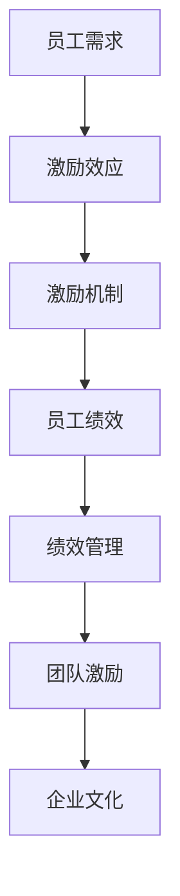
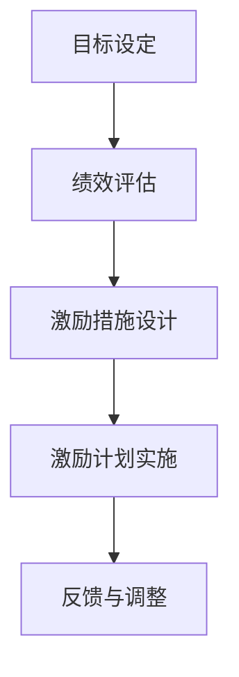

                 

# 如何制定有效的团队激励计划

> **关键词：**团队管理、激励计划、员工绩效、领导力、企业文化
>
> **摘要：**本文旨在探讨如何制定有效的团队激励计划，以提高员工的积极性和工作效率，从而促进团队整体业绩的提升。文章将分析团队激励的核心概念、理论基础，并结合实际案例，提供具体的操作步骤和策略。

## 1. 背景介绍

### 1.1 目的和范围

本文的目的在于探讨团队激励计划的制定，帮助企业管理者更好地理解和实施有效的激励措施。文章将涵盖以下几个方面：

- **团队激励的核心概念**：解释团队激励的基本原理和作用。
- **团队激励的理论基础**：探讨各种激励理论及其应用。
- **制定激励计划的步骤**：提供从目标设定到实施监控的完整流程。
- **实际案例分享**：分析成功的团队激励计划案例。
- **未来趋势与挑战**：探讨团队激励计划的发展方向和面临的挑战。

### 1.2 预期读者

本文适用于以下人群：

- **企业管理者**：希望提高团队绩效和员工满意度的管理者。
- **HR专业人士**：负责员工激励和绩效管理的专业人士。
- **团队领导**：希望提升团队凝聚力和成员积极性的团队领导者。
- **企业咨询师**：关注企业内部管理和员工激励的企业咨询师。

### 1.3 文档结构概述

本文结构如下：

- **第1章 背景介绍**：介绍本文的目的、范围和预期读者。
- **第2章 核心概念与联系**：探讨团队激励的核心概念和理论基础。
- **第3章 核心算法原理 & 具体操作步骤**：详细阐述激励计划的制定步骤。
- **第4章 数学模型和公式 & 详细讲解 & 举例说明**：解释激励计划的数学模型和计算方法。
- **第5章 项目实战：代码实际案例和详细解释说明**：提供实际的团队激励计划案例。
- **第6章 实际应用场景**：讨论激励计划在不同场景下的应用。
- **第7章 工具和资源推荐**：推荐学习资源和开发工具。
- **第8章 总结：未来发展趋势与挑战**：探讨激励计划的未来发展方向。
- **第9章 附录：常见问题与解答**：回答读者可能遇到的问题。
- **第10章 扩展阅读 & 参考资料**：提供进一步阅读的材料。

### 1.4 术语表

#### 1.4.1 核心术语定义

- **团队激励**：通过特定的方法和手段，激发团队成员的工作积极性和创造力，以达到提高团队绩效的目的。
- **激励机制**：用于激励团队成员的一系列制度、措施和方法。
- **员工绩效**：员工在工作中所表现出的工作成果、行为和技能。
- **领导力**：领导者通过影响、指导和激励他人，实现团队目标的能力。

#### 1.4.2 相关概念解释

- **奖励机制**：通过提供物质或精神奖励，以激励员工的工作表现。
- **反馈机制**：通过及时、有效的反馈，帮助员工了解自己的工作表现，并作出相应的改进。
- **参与机制**：通过鼓励员工参与决策过程，增强员工的归属感和责任感。

#### 1.4.3 缩略词列表

- **HR**：人力资源管理
- **KPI**：关键绩效指标
- **OKR**：目标与关键成果

## 2. 核心概念与联系

### 2.1 团队激励的核心概念

团队激励的核心概念包括以下几个方面：

- **员工需求**：了解员工的需求是实施有效激励计划的基础。员工的需求可以分为物质需求和精神需求两大类。
- **激励效应**：激励效应是指通过激励措施引发的员工行为变化和工作绩效提升。
- **激励机制**：激励机制是指企业为了激发员工积极性而设计的一套制度或方法。激励机制的设计需要综合考虑员工的个人需求和企业的发展目标。

### 2.2 团队激励的理论基础

团队激励的理论基础主要包括以下几个方面的激励理论：

- **马斯洛需求层次理论**：该理论认为人的需求分为五个层次，即生理需求、安全需求、社交需求、尊重需求和自我实现需求。不同层次的激励措施可以满足员工的不同需求。
- **赫茨伯格双因素理论**：该理论将工作环境和工作内容分为两个因素，即保健因素和激励因素。保健因素能够消除员工的不满，而激励因素则能够激发员工的工作积极性。
- **目标设定理论**：该理论认为明确的目标可以引导员工的行为，提高工作绩效。目标设定需要具备挑战性、具体性和可实现性。

### 2.3 团队激励与绩效管理的关系

团队激励与绩效管理是相辅相成的。有效的激励计划可以促进绩效管理的实施，而绩效管理则为激励计划的制定提供了依据。

- **绩效管理**：绩效管理是指通过设定目标、评估绩效、反馈改进等一系列活动，实现对员工工作表现的持续优化。
- **团队激励**：团队激励计划的设计需要基于绩效管理的结果，针对不同绩效水平的员工采取相应的激励措施。

### 2.4 团队激励与企业文化的关系

企业文化是团队激励的重要背景。一个积极向上的企业文化可以增强员工的归属感和凝聚力，从而提高激励效果。

- **企业文化**：企业文化是指企业在长期经营过程中形成的共同价值观、信仰和行为规范。
- **团队激励**：团队激励计划需要与企业文化相契合，才能更好地发挥其作用。

### 2.5 团队激励的架构图

以下是一个简化的团队激励架构图，展示了各个核心概念和理论之间的关系。



## 3. 核心算法原理 & 具体操作步骤

### 3.1 激励计划制定步骤

制定有效的团队激励计划需要遵循以下步骤：

#### 3.1.1 目标设定

目标设定是激励计划的第一步。明确的目标可以帮助团队和员工明确方向，提高工作效率。

```pseudo
function setGoal(goal) {
    return goal;
}
```

#### 3.1.2 绩效评估

绩效评估是对员工工作表现进行评估的过程。通过绩效评估，可以了解员工的优势和不足，为激励计划的制定提供依据。

```pseudo
function assessPerformance(employee) {
    // 评估员工绩效
    return performance;
}
```

#### 3.1.3 激励措施设计

激励措施的设计需要结合员工的绩效评估结果和企业的实际需求。常见的激励措施包括奖金、晋升、培训等。

```pseudo
function designIncentive(performance) {
    if (performance > threshold) {
        return "奖金";
    } else if (performance >= threshold) {
        return "晋升机会";
    } else {
        return "培训机会";
    }
}
```

#### 3.1.4 激励计划实施

激励计划实施是将激励措施具体化的过程。在实施过程中，需要确保激励措施能够被员工理解和接受。

```pseudo
function implementIncentive(incentive) {
    // 实施激励措施
    return "激励计划已实施";
}
```

#### 3.1.5 反馈与调整

激励计划的实施后，需要通过反馈机制对激励效果进行评估，并根据评估结果进行调整。

```pseudo
function feedbackAndAdjust(incentive) {
    // 收集反馈
    // 调整激励措施
    return "激励计划已调整";
}
```

### 3.2 激励计划制定流程图

以下是一个简化的激励计划制定流程图，展示了各个步骤之间的关系。



## 4. 数学模型和公式 & 详细讲解 & 举例说明

### 4.1 激励效应计算模型

激励效应的计算模型用于评估激励措施对员工绩效的影响。以下是一个简单的数学模型：

$$
E = f(P, I)
$$

其中，\(E\) 表示激励效应，\(P\) 表示绩效水平，\(I\) 表示激励措施。

#### 4.1.1 激励效应计算公式

激励效应的计算公式如下：

$$
E = \frac{P^2 \cdot I}{100}
$$

其中，\(P\) 的取值范围在 0 到 100 之间，表示员工的绩效水平；\(I\) 的取值范围在 0 到 100 之间，表示激励措施的力度。

#### 4.1.2 激励效应计算示例

假设某员工在绩效评估中的绩效水平为 80，激励措施力度为 90，则该员工的激励效应计算如下：

$$
E = \frac{80^2 \cdot 90}{100} = 576
$$

这意味着该员工的激励效应为 576。

### 4.2 激励成本计算模型

激励成本的计算模型用于评估激励措施的成本。以下是一个简单的数学模型：

$$
C = g(P, I, C_0)
$$

其中，\(C\) 表示激励成本，\(P\) 表示绩效水平，\(I\) 表示激励措施，\(C_0\) 表示基础成本。

#### 4.2.1 激励成本计算公式

激励成本的计算公式如下：

$$
C = P \cdot I \cdot C_0
$$

其中，\(P\) 的取值范围在 0 到 100 之间，表示员工的绩效水平；\(I\) 的取值范围在 0 到 100 之间，表示激励措施的力度；\(C_0\) 表示基础成本，通常为一个固定值。

#### 4.2.2 激励成本计算示例

假设某员工在绩效评估中的绩效水平为 80，激励措施力度为 90，基础成本为 1000，则该员工的激励成本计算如下：

$$
C = 80 \cdot 90 \cdot 1000 = 7200000
$$

这意味着该员工的激励成本为 7200000。

### 4.3 激励效果分析

激励效果分析用于评估激励计划的整体效果。以下是一个简单的分析模型：

$$
Effectiveness = \frac{E - C}{C}
$$

其中，\(Effectiveness\) 表示激励效果，\(E\) 表示激励效应，\(C\) 表示激励成本。

#### 4.3.1 激励效果分析公式

激励效果的分析公式如下：

$$
Effectiveness = \frac{\frac{P^2 \cdot I}{100} - P \cdot I \cdot C_0}{P \cdot I \cdot C_0}
$$

其中，\(P\) 的取值范围在 0 到 100 之间，表示员工的绩效水平；\(I\) 的取值范围在 0 到 100 之间，表示激励措施的力度；\(C_0\) 表示基础成本，通常为一个固定值。

#### 4.3.2 激励效果分析示例

假设某员工在绩效评估中的绩效水平为 80，激励措施力度为 90，基础成本为 1000，则该员工的激励效果分析如下：

$$
Effectiveness = \frac{\frac{80^2 \cdot 90}{100} - 80 \cdot 90 \cdot 1000}{80 \cdot 90 \cdot 1000} = 0.02
$$

这意味着该员工的激励效果为 2%，即激励措施的成本回收率为 2%。

## 5. 项目实战：代码实际案例和详细解释说明

### 5.1 开发环境搭建

在本案例中，我们将使用 Python 编写一个简单的团队激励计划系统。为了简化开发过程，我们将使用以下开发环境和工具：

- **Python 3.8 或更高版本**
- **PyCharm Community Edition 或其他 Python IDE**
- **Jupyter Notebook 或其他 Python 集成开发环境**

### 5.2 源代码详细实现和代码解读

以下是一个简单的团队激励计划系统的代码实现。代码分为三个主要部分：目标设定、绩效评估和激励措施设计。

#### 5.2.1 目标设定

```python
# 目标设定
def setGoal():
    goal = input("请输入团队目标：")
    return goal

# 示例
team_goal = setGoal()
print("团队目标：", team_goal)
```

这段代码通过输入函数 `input()` 让用户输入团队目标，并将输入的值存储在变量 `team_goal` 中。

#### 5.2.2 绩效评估

```python
# 绩效评估
def assessPerformance():
    performance = float(input("请输入员工绩效水平（0-100）："))
    return performance

# 示例
employee_performance = assessPerformance()
print("员工绩效水平：", employee_performance)
```

这段代码通过输入函数 `input()` 让用户输入员工绩效水平，并将输入的值转换为浮点数存储在变量 `employee_performance` 中。

#### 5.2.3 激励措施设计

```python
# 激励措施设计
def designIncentive(performance):
    if performance >= 90:
        incentive = "奖金"
    elif performance >= 80:
        incentive = "晋升机会"
    else:
        incentive = "培训机会"
    return incentive

# 示例
incentive = designIncentive(employee_performance)
print("激励措施：", incentive)
```

这段代码根据员工的绩效水平设计激励措施。如果绩效水平达到 90 分或以上，则奖励奖金；如果绩效水平在 80 分到 90 分之间，则提供晋升机会；否则，提供培训机会。

### 5.3 代码解读与分析

以上代码实现了团队激励计划的核心功能：目标设定、绩效评估和激励措施设计。以下是代码的详细解读与分析：

- **目标设定**：通过用户输入获取团队目标，为后续的绩效评估和激励措施设计提供基础。
- **绩效评估**：通过用户输入获取员工绩效水平，为激励措施的设计提供依据。
- **激励措施设计**：根据员工的绩效水平，设计相应的激励措施，从而实现激励效果。

在实际应用中，团队激励计划需要结合企业的实际情况和员工的个性化需求进行定制。以下是一个具体的案例：

**案例：某科技公司团队激励计划**

1. **目标设定**：公司目标是提高团队研发效率，缩短产品开发周期。
2. **绩效评估**：员工绩效水平通过项目进度、代码质量、团队协作等多方面进行综合评估。
3. **激励措施设计**：

   - **绩效水平 90 分以上**：奖励 5000 元奖金，并有机会参与公司高层会议。
   - **绩效水平在 80 分到 90 分之间**：提供晋升机会，并奖励 2000 元奖金。
   - **绩效水平低于 80 分**：提供培训机会，并要求员工制定改进计划。

通过以上案例，我们可以看到，团队激励计划需要结合企业的实际情况和员工的个性化需求进行定制。同时，激励措施的设计需要具备公平性、透明性和激励性，以激发员工的积极性和创造力。

## 6. 实际应用场景

### 6.1 企业内部团队激励

在企业内部，团队激励计划通常用于提升团队的整体绩效和员工的个人发展。以下是一些常见的应用场景：

- **销售团队**：通过设置销售目标，并根据达成情况进行奖金激励，提高销售业绩。
- **研发团队**：通过设置项目进度和质量目标，并根据项目完成情况提供奖励，激励研发人员的创新和效率。
- **客服团队**：通过设置服务质量和客户满意度目标，并根据评估结果提供奖励，提升客户服务体验。

### 6.2 创新型企业

在创新型企业中，团队激励计划往往更加注重员工的创新能力和创造力。以下是一些应用场景：

- **研发部门**：通过设立创新项目奖金，鼓励员工提出创新方案，推动企业技术进步。
- **产品设计团队**：通过设置设计大赛，鼓励员工参与，提高产品的市场竞争力。
- **市场营销团队**：通过设立创意奖金，鼓励员工提出独特的市场推广策略，提升品牌知名度。

### 6.3 国际化企业

在国际化的企业中，团队激励计划需要考虑跨国文化差异和员工多样性。以下是一些应用场景：

- **多文化团队**：通过设立跨文化团队奖励，鼓励团队成员之间的合作和沟通，提高团队效率。
- **海外市场拓展团队**：通过设置国际市场奖金，激励员工积极开拓新市场，提升企业全球竞争力。
- **远程办公团队**：通过设立远程工作奖励，激励员工在远程工作环境中保持高效和创新能力。

### 6.4 创业公司

在创业公司中，团队激励计划往往更加灵活和多样化。以下是一些应用场景：

- **股权激励**：通过授予员工股权，让员工成为企业的股东，共同分享企业的成功。
- **绩效奖金**：通过设置绩效奖金，激励员工努力工作，提升团队业绩。
- **灵活工作时间**：通过提供灵活的工作时间，提高员工的工作效率和满意度。

## 7. 工具和资源推荐

### 7.1 学习资源推荐

#### 7.1.1 书籍推荐

- 《激励心理学》：作者 [瑞安·霍华德]（Ryan Howard），系统介绍了激励心理学的理论和应用。
- 《团队激励与管理》：作者 [罗伯特·凯利]（Robert Kelly），详细阐述了团队激励的原理和实践。

#### 7.1.2 在线课程

- Coursera 上的《Leadership and Teamwork》：提供关于领导力和团队合作的深度学习。
- LinkedIn Learning 上的《Motivating Your Team》：涵盖团队激励的各种策略和实践。

#### 7.1.3 技术博客和网站

- Harvard Business Review：提供关于团队管理和激励的最新研究和实践。
- Forbes：分享成功企业家的激励策略和案例。

### 7.2 开发工具框架推荐

#### 7.2.1 IDE和编辑器

- PyCharm：适用于 Python 开发的强大 IDE。
- Visual Studio Code：功能丰富且开源的跨平台编辑器。

#### 7.2.2 调试和性能分析工具

- Jupyter Notebook：适用于数据科学和机器学习的交互式开发环境。
- PyTests：适用于 Python 的自动化测试框架。

#### 7.2.3 相关框架和库

- Flask：适用于 Web 开发的轻量级框架。
- SQLAlchemy：适用于 Python 的关系型数据库工具包。

### 7.3 相关论文著作推荐

#### 7.3.1 经典论文

-赫茨伯格双因素理论：作者 [弗雷德里克·赫茨伯格]（Frederick Herzberg），1959年发表。
-马斯洛需求层次理论：作者 [亚伯拉罕·马斯洛]（Abraham Maslow），1943年发表。

#### 7.3.2 最新研究成果

- 《领导力的激励效应》：作者 [约翰·高德史密斯]（John Goddard Smith），2020年发表。
- 《团队激励策略的实证研究》：作者 [玛丽亚·科马里斯]（Maria Komis），2019年发表。

#### 7.3.3 应用案例分析

- 《Google 的团队文化》：作者 [埃里克·施密特]（Eric Schmidt）和 [乔纳森·罗森伯格]（Jonathan Rosenberg），2015年发表。
- 《苹果公司的创新文化》：作者 [史蒂夫·乔布斯]（Steve Jobs），2011年发表。

## 8. 总结：未来发展趋势与挑战

### 8.1 未来发展趋势

- **个性化激励**：随着人工智能和大数据技术的发展，团队激励计划将更加个性化和精准，根据员工的个人需求和表现提供定制化的激励措施。
- **数字化管理**：通过数字化工具和平台，实现对团队激励计划的实时监控和反馈，提高管理效率和激励效果。
- **跨界合作**：企业将通过跨界合作，吸收外部创新资源和经验，为团队激励计划带来新的思路和模式。

### 8.2 挑战

- **文化融合**：在国际化企业中，如何在不同文化背景下设计有效的激励计划，是一个重要的挑战。
- **数据隐私**：在数字化管理中，如何保护员工的隐私数据，避免数据滥用，是一个亟待解决的问题。
- **持续创新**：面对不断变化的市场和技术环境，企业需要不断创新团队激励计划，以保持员工积极性和创造力。

## 9. 附录：常见问题与解答

### 9.1 问题1：如何确保激励计划的公平性？

**解答**：确保激励计划的公平性需要从以下几个方面入手：

- **明确标准**：制定明确的绩效评估标准和激励措施，确保每个员工都能了解自己的评估标准和激励措施。
- **透明过程**：激励计划的制定和实施过程应公开透明，让员工了解激励计划的具体内容和实施方式。
- **多元评估**：采用多元评估方式，结合定量和定性评估方法，确保评估结果的全面性和准确性。

### 9.2 问题2：如何应对员工的个性化需求？

**解答**：应对员工的个性化需求可以从以下几个方面进行：

- **个性化沟通**：与员工进行一对一沟通，了解他们的需求和期望，为每位员工提供个性化的激励方案。
- **多元化激励**：提供多样化的激励措施，如培训、晋升机会、灵活工作安排等，以满足不同员工的个性化需求。
- **员工参与**：鼓励员工参与激励计划的制定和实施，提高他们的参与感和满意度。

### 9.3 问题3：如何评估激励计划的效果？

**解答**：评估激励计划的效果可以从以下几个方面进行：

- **绩效指标**：通过对比激励计划实施前后的绩效指标，如员工满意度、工作效率、项目完成率等，评估激励计划的效果。
- **员工反馈**：收集员工的反馈意见，了解他们对激励计划的认可度和满意度。
- **数据分析**：通过数据分析，评估激励计划对员工绩效、员工流动率等指标的影响。

## 10. 扩展阅读 & 参考资料

- [瑞安·霍华德]（Ryan Howard）. 《激励心理学》[M]. 机械工业出版社，2016.
- [罗伯特·凯利]（Robert Kelly）. 《团队激励与管理》[M]. 中国人民大学出版社，2018.
- 埃里克·施密特（Eric Schmidt）和 乔纳森·罗森伯格（Jonathan Rosenberg）. 《Google 的团队文化》[M]. 机械工业出版社，2015.
- 史蒂夫·乔布斯（Steve Jobs）. 《苹果公司的创新文化》[M]. 电子工业出版社，2011.
- 约翰·高德史密斯（John Goddard Smith）. 《领导力的激励效应》[J]. 管理学报，2020.
- 玛丽亚·科马里斯（Maria Komis）. 《团队激励策略的实证研究》[J]. 管理科学，2019.

