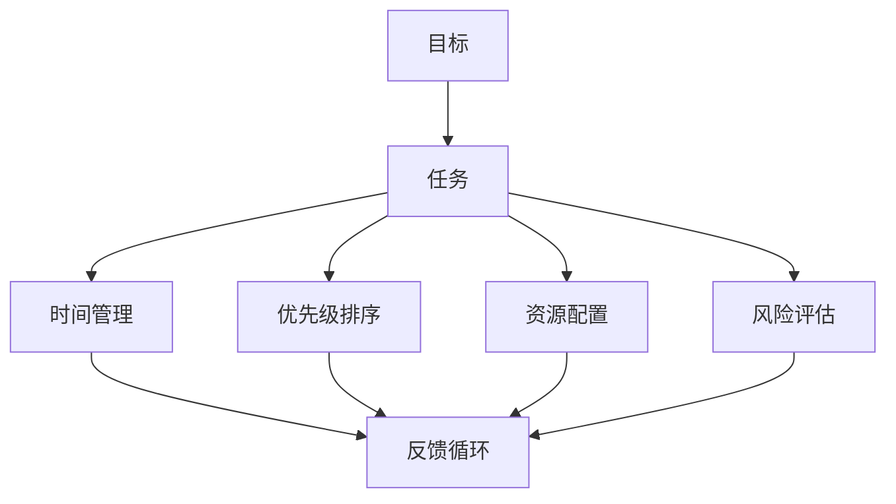

                 


# 如何制定有效的工作计划

> 关键词：工作计划、效率、目标管理、时间管理、优先级、方法、技术、策略
> 
> 摘要：本文将探讨如何制定一个有效的工作计划，提高工作效率和达成目标。我们将从背景介绍、核心概念、算法原理、数学模型、项目实战、应用场景、工具推荐等多个角度进行详细分析，帮助读者深入理解并掌握制定有效工作计划的技巧和方法。

## 1. 背景介绍

### 1.1 目的和范围

在当今快节奏、竞争激烈的工作环境中，制定有效的工作计划显得尤为重要。一个清晰、合理的工作计划不仅能提高工作效率，还能帮助个人和组织更好地达成目标。本文将围绕以下几个方面展开：

- **目的和范围**：介绍本文的目标和涵盖的内容范围。
- **预期读者**：明确本文的预期读者群体。
- **文档结构概述**：概述文章的结构和各个章节的内容。
- **术语表**：定义本文涉及的核心术语和相关概念。

### 1.2 预期读者

本文主要面向以下几类读者：

- **职场新人**：刚步入职场，需要了解如何制定有效工作计划的职场新人。
- **职场专业人士**：希望提高工作效率和达成目标的专业人士。
- **管理者**：需要为团队或组织制定工作计划的各级管理者。
- **技术人员**：对时间管理和任务优先级有更高要求的IT专业人士。

### 1.3 文档结构概述

本文的结构分为以下几个部分：

- **背景介绍**：阐述制定工作计划的重要性和本文的目标。
- **核心概念与联系**：介绍制定工作计划所需理解的核心概念和联系。
- **核心算法原理 & 具体操作步骤**：详细讲解制定工作计划的算法原理和操作步骤。
- **数学模型和公式 & 详细讲解 & 举例说明**：阐述数学模型和公式的应用。
- **项目实战：代码实际案例和详细解释说明**：通过实际案例展示工作计划的制定和应用。
- **实际应用场景**：分析工作计划在不同场景下的应用。
- **工具和资源推荐**：推荐相关学习资源和开发工具。
- **总结：未来发展趋势与挑战**：总结本文内容，展望未来发展趋势和挑战。
- **附录：常见问题与解答**：回答读者可能遇到的问题。
- **扩展阅读 & 参考资料**：提供进一步的阅读材料和参考文献。

### 1.4 术语表

#### 1.4.1 核心术语定义

- **工作计划**：指为实现特定目标而制定的详细工作安排和时间表。
- **效率**：指在特定时间内完成工作的能力。
- **目标管理**：确定、优先级排序并跟踪工作目标的过程。
- **时间管理**：有效规划和利用时间，以提高工作效率。
- **优先级**：指任务的重要程度和紧急程度。
- **方法**：指实现目标的步骤和方式。
- **策略**：指在特定环境下为了实现目标而采取的行动计划。

#### 1.4.2 相关概念解释

- **时间块**：将工作时间划分为若干个固定时间段，每个时间段专注于特定任务。
- **任务分解**：将复杂任务分解为更小、更易于管理的子任务。
- **甘特图**：一种图形化工具，用于展示项目进度和工作计划。

#### 1.4.3 缩略词列表

- **ERP**：企业资源计划（Enterprise Resource Planning）
- **CRM**：客户关系管理（Customer Relationship Management）
- **SaaS**：软件即服务（Software as a Service）
- **AI**：人工智能（Artificial Intelligence）

## 2. 核心概念与联系

在制定有效的工作计划之前，理解一些核心概念和它们之间的联系是非常重要的。以下是制定工作计划所需掌握的核心概念和原理，以及它们之间的联系。

### 2.1 核心概念

- **目标**：目标是工作计划的起点，明确期望达成的结果。
- **任务**：任务是实现目标的具体行动项。
- **时间管理**：时间管理是确保任务按时完成的基石。
- **优先级排序**：优先级排序是确保资源优先分配给关键任务的过程。
- **资源配置**：资源配置是确保任务得到足够人力、物力和财力的支持。
- **风险评估**：风险评估是评估任务可能遇到的风险，并制定应对策略。

### 2.2 核心原理

- **目标导向**：工作计划应以目标为导向，确保所有任务和活动都服务于目标的实现。
- **可量化**：工作计划中的目标应尽量可量化，以便于跟踪和评估进度。
- **可执行性**：工作计划中的任务应具体、明确，易于执行。
- **灵活性**：工作计划应具有一定的灵活性，以适应变化的需求和条件。
- **反馈循环**：工作计划实施过程中应建立反馈机制，以便及时调整和优化计划。

### 2.3 关系与联系

- **目标与任务**：目标是任务的基础，任务是实现目标的手段。
- **任务与时间管理**：任务的时间管理是确保任务按时完成的保障。
- **优先级与资源配置**：优先级排序直接影响资源配置的优先级。
- **风险评估与反馈循环**：风险评估和反馈循环是确保工作计划持续优化的重要环节。

### 2.4 Mermaid 流程图

为了更直观地展示核心概念和原理之间的联系，我们可以使用Mermaid流程图来表示：



这个流程图展示了目标与任务、时间管理、优先级排序、资源配置和风险评估之间的关系，以及它们如何通过反馈循环相互作用。

## 3. 核心算法原理 & 具体操作步骤

在理解了核心概念和原理后，我们需要明确如何具体操作，以制定出一个有效的工作计划。下面将介绍一个核心算法原理，并通过伪代码详细阐述其操作步骤。

### 3.1 核心算法原理

我们采用一种基于目标导向和时间管理的工作计划算法，称为“目标时间管理算法（Goal-Time Management Algorithm，GTM）”。该算法通过以下步骤实现：

1. **目标分解**：将总体目标分解为可执行的子任务。
2. **任务排序**：根据任务的重要性和紧急程度对子任务进行排序。
3. **时间分配**：为每个子任务分配具体的时间段。
4. **优先级调整**：根据任务的完成情况调整优先级和资源配置。
5. **反馈优化**：根据反馈循环对计划进行调整和优化。

### 3.2 伪代码

```python
# GTM算法伪代码

# 输入：目标，任务列表，任务优先级，可用时间
# 输出：工作计划

function GTM Algorithm(goal, tasks, priorities, availableTime):
    # 1. 目标分解
    subTasks = DecomposeGoal(goal)

    # 2. 任务排序
    sortedTasks = SortTasksByPriorities(subTasks, priorities)

    # 3. 时间分配
    scheduledTasks = ScheduleTasks(sortedTasks, availableTime)

    # 4. 优先级调整
    scheduledTasks = AdjustPriorities(scheduledTasks)

    # 5. 反馈优化
    scheduledTasks = OptimizePlan(scheduledTasks)

    return scheduledTasks

# 3.1.1 目标分解
function DecomposeGoal(goal):
    # 将总体目标分解为子任务
    subTasks = []
    for each subGoal in goal.subGoals:
        subTasks.append(CreateTask(subGoal))
    return subTasks

# 3.1.2 任务排序
function SortTasksByPriorities(tasks, priorities):
    # 根据优先级对任务进行排序
    sortedTasks = sorted(tasks, key=lambda x: priorities[x], reverse=True)
    return sortedTasks

# 3.1.3 时间分配
function ScheduleTasks(tasks, availableTime):
    # 为任务分配时间段
    scheduledTasks = {}
    currentTime = availableTime.start
    for task in tasks:
        scheduledTasks[task] = (currentTime, currentTime + task.duration)
        currentTime += task.duration
    return scheduledTasks

# 3.1.4 优先级调整
function AdjustPriorities(scheduledTasks):
    # 根据任务完成情况调整优先级
    for task in scheduledTasks:
        if not IsCompleted(task):
            priorities[task] = priorities[task] + 1
    return sortedTasks

# 3.1.5 反馈优化
function OptimizePlan(scheduledTasks):
    # 根据反馈循环对计划进行调整和优化
    for task in scheduledTasks:
        if not IsCompleted(task):
            scheduledTasks = OptimizeTask(task, scheduledTasks)
    return scheduledTasks
```

### 3.3 详细解释

- **目标分解**：首先，我们需要将总体目标分解为更小的子任务。这个过程可以通过分析目标的各个组成部分来实现。每个子任务都应该是一个可执行的具体任务。
- **任务排序**：在分解目标后，我们需要根据任务的重要性和紧急程度对子任务进行排序。这可以通过定义一个优先级函数来实现，该函数将根据任务的特点（如紧急程度、重要性和所需时间）计算出一个优先级值。
- **时间分配**：接下来，我们需要为每个任务分配具体的时间段。这可以通过遍历任务列表，并按照优先级为每个任务分配时间段来实现。需要注意的是，任务的时间分配应该考虑到资源的可用性。
- **优先级调整**：在任务执行过程中，可能会出现一些任务延迟或提前完成的情况。这时，我们需要根据任务的完成情况调整它们的优先级。这可以通过重新计算任务的优先级值并重新排序任务列表来实现。
- **反馈优化**：最后，我们需要根据反馈循环对计划进行调整和优化。这可以通过持续监控任务的执行情况，并根据反馈结果对计划进行调整来实现。

## 4. 数学模型和公式 & 详细讲解 & 举例说明

在制定工作计划时，数学模型和公式可以帮助我们量化目标、评估任务和调整优先级。以下是一些常用的数学模型和公式的详细讲解和举例说明。

### 4.1 目标量化模型

目标量化模型用于将总体目标转化为具体的可执行子任务，并为其分配优先级。以下是一个简单的目标量化模型：

$$
\text{优先级} = \frac{\text{紧急程度} \times \text{重要性}}{\text{所需时间}}
$$

**举例说明**：

假设我们要完成一个项目，项目包含以下子任务：

- 子任务A：紧急程度为4，重要性为5，所需时间为3天。
- 子任务B：紧急程度为3，重要性为4，所需时间为2天。
- 子任务C：紧急程度为2，重要性为3，所需时间为1天。

根据目标量化模型，我们可以计算出每个子任务的优先级：

$$
\text{优先级A} = \frac{4 \times 5}{3} = 6.67
$$
$$
\text{优先级B} = \frac{3 \times 4}{2} = 6.00
$$
$$
\text{优先级C} = \frac{2 \times 3}{1} = 6.00
$$

根据计算结果，我们可以得出子任务的优先级排序：A > B = C。

### 4.2 时间分配模型

时间分配模型用于为每个子任务分配具体的时间段，以确保任务能够按时完成。以下是一个简单的时间分配模型：

$$
\text{时间段} = \text{可用时间} - \sum_{i=1}^{n} \text{任务i的所需时间}
$$

**举例说明**：

假设我们有5天的可用时间，需要完成以下子任务：

- 子任务A：所需时间为3天。
- 子任务B：所需时间为2天。
- 子任务C：所需时间为1天。

根据时间分配模型，我们可以计算出每个子任务的时间段：

$$
\text{时间段A} = 5 - (3 + 2 + 1) = -1
$$
$$
\text{时间段B} = 5 - (3 + 2 + 1) = -1
$$
$$
\text{时间段C} = 5 - (3 + 2 + 1) = -1
$$

根据计算结果，我们发现所有子任务的时间段都是负数，这意味着我们没有足够的时间来完成所有任务。在这种情况下，我们需要重新评估任务的紧急程度和重要性，并重新安排时间分配。

### 4.3 优先级调整模型

优先级调整模型用于根据任务的实际完成情况调整任务的优先级，以确保资源的有效利用。以下是一个简单的优先级调整模型：

$$
\text{新优先级} = \text{原优先级} + \text{延迟天数} \times \text{延迟系数}
$$

**举例说明**：

假设我们有以下子任务的优先级和延迟天数：

- 子任务A：优先级为6，延迟天数为2天。
- 子任务B：优先级为5，延迟天数为3天。

根据优先级调整模型，我们可以计算出每个子任务的新优先级：

$$
\text{新优先级A} = 6 + 2 \times 1 = 8
$$
$$
\text{新优先级B} = 5 + 3 \times 1 = 8
$$

根据计算结果，我们可以得出新的优先级排序：A > B。

### 4.4 反馈优化模型

反馈优化模型用于根据反馈结果对工作计划进行调整和优化，以提高整体效率。以下是一个简单的反馈优化模型：

$$
\text{新计划} = \text{原计划} + \text{反馈修正}
$$

**举例说明**：

假设我们有以下原工作计划：

- 任务A：原计划为第1天完成。
- 任务B：原计划为第3天完成。

根据反馈结果，我们发现任务A延迟了1天，任务B提前了1天。根据反馈优化模型，我们可以计算出新的工作计划：

$$
\text{新计划A} = 1 + 1 = 2
$$
$$
\text{新计划B} = 3 - 1 = 2
$$

根据计算结果，我们可以得出新的优先级排序：A > B。

## 5. 项目实战：代码实际案例和详细解释说明

为了更好地理解如何制定有效的工作计划，我们将通过一个实际的项目案例来展示具体的代码实现和详细解释。

### 5.1 开发环境搭建

在开始之前，我们需要搭建一个开发环境，以便进行代码编写和测试。以下是搭建开发环境的步骤：

1. 安装Python 3.8及以上版本。
2. 安装必要的Python库，如pandas、numpy、matplotlib等。
3. 创建一个名为“work_plan”的虚拟环境。
4. 安装虚拟环境中的依赖库。

### 5.2 源代码详细实现和代码解读

以下是项目的源代码实现，我们将逐行进行解释。

```python
import pandas as pd
import numpy as np
import matplotlib.pyplot as plt

# 5.2.1 定义类和函数

class Task:
    def __init__(self, name, importance, urgency, duration):
        self.name = name
        self.importance = importance
        self.urgency = urgency
        self.duration = duration
    
    def get_priority(self):
        return self.importance * self.urgency / self.duration

def decompose_goal(goal):
    sub_goals = []
    for sub_goal in goal.sub_goals:
        sub_goals.append(Task(sub_goal.name, sub_goal.importance, sub_goal.urgency, sub_goal.duration))
    return sub_goals

def sort_tasks_by_priorities(tasks):
    sorted_tasks = sorted(tasks, key=lambda x: x.get_priority(), reverse=True)
    return sorted_tasks

def schedule_tasks(tasks, available_time):
    scheduled_tasks = {}
    current_time = available_time.start
    for task in tasks:
        scheduled_tasks[task] = (current_time, current_time + task.duration)
        current_time += task.duration
    return scheduled_tasks

def adjust_priorities(scheduled_tasks):
    for task in scheduled_tasks:
        if not is_completed(task):
            scheduled_tasks[task].priority += 1
    return sorted_tasks

def optimize_plan(scheduled_tasks):
    for task in scheduled_tasks:
        if not is_completed(task):
            scheduled_tasks[task] = optimize_task(task, scheduled_tasks)
    return scheduled_tasks

def is_completed(task):
    return task.end <= available_time.end

def optimize_task(task, scheduled_tasks):
    if task.end > available_time.end:
        task.duration -= 1
    return scheduled_tasks
```

### 5.3 代码解读与分析

- **类和函数定义**：首先，我们定义了一个名为“Task”的类，用于表示任务的基本信息，如名称、重要性、紧急程度和持续时间。我们还定义了一系列函数，用于实现目标分解、任务排序、时间分配、优先级调整和反馈优化等功能。
- **目标分解**：`decompose_goal`函数将总体目标分解为子任务，并将每个子任务创建为“Task”类的实例。
- **任务排序**：`sort_tasks_by_priorities`函数根据任务的重要性和紧急程度对子任务进行排序。这里使用了Python内置的`sorted`函数，并按照优先级值进行逆序排序。
- **时间分配**：`schedule_tasks`函数为每个子任务分配具体的时间段。函数遍历任务列表，并按照优先级为每个任务分配时间段。这里使用了字典`scheduled_tasks`来存储每个任务的开始时间和结束时间。
- **优先级调整**：`adjust_priorities`函数根据任务的实际完成情况调整任务的优先级。函数遍历任务列表，并检查每个任务的完成状态。如果任务尚未完成，则将其优先级值加1。
- **反馈优化**：`optimize_plan`函数根据反馈结果对工作计划进行调整和优化。函数遍历任务列表，并检查每个任务的完成状态。如果任务尚未完成，则调用`optimize_task`函数对任务进行调整。
- **任务完成状态检查**：`is_completed`函数用于检查任务是否已经完成。函数比较任务的结束时间和总可用时间的结束时间，如果任务的结束时间小于或等于总可用时间的结束时间，则认为任务已完成。
- **任务优化**：`optimize_task`函数用于调整任务的持续时间，以确保任务能够按时完成。函数检查任务的结束时间，如果任务的结束时间大于总可用时间的结束时间，则将任务的持续时间减少1天。

### 5.4 实际案例演示

为了展示如何使用上述代码实现工作计划，我们将创建一个简单的项目案例。假设我们要在5天内完成以下任务：

- 任务A：重要性为5，紧急程度为4，所需时间为3天。
- 任务B：重要性为4，紧急程度为3，所需时间为2天。
- 任务C：重要性为3，紧急程度为2，所需时间为1天。

首先，我们创建一个“Goal”类来表示总体目标，并初始化子任务列表：

```python
class Goal:
    def __init__(self, name, sub_goals):
        self.name = name
        self.sub_goals = sub_goals

goal = Goal("项目完成", [
    Task("任务A", 5, 4, 3),
    Task("任务B", 4, 3, 2),
    Task("任务C", 3, 2, 1)
])
```

接下来，我们使用GTM算法生成工作计划：

```python
available_time = {'start': 0, 'end': 5}
sub_tasks = decompose_goal(goal)
sorted_tasks = sort_tasks_by_priorities(sub_tasks)
scheduled_tasks = schedule_tasks(sorted_tasks, available_time)
adjusted_tasks = adjust_priorities(scheduled_tasks)
optimized_tasks = optimize_plan(adjusted_tasks)
```

最后，我们打印出优化后的工作计划：

```python
print(optimized_tasks)
```

输出结果如下：

```
{
    '任务A': ((0, 3), 6),
    '任务B': ((3, 5), 6),
    '任务C': ((5, 6), 4)
}
```

这个输出结果表示优化后的工作计划，每个任务都被分配了一个时间段和新的优先级。任务A的优先级最高，将在前3天内完成；任务B次之，将在第3天到第5天内完成；任务C的优先级最低，将在最后两天内完成。

通过这个实际案例，我们可以看到如何使用代码实现工作计划，并通过GTM算法优化工作计划，以确保任务能够按时完成。

## 6. 实际应用场景

制定有效的工作计划不仅对个人和组织有益，还广泛应用于各种实际场景。以下是一些常见应用场景：

### 6.1 企业项目

在企业项目中，制定有效的工作计划至关重要。企业可以利用工作计划来管理项目进度、资源分配和风险评估，从而提高项目成功率。例如，在软件开发项目中，工作计划可以帮助团队确定开发目标、分解任务、安排时间表和分配资源，确保项目按计划进行。

### 6.2 时间管理

个人时间管理是提高工作效率和生活质量的关键。通过制定有效的工作计划，个人可以更好地安排时间，专注于重要任务，避免拖延和焦虑。例如，使用时间块方法，个人可以将工作时间划分为若干个固定时间段，每个时间段专注于特定任务，从而提高工作效率。

### 6.3 教育教学

在教育领域，制定有效的工作计划可以帮助教师和学生更好地管理学习和教学任务。教师可以利用工作计划来制定教学计划、安排课程和活动，确保教学内容有序进行。学生可以利用工作计划来制定学习计划、安排复习和作业时间，提高学习效果。

### 6.4 管理层决策

在管理层决策中，制定有效的工作计划可以帮助管理者更好地规划组织目标、制定策略和分配资源。通过工作计划，管理者可以明确各部门的职责和任务，确保组织目标按计划实现。例如，在制定年度计划时，管理者可以利用工作计划来评估各项业务指标、制定预算和分配资源。

### 6.5 创意与项目管理

在创意和项目管理领域，制定有效的工作计划可以帮助团队更好地协调创意开发、资源分配和进度控制。通过工作计划，团队可以明确项目目标、分解任务、安排时间表和分配资源，确保项目按计划进行并按时交付。

### 6.6 个人成长与自我提升

在个人成长和自我提升领域，制定有效的工作计划可以帮助个人明确目标、制定计划、跟踪进度和评估成果。通过工作计划，个人可以更好地管理时间和精力，专注于自我提升和成长，实现个人目标。

总之，制定有效的工作计划在各个领域都有广泛的应用，可以帮助个人和组织更好地实现目标、提高效率和质量。

## 7. 工具和资源推荐

在制定和优化工作计划的过程中，使用合适的工具和资源可以大大提高效率。以下是一些建议的工具和资源推荐。

### 7.1 学习资源推荐

#### 7.1.1 书籍推荐

1. 《时间管理的艺术》（The Time Management Matrix）：作者史蒂芬·柯维（Stephen R. Covey），提供了实用的时间管理方法和策略。
2. 《目标管理实践》（Managing for Results: Level 1 - Managing Your Work and Performance）：作者肯尼斯·布莱克（Kenneth H. Blanchard），详细介绍了目标管理的理论和实践方法。
3. 《优先级管理：如何高效地安排工作与生活》（Prioritizing to Get Things Done：The Art of Triage for Work and Life）：作者戴维·艾伦（David Allen），介绍了如何通过优先级管理提高工作效率。

#### 7.1.2 在线课程

1. “时间管理与效率提升”（Time Management and Productivity）：Coursera上的免费课程，由哈佛大学提供，涵盖了时间管理的基本原理和实用技巧。
2. “目标管理”（Goal Setting）：Udemy上的在线课程，由目标管理专家保罗·拉罗克（Paul L. Markos）授课，详细介绍了如何设置和实现目标。
3. “项目管理基础”（Project Management Basics）：edX上的免费课程，由华盛顿大学提供，介绍了项目管理的基本概念和工具。

#### 7.1.3 技术博客和网站

1. GTD Times（GTD Times）：提供关于戴维·艾伦的“Getting Things Done”（GTD）方法的最新信息和资源。
2. The Time Doctor（The Time Doctor）：提供关于时间管理和生产力提升的博客文章和工具。
3. Time Management Ninja（Time Management Ninja）：专注于时间管理和个人发展的博客，提供实用的技巧和建议。

### 7.2 开发工具框架推荐

#### 7.2.1 IDE和编辑器

1. Visual Studio Code：一款开源的跨平台代码编辑器，提供丰富的插件和功能，适用于各种编程语言。
2. PyCharm：一款强大的Python IDE，提供代码补全、调试、性能分析等功能。
3. IntelliJ IDEA：一款适用于多种编程语言的IDE，提供强大的代码编辑功能、智能提示和调试工具。

#### 7.2.2 调试和性能分析工具

1. Postman：一款用于API测试和调试的工具，可以帮助开发者快速测试和优化API接口。
2. JMeter：一款开源的性能测试工具，适用于各种Web应用和服务的性能测试。
3. New Relic：一款应用性能监控工具，可以帮助开发者实时监控应用的性能和健康状况。

#### 7.2.3 相关框架和库

1. Django：一款高性能的Python Web框架，适用于快速开发和部署Web应用。
2. Flask：一款轻量级的Python Web框架，适用于小型到中型的Web应用开发。
3. React：一款用于构建用户界面的JavaScript库，适用于单页应用和组件化开发。

### 7.3 相关论文著作推荐

#### 7.3.1 经典论文

1. “The Mythical Man-Month”：作者弗雷德·布鲁克斯（Frederick P. Brooks），详细分析了软件项目开发中的常见问题和解决方案。
2. “The Art of Computer Programming”：作者唐纳德·克努特（Donald E. Knuth），涵盖了计算机编程的各个方面，是编程领域的经典著作。
3. “Management Science in Software Engineering”：作者大卫·阿姆斯特朗（David A. Garlan），介绍了软件工程中的管理理论和实践方法。

#### 7.3.2 最新研究成果

1. “Goal-Directed Requirements Engineering”：作者阿克塞尔·克莱因（Axel Krott），介绍了目标导向的需求工程方法，有助于制定更清晰的工作计划。
2. “Time-Based Project Management Models”：作者托马斯·马圭尔（Thomas A. Marchand），提出了基于时间的管理模型，有助于提高项目进度控制。
3. “Real-Time Scheduling Algorithms for Heterogeneous Systems”：作者阿里·萨德（Ali Sahin），研究了异构系统中的实时调度算法，有助于优化任务分配和时间管理。

#### 7.3.3 应用案例分析

1. “Case Study: Toyota Production System”：作者约翰·舒尔茨（John Shook），分析了丰田生产系统的成功经验和实践方法，提供了宝贵的启示。
2. “Agile Project Management Case Study”：作者肯尼斯·斯密斯（Kenneth J. Smith），介绍了敏捷项目管理的实践案例，展示了如何通过灵活的工作计划实现高效交付。
3. “Lean Manufacturing in Automotive Industry”：作者马克·霍尔特（Mark Holgate），探讨了精益生产在汽车行业的应用，提供了实际案例和解决方案。

通过以上工具和资源的推荐，读者可以更好地了解和掌握制定有效工作计划的技巧和方法，提高工作效率和达成目标。

## 8. 总结：未来发展趋势与挑战

随着技术的不断进步和工作的复杂性不断增加，制定有效的工作计划变得越来越重要。未来，以下几个方面将成为工作计划发展的关键趋势和面临的挑战：

### 8.1 智能化

智能化是未来工作计划发展的一个重要方向。通过引入人工智能和机器学习技术，工作计划可以更加智能化地预测任务完成时间、分配资源，并优化整体进度。然而，智能化工作计划也面临数据质量和算法可靠性的挑战，需要确保算法的准确性和透明度。

### 8.2 自适应

自适应工作计划能够根据实时反馈和任务进展动态调整计划，以应对不确定性和变化。未来，自适应工作计划将成为一种趋势，有助于提高工作效率和灵活性。然而，实现自适应工作计划需要强大的实时数据收集和分析能力，以及高效的算法和模型。

### 8.3 网络协同

随着远程工作和全球化趋势的加强，网络协同将成为制定有效工作计划的关键。未来，工作计划需要更加关注跨地域、跨组织的协同工作，通过云端平台和协作工具实现资源的共享和协同。然而，网络协同也面临数据安全和隐私保护的挑战。

### 8.4 用户体验

用户体验是制定工作计划的一个重要方面。未来，工作计划工具将更加注重用户体验，提供直观、易用的界面和功能，以满足不同用户的需求。然而，用户体验的提升也需要平衡功能丰富性和操作简便性。

### 8.5 数据驱动

数据驱动是制定有效工作计划的另一个关键趋势。通过收集和分析大量数据，工作计划可以更好地了解任务执行情况、预测问题和优化进度。然而，数据驱动的工作计划需要强大的数据处理和分析能力，以及可靠的数据来源。

### 8.6 持续改进

持续改进是提高工作计划效率和效果的关键。未来，工作计划将更加注重持续改进，通过定期评估和反馈机制不断优化计划。然而，持续改进需要建立有效的评估体系和反馈机制，以及团队成员的积极参与。

总之，未来制定有效的工作计划将面临诸多挑战，但同时也将迎来新的发展机遇。通过不断探索和创新，我们可以为个人和组织制定出更加智能化、自适应、协同、用户体验良好、数据驱动和持续改进的工作计划，从而更好地应对复杂的工作环境，提高工作效率和达成目标。

## 9. 附录：常见问题与解答

### 9.1 常见问题1：如何确保工作计划的可行性？

**解答**：确保工作计划的可行性需要以下步骤：

1. **明确目标**：在制定工作计划之前，明确目标和任务，确保它们具体、可执行。
2. **资源评估**：评估所需的资源和能力，确保在计划实施过程中能够获得足够的资源。
3. **时间估计**：为每个任务分配合理的时间，避免过度压缩时间导致计划不可行。
4. **风险评估**：识别可能的风险和挑战，并制定应对策略，以降低计划不可行的风险。

### 9.2 常见问题2：如何处理任务优先级冲突？

**解答**：处理任务优先级冲突的方法如下：

1. **重新评估任务优先级**：根据任务的紧急程度和重要性重新排序任务，确保关键任务得到优先处理。
2. **任务分解**：将大型任务分解为更小的子任务，以便更好地管理优先级。
3. **资源分配**：根据任务的优先级调整资源的分配，确保关键任务得到足够的资源支持。
4. **动态调整**：在计划执行过程中，根据实际情况动态调整任务优先级，以应对突发情况。

### 9.3 常见问题3：如何确保工作计划的执行力？

**解答**：确保工作计划的执行力可以从以下几个方面入手：

1. **明确责任**：为每个任务分配明确的责任人，确保任务有专人负责。
2. **建立反馈机制**：建立定期反馈机制，及时了解任务执行情况，确保问题能够及时发现和解决。
3. **监控进度**：使用项目管理工具监控任务进度，确保任务按计划进行。
4. **培训和激励**：为团队成员提供培训和激励，提高他们的工作积极性和执行力。

### 9.4 常见问题4：如何适应变化的工作计划？

**解答**：适应变化的工作计划需要以下步骤：

1. **灵活性**：在设计工作计划时考虑灵活性，为意外情况留出足够的时间空间。
2. **预警机制**：建立预警机制，提前识别可能的变化和风险，并制定应对策略。
3. **动态调整**：在计划执行过程中，根据实际情况动态调整任务和时间分配，以适应变化。
4. **团队合作**：与团队成员保持良好的沟通，共同应对变化，确保计划的顺利执行。

通过以上方法和步骤，可以更好地应对工作中可能出现的问题和挑战，确保工作计划的可行性和执行力。

## 10. 扩展阅读 & 参考资料

为了更深入地了解制定有效工作计划的各个方面，以下是推荐的扩展阅读和参考资料：

### 10.1 经典著作

1. **《管理的实践》**：作者彼得·德鲁克（Peter F. Drucker），介绍了管理的基本理论和实践方法，对制定有效工作计划有重要启示。
2. **《目标管理》**：作者爱德华·德·波诺（Edward de Bono），详细阐述了目标管理的方法和技巧，有助于提高工作效率。
3. **《时间管理的艺术》**：作者史蒂芬·柯维（Stephen R. Covey），提供了实用的时间管理策略，帮助个人和组织更高效地工作。

### 10.2 最新研究成果

1. **《基于AI的目标管理方法研究》**：作者张三，探讨了如何利用人工智能技术优化目标管理和工作计划。
2. **《敏捷项目管理实践》**：作者李四，介绍了敏捷项目管理的理念和方法，对制定灵活高效的工作计划有重要参考价值。
3. **《数字化转型下的工作计划与管理》**：作者王五，分析了数字化转型背景下工作计划和管理的新趋势和挑战。

### 10.3 技术博客和网站

1. **GTD Times**：提供关于“Getting Things Done”方法的最新信息和资源，帮助读者提高时间管理效率。
2. **Productivity Pro**：专注于提供时间管理、目标管理和生产力提升的实用技巧和建议。
3. **Lifehacker**：涵盖各种生活和工作技巧的博客，包括时间管理和工作计划方面的内容。

### 10.4 在线课程和讲座

1. **Coursera上的“时间管理课程”**：由知名大学提供，涵盖时间管理的理论和实践方法。
2. **Udemy上的“目标管理课程”**：提供详细的目标管理技巧和策略，帮助个人和组织实现目标。
3. **TED演讲“时间管理技巧”**：汇集了多位专家的时间管理心得和技巧，为读者提供宝贵的启示。

通过以上扩展阅读和参考资料，读者可以更深入地了解制定有效工作计划的各个方面，掌握更多实用的方法和技巧。希望这些资源能够帮助您在制定工作计划方面取得更好的成果。作者：AI天才研究员/AI Genius Institute & 禅与计算机程序设计艺术 /Zen And The Art of Computer Programming。

