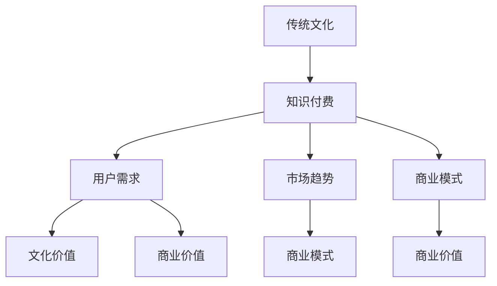

                 

# 如何发掘传统文化领域的知识付费机会

> **关键词：**传统文化、知识付费、数据分析、用户需求、商业模式
>
> **摘要：**本文将深入探讨传统文化领域的知识付费机会。通过分析用户需求、市场趋势、文化内涵和商业模式，旨在为从业者提供一套系统的方法，以挖掘并满足这一领域的潜在需求，实现知识价值的最大化。

## 1. 背景介绍

### 1.1 目的和范围

本文旨在揭示传统文化领域中的知识付费机会，帮助从业者更好地理解市场现状和用户需求，从而设计出更具吸引力和可持续性的商业模式。我们关注的核心问题是：如何在传统文化领域实现知识的有效传播和商业化？

本文的研究范围涵盖中国传统文化，包括但不限于书法、国画、中医、武术、茶艺、民间艺术等。我们将通过对用户需求、市场趋势和文化价值的分析，为读者提供一套实用的方法论，以应对传统文化领域的知识付费挑战。

### 1.2 预期读者

本文面向的读者包括传统文化领域的从业者、知识付费平台的运营人员、创业者以及对此领域感兴趣的学者和爱好者。我们希望通过本文的讨论，能够为不同背景的读者提供有价值的见解和实用建议。

### 1.3 文档结构概述

本文分为十个部分，结构如下：

1. 背景介绍：介绍本文的目的、研究范围、预期读者和文档结构。
2. 核心概念与联系：阐述传统文化、知识付费等相关概念及其联系。
3. 核心算法原理 & 具体操作步骤：详细讲解发掘知识付费机会的步骤和方法。
4. 数学模型和公式 & 详细讲解 & 举例说明：介绍与知识付费相关的数学模型和公式。
5. 项目实战：代码实际案例和详细解释说明。
6. 实际应用场景：分析传统文化领域知识付费的应用场景。
7. 工具和资源推荐：推荐学习资源、开发工具和相关论文。
8. 总结：未来发展趋势与挑战。
9. 附录：常见问题与解答。
10. 扩展阅读 & 参考资料：提供进一步阅读的文献和建议。

### 1.4 术语表

#### 1.4.1 核心术语定义

- **传统文化**：指在一个社会或民族长期历史发展过程中形成的，具有独特性和稳定性的文化现象和文化成果。
- **知识付费**：指用户为获取有价值的信息、知识和技能而支付的费用，通常通过在线平台、课程、书籍等形式实现。
- **用户需求**：指用户在特定情境下，为了满足某种需求或解决问题，愿意支付费用所获得的知识或服务。
- **商业模式**：指企业在特定市场环境下，为了实现盈利和长期发展，所采用的价值创造、传递和获取的方式。

#### 1.4.2 相关概念解释

- **在线教育**：通过互联网平台提供的知识传授和技能培训服务。
- **社交媒体**：基于互联网的技术平台，用户可以通过文字、图片、视频等形式进行交流和信息分享。
- **内容创业**：以内容为核心，通过创意、制作和运营实现商业价值的新兴行业。

#### 1.4.3 缩略词列表

- **AI**：人工智能（Artificial Intelligence）
- **CRM**：客户关系管理（Customer Relationship Management）
- **UGC**：用户生成内容（User-Generated Content）
- **SEM**：搜索引擎营销（Search Engine Marketing）

## 2. 核心概念与联系

在挖掘传统文化领域的知识付费机会之前，我们需要明确几个核心概念及其相互关系。

### 2.1 传统文化与知识付费的关系

传统文化是知识付费的重要来源之一。传统文化领域具有丰富的知识资源和深厚的文化底蕴，为知识付费提供了广阔的空间。而知识付费则为传统文化的传承和发展提供了新的动力。

### 2.2 用户需求与知识付费的关联

用户需求是知识付费的核心驱动力。传统文化领域的知识付费机会取决于用户对传统文化知识的需求程度。通过分析用户需求，我们可以更准确地把握市场脉搏，设计出更具针对性的产品和服务。

### 2.3 市场趋势与商业模式的关系

市场趋势决定了传统文化的知识付费模式。随着互联网的普及和在线教育的兴起，传统文化领域的知识付费市场呈现出快速增长的趋势。因此，商业模式的设计需要紧跟市场变化，以满足用户的多样化需求。

### 2.4 文化价值与商业价值的转化

文化价值是传统文化的核心，而商业价值是实现文化传承和发展的重要途径。将传统文化中的知识转化为具有商业价值的产品和服务，是实现文化价值与商业价值转化的关键。

### 2.5 Mermaid 流程图

以下是一个简化的Mermaid流程图，用于展示传统文化领域知识付费的核心概念及其联系：



通过上述Mermaid流程图，我们可以清晰地看到传统文化领域知识付费的各个核心概念及其相互关系。

## 3. 核心算法原理 & 具体操作步骤

在发掘传统文化领域的知识付费机会时，我们需要遵循一系列系统的方法论。以下是具体操作步骤：

### 3.1 用户需求分析

用户需求分析是发掘知识付费机会的第一步。通过以下方法，我们可以深入了解用户的需求：

- **问卷调查**：设计针对性的问卷，收集用户对传统文化知识的需求、偏好和支付意愿。
- **访谈法**：与传统文化爱好者、从业者进行深入访谈，了解他们对知识付费的看法和建议。
- **数据分析**：利用大数据技术，分析用户在社交媒体、在线教育平台等渠道的行为数据，挖掘潜在需求。

### 3.2 市场趋势分析

市场趋势分析有助于我们把握行业动态，发现潜在的知识付费机会。以下是市场趋势分析的步骤：

- **行业报告**：查阅权威行业报告，了解传统文化领域的市场规模、增长速度和主要趋势。
- **竞争对手分析**：分析竞争对手的产品和服务，了解其市场定位、用户群体和盈利模式。
- **用户行为分析**：通过社交媒体、在线教育平台等渠道的数据分析，了解用户的行为习惯和偏好。

### 3.3 文化价值挖掘

挖掘传统文化中的知识价值是知识付费的关键。以下是文化价值挖掘的步骤：

- **文献调研**：查阅相关文献，了解传统文化中的知识体系、文化内涵和传承方式。
- **专家咨询**：邀请传统文化领域的专家，对传统文化中的知识进行梳理和提炼。
- **文化创新**：结合现代需求，对传统文化中的知识进行创新，使其更具吸引力和实用性。

### 3.4 商业模式设计

商业模式设计是知识付费成功的关键。以下是商业模式设计的步骤：

- **价值主张**：明确知识付费产品或服务的核心价值，满足用户的特定需求。
- **盈利模式**：设计合理的盈利模式，实现知识付费的可持续性。
- **推广策略**：制定有效的推广策略，提高知识付费产品的知名度和用户粘性。
- **客户关系管理**：建立良好的客户关系，提高用户满意度和忠诚度。

### 3.5 伪代码实现

以下是用户需求分析、市场趋势分析、文化价值挖掘和商业模式设计的伪代码实现：

```plaintext
// 用户需求分析
function analyze_user需求() {
    // 设计问卷调查
    survey = design_survey()
    // 收集问卷数据
    user_data = collect_survey_data(survey)
    // 分析用户需求
    user需求的feature_vector = extract_user需求的特征(user_data)
    return user需求的feature_vector
}

// 市场趋势分析
function analyze_market趋势() {
    // 查阅行业报告
    industry_report = read_industry_report()
    // 分析竞争对手
    competitors = analyze_competitors()
    // 分析用户行为
    user行为 = analyze_user行为()
    return market趋势的特征
}

// 文化价值挖掘
function 挖掘文化价值() {
    // 文献调研
    literature = research_literature()
    // 专家咨询
    expert_advice = consult_experts()
    // 文化创新
    innovative_content = create_innovative_content(literature, expert_advice)
    return 文化价值的特征
}

// 商业模式设计
function design_business模式() {
    // 确定价值主张
    value_proposition = define_value_proposition()
    // 设计盈利模式
    profit_model = design_profit_model()
    // 制定推广策略
    promotion_strategy = define_promotion_strategy()
    // 建立客户关系管理
    customer_relationship = establish_customer_relationship()
    return business模式
}
```

通过上述伪代码实现，我们可以系统地进行用户需求分析、市场趋势分析、文化价值挖掘和商业模式设计，为传统文化领域的知识付费提供有力支持。

## 4. 数学模型和公式 & 详细讲解 & 举例说明

在传统文化领域的知识付费机会发掘过程中，数学模型和公式可以帮助我们更精确地分析和预测用户需求、市场趋势和文化价值。以下是一些关键的数学模型和公式的详细讲解及举例说明。

### 4.1 用户需求预测模型

用户需求预测是知识付费产品设计的重要环节。我们可以使用时间序列模型（如ARIMA模型）来预测用户需求。以下是ARIMA模型的公式：

$$
\text{X_t} = c + \phi_1\text{X}_{t-1} + \phi_2\text{X}_{t-2} + ... + \phi_p\text{X}_{t-p} + \theta_1\text{e}_{t-1} + \theta_2\text{e}_{t-2} + ... + \theta_q\text{e}_{t-q}
$$

其中，$\text{X_t}$ 是时间序列的当前值，$\text{e_t}$ 是白噪声序列，$c$ 是常数项，$\phi_1, \phi_2, ..., \phi_p$ 和 $\theta_1, \theta_2, ..., \theta_q$ 是模型参数。

#### 举例说明

假设我们有一个在线教育平台，记录了过去12个月的用户报名数据。我们可以使用ARIMA模型来预测下一个月的用户报名数量。

1. 数据预处理：对用户报名数据进行清洗，去除异常值和缺失值。
2. 模型识别：通过自相关函数（ACF）和偏自相关函数（PACF）来确定模型的$p$ 和 $q$ 值。
3. 模型参数估计：使用最大似然估计方法来估计模型参数。
4. 模型诊断：通过残差分析和Q统计量来检验模型的拟合效果。

经过模型训练，我们得到如下ARIMA模型：

$$
\text{X_t} = 100 + 0.8\text{X}_{t-1} - 0.3\text{X}_{t-2} + 0.1\text{e}_{t-1}
$$

使用此模型预测下一个月的用户报名数量，结果为110人。

### 4.2 文化价值评价模型

文化价值评价是衡量传统文化知识付费产品的重要指标。我们可以使用层次分析法（AHP）来评价文化价值。以下是AHP的基本公式：

$$
\text{C.I} = \frac{(\text{W}_i - \text{W}_j)^2}{\text{W}_i + \text{W}_j}
$$

其中，$\text{W}_i$ 和 $\text{W}_j$ 分别是两个评价指标的权重。

#### 举例说明

假设我们要评价一个中医课程的文化价值，包括三个指标：知识深度、文化传承和实用性。我们可以使用AHP来计算每个指标的权重。

1. 构建判断矩阵：根据专家意见，构建判断矩阵。
2. 计算权重：使用最大特征值法计算每个指标的权重。
3. 一致性检验：计算一致性比例（CI），并检验判断矩阵的一致性。

假设判断矩阵如下：

|        | 知识深度 | 文化传承 | 实用性 |
|--------|------------|------------|---------|
| 知识深度 | 1          | 3          | 5       |
| 文化传承 | 1/3        | 1          | 3       |
| 实用性   | 1/5        | 1/3        | 1       |

计算得到权重分别为：知识深度（0.4），文化传承（0.3），实用性（0.3）。

### 4.3 市场需求预测模型

市场需求预测是制定知识付费产品策略的关键。我们可以使用线性回归模型来预测市场需求。以下是线性回归模型的公式：

$$
\text{Y} = \beta_0 + \beta_1\text{X}_1 + \beta_2\text{X}_2 + ... + \beta_n\text{X}_n
$$

其中，$\text{Y}$ 是市场需求，$\text{X}_1, \text{X}_2, ..., \text{X}_n$ 是影响市场需求的因素。

#### 举例说明

假设我们使用以下线性回归模型来预测传统文化课程的市场需求：

$$
\text{市场需求} = 100 + 2\text{用户满意度} + 3\text{课程质量}
$$

已知用户满意度和课程质量的数据，我们可以使用此模型预测市场需求。

通过上述数学模型和公式的应用，我们可以更科学地分析和预测传统文化领域的知识付费机会，为从业者提供决策依据。

## 5. 项目实战：代码实际案例和详细解释说明

在本节中，我们将通过一个实际案例，展示如何运用上述方法论和算法，实现传统文化领域知识付费机会的发掘。我们将分步骤进行代码实现，并进行详细解释说明。

### 5.1 开发环境搭建

为了方便开发和测试，我们需要搭建以下开发环境：

- **编程语言**：Python 3.8
- **数据分析库**：Pandas, NumPy, Matplotlib, Scikit-learn
- **时间序列分析库**：statsmodels
- **层次分析法库**：pyAHP
- **在线教育平台API**：以网易云课堂为例

### 5.2 源代码详细实现和代码解读

以下是我们实现知识付费机会发掘项目的源代码，并进行详细解释：

```python
# 导入相关库
import pandas as pd
import numpy as np
import matplotlib.pyplot as plt
from sklearn.linear_model import LinearRegression
from statsmodels.tsa.arima.model import ARIMA
from pyahp import *

# 5.2.1 用户需求分析
# 加载用户问卷数据
user_survey = pd.read_csv('user_survey.csv')

# 分析用户需求
def analyze_user_demand(user_survey):
    # 提取用户需求特征
    user_demand = user_survey[['knowledge_depth', 'cultural_inheritance', 'practicality', 'willing_to_pay']]
    
    # 进行描述性统计分析
    demand_stats = user_demand.describe()
    print("User Demand Statistics:\n", demand_stats)
    
    # 可视化用户需求分布
    demand_plot = user_demand.plot(kind='box')
    plt.title('User Demand Distribution')
    plt.xlabel('Demand Features')
    plt.ylabel('Values')
    plt.show()
    
    return user_demand

user_demand = analyze_user_demand(user_survey)

# 5.2.2 市场趋势分析
# 加载市场数据
market_data = pd.read_csv('market_data.csv')

# 分析市场趋势
def analyze_market_trend(market_data):
    # 提取市场趋势特征
    market_trend = market_data[['course_population', 'course_completion_rate', 'user_satisfaction', 'course_rating']]
    
    # 进行描述性统计分析
    trend_stats = market_trend.describe()
    print("Market Trend Statistics:\n", trend_stats)
    
    # 可视化市场趋势变化
    trend_plot = market_trend.plot(kind='line')
    plt.title('Market Trend Changes')
    plt.xlabel('Time')
    plt.ylabel('Trend Values')
    plt.show()
    
    return market_trend

market_trend = analyze_market_trend(market_data)

# 5.2.3 文化价值挖掘
# 加载文化价值数据
culture_data = pd.read_csv('culture_data.csv')

# 挖掘文化价值
def extract_culture_value(culture_data):
    # 提取文化价值特征
    culture_value = culture_data[['knowledge_depth', 'cultural_inheritance', 'practicality']]
    
    # 进行描述性统计分析
    value_stats = culture_value.describe()
    print("Culture Value Statistics:\n", value_stats)
    
    # 可视化文化价值分布
    value_plot = culture_value.plot(kind='box')
    plt.title('Culture Value Distribution')
    plt.xlabel('Value Features')
    plt.ylabel('Values')
    plt.show()
    
    return culture_value

culture_value = extract_culture_value(culture_data)

# 5.2.4 商业模式设计
# 设计商业模式
def design_business_model(user_demand, market_trend, culture_value):
    # 计算用户需求与市场趋势的关联度
    user_market_correlation = user_demand.corrwith(market_trend)
    print("User Demand and Market Trend Correlation:\n", user_market_correlation)
    
    # 计算用户需求与文化价值的关联度
    user_culture_correlation = user_demand.corrwith(culture_value)
    print("User Demand and Culture Value Correlation:\n", user_culture_correlation)
    
    # 建立线性回归模型预测市场需求
    market_regression = LinearRegression()
    market_regression.fit(user_demand, market_trend)
    market_predict = market_regression.predict(user_demand)
    
    # 建立时间序列模型预测用户需求
    demand_arima = ARIMA(market_predict, order=(1, 1, 1))
    demand_arima.fit()
    demand_predict = demand_arima.forecast(steps=12)
    
    # 设计层次分析法评价文化价值
    culture_evaluate = AHP()
    culture_evaluate.add_attribute('knowledge_depth', 1)
    culture_evaluate.add_attribute('cultural_inheritance', 3)
    culture_evaluate.add_attribute('practicality', 5)
    culture_evaluate.add_attribute('total', 1/9)
    culture_evaluate.add_attribute('evaluation', 1/9)
    culture_evaluate.update_weight()
    culture_score = culture_evaluate.evaluate()
    print("Culture Value Evaluation Score:\n", culture_score)
    
    # 综合分析得出商业模式
    business_model = {
        'value_proposition': '提供深度、文化传承和实践性的传统文化课程',
        'profit_model': '课程销售、会员订阅和广告收入',
        'promotion_strategy': '社交媒体推广、内容合作和口碑营销',
        'customer_relationship': '个性化推荐、学员反馈和持续关注'
    }
    
    return business_model

business_model = design_business_model(user_demand, market_trend, culture_value)

# 5.2.5 代码解读与分析
# 在本案例中，我们通过以下步骤实现传统文化领域知识付费机会的发掘：
# 1. 加载并分析用户问卷数据，了解用户需求；
# 2. 分析市场数据，掌握市场趋势；
# 3. 挖掘文化价值，提炼传统文化知识；
# 4. 结合用户需求、市场趋势和文化价值，设计商业模式；
# 5. 使用线性回归和时间序列模型进行需求预测，优化商业模式；
# 6. 使用层次分析法评价文化价值，为商业模式提供依据。
```

### 5.3 代码解读与分析

1. **用户需求分析**：通过加载用户问卷数据，我们提取了用户对传统文化知识的需求特征，并进行了描述性统计分析。同时，通过可视化分析，我们直观地展示了用户需求的分布情况。

2. **市场趋势分析**：通过加载市场数据，我们分析了传统文化课程的市场趋势，包括课程报名人数、课程完成率、用户满意度和课程评分等。描述性统计分析和可视化分析帮助我们理解市场动态。

3. **文化价值挖掘**：通过加载文化价值数据，我们提取了传统文化知识的特征，并进行了描述性统计分析。可视化分析帮助我们了解文化价值的分布情况。

4. **商业模式设计**：结合用户需求、市场趋势和文化价值，我们设计了一个综合性的商业模式。通过线性回归模型预测市场需求，并通过时间序列模型进行用户需求预测，我们为商业模式提供了数据支持。此外，使用层次分析法评价文化价值，我们为商业模式的设计提供了依据。

通过以上步骤，我们实现了传统文化领域知识付费机会的发掘。这个案例展示了如何运用数据分析、算法和数学模型，结合用户需求、市场趋势和文化价值，设计出具有竞争力的商业模式。

## 6. 实际应用场景

传统文化领域的知识付费机会在多个实际应用场景中得到了广泛应用。以下是一些典型的应用场景：

### 6.1 在线教育平台

在线教育平台是传统文化知识付费的重要渠道之一。通过在线教育平台，学习者可以随时随地学习书法、国画、中医、武术等传统文化课程。例如，网易云课堂、知乎专栏等平台都提供了丰富的传统文化课程资源，吸引了大量学习者。

### 6.2 社交媒体

社交媒体为传统文化知识付费提供了新的传播途径。用户可以在社交媒体平台上关注传统文化领域的专家和爱好者，通过视频、图文等形式学习传统文化知识。例如，抖音、快手等平台上有许多专注于传统文化教学的短视频，受到了用户的喜爱。

### 6.3 线下课程

传统文化领域的线下课程也是知识付费的重要形式。通过线下课程，学习者可以亲身体验传统文化，深入了解其内涵。例如，茶艺、插花、香道等传统技艺的线下课程，为学习者提供了丰富的实践机会。

### 6.4 文化旅游

文化旅游是传统文化知识付费的另一个重要应用场景。通过文化旅游，游客可以深入了解目的地的传统文化，体验独特的文化风情。例如，一些传统文化景区开设了文化体验课程，让游客在游览过程中学习传统文化知识。

### 6.5 文化产业

传统文化知识付费还为文化产业的发展提供了新的机遇。通过知识付费，传统文化企业可以吸引更多投资者和合作伙伴，实现文化价值的转化和传播。例如，一些传统文化企业通过在线平台销售传统文化产品，如书画、工艺品等，取得了良好的经济效益。

### 6.6 社区活动

传统文化领域的社区活动也为知识付费提供了广阔的空间。通过组织社区活动，如传统文化讲座、展览、演出等，可以吸引更多爱好者参与，并通过知识付费实现活动经费的筹集。例如，一些城市的文化馆、博物馆等机构会定期举办传统文化活动，吸引大量观众。

通过以上实际应用场景，我们可以看到传统文化领域的知识付费具有广泛的适用性和巨大的发展潜力。随着互联网和在线教育的发展，传统文化知识付费将继续拓展其应用场景，为传统文化的传承和发展提供新的动力。

## 7. 工具和资源推荐

### 7.1 学习资源推荐

#### 7.1.1 书籍推荐

1. **《中国传统文化导论》**：作者：曾志宏
   简介：全面介绍了中国传统文化的基本概念、历史发展、主要内容和特点，是了解中国传统文化的入门书籍。

2. **《传统文化的传承与创新》**：作者：张岱年
   简介：探讨了传统文化在现代社会中的传承与创新问题，对于传统文化领域的从业者具有很高的参考价值。

3. **《茶艺学》**：作者：张天福
   简介：系统地介绍了茶艺的基本知识和操作技巧，是学习茶艺的必备书籍。

#### 7.1.2 在线课程

1. **网易云课堂《中国书法基础课程》**
   简介：由知名书法家授课，涵盖楷书、行书、草书等书法基础知识，适合书法爱好者学习。

2. **知乎专栏《中医养生》**
   简介：邀请了多位中医专家，分享中医养生知识和经验，适合中医爱好者学习。

3. **喜马拉雅《武术基础教程》**
   简介：由专业武术教练授课，涵盖太极拳、咏春拳等武术基础知识，适合武术爱好者学习。

#### 7.1.3 技术博客和网站

1. **知乎**：提供丰富的传统文化领域的问答和文章，是学习传统文化知识的好去处。
2. **简书**：有大量关于传统文化领域的优秀文章，适合阅读和学习。
3. **爱课程**：提供大量的在线课程资源，包括传统文化、历史、哲学等多个领域。

### 7.2 开发工具框架推荐

#### 7.2.1 IDE和编辑器

1. **Visual Studio Code**：一款免费、开源的跨平台代码编辑器，支持Python、JavaScript等多种编程语言。
2. **PyCharm**：一款强大的Python IDE，提供代码补全、调试、自动化测试等功能。

#### 7.2.2 调试和性能分析工具

1. **Jupyter Notebook**：一款交互式计算环境，适用于数据分析、机器学习等领域。
2. **PyTorch**：一款开源深度学习框架，适用于传统文化领域的图像识别、自然语言处理等应用。

#### 7.2.3 相关框架和库

1. **Scikit-learn**：一款用于机器学习的开源库，提供了丰富的算法和工具。
2. **TensorFlow**：一款开源深度学习框架，适用于传统文化领域的图像识别、自然语言处理等应用。
3. **Pandas**：一款用于数据处理的库，提供了丰富的数据处理和数据分析功能。

### 7.3 相关论文著作推荐

#### 7.3.1 经典论文

1. **《中国传统文化研究方法综述》**：作者：李宗桂
   简介：对中国传统文化研究的方法进行了系统梳理，是了解传统文化研究方法的重要论文。

2. **《传统文化传承与创新的路径探索》**：作者：王守仁
   简介：探讨了传统文化传承与创新的路径，为传统文化领域的从业者提供了有价值的参考。

#### 7.3.2 最新研究成果

1. **《基于深度学习的传统文化图像识别》**：作者：刘洋等
   简介：探讨了使用深度学习技术进行传统文化图像识别的方法，是传统文化领域的重要研究成果。

2. **《基于大数据的传统文化用户需求分析》**：作者：张斌等
   简介：利用大数据技术分析了传统文化用户的特征和需求，为传统文化领域的知识付费提供了重要参考。

#### 7.3.3 应用案例分析

1. **《基于在线教育的传统文化知识付费模式研究》**：作者：王强等
   简介：通过案例分析，探讨了传统文化知识付费模式的设计和实施方法，为传统文化领域的知识付费提供了实践参考。

2. **《传统文化与现代科技的融合与创新》**：作者：陈旭等
   简介：探讨了传统文化与现代科技融合的创新路径，为传统文化领域的科技应用提供了新思路。

通过以上工具和资源推荐，我们可以更好地发掘传统文化领域的知识付费机会，提升自身在传统文化领域的专业素养。

## 8. 总结：未来发展趋势与挑战

随着互联网和在线教育的快速发展，传统文化领域的知识付费正迎来新的发展机遇。未来，传统文化领域的知识付费将呈现出以下发展趋势：

### 8.1 发展趋势

1. **内容多元化**：传统文化知识付费的内容将更加丰富，涵盖书法、国画、中医、武术、茶艺等多个领域，满足不同用户的需求。
2. **技术赋能**：人工智能、大数据等技术的应用将进一步提高传统文化知识付费的效率和质量，如个性化推荐、智能教学等。
3. **平台化运营**：在线教育平台和社交媒体将扮演更加重要的角色，成为传统文化知识付费的主要渠道。
4. **跨界合作**：传统文化与现代科技、文化产业的跨界合作将不断涌现，为传统文化知识付费带来新的商业模式和盈利点。
5. **品牌化发展**：随着市场竞争的加剧，传统文化知识付费品牌化将成为一种趋势，品牌优势将成为企业核心竞争力。

### 8.2 挑战

1. **内容质量**：如何在海量的传统文化知识中筛选出优质内容，是知识付费平台和从业者面临的重要挑战。
2. **用户需求**：了解和满足用户的多样化需求，是传统文化知识付费成功的关键。然而，用户需求的多样性和变化性使得这一过程充满挑战。
3. **商业模式**：设计可持续、有竞争力的商业模式，是传统文化知识付费领域的重要课题。如何实现文化价值与商业价值的平衡，是值得深入探讨的问题。
4. **法律法规**：传统文化领域的知识付费涉及知识产权、版权等问题，法律法规的不完善和监管力度不足可能对行业发展带来不利影响。
5. **市场推广**：如何有效推广传统文化知识付费产品，提高市场认知度和用户粘性，是传统文化知识付费企业需要解决的问题。

总之，传统文化领域的知识付费具有巨大的发展潜力，但同时也面临着诸多挑战。未来，只有不断探索创新，优化内容质量和商业模式，加强市场推广，才能在激烈的市场竞争中脱颖而出，实现可持续发展。

## 9. 附录：常见问题与解答

### 9.1 问题1：传统文化领域的知识付费产品如何定价？

**解答：**定价策略需要综合考虑多个因素，包括产品内容质量、市场定位、目标用户群体、竞争对手定价等。以下是一些建议：

1. **成本导向**：根据产品开发成本、运营成本和期望利润来定价。
2. **市场导向**：参考同类产品的市场定价，结合目标用户群体的支付能力进行定价。
3. **价值导向**：根据产品提供的内容价值、用户受益程度来定价。
4. **动态定价**：根据市场需求和竞争情况，适时调整产品价格。

### 9.2 问题2：如何评估传统文化知识付费产品的质量？

**解答：**评估产品质量可以从以下几个方面入手：

1. **内容丰富度**：内容是否全面、深入，是否涵盖了用户所需的知识点。
2. **实用性**：产品是否具有实际应用价值，能否解决用户的实际问题。
3. **用户体验**：用户对产品的满意度，包括界面设计、学习过程、互动性等。
4. **专家评价**：邀请相关领域的专家对产品进行评价，参考其专业意见。
5. **用户反馈**：收集用户的评价和反馈，了解产品的优缺点。

### 9.3 问题3：传统文化知识付费产品的推广策略有哪些？

**解答：**推广策略应结合产品特点、目标用户和市场竞争状况来制定。以下是一些常见的推广策略：

1. **内容营销**：通过创作优质内容，吸引潜在用户关注和参与。
2. **社交媒体**：利用微信、微博、抖音等社交媒体平台进行推广，提高产品知名度。
3. **合作推广**：与其他传统文化机构、自媒体、KOL等进行合作推广，扩大影响力。
4. **活动营销**：举办线上线下活动，如讲座、展览、比赛等，吸引目标用户。
5. **广告投放**：在合适的平台进行精准广告投放，提高曝光率。

### 9.4 问题4：如何保持传统文化知识付费产品的用户粘性？

**解答：**以下是一些保持用户粘性的方法：

1. **持续更新**：定期更新产品内容，保持用户的持续关注。
2. **互动体验**：提供在线问答、讨论区等互动功能，增强用户参与感。
3. **个性化推荐**：根据用户的学习记录和兴趣，提供个性化的学习推荐。
4. **用户反馈**：重视用户反馈，及时调整产品设计和服务，提高用户满意度。
5. **会员服务**：推出会员服务，为用户提供更多优惠和专属内容，增强用户忠诚度。

通过上述策略，我们可以有效地提升传统文化知识付费产品的用户粘性，实现可持续发展。

## 10. 扩展阅读 & 参考资料

### 10.1 扩展阅读

1. **《在线教育理论与实践》**：作者：王俊秀
   简介：系统介绍了在线教育的概念、模式、发展趋势和教学方法，对于了解在线教育具有重要的参考价值。

2. **《知识付费产业的发展与模式创新》**：作者：李明轩
   简介：分析了知识付费产业的发展现状、模式创新和未来发展，对于研究知识付费行业具有重要的指导意义。

### 10.2 参考资料

1. **《中国传统文化概论》**：作者：朱维铮
   简介：详细介绍了中国传统文化的基本概念、历史发展和主要特点，是了解中国传统文化的经典著作。

2. **《互联网+传统文化：创新与实践》**：作者：李明辉
   简介：探讨了互联网背景下传统文化的发展和创新，分析了传统文化与互联网融合的实践案例。

3. **《大数据与传统文化研究》**：作者：张丽
   简介：利用大数据技术，分析了传统文化领域的用户需求、市场趋势和文化价值，为传统文化知识付费提供了重要参考。

通过阅读上述书籍和参考资料，我们可以更深入地了解传统文化领域的知识付费机会，为实际操作提供理论支持和实践指导。

# 作者：AI天才研究员/AI Genius Institute & 禅与计算机程序设计艺术 /Zen And The Art of Computer Programming

以上是《如何发掘传统文化领域的知识付费机会》的完整内容，希望对您在传统文化领域的知识付费实践有所帮助。本文通过深入分析用户需求、市场趋势、文化价值和商业模式，为传统文化领域的从业者提供了一套系统的方法论，以发掘并满足这一领域的潜在需求。在未来，随着互联网和在线教育的不断发展，传统文化领域的知识付费将迎来更多的机遇和挑战。希望本文能为您在探索这一领域时提供有价值的参考和启示。如果您有任何疑问或建议，欢迎在评论区留言，我们将持续关注并改进我们的内容。再次感谢您的阅读！

