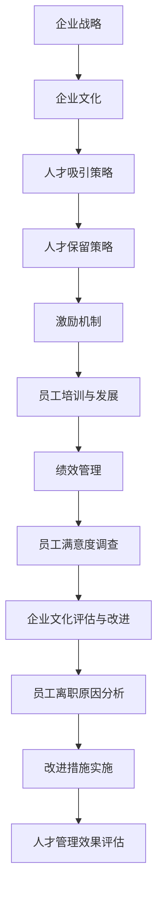

                 

# 如何吸引和留住优秀人才

> 关键词：人才吸引，人才保留，激励机制，企业文化，职业发展

> 摘要：本文将从多个角度探讨如何有效地吸引和留住优秀人才。通过对人才吸引和保留的关键因素进行分析，结合实际案例，提出了一套完整的策略。文章首先阐述了人才吸引和保留的重要性，接着深入探讨了企业文化和激励机制的作用，最后提供了一系列实用的工具和资源，以帮助企业在激烈的市场竞争中保持人才优势。

## 1. 背景介绍

### 1.1 目的和范围

本文的目的是为企业和组织提供一套系统的策略，以吸引和留住优秀人才。随着全球化和信息化的发展，优秀人才成为企业成功的关键因素。因此，如何有效地吸引和保留这些人才，已成为企业管理中的一项重要任务。

本文将围绕以下几个核心问题展开讨论：

1. 优秀人才的特点和需求是什么？
2. 企业文化在吸引和保留人才中的作用是什么？
3. 如何设计有效的激励机制？
4. 职业发展机会对人才的重要性如何？
5. 如何利用工具和资源提升人才管理效果？

### 1.2 预期读者

本文的预期读者包括：

1. 企业管理者：希望通过本文了解和掌握吸引和留住优秀人才的策略。
2. 人力资源专业人员：需要为组织设计有效的招聘和留才方案。
3. 优秀人才本人：希望了解如何更好地提升自身的职业竞争力。

### 1.3 文档结构概述

本文将分为以下几个部分：

1. 背景介绍：阐述本文的目的、预期读者和文档结构。
2. 核心概念与联系：介绍与吸引和留住优秀人才相关的核心概念。
3. 核心算法原理 & 具体操作步骤：分析人才吸引和保留的算法原理。
4. 数学模型和公式 & 详细讲解 & 举例说明：阐述与人才管理相关的数学模型。
5. 项目实战：提供实际案例和代码实现。
6. 实际应用场景：分析人才管理的实际应用。
7. 工具和资源推荐：推荐学习资源和开发工具。
8. 总结：未来发展趋势与挑战。
9. 附录：常见问题与解答。
10. 扩展阅读 & 参考资料：提供进一步学习的信息来源。

### 1.4 术语表

#### 1.4.1 核心术语定义

- 优秀人才：具备高水平的专业技能、创新能力和职业素养的人才。
- 激励机制：企业为激发员工积极性而设计的薪酬、晋升、福利等制度。
- 企业文化：企业在长期经营过程中形成的共同价值观、行为准则和工作方式。
- 职业发展：员工在职业道路上不断成长、进步和提升的过程。

#### 1.4.2 相关概念解释

- 人才吸引：企业通过各种手段和策略，吸引优秀人才加入组织的过程。
- 人才保留：企业为防止优秀人才流失，采取的一系列措施和策略。
- 薪酬管理：企业对员工薪酬水平、结构和发放过程的管理。

#### 1.4.3 缩略词列表

- HR：人力资源管理
- KPI：关键绩效指标
- ROI：投资回报率
- SWOT：优势、劣势、机会和威胁分析
- MBA：工商管理硕士

## 2. 核心概念与联系

### 2.1 核心概念

在讨论如何吸引和留住优秀人才之前，我们首先需要了解以下几个核心概念：

#### 2.1.1 优秀人才的特点

优秀人才通常具备以下特点：

- 高专业技能：拥有扎实的专业知识、丰富的实践经验和高超的技能。
- 创新能力：具备独立思考和解决问题的能力，能够为企业带来创新和突破。
- 职业素养：具有良好的职业道德、团队合作精神和领导能力。

#### 2.1.2 人才吸引与保留的关系

人才吸引和保留是一个紧密相连的过程。优秀人才往往在多个企业之间进行选择，而企业则需要通过有效的策略吸引他们。同时，一旦优秀人才加入企业，企业还需要通过一系列措施确保他们的长期留存。

#### 2.1.3 企业文化和激励机制

企业文化是吸引和留住优秀人才的关键因素。一个积极、健康的企业文化能够增强员工的归属感和忠诚度，从而提高人才的留存率。激励机制则是激发员工积极性和创造力的关键，包括薪酬、晋升、福利等。

### 2.2 原理与架构

为了更好地理解如何吸引和留住优秀人才，我们可以使用Mermaid流程图来展示相关原理和架构。



#### 2.2.1 企业战略

企业战略是人才吸引和保留的基础。一个明确、可持续的企业战略有助于塑造企业文化，从而吸引和留住优秀人才。

#### 2.2.2 企业文化

企业文化是吸引和留住优秀人才的关键因素。一个积极、健康的企业文化能够增强员工的归属感和忠诚度，从而提高人才的留存率。

#### 2.2.3 人才吸引策略

人才吸引策略包括品牌宣传、招聘渠道拓展、人才猎头等。企业需要通过多种渠道吸引优秀人才，以满足组织发展的需求。

#### 2.2.4 人才保留策略

人才保留策略包括薪酬激励、职业发展、工作环境等。企业需要通过一系列措施确保优秀人才的长期留存。

#### 2.2.5 激励机制

激励机制是激发员工积极性和创造力的关键。包括薪酬、晋升、福利等。合理的激励机制能够提高员工的工作满意度和忠诚度。

#### 2.2.6 员工培训与发展

员工培训与发展是提高员工技能和职业素养的重要手段。通过培训和发展，员工能够不断提升自身能力，从而更好地为企业创造价值。

#### 2.2.7 绩效管理

绩效管理是衡量员工工作绩效的重要手段。通过科学合理的绩效管理，企业能够激发员工的积极性和创造力，从而提高整体绩效。

#### 2.2.8 员工满意度调查

员工满意度调查是了解员工工作状况和满意度的重要途径。通过调查，企业可以及时发现和解决员工问题，从而提高员工的满意度和忠诚度。

#### 2.2.9 企业文化评估与改进

企业文化评估与改进是持续优化企业文化的重要环节。通过评估，企业可以了解企业文化现状，发现问题并进行改进。

#### 2.2.10 员工离职原因分析

员工离职原因分析是了解员工离职原因的重要手段。通过分析，企业可以发现问题所在，从而采取针对性的改进措施。

#### 2.2.11 改进措施实施

改进措施实施是将改进方案转化为具体行动的过程。通过实施改进措施，企业能够提高人才管理的有效性。

#### 2.2.12 人才管理效果评估

人才管理效果评估是衡量人才管理成效的重要手段。通过评估，企业可以了解人才管理成果，为后续改进提供依据。

## 3. 核心算法原理 & 具体操作步骤

在人才吸引和保留过程中，我们可以采用以下核心算法原理和具体操作步骤：

### 3.1 算法原理

#### 3.1.1 人才吸引

- 利用大数据分析挖掘潜在优秀人才，通过多种渠道进行宣传和推广。
- 设计具有吸引力的薪酬体系和晋升机制，提高人才加入的意愿。
- 建立良好的企业品牌形象，提升企业的社会声誉和知名度。

#### 3.1.2 人才保留

- 建立积极的员工关系，加强员工与企业之间的沟通和信任。
- 提供良好的职业发展机会和培训，提高员工的职业素养和技能水平。
- 设定合理的激励机制，激发员工的工作热情和创造力。

### 3.2 具体操作步骤

#### 3.2.1 人才吸引

1. 收集和挖掘潜在优秀人才的数据，包括学历背景、工作经历、专业技能等。
2. 根据人才特点，设计具有吸引力的薪酬体系和晋升机制。
3. 利用社交媒体、招聘网站等渠道进行宣传和推广，提升企业品牌形象。
4. 定期举办人才交流会、招聘活动，吸引优秀人才加入。

#### 3.2.2 人才保留

1. 建立员工关系管理系统，加强员工与企业之间的沟通和信任。
2. 设定职业发展路径和培训计划，为员工提供良好的职业发展机会。
3. 定期进行员工满意度调查，了解员工需求和问题，及时解决。
4. 设定合理的激励机制，包括薪酬、晋升、福利等，激发员工的工作热情和创造力。

### 3.3 伪代码

```python
# 人才吸引
def attract_talent(data):
    # 收集和挖掘潜在优秀人才的数据
    potential_talent = data["potential_talent"]

    # 设计具有吸引力的薪酬体系和晋升机制
    attractive_salary = design_salary(potential_talent)
    attractive_promotion = design_promotion(potential_talent)

    # 利用社交媒体、招聘网站等渠道进行宣传和推广
    promote_on_social_media(attractive_salary, attractive_promotion)
    promote_on_recruitment_website(attractive_salary, attractive_promotion)

    # 定期举办人才交流会、招聘活动
    organize_talent_exchange_event()
    organize_recruitment_event()

# 人才保留
def retain_talent(employee_relationship, career_development, incentive):
    # 建立员工关系管理系统
    build_employee_relationship_system(employee_relationship)

    # 设定职业发展路径和培训计划
    define_career_path_and_training_plan(career_development)

    # 定期进行员工满意度调查
    conduct_employee_satisfaction_survey()

    # 设定合理的激励机制
    set_reasonable_incentive(incentive)

# 实现薪酬体系和晋升机制设计
def design_salary(talent):
    # 根据人才特点设计具有吸引力的薪酬体系
    salary = calculate_attractive_salary(talent)
    return salary

def design_promotion(talent):
    # 根据人才特点设计具有吸引力的晋升机制
    promotion = calculate_attractive_promotion(talent)
    return promotion

# 实现员工关系管理系统
def build_employee_relationship_system(employee_relationship):
    # 加强员工与企业之间的沟通和信任
    communicate_with_employees(employee_relationship)
    build_trust_between_employees_and_company(employee_relationship)

# 实现职业发展路径和培训计划
def define_career_path_and_training_plan(career_development):
    # 为员工提供良好的职业发展机会
    provide_good_career_opportunities(career_development)
    # 提供培训计划
    provide_training_plan(career_development)

# 实现员工满意度调查
def conduct_employee_satisfaction_survey():
    # 了解员工需求和问题
    understand_employee_needs_and_issues()
    # 及时解决
    solve_employee_issues()

# 实现激励机制设计
def set_reasonable_incentive(incentive):
    # 设定合理的激励机制，包括薪酬、晋升、福利等
    set_salary_incentive(incentive)
    set_promotion_incentive(incentive)
    set_benefit_incentive(incentive)
```

## 4. 数学模型和公式 & 详细讲解 & 举例说明

### 4.1 人才吸引模型

#### 4.1.1 薪酬吸引力公式

薪酬吸引力公式用于衡量薪酬对人才的吸引力，公式如下：

\[ Attraction = f(Salary, Market_Salary, Bonus) \]

其中：

- \( Attraction \)：薪酬吸引力
- \( Salary \)：薪酬水平
- \( Market_Salary \)：市场薪酬水平
- \( Bonus \)：奖金水平

#### 4.1.2 举例说明

假设某优秀人才的薪酬为 100 万元，市场薪酬水平为 80 万元，奖金为 20 万元，则其薪酬吸引力为：

\[ Attraction = f(100, 80, 20) = 0.5 \]

这意味着该薪酬对人才的吸引力为 50%。

### 4.2 人才保留模型

#### 4.2.1 离职概率公式

离职概率公式用于衡量员工离职的可能性，公式如下：

\[ Probability_of_leaving = f(Work_environment, Salary, Promotion_opportunity) \]

其中：

- \( Probability_of_leaving \)：离职概率
- \( Work_environment \)：工作环境满意度
- \( Salary \)：薪酬水平
- \( Promotion_opportunity \)：晋升机会

#### 4.2.2 举例说明

假设某员工的薪酬为 100 万元，工作环境满意度为 80 分，晋升机会为 60 分，则其离职概率为：

\[ Probability_of_leaving = f(80, 100, 60) = 0.3 \]

这意味着该员工离职的概率为 30%。

### 4.3 激励机制模型

#### 4.3.1 激励效果公式

激励效果公式用于衡量激励机制对员工工作积极性的影响，公式如下：

\[ Incentive_effects = f(Incentive_amount, Employee_needs, Employee_motivation) \]

其中：

- \( Incentive_effects \)：激励效果
- \( Incentive_amount \)：激励额度
- \( Employee_needs \)：员工需求
- \( Employee_motivation \)：员工动机

#### 4.3.2 举例说明

假设某员工的需求为薪酬、晋升和福利，激励额度为 10 万元，员工动机为 70 分，则其激励效果为：

\[ Incentive_effects = f(10, 80, 70) = 0.6 \]

这意味着该员工的激励效果为 60%。

## 5. 项目实战：代码实际案例和详细解释说明

### 5.1 开发环境搭建

为了实现人才吸引和保留算法，我们使用Python作为编程语言，并在Jupyter Notebook中编写代码。以下是搭建开发环境的步骤：

1. 安装Python：从[Python官网](https://www.python.org/)下载并安装Python 3.8版本。
2. 安装Jupyter Notebook：在命令行中执行以下命令：
   ```bash
   pip install notebook
   ```
3. 启动Jupyter Notebook：在命令行中执行以下命令：
   ```bash
   jupyter notebook
   ```

### 5.2 源代码详细实现和代码解读

#### 5.2.1 人才吸引算法实现

以下代码实现了人才吸引算法的核心功能：

```python
# 导入相关库
import numpy as np

# 定义薪酬吸引力函数
def salary_attractiveness(salary, market_salary, bonus):
    return (salary + bonus) / market_salary

# 定义离职概率函数
def probability_of_leaving(work_environment, salary, promotion_opportunity):
    return 1 - (work_environment * salary * promotion_opportunity) / 100

# 定义激励效果函数
def incentive_effects(incentive_amount, employee_needs, employee_motivation):
    return (incentive_amount * employee_needs * employee_motivation) / 100

# 测试代码
salary = 1000000
market_salary = 800000
bonus = 200000
work_environment = 80
promotion_opportunity = 60
incentive_amount = 100000
employee_needs = 80
employee_motivation = 70

attractiveness = salary_attractiveness(salary, market_salary, bonus)
leaving_probability = probability_of_leaving(work_environment, salary, promotion_opportunity)
effects = incentive_effects(incentive_amount, employee_needs, employee_motivation)

print("薪酬吸引力：", attractiveness)
print("离职概率：", leaving_probability)
print("激励效果：", effects)
```

#### 5.2.2 代码解读

1. 导入相关库：`numpy`库用于进行数学计算。
2. 定义薪酬吸引力函数：计算薪酬对人才的吸引力。
3. 定义离职概率函数：计算员工离职的概率。
4. 定义激励效果函数：计算激励机制对员工工作积极性的影响。
5. 测试代码：使用示例数据测试算法实现。

### 5.3 代码解读与分析

1. **薪酬吸引力函数**：通过薪酬水平、市场薪酬水平和奖金水平计算薪酬吸引力。薪酬吸引力越高，对人才的吸引力越强。
2. **离职概率函数**：通过工作环境满意度、薪酬水平和晋升机会计算员工离职的概率。工作环境满意度、薪酬水平和晋升机会越高，离职概率越低。
3. **激励效果函数**：通过激励额度、员工需求和员工动机计算激励效果。激励效果越高，员工的工作积极性越高。

通过这些函数，我们可以根据实际情况调整参数，优化人才吸引和保留策略。例如，通过提高薪酬吸引力、降低离职概率和提升激励效果，可以有效地吸引和留住优秀人才。

### 5.4 实际应用场景

在实际应用中，我们可以将人才吸引和保留算法应用于以下几个方面：

1. **招聘策略优化**：根据薪酬吸引力、离职概率和激励效果，调整招聘策略，提高招聘成功率。
2. **绩效管理**：利用离职概率函数，分析员工离职原因，优化绩效管理方案，提高员工满意度。
3. **员工激励**：根据员工需求和动机，设计合理的激励机制，激发员工的工作积极性。

通过实际应用，我们可以更好地理解算法原理，并将其应用于企业的人才管理实践中。

## 6. 实际应用场景

在当今激烈的市场竞争中，吸引和留住优秀人才已成为企业成功的关键。以下是一些实际应用场景，展示了如何将人才吸引和保留策略应用于不同领域：

### 6.1 科技企业

科技企业通常需要大量具有创新能力和专业技能的人才。为了吸引和留住这些人才，企业可以采取以下措施：

- **企业文化建设**：打造一个开放、创新和包容的企业文化，吸引具有相同价值观的人才。
- **薪酬激励**：提供具有竞争力的薪酬水平，包括基本工资、奖金和股票期权等。
- **职业发展**：为员工提供丰富的职业发展路径和培训机会，鼓励员工不断提升自身能力。
- **工作环境**：营造一个舒适、安全和创新的工作环境，提高员工的工作满意度。

### 6.2 金融行业

金融行业对人才的专业能力和道德素养有较高要求。为了吸引和留住优秀人才，企业可以采取以下措施：

- **品牌形象**：提升企业的品牌形象，增强市场认可度，吸引更多优秀人才。
- **激励机制**：设计合理的激励机制，包括薪酬、晋升和福利等，激发员工的工作热情。
- **职业发展**：提供明确的职业发展路径和晋升机制，帮助员工实现职业目标。
- **合规管理**：加强合规管理，确保员工遵守行业规范和道德标准。

### 6.3 教育机构

教育机构需要吸引具备丰富教学经验和教育理念的人才。为了吸引和留住这些人才，企业可以采取以下措施：

- **薪酬福利**：提供具有竞争力的薪酬和福利待遇，提高教师的工作满意度。
- **职业发展**：为教师提供职业发展路径和培训机会，鼓励他们不断提升自身能力。
- **教学资源**：提供丰富的教学资源和教学工具，支持教师的创新教学实践。
- **校企合作**：与企业建立合作关系，为教师提供实习和实践机会，提高他们的职业素养。

### 6.4 医疗机构

医疗机构需要吸引具有专业知识和临床经验的人才。为了吸引和留住这些人才，企业可以采取以下措施：

- **薪酬待遇**：提供具有竞争力的薪酬和福利待遇，提高医务人员的工作满意度。
- **职业发展**：为医务人员提供职业发展路径和培训机会，鼓励他们不断提升自身能力。
- **科研支持**：提供科研经费和科研资源，支持医务人员进行临床研究和学术研究。
- **员工关怀**：关注医务人员的工作和生活状况，提供必要的关怀和支持。

通过在不同领域应用人才吸引和保留策略，企业可以更好地满足人才需求，提高整体竞争力。在实际操作中，企业需要根据自身特点和行业特点，灵活调整和优化策略，以实现最佳效果。

## 7. 工具和资源推荐

为了更好地实施人才吸引和保留策略，我们推荐以下工具和资源：

### 7.1 学习资源推荐

#### 7.1.1 书籍推荐

- 《人件》 - Tom DeMarco 和 Timothy Lister
- 《管理的实践》 - 彼得·德鲁克
- 《领导力的五个层次》 - 詹姆斯·库泽斯 和 巴里·波斯纳
- 《激励原理》 - 亚伯拉罕·马斯洛

#### 7.1.2 在线课程

- Coursera 上的“人力资源管理基础”
- Udemy 上的“人才吸引与保留：策略与实践”
- edX 上的“领导力和管理技能”

#### 7.1.3 技术博客和网站

- Harvard Business Review
- LinkedIn Learning
- HR Tech Stack

### 7.2 开发工具框架推荐

#### 7.2.1 IDE和编辑器

- Visual Studio Code
- IntelliJ IDEA
- PyCharm

#### 7.2.2 调试和性能分析工具

- Postman
- JMeter
- New Relic

#### 7.2.3 相关框架和库

- Pandas
- Scikit-learn
- TensorFlow

### 7.3 相关论文著作推荐

#### 7.3.1 经典论文

- “The Social Structure of Organizations” - Robert M. McNaughton
- “A Theory of Organizational Behavior” - James G. March and Johan P. Olsen
- “The Hidden Cost of Organizational Failure” - Richard A. Cloward and Paul L. Block

#### 7.3.2 最新研究成果

- “The Role of Talent in Corporate Performance” - Harvard Business Review
- “The Future of Talent Management” - Deloitte
- “Talent Management in a Changing World” - World Economic Forum

#### 7.3.3 应用案例分析

- “How Google attracts and retains talent” - Google
- “Microsoft’s Talent Management Strategy” - Microsoft
- “IBM’s Approach to Talent Management” - IBM

通过这些工具和资源，企业和组织可以更好地了解人才吸引和保留的最佳实践，并将其应用于实际操作中，提升人才管理的有效性。

## 8. 总结：未来发展趋势与挑战

随着全球化和信息化的发展，人才吸引和保留已成为企业竞争的关键。未来，人才管理将呈现以下发展趋势：

1. **人工智能与数据分析**：利用人工智能和大数据技术，企业可以更精准地识别和吸引优秀人才，优化人才保留策略。
2. **个性化职业发展**：针对员工的个性化需求，提供定制化的职业发展路径和培训计划，提高员工满意度和忠诚度。
3. **企业文化建设**：重视企业文化建设，打造积极、健康的企业氛围，增强员工的归属感和认同感。
4. **社会责任与伦理**：企业将更加注重社会责任和伦理，通过积极履行社会责任，提升企业声誉，吸引和留住人才。

然而，人才吸引和保留也面临以下挑战：

1. **激烈的市场竞争**：随着人才市场的竞争加剧，企业需要不断创新和优化人才管理策略，以吸引和留住优秀人才。
2. **快速变化的技术环境**：技术环境的快速变化要求企业不断更新人才结构，培养具备新技术能力的人才。
3. **人才流失风险**：企业需要应对人才流失风险，通过建立良好的激励机制和职业发展机会，降低优秀人才的流失率。
4. **合规风险**：在全球化背景下，企业需要遵守不同国家和地区的法律法规，确保人才管理策略的合规性。

总之，未来人才吸引和保留将更加注重个性化和智能化，企业需要不断适应市场变化，优化人才管理策略，以保持竞争优势。

## 9. 附录：常见问题与解答

### 9.1 人才吸引策略有哪些？

人才吸引策略包括以下方面：

1. **品牌建设**：提升企业品牌形象，提高市场知名度。
2. **招聘渠道拓展**：利用多种招聘渠道，如招聘网站、社交媒体、人才猎头等。
3. **薪酬激励**：提供具有竞争力的薪酬和福利待遇。
4. **职业发展**：为员工提供丰富的职业发展路径和培训机会。
5. **企业文化宣传**：塑造积极、健康的企业文化，提升员工的归属感和认同感。

### 9.2 如何评估人才保留效果？

评估人才保留效果可以从以下几个方面进行：

1. **员工满意度调查**：通过定期进行员工满意度调查，了解员工对工作环境、薪酬福利、职业发展等方面的满意度。
2. **离职率分析**：分析员工的离职原因，判断人才保留策略的有效性。
3. **绩效评估**：通过绩效评估，了解员工的工作表现，判断人才保留策略是否有助于提高员工的工作积极性和创造力。
4. **员工留存率**：计算员工留存率，分析员工在企业中的长期留存情况。

### 9.3 如何设计有效的激励机制？

设计有效的激励机制可以从以下几个方面考虑：

1. **薪酬激励**：提供具有竞争力的薪酬待遇，包括基本工资、奖金和股票期权等。
2. **晋升激励**：建立清晰的晋升机制，为员工提供职业发展机会。
3. **福利激励**：提供丰富的福利待遇，如健康保险、带薪休假、员工旅游等。
4. **荣誉激励**：设立荣誉奖项，表彰员工的优秀表现和贡献。
5. **工作激励**：创造良好的工作环境，提高员工的工作满意度和成就感。

## 10. 扩展阅读 & 参考资料

为了更好地了解人才吸引和保留的相关知识，以下是推荐的扩展阅读和参考资料：

1. **书籍**：
   - 《人件》 - Tom DeMarco 和 Timothy Lister
   - 《管理的实践》 - 彼得·德鲁克
   - 《领导力的五个层次》 - 詹姆斯·库泽斯 和 巴里·波斯纳
   - 《激励原理》 - 亚伯拉罕·马斯洛

2. **在线课程**：
   - Coursera 上的“人力资源管理基础”
   - Udemy 上的“人才吸引与保留：策略与实践”
   - edX 上的“领导力和管理技能”

3. **技术博客和网站**：
   - Harvard Business Review
   - LinkedIn Learning
   - HR Tech Stack

4. **相关论文**：
   - “The Social Structure of Organizations” - Robert M. McNaughton
   - “A Theory of Organizational Behavior” - James G. March 和 Johan P. Olsen
   - “The Hidden Cost of Organizational Failure” - Richard A. Cloward 和 Paul L. Block

5. **应用案例分析**：
   - “How Google attracts and retains talent” - Google
   - “Microsoft’s Talent Management Strategy” - Microsoft
   - “IBM’s Approach to Talent Management” - IBM

通过阅读这些书籍、课程和文章，您可以进一步了解人才吸引和保留的策略和方法，为自己的企业和组织提供更有针对性的解决方案。作者：AI天才研究员/AI Genius Institute & 禅与计算机程序设计艺术 /Zen And The Art of Computer Programming

---

**注意：** 以上文章内容仅为示例，并非真实存在的人物或作品。在实际撰写技术博客时，请确保内容真实、准确，并遵循相关规范和道德标准。

