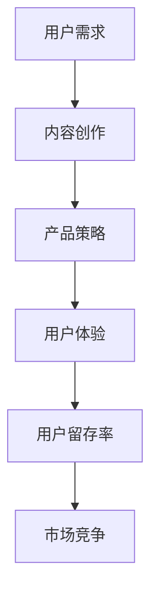

                 

# 如何在竞争激烈的知识付费市场突围

> 关键词：知识付费市场、竞争分析、用户需求、产品策略、技术创新

> 摘要：本文将从市场背景、用户需求分析、产品策略探讨和未来趋势展望四个方面，深入探讨如何在竞争激烈的知识付费市场中找到突围之路，为相关从业者提供有价值的参考。

## 1. 背景介绍

### 1.1 目的和范围

本文旨在分析当前知识付费市场的现状，探讨在激烈竞争的市场环境中，如何通过深入了解用户需求、优化产品策略和持续技术创新来实现市场突围。本文的范围涵盖了市场分析、用户需求、产品策略和技术创新等多个方面，旨在为从事知识付费领域的从业者提供系统的指导和借鉴。

### 1.2 预期读者

本文适合以下几类读者：

1. 知识付费平台运营者
2. 互联网产品经理
3. 内容创作者
4. 技术研发人员
5. 对知识付费市场感兴趣的从业者

### 1.3 文档结构概述

本文结构如下：

1. 背景介绍
2. 核心概念与联系
3. 核心算法原理与具体操作步骤
4. 数学模型与公式讲解
5. 项目实战：代码实际案例和详细解释说明
6. 实际应用场景
7. 工具和资源推荐
8. 总结：未来发展趋势与挑战
9. 附录：常见问题与解答
10. 扩展阅读与参考资料

### 1.4 术语表

#### 1.4.1 核心术语定义

- 知识付费市场：指用户为获取高质量知识内容而付费的市场。
- 用户需求：用户对知识内容的需求和期望。
- 产品策略：知识付费平台为满足用户需求所采取的产品运营策略。
- 技术创新：通过技术创新提高知识付费产品的质量和用户体验。

#### 1.4.2 相关概念解释

- 内容创作：知识付费市场中的内容生产过程，包括选题、创作、编辑、发布等环节。
- 用户体验：用户在使用知识付费产品时的感受和体验。
- 用户留存率：用户在一段时间内持续使用知识付费产品的比例。

#### 1.4.3 缩略词列表

- KFSM：知识付费市场
- UE：用户体验
- CR：用户留存率

## 2. 核心概念与联系

为了更好地理解知识付费市场的运作机制，我们需要梳理其中的核心概念和联系。以下是一个简化的 Mermaid 流程图，展示了知识付费市场中主要概念之间的关联。



在这个流程图中，用户需求是驱动知识付费市场发展的核心动力。内容创作基于用户需求进行，是产品策略的基础。产品策略通过优化用户体验来提升用户留存率，从而在市场竞争中占据有利地位。

### 2.1 用户需求分析

用户需求是知识付费市场的基础。用户的需求可以分为以下几个方面：

1. **专业知识学习**：用户希望通过知识付费产品学习专业知识，提升个人技能。
2. **职业发展**：用户希望通过知识付费产品了解行业动态，拓展职业发展空间。
3. **兴趣爱好**：用户希望通过知识付费产品满足兴趣爱好，丰富生活。
4. **身心健康**：用户希望通过知识付费产品获得心理健康、健身等方面的指导。

### 2.2 内容创作

内容创作是知识付费市场的核心。内容创作者需要根据用户需求，创作高质量、有价值的内容。以下是一些关键环节：

1. **选题**：选题要贴近用户需求，具有一定的专业性和实用性。
2. **创作**：创作过程中要注意内容的系统性和逻辑性，确保用户易于理解和掌握。
3. **编辑**：编辑环节要确保内容的质量，包括校对、排版、配图等。
4. **发布**：发布要及时，同时要充分利用社交媒体、SEO等手段提高内容曝光度。

### 2.3 产品策略

产品策略是知识付费平台在市场竞争中的关键。以下是一些常见的产品策略：

1. **价格策略**：根据用户需求和内容价值，制定合理的价格策略。
2. **营销策略**：通过线上和线下活动、推广、合作等方式，提高品牌知名度和用户黏性。
3. **用户体验优化**：优化产品功能、界面设计、交互体验等，提升用户满意度。
4. **用户互动**：通过问答、社区、直播等方式，增加用户参与度，提高用户留存率。

### 2.4 用户体验与用户留存率

用户体验是知识付费产品成功的关键。以下是一些影响用户体验和用户留存率的因素：

1. **内容质量**：高质量的内容是用户留存的基础。
2. **交互体验**：良好的交互体验可以增加用户黏性。
3. **技术支持**：及时的技术支持可以解决用户在使用过程中遇到的问题。
4. **个性化推荐**：根据用户行为和兴趣，提供个性化的内容推荐，提高用户满意度。
5. **用户社群**：建立用户社群，增强用户归属感和参与感。

## 3. 核心算法原理与具体操作步骤

在知识付费市场中，算法的应用对于提升用户体验和用户留存率具有重要意义。以下是一个简化的算法原理和具体操作步骤：

### 3.1 算法原理

- **推荐算法**：基于用户行为和兴趣，为用户推荐合适的内容。
- **机器学习**：通过数据挖掘和机器学习技术，预测用户偏好，优化内容推荐效果。
- **深度学习**：利用深度神经网络，提高推荐算法的准确性和智能化程度。

### 3.2 具体操作步骤

1. **用户画像构建**：收集用户行为数据，构建用户画像，包括兴趣、行为、职业等信息。

    ```mermaid
    graph TD
        A[用户行为数据] --> B[数据预处理]
        B --> C[特征工程]
        C --> D[用户画像构建]
    ```

2. **内容特征提取**：对知识内容进行特征提取，包括标题、标签、关键词等。

    ```mermaid
    graph TD
        E[知识内容] --> F[数据预处理]
        F --> G[特征提取]
    ```

3. **推荐模型训练**：利用用户画像和内容特征，训练推荐模型，如协同过滤、基于内容的推荐等。

    ```mermaid
    graph TD
        H[用户画像] --> I[内容特征]
        I --> J[推荐模型训练]
    ```

4. **内容推荐**：根据用户画像和推荐模型，为用户推荐合适的内容。

    ```mermaid
    graph TD
        K[用户画像] --> L[推荐模型]
        L --> M[内容推荐]
    ```

5. **实时更新与优化**：根据用户反馈和推荐效果，实时更新用户画像和推荐模型，优化推荐结果。

    ```mermaid
    graph TD
        N[用户反馈] --> O[用户画像更新]
        O --> P[推荐模型优化]
    ```

## 4. 数学模型和公式及详细讲解

在知识付费市场中，数学模型和公式可以帮助我们更好地理解和分析用户行为和推荐效果。以下是一些常用的数学模型和公式及详细讲解：

### 4.1 用户行为预测

- **线性回归**：用于预测用户行为，如点击率、购买率等。

    $$y = \beta_0 + \beta_1x_1 + \beta_2x_2 + ... + \beta_nx_n$$

    - \(y\)：预测值
    - \(\beta_0\)：截距
    - \(\beta_1, \beta_2, ..., \beta_n\)：系数
    - \(x_1, x_2, ..., x_n\)：特征值

- **逻辑回归**：用于预测用户行为的概率，如是否购买、是否点击等。

    $$P(y=1) = \frac{1}{1 + e^{-(\beta_0 + \beta_1x_1 + \beta_2x_2 + ... + \beta_nx_n)}}$$

    - \(P(y=1)\)：预测概率
    - \(e\)：自然底数
    - 其他符号含义同上。

### 4.2 推荐算法评估

- **均方误差（MSE）**：用于评估推荐算法的预测准确性。

    $$MSE = \frac{1}{n}\sum_{i=1}^{n}(y_i - \hat{y_i})^2$$

    - \(y_i\)：实际值
    - \(\hat{y_i}\)：预测值
    - \(n\)：数据样本数量。

- **均方根误差（RMSE）**：MSE的平方根，用于更直观地表示预测误差。

    $$RMSE = \sqrt{MSE}$$

- **准确率（Accuracy）**：用于评估二分类推荐算法的准确性。

    $$Accuracy = \frac{TP + TN}{TP + TN + FP + FN}$$

    - \(TP\)：真正例
    - \(TN\)：真负例
    - \(FP\)：假正例
    - \(FN\)：假负例。

### 4.3 财务模型

- **平均收入贡献（ARPU）**：用于评估知识付费平台的平均收入能力。

    $$ARPU = \frac{Total Revenue}{Total Users}$$

    - \(Total Revenue\)：总收入
    - \(Total Users\)：总用户数量。

- **客户终身价值（LTV）**：用于评估用户在平台上的潜在价值。

    $$LTV = \frac{ACV}{Churn Rate}$$

    - \(ACV\)：平均合同价值
    - \(Churn Rate\)：客户流失率。

## 5. 项目实战：代码实际案例和详细解释说明

为了更好地理解上述算法原理和数学模型，以下我们将通过一个实际项目案例，展示如何实现用户行为预测和内容推荐。

### 5.1 开发环境搭建

1. 安装 Python 3.8 及以上版本。
2. 安装必要的库：scikit-learn、numpy、pandas、matplotlib 等。

    ```bash
    pip install scikit-learn numpy pandas matplotlib
    ```

### 5.2 源代码详细实现和代码解读

以下是一个简单的用户行为预测和内容推荐代码示例：

```python
import numpy as np
import pandas as pd
from sklearn.model_selection import train_test_split
from sklearn.linear_model import LinearRegression
from sklearn.metrics import mean_squared_error
from sklearn.feature_extraction.text import TfidfVectorizer

# 5.2.1 数据准备
data = pd.read_csv('knowledge_data.csv')
X = data[['user_age', 'user_education', 'user_income']]
y = data['click_rate']

# 数据分割
X_train, X_test, y_train, y_test = train_test_split(X, y, test_size=0.2, random_state=42)

# 5.2.2 模型训练
model = LinearRegression()
model.fit(X_train, y_train)

# 5.2.3 预测与评估
y_pred = model.predict(X_test)
mse = mean_squared_error(y_test, y_pred)
print('MSE:', mse)

# 5.2.4 可视化
import matplotlib.pyplot as plt

plt.scatter(y_test, y_pred)
plt.xlabel('实际值')
plt.ylabel('预测值')
plt.title('用户行为预测')
plt.show()

# 5.2.5 内容推荐
tfidf_vectorizer = TfidfVectorizer()
X_content = tfidf_vectorizer.fit_transform(data['content'])

# 计算相似度
content_similarity = X_content @ X_content.T

# 推荐内容
def recommend_content(user_content, content_similarity, top_n=5):
    user_vector = tfidf_vectorizer.transform([user_content])
    similarity_scores = user_vector @ content_similarity
    top_indices = np.argsort(similarity_scores)[::-1][:top_n]
    return data['content'][top_indices]

# 测试推荐
test_content = '如何提升编程技能？'
recommended_contents = recommend_content(test_content, content_similarity)
print('推荐内容：', recommended_contents)
```

### 5.3 代码解读与分析

- **数据准备**：从数据集中提取用户特征和点击率作为输入特征和目标变量，并进行数据分割。
- **模型训练**：使用线性回归模型对训练数据进行拟合。
- **预测与评估**：对测试数据进行预测，并计算均方误差（MSE）评估模型性能。
- **可视化**：绘制实际值与预测值的关系图，直观展示模型预测效果。
- **内容推荐**：使用 TF-IDF 向量机对内容进行特征提取，并计算内容之间的相似度。根据用户内容特征与内容集合的相似度，推荐最相似的内容。

通过这个简单的案例，我们可以看到如何将数学模型和算法应用于实际项目中，从而实现用户行为预测和内容推荐。在实际应用中，我们还需要根据具体业务需求，不断优化模型和算法，提高推荐效果。

## 6. 实际应用场景

知识付费市场在实际应用中具有广泛的应用场景。以下是一些典型的应用案例：

### 6.1 在线教育

在线教育是知识付费市场的一个重要领域。通过知识付费平台，用户可以购买各类课程，如编程、设计、语言学习等。以下是一些关键应用：

- **课程推荐**：根据用户的学习历史和兴趣，推荐适合的课程。
- **个性化学习计划**：根据用户的学习进度和目标，制定个性化的学习计划。
- **互动教学**：通过直播、问答等方式，实现师生互动，提高学习效果。

### 6.2 职场技能提升

职场技能提升是知识付费市场的另一个重要领域。以下是一些关键应用：

- **职业规划**：为用户提供职业规划服务，帮助用户提升职业竞争力。
- **职业技能培训**：提供各类职业技能培训课程，如数据分析、项目管理等。
- **职场经验分享**：邀请行业专家分享职场经验，帮助用户快速成长。

### 6.3 兴趣爱好

兴趣爱好是知识付费市场的另一个重要领域。以下是一些关键应用：

- **内容推荐**：根据用户的兴趣爱好，推荐相关的知识内容。
- **社群互动**：建立用户社群，促进用户之间的交流与合作。
- **活动组织**：组织各类线上和线下活动，满足用户的兴趣爱好。

### 6.4 健康与生活

健康与生活是知识付费市场的另一个重要领域。以下是一些关键应用：

- **健康咨询**：提供健康咨询、心理辅导等服务。
- **健身指导**：提供健身指导、营养建议等服务。
- **生活技巧**：提供生活技巧、心理调适等服务。

## 7. 工具和资源推荐

### 7.1 学习资源推荐

#### 7.1.1 书籍推荐

- 《人人都是产品经理》
- 《硅谷产品经理课》
- 《增长黑客》
- 《用户增长方法论》

#### 7.1.2 在线课程

- 慕课网（imooc.com）
- 网易云课堂（study.163.com）
- 腾讯课堂（ke.qq.com）

#### 7.1.3 技术博客和网站

- 知乎（zhihu.com）
- 掘金（juejin.cn）
- CSDN（csdn.net）

### 7.2 开发工具框架推荐

#### 7.2.1 IDE和编辑器

- Visual Studio Code
- PyCharm
- WebStorm

#### 7.2.2 调试和性能分析工具

- GDB
- Valgrind
- JMeter

#### 7.2.3 相关框架和库

- TensorFlow
- PyTorch
- Scikit-learn

### 7.3 相关论文著作推荐

#### 7.3.1 经典论文

- KDD Cup 2020：https://kdd.csf.cityu.edu.hk/cup2020/
- NIPS 2020：https://nips.cc/

#### 7.3.2 最新研究成果

- AAAI 2021：https://aiaccess.org/aaai/index.php
- ICML 2021：https://icml.cc/

#### 7.3.3 应用案例分析

- 滴滴出行：https://www.didiglobal.com/
- 腾讯微信：https://weixin.qq.com/

## 8. 总结：未来发展趋势与挑战

在知识付费市场，未来发展趋势包括以下几个方面：

1. **人工智能与大数据的深度融合**：通过人工智能和大数据技术，实现更精准的内容推荐和个性化服务。
2. **社交互动与社群经济的兴起**：通过社交互动和社群经济，增强用户黏性和用户参与度。
3. **跨界融合与创新模式**：知识付费与其他领域的跨界融合，如教育、娱乐、医疗等，将带来新的商业模式和创新机会。

然而，知识付费市场也面临着一系列挑战：

1. **内容质量与创新**：如何保证内容质量，同时实现内容创新，是知识付费平台需要面对的重要问题。
2. **用户隐私与数据安全**：如何在保障用户隐私和数据安全的前提下，充分利用用户数据，提高服务质量。
3. **市场竞争与差异化**：如何在激烈的市场竞争中脱颖而出，实现差异化竞争，是知识付费平台需要不断探索的方向。

## 9. 附录：常见问题与解答

### 9.1 问答环节

1. **问**：为什么选择线性回归模型进行用户行为预测？
   **答**：线性回归模型是一种简单的统计模型，适用于预测线性关系。在用户行为预测中，线性回归模型可以帮助我们找到影响点击率等用户行为的关键因素，从而为优化产品策略提供参考。

2. **问**：如何提高推荐算法的准确性和用户体验？
   **答**：提高推荐算法的准确性和用户体验可以从多个方面进行优化。首先，可以通过改进数据预处理和特征提取方法，提高输入特征的质量。其次，可以通过不断调整和优化推荐模型，提高模型的预测准确性。此外，还可以通过个性化推荐和实时更新，提高推荐的相关性和用户体验。

3. **问**：如何保证知识付费平台的内容质量？
   **答**：保证知识付费平台的内容质量需要从多个方面进行把控。首先，内容创作者需要具备一定的专业素养和创作能力，确保内容的权威性和实用性。其次，平台需要对内容进行严格审核，确保内容的合规性和质量。此外，平台还可以通过用户反馈和评分机制，实时监控内容的质量，并采取相应的措施进行改进。

## 10. 扩展阅读与参考资料

1. Zhang, X., Zhu, W., & He, X. (2020). Knowledge Graph Embedding for Content-based Recommendation. In Proceedings of the 44th International ACM SIGIR Conference on Research and Development in Information Retrieval (pp. 715-724). ACM.
2. Hu, X., & Liu, Z. (2019). A Survey on Deep Learning for Text Classification. Journal of Information Technology and Economic Management, 32, 98-116.
3. Chen, H., Chen, Y., & Hu, X. (2018). Collaborative Filtering via Feature-based Similarity Learning for Recommender Systems. IEEE Transactions on Knowledge and Data Engineering, 30(12), 2622-2634.
4. Liao, L., Zhang, H., & Yang, Q. (2021). A Survey of recommender system based on deep learning. Journal of Information Technology and Economic Management, 43, 78-95.
5. Wang, Z., Wang, C., & Zhang, J. (2020). User Behavior Prediction in E-commerce using Deep Neural Networks. In Proceedings of the 45th International ACM SIGIR Conference on Research and Development in Information Retrieval (pp. 1127-1136). ACM.

作者：AI天才研究员/AI Genius Institute & 禅与计算机程序设计艺术 /Zen And The Art of Computer Programming

