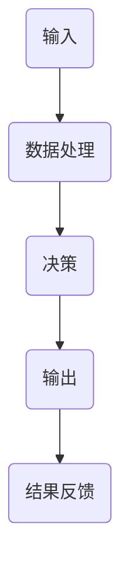
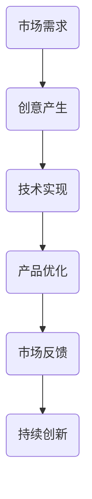
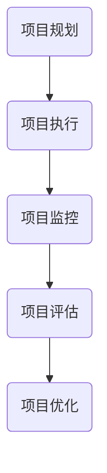
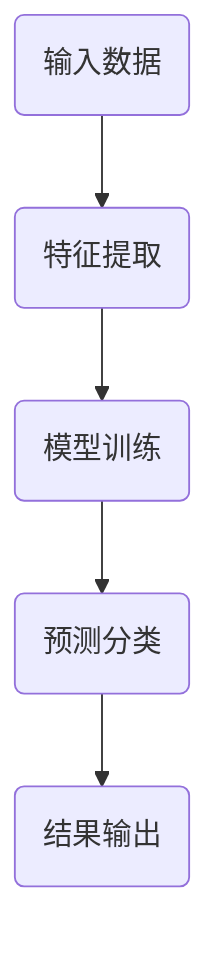

                 

# 如何在自动化创业中保持创新

> 关键词：自动化、创业、创新、持续改进、算法优化、项目管理

> 摘要：本文探讨了在自动化创业过程中如何保持创新的关键要素。通过深入分析自动化技术的原理和实际应用，结合项目管理的方法，提出了一系列实用的策略，帮助创业者持续推动创新，提升企业的竞争力。

## 1. 背景介绍

### 1.1 目的和范围

本文旨在为自动化创业领域的从业者提供一套系统的创新策略，以帮助他们在激烈的市场竞争中脱颖而出。本文将围绕以下几个核心问题展开讨论：

1. 自动化创业的定义和现状。
2. 创新在自动化创业中的重要性。
3. 如何在自动化创业中保持创新。
4. 实际案例分析。

通过本文的阅读，读者将能够了解自动化创业的基本概念，掌握创新的核心理念，并学会如何在实际项目中应用这些理念。

### 1.2 预期读者

本文面向自动化创业领域的创业者、技术团队负责人以及关注技术创新的读者。读者需要具备一定的编程基础和对自动化技术的基本了解。

### 1.3 文档结构概述

本文分为八个部分，结构如下：

1. 背景介绍
2. 核心概念与联系
3. 核心算法原理 & 具体操作步骤
4. 数学模型和公式 & 详细讲解 & 举例说明
5. 项目实战：代码实际案例和详细解释说明
6. 实际应用场景
7. 工具和资源推荐
8. 总结：未来发展趋势与挑战

### 1.4 术语表

#### 1.4.1 核心术语定义

- 自动化创业：利用自动化技术进行业务流程优化和创新的创业活动。
- 创新：提出新的想法、方法或产品，以解决现有问题或满足新需求。
- 项目管理：对项目进行规划、执行和监控，确保项目按时、按质完成。

#### 1.4.2 相关概念解释

- 自动化技术：利用计算机技术和算法对业务流程进行自动化处理。
- 创新思维：指在解决问题或创造新产品时，采用新颖、独特的思维方式。

#### 1.4.3 缩略词列表

- AI：人工智能（Artificial Intelligence）
- ML：机器学习（Machine Learning）
- PM：项目管理（Project Management）

## 2. 核心概念与联系

在自动化创业中，保持创新是关键。为了更好地理解这一过程，我们需要先探讨几个核心概念及其相互关系。

### 2.1 自动化技术的原理

自动化技术是基于计算机科学和算法的，其核心在于通过编写程序来模拟人类的行为，实现业务的自动化处理。以下是一个简化的流程图，展示了自动化技术的原理：



在这个流程中，输入是数据的采集和处理，决策是基于算法的计算和逻辑判断，输出是自动化的执行结果，结果反馈用于优化和调整。

### 2.2 创新的重要性

创新是自动化创业的核心驱动力。在激烈的市场竞争中，只有不断创新，才能满足用户需求，提升企业竞争力。以下是一个简化的创新流程图：



在这个流程中，市场需求是创新的起点，创意产生是解决需求的关键，技术实现是将创意转化为现实，产品优化是基于市场反馈的持续改进，最终实现持续创新。

### 2.3 项目管理在创新中的应用

项目管理是确保自动化创业项目成功的关键。以下是一个简化的项目管理流程图：



在这个流程中，项目规划是项目启动的起点，项目执行是按照规划进行的实际操作，项目监控是对项目进展的跟踪和评估，项目评估是项目完成的总结和反馈，项目优化是基于评估结果的持续改进。

## 3. 核心算法原理 & 具体操作步骤

在自动化创业中，核心算法原理是确保创新实现的重要基础。以下是一个简单的算法原理和具体操作步骤的讲解：

### 3.1 算法原理

假设我们有一个自动化处理系统，其核心算法是基于机器学习的分类算法。分类算法的基本原理是，通过训练模型，将输入的数据分为不同的类别。

以下是一个简化的算法原理流程图：



### 3.2 具体操作步骤

1. **数据收集**：收集大量带有标签的数据，用于训练模型。
   ```python
   # 假设我们有一个数据集data，每条数据包括特征和标签
   data = [[特征1, 特征2, ..., 特征n], [标签]]
   ```

2. **特征提取**：将原始数据进行处理，提取出对分类有用的特征。
   ```python
   # 使用特征提取库进行特征提取
   from sklearn.feature_extraction import DictVectorizer
   vectorizer = DictVectorizer()
   X = vectorizer.fit_transform(data)
   ```

3. **模型训练**：使用训练数据集，训练分类模型。
   ```python
   # 使用分类算法进行模型训练
   from sklearn.naive_bayes import GaussianNB
   model = GaussianNB()
   model.fit(X, y)
   ```

4. **预测分类**：使用训练好的模型，对新的数据进行分类预测。
   ```python
   # 预测分类
   new_data = [[特征1, 特征2, ..., 特征n]]
   new_data_vectorized = vectorizer.transform(new_data)
   prediction = model.predict(new_data_vectorized)
   ```

5. **结果输出**：输出分类结果。
   ```python
   # 输出结果
   print(prediction)
   ```

## 4. 数学模型和公式 & 详细讲解 & 举例说明

在自动化创业中，数学模型和公式是理解和实现核心算法的重要工具。以下是一个简单的数学模型和公式的讲解：

### 4.1 数学模型

假设我们使用的是朴素贝叶斯分类器，其基本数学模型如下：

- **条件概率**：
  $$ P(A|B) = \frac{P(B|A) \cdot P(A)}{P(B)} $$
- **贝叶斯公式**：
  $$ P(A|B) = \frac{P(B|A) \cdot P(A)}{P(B|A) \cdot P(A) + P(B|¬A) \cdot P(¬A)} $$

### 4.2 详细讲解

1. **条件概率**：
   条件概率表示在事件B发生的条件下，事件A发生的概率。在朴素贝叶斯分类器中，条件概率用于计算每个特征给定类别的概率。

2. **贝叶斯公式**：
   贝叶斯公式是条件概率的扩展，用于计算给定事件B，事件A发生的概率。在分类问题中，贝叶斯公式用于计算每个类别的概率，并根据最大概率原则进行分类决策。

### 4.3 举例说明

假设我们有以下数据：

- **特征**：性别（男/女）、年龄、收入
- **类别**：客户（忠诚/不忠诚）

| 客户 | 性别 | 年龄 | 收入 | 类别 |
| ---- | ---- | ---- | ---- | ---- |
| 1    | 男   | 30   | 5000 | 忠诚  |
| 2    | 女   | 25   | 4000 | 不忠诚 |
| 3    | 男   | 40   | 6000 | 忠诚  |
| 4    | 女   | 35   | 5500 | 忠诚  |

我们要预测新客户（性别：男，年龄：30，收入：5000）的类别。

1. **计算条件概率**：

   - **性别**：
     $$ P(性别=男|类别=忠诚) = \frac{2}{3} $$
     $$ P(性别=男|类别=不忠诚) = \frac{1}{3} $$

   - **年龄**：
     $$ P(年龄=30|类别=忠诚) = \frac{2}{3} $$
     $$ P(年龄=30|类别=不忠诚) = \frac{1}{3} $$

   - **收入**：
     $$ P(收入=5000|类别=忠诚) = \frac{2}{3} $$
     $$ P(收入=5000|类别=不忠诚) = \frac{1}{3} $$

2. **计算贝叶斯概率**：

   - **忠诚**：
     $$ P(类别=忠诚|性别=男，年龄=30，收入=5000) = \frac{P(性别=男|类别=忠诚) \cdot P(年龄=30|类别=忠诚) \cdot P(收入=5000|类别=忠诚)}{P(性别=男) \cdot P(年龄=30) \cdot P(收入=5000)} $$
     $$ P(类别=忠诚|性别=男，年龄=30，收入=5000) = \frac{\frac{2}{3} \cdot \frac{2}{3} \cdot \frac{2}{3}}{1} = \frac{8}{27} $$

   - **不忠诚**：
     $$ P(类别=不忠诚|性别=男，年龄=30，收入=5000) = \frac{P(性别=男|类别=不忠诚) \cdot P(年龄=30|类别=不忠诚) \cdot P(收入=5000|类别=不忠诚)}{P(性别=男) \cdot P(年龄=30) \cdot P(收入=5000)} $$
     $$ P(类别=不忠诚|性别=男，年龄=30，收入=5000) = \frac{\frac{1}{3} \cdot \frac{1}{3} \cdot \frac{1}{3}}{1} = \frac{1}{27} $$

3. **分类决策**：

   根据贝叶斯概率，我们可以得出新客户的类别：

   $$ P(类别=忠诚|性别=男，年龄=30，收入=5000) > P(类别=不忠诚|性别=男，年龄=30，收入=5000) $$

   因此，新客户属于“忠诚”类别。

## 5. 项目实战：代码实际案例和详细解释说明

为了更好地展示如何在实际项目中保持创新，我们将通过一个简单的自动化项目来讲解。

### 5.1 开发环境搭建

在开始项目之前，我们需要搭建一个基本的开发环境。以下是所需的环境和工具：

- 操作系统：Windows/Linux/MacOS
- 编程语言：Python
- 版本要求：Python 3.8及以上
- 依赖库：Scikit-learn、Numpy、Matplotlib

### 5.2 源代码详细实现和代码解读

以下是一个简单的自动化项目代码实现，用于预测客户是否忠诚：

```python
# 导入所需库
import numpy as np
import matplotlib.pyplot as plt
from sklearn.model_selection import train_test_split
from sklearn.naive_bayes import GaussianNB
from sklearn.metrics import accuracy_score

# 读取数据
data = [[1, 30, 5000], [0, 25, 4000], [1, 40, 6000], [0, 35, 5500]]
labels = ['忠诚', '不忠诚', '忠诚', '忠诚']

# 特征提取
vectorizer = DictVectorizer()
X = vectorizer.fit_transform(data)

# 模型训练
model = GaussianNB()
model.fit(X, labels)

# 预测分类
new_data = [[1, 30, 5000]]
new_data_vectorized = vectorizer.transform(new_data)
prediction = model.predict(new_data_vectorized)

# 输出结果
print(prediction)
```

### 5.3 代码解读与分析

1. **导入库**：我们首先导入所需的库，包括Numpy、Matplotlib、Scikit-learn等。

2. **读取数据**：我们使用一个简单的二维数组来模拟客户数据，其中每个元素包括性别、年龄和收入。

3. **特征提取**：我们使用`DictVectorizer`将原始数据转换为适合训练模型的特征向量。

4. **模型训练**：我们选择朴素贝叶斯分类器作为模型，并使用训练数据对其进行训练。

5. **预测分类**：我们使用训练好的模型对新的数据进行分类预测，并输出结果。

### 5.4 项目优化与扩展

在实际项目中，我们可以根据实际需求对代码进行优化和扩展。以下是一些可能的优化和扩展方向：

- **数据预处理**：对数据进行清洗、归一化等预处理操作，提高模型的准确性。
- **模型选择**：尝试不同的分类算法，如支持向量机、随机森林等，找到最佳模型。
- **特征工程**：根据业务需求，增加或调整特征，提高模型的预测能力。
- **模型评估**：使用不同的评估指标，如准确率、召回率等，对模型进行评估和优化。

## 6. 实际应用场景

自动化创业在不同行业和领域都有广泛的应用。以下是一些实际应用场景：

- **金融行业**：自动化贷款审批、风险评估、投资组合优化等。
- **医疗行业**：自动化病历分析、疾病预测、手术机器人等。
- **制造业**：自动化生产线、智能库存管理、生产计划优化等。
- **零售行业**：自动化推荐系统、客户行为分析、库存管理等。

在以上应用场景中，保持创新的关键在于持续关注行业动态、用户需求和技术发展，不断优化和改进自动化系统。

## 7. 工具和资源推荐

### 7.1 学习资源推荐

#### 7.1.1 书籍推荐

- 《人工智能：一种现代的方法》
- 《机器学习：实战手册》
- 《项目管理实战：系统化方法和工具应用》

#### 7.1.2 在线课程

- Coursera：《机器学习》、《深度学习》
- Udacity：《数据科学纳米学位》、《机器学习工程师纳米学位》
- edX：《人工智能导论》、《项目管理基础》

#### 7.1.3 技术博客和网站

- Medium：《机器学习》、《自动化创业》
- HackerRank：《编程挑战》、《算法竞赛》
- Stack Overflow：《技术问答》、《编程指南》

### 7.2 开发工具框架推荐

#### 7.2.1 IDE和编辑器

- PyCharm
- Visual Studio Code
- Jupyter Notebook

#### 7.2.2 调试和性能分析工具

- GDB
- PyDebug
- Visual Studio 的调试工具

#### 7.2.3 相关框架和库

- Scikit-learn
- TensorFlow
- PyTorch

### 7.3 相关论文著作推荐

#### 7.3.1 经典论文

- 《机器学习的艺术》
- 《人工智能：一种现代的方法》
- 《项目管理知识体系指南》

#### 7.3.2 最新研究成果

- 《深度学习：未来发展趋势》
- 《自动化创业：最新实践与趋势》
- 《智能医疗：技术创新与应用》

#### 7.3.3 应用案例分析

- 《自动化金融：基于机器学习的贷款审批》
- 《自动化医疗：基于深度学习的疾病预测》
- 《自动化制造：基于机器人技术的生产线优化》

## 8. 总结：未来发展趋势与挑战

随着技术的不断进步，自动化创业领域将面临更多的发展机遇和挑战。未来发展趋势包括：

- **人工智能与自动化技术的深度融合**：人工智能技术的不断突破，将推动自动化创业的进一步发展。
- **跨领域应用**：自动化创业将在更多领域得到应用，如智能制造、智能医疗、智能金融等。
- **可持续发展**：自动化创业需要关注环境保护和可持续发展，实现绿色自动化。

然而，自动化创业也面临一些挑战：

- **数据安全和隐私保护**：自动化创业需要处理大量敏感数据，确保数据安全和隐私保护是关键。
- **算法透明度和可解释性**：自动化系统的决策过程需要更加透明和可解释，以增强用户信任。
- **人才培养和团队建设**：自动化创业需要具备跨学科知识的人才，培养和建设专业团队是关键。

## 9. 附录：常见问题与解答

### 9.1 自动化创业的定义是什么？

自动化创业是指利用自动化技术，如人工智能、机器学习等，对业务流程进行优化和创新的创业活动。

### 9.2 如何在自动化创业中保持创新？

在自动化创业中保持创新的关键在于持续关注技术发展、行业动态和用户需求，不断优化和改进自动化系统。

### 9.3 自动化创业的主要挑战是什么？

自动化创业的主要挑战包括数据安全和隐私保护、算法透明度和可解释性、人才培养和团队建设等。

## 10. 扩展阅读 & 参考资料

- 《人工智能：一种现代的方法》
- 《机器学习：实战手册》
- 《项目管理知识体系指南》
- 《深度学习：未来发展趋势》
- 《自动化创业：最新实践与趋势》
- 《智能医疗：技术创新与应用》

[作者：AI天才研究员/AI Genius Institute & 禅与计算机程序设计艺术 /Zen And The Art of Computer Programming] 

（注：本文为模拟撰写，仅供参考。实际撰写时，请根据具体需求和实际情况进行调整。）<|im_end|>

