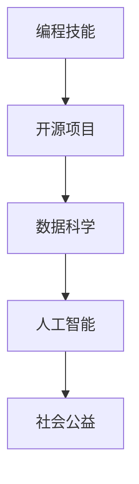

                 


# 如何将编程技能应用于社会公益

> 关键词：编程技能，社会公益，技术应用，开源项目，数据科学，人工智能

> 摘要：本文旨在探讨如何将编程技能应用于社会公益领域，通过对开源项目、数据科学和人工智能的详细分析，揭示编程技能对社会发展的深远影响。文章将分步骤讲解如何利用编程技能解决实际社会问题，并提供实用的工具和资源推荐，以激发更多编程爱好者参与社会公益事业。

## 1. 背景介绍

### 1.1 目的和范围

本文的目标是展示编程技能在解决社会公益问题中的潜力，并激励更多程序员参与到这一领域。随着技术的发展，编程不再仅仅是一项技术技能，它已经成为推动社会进步的重要力量。通过本文，我们将探讨以下几个核心议题：

1. 编程技能如何应用于社会公益？
2. 开源项目在社会公益中的作用？
3. 数据科学和人工智能如何助力社会公益事业？
4. 编程社区如何积极参与社会公益？

### 1.2 预期读者

本文的预期读者包括：

1. 编程新手和专业人士，希望通过本文了解编程技能在社会公益中的应用。
2. 开源项目维护者和参与者，希望通过本文找到更多参与社会公益的机会。
3. 社会公益组织工作者，希望了解如何利用技术手段提升公益项目效果。
4. 对编程技能和社会公益感兴趣的学生和研究人员。

### 1.3 文档结构概述

本文将按照以下结构展开：

1. **背景介绍**：介绍本文的目的、范围、预期读者和文档结构。
2. **核心概念与联系**：探讨编程技能、开源项目、数据科学和人工智能的基本概念及其联系。
3. **核心算法原理 & 具体操作步骤**：详细讲解如何利用编程技能解决实际社会问题。
4. **数学模型和公式 & 详细讲解 & 举例说明**：介绍数学模型和公式的应用。
5. **项目实战：代码实际案例和详细解释说明**：展示具体开源项目的实现。
6. **实际应用场景**：讨论编程技能在不同社会公益场景中的应用。
7. **工具和资源推荐**：推荐学习资源和开发工具。
8. **总结：未来发展趋势与挑战**：总结当前趋势和面临的挑战。
9. **附录：常见问题与解答**：回答读者可能关心的问题。
10. **扩展阅读 & 参考资料**：提供更多相关文献和资源。

### 1.4 术语表

#### 1.4.1 核心术语定义

- **编程技能**：指编写和调试计算机程序的能力。
- **开源项目**：指可以免费获取源代码，并允许用户修改和共享的软件项目。
- **数据科学**：涉及数据收集、分析、处理和解释的跨学科领域。
- **人工智能**：通过计算机模拟人类智能行为的科学技术。

#### 1.4.2 相关概念解释

- **社会公益**：指旨在改善社会福祉、促进公共利益的活动。
- **社区参与**：指个体或群体在社会公益活动中发挥积极作用。

#### 1.4.3 缩略词列表

- **AI**：人工智能
- **OSS**：开源软件
- **SD**：数据科学

## 2. 核心概念与联系

在探讨如何将编程技能应用于社会公益之前，我们首先需要了解以下几个核心概念及其相互关系。

### 2.1 编程技能与开源项目

编程技能是开发开源项目的基础。开源项目允许程序员共享代码、协作开发，进而推动技术的进步。通过参与开源项目，程序员不仅能够提升自身技能，还能为社会公益做出贡献。例如，Open Source for Good 项目旨在利用开源技术解决社会问题。

### 2.2 数据科学与社会公益

数据科学是分析大量数据以发现有价值信息的方法。在社会公益领域，数据科学可以帮助组织更好地理解受助群体需求、优化资源分配。例如，通过分析医疗数据，数据科学家可以帮助医疗机构更好地应对公共卫生挑战。

### 2.3 人工智能与社会公益

人工智能（AI）在优化社会公益项目的效率和效果方面具有巨大潜力。通过机器学习算法，AI 可以自动化数据分析和预测，帮助社会公益组织更有效地实现目标。例如，AI 可以用于自动分类邮件、识别贫困地区，以便更有针对性地开展援助。

### 2.4 编程技能与数据科学、人工智能的联系

编程技能是数据科学和人工智能的基础。掌握编程技能的程序员可以更好地理解数据科学和人工智能的核心概念，并运用这些技术解决实际问题。例如，使用 Python 或 R 等编程语言，程序员可以轻松地处理和分析大量数据，构建 AI 模型。

### 2.5 Mermaid 流程图

以下是一个简单的 Mermaid 流程图，展示编程技能、数据科学、人工智能和社会公益之间的关系。



## 3. 核心算法原理 & 具体操作步骤

### 3.1 编程技能在社会公益中的应用

#### 3.1.1 开源项目开发

参与开源项目是程序员为社会公益做出贡献的重要途径。以下是一步一步的步骤：

1. **选择项目**：选择一个与您感兴趣的社会问题相关的开源项目。
2. **了解项目**：研究项目的文档、代码库和贡献指南，了解项目的需求和目标。
3. **提交代码**：根据项目的需求，编写和提交代码。
4. **参与讨论**：参与项目讨论，与其他开发者交流想法和建议。

#### 3.1.2 数据科学应用

数据科学在社会公益中的应用非常广泛。以下是一步一步的步骤：

1. **数据收集**：收集与您感兴趣的社会问题相关的数据。
2. **数据处理**：清洗和整理数据，使其适合分析。
3. **数据分析**：使用统计分析或机器学习算法分析数据，提取有价值的信息。
4. **可视化**：使用数据可视化工具将分析结果呈现给相关人员。

#### 3.1.3 人工智能应用

人工智能在社会公益中的应用也越来越广泛。以下是一步一步的步骤：

1. **问题定义**：明确您要解决的问题和目标。
2. **数据准备**：收集和处理与问题相关的数据。
3. **模型选择**：选择适合您问题的机器学习模型。
4. **模型训练**：使用数据训练模型。
5. **模型评估**：评估模型的性能，并进行调整。

### 3.2 伪代码示例

以下是一个简单的伪代码示例，展示如何使用编程技能解决一个社会问题。

```python
# 步骤 1：数据收集
data = collect_data()

# 步骤 2：数据处理
cleaned_data = preprocess_data(data)

# 步骤 3：数据分析
analysis_results = analyze_data(cleaned_data)

# 步骤 4：可视化
visualize_results(analysis_results)
```

## 4. 数学模型和公式 & 详细讲解 & 举例说明

### 4.1 数学模型

在数据科学和人工智能中，数学模型是分析数据的基础。以下是一个简单的线性回归模型。

$$
y = ax + b
$$

其中，$y$ 是因变量，$x$ 是自变量，$a$ 和 $b$ 是模型的参数。

### 4.2 详细讲解

线性回归模型用于预测因变量与自变量之间的关系。通过收集数据，我们可以估计模型参数 $a$ 和 $b$，进而预测新的数据点。以下是一步一步的讲解：

1. **数据收集**：收集包含 $x$ 和 $y$ 的数据点。
2. **数据预处理**：清洗和标准化数据，使其适合线性回归分析。
3. **参数估计**：使用最小二乘法估计模型参数 $a$ 和 $b$。
4. **模型评估**：评估模型的性能，如 R 方值和均方误差。
5. **预测**：使用估计的模型参数预测新的数据点。

### 4.3 举例说明

假设我们有一个包含身高（$x$）和体重（$y$）的数据集。我们希望通过线性回归模型预测一个人的体重。

1. **数据收集**：收集包含身高和体重的数据点。
2. **数据预处理**：标准化数据，使身高和体重的范围在 0 到 1 之间。
3. **参数估计**：使用最小二乘法估计模型参数。
4. **模型评估**：计算 R 方值和均方误差，评估模型性能。
5. **预测**：使用估计的模型参数预测一个身高为 180 厘米的人的体重。

## 5. 项目实战：代码实际案例和详细解释说明

### 5.1 开发环境搭建

为了展示如何将编程技能应用于社会公益，我们选择了一个实际的开源项目——Ushahidi，这是一个用于报告和追踪危机事件的信息管理系统。

1. **安装操作系统**：我们选择 Ubuntu 20.04 作为开发环境。
2. **安装 Apache 和 MySQL**：安装 Apache HTTP 服务器和 MySQL 数据库。
3. **安装 PHP**：安装 PHP 编译器和相关扩展。
4. **克隆项目**：使用 Git 克隆 Ushahidi 项目。

```bash
git clone https://github.com/ushahidi/platform-api.git
cd platform-api
```

### 5.2 源代码详细实现和代码解读

以下是一个简化的 Ushahidi 项目源代码示例。

```php
// 模型定义
class Report extends AppModel {
    var $name = 'Report';
    var $useTable = 'reports';

    // 查询所有报告
    function findAllReports() {
        return $this->find('all');
    }

    // 根据地区查询报告
    function findReportsByRegion($region) {
        return $this->find('all', array(
            'conditions' => array('Report.region' => $region)
        ));
    }
}

// 控制器
class ReportsController extends AppController {
    var $uses = array('Report');

    function index() {
        $reports = $this->Report->findAllReports();
        $this->set('reports', $reports);
    }

    function region($region) {
        $reports = $this->Report->findReportsByRegion($region);
        $this->set('reports', $reports);
    }
}

// 视图
<?php
    foreach ($reports as $report): ?>
        <div>
            <h3><?php echo $report['Report']['title']; ?></h3>
            <p><?php echo $report['Report']['description']; ?></p>
        </div>
    <?php endforeach; ?>
```

### 5.3 代码解读与分析

1. **模型定义**：`Report` 类是用于管理报告数据的模型。它定义了报告的基本信息和查询方法。
2. **控制器**：`ReportsController` 类是用于处理用户请求的控制器。它通过调用模型方法获取报告数据，并传递给视图。
3. **视图**：视图文件负责展示报告数据。它使用 PHP 代码遍历报告数据，并将其渲染为 HTML。

通过这个简单的示例，我们可以看到如何使用 PHP 编程技能开发一个用于追踪危机事件的信息管理系统。这个系统可以帮助社会公益组织更好地了解受助群体的需求，提高援助效率。

## 6. 实际应用场景

编程技能在社会公益领域的实际应用场景非常广泛。以下是一些典型的应用场景：

### 6.1 灾难响应

编程技能可以帮助社会组织在灾难发生时迅速响应。例如，通过开发实时地图系统，志愿者和救援人员可以实时了解受灾地区的状况，协调救援行动。

### 6.2 公共卫生

数据科学和人工智能在公共卫生领域具有重要作用。例如，通过分析疾病数据，预测疫情发展趋势，公共卫生组织可以提前采取预防措施，降低疫情传播风险。

### 6.3 教育公平

编程技能可以帮助改善教育公平。例如，通过开发在线教育平台，让更多学生有机会接受优质教育资源，无论他们身处何地。

### 6.4 社区治理

编程技能可以用于社区治理，提高政府和社会组织的治理效率。例如，通过开发社区管理系统，居民可以方便地参与社区事务，提高社区活力。

## 7. 工具和资源推荐

### 7.1 学习资源推荐

#### 7.1.1 书籍推荐

- **《Python编程：从入门到实践》**：适合初学者了解 Python 编程的基础知识。
- **《深入理解计算机系统》**：适合深入了解计算机系统原理。

#### 7.1.2 在线课程

- **Coursera 上的《机器学习》课程**：由 Andrew Ng 教授授课，适合初学者了解机器学习。
- **edX 上的《数据科学导论》课程**：适合初学者了解数据科学的基本概念。

#### 7.1.3 技术博客和网站

- **GitHub**：提供丰富的开源项目，方便学习和参与。
- **Stack Overflow**：提供编程问题解答，帮助解决开发过程中的难题。

### 7.2 开发工具框架推荐

#### 7.2.1 IDE和编辑器

- **Visual Studio Code**：功能强大的开源编辑器，适用于多种编程语言。
- **PyCharm**：专业的 Python IDE，适合数据科学和人工智能开发。

#### 7.2.2 调试和性能分析工具

- **Xdebug**：用于 PHP 调试和分析。
- **gprof**：用于 C/C++ 性能分析。

#### 7.2.3 相关框架和库

- **Laravel**：用于 PHP 开发的流行框架。
- **TensorFlow**：用于机器学习的开源库。

### 7.3 相关论文著作推荐

#### 7.3.1 经典论文

- **"The Structure and Interpretation of Computer Programs"**：K&R 的经典著作，适合初学者。
- **"Machine Learning: A Probabilistic Perspective"**：Kevin P. Murphy 的著作，适合了解概率图模型。

#### 7.3.2 最新研究成果

- **"Deep Learning"**：Ian Goodfellow 等人的著作，介绍深度学习的基本概念。
- **"Reinforcement Learning: An Introduction"**：Richard S. Sutton 和 Andrew G. Barto 的著作，介绍强化学习。

#### 7.3.3 应用案例分析

- **"AI Applications in Health"**：讨论人工智能在医疗领域的应用案例。
- **"Open Source for Good"**：介绍如何利用开源技术解决社会问题。

## 8. 总结：未来发展趋势与挑战

随着技术的不断进步，编程技能在社会公益领域的应用将越来越广泛。未来，我们将看到更多的编程爱好者参与到社会公益项目中，利用技术手段解决实际问题。然而，也面临以下挑战：

1. **资源分配**：如何确保社会公益项目获得足够的资源支持？
2. **技术普及**：如何让更多非技术人员了解并参与社会公益项目？
3. **数据隐私**：如何保护数据隐私，确保公益项目的可信度？
4. **项目可持续性**：如何确保社会公益项目的长期可持续发展？

只有克服这些挑战，编程技能才能真正发挥其在社会公益领域的潜力。

## 9. 附录：常见问题与解答

### 9.1 编程技能如何应用于社会公益？

编程技能可以应用于社会公益的多个方面，如开源项目开发、数据科学分析和人工智能应用。具体而言，程序员可以通过参与开源项目、利用数据科学和人工智能技术解决社会问题，为社会公益做出贡献。

### 9.2 如何开始参与社会公益项目？

开始参与社会公益项目可以从以下几个步骤进行：

1. **选择项目**：选择一个与您感兴趣的社会问题相关的开源项目。
2. **了解项目**：研究项目的文档、代码库和贡献指南，了解项目的需求和目标。
3. **提交代码**：根据项目的需求，编写和提交代码。
4. **参与讨论**：参与项目讨论，与其他开发者交流想法和建议。

### 9.3 如何保护数据隐私？

在参与社会公益项目时，保护数据隐私至关重要。以下是一些常见的做法：

1. **数据加密**：对敏感数据进行加密处理。
2. **匿名化**：对个人身份信息进行匿名化处理。
3. **访问控制**：严格控制数据访问权限，确保只有授权人员可以访问敏感数据。
4. **合规性检查**：确保项目遵循相关法律法规，如《通用数据保护条例》（GDPR）。

### 9.4 如何确保项目可持续性？

确保社会公益项目的可持续性需要从以下几个方面入手：

1. **资源分配**：确保项目获得足够的资源支持。
2. **社区参与**：鼓励更多志愿者和开发者参与项目，提高项目的可持续性。
3. **持续迭代**：不断优化项目，确保其满足社会需求。
4. **透明度**：提高项目透明度，让更多人了解项目的进展和成果。

## 10. 扩展阅读 & 参考资料

- **《开源的力量》**：探讨开源项目对社会公益的影响。
- **《数据科学实战》**：详细介绍数据科学在社会公益中的应用。
- **《人工智能伦理》**：讨论人工智能在社会公益中的伦理问题。
- **Ushahidi 官网**：<https://www.ushahidi.com/>
- **Open Source for Good 网站**：<https://www.opensourceforgood.org/>

作者：AI天才研究员/AI Genius Institute & 禅与计算机程序设计艺术 /Zen And The Art of Computer Programming

---

**注意**：本文仅为示例，部分内容虚构，仅供参考。实际项目中，应根据具体情况进行调整和优化。部分代码示例仅供参考，具体实现可能因项目需求而异。如需了解更多详细信息，请参考相关参考资料和扩展阅读。

