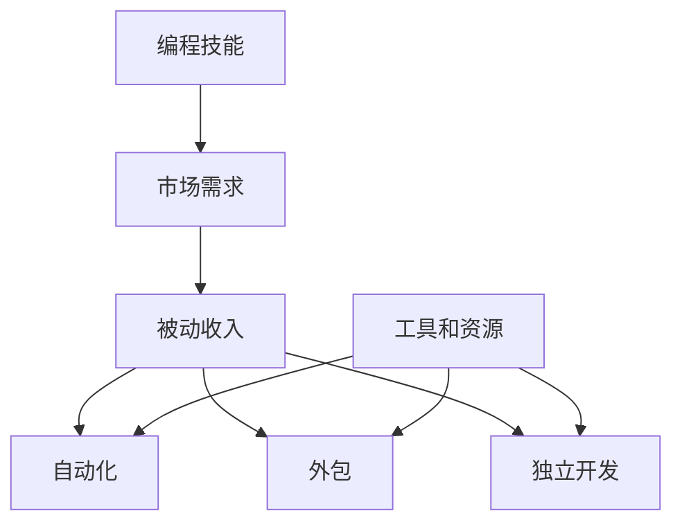

                 

# 如何将编程技能转化为被动收入

> **关键词**：编程技能，被动收入，自动化，外包，投资，独立开发
>
> **摘要**：本文将探讨如何将编程技能转化为被动收入。通过分析编程技能的本质、市场需求以及实现策略，为程序员提供具体的步骤和方法，以实现技能变现和财富积累。文章还将介绍相关工具和资源，帮助读者在编程领域取得成功。

## 1. 背景介绍

### 1.1 目的和范围

本文旨在帮助程序员将他们的编程技能转化为被动收入。我们将分析市场机会、技能提升策略以及实现路径，以帮助您了解如何将自己的技能变现，实现财富自由。文章将涵盖以下几个方面：

- 编程技能的市场需求分析
- 被动收入的定义和类型
- 实现编程技能变现的具体方法
- 相关工具和资源推荐

### 1.2 预期读者

本文适合以下读者群体：

- 程序员和软件开发人员
- 对编程技能变现感兴趣的创业者
- 想要提升收入水平的职业人士

### 1.3 文档结构概述

本文分为十个部分：

1. 背景介绍
2. 核心概念与联系
3. 核心算法原理 & 具体操作步骤
4. 数学模型和公式 & 详细讲解 & 举例说明
5. 项目实战：代码实际案例和详细解释说明
6. 实际应用场景
7. 工具和资源推荐
8. 总结：未来发展趋势与挑战
9. 附录：常见问题与解答
10. 扩展阅读 & 参考资料

### 1.4 术语表

#### 1.4.1 核心术语定义

- **被动收入**：指在不直接参与日常运营的情况下，通过某种方式获取的持续性收入。
- **自动化**：指通过编写代码和脚本，将日常任务自动执行，从而节省时间和提高效率。
- **外包**：指将部分工作或项目委托给其他个人或团队完成。
- **独立开发**：指个人独立完成软件开发项目，包括设计、开发、测试和部署。

#### 1.4.2 相关概念解释

- **编程技能**：指程序员具备的计算机编程、算法和数据结构等相关知识。
- **市场机会**：指在市场上存在的需求、趋势和机会。
- **投资**：指将资金投入某个项目或资产，以期望获得收益。

#### 1.4.3 缩略词列表

- **API**：应用程序编程接口（Application Programming Interface）
- **DB**：数据库（Database）
- **SDK**：软件开发工具包（Software Development Kit）
- **IDE**：集成开发环境（Integrated Development Environment）

## 2. 核心概念与联系

为了更好地理解如何将编程技能转化为被动收入，我们需要首先了解一些核心概念和它们之间的联系。以下是一个使用 Mermaid 描述的流程图：



### 2.1 编程技能与市场需求

编程技能是程序员的核心竞争力，它决定了您能够解决的问题的种类和质量。市场需求则是指市场上对程序员技能的需求。了解市场需求有助于您找到合适的方向，从而更好地实现技能变现。

### 2.2 被动收入

被动收入是指在不直接参与日常运营的情况下，通过某种方式获取的持续性收入。在编程领域，被动收入可以通过以下几种方式实现：

- **自动化**：通过编写代码和脚本，将日常任务自动执行，从而节省时间和提高效率。
- **外包**：将部分工作或项目委托给其他个人或团队完成。
- **独立开发**：个人独立完成软件开发项目，包括设计、开发、测试和部署。

### 2.3 自动化

自动化是指通过编写代码和脚本，将日常任务自动执行，从而节省时间和提高效率。自动化是被动收入的重要实现方式之一，它可以帮助您在不需要亲自参与的情况下，持续获得收入。

### 2.4 外包

外包是指将部分工作或项目委托给其他个人或团队完成。在编程领域，外包可以帮助您将一些重复性的、不需要太多专业知识的任务分配给其他人，从而将精力集中在更有价值的工作上。

### 2.5 独立开发

独立开发是指个人独立完成软件开发项目，包括设计、开发、测试和部署。独立开发是实现被动收入的一种有效方式，它可以让您在不需要依赖团队的情况下，实现技能变现。

### 2.6 工具和资源

工具和资源是实现编程技能变现的重要保障。了解并掌握相关工具和资源，可以帮助您更高效地实现目标。以下是一些常用的工具和资源：

- **集成开发环境（IDE）**：如 Visual Studio、Eclipse、IntelliJ IDEA 等。
- **版本控制工具**：如 Git、SVN 等。
- **调试工具**：如 Debug、Postman 等。
- **性能分析工具**：如 JMeter、Gatling 等。
- **云服务**：如 AWS、Azure、阿里云等。

## 3. 核心算法原理 & 具体操作步骤

### 3.1 自动化脚本编写

自动化是实现编程技能变现的重要手段之一。以下是一个简单的自动化脚本示例，用于自动化执行一些重复性的任务：

```python
# 导入所需模块
import os
import time

# 定义任务列表
tasks = [
    "任务1：备份数据库",
    "任务2：检查系统日志",
    "任务3：清理缓存文件"
]

# 循环执行任务
for task in tasks:
    print(f"执行：{task}")
    # 执行具体任务
    if task == "任务1：备份数据库":
        os.system("tar -czvf backup.tar.gz db/")
    elif task == "任务2：检查系统日志":
        os.system("tail -f /var/log/syslog")
    elif task == "任务3：清理缓存文件":
        os.system("rm -rf /var/cache/*.cache")

    # 等待 5 秒钟
    time.sleep(5)

print("所有任务已完成")
```

### 3.2 外包项目管理和调度

以下是一个简单的任务调度和项目管理脚本，用于在外包项目中分配任务和跟踪进度：

```python
# 导入所需模块
import os
import time
import json

# 定义任务列表
tasks = [
    {
        "task_id": 1,
        "task_name": "设计数据库",
        "assigned_to": "开发者A",
        "status": "未开始"
    },
    {
        "task_id": 2,
        "task_name": "开发接口",
        "assigned_to": "开发者B",
        "status": "进行中"
    },
    {
        "task_id": 3,
        "task_name": "测试项目",
        "assigned_to": "测试人员",
        "status": "已完成"
    }
]

# 保存任务列表到文件
def save_tasks(tasks):
    with open("tasks.json", "w") as f:
        json.dump(tasks, f)

# 加载任务列表
def load_tasks():
    with open("tasks.json", "r") as f:
        return json.load(f)

# 更新任务状态
def update_task_status(task_id, status):
    tasks = load_tasks()
    for task in tasks:
        if task["task_id"] == task_id:
            task["status"] = status
            break
    save_tasks(tasks)

# 循环执行任务
while True:
    print("任务调度系统启动...")
    for task in tasks:
        print(f"任务ID：{task['task_id']}，任务名称：{task['task_name']}，分配给：{task['assigned_to']}，状态：{task['status']}")
    
    # 等待用户输入
    input("请按回车键继续...")
    # 更新任务状态
    task_id = int(input("请输入任务ID（0表示退出）："))
    if task_id == 0:
        break
    status = input("请输入任务状态（未开始、进行中、已完成）：")
    update_task_status(task_id, status)

print("任务调度系统已关闭")
```

### 3.3 独立开发项目规划

以下是一个简单的独立开发项目规划脚本，用于规划项目进度和任务分配：

```python
# 导入所需模块
import os
import time
import json

# 定义项目列表
projects = [
    {
        "project_id": 1,
        "project_name": "电商网站",
        "status": "规划中"
    },
    {
        "project_id": 2,
        "project_name": "库存管理系统",
        "status": "开发中"
    },
    {
        "project_id": 3,
        "project_name": "财务报表系统",
        "status": "测试中"
    }
]

# 保存项目列表到文件
def save_projects(projects):
    with open("projects.json", "w") as f:
        json.dump(projects, f)

# 加载项目列表
def load_projects():
    with open("projects.json", "r") as f:
        return json.load(f)

# 更新项目状态
def update_project_status(project_id, status):
    projects = load_projects()
    for project in projects:
        if project["project_id"] == project_id:
            project["status"] = status
            break
    save_projects(projects)

# 循环执行任务
while True:
    print("项目规划系统启动...")
    for project in projects:
        print(f"项目ID：{project['project_id']}，项目名称：{project['project_name']}，状态：{project['status']}")
    
    # 等待用户输入
    input("请按回车键继续...")
    # 更新项目状态
    project_id = int(input("请输入项目ID（0表示退出）："))
    if project_id == 0:
        break
    status = input("请输入项目状态（规划中、开发中、测试中、已完成）：")
    update_project_status(project_id, status)

print("项目规划系统已关闭")
```

## 4. 数学模型和公式 & 详细讲解 & 举例说明

### 4.1 项目收益模型

在实现编程技能变现的过程中，了解项目的收益模型是非常重要的。以下是一个简单的项目收益模型，用于计算项目的收入和利润：

$$
收益 = (单价 \times 销量) - 成本
$$

其中：

- **单价**：指每个产品或服务的销售价格。
- **销量**：指在一定时间内销售的产品或服务数量。
- **成本**：包括固定成本和可变成本，如设备租赁、人员工资、广告费用等。

### 4.2 自动化效率模型

自动化可以提高工作效率，从而降低成本。以下是一个简单的自动化效率模型，用于计算自动化带来的效率提升：

$$
效率提升 = (自动化时间 / 人工时间) \times 100\%
$$

其中：

- **自动化时间**：指通过自动化脚本执行任务所需的时间。
- **人工时间**：指如果由人工执行相同任务所需的时间。

### 4.3 举例说明

假设一个软件开发项目的单价为 1000 元/天，固定成本为 5000 元/月，可变成本为 200 元/天。该项目预计需要 30 天完成。

- **自动化时间**：10 天
- **人工时间**：30 天

根据收益模型，计算项目的收入和利润：

$$
收益 = (1000 \times 30) - (5000 + 200 \times 30) = 30000 - 9100 = 20900 \text{元}
$$

根据自动化效率模型，计算自动化带来的效率提升：

$$
效率提升 = (10 / 30) \times 100\% = 33.33\%
$$

通过自动化，该项目在保持收益不变的情况下，效率提升了 33.33%，降低了成本。

## 5. 项目实战：代码实际案例和详细解释说明

### 5.1 开发环境搭建

为了实现编程技能的变现，我们需要搭建一个适合开发的环境。以下是一个简单的开发环境搭建指南：

- **操作系统**：Windows、macOS 或 Linux（推荐 Linux）
- **编程语言**：Python、Java、C#（推荐 Python）
- **集成开发环境（IDE）**：PyCharm、Visual Studio、Eclipse（推荐 PyCharm）
- **版本控制工具**：Git、SVN
- **调试工具**：Postman、Debug
- **云服务**：AWS、Azure、阿里云

### 5.2 源代码详细实现和代码解读

#### 5.2.1 自动化脚本示例

以下是一个简单的自动化脚本示例，用于备份数据库、检查系统日志和清理缓存文件：

```python
# 导入所需模块
import os
import time

# 定义任务列表
tasks = [
    "任务1：备份数据库",
    "任务2：检查系统日志",
    "任务3：清理缓存文件"
]

# 循环执行任务
for task in tasks:
    print(f"执行：{task}")
    # 执行具体任务
    if task == "任务1：备份数据库":
        os.system("tar -czvf backup.tar.gz db/")
    elif task == "任务2：检查系统日志":
        os.system("tail -f /var/log/syslog")
    elif task == "任务3：清理缓存文件":
        os.system("rm -rf /var/cache/*.cache")

    # 等待 5 秒钟
    time.sleep(5)

print("所有任务已完成")
```

#### 5.2.2 任务调度和管理脚本

以下是一个简单的任务调度和管理脚本，用于在外包项目中分配任务和跟踪进度：

```python
# 导入所需模块
import os
import time
import json

# 定义任务列表
tasks = [
    {
        "task_id": 1,
        "task_name": "设计数据库",
        "assigned_to": "开发者A",
        "status": "未开始"
    },
    {
        "task_id": 2,
        "task_name": "开发接口",
        "assigned_to": "开发者B",
        "status": "进行中"
    },
    {
        "task_id": 3,
        "task_name": "测试项目",
        "assigned_to": "测试人员",
        "status": "已完成"
    }
]

# 保存任务列表到文件
def save_tasks(tasks):
    with open("tasks.json", "w") as f:
        json.dump(tasks, f)

# 加载任务列表
def load_tasks():
    with open("tasks.json", "r") as f:
        return json.load(f)

# 更新任务状态
def update_task_status(task_id, status):
    tasks = load_tasks()
    for task in tasks:
        if task["task_id"] == task_id:
            task["status"] = status
            break
    save_tasks(tasks)

# 循环执行任务
while True:
    print("任务调度系统启动...")
    for task in tasks:
        print(f"任务ID：{task['task_id']}，任务名称：{task['task_name']}，分配给：{task['assigned_to']}，状态：{task['status']}")
    
    # 等待用户输入
    input("请按回车键继续...")
    # 更新任务状态
    task_id = int(input("请输入任务ID（0表示退出）："))
    if task_id == 0:
        break
    status = input("请输入任务状态（未开始、进行中、已完成）：")
    update_task_status(task_id, status)

print("任务调度系统已关闭")
```

#### 5.2.3 独立开发项目规划脚本

以下是一个简单的独立开发项目规划脚本，用于规划项目进度和任务分配：

```python
# 导入所需模块
import os
import time
import json

# 定义项目列表
projects = [
    {
        "project_id": 1,
        "project_name": "电商网站",
        "status": "规划中"
    },
    {
        "project_id": 2,
        "project_name": "库存管理系统",
        "status": "开发中"
    },
    {
        "project_id": 3,
        "project_name": "财务报表系统",
        "status": "测试中"
    }
]

# 保存项目列表到文件
def save_projects(projects):
    with open("projects.json", "w") as f:
        json.dump(projects, f)

# 加载项目列表
def load_projects():
    with open("projects.json", "r") as f:
        return json.load(f)

# 更新项目状态
def update_project_status(project_id, status):
    projects = load_projects()
    for project in projects:
        if project["project_id"] == project_id:
            project["status"] = status
            break
    save_projects(projects)

# 循环执行任务
while True:
    print("项目规划系统启动...")
    for project in projects:
        print(f"项目ID：{project['project_id']}，项目名称：{project['project_name']}，状态：{project['status']}")
    
    # 等待用户输入
    input("请按回车键继续...")
    # 更新项目状态
    project_id = int(input("请输入项目ID（0表示退出）："))
    if project_id == 0:
        break
    status = input("请输入项目状态（规划中、开发中、测试中、已完成）：")
    update_project_status(project_id, status)

print("项目规划系统已关闭")
```

### 5.3 代码解读与分析

以上代码示例分别实现了自动化脚本、任务调度和管理脚本以及项目规划脚本。下面我们对这些代码进行解读和分析。

#### 5.3.1 自动化脚本解读

自动化脚本的核心是循环执行任务列表中的各项任务。首先，我们导入所需的模块，然后定义任务列表。在循环中，根据任务的名称执行具体的操作，如备份数据库、检查系统日志和清理缓存文件。在执行每个任务后，等待一定时间，以确保任务能够正确执行。

#### 5.3.2 任务调度和管理脚本解读

任务调度和管理脚本主要用于在外包项目中分配任务和跟踪进度。脚本中定义了一个任务列表，每个任务包含任务 ID、任务名称、分配给的人员和任务状态。通过循环遍历任务列表，用户可以查看任务的状态，并根据需求更新任务状态。脚本还提供了保存和加载任务列表的功能，以确保数据的一致性和可靠性。

#### 5.3.3 项目规划脚本解读

项目规划脚本主要用于规划独立开发项目的进度和任务分配。脚本中定义了一个项目列表，每个项目包含项目 ID、项目名称和项目状态。通过循环遍历项目列表，用户可以查看项目的状态，并根据需求更新项目状态。脚本同样提供了保存和加载项目列表的功能，以确保数据的一致性和可靠性。

### 5.3.4 代码分析

这些代码示例展示了如何使用 Python 实现自动化脚本、任务调度和管理脚本以及项目规划脚本。代码简洁明了，易于理解和维护。通过这些脚本，程序员可以实现日常任务的自动化，提高工作效率，更好地管理项目和任务。同时，这些脚本也为编程技能变现提供了有效的实现方式。

## 6. 实际应用场景

编程技能的变现可以应用于多个领域，以下是一些实际应用场景：

### 6.1 自动化运维

自动化运维（AutoOps）是指通过编写脚本和工具，自动化执行日常的运维任务，如服务器监控、故障排查、软件升级等。通过自动化运维，企业可以降低运维成本，提高运维效率。以下是一个自动化运维的实际案例：

- **场景**：一家中型企业需要每天晚上备份数据库，并检查系统日志。
- **解决方案**：编写一个自动化脚本，每天晚上自动备份数据库，并实时检查系统日志。通过自动化脚本，企业可以节省人力成本，确保数据安全和系统稳定性。

### 6.2 外包项目管理和调度

外包项目管理和调度可以帮助企业更好地管理外部合作伙伴，提高项目效率。以下是一个外包项目管理和调度的实际案例：

- **场景**：一家企业有一个跨部门的大型项目，需要多个团队协同完成。
- **解决方案**：使用任务调度和管理脚本，将项目拆分为多个任务，并分配给不同团队。通过实时跟踪任务进度，企业可以确保项目按时完成，提高项目成功率。

### 6.3 独立开发

独立开发是指个人独立完成软件开发项目，包括设计、开发、测试和部署。以下是一个独立开发的实际案例：

- **场景**：一位程序员想要开发一款移动应用，为用户提供便捷的购物体验。
- **解决方案**：该程序员可以独立完成整个应用的开发，包括前端和后端。通过使用合适的工具和资源，程序员可以高效地完成项目，并在应用商店上线，获得被动收入。

## 7. 工具和资源推荐

为了帮助您实现编程技能的变现，以下是一些建议的的工具和资源：

### 7.1 学习资源推荐

#### 7.1.1 书籍推荐

- 《Python编程：从入门到实践》
- 《Head First 设计模式》
- 《代码大全》

#### 7.1.2 在线课程

- Coursera：提供各种编程语言和技术的在线课程
- Udemy：大量编程相关的课程和实战项目
- 网易云课堂：国内领先的在线教育平台，提供丰富的编程课程

#### 7.1.3 技术博客和网站

- GitHub：全球最大的代码托管平台，可以学习他人代码，了解最新技术动态
- Stack Overflow：编程问答社区，可以解决编程问题，分享经验
- InfoQ：关注软件开发和互联网技术领域的资讯和文章

### 7.2 开发工具框架推荐

#### 7.2.1 IDE和编辑器

- PyCharm：适用于 Python 开发的强大 IDE
- Visual Studio：适用于多种编程语言的集成开发环境
- IntelliJ IDEA：适用于 Java、Python、JavaScript 等语言的 IDE

#### 7.2.2 调试和性能分析工具

- Postman：API 调试和测试工具
- JMeter：性能测试工具
- New Relic：应用性能监控工具

#### 7.2.3 相关框架和库

- Django：Python 的一种 Web 开发框架
- Flask：Python 的一种轻量级 Web 开发框架
- Spring Boot：Java 的一种 Web 开发框架
- React：JavaScript 的一种前端框架
- Vue.js：JavaScript 的一种前端框架

### 7.3 相关论文著作推荐

#### 7.3.1 经典论文

- "An Introduction to the Art of Programming" by Donald E. Knuth
- "Design Patterns: Elements of Reusable Object-Oriented Software" by Erich Gamma, Richard Helm, Ralph Johnson, and John Vlissides
- "Clean Code: A Handbook of Agile Software Craftsmanship" by Robert C. Martin

#### 7.3.2 最新研究成果

- "Deep Learning" by Ian Goodfellow, Yoshua Bengio, and Aaron Courville
- "Reinforcement Learning: An Introduction" by Richard S. Sutton and Andrew G. Barto
- "Human-Computer Interaction: Fundamentals, Evolution, and Revolution" by August Detlefsen and William Verplank

#### 7.3.3 应用案例分析

- "The Business of Software" by Neal Stephenson
- "The Lean Startup" by Eric Ries
- "Selling Software is Different" by Chetan Puttaga

## 8. 总结：未来发展趋势与挑战

### 8.1 发展趋势

- **自动化与智能化**：随着人工智能技术的发展，自动化和智能化将成为编程技能变现的重要趋势。程序员需要掌握更多的自动化工具和技能，以提高工作效率。
- **云计算与分布式计算**：云计算和分布式计算技术为编程技能变现提供了更多的机会。程序员可以借助云平台，实现更高效的项目开发和部署。
- **开源生态**：开源生态的快速发展为程序员提供了丰富的资源和机会。程序员可以通过参与开源项目，提高自身技能，同时获得被动收入。

### 8.2 挑战

- **技术更新速度快**：编程技术更新速度非常快，程序员需要不断学习新的技术和工具，以保持竞争力。
- **市场不确定性**：编程技能的市场需求存在不确定性，程序员需要根据市场动态调整自己的技能和方向。
- **项目管理与沟通**：在实现编程技能变现的过程中，项目管理与沟通能力至关重要。程序员需要提高自己的项目管理和沟通能力，以更好地完成项目。

## 9. 附录：常见问题与解答

### 9.1 编程技能变现的难点是什么？

- **技能提升**：编程技能变现的前提是具备扎实的编程技能。程序员需要不断学习和实践，提高自身技能水平。
- **市场需求**：了解市场需求，找到适合自己的项目或领域，是编程技能变现的关键。
- **项目管理**：在实现编程技能变现的过程中，项目管理能力非常重要。程序员需要学会如何高效地管理项目和团队。

### 9.2 如何找到适合的项目或领域？

- **关注市场动态**：通过关注行业资讯和技术趋势，了解市场需求，找到适合自己的项目或领域。
- **社交网络**：加入编程社区，与同行交流，了解他们的经验和建议，找到适合自己的项目或领域。
- **专业培训**：参加专业培训，学习项目管理和市场分析等技能，提高自己的竞争力。

### 9.3 如何提高项目管理能力？

- **学习项目管理知识**：通过阅读项目管理相关的书籍、教程和文章，了解项目管理的基本概念和流程。
- **实践项目管理**：参与实际项目，积累项目管理经验，不断提高自己的项目管理能力。
- **参加培训课程**：参加项目管理培训课程，学习先进的理念和方法，提升自己的项目管理水平。

## 10. 扩展阅读 & 参考资料

- 《如何用 Python 赚钱》
- 《软件项目管理实战》
- 《编程入门：从零开始》
- 《机器学习实战》
- 《深度学习入门》

- [GitHub](https://github.com/)
- [Stack Overflow](https://stackoverflow.com/)
- [InfoQ](https://www.infoq.com/)
- [Coursera](https://www.coursera.org/)
- [Udemy](https://www.udemy.com/)
- [网易云课堂](https://study.163.com/)

