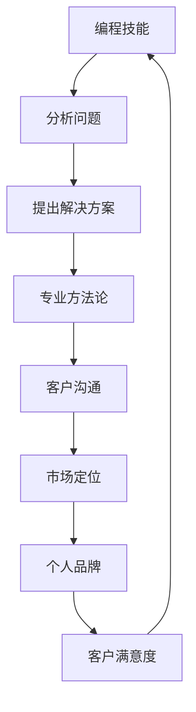

                 

# 如何将编程技能转化为高端咨询业务

> **关键词：** 编程技能、高端咨询、业务转型、市场定位、客户沟通

> **摘要：** 本文将探讨如何利用编程技能成功转型为高端咨询业务。我们将从定位市场、建立专业形象、提升沟通能力、掌握咨询方法论等方面进行详细分析，提供实用的操作步骤和实际案例。

## 1. 背景介绍

### 1.1 目的和范围

本文旨在为编程专业人士提供一套系统的转型指南，帮助他们将已有的编程技能转化为高端咨询业务。我们将覆盖以下核心内容：

- 市场定位和目标客户群体分析
- 建立专业形象和个人品牌
- 提升客户沟通和表达能力
- 学习和掌握高端咨询方法论
- 实际案例解析和操作步骤

### 1.2 预期读者

- 拥有编程背景的专业人士
- 希望转型为咨询顾问的技术经理或CTO
- 对IT咨询业务有兴趣的企业家和管理者

### 1.3 文档结构概述

本文分为十个部分，具体结构如下：

1. 背景介绍
2. 核心概念与联系
3. 核心算法原理 & 具体操作步骤
4. 数学模型和公式 & 详细讲解 & 举例说明
5. 项目实战：代码实际案例和详细解释说明
6. 实际应用场景
7. 工具和资源推荐
8. 总结：未来发展趋势与挑战
9. 附录：常见问题与解答
10. 扩展阅读 & 参考资料

### 1.4 术语表

#### 1.4.1 核心术语定义

- **编程技能**：编写计算机程序的能力，包括算法设计、数据结构、编程语言应用等。
- **高端咨询**：为企业或组织提供战略规划和决策支持的专业服务，通常涉及复杂的问题分析和解决方案设计。
- **市场定位**：确定目标客户群体和业务在市场中的独特位置。

#### 1.4.2 相关概念解释

- **个人品牌**：个人在专业领域中的知名度和影响力。
- **客户沟通**：与客户建立联系、理解需求、传递信息的过程。

#### 1.4.3 缩略词列表

- **IT**：信息技术
- **CTO**：首席技术官
- **IDE**：集成开发环境
- **PUA**：程序性解决问题能力

## 2. 核心概念与联系

在将编程技能转化为高端咨询业务的过程中，我们需要了解几个关键概念和它们之间的联系。以下是一个简化的Mermaid流程图，用于描述这些概念之间的关系。



### 分析问题

作为程序员，您已经具备了强大的分析问题能力。在咨询业务中，这一能力至关重要，因为您需要深入理解客户的业务需求，识别关键问题和瓶颈。

### 提出解决方案

基于分析，您需要提出创新且有效的解决方案。这里，编程技能可以帮助您设计和实现高效的技术方案，从而为客户提供具有竞争优势的服务。

### 专业方法论

高端咨询通常需要一套专业的方法论，如SWOT分析、PEST分析、五力模型等。掌握这些方法论，将帮助您为客户提供全面的战略建议。

### 客户沟通

有效的客户沟通是咨询业务成功的关键。您需要能够清晰地表达技术方案，理解客户的反馈，并与他们建立信任关系。

### 市场定位

确定目标市场和客户群体，可以帮助您集中资源和精力，提高业务的成功率。

### 个人品牌

建立个人品牌，提高市场知名度，将有助于吸引更多的客户和业务机会。

### 客户满意度

最终，客户满意度是衡量咨询业务成功与否的关键指标。通过提供优质服务，您将赢得客户的信任和忠诚。

## 3. 核心算法原理 & 具体操作步骤

### 3.1 分析问题

**算法原理：** 使用PEST分析模型，对客户行业进行宏观环境分析。

```python
def pest_analysis(client Industry):
    political = analyze_political(client Industry)
    economic = analyze_economic(client Industry)
    social = analyze_social(client Industry)
    technological = analyze_technological(client Industry)
    return {
        'political': political,
        'economic': economic,
        'social': social,
        'technological': technological
    }
```

**具体操作步骤：**

1. 收集行业数据。
2. 分析政治因素（政策、法规、政治稳定性等）。
3. 分析经济因素（市场趋势、经济增长、经济政策等）。
4. 分析社会因素（文化、社会价值观、人口结构等）。
5. 分析技术因素（技术趋势、技术创新、技术风险等）。

### 3.2 提出解决方案

**算法原理：** 使用SWOT分析模型，识别客户的内部优势（Strengths）和劣势（Weaknesses），外部机会（Opportunities）和威胁（Threats）。

```python
def swot_analysis(client Business):
    strengths = identify_strengths(client Business)
    weaknesses = identify_weaknesses(client Business)
    opportunities = identify_opportunities(client Industry)
    threats = identify_threats(client Industry)
    return {
        'strengths': strengths,
        'weaknesses': weaknesses,
        'opportunities': opportunities,
        'threats': threats
    }
```

**具体操作步骤：**

1. 分析客户业务的优势和劣势。
2. 分析行业中的机会和威胁。
3. 制定基于SWOT分析的策略。

### 3.3 客户沟通

**算法原理：** 使用SASSI模型（Situation, Analysis, Solution, Implementation），结构化地与客户沟通。

```python
def sassi_communication(client, analysis, solution):
    context = '当前情况：' + analysis['context']
    analysis = '分析结果：' + analysis['results']
    solution = '解决方案：' + solution['strategy']
    implementation = '实施计划：' + solution['implementation']
    return context + '\n' + analysis + '\n' + solution + '\n' + implementation
```

**具体操作步骤：**

1. 描述当前情况。
2. 详细分析问题。
3. 提出解决方案。
4. 讨论实施计划。

## 4. 数学模型和公式 & 详细讲解 & 举例说明

### 4.1 成本-效益分析

**数学模型：** 成本-效益分析（Cost-Benefit Analysis, CBA）是一种评估项目或决策的经济效益的方法。

```latex
\text{Net Benefit} = \text{Total Benefits} - \text{Total Costs}
```

**详细讲解：**

- **Total Benefits**：项目或决策所带来的全部效益，包括直接和间接效益。
- **Total Costs**：项目或决策的全部成本，包括直接和间接成本。

**举例说明：**

假设一家企业计划投资一个新的软件开发项目，预计总成本为$100,000。该项目的预计直接效益为$150,000，间接效益为$50,000。我们可以计算净效益如下：

```latex
\text{Net Benefit} = \$150,000 + \$50,000 - \$100,000 = \$100,000
```

由于净效益为正，该项目在经济上被认为是可行的。

### 4.2 风险评估

**数学模型：** 风险评估（Risk Assessment）是一种评估潜在风险的可能性和影响的方法。

```latex
\text{Risk Score} = \text{Probability} \times \text{Impact}
```

**详细讲解：**

- **Probability**：风险发生的可能性。
- **Impact**：风险发生后的影响程度。

**举例说明：**

假设一个软件开发项目中有两个风险：

1. **风险A**：系统崩溃，概率为50%，影响为严重（影响业务连续性）。
2. **风险B**：数据泄露，概率为20%，影响为一般（可能导致客户数据泄露）。

我们可以计算这两个风险的总分：

```latex
\text{Risk Score for Risk A} = 0.5 \times 3 = 1.5
\text{Risk Score for Risk B} = 0.2 \times 2 = 0.4
```

总风险分 = 风险A分数 + 风险B分数 = 1.5 + 0.4 = 1.9

根据总风险分，我们可以决定是否采取进一步的措施来减轻风险。

## 5. 项目实战：代码实际案例和详细解释说明

### 5.1 开发环境搭建

为了演示如何将编程技能转化为咨询业务，我们将使用Python语言创建一个简单的项目。首先，确保您已安装Python环境。以下是搭建开发环境的步骤：

1. 安装Python（版本3.8或以上）。
2. 安装必要的库（如Pandas、NumPy、Matplotlib等）。

```bash
pip install pandas numpy matplotlib
```

### 5.2 源代码详细实现和代码解读

#### 5.2.1 数据分析脚本

以下是一个简单的数据分析脚本，用于分析客户业务数据。该脚本将使用Pandas库读取数据，并使用PEST和SWOT分析方法。

```python
import pandas as pd
import numpy as np

# 读取数据
data = pd.read_csv('client_data.csv')

# PEST分析
pest_results = pest_analysis(data)

# SWOT分析
swot_results = swot_analysis(data)

# 打印分析结果
print("PEST Analysis Results:")
print(pest_results)
print("\nSWOT Analysis Results:")
print(swot_results)
```

**代码解读：**

1. 导入所需的库（Pandas、NumPy、Matplotlib）。
2. 读取客户业务数据（CSV文件）。
3. 使用`pest_analysis`和`swot_analysis`函数进行PEST和SWOT分析。
4. 打印分析结果。

#### 5.2.2 分析结果可视化

为了更好地展示分析结果，我们将使用Matplotlib库创建可视化图表。

```python
import matplotlib.pyplot as plt

# 可视化PEST分析结果
plt.figure(figsize=(10, 5))
plt.bar(pest_results.keys(), pest_results.values())
plt.xlabel('Factors')
plt.ylabel('Scores')
plt.title('PEST Analysis')
plt.show()

# 可视化SWOT分析结果
plt.figure(figsize=(10, 5))
plt.bar(swot_results.keys(), swot_results.values())
plt.xlabel('Factors')
plt.ylabel('Scores')
plt.title('SWOT Analysis')
plt.show()
```

**代码解读：**

1. 导入Matplotlib库。
2. 创建条形图，可视化PEST和SWOT分析结果。
3. 设置图表标题、坐标轴标签和图例。

### 5.3 代码解读与分析

该代码实战项目展示了如何使用Python编程技能进行数据分析，并将其应用于PEST和SWOT分析。以下是关键步骤：

1. 数据准备：从CSV文件中读取客户业务数据。
2. 分析实现：使用自定义函数进行PEST和SWOT分析。
3. 结果可视化：使用Matplotlib库创建图表，以直观展示分析结果。

通过这个实战项目，我们能够展示如何将编程技能转化为咨询业务中的数据分析工具，为客户提供有价值的业务洞察。

### 5.4 项目总结

通过本节项目实战，我们展示了如何利用编程技能和数据分析方法进行业务咨询。以下是我们从项目中得到的几个关键经验：

1. **数据分析是咨询业务的核心**：通过使用Pandas和Matplotlib等工具，我们可以快速从数据中提取有价值的信息。
2. **PEST和SWOT分析是关键方法**：这些方法帮助我们深入理解客户业务和市场环境，为制定战略提供依据。
3. **可视化工具提升沟通效果**：图表和可视化能够直观地展示分析结果，使客户更容易理解和接受我们的建议。

## 6. 实际应用场景

将编程技能转化为高端咨询业务的应用场景非常广泛，以下是一些典型的例子：

### 6.1 企业数字化转型咨询

随着数字化时代的到来，企业数字化转型成为许多公司关注的焦点。作为编程专家，您可以提供以下咨询服务：

- **数字化战略规划**：帮助企业制定数字化转型的目标和路径。
- **技术选型和架构设计**：基于企业的需求，推荐合适的技术和架构方案。
- **项目管理和实施**：协助企业实施数字化转型项目，确保项目按时按质完成。

### 6.2 数据科学和人工智能咨询

随着数据科学和人工智能技术的发展，越来越多的企业希望利用这些技术提升业务效率。您的编程技能可以帮助企业：

- **数据分析和挖掘**：利用大数据技术，帮助企业从海量数据中提取有价值的信息。
- **人工智能解决方案**：开发智能化的应用程序，如智能客服、推荐系统等。
- **AI战略规划**：帮助企业制定人工智能发展战略，包括技术选型、团队建设等。

### 6.3 IT系统和网络安全咨询

在当今数字化时代，IT系统和网络安全至关重要。您可以为以下场景提供咨询服务：

- **IT系统优化**：评估企业现有系统，提供性能优化和成本降低方案。
- **网络安全评估**：识别企业网络安全风险，提供安全策略和措施。
- **合规性检查**：确保企业的IT系统和数据处理符合相关法规和标准。

### 6.4 创业和创业企业咨询

对于创业者来说，编程技能可以帮助他们：

- **产品开发和原型设计**：快速开发产品原型，验证商业想法。
- **团队建设和技术管理**：招聘和培养技术团队，确保技术实现符合业务需求。
- **技术路线规划**：制定长期技术发展战略，确保企业持续创新。

## 7. 工具和资源推荐

### 7.1 学习资源推荐

#### 7.1.1 书籍推荐

1. **《数字化管理：战略、工具与案例》**
   - 作者：杰克·韦尔奇（Jack Welch）
   - 简介：这本书详细介绍了如何利用数字化技术提升企业竞争力。

2. **《数据科学实战》**
   - 作者：Michael Bowles
   - 简介：这本书提供了丰富的数据科学实践案例，帮助读者掌握数据分析技巧。

3. **《网络安全实战指南》**
   - 作者：Andrew Hoffman
   - 简介：本书涵盖了网络安全的基础知识和实战技巧，适用于IT安全专业人士。

#### 7.1.2 在线课程

1. **Coursera - 数据科学专业课程**
   - 简介：这是一套全面的在线课程，涵盖数据科学的核心概念和实战技巧。

2. **Udemy - Python编程实战课程**
   - 简介：通过本课程，您可以学习如何使用Python进行数据分析、Web开发和自动化等。

3. **edX - 人工智能专项课程**
   - 简介：本课程涵盖了人工智能的基础知识，包括机器学习、深度学习等。

#### 7.1.3 技术博客和网站

1. **Medium - 数据科学博客**
   - 简介：这是一个专门发布数据科学相关文章的博客，涵盖各种数据分析和机器学习案例。

2. **Hackernoon - 人工智能博客**
   - 简介：Hackernoon是一个技术博客，涵盖人工智能、机器学习和编程语言等领域。

3. **AListAPart - 前端开发博客**
   - 简介：这是一个专门针对前端开发者的博客，提供最新的前端技术和最佳实践。

### 7.2 开发工具框架推荐

#### 7.2.1 IDE和编辑器

1. **Visual Studio Code**
   - 简介：一款免费且开源的代码编辑器，支持多种编程语言，具有丰富的插件生态系统。

2. **PyCharm**
   - 简介：一款功能强大的Python IDE，适用于大型项目和复杂代码开发。

3. **Eclipse**
   - 简介：一款开源的IDE，适用于Java和多种其他编程语言开发。

#### 7.2.2 调试和性能分析工具

1. **Postman**
   - 简介：一款API调试和测试工具，适用于开发人员测试和调试API接口。

2. **JMeter**
   - 简介：一款开源的性能测试工具，适用于模拟大规模并发用户访问。

3. **Grafana**
   - 简介：一款开源的数据可视化工具，适用于监控和数据分析。

#### 7.2.3 相关框架和库

1. **TensorFlow**
   - 简介：一款开源的机器学习框架，适用于深度学习和神经网络。

2. **Django**
   - 简介：一款流行的Python Web开发框架，适用于快速构建高性能的Web应用程序。

3. **React**
   - 简介：一款用于构建用户界面的JavaScript库，适用于创建动态和响应式的Web应用。

### 7.3 相关论文著作推荐

#### 7.3.1 经典论文

1. **"The Art of Computer Programming" by Donald E. Knuth**
   - 简介：这是一套关于计算机编程的经典著作，涵盖了算法设计、分析和技术。

2. **"Deep Learning" by Ian Goodfellow, Yoshua Bengio, and Aaron Courville**
   - 简介：这本书详细介绍了深度学习和神经网络的理论和实践。

3. **"The Practice of System and Network Administration" by Thomas A. Limoncelli et al.**
   - 简介：这本书提供了丰富的IT运维经验和最佳实践。

#### 7.3.2 最新研究成果

1. **"Reinforcement Learning: An Introduction" by Richard S. Sutton and Andrew G. Barto**
   - 简介：这本书是关于强化学习的最新研究著作，适用于希望深入了解该领域的人士。

2. **"Deep Learning on Big Data" by Eric J. Xing**
   - 简介：这本书探讨了如何在大型数据集上应用深度学习技术。

3. **"Blockchain: Blueprint for a New Economy" by Melanie Swan**
   - 简介：这本书介绍了区块链技术及其在金融、供应链等领域的应用。

#### 7.3.3 应用案例分析

1. **"AI Superpowers: China, Silicon Valley, and the New World Order" by Michael Pollan**
   - 简介：这本书探讨了人工智能在中国和硅谷的发展及其对全球秩序的影响。

2. **"The Future Is Already Here: The Disney World of the Digital Economy" by Don Tapscott**
   - 简介：这本书描述了数字经济的未来趋势和商业模式。

3. **"The Age of Surveillance Capitalism: The Fight for a Human Future at the New Frontier of Power" by Shoshana Zuboff**
   - 简介：这本书深入探讨了监控资本主义对个人隐私和数据权利的威胁。

## 8. 总结：未来发展趋势与挑战

随着科技的不断进步，编程技能在高端咨询业务中的应用将越来越广泛。以下是未来发展趋势和面临的挑战：

### 8.1 发展趋势

1. **数字化转型的深入**：越来越多的企业将数字化转型作为核心战略，这为编程专家提供了丰富的咨询机会。
2. **数据科学和人工智能的融合**：数据科学和人工智能的结合将推动企业创新和效率提升，编程技能将在其中发挥关键作用。
3. **远程工作模式的普及**：远程工作模式的普及将使编程专家能够更灵活地为客户提供服务，扩大业务范围。
4. **个性化和定制化服务**：随着客户需求的多样化，编程专家将需要提供更多个性化和定制化的咨询服务。

### 8.2 面临的挑战

1. **技能更新和持续学习**：科技发展迅速，编程专家需要不断更新知识和技能，以保持竞争力。
2. **客户沟通和表达能力的提升**：编程专家需要提升沟通和表达能力，以更好地理解和满足客户需求。
3. **数据安全和隐私保护**：在处理大量数据的过程中，编程专家需要确保数据安全和隐私保护，遵守相关法规和标准。
4. **市场竞争和差异化**：随着市场的竞争加剧，编程专家需要找到差异化的竞争优势，以吸引客户。

## 9. 附录：常见问题与解答

### 9.1 编程技能如何转化为咨询业务？

**解答：** 首先，了解客户需求，掌握行业知识和分析方法。然后，利用编程技能进行数据分析和解决方案设计，通过有效的沟通将分析结果和建议传达给客户。

### 9.2 如何提升沟通和表达能力？

**解答：** 通过阅读相关书籍、参加沟通技巧培训、练习演讲和写作等方式，不断提升自己的沟通和表达能力。同时，在实践中不断积累经验，提高沟通效率。

### 9.3 如何保持持续学习和技能更新？

**解答：** 关注行业动态，定期参加技术培训和研讨会，阅读专业书籍和博客，与同行交流经验。此外，利用在线学习平台（如Coursera、Udemy等）进行自学。

## 10. 扩展阅读 & 参考资料

- **《数字化管理：战略、工具与案例》**
  - 作者：杰克·韦尔奇（Jack Welch）
  - 简介：本书详细介绍了如何利用数字化技术提升企业竞争力。

- **《数据科学实战》**
  - 作者：Michael Bowles
  - 简介：本书提供了丰富的数据科学实践案例，帮助读者掌握数据分析技巧。

- **《网络安全实战指南》**
  - 作者：Andrew Hoffman
  - 简介：本书涵盖了网络安全的基础知识和实战技巧。

- **Coursera - 数据科学专业课程**
  - 简介：这是一套全面的在线课程，涵盖数据科学的核心概念和实战技巧。

- **Udemy - Python编程实战课程**
  - 简介：通过本课程，您可以学习如何使用Python进行数据分析、Web开发和自动化等。

- **edX - 人工智能专项课程**
  - 简介：本课程涵盖了人工智能的基础知识，包括机器学习、深度学习等。

- **《The Art of Computer Programming》**
  - 作者：Donald E. Knuth
  - 简介：这是一套关于计算机编程的经典著作，涵盖了算法设计、分析和技术。

- **《Deep Learning》**
  - 作者：Ian Goodfellow, Yoshua Bengio, and Aaron Courville
  - 简介：这本书详细介绍了深度学习和神经网络的理论和实践。

- **《Reinforcement Learning: An Introduction》**
  - 作者：Richard S. Sutton and Andrew G. Barto
  - 简介：这本书是关于强化学习的最新研究著作，适用于希望深入了解该领域的人士。

- **《Blockchain: Blueprint for a New Economy》**
  - 作者：Melanie Swan
  - 简介：这本书介绍了区块链技术及其在金融、供应链等领域的应用。

- **《AI Superpowers: China, Silicon Valley, and the New World Order》**
  - 作者：Michael Pollan
  - 简介：这本书探讨了人工智能在中国和硅谷的发展及其对全球秩序的影响。

- **《The Future Is Already Here: The Disney World of the Digital Economy》**
  - 作者：Don Tapscott
  - 简介：这本书描述了数字经济的未来趋势和商业模式。

- **《The Age of Surveillance Capitalism: The Fight for a Human Future at the New Frontier of Power》**
  - 作者：Shoshana Zuboff
  - 简介：这本书深入探讨了监控资本主义对个人隐私和数据权利的威胁。

### 作者

**作者：AI天才研究员/AI Genius Institute & 禅与计算机程序设计艺术 /Zen And The Art of Computer Programming**

