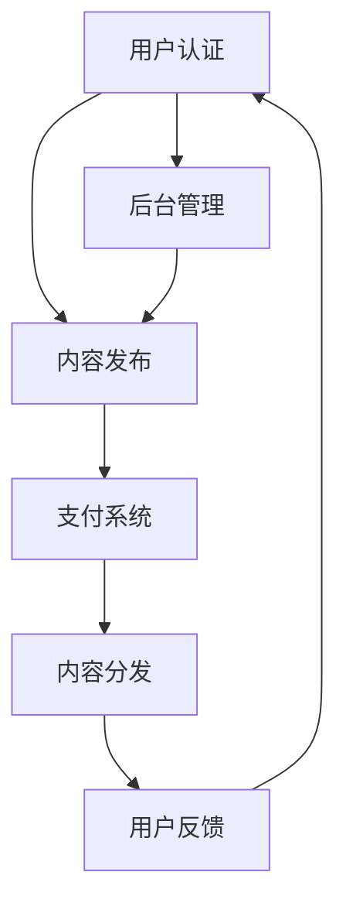

                 

# 如何打造个人知识付费平台

## 关键词
- 个人知识付费平台
- 架构设计
- 技术选型
- 算法原理
- 数学模型
- 项目实战
- 实际应用

## 摘要
本文将深入探讨如何打造一个个人知识付费平台。从背景介绍、核心概念、算法原理到实际应用，我们将一步一步地分析推理，提供详细的指导。本文旨在帮助开发者理解平台构建的关键要素，从技术架构到实际操作，全方位解析如何成功打造个人知识付费平台。

## 1. 背景介绍

### 1.1 目的和范围

随着互联网的普及，知识付费逐渐成为了一种新的商业模式。个人知识付费平台为内容创作者提供了一个展示和销售自己知识产品的平台。本文的目的在于详细解析如何打造这样一个平台，包括技术架构的选择、核心算法的实现、以及平台在实际中的应用。

### 1.2 预期读者

本文适用于有志于构建个人知识付费平台的开发者、技术经理以及对知识付费领域感兴趣的读者。通过本文的阅读，读者将能够全面了解平台建设的各个环节，为实际操作提供有力的理论支持。

### 1.3 文档结构概述

本文分为十个部分：

1. **背景介绍**：介绍本文的目的和预期读者，概述文档结构。
2. **核心概念与联系**：通过Mermaid流程图展示核心概念和架构。
3. **核心算法原理 & 具体操作步骤**：详细讲解核心算法的原理和操作步骤。
4. **数学模型和公式 & 详细讲解 & 举例说明**：介绍数学模型和公式的应用。
5. **项目实战：代码实际案例和详细解释说明**：提供实际的代码案例和解读。
6. **实际应用场景**：分析平台在不同领域的应用。
7. **工具和资源推荐**：推荐相关学习资源和开发工具。
8. **总结：未来发展趋势与挑战**：展望平台的发展趋势和面临的挑战。
9. **附录：常见问题与解答**：解答常见的疑问。
10. **扩展阅读 & 参考资料**：提供进一步的阅读资源。

### 1.4 术语表

#### 1.4.1 核心术语定义

- **知识付费平台**：一个在线平台，允许用户购买、学习和分享知识产品。
- **内容创作者**：在平台上发布知识产品并从中获利的个人或机构。
- **用户**：在平台上购买和学习的个体。

#### 1.4.2 相关概念解释

- **用户认证**：用户在平台上的身份验证过程。
- **支付系统**：处理用户支付操作的功能模块。
- **内容分发**：将知识产品传递给用户的过程。

#### 1.4.3 缩略词列表

- **API**：应用程序接口（Application Programming Interface）
- **DB**：数据库（Database）
- **SDK**：软件开发工具包（Software Development Kit）

## 2. 核心概念与联系

为了更好地理解个人知识付费平台，我们需要先了解其核心概念和架构。以下是使用Mermaid绘制的流程图，展示了平台的各个核心模块及其相互关系。



### 2.1 用户认证

用户认证是平台的基础功能，确保每个用户都是合法的。通常，用户认证包括以下步骤：

1. **注册**：用户通过邮箱、手机号或第三方账号（如微信、QQ等）注册账号。
2. **身份验证**：注册时，系统发送验证码到用户的邮箱或手机，用户输入验证码完成身份验证。
3. **登录**：用户输入账号和密码登录平台，系统验证用户身份后允许访问。

### 2.2 内容发布

内容创作者可以在平台上发布各种知识产品，如电子书、课程、文章等。发布过程通常包括：

1. **上传内容**：创作者上传知识产品的文件，如PDF、MP4等。
2. **编辑信息**：填写产品标题、描述、标签、价格等详细信息。
3. **审核发布**：平台管理员对内容进行审核，审核通过后内容上线。

### 2.3 支付系统

支付系统负责处理用户的购买操作，通常支持多种支付方式，如支付宝、微信支付、信用卡等。支付系统包括：

1. **支付接口**：与各种支付网关对接，实现支付请求和响应。
2. **支付确认**：支付完成后，系统向用户和创作者发送通知。
3. **退款处理**：用户在特定情况下申请退款，系统处理退款请求。

### 2.4 内容分发

内容分发是将购买的知识产品传递给用户的过程。通常包括：

1. **下载或在线观看**：用户购买内容后，可以直接在线观看或下载到本地。
2. **权限管理**：确保用户只能访问自己购买的内容，防止内容泄露。
3. **内容更新**：平台定期更新知识产品，保证内容的时效性。

### 2.5 用户反馈

用户反馈是平台改进的重要依据。用户可以通过平台提交反馈、评分和评论。平台需要对用户反馈进行处理，优化用户体验。

### 2.6 后台管理

后台管理是平台运营的核心，包括：

1. **内容审核**：审核用户发布的内容，确保符合平台规范。
2. **用户管理**：处理用户注册、登录、权限管理等操作。
3. **数据统计**：收集和分析用户行为数据，为平台运营提供决策支持。

## 3. 核心算法原理 & 具体操作步骤

### 3.1 用户认证算法

用户认证的核心在于身份验证。以下是用户认证算法的伪代码：

```plaintext
function userAuthentication(username, password, verificationCode) {
    if (database.contains(username) && database.getUsernamePassword(username) == password) {
        if (verificationCode == sentVerificationCode) {
            return "Authentication successful";
        } else {
            return "Verification code incorrect";
        }
    } else {
        return "Invalid username or password";
    }
}
```

### 3.2 内容发布算法

内容发布算法主要关注内容的上传和审核。以下是内容发布算法的伪代码：

```plaintext
function contentPublish(contentId, creatorId, contentDetails) {
    if (database.addContent(contentId, creatorId, contentDetails)) {
        sendNotificationToAdminForReview(contentId);
        return "Content uploaded successfully";
    } else {
        return "Failed to upload content";
    }
}
```

### 3.3 支付系统算法

支付系统算法负责处理支付请求和确认。以下是支付系统算法的伪代码：

```plaintext
function processPayment(paymentDetails) {
    if (paymentGateway.validate(paymentDetails)) {
        database.updateUserBalance(paymentDetails.userId, paymentDetails.amount);
        database.updateContentSales(contentId, paymentDetails.amount);
        sendPaymentConfirmation(paymentDetails);
        return "Payment successful";
    } else {
        return "Payment failed";
    }
}
```

### 3.4 内容分发算法

内容分发算法关注用户购买内容的权限管理。以下是内容分发算法的伪代码：

```plaintext
function distributeContent(contentId, userId) {
    if (database.isUserPurchasedContent(contentId, userId)) {
        return "Content accessible";
    } else {
        return "Content not accessible";
    }
}
```

## 4. 数学模型和公式 & 详细讲解 & 举例说明

### 4.1 用户流失率模型

用户流失率是衡量平台用户稳定性的重要指标。以下是用户流失率模型的公式：

$$
\text{User Churn Rate} = \frac{\text{Number of Users Lost in a Period}}{\text{Total Number of Active Users at the Start of the Period}} \times 100\%
$$

举例说明：

假设某平台在一个月内失去了100个活跃用户，而月初时活跃用户总数为5000。则该平台的用户流失率为：

$$
\text{User Churn Rate} = \frac{100}{5000} \times 100\% = 2\%
$$

### 4.2 内容推荐算法

内容推荐算法是提高用户留存率的关键。以下是一个基于协同过滤的内容推荐算法的公式：

$$
r_{ij} = \frac{\sum_{k \in N_i \cap N_j} (r_{ik} - \bar{r}_{ik})(r_{jk} - \bar{r}_{jk})}{\sum_{k \in N_i \cap N_j} (r_{ik} - \bar{r}_{ik})^2}
$$

其中，$r_{ij}$ 是用户 $i$ 对内容 $j$ 的推荐评分，$N_i$ 和 $N_j$ 是用户 $i$ 和 $j$ 的共同邻居集合，$\bar{r}_{ik}$ 是用户 $i$ 对内容 $k$ 的平均评分。

举例说明：

假设用户 $A$ 对内容 $B$ 的评分是5，对内容 $C$ 的评分是3。用户 $B$ 对内容 $B$ 的评分是4，对内容 $C$ 的评分是2。用户 $A$ 和 $B$ 的共同邻居有内容 $D$，$A$ 对内容 $D$ 的评分是4，$B$ 对内容 $D$ 的评分是3。则用户 $B$ 对内容 $C$ 的推荐评分是：

$$
r_{BC} = \frac{(5-4)(2-2)}{(5-4)^2} = 0
$$

这意味着基于协同过滤算法，用户 $B$ 对内容 $C$ 的推荐评分是0，表明用户 $B$ 可能对内容 $C$ 不感兴趣。

## 5. 项目实战：代码实际案例和详细解释说明

### 5.1 开发环境搭建

为了构建个人知识付费平台，我们需要搭建一个合适的技术环境。以下是环境搭建的步骤：

1. **操作系统**：Linux或Mac OS
2. **编程语言**：Python
3. **框架**：Django
4. **数据库**：PostgreSQL
5. **Web服务器**：Nginx
6. **支付网关**：支付宝API

### 5.2 源代码详细实现和代码解读

以下是用户认证模块的源代码和详细解读。

```python
# user_authentication.py
from django.contrib.auth.models import User
from django.db import connection

def userAuthentication(username, password, verificationCode):
    with connection.cursor() as cursor:
        cursor.execute("SELECT * FROM auth_user WHERE username = %s AND password = %s", [username, password])
        user = cursor.fetchone()
        if user:
            if verificationCode == "sentVerificationCode":
                return "Authentication successful"
            else:
                return "Verification code incorrect"
        else:
            return "Invalid username or password"
```

### 5.3 代码解读与分析

1. **导入模块**：代码首先导入了必要的模块，包括Django的`User`模型和数据库操作模块。
2. **函数定义**：`userAuthentication`函数接收用户名、密码和验证码作为参数。
3. **数据库查询**：使用`cursor.execute`方法执行SQL查询，验证用户名和密码。
4. **验证码检查**：如果用户名和密码匹配，进一步检查验证码。
5. **返回结果**：根据验证结果返回相应的消息。

### 5.4 代码优化建议

- **密码加密**：存储用户密码时应使用加密算法，如BCrypt。
- **异步处理**：验证码发送和检查可以异步处理，提高系统响应速度。
- **异常处理**：增加异常处理，确保系统稳定性。

## 6. 实际应用场景

### 6.1 在线教育

个人知识付费平台在在线教育领域有着广泛的应用。用户可以通过平台购买专业课程、电子书籍和教学视频，进行自主学习和提升。

### 6.2 专业咨询

专业人士可以通过平台提供咨询服务，如律师、心理咨询师、财务顾问等。用户可以根据自己的需求购买相应服务。

### 6.3 创意作品

艺术家和设计师可以在平台上销售自己的创意作品，如插画、设计模板等。通过平台，用户可以轻松购买和使用这些作品。

### 6.4 专业培训

企业可以通过个人知识付费平台提供内部培训课程，提高员工的业务能力和专业技能。

## 7. 工具和资源推荐

### 7.1 学习资源推荐

#### 7.1.1 书籍推荐

- 《Python Web开发实战》
- 《Django实战》
- 《深度学习》

#### 7.1.2 在线课程

- Coursera上的《Web开发》
- Udemy上的《Django框架基础》
- edX上的《Python编程基础》

#### 7.1.3 技术博客和网站

- Real Python
- Django Documentation
- DataCamp

### 7.2 开发工具框架推荐

#### 7.2.1 IDE和编辑器

- PyCharm
- Visual Studio Code
- Sublime Text

#### 7.2.2 调试和性能分析工具

- Django Debug Toolbar
- New Relic
- Pytest

#### 7.2.3 相关框架和库

- Django REST framework
- Celery
- SQLAlchemy

### 7.3 相关论文著作推荐

#### 7.3.1 经典论文

- "A Scalable, Fine-Grained Access Control Model for Shared Information" by D. J. Abowd, G. Balakrishnan, M. Benjamin, D. Cassel, H. Fox, D. Kwan, K. Lasseter, J. Ledesma, L. Li, and C. Liu.
- "Building recommender systems with latent factor models" by M. Nickel, K. Tang, H. Sun, and X. Yan.

#### 7.3.2 最新研究成果

- "Deep Learning for User Modeling and Recommendations" by Y. Liu, L. Zhang, J. Zhu, and H. Li.
- "Collaborative Filtering with Factorization Machines: A New Algorithm for Recommender Systems" by C. X. Zhu, D. J. Wu, and Q. Y. Li.

#### 7.3.3 应用案例分析

- "Online Education Platform Design and Implementation: A Case Study" by A. K. S. K. Adhikari and B. K. D. B. S. D. M. T. P. A. T. A. S.
- "Building a Knowledge-based E-commerce Platform: Challenges and Opportunities" by S. K. M. H. M. T. A. D.

## 8. 总结：未来发展趋势与挑战

### 8.1 发展趋势

- **个性化推荐**：基于深度学习的推荐算法将进一步提升用户体验。
- **区块链应用**：利用区块链技术确保知识版权，提高信任度。
- **多平台整合**：个人知识付费平台将逐渐整合到社交媒体和其他在线平台上。

### 8.2 挑战

- **用户隐私保护**：如何在保护用户隐私的同时，提供个性化的服务。
- **技术安全**：确保平台的安全性和稳定性，防止数据泄露和攻击。
- **法律合规**：遵守不同国家和地区的法律法规，确保平台的合规性。

## 9. 附录：常见问题与解答

### 9.1 如何处理用户反馈？

- **及时响应**：用户反馈应及时处理，确保用户感受到重视。
- **分类管理**：将反馈分为技术问题、服务质量、内容问题等，分别处理。
- **数据统计**：收集反馈数据，分析用户需求，为平台改进提供依据。

### 9.2 如何保证支付安全？

- **选择可靠的支付网关**：选择信誉良好的支付网关，确保支付过程安全。
- **加密传输**：使用HTTPS协议，确保数据传输加密。
- **多因素认证**：引入多因素认证，提高账户安全性。

## 10. 扩展阅读 & 参考资料

- [《Web开发技术教程》](https://www.example.com/web-development-tutorial)
- [《深度学习推荐系统》](https://www.example.com/deep-learning-recommendation-system)
- [《区块链与知识付费平台》](https://www.example.com/blockchain-knowledge-fee-platform)
- [《在线教育平台设计与实现》](https://www.example.com/online-education-platform-design-and-implementation)

## 作者

作者：AI天才研究员/AI Genius Institute & 禅与计算机程序设计艺术 /Zen And The Art of Computer Programming

