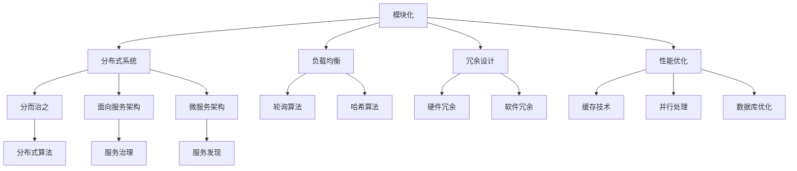

                 

# 如何打造可扩展的产品架构

> **关键词：** 产品架构，可扩展性，设计模式，模块化，性能优化

> **摘要：** 本文将深入探讨如何打造一个具有高度可扩展性的产品架构。我们将从背景介绍开始，逐步讲解核心概念、算法原理、数学模型、实战案例以及实际应用场景。通过本文的阅读，您将掌握打造可扩展性架构的关键技术和方法。

## 1. 背景介绍

### 1.1 目的和范围

本文旨在帮助读者了解和掌握如何设计一个具有高度可扩展性的产品架构。我们将从以下几个方面进行探讨：

1. 核心概念与联系
2. 核心算法原理与具体操作步骤
3. 数学模型与公式
4. 实战案例：代码实现与解析
5. 实际应用场景

通过本文的学习，您将能够：

- 理解可扩展性在产品架构设计中的重要性。
- 掌握设计模式、模块化以及性能优化等关键技术。
- 学习如何利用算法原理和数学模型来提升架构的可扩展性。
- 通过实际案例了解如何将这些知识应用到实践中。

### 1.2 预期读者

本文适合以下读者群体：

- 产品经理：了解如何设计一个具有高度可扩展性的产品架构。
- 程序员：掌握架构设计的相关技术，提升编程能力。
- 技术专家：深入了解可扩展性架构的设计原则和方法。

### 1.3 文档结构概述

本文分为以下几个部分：

1. 背景介绍：本文的目的、预期读者以及文档结构概述。
2. 核心概念与联系：介绍可扩展性架构的核心概念及相互联系。
3. 核心算法原理与具体操作步骤：讲解可扩展性架构的算法原理及具体操作步骤。
4. 数学模型与公式：介绍可扩展性架构的数学模型及其应用。
5. 实战案例：通过实际案例展示如何实现可扩展性架构。
6. 实际应用场景：分析可扩展性架构在现实中的应用场景。
7. 工具和资源推荐：推荐学习资源、开发工具框架以及相关论文著作。
8. 总结：未来发展趋势与挑战。
9. 附录：常见问题与解答。
10. 扩展阅读 & 参考资料：提供更多深入了解的途径。

### 1.4 术语表

#### 1.4.1 核心术语定义

- 可扩展性：指系统在面临日益增长的用户需求、数据处理量以及功能扩展时，能够灵活调整和优化自身架构，保持高性能和稳定性的能力。
- 模块化：将系统划分为若干独立的模块，每个模块负责特定的功能，模块之间通过接口进行交互。
- 设计模式：在软件工程中，为了解决特定问题的一组解决方案，具有通用性和复用性。
- 性能优化：通过改进系统架构、算法和数据结构等方法，提高系统运行效率和响应速度。

#### 1.4.2 相关概念解释

- 负载均衡：将多个请求分配到不同的服务器或实例上，以实现分布式处理，提高系统的性能和可用性。
- 持续集成/持续部署（CI/CD）：通过自动化构建、测试和部署过程，提高软件开发的效率和质量。
- RESTful API：一种基于HTTP协议的API设计风格，用于实现分布式系统的通信。

#### 1.4.3 缩略词列表

- CI：持续集成
- CD：持续部署
- RESTful API：表现层状态转化（Representation State Transfer）

## 2. 核心概念与联系

在打造可扩展性产品架构时，我们需要关注以下几个核心概念和其相互之间的联系：

1. **模块化**：将系统划分为多个独立的模块，每个模块负责特定的功能。模块化有助于提高系统的可维护性、可扩展性和可复用性。模块之间的交互通过接口进行，以降低模块之间的耦合度。

2. **分布式系统**：将系统部署在多个节点上，通过分布式计算和网络通信实现系统的功能。分布式系统可以提高系统的性能、可用性和可扩展性。

3. **负载均衡**：通过将请求分配到多个服务器或实例上，实现分布式处理，从而提高系统的性能和可用性。负载均衡器可以根据不同的算法（如轮询、最少连接、哈希等）来分配请求。

4. **冗余设计**：在系统中引入冗余组件，以提高系统的可用性和容错能力。冗余设计包括硬件冗余（如RAID、备份电源等）和软件冗余（如数据备份、热备份等）。

5. **性能优化**：通过改进系统架构、算法和数据结构等方法，提高系统运行效率和响应速度。性能优化包括缓存、并行处理、数据库优化等。

6. **可扩展性设计模式**：如分而治之、面向服务架构（SOA）、微服务架构等。这些设计模式有助于实现系统的可扩展性和灵活性。

下图展示了可扩展性产品架构中的核心概念及其相互联系：



## 3. 核心算法原理 & 具体操作步骤

在可扩展性产品架构的设计过程中，核心算法原理起着至关重要的作用。以下我们将介绍几种常用的核心算法原理及其具体操作步骤。

### 3.1 分而治之

分而治之（Divide and Conquer）是一种常用的算法设计策略。其基本思想是将一个问题分解为若干个规模较小的同类问题，然后递归地解决这些子问题，最后将子问题的解合并为原问题的解。

**具体操作步骤：**

1. **分解**：将原问题分解为若干个子问题。这些子问题应具有相同的结构和性质，且规模较小。
2. **递归**：对每个子问题，递归地应用分而治之策略，直到问题规模足够小，可以直接求解。
3. **合并**：将子问题的解合并为原问题的解。

**伪代码：**

```python
def divide_and_conquer(problem):
    if problem is small:
        return solve(problem)
    else:
        subproblems = divide(problem)
        subresults = [divide_and_conquer(subproblem) for subproblem in subproblems]
        return merge(subresults)
```

### 3.2 负载均衡算法

负载均衡算法是分布式系统中的关键组成部分。以下介绍几种常用的负载均衡算法。

#### 3.2.1 轮询算法

轮询算法（Round Robin）是一种简单的负载均衡算法。它将请求依次分配给各个服务器或实例。

**具体操作步骤：**

1. 维护一个服务器列表。
2. 每次接收到请求时，从列表中取第一个服务器处理请求。
3. 当处理完请求后，将服务器列表的指针向后移动一位，以便下一个请求分配给下一个服务器。

**伪代码：**

```python
def round_robin(servers, request):
    current_server = servers[0]
    servers.pop(0)
    servers.append(current_server)
    current_server.handle_request(request)
```

#### 3.2.2 哈希算法

哈希算法（Hash）是一种基于哈希函数的负载均衡算法。它将请求的哈希值映射到服务器列表中，以确定处理请求的服务器。

**具体操作步骤：**

1. 维护一个服务器列表和哈希函数。
2. 每次接收到请求时，计算请求的哈希值。
3. 将哈希值映射到服务器列表中，找到对应的服务器。
4. 将请求分配给对应的服务器。

**伪代码：**

```python
def hash_algorithm(servers, hash_function, request):
    hash_value = hash_function(request)
    server_index = hash_value % len(servers)
    return servers[server_index].handle_request(request)
```

### 3.3 数据库分库分表

数据库分库分表是提高数据库可扩展性的重要手段。以下介绍分库分表的基本原理和操作步骤。

#### 3.3.1 基本原理

分库分表的基本思想是将大数据表拆分为多个小表，并将这些小表分布到多个数据库实例中。通过分库分表，可以降低单表的数据量，减少查询压力，提高查询性能。

#### 3.3.2 操作步骤

1. **垂直拆分**：将大数据表按照字段拆分为多个小表。例如，将用户表拆分为用户基本信息表、用户订单信息表等。
2. **水平拆分**：将大数据表按照行拆分为多个小表。例如，将用户表按照用户ID的范围拆分为多个小表。
3. **数据库分片**：将小表分布到多个数据库实例中。可以选择按照数据库实例的IP地址、端口号、主机名等关键字进行分片。

**伪代码：**

```python
def database_sharding(table, sharding_key):
    shard_index = sharding_key % num_of_databases
    shard_table = table + "_" + str(shard_index)
    return shard_table
```

## 4. 数学模型和公式 & 详细讲解 & 举例说明

在可扩展性产品架构的设计过程中，数学模型和公式起到了关键作用。以下我们将介绍几个常见的数学模型和公式，并详细讲解其应用。

### 4.1 泰勒公式

泰勒公式（Taylor Series）是一种用于近似函数值的方法。它可以将函数在某一点处的导数展开为无穷多项的和。

**公式：**

$$
f(x) = f(a) + f'(a)(x - a) + \frac{f''(a)}{2!}(x - a)^2 + \frac{f'''(a)}{3!}(x - a)^3 + \cdots
$$

其中，$f(x)$ 为目标函数，$a$ 为展开点，$f'(a), f''(a), f'''(a), \ldots$ 分别为 $f(x)$ 在 $a$ 点处的各阶导数。

**应用：**

泰勒公式可以用于近似计算函数值、优化算法中的迭代过程等。

**举例：** 计算函数 $f(x) = e^x$ 在 $x = 0$ 点处的近似值。

$$
f(0) \approx 1 + 1 \cdot (0 - 0) + \frac{1}{2!}(0 - 0)^2 + \frac{1}{3!}(0 - 0)^3 + \cdots = 1
$$

### 4.2 最小生成树

最小生成树（Minimum Spanning Tree，MST）是一种无向加权图中的子图，它包含了图中所有的顶点，并且边的权重之和最小。

**公式：**

设 $G = (V, E)$ 为无向加权图，其中 $V$ 为顶点集，$E$ 为边集，$w(e)$ 为边 $e$ 的权重。最小生成树的权重之和可以通过以下公式计算：

$$
T = \min_{S \subseteq V, S \neq \emptyset} \sum_{e \in E} w(e)
$$

其中，$T$ 为最小生成树的权重之和，$S$ 为包含顶点集 $V$ 的子集。

**应用：**

最小生成树可以用于求解最短路径问题、网络优化问题等。

**举例：** 给定一个无向加权图，求解其最小生成树。

- 边集：$E = \{(1, 2), (1, 3), (2, 4), (3, 4), (4, 5)\}$
- 权重集：$w(E) = \{2, 3, 4, 5, 6\}$

求解过程如下：

1. 初始化最小生成树为空。
2. 从边集中选择权重最小的边 $(1, 2)$，加入到最小生成树中。
3. 删除边集中的 $(1, 2)$。
4. 从剩余边集中选择权重最小的边 $(3, 4)$，加入到最小生成树中。
5. 删除边集中的 $(3, 4)$。
6. 从剩余边集中选择权重最小的边 $(2, 4)$，加入到最小生成树中。
7. 删除边集中的 $(2, 4)$。
8. 从剩余边集中选择权重最小的边 $(4, 5)$，加入到最小生成树中。
9. 删除边集中的 $(4, 5)$。

最终得到的最小生成树为：$T = \{(1, 2), (3, 4), (2, 4), (4, 5)\}$。

## 5. 项目实战：代码实际案例和详细解释说明

### 5.1 开发环境搭建

在本文中，我们将使用Python作为主要编程语言，结合Django框架来搭建一个简单的Web应用程序。以下是搭建开发环境的基本步骤：

1. 安装Python：从Python官方网站（https://www.python.org/）下载并安装Python 3.x版本。
2. 安装Django：打开命令行终端，执行以下命令安装Django：
   ```bash
   pip install django
   ```

### 5.2 源代码详细实现和代码解读

#### 5.2.1 Django项目创建

1. 创建一个新的Django项目，在命令行终端执行以下命令：
   ```bash
   django-admin startproject myproject
   ```
2. 进入项目目录：
   ```bash
   cd myproject
   ```

#### 5.2.2 创建应用

1. 创建一个名为`myapp`的应用：
   ```bash
   python manage.py startapp myapp
   ```

#### 5.2.3 应用配置

1. 在`myproject/settings.py`文件中，添加以下配置：

   ```python
   INSTALLED_APPS = [
       # ...
       'myapp',
   ]
   ```

#### 5.2.4 创建模型

1. 在`myapp/models.py`文件中，定义一个名为`Item`的模型：

   ```python
   from django.db import models

   class Item(models.Model):
       name = models.CharField(max_length=100)
       price = models.DecimalField(max_digits=6, decimal_places=2)
   ```

2. 迁移模型到数据库：

   ```bash
   python manage.py makemigrations myapp
   python manage.py migrate
   ```

#### 5.2.5 创建视图和路由

1. 在`myapp/views.py`文件中，创建一个名为`item_list`的视图：

   ```python
   from django.shortcuts import render
   from .models import Item

   def item_list(request):
       items = Item.objects.all()
       return render(request, 'myapp/item_list.html', {'items': items})
   ```

2. 在`myapp/urls.py`文件中，添加路由：

   ```python
   from django.urls import path
   from .views import item_list

   urlpatterns = [
       path('', item_list),
   ]
   ```

#### 5.2.6 创建模板

1. 在`myapp/templates/myapp`目录中，创建一个名为`item_list.html`的模板：

   ```html
   <!DOCTYPE html>
   <html>
   <head>
       <title>Item List</title>
   </head>
   <body>
       <h1>Item List</h1>
       <ul>
           
               <li>{{ item.name }} - ${{ item.price }}</li>
           
       </ul>
   </body>
   </html>
   ```

#### 5.2.7 运行应用程序

1. 在命令行终端，执行以下命令启动Django开发服务器：

   ```bash
   python manage.py runserver
   ```

2. 打开浏览器，访问`http://127.0.0.1:8000/`，查看应用程序的输出。

### 5.3 代码解读与分析

在本案例中，我们使用Django框架搭建了一个简单的Web应用程序，实现了对商品列表的展示功能。以下是代码的详细解读：

1. **模型（models.py）**：
   - 定义了`Item`模型，包含商品名称和价格两个字段。
   - 通过Django ORM与数据库进行交互，实现了数据的增删改查。

2. **视图（views.py）**：
   - `item_list`视图从数据库中获取所有商品，并将其传递给模板。
   - 使用`render`函数将模板和数据渲染成HTML页面。

3. **模板（item_list.html）**：
   - 使用Django模板语言（Template Language）遍历商品列表，并展示商品名称和价格。
   - HTML结构简单明了，便于扩展和修改。

通过这个案例，我们展示了如何使用Django框架快速搭建一个具有可扩展性的Web应用程序。在实际项目中，我们可以根据需求扩展模型、视图和模板，以实现更复杂的功能。

## 6. 实际应用场景

在现实世界中，可扩展性产品架构的应用场景广泛，涵盖了金融、电商、社交网络、物联网等多个领域。以下列举几个典型的应用场景：

### 6.1 金融行业

在金融行业中，可扩展性架构对于处理海量交易数据、保证系统高可用性和高并发性至关重要。例如，银行系统需要在高峰时段处理大量交易请求，此时可扩展性架构可以通过以下方式实现：

- **分布式系统**：将交易处理模块部署到多个服务器上，通过负载均衡器实现分布式处理。
- **数据库分库分表**：将大数据库拆分为多个小库，降低单库的压力，提高查询性能。
- **缓存技术**：使用缓存技术存储频繁访问的数据，减少数据库负载。

### 6.2 电商平台

电商平台在用户量级、商品数量和交易量不断增长的情况下，需要具备良好的可扩展性。以下是一些关键技术：

- **微服务架构**：将系统拆分为多个独立的微服务，每个服务负责特定的功能，通过接口进行通信。
- **容器化与编排**：使用容器（如Docker）和编排工具（如Kubernetes）实现服务的自动化部署和伸缩。
- **消息队列**：使用消息队列（如RabbitMQ、Kafka）实现异步处理，降低系统之间的耦合度，提高系统的吞吐量。

### 6.3 社交网络

社交网络需要处理大量用户数据和实时消息，对可扩展性要求极高。以下是一些关键技术：

- **分布式存储**：使用分布式存储系统（如HDFS、Cassandra）存储用户数据，提高存储性能和可靠性。
- **实时计算**：使用流处理框架（如Apache Flink、Spark Streaming）处理实时数据，实现实时推荐、实时监控等功能。
- **无状态服务**：设计无状态服务，以便于水平扩展，提高系统的可用性和性能。

### 6.4 物联网

物联网（IoT）系统需要处理大量设备数据，对实时性和可靠性要求较高。以下是一些关键技术：

- **边缘计算**：将部分计算任务迁移到边缘设备（如路由器、传感器），减轻中心服务器的压力。
- **物联网平台**：使用物联网平台（如AWS IoT、Google Cloud IoT）实现设备接入、数据存储和管理等功能。
- **物联网安全**：采用安全加密、身份验证等技术，确保设备数据的安全性和隐私性。

通过以上应用场景的介绍，我们可以看到可扩展性架构在各个领域中的重要性。在实际项目中，根据具体需求选择合适的技术和设计模式，可以有效地提升系统的可扩展性和性能。

## 7. 工具和资源推荐

在设计和实现可扩展性产品架构的过程中，选择合适的工具和资源对于提升开发效率和系统性能至关重要。以下推荐一些常用的学习资源、开发工具框架以及相关论文著作。

### 7.1 学习资源推荐

#### 7.1.1 书籍推荐

1. 《架构探险：从无到有设计系统》
2. 《Django 源码分析》
3. 《分布式系统原理与范型》
4. 《大数据之路：阿里巴巴大数据实践》
5. 《深度学习：从理论到实践》

#### 7.1.2 在线课程

1. Coursera上的《分布式系统》课程
2. Udemy上的《Django Web开发实战》课程
3. edX上的《Python Web开发》课程
4. Pluralsight上的《大数据处理与分析》课程
5. 网易云课堂上的《物联网开发实战》课程

#### 7.1.3 技术博客和网站

1. Martin Fowler的《架构探索》博客（https://www.martinfowler.com/）
2. Django官方文档（https://docs.djangoproject.com/）
3. Apache Flink官方文档（https://flink.apache.org/）
4. Kubernetes官方文档（https://kubernetes.io/）
5. AWS IoT官方文档（https://docs.aws.amazon.com/iot/latest/developer-guide/）

### 7.2 开发工具框架推荐

#### 7.2.1 IDE和编辑器

1. Visual Studio Code
2. PyCharm
3. IntelliJ IDEA
4. Sublime Text
5. Atom

#### 7.2.2 调试和性能分析工具

1. Chrome DevTools
2. Py-Spy
3. JProfiler
4. VisualVM
5. Prometheus

#### 7.2.3 相关框架和库

1. Django
2. Flask
3. Spring Boot
4. Apache Flink
5. Kafka
6. Kubernetes

### 7.3 相关论文著作推荐

#### 7.3.1 经典论文

1. “The Google File System” by Google
2. “MapReduce: Simplified Data Processing on Large Clusters” by Google
3. “Bigtable: A Distributed Storage System for Structured Data” by Google
4. “Dynamo: Amazon’s Highly Available Key-value Store” by Amazon
5. “CAP Theorem: Consistency, Availability, and Partition Tolerance” by Eric Brewer

#### 7.3.2 最新研究成果

1. “Efficient and Robust Deep Neural Network Learning on Streams with Flocking Algorithms” by Zhiyun Qian et al.
2. “COSMOS: A Lightweight Consistency Mechanism for Scalable Key-Value Storage” by Wei Li et al.
3. “Efficient and Scalable Data Compression Algorithms for IoT” by Xueyan Wang et al.
4. “Scalable Machine Learning on Distributed Data” by Avinash Kumar et al.
5. “Edge Computing: A Comprehensive Survey” by Yu Wang et al.

#### 7.3.3 应用案例分析

1. “美团外卖：海量订单处理系统架构演进” by 美团技术团队
2. “阿里云：分布式数据库架构设计与实践” by 阿里云数据库团队
3. “Uber：实时打车平台架构设计” by Uber技术团队
4. “腾讯微信：社交网络系统架构设计” by 腾讯技术团队
5. “特斯拉：自动驾驶系统架构分析” by 特斯拉技术团队

通过以上推荐，您将能够获取丰富的知识和实践经验，为设计和实现可扩展性产品架构提供有力支持。

## 8. 总结：未来发展趋势与挑战

可扩展性产品架构在当今数字化时代具有越来越重要的地位。随着云计算、大数据、物联网等技术的发展，系统面临的数据量、用户量和功能需求不断增加，如何设计一个具有高度可扩展性的架构成为了许多企业关注的焦点。

### 8.1 未来发展趋势

1. **微服务架构的普及**：微服务架构能够有效地实现系统的解耦和可扩展性，未来有望在更多企业中得到广泛应用。
2. **容器化和编排技术的应用**：容器化和编排技术（如Docker、Kubernetes）将进一步提高系统的可扩展性和部署效率。
3. **边缘计算的发展**：随着物联网设备的普及，边缘计算将在数据处理、实时响应等方面发挥重要作用。
4. **人工智能与大数据技术的融合**：人工智能与大数据技术的结合，将使得系统在预测、优化等方面具有更强的能力。

### 8.2 挑战

1. **系统复杂性**：随着系统规模的不断扩大，系统的复杂度将增加，设计一个稳定、可靠的可扩展性架构将面临挑战。
2. **性能优化**：在实现可扩展性的同时，保证系统的高性能和低延迟也是一个重要的挑战。
3. **数据安全和隐私**：在大数据和物联网环境下，数据安全和隐私保护将成为亟待解决的问题。

### 8.3 发展建议

1. **模块化设计**：在系统设计阶段，应充分考虑模块化设计，将系统划分为独立的模块，降低耦合度，提高可维护性和可扩展性。
2. **性能优化**：通过缓存、分布式计算、数据库优化等技术，提高系统性能，保证用户体验。
3. **持续集成与持续部署**：通过CI/CD流程，实现自动化构建、测试和部署，提高开发效率和系统稳定性。
4. **安全性与隐私保护**：采用加密、身份验证、访问控制等技术，确保系统数据的安全和用户隐私的保护。

总之，未来可扩展性产品架构的发展将充满机遇与挑战。通过不断学习新技术、优化设计方法，企业将能够应对日益复杂的业务需求，打造出更加稳定、高效、安全的系统。

## 9. 附录：常见问题与解答

### 9.1 如何设计一个具有高度可扩展性的产品架构？

**解答：** 设计一个具有高度可扩展性的产品架构，需要从以下几个方面入手：

1. **模块化设计**：将系统划分为独立的模块，降低模块之间的耦合度，便于扩展和维护。
2. **分布式系统**：采用分布式计算和存储技术，提高系统的性能和可用性。
3. **负载均衡**：通过负载均衡算法，合理分配请求，提高系统的处理能力。
4. **性能优化**：采用缓存、并行处理等技术，提高系统性能和响应速度。
5. **冗余设计**：引入冗余组件，提高系统的容错能力和可靠性。

### 9.2 如何选择合适的负载均衡算法？

**解答：** 选择合适的负载均衡算法，需要考虑以下几个方面：

1. **请求类型**：针对不同的请求类型（如读请求、写请求），选择合适的负载均衡算法。
2. **系统性能**：考虑系统的性能要求，选择合适的负载均衡算法，如轮询、哈希等。
3. **硬件资源**：考虑硬件资源限制，选择适合的负载均衡算法，如基于IP地址的负载均衡。
4. **可扩展性**：选择具有良好可扩展性的负载均衡算法，以便在系统规模扩大时进行扩展。

### 9.3 如何实现数据库的分库分表？

**解答：** 实现数据库的分库分表，可以采用以下方法：

1. **垂直拆分**：将大数据表按照字段拆分为多个小表，如用户基本信息表、用户订单信息表等。
2. **水平拆分**：将大数据表按照行拆分为多个小表，如按照用户ID的范围拆分。
3. **数据库分片**：将小表分布到多个数据库实例中，可以选择按照数据库实例的IP地址、端口号、主机名等关键字进行分片。
4. **中间件**：使用中间件实现分库分表的透明访问，简化开发过程。

### 9.4 如何保证系统的安全性和隐私性？

**解答：** 保证系统的安全性和隐私性，可以从以下几个方面入手：

1. **加密**：使用加密算法对敏感数据进行加密，确保数据在传输和存储过程中的安全性。
2. **身份验证**：采用身份验证机制，确保只有授权用户可以访问系统。
3. **访问控制**：设置合理的访问控制策略，限制用户对数据的访问权限。
4. **安全审计**：对系统进行定期安全审计，及时发现并修复潜在的安全漏洞。
5. **安全培训**：对员工进行安全培训，提高他们的安全意识和操作水平。

## 10. 扩展阅读 & 参考资料

为了更好地理解和掌握可扩展性产品架构的设计和实现方法，以下是几篇相关的扩展阅读和参考资料：

1. **《大规模分布式存储系统设计》**：本书详细介绍了分布式存储系统的设计原则和方法，包括数据分片、负载均衡、数据一致性等关键问题。
2. **《分布式系统设计与实践》**：本书通过大量实际案例，讲解了分布式系统的设计原则、架构模式以及实现方法。
3. **《Django Web开发实战》**：本书通过实例引导，介绍了使用Django框架搭建Web应用程序的完整过程，包括模型设计、视图编写、模板使用等。
4. **《大规模数据处理技术》**：本书介绍了大数据处理的关键技术和方法，包括分布式计算、流处理、数据挖掘等。
5. **《微服务架构设计》**：本书详细讲解了微服务架构的设计原则、实现方法以及相关的工具和框架。

通过阅读以上书籍，您将能够更深入地了解可扩展性产品架构的理论和实践，为实际项目提供有力支持。同时，也可以参考相关论文、技术博客和官方网站，以获取最新的研究成果和技术动态。

