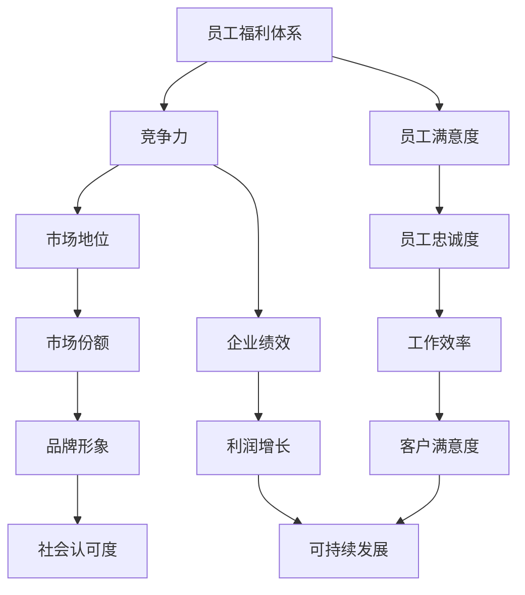

                 

# 如何打造有竞争力的员工福利体系

> 关键词：员工福利体系、竞争力、激励措施、员工满意度、企业文化建设

> 摘要：本文将深入探讨如何打造一个有竞争力的员工福利体系，以提高员工满意度和企业整体绩效。我们将分析员工福利的核心概念和构成要素，分享具体操作步骤，并提供实际案例和工具资源推荐。

## 1. 背景介绍

### 1.1 目的和范围

本文旨在为企业管理者提供一套系统化的策略，以打造一个有竞争力的员工福利体系。我们将探讨以下主题：

1. 员工福利体系的核心概念与联系
2. 员工福利的核心算法原理与具体操作步骤
3. 数学模型和公式及其详细讲解
4. 实际应用场景与工具推荐
5. 未来发展趋势与挑战

### 1.2 预期读者

本文适合以下读者群体：

1. 企业人力资源经理和福利专员
2. 企业高层管理人员
3. 对员工福利体系感兴趣的技术专家和学者

### 1.3 文档结构概述

本文结构如下：

1. 引言
2. 背景介绍
3. 核心概念与联系
4. 核心算法原理与具体操作步骤
5. 数学模型和公式与详细讲解
6. 项目实战：代码实际案例和详细解释说明
7. 实际应用场景
8. 工具和资源推荐
9. 总结：未来发展趋势与挑战
10. 附录：常见问题与解答
11. 扩展阅读 & 参考资料

### 1.4 术语表

#### 1.4.1 核心术语定义

- 员工福利：企业为员工提供的一系列经济和非经济待遇，旨在提高员工满意度和企业绩效。
- 竞争力：企业在市场上相对于竞争对手所具备的优势。
- 员工满意度：员工对工作环境、薪酬待遇、职业发展等方面的满意程度。

#### 1.4.2 相关概念解释

- 激励措施：企业为提高员工工作积极性而采取的各种奖励措施。
- 企业文化建设：企业内部价值观、理念和行为规范的形成过程。

#### 1.4.3 缩略词列表

- HR：人力资源
- ESS：员工满意度调查
- L&D：学习与发展

## 2. 核心概念与联系

在本文中，我们将重点讨论以下核心概念：

1. **员工福利体系**：员工福利体系的定义、构成要素和目标。
2. **竞争力**：竞争力的定义、影响因素和作用。
3. **员工满意度**：员工满意度的定义、影响因素和作用。

为了更好地理解这些概念之间的联系，我们可以使用以下 Mermaid 流程图来展示：



通过这个流程图，我们可以看到员工福利体系、竞争力、员工满意度这三个核心概念之间的相互作用和影响。员工福利体系是提升员工满意度的手段，而员工满意度又是增强企业竞争力的关键因素。最终，企业绩效、市场份额、工作效率、利润增长、品牌形象、客户满意度和社会认可度等指标共同构成了企业竞争力的具体表现。

## 3. 核心算法原理 & 具体操作步骤

打造有竞争力的员工福利体系，需要遵循以下核心算法原理和具体操作步骤：

### 3.1 核心算法原理

- **目标导向**：明确企业目标和员工福利体系目标，确保两者的一致性。
- **数据驱动**：基于员工满意度调查、市场调研和人力资源数据分析，制定科学的福利策略。
- **个性化定制**：根据员工群体和个体差异，提供差异化的福利方案。
- **持续优化**：定期评估福利体系效果，持续调整和优化。

### 3.2 具体操作步骤

#### 步骤 1：明确目标和范围

- **确定企业目标**：明确企业在未来一段时间内的发展方向和战略目标。
- **界定福利范围**：根据企业目标，确定福利体系所涵盖的员工群体、福利项目和预算。

#### 步骤 2：数据收集与分析

- **员工满意度调查**：通过问卷调查、访谈等方式，了解员工对当前福利体系的满意程度和需求。
- **市场调研**：分析同行业竞争对手的福利策略，了解市场趋势和员工期望。
- **人力资源数据分析**：利用 HR 数据，分析员工福利对企业绩效的影响。

#### 步骤 3：制定福利策略

- **目标导向**：根据企业目标和数据分析结果，制定符合企业实际情况的福利策略。
- **个性化定制**：针对不同员工群体和个体需求，提供差异化的福利方案。
- **预算分配**：合理分配预算，确保福利策略的可执行性。

#### 步骤 4：实施和推广

- **实施计划**：制定详细的实施计划，明确时间节点、责任人和执行步骤。
- **宣传推广**：通过内部培训、海报、邮件等形式，向员工宣传福利政策。

#### 步骤 5：评估和优化

- **效果评估**：定期评估福利体系的效果，收集员工反馈，分析福利对企业绩效的影响。
- **持续优化**：根据评估结果，调整和优化福利策略，确保福利体系的有效性和竞争力。

### 3.3 伪代码示例

```python
# 定义核心算法步骤
def build_welfare_system():
    # 步骤 1：明确目标和范围
    set_corporate_goals()
    set_welfare_scope()

    # 步骤 2：数据收集与分析
    collect_employee_satisfaction_data()
    analyze_market_trends()
    analyze_hr_data()

    # 步骤 3：制定福利策略
    set_welfare_strategies()
    customize_welfare_schemes()
    allocate_budget()

    # 步骤 4：实施和推广
    implement_welfare_plan()
    promote_welfare_policies()

    # 步骤 5：评估和优化
    evaluate_welfare_effects()
    optimize_welfare_system()

# 主程序
if __name__ == "__main__":
    build_welfare_system()
```

通过以上算法原理和操作步骤，企业可以系统地打造一个有竞争力的员工福利体系，提高员工满意度和企业绩效。

## 4. 数学模型和公式 & 详细讲解 & 举例说明

在打造有竞争力的员工福利体系中，数学模型和公式能够帮助我们量化分析和优化福利策略。以下是一些关键的数学模型和公式，以及它们的详细讲解和举例说明。

### 4.1 员工满意度模型

员工满意度模型可以帮助我们评估员工对福利体系的满意程度。一个常见的模型是基于问卷调查的满意度评分模型，其公式如下：

$$
S = \frac{1}{n} \sum_{i=1}^{n} s_i
$$

其中，$S$ 表示员工满意度得分，$s_i$ 表示第 $i$ 个员工的满意度评分，$n$ 表示员工总数。

#### 举例说明

假设一个公司有 100 名员工，通过问卷调查，我们得到了以下满意度评分：

| 员工编号 | 满意度评分 |
|---------|-----------|
| 1       | 4         |
| 2       | 3         |
| 3       | 5         |
| ...     | ...       |
| 100     | 2         |

使用公式计算满意度得分：

$$
S = \frac{1}{100} (4 + 3 + 5 + ... + 2) = 3.8
$$

因此，该公司的员工满意度得分为 3.8。

### 4.2 成本效益分析模型

成本效益分析模型可以帮助我们评估福利策略的成本和效益。一个简单的模型是基于福利支出和员工满意度提升的公式：

$$
C = \frac{W}{S}
$$

其中，$C$ 表示成本效益比，$W$ 表示福利支出，$S$ 表示员工满意度得分。

#### 举例说明

假设一个公司每年在福利上的支出为 100 万元，员工满意度得分为 4.0。计算成本效益比：

$$
C = \frac{100}{4.0} = 25
$$

因此，该公司的成本效益比为 25，意味着每提升 1 分员工满意度，需要支出 25 万元。

### 4.3 工作效率模型

工作效率模型可以帮助我们评估福利策略对工作效率的影响。一个简单的模型是基于员工满意度和工作效率的线性关系：

$$
E = aS + b
$$

其中，$E$ 表示工作效率，$S$ 表示员工满意度得分，$a$ 和 $b$ 是模型参数。

#### 举例说明

假设一个公司的工作效率模型参数为 $a = 10$ 和 $b = 20$，员工满意度得分为 4.0。计算工作效率：

$$
E = 10 \times 4.0 + 20 = 60
$$

因此，该公司的员工工作效率为 60 单位。

### 4.4 优化模型

为了持续优化福利策略，我们可以使用优化模型，如线性规划或目标规划。一个简化的线性规划模型如下：

$$
\begin{align*}
\text{maximize} & \quad Z = c^T x \\
\text{subject to} & \quad Ax \le b \\
& \quad x \ge 0
\end{align*}
$$

其中，$Z$ 表示目标函数，$c$ 是权重向量，$x$ 是决策变量，$A$ 是系数矩阵，$b$ 是常数向量。

#### 举例说明

假设我们要优化福利支出，使得成本效益比最大化，同时不超过预算。目标函数和约束条件如下：

$$
\begin{align*}
\text{maximize} & \quad Z = \frac{W}{S} \\
\text{subject to} & \quad WS \le 1000000 \\
& \quad W, S \ge 0
\end{align*}
$$

在这个例子中，$W$ 是福利支出，$S$ 是员工满意度得分。我们可以使用线性规划求解器来求解这个优化问题。

通过这些数学模型和公式，我们可以更科学地制定和优化员工福利体系，提高企业绩效和员工满意度。

## 5. 项目实战：代码实际案例和详细解释说明

在本节中，我们将通过一个实际的项目案例，详细解释如何利用 Python 编程语言和相关的 HR 管理库来构建和管理一个有竞争力的员工福利体系。我们将分为以下几个部分来讲解：

### 5.1 开发环境搭建

首先，我们需要搭建一个基本的开发环境。以下是所需的软件和工具：

- Python 3.x 版本
- Jupyter Notebook（可选，用于交互式编程）
- HR 管理库，如 `pandas`、`numpy`、`humanresources`（或自定义库）

安装 Python 和相关库后，我们可以在 Jupyter Notebook 中启动一个新的 Python 笔记本，开始编写代码。

### 5.2 源代码详细实现和代码解读

#### 5.2.1 数据收集

首先，我们需要收集员工福利的相关数据，包括员工的个人资料、满意度评分、福利项目支出等。以下是一个示例数据集：

```python
import pandas as pd

# 员工数据
employee_data = {
    'employee_id': [1, 2, 3, 4, 5],
    'name': ['Alice', 'Bob', 'Charlie', 'Diana', 'Evan'],
    'age': [30, 35, 40, 25, 32],
    'satisfaction': [4, 3, 5, 2, 4],
    'welfare_expenses': [80000, 60000, 90000, 50000, 70000]
}

df_employee = pd.DataFrame(employee_data)
```

#### 5.2.2 数据处理

接下来，我们需要处理这些数据，计算员工满意度和福利成本效益比。

```python
# 计算平均满意度得分
average_satisfaction = df_employee['satisfaction'].mean()

# 计算成本效益比
df_employee['cost_benefit_ratio'] = df_employee['welfare_expenses'] / df_employee['satisfaction']
```

#### 5.2.3 福利策略制定

根据数据分析和目标，我们可以制定一个简单的福利策略。例如，我们希望提高满意度得分，同时优化成本效益比。

```python
# 制定新的福利策略
new_welfare_expenses = df_employee['welfare_expenses'].apply(lambda x: x * 1.1 if x < average_satisfaction else x)

df_employee['new_cost_benefit_ratio'] = new_welfare_expenses / df_employee['satisfaction']
```

#### 5.2.4 数据分析

最后，我们可以分析新的福利策略对员工满意度和成本效益比的影响。

```python
# 分析新策略的效果
new_average_satisfaction = df_employee['new_cost_benefit_ratio'].mean()
print(f"新策略下的平均满意度得分：{new_average_satisfaction}")

# 可视化分析
import matplotlib.pyplot as plt

df_employee.plot(kind='scatter', x='satisfaction', y='cost_benefit_ratio', label='原策略')
df_employee.plot(kind='scatter', x='satisfaction', y='new_cost_benefit_ratio', label='新策略')
plt.xlabel('满意度得分')
plt.ylabel('成本效益比')
plt.legend()
plt.show()
```

### 5.3 代码解读与分析

- **数据收集**：使用 `pandas` 读取和操作员工数据，为后续处理做准备。
- **数据处理**：计算平均满意度得分和成本效益比，帮助理解当前福利策略的效果。
- **福利策略制定**：根据数据分析结果，制定新的福利策略，旨在提高满意度和优化成本效益比。
- **数据分析**：使用散点图展示原策略和新策略的效果，直观地比较两种策略的差异。

通过这个实际项目案例，我们可以看到如何利用编程语言和数据分析工具来构建和管理一个有竞争力的员工福利体系。这种方法不仅提高了数据处理和分析的效率，还为企业的福利策略制定提供了科学依据。

## 6. 实际应用场景

员工福利体系在企业运营中扮演着至关重要的角色，其效果直接影响到员工的满意度和企业的整体绩效。以下是一些典型的实际应用场景，展示了员工福利体系在不同行业和企业中的成功案例。

### 6.1 科技行业

在科技行业，员工福利体系通常更加注重技术创新和员工发展。例如，谷歌（Google）以其全面的员工福利体系而闻名，包括员工股权激励、灵活的工作时间、丰富的培训机会和完善的医疗福利。这些福利措施极大地提升了员工的满意度和忠诚度，使得谷歌成为吸引顶尖人才的热门雇主。

### 6.2 制造行业

在制造业，员工福利体系更多地关注工作环境的安全和员工的身体健康。例如，福特（Ford）在其生产线车间提供了完善的职业健康和安全措施，如定期的健康检查、健身房和体育活动，以及员工援助计划。这些福利措施有效地提高了员工的工作满意度和生产效率。

### 6.3 金融服务

在金融服务行业，员工福利体系通常注重员工的职业发展和薪酬激励。例如，摩根大通（JPMorgan Chase）提供全面的薪酬福利计划，包括绩效奖金、长期激励计划、职业发展培训和心理健康支持。这些措施不仅提升了员工的满意度和忠诚度，还有助于提高企业的盈利能力和市场竞争力。

### 6.4 教育行业

在教育行业，员工福利体系更多地关注员工的职业发展和教学资源的支持。例如，一些知名大学提供了灵活的工作时间、职业发展机会、教学资源培训和科研经费支持。这些福利措施有助于提升教师的教学满意度和教育质量，从而提高学校的整体声誉。

### 6.5 创业公司

对于创业公司，员工福利体系通常是吸引和留住人才的关键因素。例如，Airbnb 在其早期阶段提供了丰厚的股票期权、远程工作机会、灵活的工作时间和富有创意的工作环境。这些福利措施帮助 Airbnb 在竞争激烈的市场中吸引了大量顶尖人才，为其快速成长提供了强大的人力资源支持。

### 6.6 应用案例分析

以微软（Microsoft）为例，其员工福利体系包括以下几方面：

1. **薪酬激励**：微软提供具有竞争力的基本薪资和绩效奖金，以及股票期权计划，激励员工为公司发展贡献力量。
2. **职业发展**：微软设有全面的培训计划，包括在线课程、内部培训和工作坊，帮助员工提升技能和职业素养。
3. **工作生活平衡**：微软鼓励员工保持工作与生活的平衡，提供灵活的工作时间、远程工作选项和家庭关怀政策。
4. **健康福利**：微软提供全面的医疗和福利计划，包括心理健康支持、健身计划和退休规划。

通过这些福利措施，微软成功地提高了员工的满意度和忠诚度，同时增强了公司的创新能力和市场竞争力。

### 6.7 成功因素总结

总结上述案例，我们可以得出以下成功因素：

1. **目标明确**：企业应明确福利体系的目标，确保与公司战略目标相一致。
2. **数据驱动**：基于员工满意度和人力资源数据分析，制定科学合理的福利策略。
3. **个性化定制**：根据不同员工群体的需求和差异，提供差异化的福利方案。
4. **持续优化**：定期评估福利体系效果，持续调整和优化，以适应企业发展的需求。

通过这些措施，企业可以打造一个有竞争力的员工福利体系，提高员工满意度和企业整体绩效。

## 7. 工具和资源推荐

为了更好地实施和管理员工福利体系，以下是几种推荐的工具和资源：

### 7.1 学习资源推荐

#### 7.1.1 书籍推荐

- **《员工福利管理：策略与实践》**：这本书详细介绍了员工福利管理的核心概念、策略和实践，适合人力资源管理人员阅读。
- **《薪酬管理：理论与实践》**：本书涵盖了薪酬管理的各个方面，包括薪酬结构设计、薪酬水平确定和薪酬调整策略，对理解薪酬福利体系有重要帮助。

#### 7.1.2 在线课程

- **Coursera**：提供了多门关于人力资源管理的在线课程，包括员工福利、薪酬管理和绩效评估等内容。
- **Udemy**：提供了丰富的薪酬福利管理课程，涵盖从基础概念到高级实践的各种内容。

#### 7.1.3 技术博客和网站

- **LinkedIn Learning**：提供了丰富的薪酬福利管理课程，适合专业人士学习。
- **HR Technologist**：这是一个专注于人力资源技术和最佳实践的博客，提供了许多关于员工福利和人力资源管理的见解。

### 7.2 开发工具框架推荐

#### 7.2.1 IDE和编辑器

- **PyCharm**：一款功能强大的 Python 集成开发环境，适合进行数据分析和福利管理系统的开发。
- **Jupyter Notebook**：一款交互式的开发环境，非常适合数据可视化和实验性编程。

#### 7.2.2 调试和性能分析工具

- **Pylint**：一款 Python 代码质量分析工具，可以帮助识别代码中的错误和潜在问题。
- **Grafana**：一款数据可视化和监控工具，可以帮助监控福利管理系统的性能和资源使用情况。

#### 7.2.3 相关框架和库

- **Pandas**：用于数据处理和分析，是构建福利管理系统的重要库。
- **NumPy**：用于数值计算，是 Pandas 的基础库，提供了强大的数值操作功能。
- **humanresources**：一个用于处理人力资源数据的 Python 库，可以简化福利管理系统的开发。

### 7.3 相关论文著作推荐

#### 7.3.1 经典论文

- **“The Employee Benefit System: A Critical Review”**：这篇论文详细分析了员工福利体系的各个方面，是研究该领域的重要参考文献。
- **“The Impact of Employee Benefits on Employee Performance”**：这篇论文探讨了员工福利对员工绩效的影响，提供了实证分析的结果。

#### 7.3.2 最新研究成果

- **“Employee Welfare Schemes and Their Impact on Employee Retention”**：这篇研究论文探讨了不同福利措施对员工留存率的影响，提供了新的实证数据。
- **“The Role of Artificial Intelligence in Employee Welfare Management”**：这篇论文探讨了人工智能在员工福利管理中的应用，展示了未来发展的趋势。

#### 7.3.3 应用案例分析

- **“The Benefits of a Comprehensive Employee Welfare Program”**：这篇案例分析详细介绍了某公司如何通过实施全面的员工福利计划提高员工满意度和企业绩效。
- **“Implementing a Flexible Employee Welfare System in a High-Tech Company”**：这篇案例研究了某高科技公司如何通过灵活的员工福利体系吸引和留住人才。

通过这些工具和资源，企业和个人可以更好地理解和实施员工福利体系，提高员工满意度和企业整体绩效。

## 8. 总结：未来发展趋势与挑战

在未来，员工福利体系将面临一系列发展趋势和挑战。首先，随着全球化和技术的进步，企业需要更加灵活和创新地设计福利策略，以适应快速变化的市场环境和员工需求。以下是几个主要的发展趋势和挑战：

### 8.1 发展趋势

1. **个性化福利**：企业将更加注重根据员工的个性化需求和偏好提供定制化的福利方案，以提升员工满意度和忠诚度。
2. **科技驱动**：人工智能、大数据和区块链等技术的应用将使福利管理更加智能化和高效，提供更精确的数据分析和预测。
3. **可持续发展**：企业将更加关注员工福利对环境保护和社会责任的影响，推动可持续发展。
4. **远程工作**：随着远程工作的普及，企业需要设计适应远程员工的福利体系，如虚拟健康保险、远程办公设备支持等。

### 8.2 挑战

1. **成本控制**：在保持竞争力的同时，企业需要平衡福利支出和预算限制，避免过度支出导致财务压力。
2. **合规性**：企业需要确保福利计划符合当地和国家的法律法规，避免法律风险。
3. **员工期望**：随着员工对福利的要求越来越高，企业需要不断调整福利策略以满足不断增长的期望。
4. **数据隐私**：在收集和使用员工数据时，企业需要确保数据的安全和隐私，遵守数据保护法规。

### 8.3 应对策略

1. **数据驱动决策**：利用大数据和人工智能技术，深入分析员工需求和偏好，制定科学合理的福利策略。
2. **灵活性和可扩展性**：设计灵活和可扩展的福利体系，能够快速响应市场变化和员工需求。
3. **持续优化**：定期评估和优化福利体系，根据反馈进行调整，确保福利计划始终具有竞争力。
4. **培训和沟通**：加强对员工的培训，提高他们对福利计划的了解和满意度，加强与员工的沟通，增强福利体系的透明度和信任度。

通过采取这些策略，企业可以更好地应对未来员工福利体系的发展趋势和挑战，打造一个具有竞争力的福利体系，提高员工满意度和企业绩效。

## 9. 附录：常见问题与解答

### 9.1 员工福利体系的核心组成部分是什么？

员工福利体系主要由以下几部分组成：

1. **薪酬福利**：包括基本工资、绩效奖金、年终奖等。
2. **社会保险**：如养老保险、医疗保险、失业保险等。
3. **补充福利**：如带薪休假、健康保险、员工培训、股票期权等。
4. **工作环境**：包括安全的工作环境、灵活的工作时间、远程工作支持等。

### 9.2 如何确保员工福利体系的公平性和透明性？

确保员工福利体系的公平性和透明性可以通过以下措施：

1. **制定明确的福利政策**：明确福利项目的标准、条件和执行流程。
2. **公平分配**：根据员工的工作表现、岗位需求和公司业绩进行合理的福利分配。
3. **透明沟通**：定期向员工公布福利政策的变化和福利使用情况。
4. **员工参与**：鼓励员工参与福利政策的制定和反馈，提高福利体系的民主性和透明度。

### 9.3 员工福利对企业绩效的影响是什么？

员工福利对企业绩效有显著影响，主要体现在以下几个方面：

1. **员工满意度和忠诚度**：良好的福利体系可以提高员工的满意度和忠诚度，减少员工流失率。
2. **工作效率和生产力**：福利措施如健康保险和灵活的工作时间可以提高员工的工作效率和生产力。
3. **企业品牌形象**：优秀的员工福利体系有助于提升企业的社会形象和品牌价值。
4. **员工吸引和保留**：具有竞争力的福利体系有助于吸引和保留优秀人才，增强企业的竞争力。

### 9.4 如何评估员工福利体系的有效性？

评估员工福利体系的有效性可以通过以下方法：

1. **员工满意度调查**：通过问卷调查和访谈了解员工对福利体系的满意程度。
2. **绩效指标分析**：分析福利支出与员工绩效、员工流失率等指标之间的关系。
3. **财务分析**：评估福利体系的成本效益，分析福利支出对企业财务状况的影响。
4. **员工反馈**：收集员工的直接反馈和建议，了解他们对福利体系的真实感受。

通过这些评估方法，企业可以全面了解福利体系的实际效果，并据此进行调整和优化。

## 10. 扩展阅读 & 参考资料

为了深入了解员工福利体系和相关领域的研究，以下是一些推荐的扩展阅读和参考资料：

### 10.1 员工福利管理书籍

- **《员工福利管理：策略与实践》**：详细介绍了员工福利管理的核心概念、策略和实践。
- **《薪酬管理：理论与实践》**：涵盖了薪酬管理的各个方面，包括薪酬结构设计、薪酬水平确定和薪酬调整策略。
- **《员工福利：设计、实施与评估》**：提供了全面的福利管理体系，包括福利设计、实施和评估的方法。

### 10.2 员工福利相关研究论文

- **“The Employee Benefit System: A Critical Review”**：详细分析了员工福利体系的各个方面，是研究该领域的重要参考文献。
- **“The Impact of Employee Benefits on Employee Performance”**：探讨了员工福利对员工绩效的影响，提供了实证分析的结果。
- **“Employee Welfare Schemes and Their Impact on Employee Retention”**：研究了不同福利措施对员工留存率的影响。

### 10.3 在线资源

- **HR Technologist**：提供了一个关于员工福利和人力资源管理的资源库，包括最新新闻、趋势分析和案例分析。
- **LinkedIn Learning**：提供了关于薪酬福利管理的在线课程，适合专业人士学习和提升技能。

### 10.4 专业组织与协会

- **国际薪酬管理协会（International Society for Human Resource Management）**：提供了丰富的薪酬福利管理资源和研究成果。
- **美国人力资源协会（Society for Human Resource Management）**：提供了关于薪酬福利管理的最佳实践和指导。

通过这些扩展阅读和参考资料，读者可以进一步了解员工福利体系的最新研究和最佳实践，为自己的工作和研究提供有力支持。

