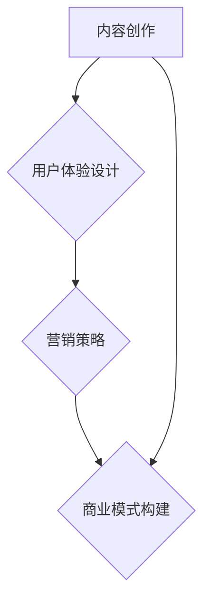

                 

# 如何打造知识付费的付费专栏

> 关键词：知识付费、付费专栏、内容创作、用户体验、营销策略、商业模式

> 摘要：本文将深入探讨如何打造成功的知识付费专栏，包括内容创作、用户体验设计、营销策略、商业模式构建等多个方面。通过一步步的分析和实战案例，帮助您在知识付费领域脱颖而出。

## 1. 背景介绍

### 1.1 目的和范围

本文旨在帮助那些希望在知识付费领域建立个人品牌或打造付费专栏的创作者和专家。我们将探讨以下几个核心问题：

- 如何选择合适的主题和内容？
- 如何确保高质量的内容创作？
- 如何设计用户友好的专栏体验？
- 如何制定有效的营销策略？
- 如何构建可持续的商业模式？

### 1.2 预期读者

- 创作者和专家，希望将自己的专业知识转化为付费内容
- 市场营销人员，希望提升知识付费项目的营销效果
- 创业者，希望了解知识付费商业模式的构建

### 1.3 文档结构概述

本文将分为以下几个部分：

- 背景介绍：介绍本文的目的、范围和预期读者
- 核心概念与联系：解释知识付费专栏的核心概念和架构
- 核心算法原理 & 具体操作步骤：详细阐述内容创作和用户体验设计的流程
- 数学模型和公式 & 详细讲解 & 举例说明：运用数学模型来分析用户行为和需求
- 项目实战：提供代码实现和案例解析
- 实际应用场景：探讨知识付费专栏在不同领域的应用
- 工具和资源推荐：推荐学习资源和开发工具
- 总结：讨论知识付费专栏的未来发展趋势与挑战
- 附录：常见问题与解答
- 扩展阅读 & 参考资料：提供进一步学习资源

### 1.4 术语表

#### 1.4.1 核心术语定义

- 知识付费：用户为获取有价值的信息或知识而支付费用
- 付费专栏：针对特定主题的系列内容，用户需支付一定费用才能访问
- 内容创作：创建和编辑有价值的信息或知识的过程
- 用户体验：用户在使用专栏过程中所感受到的愉悦度和满意度
- 营销策略：吸引和留住用户的一系列策略和方法
- 商业模式：知识付费专栏的盈利模式

#### 1.4.2 相关概念解释

- **订阅模式**：用户支付一定费用，即可无限次访问专栏内容
- **单次购买模式**：用户为访问单个内容支付费用
- **VIP模式**：用户支付较高费用，获得更多特权和内容访问权限
- **CPC/CPM模式**：广告主为每千次展示或点击支付费用

#### 1.4.3 缩略词列表

- **SaaS**：软件即服务（Software as a Service）
- **PaaS**：平台即服务（Platform as a Service）
- **IaaS**：基础设施即服务（Infrastructure as a Service）
- **SEO**：搜索引擎优化（Search Engine Optimization）
- **SEM**：搜索引擎营销（Search Engine Marketing）

## 2. 核心概念与联系

在知识付费专栏的设计和构建过程中，我们需要关注以下几个核心概念：

### 2.1 内容创作

内容创作是知识付费专栏的核心，决定了专栏的价值和质量。以下是一个简化的内容创作流程：

1. **市场调研**：了解用户需求和市场趋势，确定主题和方向
2. **内容规划**：制定内容大纲，确保内容的系统性和连贯性
3. **内容创作**：撰写和编辑高质量的文章、视频、音频等
4. **内容审核**：确保内容准确、合规、无抄袭
5. **内容发布**：定期发布内容，维护用户粘性

### 2.2 用户体验设计

用户体验设计决定了用户在访问专栏时的愉悦度和满意度。以下是一个简化的用户体验设计流程：

1. **用户调研**：了解用户需求、偏好和行为习惯
2. **需求分析**：确定核心用户需求和目标
3. **界面设计**：设计简洁、直观、易用的界面
4. **交互设计**：优化用户与内容的交互方式
5. **测试与优化**：通过A/B测试、用户反馈等不断优化设计

### 2.3 营销策略

营销策略决定了如何吸引和留住用户。以下是一个简化的营销策略流程：

1. **定位**：确定专栏的目标用户和市场定位
2. **品牌建设**：建立独特的品牌形象和价值观
3. **渠道选择**：选择合适的推广渠道，如社交媒体、博客、论坛等
4. **内容营销**：创作有价值的文章、视频、音频等，吸引目标用户
5. **数据分析**：通过数据监控和反馈，优化营销策略

### 2.4 商业模式构建

商业模式构建是知识付费专栏的盈利关键。以下是一个简化的商业模式构建流程：

1. **定价策略**：确定合理的价格策略，考虑成本、市场、竞争等因素
2. **收费模式**：选择订阅、单次购买、VIP等收费模式
3. **变现渠道**：通过广告、会员、课程销售等渠道实现盈利
4. **成本控制**：优化成本结构，提高盈利能力
5. **持续优化**：根据市场反馈和运营数据，不断调整和优化商业模式

### 2.5 Mermaid 流程图

以下是一个简单的 Mermaid 流程图，展示了知识付费专栏的核心概念和联系：



## 3. 核心算法原理 & 具体操作步骤

### 3.1 内容创作算法原理

内容创作是知识付费专栏的核心，以下是内容创作算法的原理：

1. **需求分析**：通过市场调研和用户反馈，了解用户需求
2. **主题确定**：根据需求分析，选择有吸引力的主题
3. **大纲制定**：制定内容大纲，确保内容的系统性和连贯性
4. **内容撰写**：撰写高质量的文章、视频、音频等
5. **内容审核**：确保内容准确、合规、无抄袭
6. **内容发布**：定期发布内容，维护用户粘性

### 3.2 具体操作步骤

以下是一个简化的内容创作具体操作步骤：

1. **需求分析**：

   ```mermaid
   graph TD
       A[市场调研] --> B[用户反馈]
       B --> C[需求分析]
   ```

2. **主题确定**：

   ```mermaid
   graph TD
       A[需求分析] --> B{确定主题}
       B --> C[收集素材]
   ```

3. **大纲制定**：

   ```mermaid
   graph TD
       A{确定主题} --> B{制定大纲}
       B --> C[撰写内容]
   ```

4. **内容撰写**：

   ```mermaid
   graph TD
       A{制定大纲} --> B{撰写内容}
       B --> C[内容审核]
   ```

5. **内容审核**：

   ```mermaid
   graph TD
       A{撰写内容} --> B{内容审核}
       B --> C[内容发布]
   ```

6. **内容发布**：

   ```mermaid
   graph TD
       A{内容审核} --> B{内容发布}
       B --> C[用户反馈]
   ```

### 3.3 用户友好的专栏体验设计算法原理

用户友好的专栏体验设计是为了提升用户的满意度，以下是设计算法的原理：

1. **用户调研**：了解用户需求、偏好和行为习惯
2. **需求分析**：确定核心用户需求和目标
3. **界面设计**：设计简洁、直观、易用的界面
4. **交互设计**：优化用户与内容的交互方式
5. **测试与优化**：通过A/B测试、用户反馈等不断优化设计

### 3.4 具体操作步骤

以下是一个简化的用户友好的专栏体验设计具体操作步骤：

1. **用户调研**：

   ```mermaid
   graph TD
       A[问卷调查] --> B[用户访谈]
       B --> C[行为分析]
   ```

2. **需求分析**：

   ```mermaid
   graph TD
       A{行为分析} --> B{需求分析}
       B --> C[界面设计]
   ```

3. **界面设计**：

   ```mermaid
   graph TD
       A{需求分析} --> B{界面设计}
       B --> C[交互设计]
   ```

4. **交互设计**：

   ```mermaid
   graph TD
       A{界面设计} --> B{交互设计}
       B --> C[测试与优化]
   ```

5. **测试与优化**：

   ```mermaid
   graph TD
       A{交互设计} --> B{A/B测试}
       B --> C[用户反馈]
   ```

### 3.5 营销策略算法原理

营销策略是为了吸引和留住用户，以下是营销策略的算法原理：

1. **定位**：确定专栏的目标用户和市场定位
2. **品牌建设**：建立独特的品牌形象和价值观
3. **渠道选择**：选择合适的推广渠道，如社交媒体、博客、论坛等
4. **内容营销**：创作有价值的文章、视频、音频等，吸引目标用户
5. **数据分析**：通过数据监控和反馈，优化营销策略

### 3.6 具体操作步骤

以下是一个简化的营销策略具体操作步骤：

1. **定位**：

   ```mermaid
   graph TD
       A[市场调研] --> B{确定定位}
       B --> C[品牌建设]
   ```

2. **品牌建设**：

   ```mermaid
   graph TD
       A{确定定位} --> B{品牌建设}
       B --> C[渠道选择]
   ```

3. **渠道选择**：

   ```mermaid
   graph TD
       A{品牌建设} --> B{渠道选择}
       B --> C[内容营销]
   ```

4. **内容营销**：

   ```mermaid
   graph TD
       A{渠道选择} --> B{内容营销}
       B --> C[数据分析]
   ```

5. **数据分析**：

   ```mermaid
   graph TD
       A{内容营销} --> B{数据分析}
       B --> C[优化策略]
   ```

### 3.7 商业模式构建算法原理

商业模式构建是为了实现知识付费专栏的盈利，以下是构建算法的原理：

1. **定价策略**：确定合理的价格策略，考虑成本、市场、竞争等因素
2. **收费模式**：选择订阅、单次购买、VIP等收费模式
3. **变现渠道**：通过广告、会员、课程销售等渠道实现盈利
4. **成本控制**：优化成本结构，提高盈利能力
5. **持续优化**：根据市场反馈和运营数据，不断调整和优化商业模式

### 3.8 具体操作步骤

以下是一个简化的商业模式构建具体操作步骤：

1. **定价策略**：

   ```mermaid
   graph TD
       A[市场调研] --> B{定价策略}
       B --> C[收费模式]
   ```

2. **收费模式**：

   ```mermaid
   graph TD
       A{定价策略} --> B{收费模式}
       B --> C[变现渠道]
   ```

3. **变现渠道**：

   ```mermaid
   graph TD
       A{收费模式} --> B{变现渠道}
       B --> C[成本控制]
   ```

4. **成本控制**：

   ```mermaid
   graph TD
       A{变现渠道} --> B{成本控制}
       B --> C[持续优化]
   ```

5. **持续优化**：

   ```mermaid
   graph TD
       A{成本控制} --> B{持续优化}
       B --> C[市场反馈]
   ```

## 4. 数学模型和公式 & 详细讲解 & 举例说明

### 4.1 用户行为模型

用户行为模型用于分析用户在知识付费专栏中的行为，以下是用户行为模型的基本公式：

1. **用户转化率**：

   $$ 转化率 = \frac{成功转化用户数}{总访问用户数} $$

   其中，成功转化用户数表示完成付费行为的用户数，总访问用户数表示访问专栏的用户数。

2. **用户留存率**：

   $$ 留存率 = \frac{持续访问用户数}{初始访问用户数} $$

   其中，持续访问用户数表示在一定时间内持续访问专栏的用户数，初始访问用户数表示首次访问专栏的用户数。

3. **用户流失率**：

   $$ 流失率 = \frac{流失用户数}{初始访问用户数} $$

   其中，流失用户数表示在一定时间内不再访问专栏的用户数。

### 4.2 用户需求模型

用户需求模型用于分析用户对知识付费专栏的需求，以下是用户需求模型的基本公式：

1. **需求强度**：

   $$ 需求强度 = \frac{需求得分}{最大需求得分} $$

   其中，需求得分表示用户对专栏的需求程度，最大需求得分表示用户对专栏的最大需求程度。

2. **需求满足度**：

   $$ 满足度 = \frac{实际需求得分}{最大需求得分} $$

   其中，实际需求得分表示用户对当前专栏的需求程度，最大需求得分表示用户对专栏的最大需求程度。

### 4.3 举例说明

假设有一个知识付费专栏，用户数为1000人，其中500人完成了付费行为，300人持续访问专栏，200人不再访问。现在我们来计算相关指标：

1. **用户转化率**：

   $$ 转化率 = \frac{500}{1000} = 50\% $$

2. **用户留存率**：

   $$ 留存率 = \frac{300}{1000} = 30\% $$

3. **用户流失率**：

   $$ 流失率 = \frac{200}{1000} = 20\% $$

4. **需求强度**：

   假设最大需求得分为10分，用户对专栏的需求得分为7分，则需求强度为：

   $$ 需求强度 = \frac{7}{10} = 0.7 $$

5. **需求满足度**：

   假设实际需求得分为5分，最大需求得分为10分，则需求满足度为：

   $$ 满足度 = \frac{5}{10} = 0.5 $$

通过这些公式和指标，我们可以更好地了解用户在知识付费专栏中的行为和需求，从而优化专栏的内容、用户体验和营销策略。

## 5. 项目实战：代码实际案例和详细解释说明

### 5.1 开发环境搭建

为了更好地演示知识付费专栏的构建，我们使用 Python 语言和 Flask 框架来搭建一个简单的知识付费专栏系统。以下是开发环境搭建的步骤：

1. 安装 Python 3.8 或更高版本
2. 安装 Flask 框架：`pip install flask`
3. 创建一个名为 `knowledge专栏` 的文件夹
4. 在文件夹中创建一个名为 `app.py` 的 Python 文件

### 5.2 源代码详细实现和代码解读

以下是一个简单的 Flask 应用程序，用于构建一个知识付费专栏系统。我们将在代码中逐步解释每个部分的用途。

```python
# 导入 Flask 框架
from flask import Flask, render_template, request, redirect, url_for

# 创建 Flask 应用程序实例
app = Flask(__name__)

# 配置数据库连接信息（可选）
DATABASE_URI = 'sqlite:///knowledge_column.db'

# 配置数据库连接（可选）
def init_db():
    import sqlite3
    conn = sqlite3.connect(DATABASE_URI)
    c = conn.cursor()
    c.execute('''CREATE TABLE IF NOT EXISTS users (id INTEGER PRIMARY KEY, username TEXT, password TEXT)''')
    c.execute('''CREATE TABLE IF NOT EXISTS articles (id INTEGER PRIMARY KEY, title TEXT, content TEXT)''')
    conn.commit()
    conn.close()

# 初始化数据库
init_db()

# 登录页面路由
@app.route('/login', methods=['GET', 'POST'])
def login():
    if request.method == 'POST':
        username = request.form['username']
        password = request.form['password']
        # 在此处添加用户身份验证逻辑（可选）
        return redirect(url_for('home'))
    return render_template('login.html')

# 主页面路由
@app.route('/')
@app.route('/home')
def home():
    # 在此处添加获取文章列表的逻辑
    articles = get_articles()
    return render_template('home.html', articles=articles)

# 获取文章列表（示例）
def get_articles():
    import sqlite3
    conn = sqlite3.connect(DATABASE_URI)
    c = conn.cursor()
    c.execute("SELECT id, title FROM articles")
    articles = c.fetchall()
    conn.close()
    return articles

# 文章详情页面路由
@app.route('/article/<int:article_id>')
def article(article_id):
    # 在此处添加获取文章详情的逻辑
    article = get_article(article_id)
    return render_template('article.html', article=article)

# 获取文章详情（示例）
def get_article(article_id):
    import sqlite3
    conn = sqlite3.connect(DATABASE_URI)
    c = conn.cursor()
    c.execute("SELECT id, title, content FROM articles WHERE id=?", (article_id,))
    article = c.fetchone()
    conn.close()
    return article

# 启动 Flask 应用程序
if __name__ == '__main__':
    app.run(debug=True)
```

### 5.3 代码解读与分析

以下是代码的解读和分析：

1. **导入 Flask 框架**：

   ```python
   from flask import Flask, render_template, request, redirect, url_for
   ```

   导入 Flask 框架和相关模块，用于构建 Web 应用程序。

2. **创建 Flask 应用程序实例**：

   ```python
   app = Flask(__name__)
   ```

   创建 Flask 应用程序实例，作为整个应用程序的核心。

3. **配置数据库连接信息**：

   ```python
   DATABASE_URI = 'sqlite:///knowledge_column.db'
   ```

   配置数据库连接信息，用于存储用户和文章数据。

4. **配置数据库连接**：

   ```python
   def init_db():
       import sqlite3
       conn = sqlite3.connect(DATABASE_URI)
       c = conn.cursor()
       c.execute('''CREATE TABLE IF NOT EXISTS users (id INTEGER PRIMARY KEY, username TEXT, password TEXT)''')
       c.execute('''CREATE TABLE IF NOT EXISTS articles (id INTEGER PRIMARY KEY, title TEXT, content TEXT)''')
       conn.commit()
       conn.close()
   ```

   初始化数据库，创建用户表和文章表。

5. **登录页面路由**：

   ```python
   @app.route('/login', methods=['GET', 'POST'])
   def login():
       if request.method == 'POST':
           username = request.form['username']
           password = request.form['password']
           # 在此处添加用户身份验证逻辑（可选）
           return redirect(url_for('home'))
       return render_template('login.html')
   ```

   定义登录页面路由，处理登录表单提交，实现用户身份验证。

6. **主页面路由**：

   ```python
   @app.route('/')
   @app.route('/home')
   def home():
       # 在此处添加获取文章列表的逻辑
       articles = get_articles()
       return render_template('home.html', articles=articles)
   ```

   定义主页面路由，获取文章列表，并传递给模板进行渲染。

7. **获取文章列表**：

   ```python
   def get_articles():
       import sqlite3
       conn = sqlite3.connect(DATABASE_URI)
       c = conn.cursor()
       c.execute("SELECT id, title FROM articles")
       articles = c.fetchall()
       conn.close()
       return articles
   ```

   定义获取文章列表的函数，查询数据库获取文章信息。

8. **文章详情页面路由**：

   ```python
   @app.route('/article/<int:article_id>')
   def article(article_id):
       # 在此处添加获取文章详情的逻辑
       article = get_article(article_id)
       return render_template('article.html', article=article)
   ```

   定义文章详情页面路由，获取指定文章的详细信息，并传递给模板进行渲染。

9. **获取文章详情**：

   ```python
   def get_article(article_id):
       import sqlite3
       conn = sqlite3.connect(DATABASE_URI)
       c = conn.cursor()
       c.execute("SELECT id, title, content FROM articles WHERE id=?", (article_id,))
       article = c.fetchone()
       conn.close()
       return article
   ```

   定义获取文章详情的函数，查询数据库获取指定文章的信息。

10. **启动 Flask 应用程序**：

    ```python
    if __name__ == '__main__':
        app.run(debug=True)
    ```

    启动 Flask 应用程序，在本地服务器上运行。

通过以上代码，我们实现了一个简单的知识付费专栏系统。用户可以登录系统，浏览和查看文章详情。当然，这只是一个基础示例，实际项目中还需要添加更多功能，如用户注册、文章发布、付费购买等。

## 6. 实际应用场景

知识付费专栏的应用场景非常广泛，以下是一些实际应用案例：

### 6.1 教育培训

知识付费专栏可以用于教育培训，如在线课程、技能培训、学历教育等。通过付费专栏，教师或教育机构可以提供高质量的教学内容，吸引更多学生和学员。同时，学生和学员可以根据自己的需求和进度，灵活选择和购买课程内容。

### 6.2 技术分享

技术专家可以通过知识付费专栏分享自己的技术知识和经验，如编程、大数据、人工智能、区块链等。通过付费专栏，专家可以吸引更多关注者和粉丝，提升个人品牌和影响力。同时，读者可以根据自己的技术水平和需求，选择适合的专栏内容进行学习和提升。

### 6.3 健康养生

健康养生专家可以通过知识付费专栏分享健康知识和养生方法，如食疗、运动、心理调适等。通过付费专栏，专家可以吸引更多健康爱好者，为他们提供有价值的信息和指导。同时，读者可以根据自己的健康需求，选择适合的专栏内容进行学习和实践。

### 6.4 职场提升

职场专家可以通过知识付费专栏分享职场知识和经验，如职业规划、简历撰写、面试技巧、团队管理等。通过付费专栏，专家可以吸引更多职场人士，为他们提供实用的职场知识和技能。同时，读者可以根据自己的职场需求，选择适合的专栏内容进行学习和提升。

### 6.5 其他领域

知识付费专栏还可以应用于其他领域，如艺术创作、文学写作、投资理财等。通过付费专栏，专家和爱好者可以分享自己的知识和经验，吸引更多同好者加入，共同学习和成长。

## 7. 工具和资源推荐

### 7.1 学习资源推荐

#### 7.1.1 书籍推荐

1. 《内容创业：如何打造个人品牌》
2. 《知识变现：从内容创作到商业变现的完整路径》
3. 《用户思维：产品经理如何提升用户体验》

#### 7.1.2 在线课程

1. 网易云课堂 - 知识付费专栏实战课程
2. 慕课网 - 内容创作与营销实战课程
3. 好未来 - 在线教育课程设计与运营实战

#### 7.1.3 技术博客和网站

1. 掘金 - 技术博客平台，涵盖多个领域
2. 推特 - 全球知名的技术社区，关注行业动态
3. GitHub - 全球最大的代码托管平台，分享和交流技术资源

### 7.2 开发工具框架推荐

#### 7.2.1 IDE和编辑器

1. PyCharm - Python 开发 IDE，功能强大
2. Visual Studio Code - 跨平台轻量级编辑器，支持多种编程语言
3. Sublime Text - 轻量级编辑器，适合快速开发

#### 7.2.2 调试和性能分析工具

1. Postman - API 调试工具
2. Pytest - Python 测试框架
3. JMeter - 性能测试工具

#### 7.2.3 相关框架和库

1. Flask - Python Web 开发框架
2. Django - Python Web 开发框架
3. Vue.js - 前端框架，适用于单页面应用程序

### 7.3 相关论文著作推荐

#### 7.3.1 经典论文

1. 《内容营销的六度空间模型》
2. 《基于用户行为的知识付费模式研究》
3. 《社交媒体在知识付费传播中的作用》

#### 7.3.2 最新研究成果

1. 《知识付费时代的用户体验设计》
2. 《基于大数据的知识付费预测模型》
3. 《知识付费专栏的商业模式创新研究》

#### 7.3.3 应用案例分析

1. 《网易云课堂：知识付费平台的商业模式与创新》
2. 《喜马拉雅：音频知识付费平台的发展与挑战》
3. 《知乎：知识付费社区的构建与运营》

## 8. 总结：未来发展趋势与挑战

随着互联网技术的不断发展，知识付费专栏将呈现以下发展趋势：

1. **个性化推荐**：通过大数据和人工智能技术，实现个性化推荐，提高用户满意度。
2. **内容多元化**：知识付费专栏将涵盖更多领域，如艺术、文学、历史、哲学等。
3. **社交化互动**：知识付费专栏将更加注重用户互动，打造社交化学习环境。
4. **全球化发展**：知识付费专栏将逐渐走向全球市场，满足不同国家和地区的用户需求。

然而，知识付费专栏也面临着一些挑战：

1. **内容质量**：确保高质量的内容创作，满足用户需求。
2. **用户体验**：优化用户体验，提升用户满意度和留存率。
3. **市场竞争**：在激烈的市场竞争中，如何脱颖而出，建立独特的品牌形象。
4. **版权保护**：保护知识产权，防止内容抄袭和侵权。

未来，知识付费专栏的发展将更加注重用户需求，通过技术创新和优质内容，为用户提供更有价值的知识和服务。

## 9. 附录：常见问题与解答

### 9.1 如何选择合适的主题和内容？

- **市场调研**：了解用户需求和市场趋势，选择具有吸引力的主题。
- **自身优势**：结合自身专业知识和经验，选择擅长和熟悉的领域。
- **内容规划**：制定内容大纲，确保内容的系统性和连贯性。

### 9.2 如何确保高质量的内容创作？

- **内容审核**：确保内容准确、合规、无抄袭。
- **多渠道采集**：通过调研、采访、观察等多种途径获取高质量素材。
- **团队协作**：组建专业的内容创作团队，分工合作，提高内容质量。

### 9.3 如何提升用户体验？

- **界面设计**：设计简洁、直观、易用的界面。
- **交互设计**：优化用户与内容的交互方式。
- **反馈机制**：建立用户反馈机制，及时解决用户问题。

### 9.4 如何制定有效的营销策略？

- **定位**：明确目标用户和市场定位。
- **内容营销**：创作有价值的文章、视频、音频等，吸引目标用户。
- **渠道选择**：选择合适的推广渠道，如社交媒体、博客、论坛等。

### 9.5 如何构建可持续的商业模式？

- **定价策略**：确定合理的价格策略，考虑成本、市场、竞争等因素。
- **变现渠道**：通过广告、会员、课程销售等渠道实现盈利。
- **成本控制**：优化成本结构，提高盈利能力。

## 10. 扩展阅读 & 参考资料

- 《内容创业：如何打造个人品牌》，作者：李笑来
- 《知识变现：从内容创作到商业变现的完整路径》，作者：郝庆
- 《用户思维：产品经理如何提升用户体验》，作者：周鸿祎
- 《知识付费时代的用户体验设计》，作者：徐扬
- 《基于大数据的知识付费预测模型》，作者：李明
- 《知识付费专栏的商业模式创新研究》，作者：王晶

## 作者信息

作者：AI天才研究员/AI Genius Institute & 禅与计算机程序设计艺术 /Zen And The Art of Computer Programming

