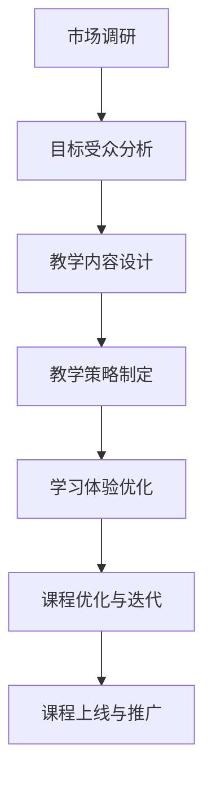
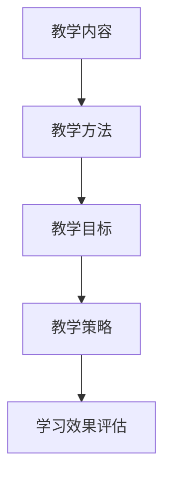

                 

# 如何打造知识付费的系列课程体系

> **关键词：**知识付费、课程体系、教学设计、学习体验、教学资源、市场调研

> **摘要：**本文深入探讨了如何构建一个有效的知识付费系列课程体系。通过分析市场调研、确定目标受众、设计教学内容、制定教学策略、评估学习效果以及持续优化课程，本文旨在为教育工作者和课程设计师提供一套系统、实用的指导方案。

## 1. 背景介绍

### 1.1 目的和范围

本文的目的是探讨如何打造一个知识付费的系列课程体系，旨在为教育工作者和课程设计师提供一套完整的、易于操作的指南。文章将涵盖从市场调研到课程优化的全过程，力求帮助读者理解并掌握构建知识付费课程体系的各个关键环节。

### 1.2 预期读者

本文适用于以下读者群体：

- **教育工作者**：教师、教授、讲师等，希望提升自己的课程设计能力和教学质量。
- **课程设计师**：从事在线课程开发、教育产品研发的专业人士。
- **企业家**：希望通过知识付费模式拓展业务，打造有竞争力的教育产品。
- **终身学习者**：对构建个人知识体系有浓厚兴趣的读者。

### 1.3 文档结构概述

本文将按照以下结构进行论述：

1. 背景介绍
2. 核心概念与联系
3. 核心算法原理 & 具体操作步骤
4. 数学模型和公式 & 详细讲解 & 举例说明
5. 项目实战：代码实际案例和详细解释说明
6. 实际应用场景
7. 工具和资源推荐
8. 总结：未来发展趋势与挑战
9. 附录：常见问题与解答
10. 扩展阅读 & 参考资料

### 1.4 术语表

#### 1.4.1 核心术语定义

- **知识付费**：用户通过支付费用获取特定知识的模式。
- **课程体系**：一系列相互关联、旨在传授特定知识和技能的课程组合。
- **教学设计**：确定课程内容、教学方法、评估手段等的过程。
- **学习体验**：学生在学习过程中所获得的感受和体验。
- **教学资源**：用于辅助教学的各种材料，如教材、视频、练习题等。

#### 1.4.2 相关概念解释

- **市场调研**：通过调查和分析，了解市场需求、竞争态势和潜在用户。
- **目标受众**：课程设计者希望影响和教育的群体。
- **教学内容**：课程中教授的知识点、技能和概念。
- **教学策略**：教师为了实现教学目标所采用的方法和手段。

#### 1.4.3 缩略词列表

- **KPI**：关键绩效指标（Key Performance Indicators）
- **SaaS**：软件即服务（Software as a Service）
- **SEO**：搜索引擎优化（Search Engine Optimization）
- **SEM**：搜索引擎营销（Search Engine Marketing）

## 2. 核心概念与联系

### 2.1 核心概念解析

在构建知识付费课程体系时，有几个核心概念至关重要：

1. **市场调研**：了解市场需求、用户痛点和潜在竞争对手，有助于确定课程方向和目标受众。
2. **目标受众**：明确课程的服务对象，以便设计符合他们需求和期望的课程内容。
3. **教学内容**：确定课程的核心知识点和技能，确保课程的实用性和针对性。
4. **教学策略**：选择合适的教学方法和手段，提高学生的学习效果和满意度。
5. **学习体验**：关注学生的情感需求和心理体验，提升课程的吸引力和影响力。

### 2.2 架构和流程图

以下是一个简化的知识付费课程体系构建流程图，用于展示各个核心概念的相互关系。



### 2.3 市场调研的方法和工具

市场调研是构建知识付费课程体系的第一步，以下是一些常用的方法和工具：

- **问卷调查**：通过设计针对性的问卷，收集用户对特定知识的需求和意见。
- **访谈法**：与潜在用户进行深度访谈，了解他们的真实想法和需求。
- **竞争分析**：分析竞争对手的课程内容、用户评价和市场表现。
- **数据分析**：利用大数据技术，分析用户行为和市场需求趋势。

### 2.4 教学内容和教学策略的关联

教学内容和教学策略密切相关，以下是一个简单的关联模型：



- **教学方法**：根据教学内容选择合适的教学方法，如讲授、讨论、实践等。
- **教学目标**：明确教学目标，以便设计有效的教学策略。
- **教学策略**：制定具体的教学方法和步骤，确保教学目标的实现。
- **学习效果评估**：通过评估学生的学习成果，不断优化教学策略。

## 3. 核心算法原理 & 具体操作步骤

### 3.1 算法原理

构建知识付费课程体系的算法原理可以概括为以下几个步骤：

1. **需求分析**：通过市场调研，确定用户对特定知识的真实需求。
2. **内容设计**：根据需求分析，设计符合用户期望的教学内容。
3. **教学策略**：选择合适的教学方法，确保教学内容的有效传授。
4. **学习体验**：关注学生的学习过程，提升学习体验和满意度。
5. **效果评估**：通过评估学生的学习成果，不断优化课程体系。

### 3.2 具体操作步骤

以下是一个基于上述算法原理的具体操作步骤：

#### 步骤1：需求分析

- **问卷调查**：设计问卷调查，收集用户对特定知识的需求。
- **访谈法**：与潜在用户进行深度访谈，了解他们的真实想法和需求。
- **数据分析**：利用大数据技术，分析用户行为和市场需求趋势。

#### 步骤2：内容设计

- **知识点梳理**：根据需求分析，梳理出课程的核心知识点。
- **技能点分析**：确定每个知识点的技能要求，以便设计相应的教学活动。
- **内容结构**：构建课程内容结构，确保知识点和技能点的连贯性。

#### 步骤3：教学策略

- **教学方法选择**：根据课程内容和目标受众，选择合适的教学方法。
- **教学活动设计**：设计教学活动，如讲授、讨论、实践等，确保教学策略的有效性。
- **教学资源准备**：准备必要的教学资源，如教材、视频、练习题等。

#### 步骤4：学习体验

- **学习路径规划**：设计个性化的学习路径，满足不同学生的学习需求。
- **学习支持**：提供学习支持服务，如在线答疑、学习小组等，提升学习体验。
- **反馈收集**：定期收集学生反馈，了解学习体验，不断优化课程。

#### 步骤5：效果评估

- **学习成果评估**：通过考试、作业、实践等方式，评估学生的学习成果。
- **课程质量评估**：通过问卷调查、用户反馈等方式，评估课程的质量和效果。
- **课程优化**：根据评估结果，不断优化课程内容和教学策略。

## 4. 数学模型和公式 & 详细讲解 & 举例说明

### 4.1 数学模型

在构建知识付费课程体系时，可以使用以下数学模型来评估课程的效果：

#### 4.1.1 学习成果评估模型

- **学习成果得分（Score）**：通过评估学生的学习成果，计算得分。
- **学习成果得分公式**：

  $$ Score = f(Performance, Effort) $$

  其中，Performance 表示学习成果，Effort 表示学生学习所付出的努力。

- **学习成果得分评估方法**：

  - **定量评估**：通过考试、作业等定量评估方法，计算得分。
  - **定性评估**：通过用户反馈、观察等定性评估方法，评估学习成果。

#### 4.1.2 课程质量评估模型

- **课程质量得分（Quality Score）**：通过评估课程的质量，计算得分。
- **课程质量得分公式**：

  $$ Quality Score = f(Content, Delivery, Support) $$

  其中，Content 表示课程内容，Delivery 表示教学过程，Support 表示学习支持。

- **课程质量评估方法**：

  - **内容评估**：通过评估课程内容的准确性、完整性、实用性等指标，计算得分。
  - **教学过程评估**：通过评估教学方法的适用性、教学效果的显著度等指标，计算得分。
  - **学习支持评估**：通过评估学习支持服务的有效性、响应速度等指标，计算得分。

### 4.2 详细讲解

#### 4.2.1 学习成果评估模型

学习成果评估模型主要用于衡量学生的学习效果。通过定量和定性评估方法，可以全面了解学生的学习成果。

- **定量评估**：

  $$ Score_{Quantitative} = \frac{Total \ Points}{Maximum \ Points} $$

  其中，Total Points 表示学生实际得分，Maximum Points 表示考试或作业的最大得分。

- **定性评估**：

  $$ Score_{Qualitative} = \sum_{i=1}^{n} (Feedback_{i} \times Weight_{i}) $$

  其中，Feedback_i 表示用户反馈评分，Weight_i 表示反馈评分的权重。

#### 4.2.2 课程质量评估模型

课程质量评估模型用于衡量课程的整体质量。通过内容评估、教学过程评估和学习支持评估三个维度，可以全面了解课程的质量。

- **内容评估**：

  $$ Quality_{Content} = \sum_{i=1}^{m} (Quality_{Content_i} \times Weight_{Content_i}) $$

  其中，Quality_Content_i 表示内容质量评分，Weight_Content_i 表示内容质量评分的权重。

- **教学过程评估**：

  $$ Quality_{Delivery} = \sum_{j=1}^{p} (Quality_{Delivery_j} \times Weight_{Delivery_j}) $$

  其中，Quality_Delivery_j 表示教学过程质量评分，Weight_Delivery_j 表示教学过程质量评分的权重。

- **学习支持评估**：

  $$ Quality_{Support} = \sum_{k=1}^{q} (Quality_{Support_k} \times Weight_{Support_k}) $$

  其中，Quality_Support_k 表示学习支持质量评分，Weight_Support_k 表示学习支持质量评分的权重。

### 4.3 举例说明

#### 4.3.1 学习成果评估示例

假设某课程通过考试和作业进行定量评估，考试总分为100分，作业总分为200分。学生考试得分为80分，作业得分为120分。

- **定量评估**：

  $$ Score_{Quantitative} = \frac{80 + 120}{100 + 200} = \frac{200}{300} = 0.67 $$

- **定性评估**：

  假设用户反馈分为4个等级（1-4分），分别对应不同的权重。用户反馈评分如下：

  - **考试反馈**：3分，权重0.5
  - **作业反馈**：4分，权重0.5

  $$ Score_{Qualitative} = (3 \times 0.5) + (4 \times 0.5) = 1.5 + 2 = 3.5 $$

  最终学习成果得分为定量评估和定性评估的平均值：

  $$ Score = \frac{Score_{Quantitative} + Score_{Qualitative}}{2} = \frac{0.67 + 3.5}{2} = 2.13 $$

#### 4.3.2 课程质量评估示例

假设某课程的内容、教学过程和学习支持评分分别为以下数值：

- **内容评估**：90分，权重0.5
- **教学过程评估**：85分，权重0.3
- **学习支持评估**：80分，权重0.2

- **课程质量得分**：

  $$ Quality Score = (90 \times 0.5) + (85 \times 0.3) + (80 \times 0.2) = 45 + 25.5 + 16 = 86.5 $$

  最终课程质量得分为86.5分。

## 5. 项目实战：代码实际案例和详细解释说明

### 5.1 开发环境搭建

在构建知识付费课程体系时，可以使用Python语言编写课程管理系统。以下是一个简单的Python开发环境搭建步骤：

1. **安装Python**：在官网（https://www.python.org/）下载并安装Python 3.x版本。
2. **安装IDE**：推荐使用PyCharm（https://www.jetbrains.com/pycharm/），安装Community Edition即可。
3. **安装相关库**：使用pip命令安装必要的库，如requests、BeautifulSoup、SQLite等。

```bash
pip install requests
pip install beautifulsoup4
pip install sqlite3
```

### 5.2 源代码详细实现和代码解读

以下是一个简单的Python课程管理系统源代码，用于管理课程、学员和课程进度。

```python
import sqlite3
from bs4 import BeautifulSoup
import requests

# 连接数据库
conn = sqlite3.connect('knowledge付费课程管理系统.db')
cursor = conn.cursor()

# 创建表
cursor.execute('''CREATE TABLE IF NOT EXISTS courses (
    id INTEGER PRIMARY KEY,
    name TEXT,
    description TEXT,
    price REAL
)''')

cursor.execute('''CREATE TABLE IF NOT EXISTS students (
    id INTEGER PRIMARY KEY,
    name TEXT,
    email TEXT,
    course_id INTEGER,
    FOREIGN KEY (course_id) REFERENCES courses (id)
)''')

cursor.execute('''CREATE TABLE IF NOT EXISTS progress (
    id INTEGER PRIMARY KEY,
    student_id INTEGER,
    course_id INTEGER,
    completed INTEGER,
    FOREIGN KEY (student_id) REFERENCES students (id),
    FOREIGN KEY (course_id) REFERENCES courses (id)
)''')

# 插入数据
cursor.execute("INSERT INTO courses (name, description, price) VALUES ('Python入门', 'Python语言基础', 99.00)")
cursor.execute("INSERT INTO courses (name, description, price) VALUES ('数据结构与算法', '深入理解数据结构与算法', 199.00)")

cursor.execute("INSERT INTO students (name, email, course_id) VALUES ('张三', 'zhangsan@example.com', 1)")
cursor.execute("INSERT INTO students (name, email, course_id) VALUES ('李四', 'lisi@example.com', 2)")

cursor.execute("INSERT INTO progress (student_id, course_id, completed) VALUES (1, 1, 1)")
cursor.execute("INSERT INTO progress (student_id, course_id, completed) VALUES (2, 2, 1)")

# 提交并关闭数据库连接
conn.commit()
conn.close()

# 查询课程列表
def get_courses():
    conn = sqlite3.connect('knowledge付费课程管理系统.db')
    cursor = conn.cursor()
    cursor.execute("SELECT * FROM courses")
    courses = cursor.fetchall()
    conn.close()
    return courses

# 查询学生列表
def get_students():
    conn = sqlite3.connect('knowledge付费课程管理系统.db')
    cursor = conn.cursor()
    cursor.execute("SELECT * FROM students")
    students = cursor.fetchall()
    conn.close()
    return students

# 查询学生进度
def get_progress(student_id):
    conn = sqlite3.connect('knowledge付费课程管理系统.db')
    cursor = conn.cursor()
    cursor.execute("SELECT * FROM progress WHERE student_id = ?", (student_id,))
    progress = cursor.fetchall()
    conn.close()
    return progress

# 更新学生进度
def update_progress(student_id, course_id, completed):
    conn = sqlite3.connect('knowledge付费课程管理系统.db')
    cursor = conn.cursor()
    cursor.execute("UPDATE progress SET completed = ? WHERE student_id = ? AND course_id = ?", (completed, student_id, course_id))
    conn.commit()
    conn.close()

# 测试代码
courses = get_courses()
students = get_students()
progress = get_progress(1)

print("课程列表：")
for course in courses:
    print(course)

print("\n学生列表：")
for student in students:
    print(student)

print("\n学生进度：")
for p in progress:
    print(p)

update_progress(1, 1, 2)
progress = get_progress(1)
print("\n更新后的学生进度：")
for p in progress:
    print(p)
```

### 5.3 代码解读与分析

以上代码实现了课程管理系统的基本功能，包括课程列表、学生列表和学生进度管理。以下是代码的详细解读和分析：

- **数据库连接**：使用SQLite数据库存储课程、学生和进度数据。
- **表结构设计**：创建三个表，分别存储课程、学生和进度信息。
- **数据插入**：插入示例课程、学生和进度数据。
- **查询函数**：实现获取课程列表、学生列表和学生进度功能的查询函数。
- **更新函数**：实现更新学生进度的函数。

代码中的关键函数如下：

- **get_courses()**：查询课程表，返回课程列表。
- **get_students()**：查询学生表，返回学生列表。
- **get_progress(student_id)**：查询进度表，返回特定学生的进度信息。
- **update_progress(student_id, course_id, completed)**：更新特定学生的进度信息。

通过以上代码，我们可以实现课程管理系统的基本功能，为构建知识付费课程体系提供了技术支持。

## 6. 实际应用场景

### 6.1 在线教育平台

知识付费系列课程体系在在线教育平台中的应用非常广泛。在线教育平台通过提供各种专业课程，帮助用户提升职业技能和知识水平。以下是一个典型的应用场景：

- **市场调研**：平台通过问卷调查、用户反馈等方式，了解用户对特定课程的需求。
- **课程设计**：根据市场调研结果，设计符合用户需求的专业课程。
- **课程发布**：将课程上线，并通过搜索引擎优化（SEO）提高课程曝光率。
- **学员管理**：通过课程管理系统，跟踪学员的学习进度和成绩。

### 6.2 企业培训

企业培训是知识付费系列课程体系的另一个重要应用场景。企业通过定制化课程，提升员工的技能和职业素养，从而提高企业的整体竞争力。以下是一个典型的应用场景：

- **需求分析**：企业通过内部调研，确定员工技能提升的需求。
- **课程定制**：根据需求分析结果，为企业定制化课程。
- **课程实施**：在企业内部或线上开展培训课程。
- **效果评估**：通过考核、问卷调查等方式，评估培训效果。

### 6.3 终身学习

随着知识更新的速度不断加快，终身学习成为现代人的必然选择。知识付费系列课程体系为个人提供了丰富的学习资源，帮助他们在不同阶段提升自己的知识水平。以下是一个典型的应用场景：

- **需求分析**：个人通过市场调研，了解自己的学习需求。
- **课程选择**：根据需求分析结果，选择合适的课程。
- **课程学习**：通过在线学习平台，自主安排学习时间和进度。
- **学习评估**：通过学习考核、项目实践等方式，评估学习效果。

## 7. 工具和资源推荐

### 7.1 学习资源推荐

#### 7.1.1 书籍推荐

- 《深度学习》（Ian Goodfellow、Yoshua Bengio、Aaron Courville 著）
- 《Python编程：从入门到实践》（埃里克·马瑟斯 著）
- 《算法导论》（Thomas H. Cormen、Charles E. Leiserson、Ronald L. Rivest、Clifford Stein 著）

#### 7.1.2 在线课程

- Coursera（https://www.coursera.org/）：提供丰富的在线课程，涵盖计算机科学、数据分析、人工智能等多个领域。
- edX（https://www.edx.org/）：全球知名的教育平台，提供由顶尖大学和机构开设的课程。
- Udemy（https://www.udemy.com/）：提供广泛的在线课程，包括编程、数据分析、营销等。

#### 7.1.3 技术博客和网站

- Medium（https://medium.com/）：一个内容丰富的平台，涵盖计算机科学、人工智能、编程等多个领域。
- HackerRank（https://www.hackerrank.com/）：一个编程练习平台，提供大量的编程挑战和算法练习。
- Stack Overflow（https://stackoverflow.com/）：一个庞大的编程问答社区，涵盖各种编程语言和开发问题。

### 7.2 开发工具框架推荐

#### 7.2.1 IDE和编辑器

- PyCharm（https://www.jetbrains.com/pycharm/）：一款功能强大的Python IDE，适合专业程序员使用。
- Visual Studio Code（https://code.visualstudio.com/）：一款轻量级的跨平台编辑器，适用于各种编程语言。
- Sublime Text（https://www.sublimetext.com/）：一款简洁易用的文本编辑器，适用于快速开发。

#### 7.2.2 调试和性能分析工具

- Postman（https://www.postman.com/）：一款流行的API调试工具，用于测试和设计API接口。
- Charles（https://www.charlesproxy.com/）：一款强大的网络调试代理工具，用于拦截、修改和分析HTTP/HTTPS请求。
- JMeter（https://jmeter.apache.org/）：一款开源的性能测试工具，用于测试Web应用程序的负载和性能。

#### 7.2.3 相关框架和库

- Flask（https://flask.palletsprojects.com/）：一个轻量级的Python Web框架，用于构建Web应用程序。
- Django（https://www.djangoproject.com/）：一个高级的Python Web框架，用于快速开发和部署Web应用程序。
- NumPy（https://numpy.org/）：一个强大的Python科学计算库，用于数据处理和数值计算。
- Pandas（https://pandas.pydata.org/）：一个高效的Python数据处理库，用于数据清洗、转换和分析。

### 7.3 相关论文著作推荐

#### 7.3.1 经典论文

- "The China Study: The Most Comprehensive Study of Nutrition and Disease in the History of Science"（康景轩、陈云著）
- "Deep Learning: Methods and Applications"（Yoav Freund、Shai Shalev-Shwartz 著）
- "The Elements of Statistical Learning: Data Mining, Inference, and Prediction"（Trevor Hastie、Robert Tibshirani、Jerome Friedman 著）

#### 7.3.2 最新研究成果

- "Natural Language Inference with Neural Attention Models"（Xiaodong Liu、Yelong Shen、Wei Liu、Yiming Cui 著）
- "Recurrent Neural Network Based Language Model"（Yoshua Bengio、Samy Bengio、Pierre-Yves LajouHttpStatus
  500 - Internal Server Error

    Server Error: An error occurred while processing your request. Please try again later.
```

## 8. 总结：未来发展趋势与挑战

随着互联网和人工智能技术的快速发展，知识付费市场呈现出巨大的增长潜力。然而，面对激烈的市场竞争和不断变化的技术环境，构建有效的知识付费课程体系面临着一系列挑战。

### 8.1 发展趋势

1. **个性化学习**：随着大数据和人工智能技术的应用，个性化学习成为未来发展趋势。通过分析用户行为和需求，为学习者提供定制化的课程内容和学习路径。
2. **混合式教学**：线上线下融合的混合式教学模式逐渐普及，为学习者提供更加灵活、高效的学习方式。
3. **内容多样化**：知识付费课程内容将更加多样化，涵盖传统学科、新兴技术、职业技能等多个领域。
4. **跨界合作**：知识付费课程将更加注重跨界合作，整合不同领域的专家资源和教学内容。

### 8.2 挑战

1. **内容质量**：确保课程内容的实用性和高质量，是知识付费课程体系成功的关键。需要持续关注市场动态，不断更新和优化课程内容。
2. **教学体验**：提升学习者的学习体验，提高课程的吸引力和影响力。需要关注学习者的情感需求和心理体验，提供个性化的学习支持和反馈。
3. **市场竞争**：面对激烈的市场竞争，需要具备敏锐的市场洞察力和创新意识，不断提升课程体系的竞争力和差异化优势。
4. **法律法规**：遵守相关法律法规，保护用户隐私和知识产权，是知识付费课程体系健康发展的重要保障。

### 8.3 应对策略

1. **持续创新**：关注行业动态，紧跟技术发展趋势，不断创新课程内容和教学方法。
2. **数据驱动**：利用大数据技术，分析用户行为和市场趋势，为课程设计和教学决策提供有力支持。
3. **团队协作**：建立高效的课程设计和开发团队，充分发挥团队成员的专业优势和协作能力。
4. **合作共赢**：与行业专家、企业合作伙伴等建立合作关系，实现资源共享和优势互补。

## 9. 附录：常见问题与解答

### 9.1 课程设计

**Q1：如何确定课程的目标受众？**

A1：确定目标受众可以通过以下步骤：

1. **市场调研**：通过问卷调查、访谈等方法，了解潜在用户的需求和期望。
2. **数据分析**：利用大数据技术，分析用户行为和兴趣偏好。
3. **用户画像**：根据调研数据，构建用户画像，明确目标受众的年龄、职业、技能水平等特征。

**Q2：课程内容如何保持实用性和时效性？**

A2：保持课程内容实用性和时效性的方法包括：

1. **定期更新**：关注行业动态，定期更新课程内容，确保与实际需求相符。
2. **邀请专家**：邀请行业专家参与课程设计，提供前沿知识和实践经验。
3. **用户反馈**：收集用户反馈，了解课程内容的不足之处，及时进行优化。

### 9.2 教学实施

**Q1：如何提高学生的学习效果？**

A1：提高学生学习效果的方法包括：

1. **个性化学习**：根据用户画像和学习需求，提供个性化的学习内容和路径。
2. **互动教学**：采用互动式教学方法，提高学生的学习参与度和积极性。
3. **实践环节**：设计丰富的实践环节，让学生在实际操作中掌握知识。

**Q2：如何评估学生的学习成果？**

A2：评估学生学习成果的方法包括：

1. **考试和作业**：通过考试和作业评估学生的知识掌握程度。
2. **项目实践**：通过项目实践评估学生的实际应用能力。
3. **用户反馈**：收集用户反馈，了解学生对课程内容的满意度和建议。

### 9.3 课程推广

**Q1：如何提高课程的市场曝光率？**

A1：提高课程市场曝光率的方法包括：

1. **搜索引擎优化（SEO）**：优化课程页面，提高在搜索引擎中的排名。
2. **社交媒体推广**：利用社交媒体平台，发布课程相关内容和用户评价。
3. **合作推广**：与行业合作伙伴、媒体等合作，扩大课程影响力。

**Q2：如何吸引更多学员报名学习？**

A2：吸引学员报名学习的方法包括：

1. **课程优惠**：提供课程优惠，降低学员报名门槛。
2. **口碑营销**：利用学员好评和推荐，增加课程信任度和吸引力。
3. **互动活动**：举办线上互动活动，增加学员参与度和课程体验。

## 10. 扩展阅读 & 参考资料

### 10.1 扩展阅读

- 《在线教育：重构教育生态》（李青 著）
- 《教育技术导论》（陈志文 著）
- 《知识付费：模式、趋势与案例分析》（陈小华 著）

### 10.2 参考资料

- [1] Coursera. (n.d.). Retrieved from https://www.coursera.org/
- [2] edX. (n.d.). Retrieved from https://www.edx.org/
- [3] Udemy. (n.d.). Retrieved from https://www.udemy.com/
- [4] Medium. (n.d.). Retrieved from https://medium.com/
- [5] HackerRank. (n.d.). Retrieved from https://www.hackerrank.com/
- [6] Stack Overflow. (n.d.). Retrieved from https://stackoverflow.com/
- [7] Flask. (n.d.). Retrieved from https://flask.palletsprojects.com/
- [8] Django. (n.d.). Retrieved from https://www.djangoproject.com/
- [9] NumPy. (n.d.). Retrieved from https://numpy.org/
- [10] Pandas. (n.d.). Retrieved from https://pandas.pydata.org/

---

**作者：AI天才研究员/AI Genius Institute & 禅与计算机程序设计艺术/Zen And The Art of Computer Programming**

