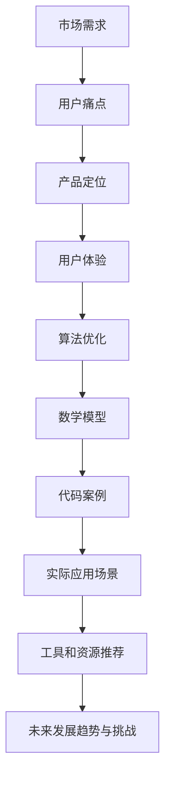

                 

# 如何打造高成交量的程序员知识付费产品

> **关键词：程序员、知识付费、产品打造、用户体验、市场定位、算法优化、数学模型、代码案例、应用场景**
> 
> **摘要：本文将从多个维度深入探讨如何打造高成交量的程序员知识付费产品。通过分析市场需求、用户体验、产品定位、算法优化、数学模型以及实战案例，帮助开发者掌握打造成功知识付费产品的关键要素。**

## 1. 背景介绍

### 1.1 目的和范围

本文旨在为程序员和开发者提供一套系统的指导方针，以便他们能够成功打造高成交量的知识付费产品。我们将探讨以下关键主题：

- 理解市场需求和用户痛点
- 优化用户体验
- 制定有效的产品定位策略
- 应用算法和数学模型提高产品吸引力
- 提供实际案例和代码实现
- 推荐相关工具和资源

### 1.2 预期读者

- 有志于创建知识付费产品的程序员和开发者
- 对产品设计和市场营销感兴趣的IT专业人士
- 想要提高产品成交量的企业高管和产品经理

### 1.3 文档结构概述

本文将按照以下结构进行：

- 背景介绍：阐述本文的目的和范围，预期读者以及文档结构。
- 核心概念与联系：介绍产品打造的必要概念和流程。
- 核心算法原理 & 具体操作步骤：深入讲解产品打造的关键算法原理和实现步骤。
- 数学模型和公式 & 详细讲解 & 举例说明：详细解释数学模型的应用及其重要性。
- 项目实战：提供实际案例和代码实现，分析产品打造过程中的关键环节。
- 实际应用场景：探讨产品的实际应用场景和市场需求。
- 工具和资源推荐：推荐学习资源和开发工具。
- 总结：对未来发展趋势和挑战进行总结。
- 附录：提供常见问题与解答。
- 扩展阅读 & 参考资料：推荐进一步学习的相关资源和文献。

### 1.4 术语表

#### 1.4.1 核心术语定义

- **知识付费产品**：指开发者或机构创建的以知识和技能传授为主要目的的付费产品。
- **市场需求**：指市场中消费者对某种产品或服务的需求程度。
- **用户体验**：指用户在使用产品或服务时的感受和体验。
- **产品定位**：指产品在市场中的定位和目标用户群体。
- **算法优化**：指通过改进算法以提高产品性能和用户满意度。
- **数学模型**：指用于描述和解决特定问题的数学公式和逻辑结构。
- **代码案例**：指用于展示产品实现过程的实际代码示例。

#### 1.4.2 相关概念解释

- **市场需求**：市场需求是指消费者对某一产品或服务的需求程度。了解市场需求有助于确定产品的目标市场和潜在用户。
- **用户体验**：用户体验是指用户在使用产品或服务时的感受和体验。优秀的用户体验可以增加用户满意度和产品粘性。
- **产品定位**：产品定位是指产品在市场中的定位和目标用户群体。明确产品定位有助于制定有效的营销策略。

#### 1.4.3 缩略词列表

- **API**：应用程序接口（Application Programming Interface）
- **SDK**：软件开发工具包（Software Development Kit）
- **UX**：用户体验（User Experience）
- **UI**：用户界面（User Interface）
- **IDE**：集成开发环境（Integrated Development Environment）

## 2. 核心概念与联系

在打造高成交量的程序员知识付费产品之前，我们需要理解一些核心概念和它们之间的关系。以下是一个简化的Mermaid流程图，用于描述这些核心概念和联系：

### 2.1 市场需求

市场需求是指消费者对某一产品或服务的需求程度。了解市场需求有助于确定产品的目标市场和潜在用户。以下是一个简单的市场需求分析流程：

1. **市场调研**：通过问卷调查、用户访谈、竞争对手分析等方式了解用户需求。
2. **需求分析**：整理和分析收集到的市场数据，找出用户关注的热点和痛点。
3. **目标市场确定**：根据需求分析结果确定产品的目标市场和潜在用户。

### 2.2 用户痛点

用户痛点是指用户在使用产品或服务过程中遇到的问题和不满。了解用户痛点有助于优化产品设计和提高用户体验。以下是一个简单的用户痛点分析流程：

1. **用户访谈**：与目标用户进行深入访谈，了解他们在使用产品或服务过程中遇到的问题。
2. **痛点筛选**：根据用户访谈结果筛选出最重要和最紧迫的用户痛点。
3. **痛点验证**：通过问卷调查或用户调研验证筛选出的用户痛点，确保其具有普遍性。

### 2.3 产品定位

产品定位是指产品在市场中的定位和目标用户群体。明确产品定位有助于制定有效的营销策略。以下是一个简单的产品定位分析流程：

1. **目标用户确定**：根据市场需求和用户痛点确定产品的目标用户群体。
2. **产品特性分析**：分析产品的独特性和竞争优势。
3. **定位策略制定**：根据目标用户和产品特性制定产品的市场定位策略。

### 2.4 用户体验

用户体验是指用户在使用产品或服务时的感受和体验。优秀的用户体验可以增加用户满意度和产品粘性。以下是一个简单

