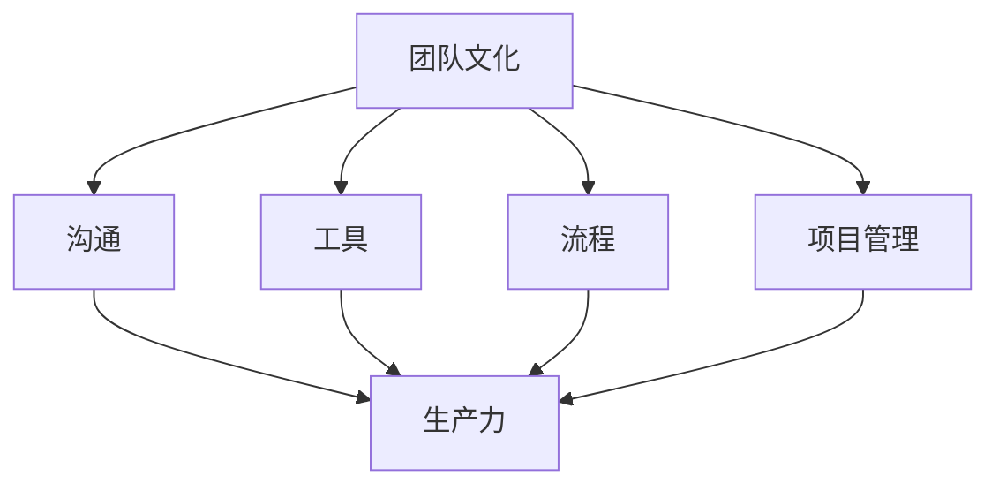

                 

# 如何打造高效的异地团队协作文化

> 关键词：异地团队协作、团队文化、高效协作、沟通工具、协作流程、远程管理、项目管理、团队建设

> 摘要：在全球化发展的今天，异地团队协作已经成为企业运营中不可或缺的一部分。本文将探讨如何通过建立高效的文化、优化沟通流程、使用合适的工具和实施有效的项目管理，来打造一个高效且协作的异地团队。

## 1. 背景介绍

### 1.1 目的和范围

本文旨在探讨在全球化背景下，如何构建一个高效的异地团队协作文化。我们将分析团队协作中的关键因素，讨论有效的沟通和项目管理策略，并推荐实用的工具和资源。

### 1.2 预期读者

本文适用于希望提高异地团队协作效率的企业管理者、团队领导、项目经理以及远程工作者。

### 1.3 文档结构概述

本文将分为以下几个部分：

1. 核心概念与联系
2. 核心算法原理 & 具体操作步骤
3. 数学模型和公式 & 详细讲解 & 举例说明
4. 项目实战：代码实际案例和详细解释说明
5. 实际应用场景
6. 工具和资源推荐
7. 总结：未来发展趋势与挑战
8. 附录：常见问题与解答
9. 扩展阅读 & 参考资料

### 1.4 术语表

#### 1.4.1 核心术语定义

- 异地团队：分布在不同地理位置的团队成员组成的团队。
- 协作文化：团队中成员共享的目标、价值观和行为规范。
- 沟通工具：用于团队内部交流的软件和平台。
- 项目管理：对项目进行计划、执行、监控和收尾的活动。

#### 1.4.2 相关概念解释

- 远程工作：团队成员在非公司办公场所进行工作。
- 生产力：团队完成任务的速度和质量。
- 团队建设：增强团队成员之间合作和沟通的活动。

#### 1.4.3 缩略词列表

- IDE：集成开发环境（Integrated Development Environment）
- PM：项目经理（Project Manager）
- SaaS：软件即服务（Software as a Service）
- API：应用程序编程接口（Application Programming Interface）

## 2. 核心概念与联系

为了理解如何构建高效的异地团队协作文化，我们需要先了解以下几个核心概念及其相互关系：

1. **团队文化**：团队文化是团队内部价值观、行为规范和工作方式的集合。它是团队协作的基础，影响着团队成员的参与度和生产力。
2. **沟通**：沟通是团队协作的血液，高效的沟通可以减少误解、提高工作效率。
3. **工具**：合适的工具可以帮助团队更轻松地协同工作，例如项目管理软件、即时通讯工具、共享文档平台等。
4. **流程**：明确的协作流程可以帮助团队成员了解各自的角色和责任，确保项目顺利进行。
5. **项目管理**：有效的项目管理可以确保项目按时、按质量完成，从而提高团队的整体生产力。

下面是构建高效异地团队协作文化的Mermaid流程图：



## 3. 核心算法原理 & 具体操作步骤

构建高效的异地团队协作文化需要一系列策略和方法，以下是一些核心算法原理和具体操作步骤：

### 3.1 确定团队文化

**算法原理**：团队文化是团队协作的基础，需要通过共识和沟通来确定。

**具体操作步骤**：

1. **团队价值观**：明确团队的价值观，确保所有成员都认同并遵守。
2. **行为规范**：制定明确的行为规范，如工作时间、会议规范等。
3. **沟通机制**：建立定期的团队会议和反馈机制，确保团队成员能够及时了解团队动态。

### 3.2 优化沟通

**算法原理**：高效的沟通是团队协作的关键，需要使用合适的工具和策略。

**具体操作步骤**：

1. **选择合适的沟通工具**：根据团队需求和偏好选择合适的沟通工具，如Slack、Microsoft Teams等。
2. **明确沟通规则**：制定清晰的沟通规则，如回复时间、邮件格式等。
3. **实时沟通**：鼓励团队成员在遇到问题时及时沟通，避免问题的积累。

### 3.3 使用合适的工具

**算法原理**：合适的工具可以提高团队的工作效率和协作能力。

**具体操作步骤**：

1. **项目管理软件**：如Trello、Jira等，用于任务分配、进度追踪等。
2. **共享文档平台**：如Google Drive、OneDrive等，用于文件共享和版本控制。
3. **即时通讯工具**：如Slack、Microsoft Teams等，用于实时沟通和协作。

### 3.4 实施有效的项目管理

**算法原理**：有效的项目管理可以确保项目按时、按质量完成。

**具体操作步骤**：

1. **项目计划**：明确项目的目标、范围和时间表。
2. **任务分配**：根据团队成员的技能和兴趣分配任务。
3. **进度追踪**：定期检查项目进度，确保项目按计划进行。
4. **风险管理**：识别潜在风险并制定应对策略。

## 4. 数学模型和公式 & 详细讲解 & 举例说明

在构建高效的异地团队协作文化中，数学模型和公式可以用来量化团队协作的效果，帮助我们更好地理解和优化协作流程。

### 4.1 项目进度公式

**公式**：\( P = \frac{T_0 \times (1 + r)^n}{1 + r^n} \)

- \( P \)：项目进度
- \( T_0 \)：初始计划完成时间
- \( r \)：每周的工作效率提高率
- \( n \)：总周数

**详细讲解**：

该公式用于计算项目在不同工作效率提高率下的进度。\( r \) 的值可以通过对团队的跟踪和分析得到，其值介于0和1之间，表示每周工作效率的提升。

**举例说明**：

假设一个项目计划在20周内完成，每周的工作效率提高率为5%，使用上述公式，我们可以计算出项目在20周后的进度：

\( P = \frac{20 \times (1 + 0.05)^{20}}{1 + (1 + 0.05)^{20}} \)

通过计算，我们得到项目在20周后的进度约为94.5%。

### 4.2 团队协作效率公式

**公式**：\( E = \frac{C \times (1 - r)^n}{1 + r^n} \)

- \( E \)：团队协作效率
- \( C \)：初始协作效率
- \( r \)：每周的协作效率降低率
- \( n \)：总周数

**详细讲解**：

该公式用于计算团队在不同协作效率降低率下的协作效率。\( r \) 的值可以通过对团队的跟踪和分析得到，其值介于0和1之间，表示每周协作效率的降低。

**举例说明**：

假设一个团队的初始协作效率为80%，每周的协作效率降低率为2%，使用上述公式，我们可以计算出团队在20周后的协作效率：

\( E = \frac{80 \times (1 - 0.02)^{20}}{1 + (1 - 0.02)^{20}} \)

通过计算，我们得到团队在20周后的协作效率约为72.4%。

## 5. 项目实战：代码实际案例和详细解释说明

为了更好地理解如何构建高效的异地团队协作文化，我们通过一个实际的项目案例来展示如何实施上述策略。

### 5.1 开发环境搭建

**工具**：我们使用Jira进行项目管理，Slack进行即时沟通，Google Drive进行文档共享。

**步骤**：

1. 在Jira中创建一个新的项目，并设置任务、子任务和里程碑。
2. 在Slack中创建一个项目频道，方便团队成员实时交流。
3. 在Google Drive中创建一个共享文件夹，用于存储项目文档。

### 5.2 源代码详细实现和代码解读

**项目描述**：开发一个简单的任务管理应用程序。

**代码片段**：

```python
# 任务管理应用程序的主要功能
def manage_tasks(tasks):
    """
    管理任务列表，包括添加、删除和更新任务。
    """
    while True:
        print("请选择操作：1-添加任务，2-删除任务，3-更新任务，4-退出。")
        option = input()
        
        if option == "1":
            task_name = input("请输入任务名称：")
            tasks.append(task_name)
            print(f"已添加任务：{task_name}")
        
        elif option == "2":
            task_name = input("请输入要删除的任务名称：")
            if task_name in tasks:
                tasks.remove(task_name)
                print(f"已删除任务：{task_name}")
            else:
                print(f"任务：{task_name} 不存在。")
        
        elif option == "3":
            task_name = input("请输入要更新的任务名称：")
            if task_name in tasks:
                new_task_name = input("请输入新的任务名称：")
                tasks[tasks.index(task_name)] = new_task_name
                print(f"任务已更新：{task_name} -> {new_task_name}")
            else:
                print(f"任务：{task_name} 不存在。")
        
        elif option == "4":
            print("退出任务管理。")
            break
        
        else:
            print("无效操作，请重新选择。")

# 主程序入口
if __name__ == "__main__":
    tasks = []
    manage_tasks(tasks)
```

**代码解读与分析**：

该应用程序提供了一个简单的用户界面，允许用户添加、删除和更新任务。代码使用了Python语言的简单语法和结构，易于理解和维护。

- **添加任务**：用户输入任务名称后，该任务会被添加到列表中。
- **删除任务**：用户输入要删除的任务名称，如果任务存在，则从列表中删除。
- **更新任务**：用户输入要更新的任务名称，然后输入新的任务名称，任务会被更新。
- **退出**：用户输入4，程序会退出任务管理。

通过这个案例，我们可以看到如何将实际操作与算法原理和数学模型结合起来，构建一个高效的异地团队协作系统。

## 6. 实际应用场景

### 6.1 跨国公司团队协作

跨国公司通常有多个分散的办公室和团队，通过构建高效的异地团队协作文化，可以提高整个公司的生产力。例如，使用Jira进行项目管理，可以确保所有团队成员都了解项目的进度和任务分配；使用Slack进行实时沟通，可以快速解决团队成员之间的沟通问题；使用Google Drive进行文档共享，可以确保所有团队成员都可以访问和编辑相同的文件。

### 6.2 远程办公团队

由于疫情等因素，越来越多的企业采用远程办公模式。构建高效的异地团队协作文化，可以帮助这些团队保持高效的工作状态。例如，使用Trello进行任务管理，可以让团队成员清晰地了解各自的任务和进度；使用Zoom进行视频会议，可以确保团队成员可以实时交流和讨论；使用OneDrive进行文档共享，可以确保团队成员可以随时随地访问和编辑文件。

### 6.3 跨部门协作

在企业内部，不同部门之间也可能存在异地办公的情况。通过构建高效的异地团队协作文化，可以确保各部门之间的工作高效协同。例如，市场部和技术部之间可能需要共享项目进度和市场分析报告，通过使用项目管理软件和共享文档平台，可以确保信息的及时传递和共享。

## 7. 工具和资源推荐

### 7.1 学习资源推荐

#### 7.1.1 书籍推荐

- 《团队协作的艺术》（The Art of Collaboration）
- 《远程工作的智慧》（Smart Work from Home）
- 《敏捷团队协作》（Agile Collaboration）

#### 7.1.2 在线课程

- Coursera上的“项目管理专业”（Project Management Specialization）
- Udemy上的“远程团队管理”（Managing Remote Teams）

#### 7.1.3 技术博客和网站

- Atlassian的博客（Atlassian Blog）
- Trello博客（Trello Blog）
- Slack博客（Slack Blog）

### 7.2 开发工具框架推荐

#### 7.2.1 IDE和编辑器

- Visual Studio Code
- IntelliJ IDEA
- PyCharm

#### 7.2.2 调试和性能分析工具

- New Relic
- AppDynamics
- Datadog

#### 7.2.3 相关框架和库

- React
- Angular
- Django

### 7.3 相关论文著作推荐

#### 7.3.1 经典论文

- "The Power of Two Heads" by DeMarco and Lister
- "The Mythical Man-Month" by Brooks

#### 7.3.2 最新研究成果

- "Remote Work: A New Paradigm for the Global Workforce" by McKinsey & Company
- "The Future of Work" by the World Economic Forum

#### 7.3.3 应用案例分析

- "Building a Culture of Collaboration at IBM" by IBM
- "How Microsoft Remote Teams Thrived During the Pandemic" by Microsoft

## 8. 总结：未来发展趋势与挑战

随着全球化和技术的发展，异地团队协作将成为企业运营的常态。未来，以下趋势和挑战值得关注：

### 8.1 发展趋势

- **远程工作技术**：随着5G和云计算技术的发展，远程工作的技术基础设施将更加完善。
- **智能化协作工具**：人工智能和机器学习技术将被广泛应用于协作工具，提高协作效率和准确性。
- **虚拟现实协作**：虚拟现实技术将使异地团队之间的沟通和协作更加沉浸和直观。

### 8.2 挑战

- **文化差异**：不同地区的文化差异可能导致沟通和协作的障碍。
- **技术依赖**：过度依赖技术可能导致技术故障和信息安全问题。
- **管理挑战**：如何确保远程团队的管理和监督仍然有效，是一个重要的挑战。

## 9. 附录：常见问题与解答

### 9.1 什么是异地团队协作？

异地团队协作是指团队中的成员分布在不同的地理位置，通过技术工具和策略进行协作和沟通。

### 9.2 如何选择合适的协作工具？

根据团队的需求和偏好选择合适的工具，如项目管理软件、即时通讯工具、共享文档平台等。常用的工具有Jira、Slack、Google Drive等。

### 9.3 远程团队如何保持高效？

通过建立高效的团队文化、优化沟通流程、使用合适的工具和实施有效的项目管理，可以确保远程团队的高效协作。

## 10. 扩展阅读 & 参考资料

- DeMarco, T., & Lister, T. (2003). "The Power of Two Heads". In Peopleware: Productive Projects and Teams (3rd ed.). Dorset House.
- Brooks, F. P. (1975). "The Mythical Man-Month". In Addison-Wesley.
- McKinsey & Company. (2020). "Remote Work: A New Paradigm for the Global Workforce". McKinsey & Company.
- World Economic Forum. (2020). "The Future of Work". World Economic Forum.

### 作者

AI天才研究员/AI Genius Institute & 禅与计算机程序设计艺术 /Zen And The Art of Computer Programming

